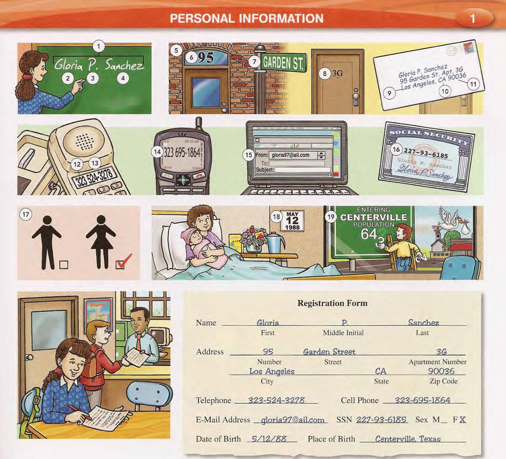

# UNIT 1 - PERSONAL INFORMATION

1.  name
2.  first name
3.  middle initial
4.  last name/family name/surname
5.  address
6.  street number
7.  street
8.  apartment number
9.  city
10. state
11. zip code
12. area code
13. telephone number / phone number
14. cell phone number
15. e-mail address
16. social security number
17. sex
18. date of birth
19. place of birth

---

**Example Dialogues:**

A. What's your name?
B. Gloria P. Sanchez.

---

## SHORT STORY 

Applying for the new library card required providing a lot of **personal information**. I sat down at the desk, form in hand, and began filling it out carefully. First, my full **name**. My **first name** is Clara, and I wrote it clearly. I don't have a **middle initial**, so I left that blank. My **last name**, or **family name**, is Davies.

Next was my **address**. I wrote down the **street number**, 789, followed by the **street** name, Maple Avenue. Since I live in an apartment building, I included my **apartment number**, 3C. I then added my **city**, Greenfield, and the **state**, Illinois. Finally, the **zip code** for my area.

The form also asked for contact details. I provided my **area code** and **telephone number**, though I mostly use my **cell phone number** these days, which I also listed. My **e-mail address** was next, ensuring they could send me notifications about borrowed books.

The final section was more sensitive. It requested my **social security number**, my **sex**, and my **date of birth**. I also had to state my **place of birth**. Filling out all this detail felt a bit intrusive for just a library card, but I understood the need for accurate records. Once completed, I handed the form to the librarian, ready to explore the world of books.