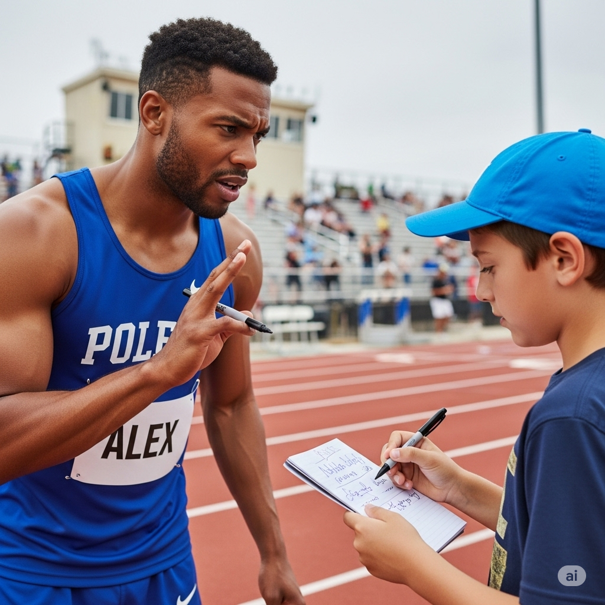

# Essential English Word 4
# Unit 13
## 1. affect v
### định nghĩa
ảnh hưởng đến (làm thay đổi cái gì đó).

The weather affects my mood.

She is affecting the outcome.

They have affected the results.

The rain affected our plans.

We were affected by the news.

Before, it had not affected me.

It will affect you later.

It is going to affect the price.

It can affect your health.

You should not let it affect you.

I would be affected by that.

Does it affect you?

------------

## 2. autograph n
### định nghĩa
chữ ký của người nổi tiếng.

He got an autograph.

She is asking for an autograph.

They have collected many autographs.

He got her autograph after the show.

We were waiting for autographs.

Before, I had not gotten an autograph.

You will get his autograph.

I am going to get an autograph.

An autograph is a signature.

You should ask politely for an autograph.

I would frame the autograph.

Can I have your autograph?

------------

## 3. bead n
### định nghĩa
hạt (vật nhỏ, tròn, thường có lỗ để xâu dây).

She is wearing beads.

He is counting the beads.

They have used beads to make a necklace.

She found a lost bead.

We were stringing beads together.

Before, I had not worked with beads.

You will need more beads.

I am going to buy some beads.

A bead can be made of glass.

You should be careful not to drop the beads.

I would make a bracelet with these beads.

Pick up the beads.

------------

## 4. brew v
### định nghĩa
pha (trà, cà phê); ủ (bia); sắp xảy ra (điều gì đó không tốt).

She brews tea.

He is brewing coffee.

They have brewed their own beer.

She brewed a strong cup of tea.

We were brewing a new type of coffee.

Before, I had not brewed beer.

You will brew the tea.

I am going to brew some coffee.

You can brew it hot.

You should brew it for five minutes.

I would brew a large pot.

Brew the coffee.

------------

## 5. charm v
### định nghĩa
làm say đắm, mê hoặc; dùng bùa chú.

He charms everyone.

She is charming the audience.

They have been charmed by his manners.

He charmed her with his smile.

We were charmed by the beautiful place.

Before, I had not been charmed.

You will charm them.

I am going to charm the snake.

You can charm people.

You should use your charm wisely.

I would be charmed by a kind person.

He can charm anyone.

------------

## 6. destiny n
### định nghĩa
vận mệnh, số phận (điều được cho là sẽ xảy ra trong tương lai).

It is his destiny.

She is believing in destiny.

They have accepted their destiny.

He felt it was his destiny to be a doctor.

We were talking about destiny.

Before, I had not thought about destiny.

You will fulfill your destiny.

It is going to be my destiny.

Destiny is a powerful idea.

You should not leave everything to destiny.

I would try to control my destiny.

Is it destiny?

------------

## 7. horn n
### định nghĩa
sừng (trên đầu động vật); còi (xe); kèn (nhạc cụ).

The bull has big horns.

She is blowing the horn.

They have a car with a loud horn.

He saw an animal with horns.

We were listening to the car horns.

Before, I had not seen such large horns.

You will hear the horn.

I am going to honk the horn.

A horn can be sharp.

You should not touch the animal's horns.

I would play the horn.

Blow the horn.

------------

## 8. irritable adj
### định nghĩa
dễ cáu kỉnh, khó chịu.

He is irritable today.

She is feeling irritable.

They have been irritable lately.

He was irritable because he didn't sleep.

We were dealing with an irritable customer.

Before, I had not been so irritable.

You will feel irritable if you are tired.

He is going to be irritable.

You can be irritable.

You should try not to be irritable.

I would feel irritable in that situation.

Don't be irritable.

------------

## 9. lag v
### định nghĩa
chậm lại, tụt hậu; độ trễ (trong kết nối mạng).

He lags behind.

She is lagging in her studies.

The computer has lagged.

He lagged behind the others.

We were lagging because of the slow internet.

Before, I had not lagged.

You will lag if you don't hurry.

The game is going to lag.

It can lag.

You should not lag behind.

I would lag if I was tired.

Don't lag.

------------

## 10. maximize v
### định nghĩa
tối đa hóa (làm cho cái gì đó lớn nhất hoặc tốt nhất có thể).

He wants to maximize profits.

She is maximizing her potential.

They have maximized their efforts.

He maximized his score.

We were trying to maximize efficiency.

Before, I had not maximized it.

You will maximize your chances.

I am going to maximize the space.

You can maximize your performance.

You should maximize your opportunities.

I would maximize the benefits.

Maximize your effort.

------------

## 11. nightmare n
### định nghĩa
cơn ác mộng (giấc mơ đáng sợ); trải nghiệm tồi tệ.

He had a nightmare.

She is having a nightmare.

They have experienced a nightmare.

He woke up from a nightmare.

We were talking about the nightmare.

Before, I had not had a nightmare.

You will have a nightmare.

It is going to be a nightmare.

A nightmare can be scary.

You should try to forget the nightmare.

I would not want to have a nightmare.

It was a nightmare.

------------

## 12. nutritious adj
### định nghĩa
bổ dưỡng (tốt cho sức khỏe).

This food is nutritious.

She is eating a nutritious meal.

They have nutritious snacks.

He ate a nutritious breakfast.

We were looking for nutritious options.

Before, I had not eaten such nutritious food.

You will need nutritious food.

It is going to be nutritious.

It can be very nutritious.

You should eat nutritious food.

I would choose the most nutritious option.

Eat something nutritious.

------------

## 13. protein n
### định nghĩa
chất đạm (một chất cần thiết cho cơ thể, có trong thịt, trứng, đậu).

Meat has protein.

She is eating more protein.

They have enough protein in their diet.

He ate protein after his workout.

We were discussing sources of protein.

Before, I had not eaten much protein.

You will need protein to build muscle.

I am going to eat more protein.

Protein is good for you.

You should eat enough protein.

I would add more protein to my meal.

Eat protein.

------------

## 14. signature n
### định nghĩa
chữ ký (tên viết tay của bạn).

Write your signature here.

She is practicing her signature.

They have collected signatures.

He put his signature on the document.

We were checking the signatures.

Before, I had not needed a signature.

You will need your signature.

I am going to add my signature.

A signature proves who you are.

You should sign with your signature.

I would recognize his signature.

Put your signature here.

------------

## 15. stuff n
### định nghĩa
đồ đạc, thứ linh tinh; chất liệu.

Put your stuff away.

She is packing her stuff.

They have a lot of stuff.

He left his stuff here.

We were moving our stuff.

Before, I had not had so much stuff.

You will need your stuff.

I am going to organize my stuff.

Stuff can be anything.

You should clean up your stuff.

I would throw away old stuff.

Where is my stuff?

------------

## 16. subconscious adj
### định nghĩa
tiềm thức (phần tâm trí mà bạn không nhận thức được).

It is in his subconscious.

She is exploring her subconscious mind.

They have subconscious fears.

He had a subconscious thought.

We were talking about the subconscious.

Before, I had not thought about the subconscious.

You will understand your subconscious.

It is going to affect your subconscious.

The subconscious works automatically.

You should pay attention to your subconscious.

I would try to understand my subconscious.

It's subconscious.

------------

## 17. van n
### định nghĩa
xe tải nhỏ, xe van.

He drives a van.

She is loading the van.

They have a new van.

He parked the van outside.

We were traveling in a van.

Before, I had not driven a van.

You will need a van to move.

I am going to buy a van.

A van can carry many things.

You should check the van's tires.

I would rent a van.

Load the van.

------------

## 18. warn v
### định nghĩa
cảnh báo (nói với ai đó về nguy hiểm hoặc vấn đề).

He warns them.

She is warning us.

They have warned him.

He warned me about the danger.

We were warning everyone.

Before, I had not warned anyone.

You will warn her.

I am going to warn you.

You can warn people.

You should warn others about risks.

I would warn you if I saw a problem.

Warn him.

------------

## 19. workout n
### định nghĩa
buổi tập thể dục.

He does a workout every day.

She is doing a workout.

They have finished their workout.

He had a hard workout.

We were doing a workout at the gym.

Before, I had not done a workout.

You will do a workout tomorrow.

I am going to do a workout.

A workout can be short.

You should do a regular workout.

I would do a workout in the morning.

Do your workout.

------------

## 20. zoom v
### định nghĩa
phóng to (hình ảnh); di chuyển rất nhanh.

He zooms in on the picture.

She is zooming across the road.

They have zoomed past us.

He zoomed in on the face.

We were zooming down the hill.

Before, I had not zoomed.

You will zoom in.

I am going to zoom out.

You can zoom in or out.

You should zoom in to see the details.

I would zoom in on

-------------

## THE BIG RACE

Alex woke up scared because of a **nightmare**. In it, he was running a race. Just before he reached the finish line, he fell. Alex thought that it was a **subconscious** way that his brain was trying to **warn** him about something. He was going to run in a race that day. Did the dream mean he was going to lose? He became **irritable**.

“Good morning,” said Alex’s mother. “I **brewed** some coffee and made you a special breakfast.” Alex didn’t want it. It had too much sugar. He needed something **nutritious**. So he prepared a meal that contained a lot of **protein** to **maximize** his energy for the race. Then his father asked, “Do you want help packing your **stuff**?” “No,” replied Alex. He wanted to make sure that he had all of his equipment for the race.

Alex’s family got in their **van** and drove to the track. When they arrived, a boy ran toward Alex. “Can I have your **autograph**?” asked the boy. Alex had many fans. He usually **charmed** everybody he spoke to. However, today Alex refused to give the boy his **signature**. He needed to think about his race.

He took his jump rope from his bag and started his usual **workout**. Maybe exercising would help him forget about the **nightmare**. “The race is about to start,” said the coach. **Beads** of sweat formed out of Alex’s sweat glands. All he could think about was his terrible dream. He thought it might be his **destiny** to become a loser. While he was thinking, he didn’t hear the **horn** that meant the race had started.

The runners **zoomed** toward the finish line. By the time Alex started, he **lagged** far behind everyone. He couldn’t run fast enough to catch up to the others. He had lost the race! He shouldn’t have let the **nightmare** **affect** him. He should have stayed focused on the race.

--------------

## THE BIG RACE

Alex woke up scared because of a **nightmare**. In it, he was running a race. Just before he reached the finish line, he fell. Alex thought that it was a **subconscious** way that his brain was trying to **warn** him about something. He was going to run in a race that day. Did the dream mean he was going to lose? He became **irritable**.

“Good morning,” said Alex’s mother. “I **brewed** some coffee and made you a special breakfast.” Alex didn’t want it. It had too much sugar. He needed something **nutritious**. So he prepared a meal that contained a lot of **protein** to **maximize** his energy for the race. Then his father asked, “Do you want help packing your **stuff**?” “No,” replied Alex. He wanted to make sure that he had all of his equipment for the race.

Alex’s family got in their **van** and drove to the track. When they arrived, a boy ran toward Alex. “Can I have your **autograph**?” asked the boy. Alex had many fans. He usually **charmed** everybody he spoke to. However, today Alex refused to give the boy his **signature**. He needed to think about his race.

He took his jump rope from his bag and started his usual **workout**. Maybe exercising would help him forget about the **nightmare**. “The race is about to start,” said the coach. **Beads** of sweat formed out of Alex’s sweat glands. All he could think about was his terrible dream. He thought it might be his **destiny** to become a loser. While he was thinking, he didn’t hear the **horn** that meant the race had started.

The runners **zoomed** toward the finish line. By the time Alex started, he **lagged** far behind everyone. He couldn’t run fast enough to catch up to the others. He had lost the race! He shouldn’t have let the **nightmare** **affect** him. He should have stayed focused on the race.