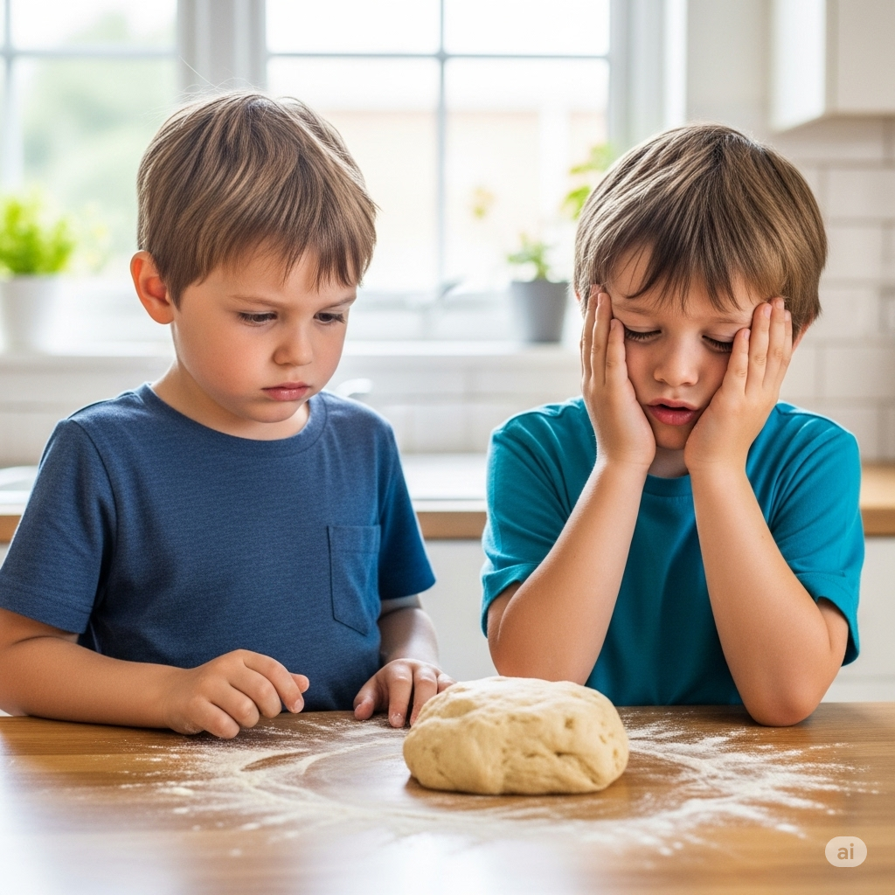
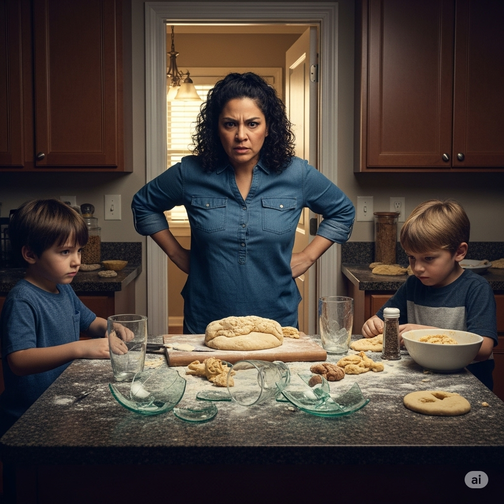
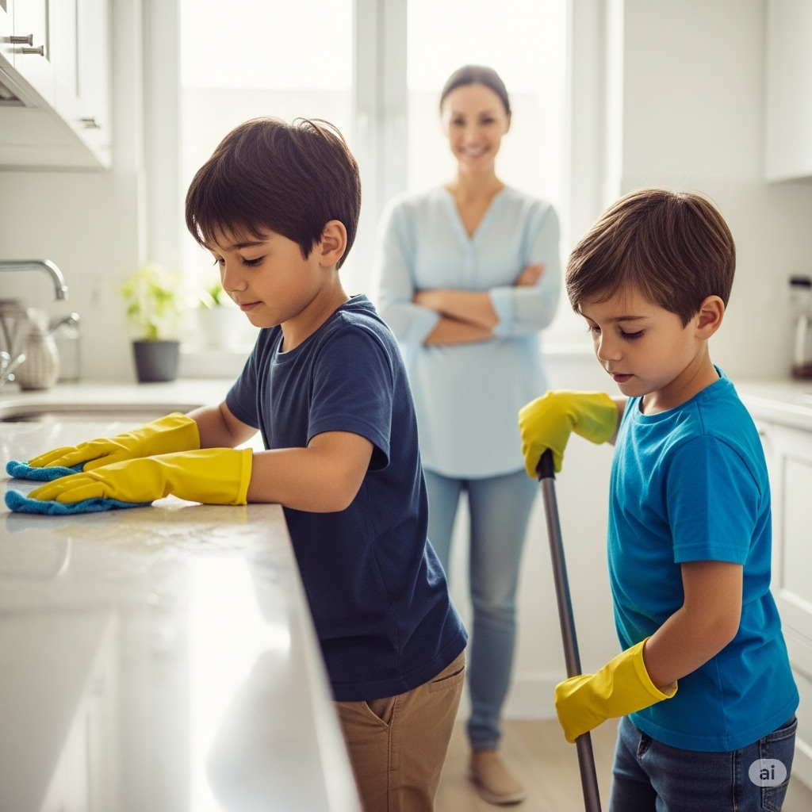

# Essential English Word 4
# Unit 14
## 1. brick n
### định nghĩa
viên gạch (khối vật liệu dùng để xây tường hoặc nhà).

He is laying bricks.

She is painting the brick wall.

They have used red bricks.

He dropped a brick.

We were carrying bricks.

Before, I had not seen so many bricks.

You will need more bricks.

I am going to buy bricks.

A brick is heavy.

You should stack the bricks carefully.

I would build a wall with these bricks.

Lay the brick.

------------

## 2. crumble v
### định nghĩa
vỡ vụn, sụp đổ (thành những mảnh nhỏ).

The old wall crumbles.

She is watching the cake crumble.

They have seen the building crumble.

The cookie crumbled in his hand.

We were afraid the cliff was crumbling.

Before, it had not crumbled.

It will crumble over time.

It is going to crumble.

It can crumble easily.

You should be careful, it might crumble.

I would watch it crumble.

It will crumble.

------------

## 3. dough n
### định nghĩa
bột nhào (hỗn hợp bột và nước dùng để làm bánh mì, bánh ngọt).

She is making dough.

He is kneading the dough.

They have prepared the dough.

She mixed the dough.

We were rolling out the dough.

Before, I had not made dough.

You will need more dough.

I am going to make pizza dough.

Dough can be sticky.

You should let the dough rise.

I would add more flour to the dough.

Knead the dough.

------------

## 4. express v
### định nghĩa
bày tỏ, thể hiện (cảm xúc, ý kiến).

He expresses his feelings.

She is expressing her opinion.

They have expressed their thanks.

He expressed his sadness.

We were expressing our joy.

Before, I had not expressed myself well.

You will express your ideas.

I am going to express my gratitude.

You can express yourself clearly.

You should express your thoughts.

I would express my concern.

Express your feelings.

------------

## 5. fist n
### định nghĩa
nắm đấm (bàn tay nắm chặt).

He made a fist.

She is shaking her fist.

They have clenched their fists.

He hit the table with his fist.

We were watching him clench his fist.

Before, I had not made a fist in anger.

You will make a fist.

I am going to clench my fist.

A fist can be strong.

You should not use your fist to hit.

I would make a fist if I was angry.

Make a fist.

------------

## 6. flexible adj
### định nghĩa
linh hoạt (có thể uốn cong dễ dàng); dễ thay đổi.

The pipe is flexible.

She is very flexible.

They have a flexible schedule.

He used a flexible material.

We were looking for a flexible solution.

Before, I had not been so flexible.

You will need a flexible wire.

It is going to be a flexible plan.

It can be flexible.

You should be flexible with your time.

I would prefer a flexible arrangement.

It's flexible.

------------

## 7. flush v
### định nghĩa
đỏ mặt (vì xấu hổ hoặc giận dữ); xả nước (bồn cầu); làm sạch bằng nước.

He flushes the toilet.

She is flushing red.

They have flushed the system.

He flushed with anger.

We were flushing the pipes.

Before, I had not flushed it.

You will flush it.

I am going to flush the toilet.

You can flush it.

You should flush after using the toilet.

I would flush it twice.

Flush the toilet.

------------

## 8. injure v
### định nghĩa
làm bị thương.

He injures his knee.

She is injuring herself.

They have injured several players.

He injured his arm.

We were afraid of injuring him.

Before, I had not injured anyone.

You will injure yourself if you are not careful.

I am not going to injure you.

You can injure yourself easily.

You should be careful not to injure others.

I would not want to injure anyone.

Don't injure yourself.

------------

## 9. lump n
### định nghĩa
cục, khối (một miếng không đều hình dạng); cục u (trên cơ thể).

There is a lump in the sugar.

She is feeling a lump.

They have found a lump.

He found a lump of clay.

We were trying to break up the lumps.

Before, I had not noticed the lump.

You will find a lump.

It is going to be a small lump.

A lump can be hard.

You should check for lumps.

I would remove the lump.

Feel the lump.

------------

## 10. mixture n
### định nghĩa
hỗn hợp (nhiều thứ trộn lẫn với nhau).

It is a strange mixture.

She is making a mixture.

They have created a mixture.

He poured the mixture into the bowl.

We were stirring the mixture.

Before, I had not made this mixture.

You will need this mixture.

I am going to make a mixture.

A mixture can be liquid or solid.

You should mix the ingredients to make a mixture.

I would add more water to the mixture.

Mix the mixture.

------------

## 11. reconcile v
### định nghĩa
hòa giải (làm cho hai người hoặc nhóm có mối quan hệ tốt trở lại); làm cho phù hợp.

He reconciles with his friend.

She is reconciling differences.

They have reconciled.

He reconciled with his brother.

We were trying to reconcile them.

Before, I had not reconciled.

You will reconcile.

I am going to reconcile with her.

You can reconcile.

You should try to reconcile.

I would reconcile if I could.

Reconcile with him.

------------

## 12. ruin v
### định nghĩa
phá hủy, làm hỏng; tàn phá.

He will ruin everything.

She is ruining the surprise.

They have ruined the building.

He ruined my plan.

We were afraid they would ruin it.

Before, I had not ruined anything.

You will ruin it if you touch it.

It is going to ruin the party.

It can ruin your day.

You should not ruin it.

I would not want to ruin it.

Don't ruin it.

------------

## 13. shatter v
### định nghĩa
đập vỡ thành nhiều mảnh nhỏ (thường là thủy tinh); làm tan vỡ (hy vọng, giấc mơ).

He shatters the glass.

She is shattering expectations.

They have shattered the window.

He shattered the mirror.

The news shattered her hopes.

Before, I had not shattered anything.

You will shatter it if you drop it.

It is going to shatter.

It can shatter easily.

You should be careful not to shatter it.

I would be sad if my dreams shattered.

Don't shatter the glass.

------------

## 14. shutter v
### định nghĩa
đóng cửa chớp; đóng cửa hàng.

He shutters the windows.

She is shuttering the shop.

They have shuttered the business.

He shuttered the old house.

We were shuttering the windows before the storm.

Before, I had not shuttered them.

You will shutter the building.

The shop is going to shutter.

You can shutter the windows.

You should shutter the shop at night.

I would shutter the house if I left.

Shutter the windows.

------------

## 15. sift v
### định nghĩa
rây, sàng (bột); lọc thông tin.

She sifts the flour.

He is sifting the sand.

They have sifted the evidence.

She sifted the sugar.

We were sifting through the documents.

Before, I had not sifted flour.

You will sift the powder.

I am going to sift the flour.

You can sift it.

You should sift the dry ingredients.

I would sift the dirt.

Sift the flour.

------------

## 16. slight adj
### định nghĩa
nhẹ, nhỏ (không đáng kể); mảnh khảnh.

There is a slight problem.

She has a slight fever.

They have a slight chance.

He made a slight mistake.

We were feeling a slight breeze.

Before, I had not felt a slight pain.

You will notice a slight difference.

It is going to be a slight delay.

It can be slight.

You should not worry about a slight issue.

I would make a slight adjustment.

It's a slight change.

------------

## 17. sparkle v
### định nghĩa
lấp lánh, tỏa sáng.

The stars sparkle.

She is watching the diamonds sparkle.

They have seen the water sparkle.

The snow sparkled in the sun.

We were admiring how the lights were sparkling.

Before, I had not seen anything sparkle like that.

You will see the glitter sparkle.

It is going to sparkle.

It can sparkle brightly.

You should make it sparkle.

I would love to see it sparkle.

It sparkles.

------------

## 18. sprinkle v
### định nghĩa
rắc, rưới (một lượng nhỏ).

He sprinkles sugar on the cake.

She is sprinkling water on the plants.

They have sprinkled salt.

He sprinkled cheese on his pasta.

We were sprinkling seeds in the garden.

Before, I had not sprinkled anything.

You will sprinkle some pepper.

I am going to sprinkle some magic dust.

You can sprinkle it lightly.

You should sprinkle some water.

I would sprinkle some herbs.

Sprinkle some sugar.

------------

## 19. stale adj
### định nghĩa
ôi thiu, cũ (thức ăn không còn tươi); cũ kỹ, nhàm chán.

The bread is stale.

She is eating stale cookies.

They have stale ideas.

He threw away the stale cake.

We were eating stale popcorn.

Before, the food had not been stale.

You will find the air stale.

It is going to be stale.

It can be stale.

You should not eat stale food.

I would throw away stale bread.

It smells stale.

------------

## 20. utter v
### định nghĩa
nói ra, phát ra (âm thanh hoặc lời nói).

He utters a sound.

She is uttering words.

They have not uttered a word.

He uttered a cry of pain.

She didn't utter a sound.

Before, I had not uttered anything.

You will utter the magic word.

I am not going to utter a sound.

You can utter a sentence.

You should not utter threats.

I would not utter a lie.

Don't utter a word.

------------

## THE BROTHERS AND THE BREAD

Two brothers wanted to go outside and play. However, because the only bread in the house was **stale**, their mother told them they needed to bake fresh bread.

“I have to have the car repaired,” she said. “When I return, if the bread is ready, you can play.”

The brothers hurried to prepare the bread, but not carefully. They didn’t **sift** the flour. They were careless and **sprinkle**d too much salt into the **mixture**. The **dough** needed to be soft and **flexible**, but the salt made it into a **lump** that was as hard as a **brick**.

The younger brother **utter**ed a sigh. “Now we have to start again,” he said.

“No, we don’t,” the older brother replied. “I’ll fix it. I just need to make the **dough** flat again and add water to it.”

He decided to hit the ball of **dough** with his **fist** to make it flat. But he hit it so hard that it flew right off of the table and knocked over a glass, which **shatter**ed. The **dough** then crashed into the kitchen window’s **shutter**s and **crumble**d. Luckily, the brothers were not **injure**d, but they did make a huge mess.

A **slight** mistake now became a major problem. The brothers had **ruin**ed the kitchen. Just then their mother returned. She saw the mess and became **flush**ed with anger.

“Now you can’t play,” she said. “Instead, you have to clean the kitchen. I want this kitchen to be so clean that it may **sparkle**!”

The brothers cleaned the floor and **express**ed their sorrow to their mother. Soon, they were **reconcile**d. But there was no bread, and it was too late to play. They realized that trying to do something quickly often makes more work.

--------------

--------------------------------------------

Two brothers wanted to go outside and play. However, because the only bread in the house was **stale**, their mother told them they needed to bake fresh bread.

“I have to have the car repaired,” she said. “When I return, if the bread is ready, you can play.”

The brothers hurried to prepare the bread, but not carefully. They didn’t **sift** the flour. They were careless and **sprinkle**d too much salt into the **mixture**. The **dough** needed to be soft and **flexible**, but the salt made it into a **lump** that was as hard as a **brick**.

The younger brother **utter**ed a sigh. “Now we have to start again,” he said.

“No, we don’t,” the older brother replied. “I’ll fix it. I just need to make the **dough** flat again and add water to it.”

He decided to hit the ball of **dough** with his **fist** to make it flat. But he hit it so hard that it flew right off of the table and knocked over a glass, which **shatter**ed. The **dough** then crashed into the kitchen window’s **shutter**s and **crumble**d. Luckily, the brothers were not **injure**d, but they did make a huge mess.

A **slight** mistake now became a major problem. The brothers had **ruin**ed the kitchen. Just then their mother returned. She saw the mess and became **flush**ed with anger.

“Now you can’t play,” she said. “Instead, you have to clean the kitchen. I want this kitchen to be so clean that it may **sparkle**!”

The brothers cleaned the floor and **express**ed their sorrow to their mother. Soon, they were **reconcile**d. But there was no bread, and it was too late to play. They realized that trying to do something quickly often makes more work.

