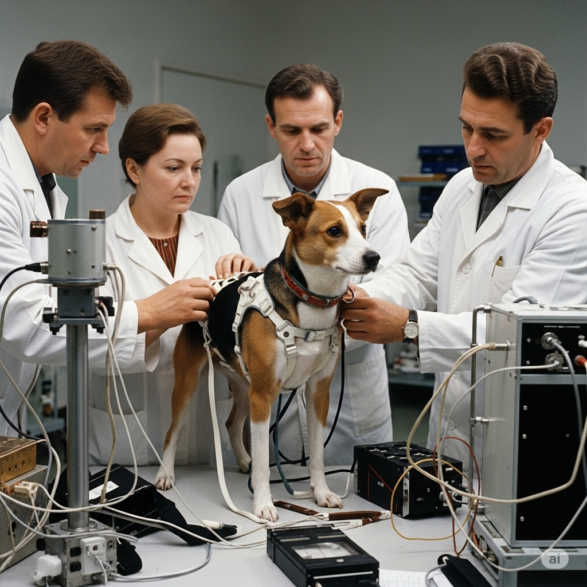
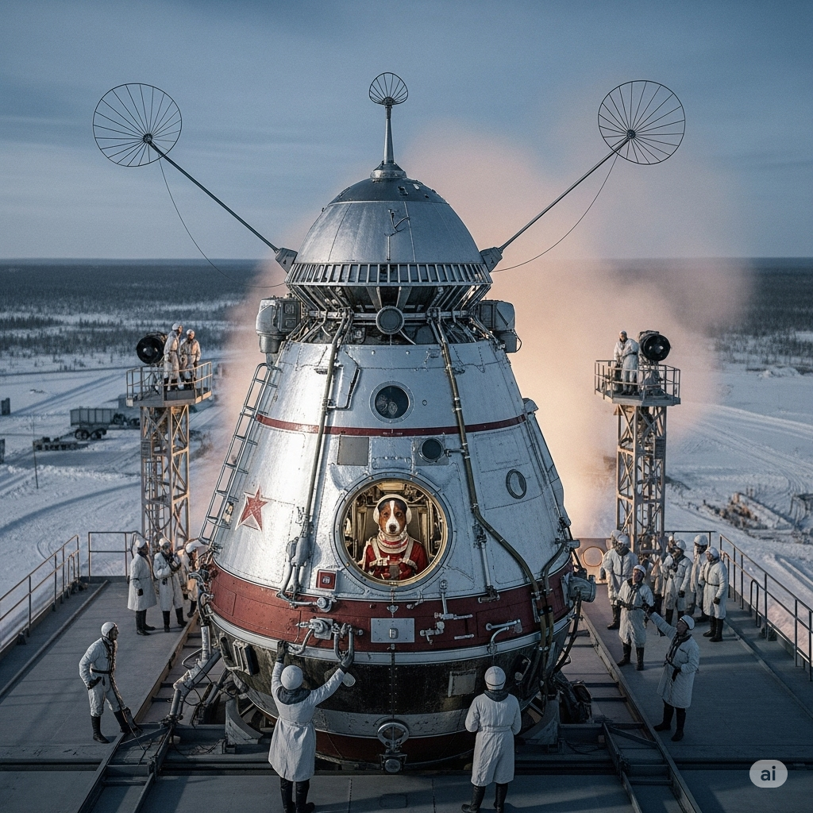
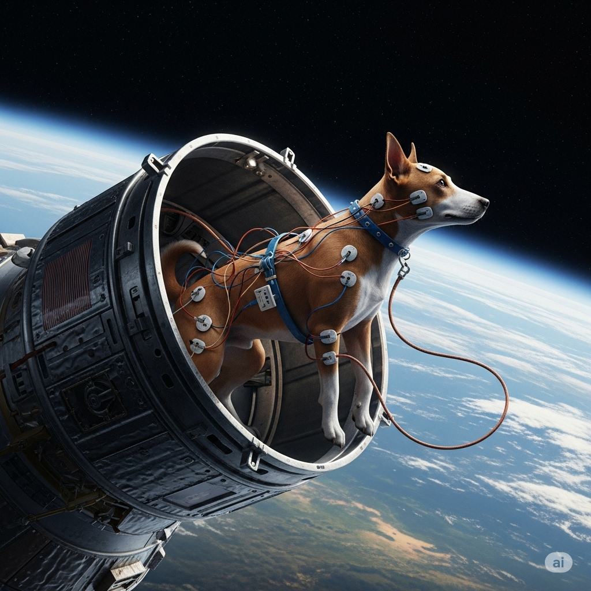

# LAIKA, THE SPACE DOG

Laika, the Space Dog Laika

One of the world’s most **beloved** space travelers was also the furriest. Laika was a little dog living on the streets of Moscow, Russia. She **matured** on the streets because no one would give her a home. She had to learn how to live without eating much. She found ways to keep warm in a very cold **climate**. Scientists thought a tough dog like Laika would do well in a project they were putting together.

In a **prior** launch, Russia had put the first man-made object into space. Now, scientists wanted to see if a living thing could go to space. **Although** many facts about space had been learned, they weren’t enough to help send humans to space safely.

Laika and two other dogs were chosen to help scientists with their **research**. The animals were used in a **variety** of tests. In the end, though, only Laika would go to space. On November 3,1957 the Sputnik 2 spaceship was **due** to leave Earth.

Scientists carefully **applied** wires to Laika’s skin to **measure** her body’s reactions once she got into space. Laika also wore a special **leash**. Without it, she would float around in the spaceship. Soon after, Laika left the planet. Scientists on Earth **awaited** information from the ship.

But in the **midst** of so much excitement, something very sad happened. Scientists were able to tell that Laika was under a lot of stress. The trip **confused** and scared her. Laika’s **entire** ship had become as hot as a **furnace**. Scientists were powerless to help the dog in her **misery**. After about five hours, Laika died.

Some have **complained** that the little dog should never have been used in the mission. Scientists knew that she would not survive the trip. Laika was never **buried**, but an **establish**ed memorial has been **establish**ed in Moscow. There are many songs and books about her, too. It seems that Laika became a hero to many people.

---
Laika, the Space Dog Laika, the Space Dog

One of the world’s most **beloved** space travelers was also the furriest.

Laika was a little dog living on the streets of Moscow, Russia.

She **matured** on the streets because no one would give her a home.

She had to learn how to live without eating much.

She found ways to keep warm in a very cold **climate**.

Scientists thought a tough dog like Laika would do well in a project they were putting together.

In a **prior** launch, Russia had put the first man-made object into space.

Now, scientists wanted to see if a living thing could go to space.

**Although** many facts about space had been learned, they weren’t enough to help send humans to space safely.

Laika and two other dogs were chosen to help scientists with their **research**.

The animals were used in a **variety** of tests.

In the end, though, only Laika would go to space.

On November 3,1957 the Sputnik 2 spaceship was **due** to leave Earth.

Scientists carefully **applied** wires to Laika’s skin to **measure** her body’s reactions once she got into space.

Laika also wore a special **leash**.

Without it, she would float around in the spaceship.

Soon after, Laika left the planet.

Scientists on Earth **awaited** information from the ship.

But in the **midst** of so much excitement, something very sad happened.

Scientists were able to tell that Laika was under a lot of stress.

The trip **confused** and scared her.

Laika’s **entire** ship had become as hot as a **furnace**.

Scientists were powerless to help the dog in her **misery**.

After about five hours, Laika died.

Some have **complained** that the little dog should never have been used in the mission.

Scientists knew that she would not survive the trip.

Laika was never **buried**, but an **establish**ed memorial has been **establish**ed in Moscow.

There are many songs and books about her, too.

It seems that Laika became a hero to many people.

---
Dưới đây là danh sách từ vựng, nghĩa và ví dụ:

## 1. although, conj.
*   **Nghĩa trong truyện:** Dù, mặc dù (dùng để giới thiệu một mệnh đề tương phản với mệnh đề chính).
*   **Nghĩa thường gặp:** Mặc dù, dẫu cho (dùng để kết nối hai ý đối lập).
*   **12 ví dụ:**
    1.  **Present Simple:** Although it rains, she walks to work.
    2.  **Present Continuous:** Although he is studying hard, he is still finding the subject difficult.
    3.  **Present Perfect:** Although they have finished the project, they haven't celebrated yet.
    4.  **Present Perfect Continuous:** Although she has been practicing for hours, she still feels nervous.
    5.  **Past Simple:** Although it was cold, we went for a swim.
    6.  **Past Continuous:** Although he was feeling tired, he was still working on his report.
    7.  **Past Perfect:** Although they had already eaten, they ordered dessert.
    8.  **Past Perfect Continuous:** Although she had been waiting for a long time, she didn't complain.
    9.  **Future Simple:** Although it will be late, we will still try to finish the task.
    10. **Future Continuous:** Although he will be traveling tomorrow, he will still be checking his emails.
    11. **Future Perfect:** Although they will have completed the course by then, they won't have received their certificates.
    12. **Future Perfect Continuous:** Although she will have been living there for a year, she still won't know the city well.

## 2. apply, v.
*   **Nghĩa trong truyện:** Áp dụng, gắn (gắn dây điện vào da Laika).
*   **Nghĩa thường gặp:** Áp dụng, nộp đơn, bôi, thoa.
*   **12 ví dụ:**
    1.  **Present Simple:** He applies for jobs every week.
    2.  **Present Continuous:** She is applying for a scholarship right now.
    3.  **Present Perfect:** They have applied the new policy successfully.
    4.  **Present Perfect Continuous:** He has been applying sunscreen every morning this week.
    5.  **Past Simple:** We applied the brakes suddenly.
    6.  **Past Continuous:** She was applying makeup when the phone rang.
    7.  **Past Perfect:** They had applied for the visa before the deadline.
    8.  **Past Perfect Continuous:** He had been applying pressure to the wound for five minutes.
    9.  **Future Simple:** You will apply the paint evenly.
    10. **Future Continuous:** She will be applying for universities next year.
    11. **Future Perfect:** By noon, he will have applied all the necessary patches.
    12. **Future Perfect Continuous:** By the end of the day, she will have been applying the finish coat for eight hours.

## 3. await, v.
*   **Nghĩa trong truyện:** Chờ đợi (các nhà khoa học chờ thông tin từ tàu vũ trụ).
*   **Nghĩa thường gặp:** Chờ đợi, mong đợi.
*   **12 ví dụ:**
    1.  **Present Simple:** He awaits the results patiently.
    2.  **Present Continuous:** They are awaiting news from the front.
    3.  **Present Perfect:** We have awaited this moment for a long time.
    4.  **Present Perfect Continuous:** She has been awaiting his arrival since morning.
    5.  **Past Simple:** The crowd awaited the king's speech.
    6.  **Past Continuous:** They were awaiting instructions when the message arrived.
    7.  **Past Perfect:** He had awaited her response for days.
    8.  **Past Perfect Continuous:** She had been awaiting the test results anxiously.
    9.  **Future Simple:** We will await your decision.
    10. **Future Continuous:** They will be awaiting your call all evening.
    11. **Future Perfect:** By tomorrow, he will have awaited the package for a week.
    12. **Future Perfect Continuous:** By the time you arrive, she will have been awaiting you for over an hour.

## 4. beloved, adj.
*   **Nghĩa trong truyện:** Được yêu quý (Laika là một trong những nhà du hành vũ trụ được yêu quý nhất).
*   **Nghĩa thường gặp:** Được yêu quý, thân yêu.
*   **12 ví dụ:**
    1.  **Present Simple:** He is a beloved teacher.
    2.  **Present Continuous:** She is being a beloved figure in the community. (Less common, but grammatically possible)
    3.  **Present Perfect:** He has been a beloved leader for many years.
    4.  **Present Perfect Continuous:** She has been being a beloved pet to the family. (Very uncommon)
    5.  **Past Simple:** He was a beloved king.
    6.  **Past Continuous:** She was being a beloved friend to everyone she met. (Less common)
    7.  **Past Perfect:** He had been a beloved figure in the town before he moved.
    8.  **Past Perfect Continuous:** She had been being a beloved grandmother for decades. (Very uncommon)
    9.  **Future Simple:** He will be a beloved member of the team.
    10. **Future Continuous:** She will be being a beloved icon for future generations. (Very uncommon)
    11. **Future Perfect:** By next year, he will have been a beloved author for twenty years.
    12. **Future Perfect Continuous:** By the time she retires, she will have been being a beloved mentor for a long time. (Very uncommon)

## 5. bury, v.
*   **Nghĩa trong truyện:** Chôn cất (Laika không bao giờ được chôn cất).
*   **Nghĩa thường gặp:** Chôn cất, vùi lấp, giấu đi.
*   **12 ví dụ:**
    1.  **Present Simple:** They bury their pets in the garden.
    2.  **Present Continuous:** He is burying a treasure chest in the sand.
    3.  **Present Perfect:** She has buried the secret deep in her heart.
    4.  **Present Perfect Continuous:** They have been burying waste in this landfill for years.
    5.  **Past Simple:** We buried the time capsule last year.
    6.  **Past Continuous:** He was burying the evidence when the police arrived.
    7.  **Past Perfect:** They had buried the ancient artifacts before the city was invaded.
    8.  **Past Perfect Continuous:** She had been burying her feelings for a long time.
    9.  **Future Simple:** They will bury the cables underground.
    10. **Future Continuous:** He will be burying the dog tomorrow morning.
    11. **Future Perfect:** By sunset, they will have buried the time capsule.
    12. **Future Perfect Continuous:** By the end of the week, they will have been burying the pipes for a month.

## 6. climate, n.
*   **Nghĩa trong truyện:** Khí hậu (khí hậu rất lạnh ở Moscow).
*   **Nghĩa thường gặp:** Khí hậu, môi trường, hoàn cảnh.
*   **12 ví dụ:**
    1.  **Present Simple:** The climate here is usually mild.
    2.  **Present Continuous:** The global climate is changing rapidly.
    3.  **Present Perfect:** The political climate has become very tense.
    4.  **Present Perfect Continuous:** The business climate has been improving steadily.
    5.  **Past Simple:** The climate was much colder during the Ice Age.
    6.  **Past Continuous:** The economic climate was worsening during that period.
    7.  **Past Perfect:** The climate had been stable for centuries before the industrial revolution.
    8.  **Past Perfect Continuous:** The social climate had been becoming more liberal.
    9.  **Future Simple:** The climate will likely become warmer in the future.
    10. **Future Continuous:** Scientists will be studying the climate changes next decade.
    11. **Future Perfect:** By 2050, the climate will have changed significantly.
    12. **Future Perfect Continuous:** By the end of the century, researchers will have been studying the climate for over 100 years.

## 7. complain, v.
*   **Nghĩa trong truyện:** Phàn nàn (một số người phàn nàn rằng không nên dùng Laika).
*   **Nghĩa thường gặp:** Phàn nàn, than phiền.
*   **12 ví dụ:**
    1.  **Present Simple:** He often complains about the food.
    2.  **Present Continuous:** She is complaining about the noise right now.
    3.  **Present Perfect:** They have complained about the service multiple times.
    4.  **Present Perfect Continuous:** He has been complaining about his back pain all week.
    5.  **Past Simple:** We complained to the manager yesterday.
    6.  **Past Continuous:** She was complaining about the heat during the trip.
    7.  **Past Perfect:** They had complained about the issue before it got worse.
    8.  **Past Perfect Continuous:** He had been complaining about the slow internet for days.
    9.  **Future Simple:** I will complain if the order is wrong.
    10. **Future Continuous:** She will be complaining about the weather all weekend.
    11. **Future Perfect:** By the time you arrive, he will have complained about everything.
    12. **Future Perfect Continuous:** By the end of the meeting, they will have been complaining for two hours.

## 8. confuse, v.
*   **Nghĩa trong truyện:** Gây bối rối, làm sợ hãi (chuyến đi làm Laika bối rối và sợ hãi).
*   **Nghĩa thường gặp:** Gây bối rối, làm lẫn lộn.
*   **12 ví dụ:**
    1.  **Present Simple:** This map confuses me.
    2.  **Present Continuous:** The instructions are confusing the students.
    3.  **Present Perfect:** His explanation has confused everyone.
    4.  **Present Perfect Continuous:** The new system has been confusing users since it was implemented.
    5.  **Past Simple:** The sudden change confused him.
    6.  **Past Continuous:** She was confusing the twins.
    7.  **Past Perfect:** The complex rules had confused the participants.
    8.  **Past Perfect Continuous:** He had been confusing those two concepts for years.
    9.  **Future Simple:** This question will confuse many people.
    10. **Future Continuous:** The new software will be confusing users for a while.
    11. **Future Perfect:** By the end of the lecture, he will have confused half the class.
    12. **Future Perfect Continuous:** By the time they finish the training, they will have been confusing the procedures for days.

## 9. due, adj.
*   **Nghĩa trong truyện:** Đến hạn, dự kiến (tàu Sputnik 2 dự kiến rời Trái Đất).
*   **Nghĩa thường gặp:** Đến hạn, phải trả, xứng đáng, do bởi.
*   **12 ví dụ:**
    1.  **Present Simple:** The rent is due on the first of the month.
    2.  **Present Continuous:** The package is due to arrive tomorrow.
    3.  **Present Perfect:** The project has been due for a week now.
    4.  **Present Perfect Continuous:** The baby has been due for three days.
    5.  **Past Simple:** The train was due at 3 PM.
    6.  **Past Continuous:** The payment was due yesterday.
    7.  **Past Perfect:** The report had been due before the meeting started.
    8.  **Past Perfect Continuous:** The library book had been due for a month.
    9.  **Future Simple:** The next payment will be due next Friday.
    10. **Future Continuous:** The construction will be due for completion by the end of the year.
    11. **Future Perfect:** By next month, the loan will have been due for six months.
    12. **Future Perfect Continuous:** By the time he finishes, the task will have been due for hours.

## 10. entire, adj.
*   **Nghĩa trong truyện:** Toàn bộ (toàn bộ con tàu của Laika trở nên nóng như lò nung).
*   **Nghĩa thường gặp:** Toàn bộ, toàn thể.
*   **12 ví dụ:**
    1.  **Present Simple:** The entire team agrees with the decision.
    2.  **Present Continuous:** The entire building is shaking.
    3.  **Present Perfect:** She has read the entire book.
    4.  **Present Perfect Continuous:** He has been painting the entire house all week.
    5.  **Past Simple:** We ate the entire cake.
    6.  **Past Continuous:** The entire city was celebrating.
    7.  **Past Perfect:** They had finished the entire project before the deadline.
    8.  **Past Perfect Continuous:** She had been cleaning the entire house since morning.
    9.  **Future Simple:** He will finish the entire report by tomorrow.
    10. **Future Continuous:** They will be traveling the entire country next month.
    11. **Future Perfect:** By next year, she will have visited the entire continent.
    12. **Future Perfect Continuous:** By the time he leaves, he will have been working on the entire system for a year.

## 11. establish, v.
*   **Nghĩa trong truyện:** Thành lập, xây dựng (một đài tưởng niệm đã được xây dựng ở Moscow).
*   **Nghĩa thường gặp:** Thành lập, thiết lập, xác lập.
*   **12 ví dụ:**
    1.  **Present Simple:** They establish new branches every year.
    2.  **Present Continuous:** The company is establishing a presence in Asia.
    3.  **Present Perfect:** She has established herself as a leader.
    4.  **Present Perfect Continuous:** They have been establishing new protocols.
    5.  **Past Simple:** He established the foundation in 2005.
    6.  **Past Continuous:** They were establishing the rules for the competition.
    7.  **Past Perfect:** The government had established the park before the area was developed.
    8.  **Past Perfect Continuous:** She had been establishing her business for five years.
    9.  **Future Simple:** We will establish a new record.
    10. **Future Continuous:** They will be establishing their headquarters in the city center.
    11. **Future Perfect:** By next decade, they will have established a global network.
    12. **Future Perfect Continuous:** By the time the project is complete, they will have been establishing the infrastructure for months.

## 12. furnace, n.
*   **Nghĩa trong truyện:** Lò nung (con tàu nóng như lò nung).
*   **Nghĩa thường gặp:** Lò sưởi, lò nung, lò luyện kim.
*   **12 ví dụ:**
    1.  **Present Simple:** The furnace heats the house.
    2.  **Present Continuous:** The furnace is working overtime in this cold weather.
    3.  **Present Perfect:** The old furnace has broken down again.
    4.  **Present Perfect Continuous:** The factory furnace has been running continuously for a week.
    5.  **Past Simple:** The furnace stopped working last night.
    6.  **Past Continuous:** The furnace was making strange noises.
    7.  **Past Perfect:** The repairman had fixed the furnace before the cold snap hit.
    8.  **Past Perfect Continuous:** The industrial furnace had been operating at maximum capacity.
    9.  **Future Simple:** We will install a new furnace next month.
    10. **Future Continuous:** The technicians will be inspecting the furnace tomorrow.
    11. **Future Perfect:** By winter, they will have replaced the old furnace.
    12. **Future Perfect Continuous:** By the end of the day, the metalworkers will have been using the furnace for twelve hours.

## 13. leash, n.
*   **Nghĩa trong truyện:** Dây xích, dây buộc (Laika đeo một dây buộc đặc biệt).
*   **Nghĩa thường gặp:** Dây xích, dây buộc (động vật).
*   **12 ví dụ:**
    1.  **Present Simple:** She keeps her dog on a leash in the park.
    2.  **Present Continuous:** He is holding the dog's leash tightly.
    3.  **Present Perfect:** The dog has broken its leash.
    4.  **Present Perfect Continuous:** She has been walking the dog on a short leash.
    5.  **Past Simple:** I bought a new leash for my puppy.
    6.  **Past Continuous:** The dog was pulling hard on the leash.
    7.  **Past Perfect:** He had attached the leash before opening the door.
    8.  **Past Perfect Continuous:** She had been using the same old leash for years.
    9.  **Future Simple:** Remember to bring the leash for the walk.
    10. **Future Continuous:** He will be attaching the leash to the harness.
    11. **Future Perfect:** By the time we leave, she will have found the missing leash.
    12. **Future Perfect Continuous:** By the end of the walk, the dog will have been pulling on the leash for an hour.

## 14. mature, v.
*   **Nghĩa trong truyện:** Trưởng thành (Laika trưởng thành trên đường phố).
*   **Nghĩa thường gặp:** Trưởng thành, chín (trái cây), đáo hạn (khoản vay).
*   **12 ví dụ:**
    1.  **Present Simple:** This cheese matures for six months.
    2.  **Present Continuous:** The wine is maturing in the cellar.
    3.  **Present Perfect:** He has matured a lot since college.
    4.  **Present Perfect Continuous:** The investment has been maturing well.
    5.  **Past Simple:** The fruit matured quickly in the sun.
    6.  **Past Continuous:** She was maturing into a confident young woman.
    7.  **Past Perfect:** The bond had matured before he needed the money.
    8.  **Past Perfect Continuous:** The plan had been maturing in his mind for years.
    9.  **Future Simple:** The loan will mature next year.
    10. **Future Continuous:** The young trees will be maturing over the next decade.
    11. **Future Perfect:** By the time he's 30, he will have matured significantly.
    12. **Future Perfect Continuous:** By the end of the year, the project will have been maturing for two years.

## 15. measure, v.
*   **Nghĩa trong truyện:** Đo (đo phản ứng cơ thể của Laika).
*   **Nghĩa thường gặp:** Đo lường, đánh giá.
*   **12 ví dụ:**
    1.  **Present Simple:** She measures the ingredients carefully.
    2.  **Present Continuous:** He is measuring the room for new furniture.
    3.  **Present Perfect:** They have measured the impact of the changes.
    4.  **Present Perfect Continuous:** The scientists have been measuring the temperature fluctuations.
    5.  **Past Simple:** We measured the distance yesterday.
    6.  **Past Continuous:** She was measuring the fabric when I called.
    7.  **Past Perfect:** They had measured the results before publishing the study.
    8.  **Past Perfect Continuous:** He had been measuring the progress daily.
    9.  **Future Simple:** We will measure your height next week.
    10. **Future Continuous:** They will be measuring the rainfall throughout the month.
    11. **Future Perfect:** By noon, he will have measured all the necessary dimensions.
    12. **Future Perfect Continuous:** By the end of the experiment, they will have been measuring the data for weeks.

## 16. midst, n.
*   **Nghĩa trong truyện:** Giữa (giữa lúc hào hứng).
*   **Nghĩa thường gặp:** Giữa, ở giữa (thường dùng trong cụm "in the midst of").
*   **12 ví dụ:**
    1.  **Present Simple:** He works in the midst of chaos.
    2.  **Present Continuous:** She is speaking in the midst of a noisy crowd.
    3.  **Present Perfect:** They have found peace in the midst of difficulty.
    4.  **Present Perfect Continuous:** He has been working in the midst of construction.
    5.  **Past Simple:** We found ourselves in the midst of a storm.
    6.  **Past Continuous:** She was singing in the midst of the performance.
    7.  **Past Perfect:** They had been in the midst of negotiations when the news broke.
    8.  **Past Perfect Continuous:** He had been living in the midst of the forest.
    9.  **Future Simple:** You will find yourself in the midst of a celebration.
    10. **Future Continuous:** They will be traveling in the midst of the holiday season.
    11. **Future Perfect:** By then, he will have completed the task in the midst of many distractions.
    12. **Future Perfect Continuous:** By the end of the year, she will have been working in the midst of renovations for months.

## 17. misery, n.
*   **Nghĩa trong truyện:** Sự đau khổ (các nhà khoa học bất lực trước sự đau khổ của Laika).
*   **Nghĩa thường gặp:** Sự đau khổ, cảnh khốn cùng.
*   **12 ví dụ:**
    1.  **Present Simple:** Poverty causes great misery.
    2.  **Present Continuous:** She is experiencing great misery.
    3.  **Present Perfect:** He has known misery throughout his life.
    4.  **Present Perfect Continuous:** They have been living in misery since the disaster.
    5.  **Past Simple:** They endured great misery during the war.
    6.  **Past Continuous:** She was feeling deep misery after the loss.
    7.  **Past Perfect:** He had known nothing but misery before he found help.
    8.  **Past Perfect Continuous:** They had been living in misery for years.
    9.  **Future Simple:** This situation will bring more misery.
    10. **Future Continuous:** They will be living in misery if conditions don't improve.
    11. **Future Perfect:** By then, she will have overcome her misery.
    12. **Future Perfect Continuous:** By the time help arrives, they will have been enduring misery for weeks.

## 18. prior, adj.
*   **Nghĩa trong truyện:** Trước đó (trong một lần phóng trước đó).
*   **Nghĩa thường gặp:** Trước, ưu tiên.
*   **12 ví dụ:**
    1.  **Present Simple:** He has a prior engagement.
    2.  **Present Continuous:** She is discussing a prior agreement.
    3.  **Present Perfect:** They have mentioned this in a prior meeting.
    4.  **Present Perfect Continuous:** He has been working on a prior commitment.
    5.  **Past Simple:** We discussed this at a prior time.
    6.  **Past Continuous:** She was reviewing prior documents.
    7.  **Past Perfect:** They had completed the prior step.
    8.  **Past Perfect Continuous:** He had been handling a prior issue.
    9.  **Future Simple:** We will need prior approval.
    10. **Future Continuous:** They will be considering prior experience.
    11. **Future Perfect:** By then, he will have finished his prior tasks.
    12. **Future Perfect Continuous:** By the time the new project starts, she will have been working on a prior one for months.

## 19. research, n.
*   **Nghĩa trong truyện:** Nghiên cứu (Laika được chọn để giúp các nhà khoa học với nghiên cứu của họ).
*   **Nghĩa thường gặp:** Nghiên cứu.
*   **12 ví dụ:**
    1.  **Present Simple:** He conducts research on climate change.
    2.  **Present Continuous:** She is doing research for her thesis.
    3.  **Present Perfect:** They have published extensive research on the topic.
    4.  **Present Perfect Continuous:** He has been doing research in the lab all year.
    5.  **Past Simple:** We conducted thorough research before starting the project.
    6.  **Past Continuous:** She was doing research in the library all day.
    7.  **Past Perfect:** They had completed their research before the conference.
    8.  **Past Perfect Continuous:** He had been doing research on that subject for years.
    9.  **Future Simple:** She will present her research findings next week.
    10. **Future Continuous:** They will be doing research in the field next summer.
    11. **Future Perfect:** By the end of the year, he will have finished his research.
    12. **Future Perfect Continuous:** By the time she graduates, she will have been doing research for four years.

## 20. variety, n.
*   **Nghĩa trong truyện:** Sự đa dạng, nhiều loại (các loài động vật được sử dụng trong nhiều loại thử nghiệm).
*   **Nghĩa thường gặp:** Sự đa dạng, nhiều loại, chủng loại.
*   **12 ví dụ:**
    1.  **Present Simple:** This store sells a variety of goods.
    2.  **Present Continuous:** The chef is preparing a variety of dishes.
    3.  **Present Perfect:** They have offered a wide variety of courses.
    4.  **Present Perfect Continuous:** The garden has been producing a variety of fruits.
    5.  **Past Simple:** We saw a variety of animals at the zoo.
    6.  **Past Continuous:** She was trying a variety of exercises.
    7.  **Past Perfect:** They had experienced a variety of cultures during their travels.
    8.  **Past Perfect Continuous:** He had been collecting a variety of stamps.
    9.  **Future Simple:** The menu will include a variety of options.
    10. **Future Continuous:** They will be offering a variety of workshops.
    11. **Future Perfect:** By the end of the festival, they will have showcased a variety of talents.
    12. **Future Perfect Continuous:** By the time the market closes, they will have been selling a variety