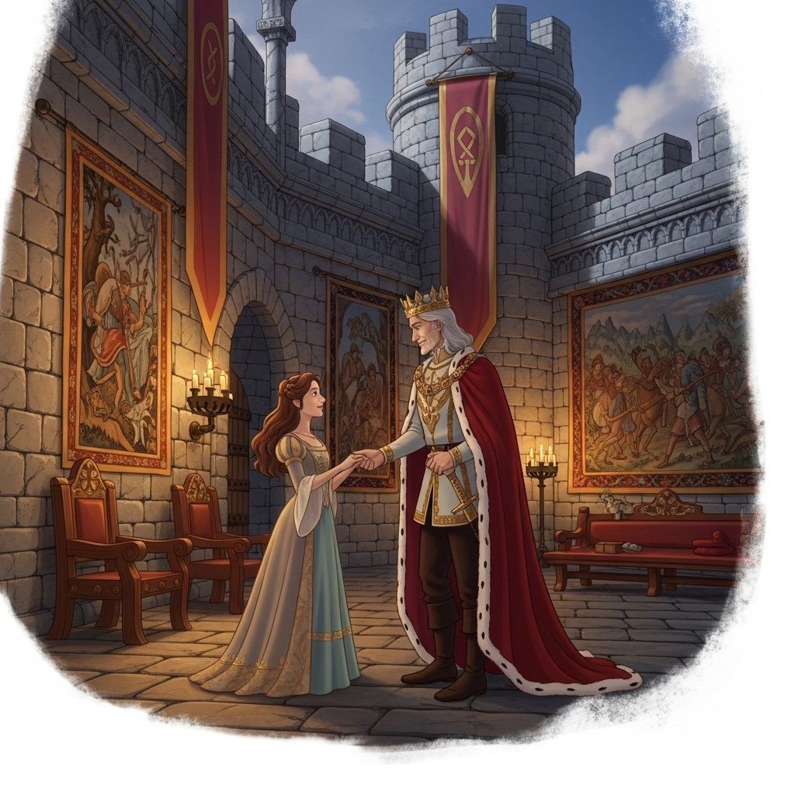
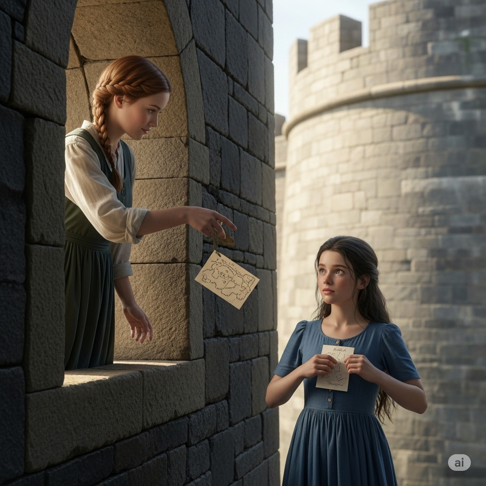
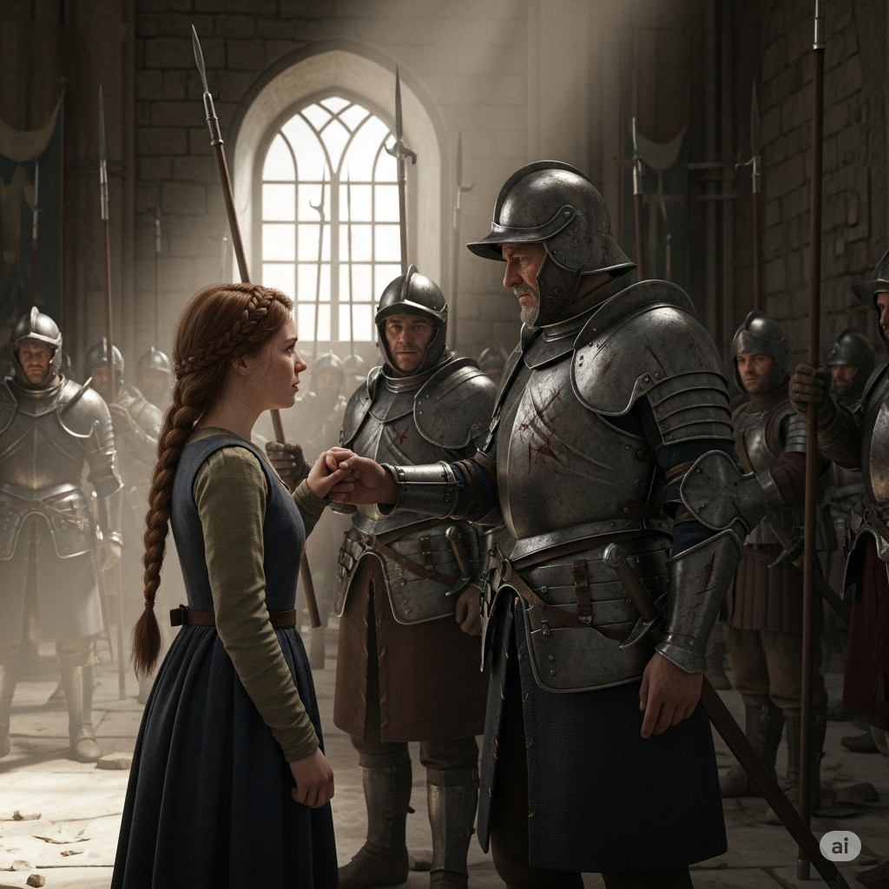
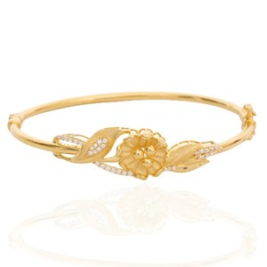
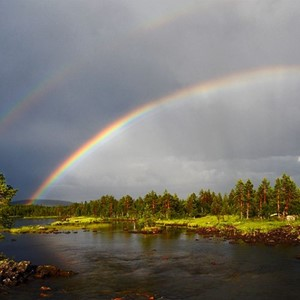
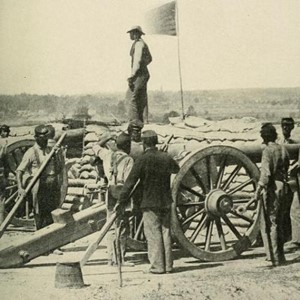
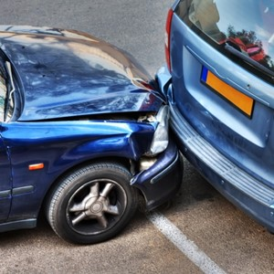
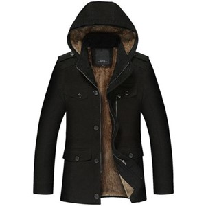
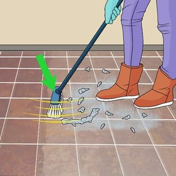

# The **Betrayal**

A king lived in a **fort** with his daughter, Clara. The king had **founded** a great empire, but his land was **rife** with enemies who wanted to take over the kingdom. Because there was so much **civil** unrest, the king told Clara not to **distrust** anyone.

One day, Clara was walking outside when she saw a girl **sweeping** the path. Clara **crossed** the garden, and they started talking. The girl’s name was Susie. Clara felt sorry for Susie because she was very poor, and Clara gave her a **bracelet**. After that, Susie and Clara met every day.

Once, the King saw them talking. He told Clara, “Don’t talk to that girl. She could be an enemy.”

“You can’t **distrust** everyone,” **commented** Clara. “She is my **sole** friend. It’s OK to be friendly to people.”

The King said, “Don’t argue with me. Stay inside from now on, and talk to no one.”

Clara felt lonely in the **fort**. But one day she saw Susie outside. She wrote her a note with a map showing a secret entrance to the **fort**. Clara wrote: “Come at night, and we can talk together. Don’t show anybody this note.” She threw the note to Susie, and Susie **tucked** it in the **lining** of her dress.

That night Clara waited for Susie. But she heard something ticking, and then a loud **blast**. She ran into the hall, and it was full of smoke, which made her **choke**. A **mass** of soldiers were there, fighting. Clara realized that Susie had **betrayed** her and given the map to her father’s enemies. Clara **prayed** that everyone in the castle would be safe from her friend’s **treachery**.

At last, the fighting **ceased**. Clara found her father in the hall with his soldiers. They had defeated their enemies, but there were **dents** in their armor from the heavy fighting. Clara told her father what she had done and promised never to disobey him again.

---

A king lived in a **fort** with his daughter, Clara.

The king had **founded** a great empire, but his land was **rife** with enemies who wanted to take over the kingdom.

Because there was so much **civil** unrest, the king told Clara not to **distrust** anyone.

One day, Clara was walking outside when she saw a girl **sweeping** the path.

Clara **crossed** the garden, and they started talking.

The girl’s name was Susie.

Clara felt sorry for Susie because she was very poor, and Clara gave her a **bracelet**.

After that, Susie and Clara met every day.

Once, the King saw them talking.

He told Clara, “Don’t talk to that girl.

She could be an enemy.”

“You can’t **distrust** everyone,” **commented** Clara.

“She is my **sole** friend.

It’s OK to be friendly to people.”

The King said, “Don’t argue with me.

Stay inside from now on, and talk to no one.”

Clara felt lonely in the **fort**.

But one day she saw Susie outside.

She wrote her a note with a map showing a secret entrance to the **fort**.

Clara wrote: “Come at night, and we can talk together.

Don’t show anybody this note.” She threw the note to Susie, and Susie **tucked** it in the **lining** of her dress.

That night Clara waited for Susie.

But she heard something ticking, and then a loud **blast**.

She ran into the hall, and it was full of smoke, which made her **choke**.

A **mass** of soldiers were there, fighting.

Clara realized that Susie had **betrayed** her and given the map to her father’s enemies.

Clara **prayed** that everyone in the castle would be safe from her friend’s **treachery**.

At last, the fighting **ceased**.

Clara found her father in the hall with his soldiers.

They had defeated their enemies, but there were **dents** in their armor from the heavy fighting.

Clara told her father what she had done and promised never to disobey him again.

---

## DANH SÁCH TỪ VỰNG

## 1. betray v

**Nghĩa trong truyện:** Phản bội, tiết lộ bí mật cho kẻ thù.
**Câu trong truyện:** Clara realized that Susie had **betrayed** her and given the map to her father’s enemies.
**Nghĩa thường gặp:** Phản bội ai đó hoặc điều gì đó bằng cách không trung thành hoặc tiết lộ thông tin bí mật; để lộ ra điều gì đó một cách vô tình.
**Ví dụ:**
1.  She **betrays** her friends easily. (Simple Present)
2.  He is **betraying** his country right now. (Present Continuous)
3.  They have **betrayed** our trust many times. (Present Perfect)
4.  We have been **betraying** our principles by doing this. (Present Perfect Continuous)
5.  Susie **betrayed** Clara in the story. (Simple Past)
6.  While he was **betraying** them, they were planning their escape. (Past Continuous)
7.  She had already **betrayed** him before he found out. (Past Perfect)
8.  They had been **betraying** the company for years before they were caught. (Past Perfect Continuous)
9.  He **will betray** you if you give him the chance. (Simple Future)
10. Tomorrow at this time, I **will be betraying** my old habits. (Future Continuous)
11. By next week, she **will have betrayed** everyone she knows. (Future Perfect)
12. By the end of the year, they **will have been betraying** the system for a decade. (Future Perfect Continuous)

## 2. blast n

**Nghĩa trong truyện:** Một tiếng nổ lớn, mạnh.
**Câu trong truyện:** But she heard something ticking, and then a loud **blast**.
**Nghĩa thường gặp:** Một tiếng nổ lớn, đặc biệt là do thuốc nổ; một luồng không khí hoặc âm thanh mạnh mẽ, đột ngột; một bữa tiệc hoặc trải nghiệm rất thú vị (nghĩa thông tục).
**Ví dụ:**
1.  The factory whistle **blasts** at noon. (Simple Present)
2.  The construction crew is **blasting** the rock. (Present Continuous)
3.  There has been a loud **blast** from the quarry. (Present Perfect)
4.  The wind has been **blasting** through the valley all night. (Present Perfect Continuous)
5.  She heard a loud **blast** in the hall. (Simple Past)
6.  While the music was **blasting**, we couldn't hear each other. (Past Continuous)
7.  The building had collapsed after the initial **blast**. (Past Perfect)
8.  The speakers had been **blasting** music for hours before they broke. (Past Perfect Continuous)
9.  They **will blast** the tunnel next month. (Simple Future)
10. This time tomorrow, the fireworks **will be blasting**. (Future Continuous)
11. By midnight, the party **will have blasted** for hours. (Future Perfect)
12. By the time we arrive, the wind **will have been blasting** for days. (Future Perfect Continuous)

## 3. bracelet n

**Nghĩa trong truyện:** Một món trang sức đeo quanh cổ tay.
**Câu trong truyện:** Clara felt sorry for Susie because she was very poor, and Clara gave her a **bracelet**.
**Nghĩa thường gặp:** Một món đồ trang sức đeo quanh cổ tay hoặc mắt cá chân.
**Ví dụ:**
1.  She always wears a silver **bracelet**. (Simple Present)
2.  He is making a leather **bracelet**. (Present Continuous)
3.  I have lost my favorite **bracelet**. (Present Perfect)
4.  She has been wearing that **bracelet** since morning. (Present Perfect Continuous)
5.  Clara gave Susie a **bracelet**. (Simple Past)
6.  While she was buying the **bracelet**, I waited outside. (Past Continuous)
7.  He had already bought the **bracelet** when he saw a better one. (Past Perfect)
8.  She had been looking for that specific **bracelet** for months. (Past Perfect Continuous)
9.  I **will buy** a new **bracelet** tomorrow. (Simple Future)
10. This time next week, she **will be wearing** her new **bracelet**. (Future Continuous)
11. By her birthday, I **will have bought** her a beautiful **bracelet**. (Future Perfect)
12. By the time the party starts, she **will have been wearing** that **bracelet** for hours. (Future Perfect Continuous)

## 4. cease v

**Nghĩa trong truyện:** Dừng lại, kết thúc.
**Câu trong truyện:** At last, the fighting **ceased**.
**Nghĩa thường gặp:** Dừng lại, ngừng lại (một hành động hoặc trạng thái).
**Ví dụ:**
1.  The rain usually **ceases** by evening. (Simple Present)
2.  The factory is **ceasing** operations for the day. (Present Continuous)
3.  Hostilities have **ceased** in the region. (Present Perfect)
4.  The noise has been **ceasing** and starting again. (Present Perfect Continuous)
5.  At last, the fighting **ceased**. (Simple Past)
6.  While the music was playing, the talking never **ceased**. (Past Continuous)
7.  The storm had **ceased** before we left the house. (Past Perfect)
8.  The old machine had been **ceasing** to work properly for weeks. (Past Perfect Continuous)
9.  The protests **will cease** when their demands are met. (Simple Future)
10. By midnight, the celebrations **will be ceasing**. (Future Continuous)
11. By dawn, the snow **will have ceased** falling. (Future Perfect)
12. By the time the sun rises, the wind **will have been ceasing** gradually for hours. (Future Perfect Continuous)

## 5. choke v

**Nghĩa trong truyện:** Bị nghẹt thở do khói.
**Câu trong truyện:** She ran into the hall, and it was full of smoke, which made her **choke**.
**Nghĩa thường gặp:** Bị nghẹt thở hoặc làm cho ai đó nghẹt thở; bị tắc nghẽn; không thể nói do cảm xúc mạnh.
**Ví dụ:**
1.  He often **chokes** on his food. (Simple Present)
2.  The smoke is **choking** me. (Present Continuous)
3.  She has **choked** on a piece of candy before. (Present Perfect)
4.  He has been **choking** on the dust all morning. (Present Perfect Continuous)
5.  The smoke made her **choke**. (Simple Past)
6.  While he was eating, he started **choking**. (Past Continuous)
7.  He had **choked** on the fumes before help arrived. (Past Perfect)
8.  The engine had been **choking** and sputtering for miles. (Past Perfect Continuous)
9.  The fumes **will choke** anyone in the room. (Simple Future)
10. By the time the fire is out, people **will be choking** on the smoke. (Future Continuous)
11. By then, he **will have choked** on the gas. (Future Perfect)
12. By the end of the fire, many people **will have been choking** on the smoke for a long time. (Future Perfect Continuous)

## 6. civil adj

**Nghĩa trong truyện:** Liên quan đến công dân hoặc nội bộ quốc gia (như trong "civil unrest" - bất ổn dân sự).
**Câu trong truyện:** Because there was so much **civil** unrest, the king told Clara not to distrust anyone.
**Nghĩa thường gặp:** Liên quan đến công dân hoặc đời sống công dân; lịch sự, nhã nhặn; không phải quân sự hoặc tôn giáo.
**Ví dụ:**
1.  He studies **civil** law. (Simple Present)
2.  They are discussing **civil** rights issues. (Present Continuous)
3.  There has been a lot of **civil** unrest recently. (Present Perfect)
4.  The country has been experiencing **civil** conflict for years. (Present Perfect Continuous)
5.  There was so much **civil** unrest. (Simple Past)
6.  While the leaders were negotiating, **civil** protests were growing. (Past Continuous)
7.  The nation had suffered a long **civil** war. (Past Perfect)
8.  The region had been facing **civil** challenges for decades. (Past Perfect Continuous)
9.  The government **will address** the **civil** concerns. (Simple Future)
10. Next year, they **will be focusing** on **civil** infrastructure. (Future Continuous)
11. By the next election, the **civil** situation **will have improved**. (Future Perfect)
12. By then, the country **will have been dealing** with **civil** issues for too long. (Future Perfect Continuous)

## 7. comment v

**Nghĩa trong truyện:** Nói ra ý kiến, nhận xét.
**Câu trong truyện:** “You can’t distrust everyone,” **commented** Clara.
**Nghĩa thường gặp:** Đưa ra ý kiến hoặc nhận xét về điều gì đó.
**Ví dụ:**
1.  She rarely **comments** on political issues. (Simple Present)
2.  He is **commenting** on the news article. (Present Continuous)
3.  Many people have **commented** on the new policy. (Present Perfect)
4.  They have been **commenting** on the performance all night. (Present Perfect Continuous)
5.  “You can’t distrust everyone,” **commented** Clara. (Simple Past)
6.  While the teacher was explaining, the students were **commenting** quietly. (Past Continuous)
7.  He had already **commented** on the post before I saw it. (Past Perfect)
8.  She had been **commenting** on his work for weeks. (Past Perfect Continuous)
9.  I **will comment** on your essay later. (Simple Future)
10. This time tomorrow, the critics **will be commenting** on the new film. (Future Continuous)
11. By the end of the day, everyone **will have commented** on the announcement. (Future Perfect)
12. By the time the meeting finishes, they **will have been commenting** on the proposal for hours. (Future Perfect Continuous)

## 8. cross v

**Nghĩa trong truyện:** Đi ngang qua, vượt qua.
**Câu trong truyện:** Clara **crossed** the garden, and they started talking.
**Nghĩa thường gặp:** Đi ngang qua từ bên này sang bên kia; bắt chéo (tay, chân); làm ai đó tức giận hoặc chống đối.
**Ví dụ:**
1.  She **crosses** the street carefully. (Simple Present)
2.  He is **crossing** the finish line now. (Present Continuous)
3.  They have **crossed** the border illegally. (Present Perfect)
4.  We have been **crossing** paths all day. (Present Perfect Continuous)
5.  Clara **crossed** the garden. (Simple Past)
6.  While I was **crossing** the bridge, it started to rain. (Past Continuous)
7.  He had already **crossed** the river before the storm hit. (Past Perfect)
8.  They had been **crossing** the desert for days. (Past Perfect Continuous)
9.  We **will cross** the mountain tomorrow. (Simple Future)
10. This time next week, they **will be crossing** the ocean. (Future Continuous)
11. By noon, she **will have crossed** the city. (Future Perfect)
12. By the time the sun sets, they **will have been crossing** the wilderness for hours. (Future Perfect Continuous)

## 9. dent n

**Nghĩa trong truyện:** Vết lõm trên áo giáp do chiến đấu.
**Câu trong truyện:** They had defeated their enemies, but there were **dents** in their armor from the heavy fighting.
**Nghĩa thường gặp:** Một vết lõm trên bề mặt cứng do bị va đập; sự giảm sút đáng kể (thường là về tiền bạc hoặc danh tiếng).
**Ví dụ:**
1.  The car has a small **dent** on the door. (Simple Present)
2.  The repair shop is fixing the **dent**. (Present Continuous)
3.  He has put a **dent** in his savings. (Present Perfect)
4.  The constant criticism has been putting a **dent** in her confidence. (Present Perfect Continuous)
5.  There were **dents** in their armor. (Simple Past)
6.  While they were fighting, the armor was getting **dents**. (Past Continuous)
7.  The hail had caused several **dents** in the roof. (Past Perfect)
8.  The economic downturn had been putting a **dent** in their profits for months. (Past Perfect Continuous)
9.  That rock **will make** a big **dent** if it hits the car. (Simple Future)
10. By the end of the battle, the shields **will be showing** many **dents**. (Future Continuous)
11. By then, the impact **will have caused** a significant **dent**. (Future Perfect)
12. By the time the project is finished, the budget **will have been taking** a **dent** from unexpected costs. (Future Perfect Continuous)

## 10. distrust v

**Nghĩa trong truyện:** Không tin tưởng.
**Câu trong truyện:** Because there was so much civil unrest, the king told Clara not to **distrust** anyone. / “You can’t **distrust** everyone,” commented Clara.
**Nghĩa thường gặp:** Không tin tưởng ai đó hoặc điều gì đó.
**Ví dụ:**
1.  He **distrusts** strangers. (Simple Present)
2.  She is **distrusting** his motives. (Present Continuous)
3.  They have **distrusted** the government for years. (Present Perfect)
4.  I have been **distrusting** his promises lately. (Present Perfect Continuous)
5.  The king told Clara not to **distrust** anyone. (Simple Past)
6.  While she was talking, I was **distrusting** every word. (Past Continuous)
7.  He had already **distrusted** her before the incident. (Past Perfect)
8.  They had been **distrusting** the system for decades. (Past Perfect Continuous)
9.  You **will distrust** him if he lies again. (Simple Future)
10. This time next year, many people **will be distrusting** the new policies. (Future Continuous)
11. By then, I **will have distrusted** his advice completely. (Future Perfect)
12. By the time the truth comes out, we **will have been distrusting** him for a long time. (Future Perfect Continuous)

## 11. fort n

**Nghĩa trong truyện:** Một tòa nhà kiên cố được xây dựng để bảo vệ khỏi tấn công.
**Câu trong truyện:** A king lived in a **fort** with his daughter, Clara. / Clara felt lonely in the **fort**. / She wrote her a note with a map showing a secret entrance to the **fort**.
**Nghĩa thường gặp:** Một tòa nhà hoặc nhóm tòa nhà kiên cố được sử dụng bởi quân đội để bảo vệ một địa điểm quan trọng.
**Ví dụ:**
1.  The old **fort** stands on the hill. (Simple Present)
2.  The army is building a new **fort**. (Present Continuous)
3.  They have captured the enemy **fort**. (Present Perfect)
4.  The soldiers have been defending the **fort** all week. (Present Perfect Continuous)
5.  A king lived in a **fort**. (Simple Past)
6.  While the battle was raging, the civilians were hiding inside the **fort**. (Past Continuous)
7.  The enemy had surrounded the **fort**. (Past Perfect)
8.  They had been reinforcing the **fort** for months. (Past Perfect Continuous)
9.  We **will visit** the historical **fort** next summer. (Simple Future)
10. This time tomorrow, the troops **will be entering** the **fort**. (Future Continuous)
11. By dawn, the **fort** **will have fallen**. (Future Perfect)
12. By the end of the siege, the **fort** **will have been standing** for centuries. (Future Perfect Continuous)

## 12. found v

**Nghĩa trong truyện:** Thành lập, xây dựng (một đế chế).
**Câu trong truyện:** The king had **founded** a great empire, but his land was rife with enemies who wanted to take over the kingdom.
**Nghĩa thường gặp:** Thành lập hoặc thiết lập (một tổ chức, thành phố, v.v.); đặt nền móng cho điều gì đó. (Lưu ý: Đây là động từ khác với "find" - tìm thấy).
**Ví dụ:**
1.  He **founds** a new company every year. (Simple Present)
2.  They are **founding** a new charity. (Present Continuous)
3.  She has **founded** several successful businesses. (Present Perfect)
4.  The committee has been **founding** new initiatives since last year. (Present Perfect Continuous)
5.  The king had **founded** a great empire. (Simple Past - used as past participle in Past Perfect in the story, but Simple Past form is 'founded')
6.  While they were exploring, they were also **founding** small settlements. (Past Continuous)
7.  The city had been **founded** centuries ago. (Past Perfect)
8.  The organization had been **founding** schools in the region for a decade. (Past Perfect Continuous)
9.  They **will found** a new research institute. (Simple Future)
10. This time next year, she **will be founding** her own startup. (Future Continuous)
11. By 2050, they **will have founded** a colony on Mars. (Future Perfect)
12. By the end of the century, the university **will have been founding** departments for over 200 years. (Future Perfect Continuous)

## 13. lining n

**Nghĩa trong truyện:** Lớp vải bên trong của quần áo.
**Câu trong truyện:** She threw the note to Susie, and Susie tucked it in the **lining** of her dress.
**Nghĩa thường gặp:** Một lớp vật liệu được thêm vào bên trong quần áo, rèm cửa, hoặc các vật dụng khác để trang trí, giữ ấm, hoặc làm cho chúng bền hơn.
**Ví dụ:**
1.  The jacket has a silk **lining**. (Simple Present)
2.  She is sewing the **lining** into the coat. (Present Continuous)
3.  He has repaired the torn **lining**. (Present Perfect)
4.  The old coat has been losing its **lining**. (Present Perfect Continuous)
5.  Susie tucked it in the **lining** of her dress. (Simple Past)
6.  While she was mending the dress, she was also fixing the **lining**. (Past Continuous)
7.  The tailor had replaced the **lining** before he finished the suit. (Past Perfect)
8.  The old curtains had been shedding their **lining** for years. (Past Perfect Continuous)
9.  I **will replace** the **lining** of my bag. (Simple Future)
10. This time tomorrow, she **will be stitching** the **lining**. (Future Continuous)
11. By the weekend, I **will have finished** sewing the **lining**. (Future Perfect)
12. By the time winter arrives, she **will have been working** on the coat **lining** for a month. (Future Perfect Continuous)

## 14. mass n

**Nghĩa trong truyện:** Một số lượng lớn người hoặc vật.
**Câu trong truyện:** A **mass** of soldiers were there, fighting.
**Nghĩa thường gặp:** Một lượng lớn vật chất không có hình dạng xác định; một số lượng lớn người hoặc vật; khối lượng (trong vật lý).
**Ví dụ:**
1.  A **mass** of clouds gathers before a storm. (Simple Present)
2.  The crowd is forming a large **mass**. (Present Continuous)
3.  They have discovered a **mass** of gold. (Present Perfect)
4.  A **mass** of people has been gathering outside. (Present Perfect Continuous)
5.  A **mass** of soldiers were there. (Simple Past)
6.  While the concert was happening, a **mass** of fans was waiting outside. (Past Continuous)
7.  A large **mass** of debris had blocked the road. (Past Perfect)
8.  A **mass** of protesters had been occupying the square for days. (Past Perfect Continuous)
9.  A **mass** of birds **will migrate** south soon. (Simple Future)
10. This time tomorrow, a **mass** of students **will be entering** the hall. (Future Continuous)
11. By noon, a **mass** of shoppers **will have arrived**. (Future Perfect)
12. By the end of the week, a **mass** of seaweed **will have been washing** ashore. (Future Perfect Continuous)

## 15. pray v

**Nghĩa trong truyện:** Cầu nguyện, mong ước điều tốt lành.
**Câu trong truyện:** Clara **prayed** that everyone in the castle would be safe from her friend’s treachery.
**Nghĩa thường gặp:** Nói chuyện với Chúa hoặc một vị thần; cầu xin một cách chân thành.
**Ví dụ:**
1.  She **prays** every night before bed. (Simple Present)
2.  He is **praying** for a miracle. (Present Continuous)
3.  They have **prayed** for peace. (Present Perfect)
4.  She has been **praying** for his recovery since yesterday. (Present Perfect Continuous)
5.  Clara **prayed** that everyone would be safe. (Simple Past)
6.  While the storm was raging, we were all **praying**. (Past Continuous)
7.  He had already **prayed** before he went to sleep. (Past Perfect)
8.  They had been **praying** for rain for weeks. (Past Perfect Continuous)
9.  I **will pray** for your success. (Simple Future)
10. This time tomorrow, the monks **will be praying**. (Future Continuous)
11. By the time you arrive, I **will have prayed** for hours. (Future Perfect)
12. By the end of the service, they **will have been praying** for the world for a long time. (Future Perfect Continuous)

## 16. rife adj

**Nghĩa trong truyện:** Đầy rẫy, tràn lan (kẻ thù).
**Câu trong truyện:** The king had founded a great empire, but his land was **rife** with enemies who wanted to take over the kingdom.
**Nghĩa thường gặp:** (Thường đi với 'with') Đầy rẫy, tràn lan (những điều không mong muốn).
**Ví dụ:**
1.  The city **is rife** with crime. (Simple Present)
2.  The area **is being** made **rife** with new construction. (Present Continuous - less common with stative adj)
3.  The internet **has become rife** with misinformation. (Present Perfect)
4.  The forest **has been rife** with rumors since the incident. (Present Perfect Continuous - less common)
5.  His land **was rife** with enemies. (Simple Past)
6.  While the economy was struggling, the country **was being** made **rife** with poverty. (Past Continuous - less common)
7.  The region **had become rife** with disease. (Past Perfect)
8.  The old building **had been rife** with problems for years. (Past Perfect Continuous - less common)
9.  The area **will be rife** with tourists next month. (Simple Future)
10. This time next year, the market **will be rife** with new technologies. (Future Continuous - less common)
11. By then, the report **will have shown** the industry **to be rife** with issues. (Future Perfect)
12. By the end of the decade, the planet **will have been rife** with pollution for too long. (Future Perfect Continuous - less common)

## 17. sole adj

**Nghĩa trong truyện:** Duy nhất.
**Câu trong truyện:** “She is my **sole** friend.
**Nghĩa thường gặp:** Duy nhất; chỉ một mình.
**Ví dụ:**
1.  He is the **sole** owner of the company. (Simple Present)
2.  She is currently the **sole** candidate. (Present Continuous - used with 'currently')
3.  He has been the **sole** provider for his family. (Present Perfect)
4.  She has been the **sole** person responsible for this project. (Present Perfect Continuous)
5.  She is my **sole** friend. (Simple Past - 'is' becomes 'was' if referring to the past)
6.  While I was working there, I was the **sole** designer. (Past Continuous)
7.  He had been the **sole** survivor of the accident. (Past Perfect)
8.  She had been the **sole** decision-maker for years. (Past Perfect Continuous)
9.  You **will be** the **sole** heir. (Simple Future)
10. This time tomorrow, I **will be** the **sole** person left in the office. (Future Continuous)
11. By next month, he **will have become** the **sole** authority. (Future Perfect)
12. By the end of the year, she **will have been** the **sole** manager for five years. (Future Perfect Continuous)

## 18. sweep v

**Nghĩa trong truyện:** Quét dọn (đường đi).
**Câu trong truyện:** One day, Clara was walking outside when she saw a girl **sweeping** the path.
**Nghĩa thường gặp:** Dọn sạch bụi bẩn bằng chổi; di chuyển nhanh chóng và mạnh mẽ; giành chiến thắng áp đảo.
**Ví dụ:**
1.  She **sweeps** the floor every morning. (Simple Present)
2.  He is **sweeping** the porch. (Present Continuous)
3.  They have **swept** the competition. (Present Perfect)
4.  The wind has been **sweeping** across the plains all day. (Present Perfect Continuous)
5.  She saw a girl **sweeping** the path. (Simple Past - used as present participle after 'saw') / The girl **swept** the path. (Simple Past)
6.  While I was cleaning, she was **sweeping** the stairs. (Past Continuous)
7.  He had already **swept** the entire house. (Past Perfect)
8.  The janitor had been **sweeping** the corridors for an hour. (Past Perfect Continuous)
9.  I **will sweep** the garage tomorrow. (Simple Future)
10. This time tomorrow, they **will be sweeping** the streets after the parade. (Future Continuous)
11. By noon, she **will have swept** all the leaves. (Future Perfect)
12. By the time the guests arrive, he **will have been sweeping** the patio for an hour. (Future Perfect Continuous)

## 19. treachery n

**Nghĩa trong truyện:** Hành động phản bội.
**Câu trong truyện:** Clara prayed that everyone in the castle would be safe from her friend’s **treachery**.
**Nghĩa thường gặp:** Hành vi phản bội; sự lừa dối, sự không trung thành.
**Ví dụ:**
1.  His actions show clear **treachery**. (Simple Present)
2.  They are planning an act of **treachery**. (Present Continuous - used with 'planning')
3.  There has been a history of **treachery** in the kingdom. (Present Perfect)
4.  The political landscape has been filled with **treachery**. (Present Perfect Continuous)
5.  Clara prayed that everyone would be safe from her friend’s **treachery**. (Simple Past)
6.  While the treaty was being signed, acts of **treachery** were occurring elsewhere. (Past Continuous)
7.  He had discovered the **treachery** just in time. (Past Perfect)
8.  The court had been dealing with **treachery** for years. (Past Perfect Continuous)
9.  Such **treachery** **will not be tolerated**. (Simple Future)
10. This time next week, they **will be investigating** the recent **treachery**. (Future Continuous)
11. By then, the full extent of the **treachery** **will have been revealed**. (Future Perfect)
12. By the end of the trial, the jury **will have been hearing** about the **treachery** for weeks. (Future Perfect Continuous)

## 20. tuck v

**Nghĩa trong truyện:** Nhét vào, giấu vào (vào lớp lót váy).
**Câu trong truyện:** She threw the note to Susie, and Susie **tucked** it in the lining of her dress.
**Nghĩa thường gặp:** Nhét hoặc gấp gọn gàng vào một không gian nhỏ; nhét mép chăn, áo, v.v. vào dưới hoặc vào trong cái gì đó.
**Ví dụ:**
1.  He always **tucks** his shirt in. (Simple Present)
2.  She is **tucking** the children into bed. (Present Continuous)
3.  I have **tucked** the letter safely away. (Present Perfect)
4.  He has been **tucking** his money into that box. (Present Perfect Continuous)
5.  Susie **tucked** it in the lining of her dress. (Simple Past)
6.  While I was packing, she was **tucking** small items into the corners. (Past Continuous)
7.  He had already **tucked** the map into his pocket. (Past Perfect)
8.  She had been **tucking** her hair behind her ears all morning. (Past Perfect Continuous)
9.  I **will tuck** the receipt here. (Simple Future)
10. This time tomorrow, he **will be tucking** the documents into the safe. (Future Continuous)
11. By the time you need it, I **will have tucked** it away somewhere safe. (Future Perfect)
12. By the end of the trip, she **will have been tucking** souvenirs into her bag for days. (Future Perfect Continuous)