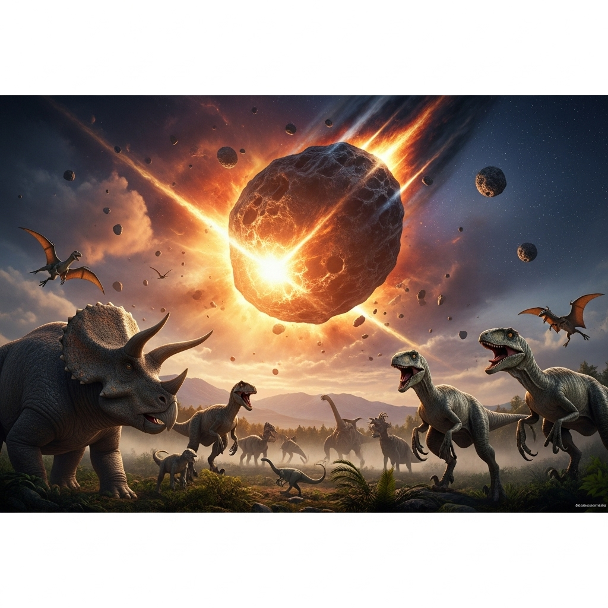
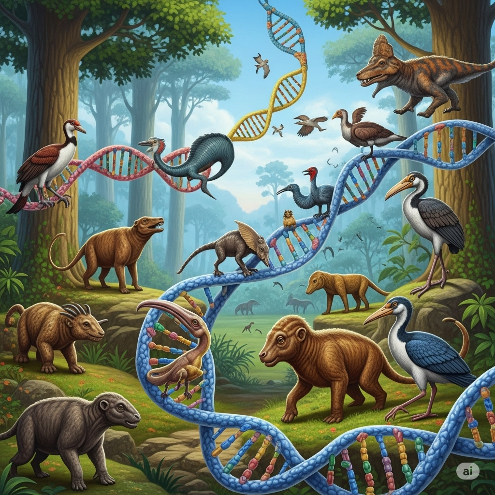
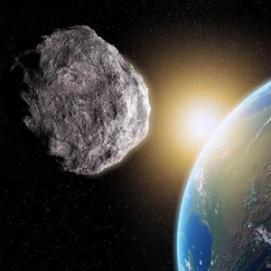
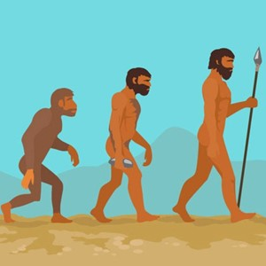
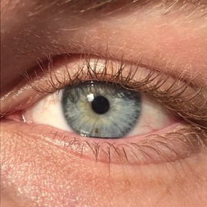
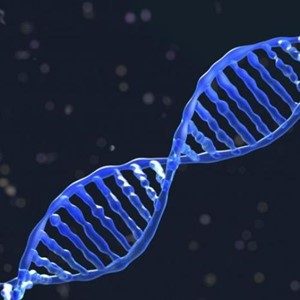
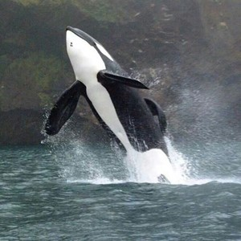

# How the Dinosaurs Really Died

Many scientists and **intellectuals** think that dinosaurs died when an **asteroid** smashed into the Earth millions of years ago. However, recently, there has been some **controversy** over this theory. Some scientists think that it isn’t **accurate**. They think that a tiny insect may have been the biggest **factor** in the death of these huge creatures. That insect was the mosquito.

These scientists do think that an **asteroid** hit the Earth the time of the dinosaurs. But that wasn’t what killed all of them. At that time, insects, including the mosquito, were beginning to **evolve**. Today, we can **regulate** the number of mosquitoes with **pesticides**. But that was impossible millions of years ago. The mosquitoes **multiplied** quickly. And they were certainly not idle. Since there were so many mosquitoes, it was easy for them to bite many of the dinosaurs. When they bit another living thing, the mosquitoes passed along a deadly disease. So the dinosaurs were **stricken** with the disease. A **vast** **majority** of them, from the **vegetarians** to the meat eaters, died.

[text](eew-4-22.md)

To **reinforce** this idea, scientists stress how gradually the dinosaurs died. If an **asteroid** killed them, they would have died very quickly. But the number of dinosaurs decreased slowly. In addition, scientists have found **genetic** material of mosquitoes in fossils. This material proves that mosquitoes existed back then. Although there may have been other **factors**, the dinosaurs died mainly because of disease, the scientists say.

No matter how it happened, the dinosaurs’ death had a major impact on other living things. Many dinosaurs ate **mammals**. After the dinosaurs died, **mammals** were able to **evolve** and produce **offspring**. Birds also **evolved**. Scientists have **analyzed** the **genomes** of birds, and they discovered that birds have **identical** **genetic** material to some dinosaurs. So there may still be dinosaurs among us after all.

---

Many scientists and **intellectuals** think that dinosaurs died when an **asteroid** smashed into the Earth millions of years ago.

However, recently, there has been some **controversy** over this theory.

Some scientists think that it isn’t **accurate**.

They think that a tiny insect may have been the biggest **factor** in the death of these huge creatures.

That insect was the mosquito.

These scientists do think that an **asteroid** hit the Earth the time of the dinosaurs.

But that wasn’t what killed all of them.

At that time, insects, including the mosquito, were beginning to **evolve**.

Today, we can **regulate** the number of mosquitoes with **pesticides**.

But that was impossible millions of years ago.

The mosquitoes **multiplied** quickly.

And they were certainly not idle.

Since there were so many mosquitoes, it was easy for them to bite many of the dinosaurs.

When they bit another living thing, the mosquitoes passed along a deadly disease.

So the dinosaurs were **stricken** with the disease.

A **vast** **majority** of them, from the **vegetarians** to the meat eaters, died.

To **reinforce** this idea, scientists stress how gradually the dinosaurs died.

If an **asteroid** killed them, they would have died very quickly.

But the number of dinosaurs decreased slowly.

In addition, scientists have found **genetic** material of mosquitoes in fossils.

This material proves that mosquitoes existed back then.

Although there may have been other **factors**, the dinosaurs died mainly because of disease, the scientists say.

No matter how it happened, the dinosaurs’ death had a major impact on other living things.

Many dinosaurs ate **mammals**.

After the dinosaurs died, **mammals** were able to **evolve** and produce **offspring**.

Birds also **evolved**.

Scientists have **analyzed** the **genomes** of birds, and they discovered that birds have **identical** **genetic** material to some dinosaurs.

So there may still be dinosaurs among us after all.

---

## 1. accurate (adj)

- **Nghĩa trong truyện:** chính xác  
- **Câu xuất hiện:** Some scientists think that it isn’t accurate.

**12 ví dụ với các thì:**
1. This information is accurate. *(Present Simple)*
2. She is being accurate with her measurements. *(Present Continuous)*
3. They have been accurate in their predictions. *(Present Perfect)*
4. His report was accurate. *(Past Simple)*
5. The data was being accurate when we checked. *(Past Continuous)*
6. She had been accurate before the error. *(Past Perfect)*
7. The forecast will be accurate. *(Future Simple)*
8. The results will be being accurate by tomorrow. *(Future Continuous)*
9. The report will have been accurate by the deadline. *(Future Perfect)*
10. If the data is accurate, we can proceed. *(Conditional)*
11. Being accurate is important in science. *(Gerund)*
12. I want to be accurate. *(To-infinitive)*

---

## 2. analyze (v)

- **Nghĩa trong truyện:** phân tích  
- **Câu xuất hiện:** Scientists have analyzed the genomes of birds...

**12 ví dụ với các thì:**
1. Scientists analyze data. *(Present Simple)*
2. She is analyzing the results now. *(Present Continuous)*
3. They have analyzed the samples. *(Present Perfect)*
4. He analyzed the report yesterday. *(Past Simple)*
5. We were analyzing the feedback. *(Past Continuous)*
6. She had analyzed the evidence before. *(Past Perfect)*
7. I will analyze the data tomorrow. *(Future Simple)*
8. They will be analyzing the trends next week. *(Future Continuous)*
9. He will have analyzed all the data by then. *(Future Perfect)*
10. If you analyze carefully, you find errors. *(Conditional)*
11. Analyzing information takes time. *(Gerund)*
12. I want to analyze the situation. *(To-infinitive)*

---

## 3. asteroid (n)

- **Nghĩa trong truyện:** tiểu hành tinh  
- **Câu xuất hiện:** Many scientists and intellectuals think that dinosaurs died when an asteroid smashed into the Earth millions of years ago. / These scientists do think that an asteroid hit the Earth the time of the dinosaurs. / If an asteroid killed them, they would have died very quickly.

**12 ví dụ với các thì:**
1. An asteroid orbits the sun. *(Present Simple)*
2. Scientists are tracking an asteroid. *(Present Continuous)*
3. They have discovered a new asteroid. *(Present Perfect)*
4. An asteroid hit the Earth long ago. *(Past Simple)*
5. Scientists were studying an asteroid. *(Past Continuous)*
6. They had identified the asteroid. *(Past Perfect)*
7. We will observe the asteroid. *(Future Simple)*
8. They will be studying the asteroid next year. *(Future Continuous)*
9. Scientists will have mapped the asteroid by 2030. *(Future Perfect)*
10. If an asteroid comes close, it is dangerous. *(Conditional)*
11. Studying asteroids is fascinating. *(Gerund)*
12. I want to learn about asteroids. *(To-infinitive)*

---

## 4. controversy (n)

- **Nghĩa trong truyện:** tranh cãi  
- **Câu xuất hiện:** However, recently, there has been some controversy over this theory.

**12 ví dụ với các thì:**
1. The topic causes controversy. *(Present Simple)*
2. A controversy is developing. *(Present Continuous)*
3. There has been much controversy. *(Present Perfect)*
4. The decision caused controversy. *(Past Simple)*
5. A controversy was brewing. *(Past Continuous)*
6. They had avoided controversy before. *(Past Perfect)*
7. The issue will create controversy. *(Future Simple)*
8. A controversy will be developing. *(Future Continuous)*
9. The matter will have caused controversy by then. *(Future Perfect)*
10. If there is controversy, we discuss it. *(Conditional)*
11. Avoiding controversy is difficult. *(Gerund)*
12. I want to understand the controversy. *(To-infinitive)*

---

## 5. evolve (v)

- **Nghĩa trong truyện:** tiến hóa  
- **Câu xuất hiện:** At that time, insects, including the mosquito, were beginning to evolve. / After the dinosaurs died, mammals were able to evolve and produce offspring. / Birds also evolved.

**12 ví dụ với các thì:**
1. Species evolve over time. *(Present Simple)*
2. The technology is evolving rapidly. *(Present Continuous)*
3. Humans have evolved from apes. *(Present Perfect)*
4. Life evolved on Earth. *(Past Simple)*
5. The organisms were evolving slowly. *(Past Continuous)*
6. They had evolved unique traits. *(Past Perfect)*
7. The system will evolve further. *(Future Simple)*
8. The software will be evolving next year. *(Future Continuous)*
9. The species will have evolved by then. *(Future Perfect)*
10. If organisms evolve, they adapt. *(Conditional)*
11. Evolving is a natural process. *(Gerund)*
12. I want to see how things evolve. *(To-infinitive)*

---

## 6. factor (n)

- **Nghĩa trong truyện:** yếu tố  
- **Câu xuất hiện:** They think that a tiny insect may have been the biggest factor in the death of these huge creatures. / Although there may have been other factors, the dinosaurs died mainly because of disease, the scientists say.

**12 ví dụ với các thì:**
1. This is a key factor. *(Present Simple)*
2. The weather is being a factor. *(Present Continuous)*
3. Several factors have influenced the outcome. *(Present Perfect)*
4. Cost was a major factor. *(Past Simple)*
5. The environment was being a factor. *(Past Continuous)*
6. They had considered all factors. *(Past Perfect)*
7. Health will be a factor. *(Future Simple)*
8. The economy will be being a factor. *(Future Continuous)*
9. All factors will have been considered. *(Future Perfect)*
10. If a factor changes, the result changes. *(Conditional)*
11. Considering all factors is wise. *(Gerund)*
12. I want to understand every factor. *(To-infinitive)*

---

## 7. genetic (adj)

- **Nghĩa trong truyện:** di truyền  
- **Câu xuất hiện:** In addition, scientists have found genetic material of mosquitoes in fossils. / Scientists have analyzed the genomes of birds, and they discovered that birds have identical genetic material to some dinosaurs.

**12 ví dụ với các thì:**
1. This is a genetic trait. *(Present Simple)*
2. Scientists are studying genetic codes. *(Present Continuous)*
3. They have found genetic links. *(Present Perfect)*
4. The research involved genetic analysis. *(Past Simple)*
5. They were examining genetic variations. *(Past Continuous)*
6. She had studied genetic diseases. *(Past Perfect)*
7. We will use genetic engineering. *(Future Simple)*
8. They will be studying genetic mutations. *(Future Continuous)*
9. The genetic map will have been completed. *(Future Perfect)*
10. If it is genetic, it is inherited. *(Conditional)*
11. Studying genetic material is complex. *(Gerund)*
12. I want to learn about genetic science. *(To-infinitive)*

---

## 8. genome (n)

- **Nghĩa trong truyện:** bộ gen  
- **Câu xuất hiện:** Scientists have analyzed the genomes of birds...

**12 ví dụ với các thì:**
1. The human genome is vast. *(Present Simple)*
2. Scientists are sequencing a genome. *(Present Continuous)*
3. They have mapped the genome. *(Present Perfect)*
4. He studied the plant genome. *(Past Simple)*
5. We were analyzing the genome data. *(Past Continuous)*
6. She had sequenced the genome before. *(Past Perfect)*
7. They will sequence the genome. *(Future Simple)*
8. Scientists will be mapping the genome next year. *(Future Continuous)*
9. The genome project will have finished. *(Future Perfect)*
10. If the genome is known, we understand more. *(Conditional)*
11. Sequencing a genome is a big task. *(Gerund)*
12. I want to study the genome. *(To-infinitive)*

---

## 9. identical (adj)

- **Nghĩa trong truyện:** giống hệt  
- **Câu xuất hiện:** Scientists have analyzed the genomes of birds, and they discovered that birds have identical genetic material to some dinosaurs.

**12 ví dụ với các thì:**
1. These two are identical. *(Present Simple)*
2. They are making identical copies. *(Present Continuous)*
3. We have found identical twins. *(Present Perfect)*
4. The results were identical. *(Past Simple)*
5. They were creating identical patterns. *(Past Continuous)*
6. She had made them identical. *(Past Perfect)*
7. The new version will be identical. *(Future Simple)*
8. They will be making identical parts. *(Future Continuous)*
9. The copies will have been identical. *(Future Perfect)*
10. If they are identical, you can't tell them apart. *(Conditional)*
11. Making things identical is hard. *(Gerund)*
12. I want to find an identical match. *(To-infinitive)*

---

## 10. intellectual (n)

- **Nghĩa trong truyện:** trí thức  
- **Câu xuất hiện:** Many scientists and intellectuals think that dinosaurs died when an asteroid smashed into the Earth millions of years ago.

**12 ví dụ với các thì:**
1. He is an intellectual. *(Present Simple)*
2. She is becoming an intellectual. *(Present Continuous)*
3. They have been intellectuals for years. *(Present Perfect)*
4. He was a respected intellectual. *(Past Simple)*
5. They were being intellectuals. *(Past Continuous)*
6. She had become an intellectual. *(Past Perfect)*
7. He will be an intellectual leader. *(Future Simple)*
8. They will be becoming intellectuals. *(Future Continuous)*
9. She will have become a leading intellectual. *(Future Perfect)*
10. If you are an intellectual, you think deeply. *(Conditional)*
11. Being an intellectual requires study. *(Gerund)*
12. I want to be an intellectual. *(To-infinitive)*

---

## 11. majority (n)

- **Nghĩa trong truyện:** đa số  
- **Câu xuất hiện:** A vast majority of them, from the vegetarians to the meat eaters, died.

**12 ví dụ với các thì:**
1. The majority agrees. *(Present Simple)*
2. The majority is voting now. *(Present Continuous)*
3. The majority has decided. *(Present Perfect)*
4. The majority voted yes. *(Past Simple)*
5. The majority was supporting the idea. *(Past Continuous)*
6. The majority had left. *(Past Perfect)*
7. The majority will win. *(Future Simple)*
8. The majority will be voting tomorrow. *(Future Continuous)*
9. The majority will have arrived by noon. *(Future Perfect)*
10. If the majority votes, the decision is made. *(Conditional)*
11. Representing the majority is important. *(Gerund)*
12. I want to be part of the majority. *(To-infinitive)*

---

## 12. mammal (n)

- **Nghĩa trong truyện:** động vật có vú  
- **Câu xuất hiện:** Many dinosaurs ate mammals. / After the dinosaurs died, mammals were able to evolve and produce offspring.

**12 ví dụ với các thì:**
1. A dog is a mammal. *(Present Simple)*
2. Scientists are studying a new mammal species. *(Present Continuous)*
3. They have discovered a rare mammal. *(Present Perfect)*
4. We saw a large mammal yesterday. *(Past Simple)*
5. They were observing the mammals. *(Past Continuous)*
6. She had studied marine mammals. *(Past Perfect)*
7. We will see many mammals on the trip. *(Future Simple)*
8. They will be tracking the mammal migration. *(Future Continuous)*
9. The mammal population will have increased. *(Future Perfect)*
10. If it is a mammal, it has fur. *(Conditional)*
11. Studying mammals is interesting. *(Gerund)*
12. I want to see a wild mammal. *(To-infinitive)*

---

## 13. multiply (v)

- **Nghĩa trong truyện:** nhân lên, sinh sôi nảy nở  
- **Câu xuất hiện:** The mosquitoes multiplied quickly.

**12 ví dụ với các thì:**
1. Rabbits multiply fast. *(Present Simple)*
2. The bacteria are multiplying. *(Present Continuous)*
3. They have multiplied their efforts. *(Present Perfect)*
4. The cells multiplied rapidly. *(Past Simple)*
5. The numbers were multiplying. *(Past Continuous)*
6. The population had multiplied. *(Past Perfect)*
7. The plants will multiply. *(Future Simple)*
8. The insects will be multiplying soon. *(Future Continuous)*
9. The value will have multiplied by then. *(Future Perfect)*
10. If you multiply two by two, you get four. *(Conditional)*
11. Multiplying numbers is easy. *(Gerund)*
12. I want to multiply my savings. *(To-infinitive)*

---

## 14. offspring (n)

- **Nghĩa trong truyện:** con cái, hậu duệ  
- **Câu xuất hiện:** After the dinosaurs died, mammals were able to evolve and produce offspring.

**12 ví dụ với các thì:**
1. The animal produces offspring. *(Present Simple)*
2. She is raising her offspring. *(Present Continuous)*
3. They have produced many offspring. *(Present Perfect)*
4. The plant produced offspring. *(Past Simple)*
5. The birds were feeding their offspring. *(Past Continuous)*
6. She had protected her offspring. *(Past Perfect)*
7. The fish will produce offspring. *(Future Simple)*
8. They will be raising their offspring. *(Future Continuous)*
9. The species will have produced offspring. *(Future Perfect)*
10. If an animal has offspring, it reproduces. *(Conditional)*
11. Raising offspring takes effort. *(Gerund)*
12. I want to see the offspring. *(To-infinitive)*

---

## 15. pesticide (n)

- **Nghĩa trong truyện:** thuốc trừ sâu  
- **Câu xuất hiện:** Today, we can regulate the number of mosquitoes with pesticides.

**12 ví dụ với các thì:**
1. Farmers use pesticides. *(Present Simple)*
2. They are applying pesticide now. *(Present Continuous)*
3. We have used pesticides before. *(Present Perfect)*
4. He sprayed pesticide yesterday. *(Past Simple)*
5. They were using pesticide when I arrived. *(Past Continuous)*
6. She had applied pesticide earlier. *(Past Perfect)*
7. We will buy pesticide tomorrow. *(Future Simple)*
8. They will be using pesticide next week. *(Future Continuous)*
9. The crops will have been treated with pesticide. *(Future Perfect)*
10. If you use pesticide, be careful. *(Conditional)*
11. Using pesticide can be harmful. *(Gerund)*
12. I want to avoid pesticide. *(To-infinitive)*

---

## 16. regulate (v)

- **Nghĩa trong truyện:** điều chỉnh  
- **Câu xuất hiện:** Today, we can regulate the number of mosquitoes with pesticides.

**12 ví dụ với các thì:**
1. The government regulates industries. *(Present Simple)*
2. She is regulating the temperature. *(Present Continuous)*
3. They have regulated the market. *(Present Perfect)*
4. He regulated the flow of traffic. *(Past Simple)*
5. We were regulating the pressure. *(Past Continuous)*
6. She had regulated the system. *(Past Perfect)*
7. The new law will regulate pollution. *(Future Simple)*
8. They will be regulating the process. *(Future Continuous)*
9. The rules will have regulated the activity. *(Future Perfect)*
10. If you regulate the speed, it is safer. *(Conditional)*
11. Regulating emissions is important. *(Gerund)*
12. I want to regulate my sleep schedule. *(To-infinitive)*

---

## 17. reinforce (v)

- **Nghĩa trong truyện:** củng cố  
- **Câu xuất hiện:** To reinforce this idea, scientists stress how gradually the dinosaurs died.

**12 ví dụ với các thì:**
1. The evidence reinforces the theory. *(Present Simple)*
2. They are reinforcing the structure. *(Present Continuous)*
3. She has reinforced her argument. *(Present Perfect)*
4. He reinforced the wall. *(Past Simple)*
5. We were reinforcing the idea. *(Past Continuous)*
6. They had reinforced their position. *(Past Perfect)*
7. This will reinforce the message. *(Future Simple)*
8. They will be reinforcing the bridge. *(Future Continuous)*
9. The point will have been reinforced. *(Future Perfect)*
10. If you reinforce the support, it is stronger. *(Conditional)*
11. Reinforcing good habits is beneficial. *(Gerund)*
12. I want to reinforce my understanding. *(To-infinitive)*

---

## 18. stricken (adj)

- **Nghĩa trong truyện:** bị ảnh hưởng nặng nề (bởi bệnh tật)  
- **Câu xuất hiện:** So the dinosaurs were stricken with the disease.

**12 ví dụ với các thì:**
1. He is often stricken with colds. *(Present Simple)*
2. The area is being stricken by drought. *(Present Continuous)*
3. They have been stricken by misfortune. *(Present Perfect)*
4. She was stricken with grief. *(Past Simple)*
5. The region was being stricken by famine. *(Past Continuous)*
6. He had been stricken by illness before. *(Past Perfect)*
7. They will be stricken by the news. *(Future Simple)*
8. The population will be being stricken by the virus. *(Future Continuous)*
9. The city will have been stricken by the storm. *(Future Perfect)*
10. If you are stricken, you need help. *(Conditional)*
11. Being stricken by poverty is hard. *(Gerund)*
12. I want to avoid being stricken by illness. *(To-infinitive)*

---

## 19. vast (adj)

- **Nghĩa trong truyện:** rộng lớn, đông đảo  
- **Câu xuất hiện:** A vast majority of them, from the vegetarians to the meat eaters, died.

**12 ví dụ với các thì:**
1. The ocean is vast. *(Present Simple)*
2. They are exploring a vast area. *(Present Continuous)*
3. We have seen vast landscapes. *(Present Perfect)*
4. The desert was vast. *(Past Simple)*
5. They were crossing a vast plain. *(Past Continuous)*
6. She had traveled across a vast distance. *(Past Perfect)*
7. The universe will seem vast. *(Future Simple)*
8. They will be exploring a vast territory. *(Future Continuous)*
9. A vast amount of data will have been collected. *(Future Perfect)*
10. If it is vast, it is huge. *(Conditional)*
11. Exploring vast spaces is exciting. *(Gerund)*
12. I want to see a vast forest. *(To-infinitive)*

---

## 20. vegetarian (n)

- **Nghĩa trong truyện:** người ăn chay  
- **Câu xuất hiện:** A vast majority of them, from the vegetarians to the meat eaters, died.

**12 ví dụ với các thì:**
1. She is a vegetarian. *(Present Simple)*
2. He is becoming a vegetarian. *(Present Continuous)*
3. They have been vegetarians for years. *(Present Perfect)*
4. I was a vegetarian last year. *(Past Simple)*
5. We were being vegetarians. *(Past Continuous)*
6. She had been a vegetarian before. *(Past Perfect)*
7. He will be a vegetarian. *(Future Simple)*
8. They will be becoming vegetarians. *(Future Continuous)*
9. She will have been a vegetarian for a decade. *(Future Perfect)*
10. If you are a vegetarian, you don't eat meat. *(Conditional)*
11. Being a vegetarian has benefits. *(Gerund)*
12. I want to try being a vegetarian. *(To-infinitive)*