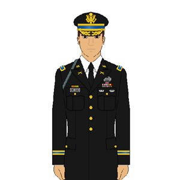

# The Forest People

**Colonel** Wilbur and his wife Mary were flying over the **tropics** in their private plane. But suddenly the engine caught fire. It was impossible to **extinguish** the fire, so they were forced to land in the forest.

“What are we going to do?” said Mary. “Can you fix the plane?”

Wilbur said, “That’s impossible. I am not a **technician**, and the plane is out of gasoline. We’ll have to find help.”

Wilbur and Mary walked through the forest. It was difficult to find a path through the trees. Mary even tore her dress on sharp thorns. Suddenly, they saw some huts and lots of **miniature** people, cooking and making weapons with **flint**.

“I’ll ask them for help,” said Wilbur.

“No! Don’t go! They are **deformed**!” said Mary. “They’ll **harass** us! They may have a **contagious** virus that will make us sick! We won’t know how to **cure** it. We’ll surely end up as **corpses**!”

Wilbur tried to persuade Mary to go to the forest people, but she refused to **integrate** with them. She had the **assumption** that the small people were dangerous. “Let’s keep walking. We’re sure to find someone sooner or later.”

For three days, the couple searched, but they found no one who could help them in their **crisis**. It was uncomfortable, and they were hungry without any source of **nutrition**. Plus, the forest was filled with dangerous **beasts**. Finally, Mary agreed to return to the forest people.
s

When Wilbur and Mary arrived at the village, the forest people immediately welcomed them. They gave them bread made from **barely** to eat and a place to sleep. The next day, the forest people led Wilbur and Mary through the trees, and they **promptly** arrived at a small town. From there, they took a bus to the city where they found an **embassy**.

Mary was sorry that she had not trusted the forest people sooner. She learned the value of not **discriminating** against people who are different.

--------

-----

## 1. assumption, n

**Nghĩa trong câu truyện:** một niềm tin được chấp nhận là đúng hoặc chắc chắn sẽ xảy ra mà không có bằng chứng.
**Câu trong câu truyện:** "She had the assumption that the small people were dangerous."

**Ví dụ:**
- That's a big assumption to make.
- My assumption was wrong.
- We should not make assumptions about others.
- His assumption proved to be false.
- The plan was based on a faulty assumption.
- It's a common assumption that cats hate water.
- Don't jump to conclusions based on assumptions.
- Her assumption about the weather was correct.
- We need to question our assumptions.
- The project failed due to an incorrect assumption.
- Making assumptions can lead to misunderstandings.
- What is your assumption about the outcome?

## 2. barley, n

**Nghĩa trong câu truyện:** một loại ngũ cốc dùng làm thức ăn và làm bia, rượu whisky.
**Câu trong câu truyện:** "They gave them bread made from barely to eat and a place to sleep." (Lưu ý: từ trong truyện viết là 'barely', nhưng nghĩa phù hợp với 'barley' trong danh sách từ vựng).

**Ví dụ:**
- Barley is a healthy grain.
- We had barley soup for dinner.
- Barley is used to make beer.
- The field was full of barley.
- Barley bread is very nutritious.
- Animals eat barley.
- Barley is grown in many countries.
- She added barley to the stew.
- Barley has a nutty flavor.
- You can buy barley at the store.
- The recipe calls for pearl barley.
- Barley is a type of cereal grain.

## 3. beast, n

**Nghĩa trong câu truyện:** một con vật, đặc biệt là con vật lớn hoặc nguy hiểm.
**Câu trong câu truyện:** "Plus, the forest was filled with dangerous beasts."

**Ví dụ:**
- The lion is a powerful beast.
- He fought the wild beast.
- The forest is home to many beasts.
- A mythical beast was in the story.
- The beast roared loudly.
- She was afraid of the beast.
- The hunter tracked the beast.
- It was a terrifying beast.
- The beast emerged from the cave.
- He treated her like a beast.
- The beast had sharp claws.
- They captured the beast.

## 4. colonel, n

**Nghĩa trong câu truyện:** cấp bậc sĩ quan trong quân đội, không quân hoặc thủy quân lục chiến.
**Câu trong câu truyện:** "Colonel Wilbur and his wife Mary were flying over the tropics in their private plane."

**Ví dụ:**
- Colonel Smith gave the order.
- He was promoted to colonel.
- The colonel wore his uniform.
- She met the colonel at the base.
- The colonel commanded the regiment.
- He retired as a colonel.
- The colonel inspected the troops.
- She spoke to the colonel about her concerns.
- The colonel had served for many years.
- He is a decorated colonel.
- The colonel arrived by helicopter.
- The colonel's office was on the second floor.

## 5. contagious, adj

**Nghĩa trong câu truyện:** (của bệnh) lây lan từ người này sang người khác hoặc sinh vật khác bằng cách tiếp xúc trực tiếp hoặc gián tiếp.
**Câu trong câu truyện:** "They may have a contagious virus that will make us sick!"

**Ví dụ:**
- The flu is very contagious.
- Wash your hands to avoid contagious diseases.
- His laughter was contagious.
- The virus is highly contagious.
- Stay home if you have a contagious illness.
- Measles is a contagious disease.
- The doctor warned about the contagious nature of the infection.
- Her enthusiasm was contagious.
- The rash might be contagious.
- Avoid contact with contagious people.
- The disease spread quickly because it was contagious.
- Is this cold contagious?

## 6. corpse, n

**Nghĩa trong câu truyện:** xác chết, đặc biệt là của con người.
**Câu trong câu truyện:** "We’ll surely end up as corpses!"

**Ví dụ:**
- The police found the corpse.
- The corpse was taken to the morgue.
- They identified the corpse.
- The corpse lay on the ground.
- The smell of the corpse was strong.
- He looked like a walking corpse.
- The ancient tomb contained many corpses.
- The forensic team examined the corpse.
- The battle left many corpses.
- They covered the corpse with a sheet.
- The corpse showed signs of injury.
- The movie showed a reanimated corpse.

## 7. crisis, n

**Nghĩa trong câu truyện:** thời điểm khó khăn, rắc rối hoặc nguy hiểm tột độ.
**Câu trong câu truyện:** "For three days, the couple searched, but they found no one who could help them in their crisis."

**Ví dụ:**
- The country is facing an economic crisis.
- She handled the crisis calmly.
- It was a moment of crisis.
- They need help during this crisis.
- The company is in a financial crisis.
- He had a personal crisis.
- The government is trying to resolve the crisis.
- The crisis affected everyone.
- They managed to overcome the crisis.
- The environmental crisis is serious.
- We need a plan to deal with the crisis.
- The crisis brought people together.

## 8. cure, v

**Nghĩa trong câu truyện:** làm giảm (một người hoặc động vật) các triệu chứng của bệnh hoặc tình trạng.
**Câu trong câu truyện:** "We won’t know how to cure it."

**Ví dụ:**
- Can this medicine cure the disease?
- Doctors are working to find a cure.
- Rest and fluids can help cure a cold.
- There is no known way to cure this condition.
- The treatment aims to cure the patient.
- She hopes the therapy will cure her pain.
- They are researching ways to cure cancer.
- Time can cure many things.
- The doctor said he could cure her.
- Is there a cure for the common cold?
- The new drug might cure the infection.
- He was cured after the operation.

## 9. deformed, adj

**Nghĩa trong câu truyện:** (của một người hoặc bộ phận cơ thể) không có hình dạng hoặc hình thức bình thường hoặc tự nhiên.
**Câu trong câu truyện:** "“No! Don’t go! They are deformed!” said Mary."

**Ví dụ:**
- The accident left his hand deformed.
- The plant grew in a deformed shape.
- Some animals are born deformed.
- The old building was deformed by the earthquake.
- He had a slightly deformed ear.
- The artist created a deformed figure.
- The tree's branches were deformed.
- She felt self-conscious about her deformed foot.
- The metal was deformed by the heat.
- The creature had a deformed face.
- The fruit was small and deformed.
- He was not afraid of the deformed people.

## 10. discriminate, v

**Nghĩa trong câu truyện:** tạo ra sự phân biệt đối xử không công bằng hoặc thành kiến trong cách đối xử với các nhóm người hoặc sự vật khác nhau, đặc biệt dựa trên chủng tộc, tuổi tác, giới tính, v.v.
**Câu trong câu truyện:** "She learned the value of not discriminating against people who are different."

**Ví dụ:**
- It is illegal to discriminate based on race.
- Employers should not discriminate against older workers.
- We must fight to end discrimination.
- The law protects people from being discriminated against.
- She felt discriminated against because of her accent.
- Do not discriminate against anyone.
- The policy was designed to prevent discrimination.
- They were accused of discriminating against women.
- It's important to teach children not to discriminate.
- The company does not discriminate in hiring.
- Discrimination is a serious problem.
- He learned not to discriminate against people from different cultures.

## 11. embassy, n

**Nghĩa trong câu truyện:** trụ sở hoặc văn phòng chính thức của một đại sứ.
**Câu trong câu truyện:** "From there, they took a bus to the city where they found an embassy."

**Ví dụ:**
- The American embassy is in the capital city.
- He went to the embassy to get a visa.
- The embassy is a secure building.
- She works at the British embassy.
- The ambassador lives at the embassy.
- They sought help from their embassy.
- The embassy provides services to citizens abroad.
- There was a protest outside the embassy.
- He reported the incident to the embassy.
- The embassy is located downtown.
- Security was tight around the embassy.
- She visited the French embassy.

## 12. extinguish, v

**Nghĩa trong câu truyện:** dập tắt (lửa hoặc ánh sáng).
**Câu trong câu truyện:** "It was impossible to extinguish the fire, so they were forced to land in the forest."

**Ví dụ:**
- The firefighters worked to extinguish the blaze.
- He used water to extinguish the campfire.
- Please extinguish your cigarette.
- The rain helped extinguish the forest fire.
- They couldn't extinguish the burning car.
- The candle was extinguished by the wind.
- He tried to extinguish the flames with a blanket.
- The fire was difficult to extinguish.
- They used a special foam to extinguish the fire.
- The light was extinguished.
- The fire extinguisher is used to extinguish fires.
- She watched the fire slowly extinguish.

## 13. flint, n

**Nghĩa trong câu truyện:** một loại đá cứng màu xám tạo ra tia lửa khi va chạm với thép.
**Câu trong câu truyện:** "Suddenly, they saw some huts and lots of miniature people, cooking and making weapons with flint."

**Ví dụ:**
- Early humans used flint to make tools.
- He struck the flint to make a spark.
- The lighter uses a piece of flint.
- Flint is a type of rock.
- They found ancient flint tools.
- Flint was important for starting fires.
- The arrowheads were made of flint.
- He carried a flint and steel.
- The soil contained pieces of flint.
- Flint is very hard.
- They chipped the flint into shape.
- The spark from the flint ignited the tinder.

## 14. harass, v

**Nghĩa trong câu truyện:** gây áp lực hoặc đe dọa một cách hung hăng.
**Câu trong câu truyện:** "They’ll harass us!"

**Ví dụ:**
- Do not harass your coworkers.
- She reported him for harassing her.
- The police warned him to stop harassing his neighbor.
- He felt harassed by the constant calls.
- They were accused of harassing the protesters.
- It is illegal to harass someone.
- The company has a policy against harassment.
- He would often harass her with unwanted attention.
- The birds were harassing the cat.
- She felt unsafe because he kept harassing her.
- The online trolls continued to harass the user.
- They were told not to harass the wildlife.

## 15. integrate, v

**Nghĩa trong câu truyện:** kết hợp (một thứ) với thứ khác để chúng trở thành một thể thống nhất; (của một người hoặc nhóm) kết hợp với một xã hội hoặc nhóm khác.
**Câu trong câu truyện:** "Wilbur tried to persuade Mary to go to the forest people, but she refused to integrate with them."

**Ví dụ:**
- It's important to integrate new students into the class.
- She found it hard to integrate into the new culture.
- The goal is to integrate the two systems.
- He quickly integrated into the team.
- The school helps children with disabilities integrate.
- They are working to integrate the refugees into society.
- The software can integrate with other programs.
- It takes time to fully integrate.
- The company is trying to integrate its different departments.
- She felt welcomed and was able to integrate easily.
- The new features integrate seamlessly.
- They need to integrate the new technology.

## 16. miniature, adj

**Nghĩa trong câu truyện:** (của một bản sao của thứ gì đó) nhỏ hơn nhiều so với bình thường, đặc biệt là một bản sao.
**Câu trong câu truyện:** "Suddenly, they saw some huts and lots of miniature people, cooking and making weapons with flint."

**Ví dụ:**
- He collects miniature cars.
- She painted a miniature portrait.
- The garden had miniature trees.
- It was a miniature version of the real thing.
- They lived in a miniature house.
- He built a miniature railway.
- The museum displayed miniature furniture.
- She bought a miniature poodle.
- The artist specialized in miniature paintings.
- It looked like a miniature forest.
- The set included miniature tools.
- He had a collection of miniature bottles.

## 17. nutrition, n

**Nghĩa trong câu truyện:** quá trình cung cấp hoặc thu nhận thức ăn cần thiết cho sức khỏe và sự phát triển.
**Câu trong câu truyện:** "It was uncomfortable, and they were hungry without any source of nutrition."

**Ví dụ:**
- Good nutrition is essential for health.
- She studies nutrition at university.
- The food provides excellent nutrition.
- Children need proper nutrition to grow.
- He is interested in sports nutrition.
- Read the nutrition label on the food.
- Lack of nutrition can cause health problems.
- The soil provides nutrition for the plants.
- She gave him advice on nutrition.
- Eating a balanced diet ensures good nutrition.
- The book is about nutrition for athletes.
- They discussed the importance of nutrition.

## 18. promptly, adv

**Nghĩa trong câu truyện:** với ít hoặc không có sự chậm trễ; ngay lập tức.
**Câu trong câu truyện:** "The next day, the forest people led Wilbur and Mary through the trees, and they promptly arrived at a small town."

**Ví dụ:**
- Please reply promptly.
- She arrived promptly at 9 o'clock.
- He paid the bill promptly.
- The doctor saw the patient promptly.
- The train departed promptly on time.
- She answered the question promptly.
- The issue was dealt with promptly.
- He reacted promptly to the danger.
- The delivery arrived promptly.
- Please complete the task promptly.
- The meeting started promptly.
- She responded promptly to the email.

## 19. technician, n

**Nghĩa trong câu truyện:** người được thuê để trông coi thiết bị kỹ thuật hoặc làm công việc thực hành trong phòng thí nghiệm hoặc hỗ trợ một loại công việc thực hành cụ thể.
**Câu trong câu truyện:** "I am not a technician, and the plane is out of gasoline."

**Ví dụ:**
- The computer technician fixed my laptop.
- He works as a lab technician.
- The sound technician set up the equipment.
- She called a repair technician.
- The theater needs a lighting technician.
- He is a skilled technician.
- The technician checked the machine.
- She trained to be a medical technician.
- The car needs to be checked by a technician.
- The technician explained the problem.
- He is an expert technician.
- The company hired a new technician.

## 20. tropics, n

**Nghĩa trong câu truyện:** khu vực giữa Chí tuyến Bắc và Chí tuyến Nam, đặc trưng bởi khí hậu nóng.
**Câu trong câu truyện:** "Colonel Wilbur and his wife Mary were flying over the tropics in their private plane."

**Ví dụ:**
- The tropics have a warm climate.
- Many exotic plants grow in the tropics.
- They are planning a trip to the tropics.
- The rainforest is located in the tropics.
- Life in the tropics can be challenging.
- He prefers the heat of the tropics.
- The storm formed in the tropics.
- The tropics are known for their biodiversity.
- She loves visiting tropical islands.
- The map shows the tropics clearly.
- The humidity is high in the tropics.
- They studied the wildlife of the tropics.

