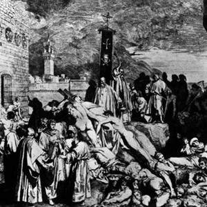
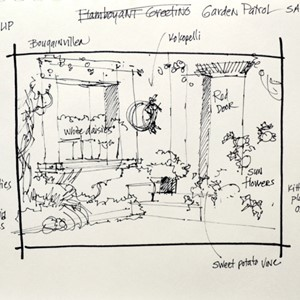
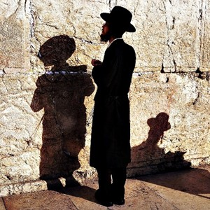

# Thucydides and the Plague of Athens

Thucydides was the world’s first historian. **Presently**, we get most of our knowledge about ancient Greece from his writing. But Thucydides didn’t just write about history, he lived through it. However, he almost didn’t survive one historical event: the **Plague** of Athens.

In 430 BCE, an army attacked the city of Athens, where Thucydides lived. Thousands of people hid from the army behind Athens’ large walls. The city became very crowded as the population **expanded**. Then a **horrifying** disease broke out. People **summoned** doctors. But it was to no **avail** because no one understood how the disease spread. It seemed **random**. They didn’t know that it was an **organism**. Instead, they **defined** disease as a punishment from their gods. Thucydides was **incredulous** that gods caused the **plague**, but he explained why others believed it. There was an old, long verse which predicted the disease. To **paraphrase** it, the verse said the gods would send a disease during a war. As a result, large crowds gathered at **shrines** to ask the gods to stop the **plague**. But the situation only **worsened** because these people were so close to each other they became sick. That’s how they learned a **fundamental** lesson about the **plague**: it spread from person to person.

People wanted to leave the crowded city, but they **dreaded** what the army outside would do to them. At this time, Thucydides got sick, too. He quickly **scribbled** down notes because he thought he would soon die. His writing shows a **stark** contrast between people’s behavior before and during the **plague**. There were **riots**, and people ignored laws. They didn’t think they’d live long enough to be punished. Many sick people were left to die in **solitude** because no one wanted to be near them. The **plague** **lingered** for two years. But luckily, Thucydides survived. Without his writing, we would know much less about ancient Greece and the **Plague** of Athens.

---
# Thucydides and the Plague of Athens

Thucydides was the world’s first historian.

**Presently**, we get most of our knowledge about ancient Greece from his writing.

But Thucydides didn’t just write about history, he lived through it.

However, he almost didn’t survive one historical event: the **Plague** of Athens.

In 430 BCE, an army attacked the city of Athens, where Thucydides lived.

Thousands of people hid from the army behind Athens’ large walls.

The city became very crowded as the population **expanded**.

Then a **horrifying** disease broke out.

People **summoned** doctors.

But it was to no **avail** because no one understood how the disease spread.

It seemed **random**.

They didn’t know that it was an **organism**.

Instead, they **defined** disease as a punishment from their gods.

Thucydides was **incredulous** that gods caused the **plague**, but he explained why others believed it.

There was an old, long verse which predicted the disease.

To **paraphrase** it, the verse said the gods would send a disease during a war.

As a result, large crowds gathered at **shrines** to ask the gods to stop the **plague**.

But the situation only **worsened** because these people were so close to each other they became sick.

That’s how they learned a **fundamental** lesson about the **plague**: it spread from person to person.

People wanted to leave the crowded city, but they **dreaded** what the army outside would do to them.

At this time, Thucydides got sick, too.

He quickly **scribbled** down notes because he thought he would soon die.

His writing shows a **stark** contrast between people’s behavior before and during the **plague**.

There were **riots**, and people ignored laws.

They didn’t think they’d live long enough to be punished.

Many sick people were left to die in **solitude** because no one wanted to be near them.

The **plague** **lingered** for two years.

But luckily, Thucydides survived.

Without his writing, we would know much less about ancient Greece and the **Plague** of Athens.

---

## 1. avail, n

**Nghĩa trong câu truyện:** sự hữu ích hoặc lợi ích.
**Câu trong câu truyện:** "But it was to no avail because no one understood how the disease spread."

**Ví dụ:**
- His efforts were to no avail.
- She tried to fix it, but to no avail.
- All their pleading was to no avail.
- The medicine was of little avail.
- They searched everywhere, but to no avail.

## 2. expand, v

**Nghĩa trong câu truyện:** trở nên hoặc làm cho lớn hơn hoặc rộng hơn.
**Câu trong câu truyện:** "The city became very crowded as the population expanded."

**Ví dụ:**
- The company plans to expand next year.
- The balloon expanded as he blew air into it.
- Reading helps to expand your vocabulary.
- The universe is constantly expanding.
- They want to expand their business into new markets.

## 3. define, v

**Nghĩa trong câu truyện:** nêu hoặc mô tả chính xác bản chất, phạm vi hoặc ý nghĩa của thứ gì đó.
**Câu trong câu truyện:** "Instead, they defined disease as a punishment from their gods."

**Ví dụ:**
- Can you define the word 'democracy'?
- The contract clearly defines the terms.
- We need to define the project goals.
- His role in the team is well-defined.
- The boundaries of the park are defined by the river.

## 4. dread, v

**Nghĩa trong câu truyện:** dự đoán với sự lo sợ hoặc sợ hãi lớn.
**Câu trong câu truyện:** "People wanted to leave the crowded city, but they dreaded what the army outside would do to them."

**Ví dụ:**
- I dread going to the dentist.
- She dreaded the thought of being alone.
- He dreaded facing the consequences.
- They dreaded the long journey ahead.
- I used to dread public speaking.

## 5. fundamental, adj

**Nghĩa trong câu truyện:** tạo thành một nền tảng hoặc cốt lõi cần thiết; có tầm quan trọng trung tâm.
**Câu trong câu truyện:** "That’s how they learned a fundamental lesson about the plague: it spread from person to person."

**Ví dụ:**
- Clean water is a fundamental human right.
- We need to understand the fundamental principles.
- Honesty is fundamental to a good relationship.
- He taught us the fundamental skills.
- There is a fundamental difference between the two ideas.

## 6. horrifying, adj

**Nghĩa trong câu truyện:** gây ra cảm giác kinh hoàng.
**Câu trong câu truyện:** "Then a horrifying disease broke out."

**Ví dụ:**
- It was a horrifying accident.
- She heard a horrifying scream.
- The news was horrifying.
- He described the horrifying scene.
- The movie was too horrifying for me.

## 7. incredulous, adj

**Nghĩa trong câu truyện:** không sẵn lòng hoặc không thể tin vào điều gì đó.
**Câu trong câu truyện:** "Thucydides was incredulous that gods caused the plague, but he explained why others believed it."

**Ví dụ:**
- He listened to the story with an incredulous smile.
- She was incredulous when she heard the news.
- They looked at him with incredulous eyes.
- His reaction was one of incredulous surprise.
- I was incredulous at the amount of money they spent.

## 8. linger, v

**Nghĩa trong câu truyện:** ở lại một nơi lâu hơn mức cần thiết, thường là do miễn cưỡng rời đi.
**Câu trong câu truyện:** "The plague lingered for two years."

**Ví dụ:**
- The smell of smoke lingered in the air.
- She lingered in the doorway, unsure whether to enter.
- The memory of the event lingered in his mind.
- He lingered over his coffee.
- The cold weather lingered longer than expected.

## 9. organism, n

**Nghĩa trong câu truyện:** một cá thể động vật, thực vật hoặc dạng sống đơn bào.
**Câu trong câu truyện:** "They didn’t know that it was an organism."

**Ví dụ:**
- A bacterium is a single-celled organism.
- Scientists study different types of organisms.
- Every living organism needs water.
- The soil is full of tiny organisms.
- A plant is a multicellular organism.

## 10. paraphrase, v

**Nghĩa trong câu truyện:** diễn đạt lại ý nghĩa của (thứ gì đó được viết hoặc nói) bằng các từ khác, đặc biệt là để đạt được sự rõ ràng hơn.
**Câu trong câu truyện:** "To paraphrase it, the verse said the gods would send a disease during a war."

**Ví dụ:**
- Can you paraphrase that sentence for me?
- He paraphrased the main points of the speech.
- Try to paraphrase the text in your own words.
- She was asked to paraphrase the instructions.
- It's important to paraphrase sources to avoid plagiarism.

## 11. plague, n

**Nghĩa trong câu truyện:** một bệnh truyền nhiễm lây lan nhanh và gây tử vong cho nhiều người.
**Câu trong câu truyện:** "However, he almost didn’t survive one historical event: the Plague of Athens."

**Ví dụ:**
- The Black Death was a terrible plague.
- The city was hit by a sudden plague.
- They prayed for the plague to end.
- The plague spread quickly through the population.
- Historical records describe the symptoms of the plague.

## 12. presently, adv

**Nghĩa trong câu truyện:** vào thời điểm hiện tại; bây giờ.
**Câu trong câu truyện:** "Presently, we get most of our knowledge about ancient Greece from his writing."

**Ví dụ:**
- He is presently working on a new project.
- The office is presently closed.
- Presently, I don't have enough information.
- She is presently living in London.
- The system is presently unavailable.

## 13. random, adj

**Nghĩa trong câu truyện:** được thực hiện, làm hoặc xảy ra mà không có phương pháp hoặc quyết định có ý thức.
**Câu trong câu truyện:** "It seemed random."

**Ví dụ:**
- We picked a random number.
- The questions were in a random order.
- He made a random comment.
- The winning ticket was chosen at random.
- It was a random act of kindness.

## 14. riot, n

**Nghĩa trong câu truyện:** một cuộc gây rối bạo lực bởi một đám đông.
**Câu trong câu truyện:** "There were riots, and people ignored laws."

**Ví dụ:**
- The police were called to control the riot.
- A riot broke out after the game.
- The streets were filled with rioters.
- They tried to prevent a riot.
- The protest turned into a riot.

## 15. scribble, v

**Nghĩa trong câu truyện:** viết hoặc vẽ (thứ gì đó) một cách cẩu thả hoặc vội vàng.
**Câu trong câu truyện:** "He quickly scribbled down notes because he thought he would soon die."

**Ví dụ:**
- She scribbled a note on a piece of paper.
- He likes to scribble in his notebook.
- The child was scribbling on the wall.
- I quickly scribbled down the address.
- His handwriting was a messy scribble.

## 16. shrine, n

**Nghĩa trong câu truyện:** một nơi được coi là linh thiêng vì liên quan đến thần linh hoặc người/vật linh thiêng, được đánh dấu bằng bàn thờ, tòa nhà hoặc công trình khác.
**Câu trong câu truyện:** "As a result, large crowds gathered at shrines to ask the gods to stop the plague."

**Ví dụ:**
- They visited the ancient shrine.
- The temple is a sacred shrine.
- People left offerings at the shrine.
- There is a small shrine in the garden.
- The town is famous for its historical shrines.

## 17. solitude, n

**Nghĩa trong câu truyện:** trạng thái hoặc tình huống ở một mình.
**Câu trong câu truyện:** "Many sick people were left to die in solitude because no one wanted to be near them."

**Ví dụ:**
- She enjoys the peace and solitude of the countryside.
- He prefers to work in solitude.
- The artist found inspiration in solitude.
- He needed solitude to think clearly.
- She spent her vacation in quiet solitude.

## 18. stark, adj

**Nghĩa trong câu truyện:** (của sự tương phản hoặc khác biệt) tuyệt đối; rõ rệt.
**Câu trong câu truyện:** "His writing shows a stark contrast between people’s behavior before and during the plague."

**Ví dụ:**
- There is a stark difference between the two cultures.
- The report presented a stark reality.
- The room was stark and empty.
- He described the events in stark detail.
- The photograph showed the stark beauty of the desert.

## 19. summon, v

**Nghĩa trong câu truyện:** gọi (ai đó) một cách có thẩm quyền hoặc khẩn cấp để có mặt.
**Câu trong câu truyện:** "People summoned doctors."

**Ví dụ:**
- She was summoned to the principal's office.
- He summoned the waiter to the table.
- The king summoned his advisors.
- They summoned help immediately.
- He had to summon all his courage.

## 20. worsen, v

**Nghĩa trong câu truyện:** làm cho hoặc trở nên tồi tệ hơn.
**Câu trong câu truyện:** "But the situation only worsened because these people were so close to each other they became sick."

**Ví dụ:**
- His condition began to worsen.
- The weather is expected to worsen later today.
- Smoking will worsen your cough.
- The economic situation continued to worsen.
- Lack of sleep can worsen stress.

