# The Little Mice 

Beth was a very **resourceful** and conservative mouse. She knew that winter was coming and that there would soon be a **dearth** of food. So she decided to make gathering food for winter her primary job. Gathering food was a **grueling** and **mundane** activity, but Beth made a **deliberate** effort because she knew that it was important. She **allotted** herself a few hours every day to collect beans. By winter, she had collected a massive pile and hid them in a **cache**.

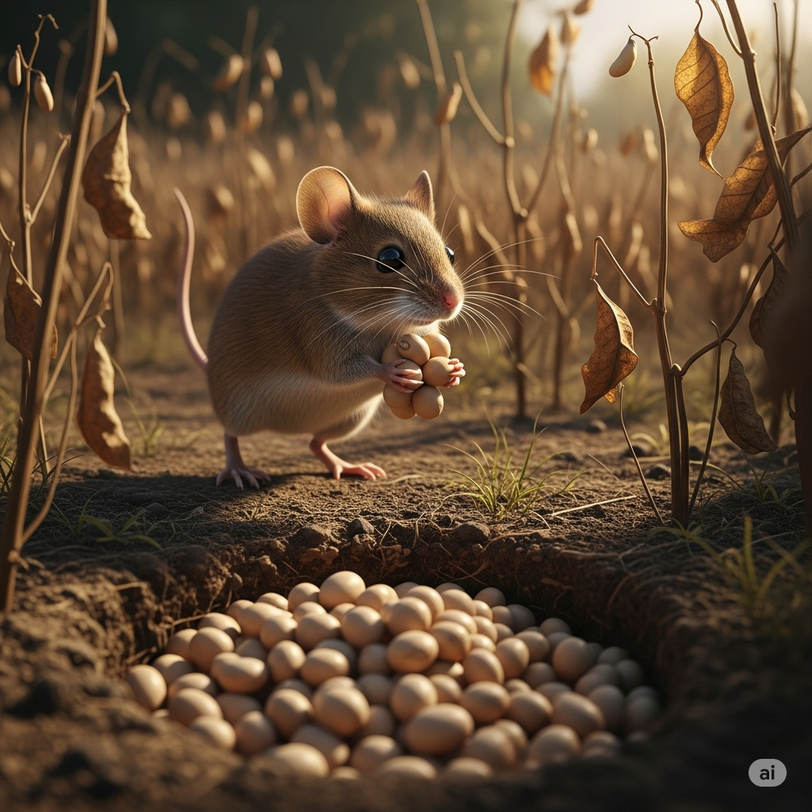

Beth had a sister named Mary. Mary lacked ambition. She had **fanciful** ideas about how she would survive winter. She thought that food would just come to her and that she could work at her own **convenience**. She **opted** to spend the days playing and dancing, instead of gathering beans. When the final hours of autumn **elapsed**, Mary had only a **paltry** amount of food stored away.

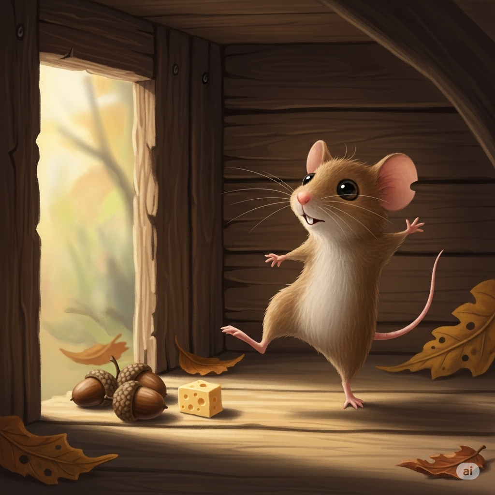

Mary realized that her food supply was too small to last through winter. She visited her sister. Mary said, “Beth, lamina **dire** situation. I didn’t gather enough food for winter. Will you let me share your beans? Please have some **empathy** for your sister!”

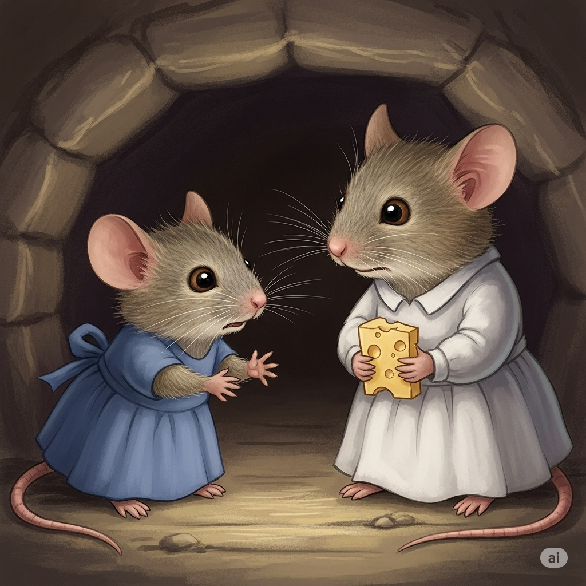

Beth thought for a moment. Then she replied, “Mary, I am truly sorry for you. But I will not give you any of my beans. Instead, I will let you have my empty bag. You can still work hard and gather enough food for the winter. It will be **tedious**, but you will learn the value of hard work.”

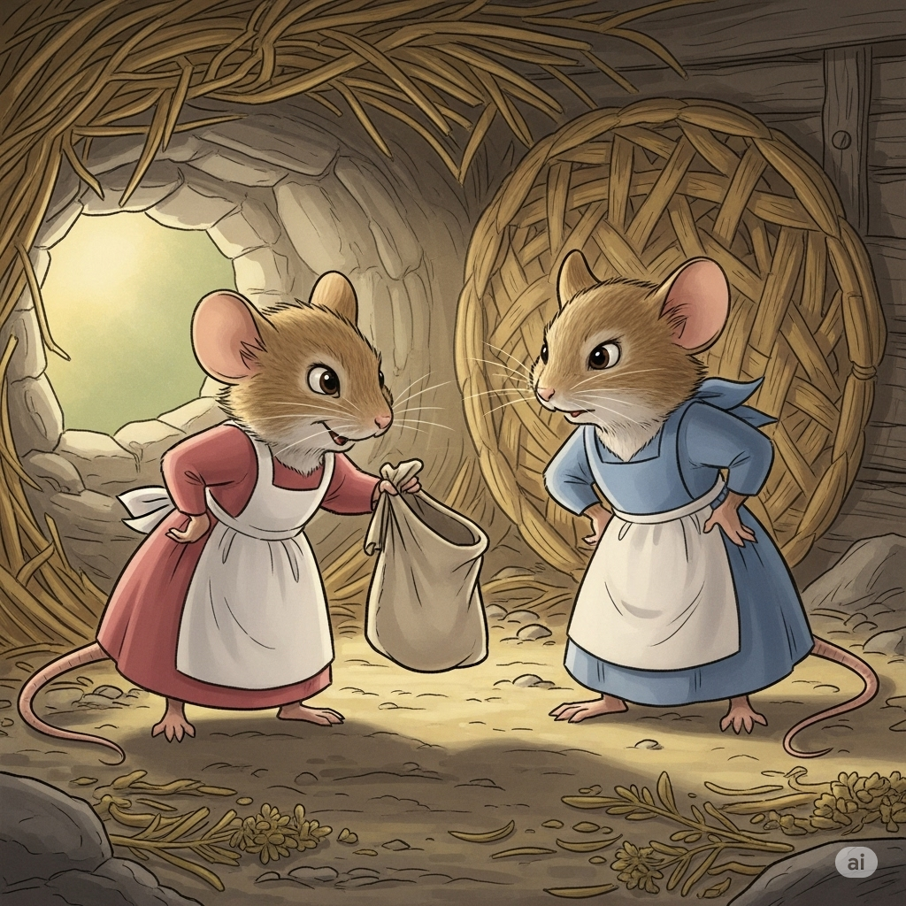

Beth’s words **appalled** Mary. Mary cried with **outrage**, “There is too much work! I won’t have any time to dance or play!”

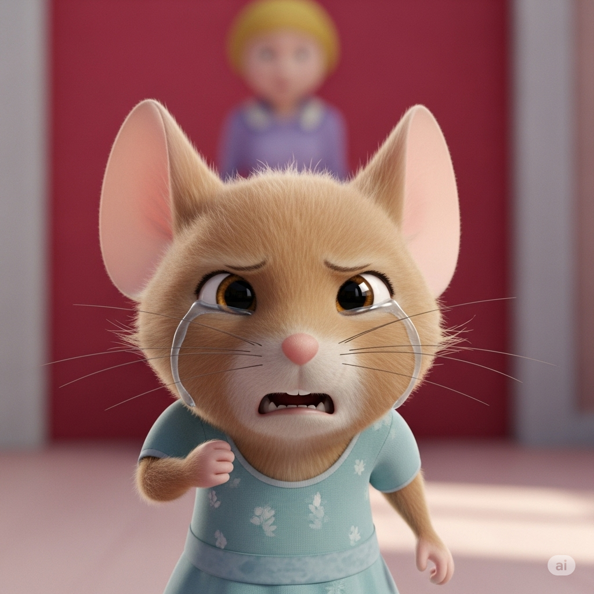

Beth said, “It is crucial that you gather enough food. You must have **sustenance** before you have fun. Go now, and **rectify** your situation.”

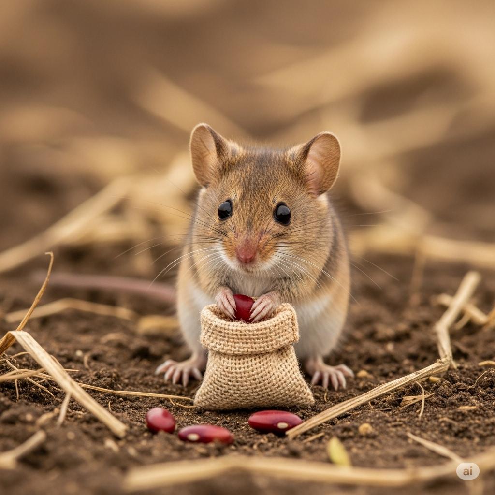

Mary **griped** some more, but she knew that her sister was right. She took the bag and went to work gathering her own beans for the winter.

---

Beth was a very **resourceful** and conservative mouse.

She knew that winter was coming and that there would soon be a **dearth** of food.

So she decided to make gathering food for winter her primary job.

Gathering food was a **grueling** and **mundane** activity, but Beth made a **deliberate** effort because she knew that it was important.

She **allotted** herself a few hours every day to collect beans.

By winter, she had collected a massive pile and hid them in a **cache**.

Beth had a sister named Mary.

Mary lacked ambition.

She had **fanciful** ideas about how she would survive winter.

 She thought that food would just come to her and that she could work at her own **convenience**.

She **opted** to spend the days playing and dancing, instead of gathering beans.

 When the final hours of autumn **elapsed**, Mary had only a **paltry** amount of food stored away.

Mary realized that her food supply was too small to last through winter.

She visited her sister.

Mary said, “Beth, lamina **dire** situation. I didn’t gather enough food for winter. Will you let me share your beans? Please have some **empathy** for your sister!”

Beth thought for a moment.

Then she replied, “Mary, I am truly sorry for you. But I will not give you any of my beans. Instead, I will let you have my empty bag. You can still work hard and gather enough food for the winter. It will be **tedious**, but you will learn the value of hard work.”

Beth’s words **appalled** Mary.

Mary cried with **outrage**, “There is too much work! I won’t have any time to dance or play!”

 Beth said, “It is crucial that you gather enough food. You must have **sustenance** before you have fun. Go now, and **rectify** your situation.”

 Mary **griped** some more, but she knew that her sister was right.

 She took the bag and went to work gathering her own beans for the winter.

---
## 1. allot (v)

- **Nghĩa trong truyện:** phân bổ, dành ra
- **Câu trong truyện:** She **allotted** herself a few hours every day to collect beans.
- **Ví dụ:**
  - I allot time for reading every day.
  - The teacher allotted seats to the students.
  - We must allot enough money for food.
  - She allots one hour for exercise.
  - The manager allotted tasks to each worker.

## 2. appall (v)

- **Nghĩa trong truyện:** làm kinh hoàng, làm choáng váng
- **Câu trong truyện:** Beth’s words **appalled** Mary.
- **Ví dụ:**
  - The news appalled everyone.
  - The crime appalled the city.
  - His behavior appalled his parents.
  - The mess appalled her.
  - The accident appalled the witnesses.

## 3. cache (n)

- **Nghĩa trong truyện:** nơi cất trữ, kho dự trữ
- **Câu trong truyện:** she had collected a massive pile and hid them in a **cache**.
- **Ví dụ:**
  - The squirrel has a cache of nuts.
  - They found a cache of gold.
  - The cache was hidden under the tree.
  - He keeps a cache of snacks in his desk.
  - The police found a cache of weapons.

## 4. convenience (n)

- **Nghĩa trong truyện:** sự tiện lợi
- **Câu trong truyện:** she could work at her own **convenience**.
- **Ví dụ:**
  - Online shopping is a convenience.
  - Please call me at your convenience.
  - The hotel offers many conveniences.
  - For your convenience, we deliver food.
  - The store is open for your convenience.

## 5. dearth (n)

- **Nghĩa trong truyện:** sự thiếu hụt, khan hiếm
- **Câu trong truyện:** there would soon be a **dearth** of food.
- **Ví dụ:**
  - There is a dearth of water in the desert.
  - The village has a dearth of doctors.
  - A dearth of rain caused the drought.
  - There is a dearth of jobs.
  - The team has a dearth of players.

## 6. deliberate (adj)

- **Nghĩa trong truyện:** có chủ ý, có tính toán
- **Câu trong truyện:** Beth made a **deliberate** effort.
- **Ví dụ:**
  - He made a deliberate choice.
  - Her actions were deliberate.
  - The move was deliberate, not an accident.
  - She spoke in a deliberate manner.
  - The plan was deliberate and careful.

## 7. dire (adj)
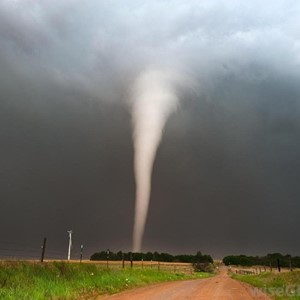
- **Nghĩa trong truyện:** nghiêm trọng, thảm khốc
- **Câu trong truyện:** Beth, lamina **dire** situation.
- **Ví dụ:**
  - The country is in dire need of help.
  - They faced dire consequences.
  - The storm caused dire damage.
  - He is in dire trouble.
  - The warning was dire.

## 8. elapse (v)

- **Nghĩa trong truyện:** trôi qua (thời gian)
- **Câu trong truyện:** When the final hours of autumn **elapsed**.
- **Ví dụ:**
  - Two hours elapsed quickly.
  - A week elapsed before he returned.
  - Time elapsed slowly.
  - Months elapsed with no news.
  - Only a minute had elapsed.

## 9. empathy (n)

- **Nghĩa trong truyện:** sự đồng cảm
- **Câu trong truyện:** Please have some **empathy** for your sister!
- **Ví dụ:**
  - She has empathy for others.
  - Empathy helps us understand people.
  - He showed empathy to his friend.
  - Teachers need empathy.
  - Empathy is important in life.

## 10. fanciful (adj)

- **Nghĩa trong truyện:** viển vông, không thực tế
- **Câu trong truyện:** She had **fanciful** ideas.
- **Ví dụ:**
  - He told a fanciful story.
  - The plan is fanciful and unrealistic.
  - She has fanciful dreams.
  - The drawing is fanciful.
  - His ideas are fanciful.

## 11. gripe (v)

- **Nghĩa trong truyện:** càu nhàu, phàn nàn
- **Câu trong truyện:** Mary **griped** some more.
- **Ví dụ:**
  - He likes to gripe about work.
  - She gripes every morning.
  - Stop griping and help me.
  - They gripe about the weather.
  - I don’t want to gripe.

## 12. grueling (adj)

- **Nghĩa trong truyện:** mệt mỏi, gian khổ
- **Câu trong truyện:** Gathering food was a **grueling** and mundane activity.
- **Ví dụ:**
  - The race was grueling.
  - He had a grueling day at work.
  - The hike was grueling.
  - Training is grueling.
  - The exam was grueling.

## 13. mundane (adj)
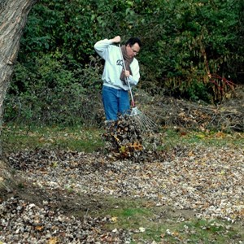
- **Nghĩa trong truyện:** nhàm chán, tẻ nhạt
- **Câu trong truyện:** a grueling and **mundane** activity
- **Ví dụ:**
  - The job is mundane.
  - He does mundane tasks.
  - Life can be mundane.
  - The work is mundane but necessary.
  - She wants to escape her mundane routine.

## 14. opt (v)
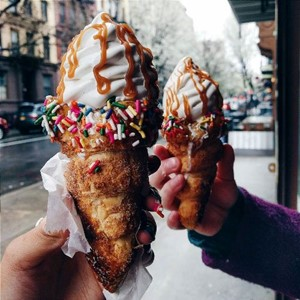
- **Nghĩa trong truyện:** chọn, quyết định
- **Câu trong truyện:** She **opted** to spend the days playing.
- **Ví dụ:**
  - I opt for tea instead of coffee.
  - She opted to stay home.
  - They opt to travel by train.
  - He opted out of the game.
  - We can opt for a new plan.

## 15. outrage (n)

- **Nghĩa trong truyện:** sự phẫn nộ
- **Câu trong truyện:** Mary cried with **outrage**.
- **Ví dụ:**
  - The news caused outrage.
  - People expressed outrage online.
  - There was outrage over the decision.
  - The crime sparked outrage.
  - His words caused outrage.

## 16. paltry (adj)

- **Nghĩa trong truyện:** ít ỏi, không đáng kể
- **Câu trong truyện:** Mary had only a **paltry** amount of food.
- **Ví dụ:**
  - He earns a paltry salary.
  - The prize was paltry.
  - She gave a paltry excuse.
  - The meal was paltry.
  - The donation was paltry.

## 17. rectify (v)
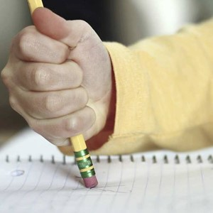
- **Nghĩa trong truyện:** sửa chữa, khắc phục
- **Câu trong truyện:** Go now, and **rectify** your situation.
- **Ví dụ:**
  - Please rectify your mistake.
  - We must rectify the problem.
  - He tried to rectify the error.
  - The company will rectify the issue.
  - She wants to rectify her behavior.

## 18. resourceful (adj)
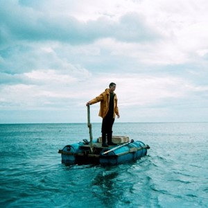
- **Nghĩa trong truyện:** tháo vát, có tài xoay xở
- **Câu trong truyện:** Beth was a very **resourceful** mouse.
- **Ví dụ:**
  - She is a resourceful student.
  - He is resourceful in difficult times.
  - The team is resourceful.
  - You must be resourceful to survive.
  - He solved the problem in a resourceful way.

## 19. sustenance (n)

- **Nghĩa trong truyện:** chất dinh dưỡng, thức ăn nuôi sống
- **Câu trong truyện:** You must have **sustenance** before you have fun.
- **Ví dụ:**
  - Bread is a basic sustenance.
  - They need sustenance to live.
  - The plants provide sustenance.
  - Water is important for sustenance.
  - The food gave him sustenance.

## 20. tedious (adj)

- **Nghĩa trong truyện:** tẻ nhạt, chán ngắt
- **Câu trong truyện:** it will be **tedious**, but you will learn the value of hard work.
- **Ví dụ:**
  - The job is tedious.
  - Writing the report was tedious.
  - The task is tedious but necessary.
  - The lecture was tedious.
  - Cleaning is tedious work.