# Beethoven’s Gift

Beethoven was a great composer of classical music in the 1800s. Many **biographies** have been written that **narrate** his **dominance** in the music world. But do you know what really makes him special? Even though millions of people got to hear his **multiple** **masterpieces**, he never did. Beethoven wrote his best pieces after he went completely deaf!

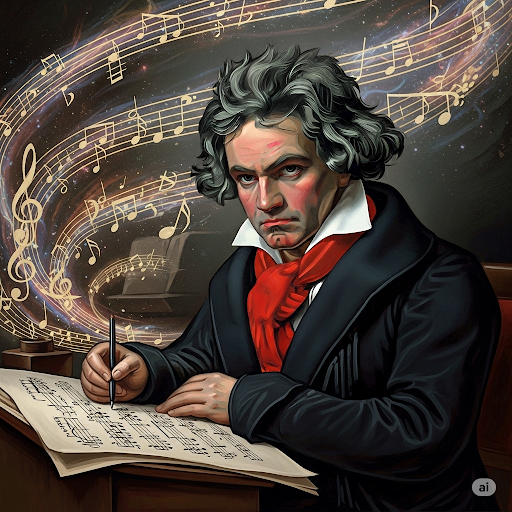

His **partiality** toward classical music developed when he was very young. He wasn’t interested in anything else as a child. When he was five, he learned how to play the piano. From then, nothing could stop his passion for writing and playing music.

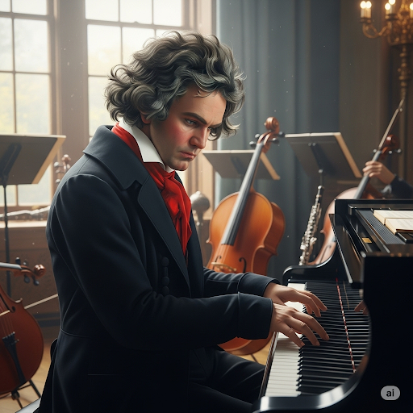

When Beethoven was twenty, he began to lose his hearing. He got **acute**, **spontaneous** pains in his ears. His hearing kept getting worse over time. It was **inevitable** that he would eventually lose it altogether. It was very hard for him to keep writing music. He lost the **virtue** of patience, and he became **notorious** for his **aggression**. Still, he never stopped trying. His passion for music **compelled** him to keep performing even after he went deaf. He couldn’t hear himself play, but he knew that his creations sounded **gorgeous**.

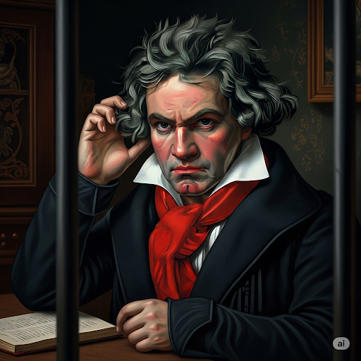

His final concert was held at a huge **banquet**. He gave the musicians a cue, and they began to play. He directed the concert with all his heart. He couldn’t hear the music, but he said that he could feel it. **Overall**, performance was one of the finest in history. When it was over, he turned to the crowd. They **clapped** and cheered wildly. In that beautiful moment, the applause **boosted** his emotions, and he began to cry.

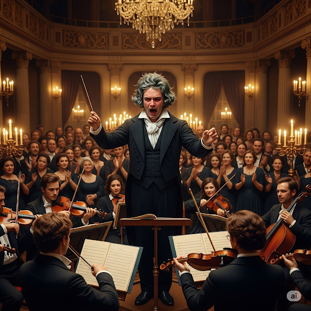

In 1827, he suffered from lead poisoning. He didn’t survive the sickness, but his music did because great music never becomes **outdated**. Even though Beethoven is gone, his **legacy** will live on forever.

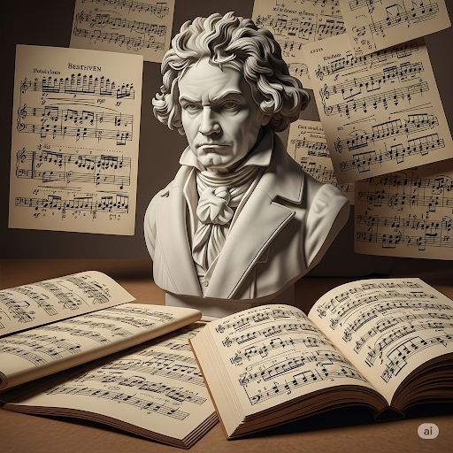

## List of word
acute aggression banquet biography boost clap compel dominance gorgeous inevitable legacy masterpiece multiple narrate notorious outdated overall partiality spontaneous virtue

## Sentences of story

Beethoven was a great composer of classical music in the 1800s.

Many **biographies** have been written that **narrate** his **dominance** in the music world.

But do you know what really makes him special?

Even though millions of people got to hear his **multiple** **masterpieces**, he never did.

Beethoven wrote his best pieces after he went completely deaf!

His **partiality** toward classical music developed when he was very young.

He wasn’t interested in anything else as a child.

When he was five, he learned how to play the piano.

From then, nothing could stop his passion for writing and playing music.

When Beethoven was twenty, he began to lose his hearing.

He got **acute**, **spontaneous** pains in his ears.

His hearing kept getting worse over time.

It was **inevitable** that he would eventually lose it altogether.

It was very hard for him to keep writing music.

He lost the **virtue** of patience, and he became **notorious** for his **aggression**.

Still, he never stopped trying.

His passion for music **compelled** him to keep performing even after he went deaf.

He couldn’t hear himself play, but he knew that his creations sounded **gorgeous**.

His final concert was held at a huge **banquet**.

He gave the musicians a cue, and they began to play.

He directed the concert with all his heart.

He couldn’t hear the music, but he said that he could feel it.

**Overall**, performance was one of the finest in history.

When it was over, he turned to the crowd.

They **clapped** and cheered wildly.

In that beautiful moment, the applause **boosted** his emotions, and he began to cry.

In 1827, he suffered from lead poisoning.

He didn’t survive the sickness, but his music did because great music never becomes **outdated**.

Even though Beethoven is gone, his **legacy** will live on forever.

## 1. acute
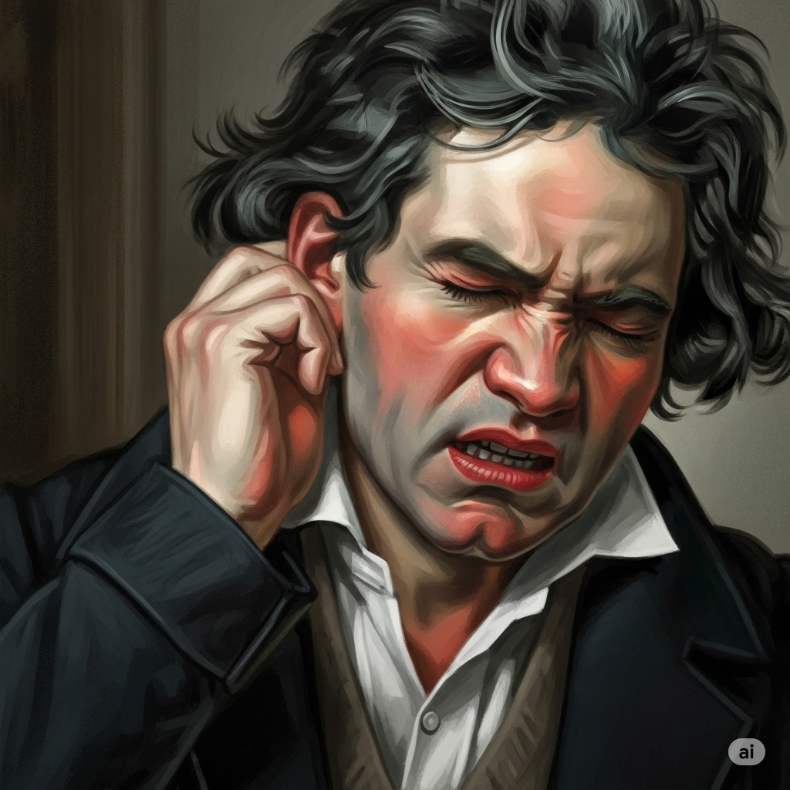
- ipa: /əˈkjuːt/
- class: adj
- định nghĩa: cấp tính, buốt, nhói.
- english definition: if a bad situation is acute, it causes severe problems or damage.
- sentence of story: He got **acute**, spontaneous pains in his ears.
- ví dụ thông dụng:
  - He has an **acute** sense of hearing.
  - There is an **acute** shortage of water.
  - I have an **acute** pain in my back.
  - The problem is not as **acute** as we thought.
  - She is a very **acute** observer.

## 2. aggression
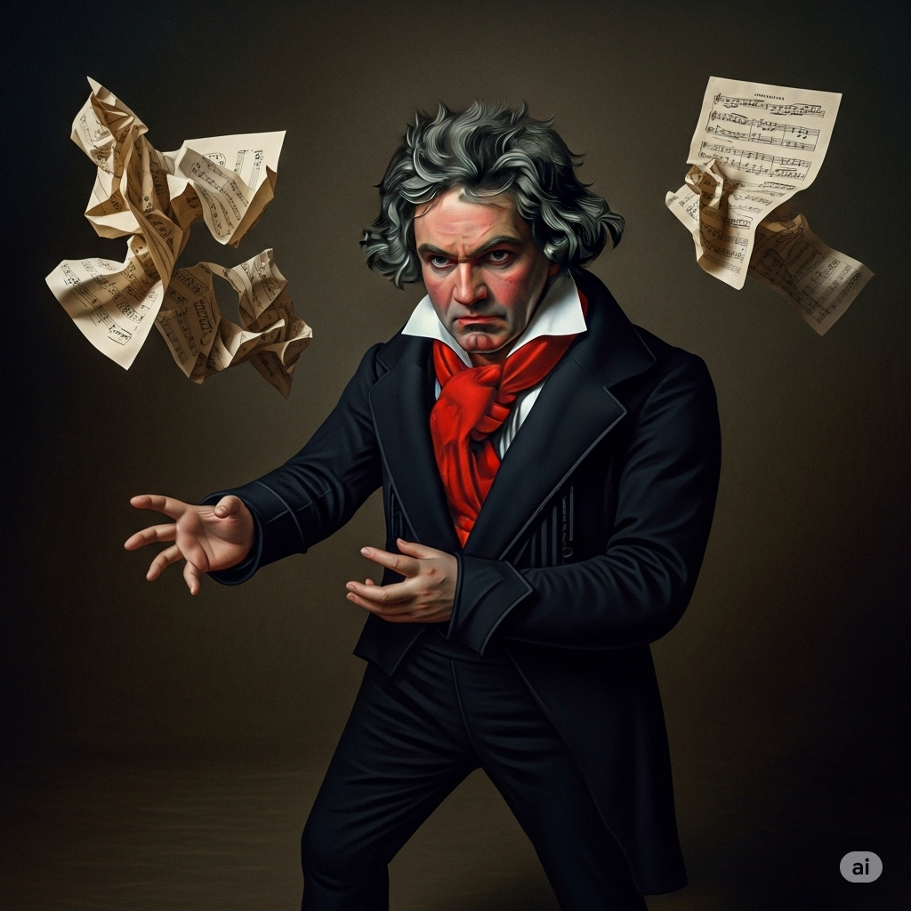
- ipa: /əˈɡreʃ.ən/
- class: n
- định nghĩa: sự hung hăng, sự gây hấn.
- english definition: spoken or physical behaviour that is threatening or involves harm to someone or something.
- sentence of story: He lost the virtue of patience, and he became notorious for his **aggression**.
- ví dụ thông dụng:
  - The dog showed signs of **aggression**.
  - He has problems with **aggression**.
  - We need to find ways to reduce **aggression** in schools.
  - The film was full of violence and **aggression**.
  - His **aggression** makes people afraid of him.

## 3. banquet
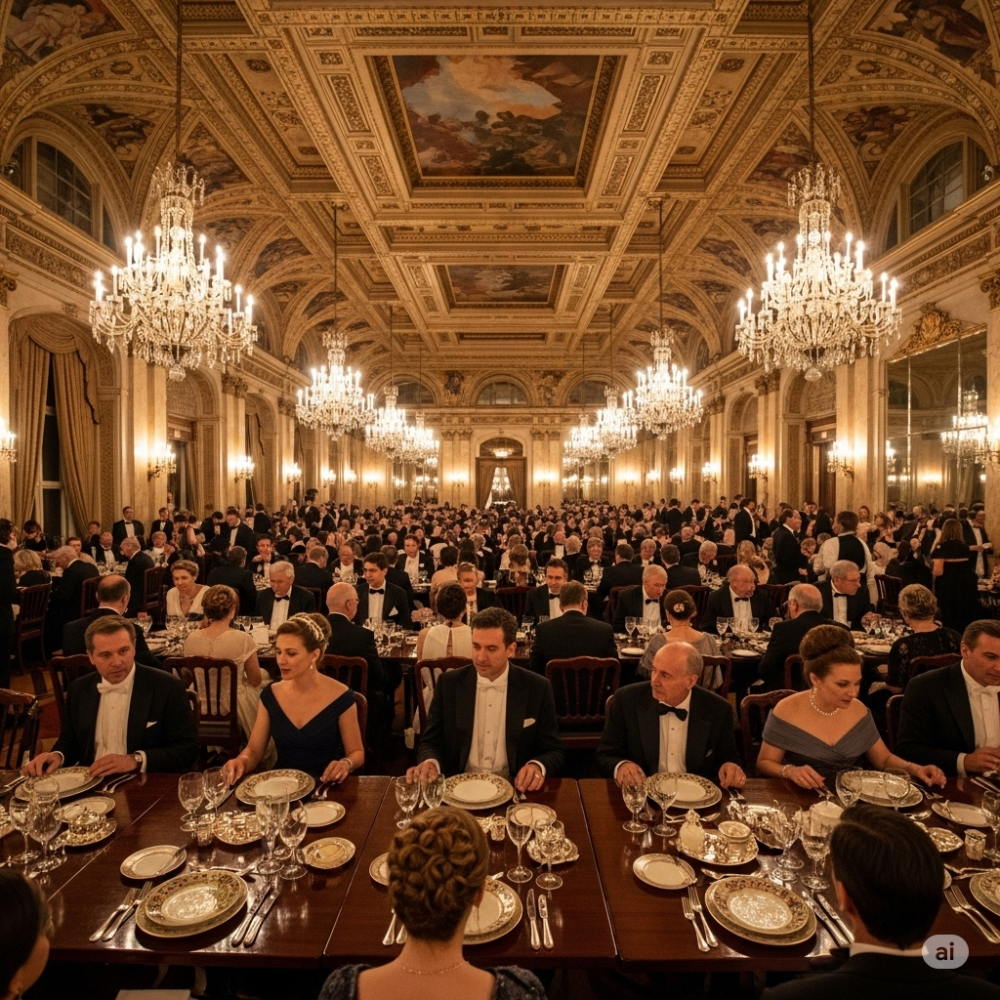
- ipa: /ˈbæŋ.kwɪt/
- class: n
- định nghĩa: tiệc lớn, yến tiệc.
- english definition: a large formal meal for many people.
- sentence of story: His final concert was held at a huge **banquet**.
- ví dụ thông dụng:
  - They held a **banquet** to celebrate the victory.
  - We attended a wedding **banquet** last night.
  - A state **banquet** was held for the visiting president.
  - The **banquet** hall was beautifully decorated.
  - What did they serve at the **banquet**?

## 4. biography
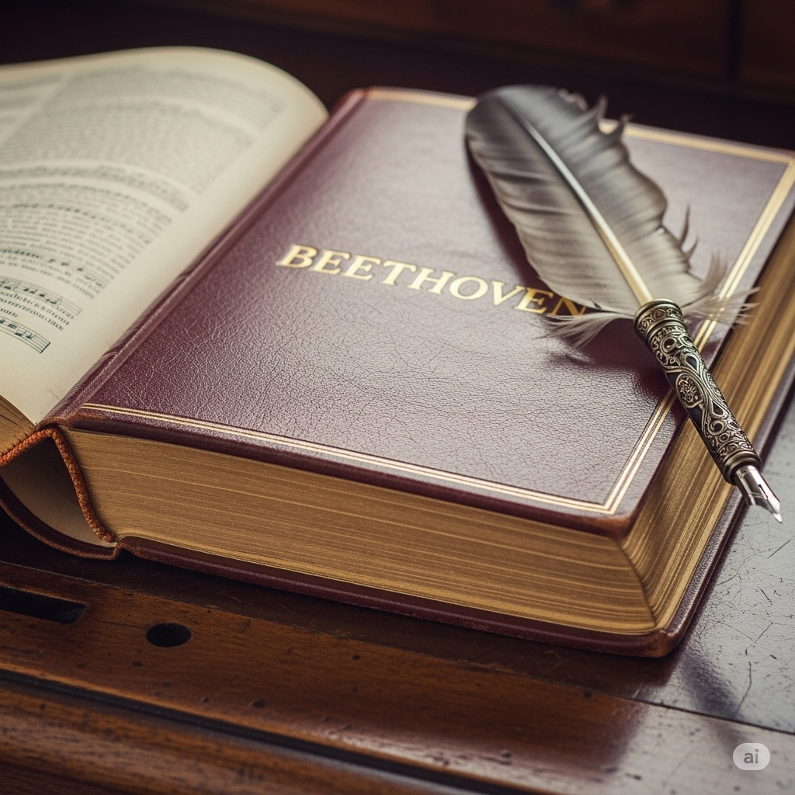
- ipa: /baɪˈɒɡ.rə.fi/
- class: n
- định nghĩa: tiểu sử, lý lịch.
- english definition: the life story of a person written by someone else.
- sentence of story: Many **biographies** have been written that narrate his dominance in the music world.
- ví dụ thông dụng:
  - I am reading a **biography** of Albert Einstein.
  - She wrote a **biography** of her father.
  - This **biography** is very interesting.
  - The library has a large section for **biographies**.
  - He is a famous **biography** writer.

## 5. boost
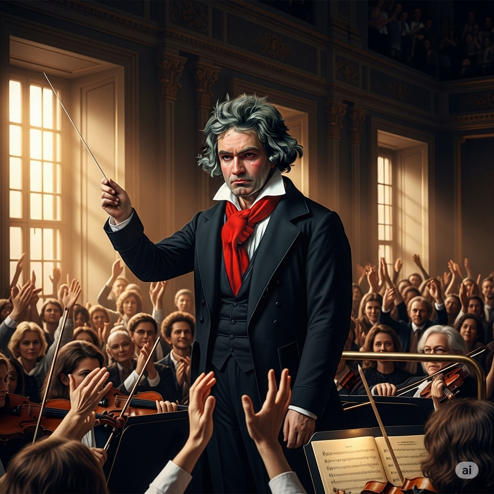
- ipa: /buːst/
- class: v
- định nghĩa: thúc đẩy, nâng cao, làm tăng lên.
- english definition: to improve or increase something.
- sentence of story: In that beautiful moment, the applause **boosted** his emotions, and he began to cry.
- ví dụ thông dụng:
  - The good news will **boost** everyone's confidence.
  - We need to **boost** our sales.
  - A good breakfast can **boost** your energy for the day.
  - The government wants to **boost** the economy.
  - This vitamin C drink will **boost** your immune system.

## 6. clap

- ipa: /klæp/
- class: v
- định nghĩa: vỗ tay.
- english definition: to make a short loud noise by hitting your hands together.
- sentence of story: They **clapped** and cheered wildly.
- ví dụ thông dụng:
  - Everyone **clapped** at the end of the show.
  - Please **clap** your hands to the music.
  - The audience began to **clap**.
  - Don't forget to **clap** for the winner.
  - The baby learned how to **clap** her hands.

## 7. compel
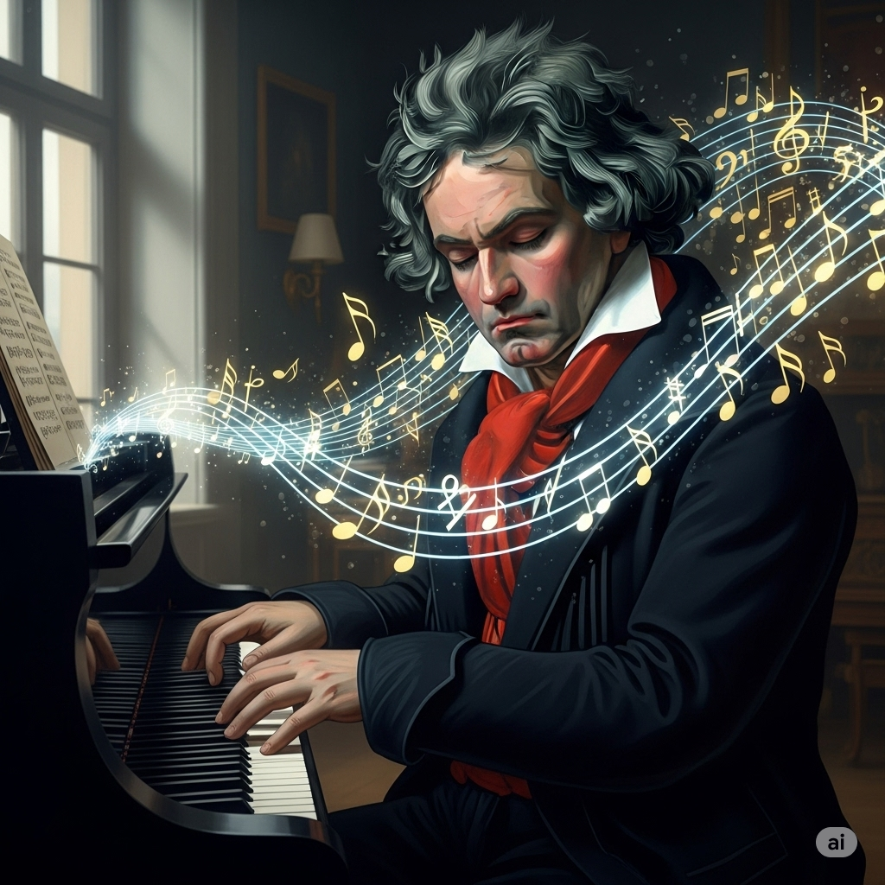
- ipa: /kəmˈpel/
- class: v
- định nghĩa: buộc phải, ép buộc.
- english definition: to force someone to do something.
- sentence of story: His passion for music **compelled** him to keep performing even after he went deaf.
- ví dụ thông dụng:
  - The law will **compel** employers to provide health insurance.
  - I feel **compelled** to tell you the truth.
  - His sense of duty **compelled** him to act.
  - Nothing can **compel** me to do that.
  - The rain **compelled** us to stay indoors.

## 8. dominance
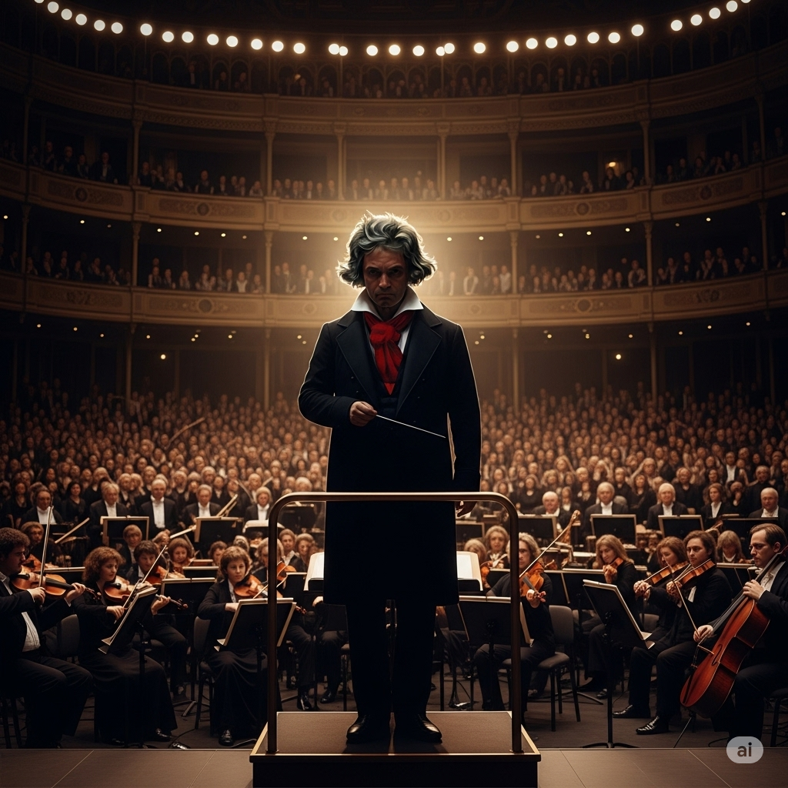
- ipa: /ˈdɒm.ɪ.nəns/
- class: n
- định nghĩa: sự thống trị, sự áp đảo, ưu thế.
- english definition: the quality of being more important, strong, or successful than anything else of the same type.
- sentence of story: Many biographies have been written that narrate his **dominance** in the music world.
- ví dụ thông dụng:
  - The company has achieved **dominance** in the market.
  - Their team showed complete **dominance** in the game.
  - He wants to establish his **dominance** over the group.
  - The lion's roar is a sign of its **dominance**.
  - English has a position of **dominance** as a world language.

## 9. gorgeous

- ipa: /ˈɡɔː.dʒəs/
- class: adj
- định nghĩa: lộng lẫy, rực rỡ, tuyệt đẹp.
- english definition: very beautiful or pleasant.
- sentence of story: He couldn’t hear himself play, but he knew that his creations sounded **gorgeous**.
- ví dụ thông dụng:
  - You look **gorgeous** in that dress.
  - What a **gorgeous** day!
  - The view from the hotel room was **gorgeous**.
  - She has a **gorgeous** smile.
  - The flowers in the garden are **gorgeous**.

## 10. inevitable
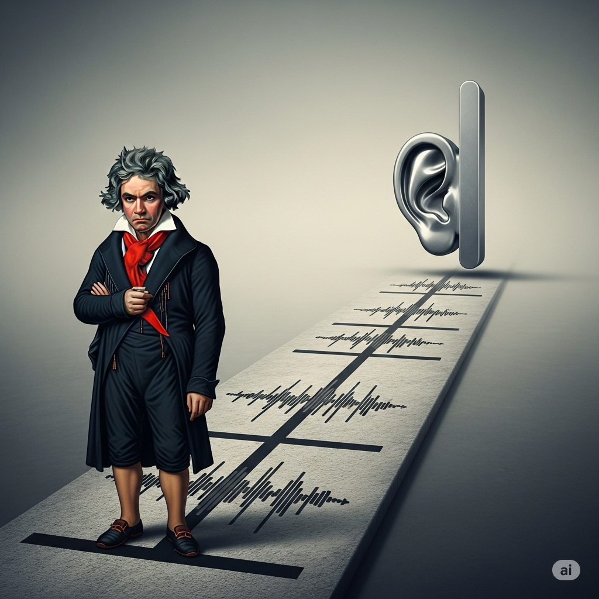
- ipa: /ɪˈnev.ɪ.tə.bəl/
- class: adj
- định nghĩa: không thể tránh khỏi, tất yếu.
- english definition: certain to happen and unable to be avoided or prevented.
- sentence of story: It was **inevitable** that he would eventually lose it altogether.
- ví dụ thông dụng:
  - It was **inevitable** that they would get married.
  - Change is an **inevitable** part of life.
  - Accidents are the **inevitable** result of carelessness.
  - His failure was **inevitable**.
  - After a long discussion, the decision was **inevitable**.

## 11. legacy
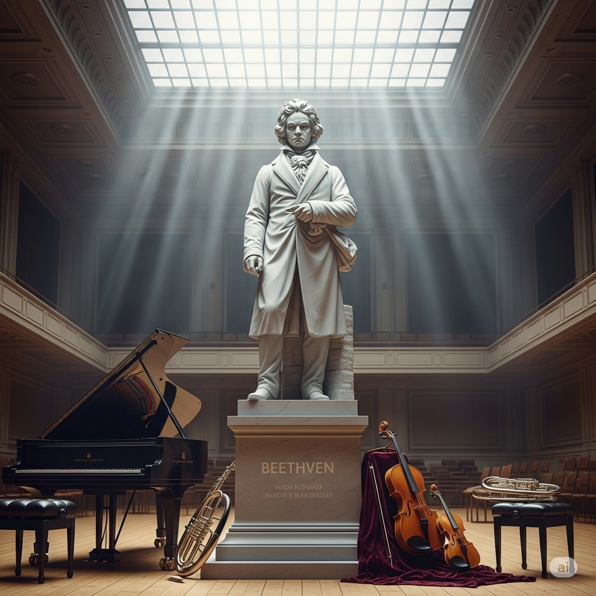
- ipa: /ˈleɡ.ə.si/
- class: n
- định nghĩa: di sản, tài sản kế thừa.
- english definition: money or property that you receive from someone after they die.
- sentence of story: Even though Beethoven is gone, his **legacy** will live on forever.
- ví dụ thông dụng:
  - He left a **legacy** of peace and kindness.
  - The artist's **legacy** includes hundreds of paintings.
  - She received a small **legacy** from her grandmother.
  - What will be your **legacy**?
  - The company has a **legacy** of innovation.

## 12. masterpiece
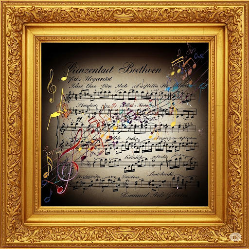
- ipa: /ˈmɑː.stə.piːs/
- class: n
- định nghĩa: kiệt tác, tác phẩm lớn.
- english definition: a work of art such as a painting, film, or book that is made with great skill.
- sentence of story: Even though millions of people got to hear his multiple **masterpieces**, he never did.
- ví dụ thông dụng:
  - The Mona Lisa is a famous **masterpiece**.
  - The chef's final dish was a **masterpiece**.
  - His new book is considered a **masterpiece**.
  - The museum is full of priceless **masterpieces**.
  - This film is a cinematic **masterpiece**.

## 13. multiple
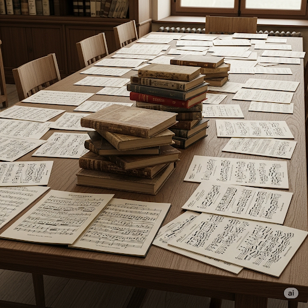
- ipa: /ˈmʌl.tɪ.pəl/
- class: adj
- định nghĩa: nhiều, nhiều phần.
- english definition: very many of the same type, or of different types.
- sentence of story: Even though millions of people got to hear his **multiple** **masterpieces**, he never did.
- ví dụ thông dụng:
  - He has **multiple** health problems.
  - The accident caused **multiple** injuries.
  - There are **multiple** ways to solve this problem.
  - She can speak **multiple** languages.
  - The test has **multiple** choice questions.

## 14. narrate
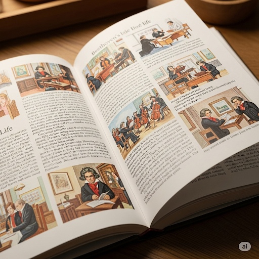
- ipa: /nəˈreɪt/
- class: v
- định nghĩa: tường thuật, kể lại.
- english definition: to tell a story, often by reading it aloud from a text, or to describe events as they happen.
- sentence of story: Many biographies have been written that **narrate** his dominance in the music world.
- ví dụ thông dụng:
  - The author will **narrate** his own audiobook.
  - She **narrated** the events of that day.
  - The documentary is **narrated** by a famous actor.
  - Can you **narrate** the story for us?
  - He began to **narrate** his adventures.

## 15. notorious
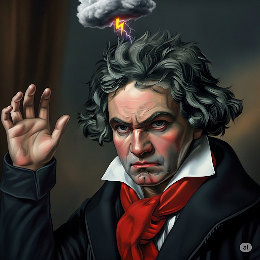
- ipa: /nəʊˈtɔː.ri.əs/
- class: adj
- định nghĩa: khét tiếng, tai tiếng (vì điều gì đó xấu).
- english definition: famous for something bad.
- sentence of story: He lost the virtue of patience, and he became **notorious** for his aggression.
- ví dụ thông dụng:
  - He is a **notorious** criminal.
  - The city is **notorious** for its bad traffic.
  - She is **notorious** for being late.
  - The hotel was **notorious** for its poor service.
  - That politician is **notorious** for his lies.

## 16. outdated
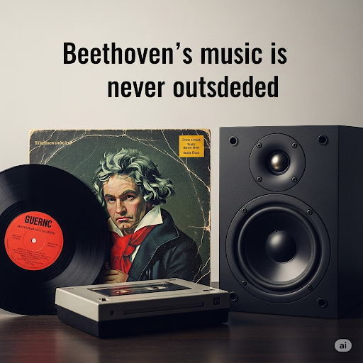
- ipa: /ˌaʊtˈdeɪ.tɪd/
- class: adj
- định nghĩa: lỗi thời, lạc hậu.
- english definition: old-fashioned and therefore not as good or as useful as something more modern.
- sentence of story: He didn’t survive the sickness, but his music did because great music never becomes **outdated**.
- ví dụ thông dụng:
  - This information is **outdated**.
  - My computer is old and **outdated**.
  - His ideas about fashion are very **outdated**.
  - The company needs to update its **outdated** technology.
  - The law is now considered **outdated**.

## 17. overall
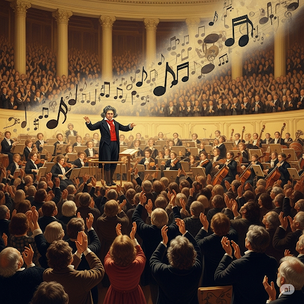
- ipa: /ˌəʊ.vəˈrɔːl/
- class: adv
- định nghĩa: nhìn chung, toàn bộ, toàn diện.
- english definition: in general rather than in particular, or including all the people or things in a particular group or situation.
- sentence of story: **Overall**, performance was one of the finest in history.
- ví dụ thông dụng:
  - **Overall**, the project was a success.
  - The **overall** cost will be around $500.
  - My **overall** impression of the city is good.
  - **Overall**, I think it was a great movie.
  - What is your **overall** opinion?

## 18. partiality

- ipa: /ˌpɑː.ʃiˈæl.ə.ti/
- class: n
- định nghĩa: sự thiên vị, sự yêu thích đặc biệt.
- english definition: the fact of unfairly preferring or supporting one person, group, or thing more than another.
- sentence of story: His **partiality** toward classical music developed when he was very young.
- ví dụ thông dụng:
  - She has a **partiality** for chocolate.
  - The teacher was accused of **partiality** towards some students.
  - I have a **partiality** for old movies.
  - His **partiality** for his hometown is well known.
  - He shows no **partiality** in his decisions.

## 19. spontaneous
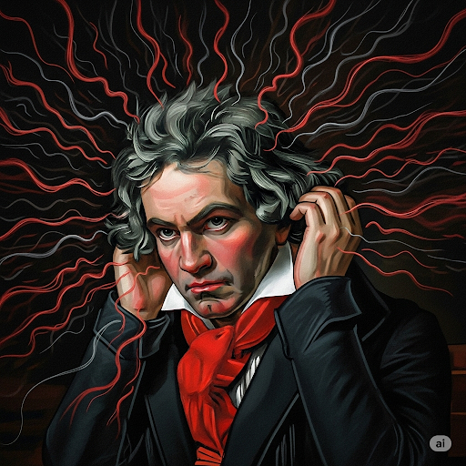
- ipa: /spɒnˈteɪ.ni.əs/
- class: adj
- định nghĩa: tự phát, tự nhiên, không sắp đặt trước.
- english definition: happening or done in a natural, often sudden way, without any planning or encouragement.
- sentence of story: He got acute, **spontaneous** pains in his ears.
- ví dụ thông dụng:
  - We made a **spontaneous** decision to go to the beach.
  - Her laughter was **spontaneous** and genuine.
  - The party was a **spontaneous** event.
  - He is a very **spontaneous** person.
  - The audience broke into **spontaneous** applause.

## 20. virtue
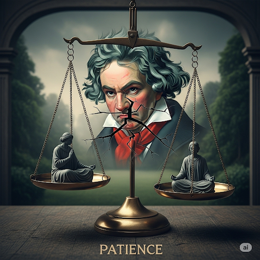
- ipa: /ˈvɜː.tʃuː/
- class: n
- định nghĩa: đức tính tốt, đức hạnh.
- english definition: a good moral quality in a person, or the general quality of being morally good.
- sentence of story: He lost the **virtue** of patience, and he became notorious for his aggression.
- ví dụ thông dụng:
  - Patience is a **virtue**.
  - Honesty is a great **virtue**.
  - She is a woman of great **virtue**.
  - Kindness is a **virtue** we should all have.
  - He has many **virtues**, but he can also be lazy.