# The Old Hound

Elvis was a dog that loved to run. He possessed all the **criteria** to be a great racing dog. He had long legs, lean muscles, and a strong heart. He was so good that he never lost a race in the northern **hemisphere**. **Spectators** who bet on dog races always picked Elvis to win.

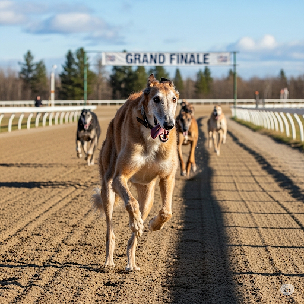

After ten years of racing, however, Elvis was getting old. His **faculties** were not as strong as they used to be. His owner got upset when Elvis started losing. Elvis’s owner wasn’t a **considerate** person. He **degraded** the dog all the time. Finally, his owner decided to get rid of him. He threw Elvis in his car and took him to the middle of the forest. He tossed him out and drove away. Elvis was cold and scared. He decided to follow a **brook** into the city.

Elvis soon found out that the city was a big and **impersonal** place. Everywhere he went, he saw signs that said, “No Dogs Allowed.” **Pedestrians** yelled at him. He was sad, hungry, and alone. He thought that all people were as cruel and uncaring as his owner had been. He was ready to give up when he heard a soft voice say, “What a beautiful **hound**!” Elvis looked up and saw an old woman. She said, “You’re **entitled** to a better life than this. I can take you to a **sanctuary** for old dogs like you. I’ll **cater** to all your needs. Would you like to come with me?”

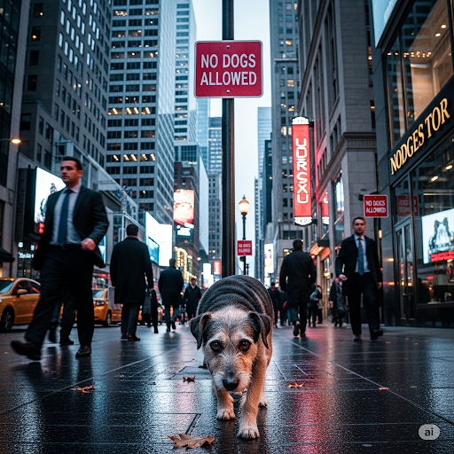

The woman **escorted** Elvis to a beautiful **facility**. There was a sign on the **external** door that said, “Dogs Welcome!” The interior of the building was painted blue, and shiny **ornaments** hung from the ceiling. There was a **heap** of tasty bones and bread **crusts** for **consumption**.

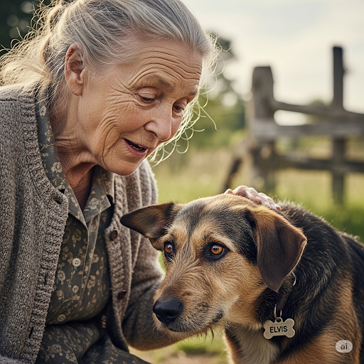

Elvis learned there were kind people in the world after all. He was so thankful that he jumped up and licked the woman's face.

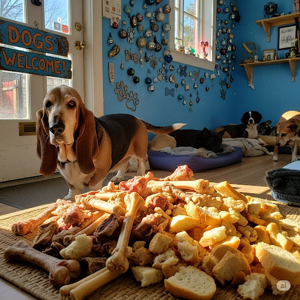

## List of word

brook cater considerate consumption criteria crust degrade entitle escort external facility faculty heap hemisphere hound impersonal ornament pedestrian sanctuary spectator

## Sentences of story
He possessed all the **criteria** to be a great racing dog.

He was so good that he never lost a race in the northern **hemisphere**.

**Spectators** who bet on dog races always picked Elvis to win.

His **faculties** were not as strong as they used to be.

Elvis’s owner wasn’t a **considerate** person.

He **degraded** the dog all the time.

He decided to follow a **brook** into the city.

Elvis soon found out that the city was a big and **impersonal** place.

**Pedestrians** yelled at him.

He was ready to give up when he heard a soft voice say, “What a beautiful **hound**!”

She said, “You’re **entitled** to a better life than this."

I can take you to a **sanctuary** for old dogs like you.

I’ll **cater** to all your needs.

The woman **escorted** Elvis to a beautiful **facility**.

There was a sign on the **external** door that said, “Dogs Welcome!”

The interior of the building was painted blue, and shiny **ornaments** hung from the ceiling.

There was a **heap** of tasty bones and bread **crusts** for **consumption**.

## 1. brook

- IPA: /brʊk/
- class: noun
- định nghĩa: một con suối nhỏ.
- English definition: a small stream.
- sentence of story: He decided to follow a **brook** into the city.
- ví dụ thông dụng:
    1. We sat by the little **brook**.
    2. The children love to play in the **brook**.

## 2. cater

- IPA: /ˈkeɪtər/
- class: verb
- định nghĩa: cung cấp, phục vụ tất cả nhu cầu.
- English definition: to provide what is wanted or needed by someone or something.
- sentence of story: I’ll **cater** to all your needs.
- ví dụ thông dụng:
    1. This shop will **cater** to your interests.
    2. They **cater** food for parties.

## 3. considerate
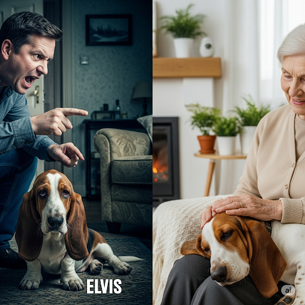
- IPA: /kənˈsɪdərət/
- class: adjective
- định nghĩa: ân cần, chu đáo, tử tế.
- English definition: careful not to cause inconvenience or hurt to others.
- sentence of story: Elvis’s owner wasn’t a **considerate** person.
- ví dụ thông dụng:
    1. It was very **considerate** of you to help.
    2. He is always a kind and **considerate** person.

## 4. consumption

- IPA: /kənˈsʌmpʃn/
- class: noun
- định nghĩa: việc ăn hoặc uống thứ gì đó.
- English definition: the action of using up a resource, or the amount of something that someone uses, eats, or drinks.
- sentence of story: There was a heap of tasty bones and bread crusts for **consumption**.
- ví dụ thông dụng:
    1. This food is for our **consumption**.
    2. We need to reduce our energy **consumption**.

## 5. criteria
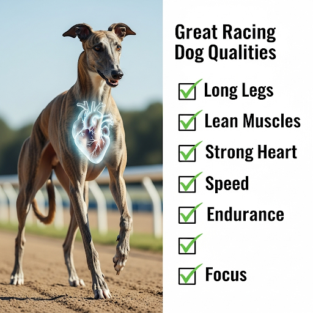
- IPA: /kraɪˈtɪəriə/
- class: noun
- định nghĩa: tiêu chuẩn.
- English definition: a principle or standard by which something may be judged or decided.
- sentence of story: He possessed all the **criteria** to be a great racing dog.
- ví dụ thông dụng:
    1. What are the **criteria** for the job?
    2. He meets all the **criteria** to enter the school.

## 6. crust

- IPA: /krʌst/
- class: noun
- định nghĩa: vỏ bánh mì.
- English definition: the tough outer part of a loaf of bread.
- sentence of story: There was a heap of tasty bones and bread **crusts** for consumption.
- ví dụ thông dụng:
    1. I like the **crust** of the bread.
    2. My brother doesn't eat the pizza **crust**.

## 7. degrade

- IPA: /dɪˈɡreɪd/
- class: verb
- định nghĩa: làm mất phẩm giá, hạ thấp.
- English definition: to treat or regard (someone) with contempt or disrespect.
- sentence of story: He **degraded** the dog all the time.
- ví dụ thông dụng:
    1. You should not **degrade** other people.
    2. He felt **degraded** by the unfair treatment.

## 8. entitle
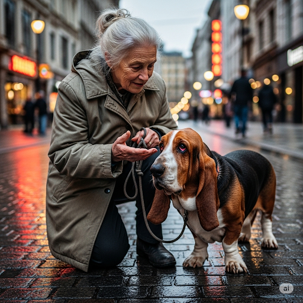
- IPA: /ɪnˈtaɪtl/
- class: verb
- định nghĩa: cho quyền.
- English definition: to give (someone) a legal right or a just claim to receive or do something.
- sentence of story: You’re **entitled** to a better life than this.
- ví dụ thông dụng:
    1. This ticket will **entitle** you to a free drink.
    2. Everyone is **entitled** to their own opinion.

## 9. escort

- IPA: /ˈeskɔːrt/
- class: verb
- định nghĩa: hộ tống, đi cùng.
- English definition: to accompany (someone or something) somewhere, especially for protection or security, or as a mark of rank.
- sentence of story: The woman **escorted** Elvis to a beautiful facility.
- ví dụ thông dụng:
    1. The police will **escort** the president.
    2. He offered to **escort** me home.

## 10. external
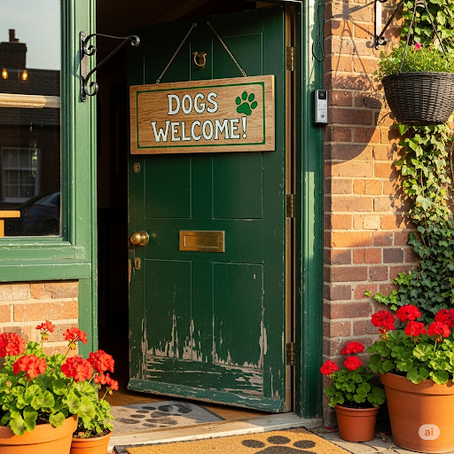
- IPA: /ɪkˈstɜːrnl/
- class: adjective
- định nghĩa: bên ngoài.
- English definition: of or relating to the outside of something.
- sentence of story: There was a sign on the **external** door that said, “Dogs Welcome!”
- ví dụ thông dụng:
    1. We painted the **external** walls of the house.
    2. The medicine is for **external** use only.

## 11. facility

- IPA: /fəˈsɪləti/
- class: noun
- định nghĩa: cơ sở vật chất, một nơi được xây dựng cho một mục đích cụ thể.
- English definition: a place, amenity, or piece of equipment provided for a particular purpose.
- sentence of story: The woman escorted Elvis to a beautiful **facility**.
- ví dụ thông dụng:
    1. Our school has a new sports **facility**.
    2. This is a medical **facility**.

## 12. faculty

- IPA: /ˈfæklti/
- class: noun
- định nghĩa: khả năng, năng lực tự nhiên của cơ thể hoặc trí óc.
- English definition: an inherent mental or physical power.
- sentence of story: His **faculties** were not as strong as they used to be.
- ví dụ thông dụng:
    1. She still has all her mental **faculties**.
    2. As he grew older, his **faculties** began to fail.

## 13. heap
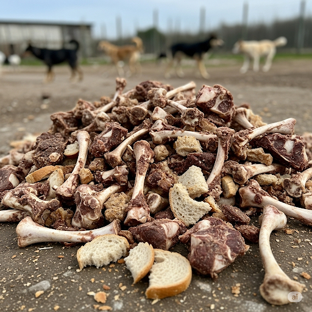
- IPA: /hiːp/
- class: noun
- định nghĩa: một đống.
- English definition: an untidy collection of things piled up haphazardly.
- sentence of story: There was a **heap** of tasty bones and bread crusts for consumption.
- ví dụ thông dụng:
    1. There was a **heap** of clothes on the floor.
    2. I have a **heap** of work to do today.

## 14. hemisphere

- IPA: /ˈhemɪsfɪər/
- class: noun
- định nghĩa: bán cầu.
- English definition: a half of the earth, usually as divided into northern and southern halves by the equator.
- sentence of story: He was so good that he never lost a race in the northern **hemisphere**.
- ví dụ thông dụng:
    1. Australia is in the Southern **Hemisphere**.
    2. The Northern **Hemisphere** is north of the equator.

## 15. hound

- IPA: /haʊnd/
- class: noun
- định nghĩa: một loại chó săn.
- English definition: a type of dog used for hunting.
- sentence of story: He was ready to give up when he heard a soft voice say, “What a beautiful **hound**!”
- ví dụ thông dụng:
    1. The hunter followed the **hound**.
    2. A **hound** has a very good sense of smell.

## 16. impersonal
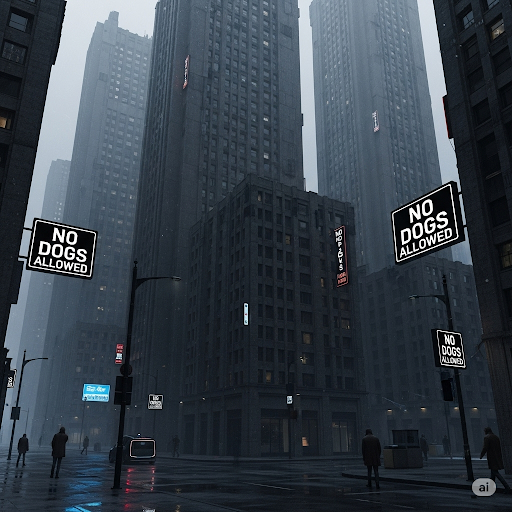
- IPA: /ɪmˈpɜːrsənl/
- class: adjective
- định nghĩa: không thân thiện, không thể hiện cảm xúc cá nhân.
- English definition: not showing personal feelings or warmth; unfriendly.
- sentence of story: Elvis soon found out that the city was a big and **impersonal** place.
- ví dụ thông dụng:
    1. Big offices can feel cold and **impersonal**.
    2. He gave an **impersonal** smile.

## 17. ornament
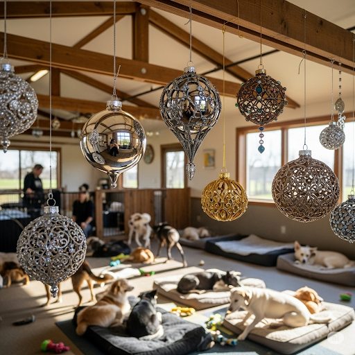
- IPA: /ˈɔːrnəmənt/
- class: noun
- định nghĩa: đồ trang trí.
- English definition: an object that is used as a decoration.
- sentence of story: The interior of the building was painted blue, and shiny **ornaments** hung from the ceiling.
- ví dụ thông dụng:
    1. We put beautiful **ornaments** on the Christmas tree.
    2. The vase is an **ornament** for the room.

## 18. pedestrian
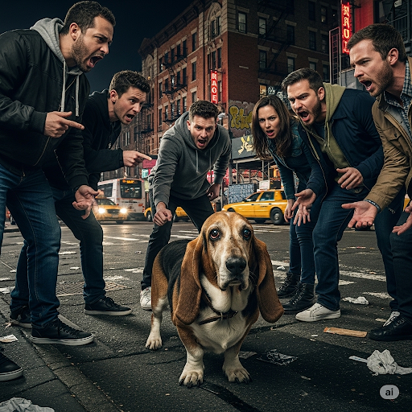
- IPA: /pəˈdestriən/
- class: noun
- định nghĩa: người đi bộ.
- English definition: a person walking, especially in an area also used by cars.
- sentence of story: **Pedestrians** yelled at him.
- ví dụ thông dụng:
    1. This area is for **pedestrians** only.
    2. A **pedestrian** should use the crosswalk.

## 19. sanctuary
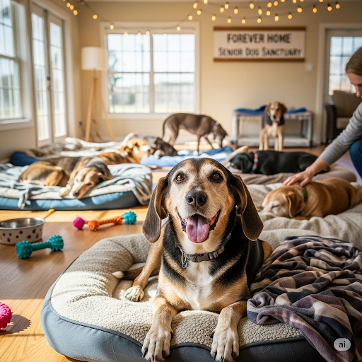
- IPA: /ˈsæŋktʃueri/
- class: noun
- định nghĩa: nơi trú ẩn an toàn.
- English definition: a place of refuge or safety.
- sentence of story: I can take you to a **sanctuary** for old dogs like you.
- ví dụ thông dụng:
    1. The church was a **sanctuary** for the homeless.
    2. The park is a bird **sanctuary**.

## 20. spectator

- IPA: /ˈspekteɪtər/
- class: noun
- định nghĩa: khán giả, người xem một sự kiện.
- English definition: a person who watches at a show, game, or other event.
- sentence of story: **Spectators** who bet on dog races always picked Elvis to win.
- ví dụ thông dụng:
    1. The **spectators** cheered for their team.
    2. There were many **spectators** at the football match.