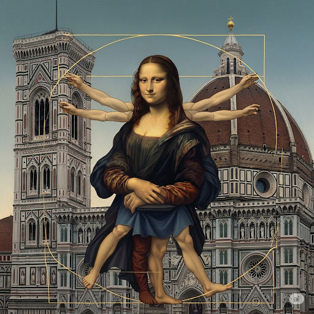

# Day Without Sight 
On Friday afternoon, Sam’s teacher had a special assignment.

“Next week, we’ll be studying **humanitarian** efforts around the world since the time of the **Renaissance**, including those to help the blind,” she said. “Over the weekend, I want each of you to wear a blindfold for an entire day. The **premise** of this experiment is that it will help you understand what it’s like to be blind,” she said.

Sam was a **skeptic**. He really didn’t think the assignment would be too challenging. On Saturday morning, Sam took a piece of cloth and tied it around his head to cover his eyes. Then he went into the kitchen for breakfast. He heard the voices of his parents and brothers but couldn’t **specify** where each voice was coming from. He thought about how important hearing is for blind people.

“Could you pass me the newspaper, please?” he asked. Just then, he remembered he couldn’t see the words on the page. He wondered if **Braille** newspapers were ever made.

After finishing breakfast, his brothers asked him to play soccer. As he followed them, he accidentally walked into the baker’s **rack**. He also found that he couldn’t play soccer. He wouldn’t be able to **coordinate** his actions without being able to see. Without his **optic** senses, he had no **spatial** awareness. Furthermore, he couldn’t do **simultaneous** activities because he had to make sure he was safe first.

He sat on the lawn. Suddenly, he realized that though he couldn’t see, his other senses worked perfectly fine. In fact, he began to realize new and different **aspects** of common objects. For example, he took a flower **bud** and felt it with his finger. He realized for the first time that it seemed to be covered with **wax**.

His **hypothesis** about being blind was **disproved**. The **informative** experiment had an **imprint** on him. It showed him sight was an **asset** that should be appreciated and taught him to **revere** the talents of blind people.

## List of word

asset aspect braille bud coordinate disprove humanitarian hypothesis imprint informative optic premise rack Renaissance revere simultaneous skeptic spatial specify wax

## Sentences of story

Day Without Sight 

On Friday afternoon, Sam’s teacher had a special assignment.

“Next week, we’ll be studying humanitarian efforts around the world since the time of the Renaissance, including those to help the blind,” she said.

“Over the weekend, I want each of you to wear a blindfold for an entire day.

The premise of this experiment is that it will help you understand what it’s like to be blind,” she said.

Sam was a skeptic.

He really didn’t think the assignment would be too challenging.

On Saturday morning, Sam took a piece of cloth and tied it around his head to cover his eyes.

Then he went into the kitchen for breakfast.

He heard the voices of his parents and brothers but couldn’t specify where each voice was coming from.

He thought about how important hearing is for blind people.

“Could you pass me the newspaper, please?” he asked.

Just then, he remembered he couldn’t see the words on the page.

He wondered if Braille newspapers were ever made.

After finishing breakfast, his brothers asked him to play soccer.

As he followed them, he accidentally walked into the baker’s rack.

He also found that he couldn’t play soccer.

He wouldn’t be able to coordinate his actions without being able to see.

Without his optic senses, he had no spatial awareness.

Furthermore, he couldn’t do simultaneous activities because he had to make sure he was safe first.

He sat on the lawn.

Suddenly, he realized that though he couldn’t see, his other senses worked perfectly fine.

In fact, he began to realize new and different aspects of common objects.

For example, he took a flower bud and felt it with his finger.

He realized for the first time that it seemed to be covered with wax.

His hypothesis about being blind was disproved.

The informative experiment had an imprint on him.

It showed him sight was an asset that should be appreciated and taught him to revere the talents of blind people.

## 1. asset

- IPA: /ˈæs.et/
- class: noun
- định nghĩa: tài sản, của cải; một người hoặc vật có giá trị.
- English definition: a useful or valuable thing, person, or quality.
- sentence of story: It showed him sight was an **asset** that should be appreciated and taught him to revere the talents of blind people.
- ví dụ thông dụng:
    1. Her knowledge of languages is a great **asset**.
    2. A company's employees are its biggest **asset**.

## 2. aspect

- IPA: /ˈæs.pekt/
- class: noun
- định nghĩa: khía cạnh, phương diện.
- English definition: a particular part or feature of something.
- sentence of story: In fact, he began to realize new and different **aspects** of common objects.
- ví dụ thông dụng:
    1. The problem has many different **aspects**.
    2. We must consider every **aspect** of the situation.

## 3. Braille

- IPA: /breɪl/
- class: noun
- định nghĩa: hệ thống chữ nổi cho người mù.
- English definition: a system of writing and printing for blind people, in which raised dots are used to represent letters and numbers.
- sentence of story: He wondered if **Braille** newspapers were ever made.
- ví dụ thông dụng:
    1. She learned to read **Braille** at a young age.
    2. The book is also available in **Braille**.

## 4. bud

- IPA: /bʌd/
- class: noun
- định nghĩa: nụ, chồi (cây).
- English definition: a small part of a plant, that develops into a flower or leaf.
- sentence of story: For example, he took a flower **bud** and felt it with his finger.
- ví dụ thông dụng:
    1. The roses are in **bud**.
    2. Look at the little green **buds** on the trees.

## 5. coordinate

- IPA: /kəʊˈɔː.dɪ.neɪt/
- class: verb
- định nghĩa: phối hợp, điều phối.
- English definition: to make many different things work together effectively.
- sentence of story: He wouldn’t be able to **coordinate** his actions without being able to see.
- ví dụ thông dụng:
    1. We need to **coordinate** our efforts to finish the project.
    2. The dancers **coordinate** their movements perfectly.

## 6. disprove

- IPA: /dɪsˈpruːv/
- class: verb
- định nghĩa: bác bỏ, chứng minh là sai.
- English definition: to prove that something is not true.
- sentence of story: His hypothesis about being blind was **disproved**.
- ví dụ thông dụng:
    1. The evidence helped to **disprove** his theory.
    2. It is difficult to **disprove** a negative claim.

## 7. humanitarian

- IPA: /hjuːˌmæn.ɪˈteə.ri.ən/
- class: adjective
- định nghĩa: nhân đạo.
- English definition: involved in or connected with improving people's lives and reducing suffering.
- sentence of story: “Next week, we’ll be studying **humanitarian** efforts around the world since the time of the Renaissance, including those to help the blind,” she said.
- ví dụ thông dụng:
    1. The organization provides **humanitarian** aid to victims of the disaster.
    2. He is known for his **humanitarian** work.

## 8. hypothesis

- IPA: /haɪˈpɒθ.ə.sɪs/
- class: noun
- định nghĩa: giả thuyết.
- English definition: an idea or explanation for something that is based on known facts but has not yet been proved.
- sentence of story: His **hypothesis** about being blind was disproved.
- ví dụ thông dụng:
    1. The scientist tested his **hypothesis** with an experiment.
    2. There are many different **hypotheses** about the cause of the disease.

## 9. imprint

- IPA: /ˈɪm.prɪnt/
- class: noun
- định nghĩa: dấu ấn, ấn tượng sâu sắc.
- English definition: an occasion when an object presses on something and leaves a mark; a lasting effect or influence.
- sentence of story: The informative experiment had an **imprint** on him.
- ví dụ thông dụng:
    1. The experience left a lasting **imprint** on her memory.
    2. His foot left an **imprint** in the sand.

## 10. informative

- IPA: /ɪnˈfɔː.mə.tɪv/
- class: adjective
- định nghĩa: cung cấp nhiều thông tin, hữu ích.
- English definition: providing useful or interesting information.
- sentence of story: The **informative** experiment had an imprint on him.
- ví dụ thông dụng:
    1. The lecture was very **informative**.
    2. This is an **informative** and well-written book.

## 11. optic

- IPA: /ˈɒp.tɪk/
- class: adjective
- định nghĩa: (thuộc về) thị giác, quang học.
- English definition: relating to the eye or sight.
- sentence of story: Without his **optic** senses, he had no spatial awareness.
- ví dụ thông dụng:
    1. The **optic** nerve connects the eye to the brain.
    2. He is studying **optic** illusions.

## 12. premise

- IPA: /ˈprem.ɪs/
- class: noun
- định nghĩa: tiền đề, giả thuyết.
- English definition: an idea or theory on which a statement or action is based.
- sentence of story: The **premise** of this experiment is that it will help you understand what it’s like to be blind,” she said.
- ví dụ thông dụng:
    1. The argument is based on a false **premise**.
    2. The basic **premise** of the movie is that love conquers all.

## 13. rack

- IPA: /ræk/
- class: noun
- định nghĩa: giá, kệ (để đồ).
- English definition: a frame or shelf, usually with bars or hooks, for holding or storing things.
- sentence of story: As he followed them, he accidentally walked into the baker’s **rack**.
- ví dụ thông dụng:
    1. Put the dishes in the drying **rack**.
    2. He hung his coat on the coat **rack**.

## 14. Renaissance

- IPA: /rəˈneɪ.səns/
- class: noun
- định nghĩa: thời kỳ Phục hưng.
- English definition: the period of new growth of interest and activity in the areas of art, literature, and ideas in Europe during the 15th and 16th centuries.
- sentence of story: “Next week, we’ll be studying humanitarian efforts around the world since the time of the **Renaissance**, including those to help the blind,” she said.
- ví dụ thông dụng:
    1. Leonardo da Vinci was a great artist of the **Renaissance**.
    2. The book is about art during the Italian **Renaissance**.

## 15. revere

- IPA: /rɪˈvɪər/
- class: verb
- định nghĩa: tôn kính, sùng kính.
- English definition: to have great respect for someone or something.
- sentence of story: It showed him sight was an asset that should be appreciated and taught him to **revere** the talents of blind people.
- ví dụ thông dụng:
    1. Many people **revere** the late president.
    2. She is a writer who is **revered** by her readers.

## 16. simultaneous

- IPA: /ˌsɪm.əlˈteɪ.ni.əs/
- class: adjective
- định nghĩa: đồng thời, xảy ra cùng một lúc.
- English definition: happening or being done at exactly the same time.
- sentence of story: Furthermore, he couldn’t do **simultaneous** activities because he had to make sure he was safe first.
- ví dụ thông dụng:
    1. There were several **simultaneous** explosions in different cities.
    2. The game will be broadcast **simultaneously** on TV and radio.

## 17. skeptic

- IPA: /ˈskep.tɪk/
- class: noun
- định nghĩa: người hoài nghi.
- English definition: a person who doubts the truth or value of an idea or belief.
- sentence of story: Sam was a **skeptic**.
- ví dụ thông dụng:
    1. He is a **skeptic** when it comes to ghosts.
    2. **Skeptics** say the new plan will not work.

## 18. spatial

- IPA: /ˈspeɪ.ʃəl/
- class: adjective
- định nghĩa: (thuộc về) không gian.
- English definition: relating to the position, area, and size of things.
- sentence of story: Without his optic senses, he had no **spatial** awareness.
- ví dụ thông dụng:
    1. This task tests your **spatial** reasoning skills.
    2. The artist has a good sense of **spatial** arrangement.

## 19. specify

- IPA: /ˈspes.ɪ.faɪ/
- class: verb
- định nghĩa: chỉ rõ, định rõ.
- English definition: to explain or describe something clearly and in detail.
- sentence of story: He heard the voices of his parents and brothers but couldn’t **specify** where each voice was coming from.
- ví dụ thông dụng:
    1. Please **specify** your requirements.
    2. The contract **specifies** the payment terms.

## 20. wax

- IPA: /wæks/
- class: noun
- định nghĩa: sáp.
- English definition: a solid, yellowish, fatty substance that is secreted by bees, used for making candles, etc.
- sentence of story: He realized for the first time that it seemed to be covered with **wax**.
- ví dụ thông dụng:
    1. Candles are made of **wax**.
    2. He used **wax** to polish the floor.
