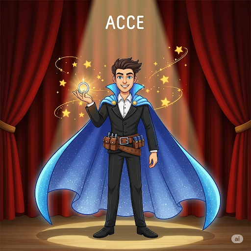
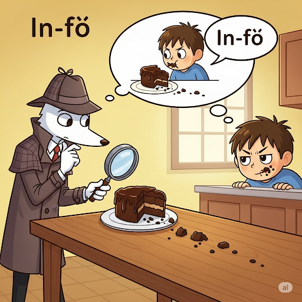

# The Big Ship

Ernest looked at his **fleet** of ships. Usually, he used them for his firm, which **imported** **marble** statues from other countries. But today he was going fishing. And the ship he chose was his favorite. It had an **elaborate** painting on the side that showed a **naval** battle. It also had some new **updates** to its computer system. His favorite ship’s latest **acquisition** was a device with a small **grid** to show the ship’s exact location. This new **accessory** kept Ernest from getting lost.

At daybreak, Ernest happily sailed the temperate waters until he was far from land. Then he saw a small boat in the distance. There was an old man standing next to its **mast**. He was waving his arms in the air. There was also a boy with his head hanging over the boat’s edge. Ernest **inferred** that the boy was suffering from **nausea**. Both of their clothes were **saturated** with sea water. Ernest assumed that they were in trouble. Most people never realized, but Ernest had an **innate** desire to help people. He began sailing toward them, eager to **facilitate** their rescue and thus solve their **dilemma**.

As he got closer to the boat, he was shocked by its simplicity. The boat’s wood looked no stronger than **cardboard**, and the equipment was old. Still, there were several large fish in a **pouch** in the boat.

Ernest threw a large package onto the boat. He yelled, “Here! You can **inflate** this boat to get you back to land.”
“Get out of here!” screamed the old man.
Ernest was confused. “Don’t you need help?” he asked. “Your ship doesn’t seem **adequate** enough to sail so far away from land.”
“You’ve just scared away a huge fish,” the boy said. “We waved to let you know you were too close to us.”
Ernest turned around and headed home. He learned that it’s better not to help unless asked to. Otherwise, you might not help anyone at all.

## Sentences of story
Ernest looked at his fleet of ships.

Usually, he used them for his firm, which imported marble statues from other countries.

But today he was going fishing.

And the ship he chose was his favorite.

It had an elaborate painting on the side that showed a naval battle.

It also had some new updates to its computer system.

His favorite ship’s latest acquisition was a device with a small grid to show the ship’s exact location.

This new accessory kept Ernest from getting lost.

At daybreak, Ernest happily sailed the temperate waters until he was far from land.

Then he saw a small boat in the distance.

There was an old man standing next to its mast.

He was waving his arms in the air.

There was also a boy with his head hanging over the boat’s edge.

Ernest inferred that the boy was suffering from nausea.

Both of their clothes were saturated with sea water.

Ernest assumed that they were in trouble.

Most people never realized, but Ernest had an innate desire to help people.

He began sailing toward them, eager to facilitate their rescue and thus solve their dilemma.

As he got closer to the boat, he was shocked by its simplicity.

The boat’s wood looked no stronger than cardboard, and the equipment was old.

Still, there were several large fish in a pouch in the boat.

Ernest threw a large package onto the boat.

He yelled, “Here! You can inflate this boat to get you back to land.”

“Get out of here!” screamed the old man.

Ernest was confused.

“Don’t you need help?” he asked.

“Your ship doesn’t seem adequate enough to sail so far away from land.”

“You’ve just scared away a huge fish,” the boy said.

“We waved to let you know you were too close to us.”

Ernest turned around and headed home.

He learned that it’s better not to help unless asked to.

Otherwise, you might not help anyone at all.

## List of word
accessory acquisition adequate cardboard dilemma elaborate facilitate fleet grid import infer inflate innate marble mast nausea naval pouch saturated update

## 1. accessory

- IPA: /əkˈsesəri/
- Class: n.
- Câu truyện ẩn dụ: "Anh sẽ sơ ri" (I will serially) mua hết các **phụ kiện** này.
- Định nghĩa : Phụ kiện, đồ phụ tùng.
- Enlish definition: Something added to a machine or to clothing that has a useful or decorative purpose.
- Sentence of stroy: This new **accessory** kept Ernest from getting lost.
- Ví dụ thông dụng:
1. She wore a simple black dress, accessorized with a silver belt.
2. A car's standard accessories include a spare tire and a jack.

## 2. acquisition

- IPA: /ˌækwɪˈzɪʃn/
- Class: n.
- Câu truyện ẩn dụ: "Ac! Quỷ dị sình" lên sau khi **mua lại** được món đồ cổ.
- Định nghĩa : Sự giành được, sự thu được, sự mua lại.
- Enlish definition: The process of getting something; the item that is bought or obtained.
- Sentence of stroy: His favorite ship’s latest **acquisition** was a device with a small grid to show the ship’s exact location.
- Ví dụ thông dụng:
1. The company's latest acquisition is a small startup specializing in AI.
2. Language acquisition is easiest for children.

## 3. adequate

- IPA: /ˈædɪkwət/
- Class: adj.
- Câu truyện ẩn dụ: "A! Đi... quét" dọn đi, đồ đạc vẫn chưa **đầy đủ** đâu.
- Định nghĩa : Đầy đủ, tương xứng, thích đáng.
- Enlish definition: Enough or satisfactory for a particular purpose.
- Sentence of stroy: “Your ship doesn’t seem **adequate** enough to sail so far away from land.”
- Ví dụ thông dụng:
1. The food was adequate but not exceptional.
2. He didn't have adequate time to prepare for the exam.

## 4. cardboard

- IPA: /ˈkɑːrdbɔːrd/
- Class: n.
- Câu truyện ẩn dụ: Cái **thẻ** (card) trên cái **bảng** (board) làm bằng **bìa cứng**.
- Định nghĩa : Bìa cứng, các-tông.
- Enlish definition: A thick, stiff paper-like material that's used for making boxes.
- Sentence of stroy: The boat’s wood looked no stronger than **cardboard**, and the equipment was old.
- Ví dụ thông dụng:
1. We packed our books in cardboard boxes.
2. The kids made a castle out of a large cardboard box.

## 5. dilemma

- IPA: /dɪˈlemə/
- Class: n.
- Câu truyện ẩn dụ: "Đi... lẹ mà", đừng để tôi phải rơi vào **tình thế tiến thoái lưỡng nan**.
- Định nghĩa : Tình thế tiến thoái lưỡng nan, tình thế khó xử.
- Enlish definition: A situation in which a difficult choice has to be made between two or more alternatives, especially equally undesirable ones.
- Sentence of stroy: He began sailing toward them, eager to facilitate their rescue and thus solve their **dilemma**.
- Ví dụ thông dụng:
1. She faced the dilemma of disobeying her father or losing the man she loved.
2. The president is clearly in a dilemma about how to tackle the crisis.

## 6. elaborate

- IPA: /ɪˈlæbərət/
- Class: adj.
- Câu truyện ẩn dụ: "Ê! La bơ đi!", đó là mật khẩu để vào xem bức tranh **tinh xảo** này.
- Định nghĩa : Tỉ mỉ, công phu, tinh xảo.
- Enlish definition: Containing a lot of careful detail or many detailed parts.
- Sentence of stroy: It had an **elaborate** painting on the side that showed a naval battle.
- Ví dụ thông dụng:
1. They're making elaborate preparations for the wedding.
2. He came out with an elaborate excuse for being late.

## 7. facilitate

- IPA: /fəˈsɪlɪteɪt/
- Class: v.
- Câu truyện ẩn dụ: **Pha xi-rô li ti** sẽ **tạo điều kiện thuận lợi** cho việc uống thuốc.
- Định nghĩa : Tạo điều kiện thuận lợi, làm cho dễ dàng hơn.
- Enlish definition: To make an action or process easy or easier.
- Sentence of stroy: He began sailing toward them, eager to **facilitate** their rescue and thus solve their dilemma.
- Ví dụ thông dụng:
1. The new airport will facilitate the development of tourism.
2. A good teacher can facilitate learning.

## 8. fleet

- IPA: /fliːt/
- Class: n.
- Câu truyện ẩn dụ: Vì phải quản lí cả một **hạm đội** tàu thuyền nên ông ta trông rất "phờ" và chẳng còn "lí" lẽ gì nữa.
- Định nghĩa : Hạm đội, đội tàu.
- Enlish definition: A group of ships sailing together, engaged in the same activity, or under the same ownership.
- Sentence of stroy: Ernest looked at his **fleet** of ships.
- Ví dụ thông dụng:
1. The company has a fleet of 20 trucks.
2. The British fleet was victorious in the battle.

## 9. grid

- IPA: /ɡrɪd/
- Class: n.
- Câu truyện ẩn dụ: Dùng **gậy dí** vào từng ô trên **lưới** để kiểm tra.
- Định nghĩa : Lưới, mạng lưới (hệ thống đường kẻ).
- Enlish definition: A pattern of straight lines that cross each other to form squares.
- Sentence of stroy: His favorite ship’s latest acquisition was a device with a small **grid** to show the ship’s exact location.
- Ví dụ thông dụng:
1. The map showed a grid of streets.
2. The national power grid supplies electricity to the entire country.

## 10. import

- IPA: /ɪmˈpɔːrt/
- Class: v.
- Câu truyện ẩn dụ: "Im... bọt" - Tên buôn lậu nói khi **nhập khẩu** hàng cấm giấu trong các chai nước có bọt.
- Định nghĩa : Nhập khẩu.
- Enlish definition: To bring a product, service, or idea into one country from another.
- Sentence of stroy: Usually, he used them for his firm, which **imported** marble statues from other countries.
- Ví dụ thông dụng:
1. We import a large number of cars from Japan.
2. The country has to import most of its raw materials.

## 11. infer

- IPA: /ɪnˈfɜːr/
- Class: v.
- Câu truyện ẩn dụ: **Trong "phở"** có nhiều hành, tôi **suy ra** người nấu thích ăn hành.
- Định nghĩa : Suy ra, luận ra.
- Enlish definition: To form an opinion or guess that something is true because of the information that you have.
- Sentence of stroy: Ernest **inferred** that the boy was suffering from nausea.
- Ví dụ thông dụng:
1. From his frown, I inferred that he was not pleased.
2. What do you infer from her silence?

## 12. inflate

- IPA: /ɪnˈfleɪt/
- Class: v.
- Câu truyện ẩn dụ: "In... lẹ thế?" - Ông chủ xưởng in hỏi khi thấy chiếc phao bị **thổi phồng** lên nhanh như tốc độ máy in.
- Định nghĩa : Thổi phồng, bơm căng.
- Enlish definition: To fill something with air or gas so it expands.
- Sentence of stroy: You can **inflate** this boat to get you back to land.
- Ví dụ thông dụng:
1. He inflated the tires of his bike.
2. The media has inflated the importance of this issue.

## 13. innate

- IPA: /ɪˈneɪt/
- Class: adj.
- Câu truyện ẩn dụ: Con heo con có cái nết hay ngủ là **bẩm sinh**.
- Định nghĩa : Bẩm sinh, thiên phú.
- Enlish definition: An innate quality or ability is one that you are born with, not one you have learned.
- Sentence of stroy: Most people never realized, but Ernest had an **innate** desire to help people.
- Ví dụ thông dụng:
1. He has an innate talent for music.
2. Her innate sense of justice made her a great lawyer.

## 14. marble

- IPA: /ˈmɑːrbl/
- Class: n.
- Câu truyện ẩn dụ: **"Má bồ"** thích những bức tượng bằng **đá cẩm thạch**.
- Định nghĩa : Đá cẩm thạch.
- Enlish definition: A type of hard rock that becomes smooth and shiny when it is polished, used for decoration and in buildings.
- Sentence of stroy: Usually, he used them for his firm, which imported **marble** statues from other countries.
- Ví dụ thông dụng:
1. The floor was made of polished marble.
2. The statue was carved from a single block of marble.

## 15. mast

- IPA: /mæst/
- Class: n.
- Câu truyện ẩn dụ: Đứng dưới **cột buồm** thì rất **mát**.
- Định nghĩa : Cột buồm.
- Enlish definition: A tall pole on a boat or ship that supports the sails.
- Sentence of stroy: There was an old man standing next to its **mast**.
- Ví dụ thông dụng:
1. The ship's mast was broken in the storm.
2. The flag was raised to the top of the mast.

## 16. nausea

- IPA: /ˈnɔːziə/
- Class: n.
- Câu truyện ẩn dụ: **"Nó... zia"** - Anh ta lùi ra xa vì cảm thấy **buồn nôn**.
- Định nghĩa : Sự buồn nôn, sự kinh tởm.
- Enlish definition: The feeling that you are going to vomit.
- Sentence of stroy: Ernest inferred that the boy was suffering from **nausea**.
- Ví dụ thông dụng:
1. Early pregnancy is often accompanied by nausea.
2. The sight of the blood filled him with nausea.

## 17. naval

- IPA: /ˈneɪvl/
- Class: adj.
- Câu truyện ẩn dụ: **"Nầy! Vồ!"** - Lệnh tấn công được đưa ra trong trận chiến **(thuộc) hải quân**.
- Định nghĩa : (thuộc) Hải quân.
- Enlish definition: Relating to a country's navy or ships.
- Sentence of stroy: It had an elaborate painting on the side that showed a **naval** battle.
- Ví dụ thông dụng:
1. He joined the naval academy after high school.
2. The port is a major naval base.

## 18. pouch

- IPA: /paʊtʃ/
- Class: n.
- Câu truyện ẩn dụ: Cái **túi nhỏ** (pouch) này nhẹ như cái **phao**.
- Định nghĩa : Túi nhỏ.
- Enlish definition: A small, soft bag, often made of leather or cloth.
- Sentence of stroy: Still, there were several large fish in a **pouch** in the boat.
- Ví dụ thông dụng:
1. A kangaroo carries its baby in a pouch.
2. He kept his coins in a small leather pouch.

## 19. saturated

- IPA: /ˈsætʃəreɪtɪd/
- Class: adj.
- Câu truyện ẩn dụ: "Nó đã **sa** xuống nước chưa? Quần áo nó **ướt sũng** rồi kìa."
- Định nghĩa : Ướt sũng, bão hòa.
- Enlish definition: Completely wet.
- Sentence of stroy: Both of their clothes were **saturated** with sea water.
- Ví dụ thông dụng:
1. My shoes were saturated after walking in the rain.
2. The market for these products is already saturated.

## 20. update

- IPA: /ˈʌpdeɪt/
- Class: n.
- Câu truyện ẩn dụ: Sau khi **cập nhật** phần mềm, máy tính hiện lên hình một cái đĩa bị **úp** xuống.
- Định nghĩa : Sự cập nhật, bản cập nhật.
- Enlish definition: New information; a new or more modern version of something.
- Sentence of stroy: It also had some new **updates** to its computer system.
- Ví dụ thông dụng:
1. I need to get an update on the project's progress.
2. Please install the latest software update.
