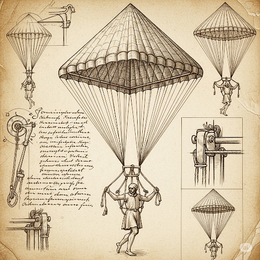
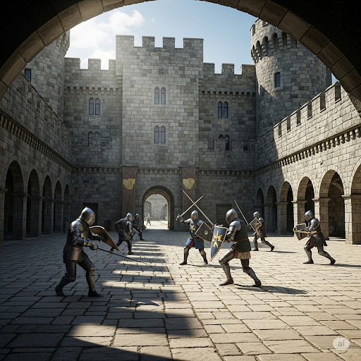
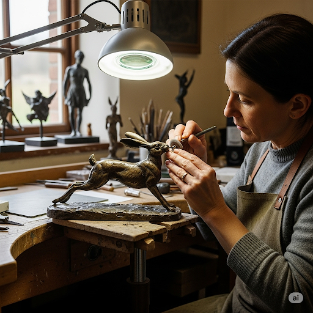
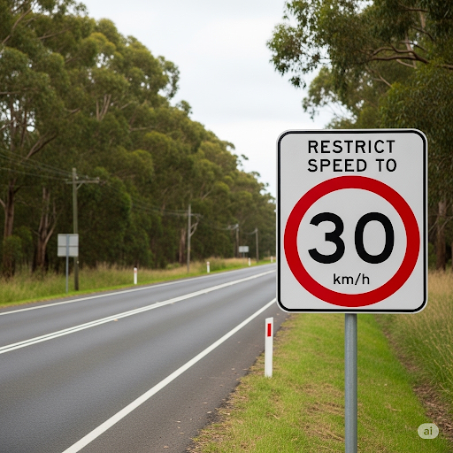

# The History of Parachutes

Scientists who study **archeology** say that there may be some evidence of **prehistoric** parachutes. But the first written history of the device comes from China about 2,100 years ago. Scientists **cite** an ancient book that describes parachutes. However, there is no **archeological** evidence that proves that an actual parachute was ever made. Later, people from northern Africa and Italy also had ideas about a similar invention. In fact, a Leonardo Da Vinci’s drawing **corresponds** closely with the modern **parachute** design!

In 1783, French scientist Sebastian Lenormand invented the first modern parachute. Sebastian **brainstormed** with other scientists to come up with a way to help people jump safely out of burning buildings. He thought the solution was to give people an object to **restrict** their speed while they traveled toward the ground. Many people thought that he was up to some kind of **fraud**, but Sebastian had a lot of **integrity**. His **budget** was limited, so he first tested his theory by using two umbrellas. He jumped out of a tree and found that the umbrellas worked.

Next, he **refined** his invention. Rather than using umbrellas, he **knit** a large parachute. Finally, he jumped off a tall building on a French **estate** and landed safely in the **courtyard**.

Sebastian’s work gave another man an idea. Jean-Pierre Blanchard had a different **outlook** than Sebastian. He was a hot air balloon **addict**. He was one of the first people to ride in a hot air balloon powered by **hydrogen** gas. He was a **proponent** of using the parachutes to exit from hot air balloons. Starting in 1785, he used his dog to show that animals could land safely from hot air balloons by using parachutes. Then, in 1793, he was faced with a **chaotic** experience. The hot air balloon he was riding in burst and started to fall. He was forced to use a parachute himself. And much to his relief, it saved his life!

## Sentences of story

The History of Parachutes

Scientists who study archeology say that there may be some evidence of prehistoric parachutes.

But the first written history of the device comes from China about 2,100 years ago.

Scientists cite an ancient book that describes parachutes.

However, there is no archeological evidence that proves that an actual parachute was ever made.

Later, people from northern Africa and Italy also had ideas about a similar invention.

In fact, a Leonardo Da Vinci’s drawing corresponds closely with the modern parachute design!

In 1783, French scientist Sebastian Lenormand invented the first modern parachute.

Sebastian brainstormed with other scientists to come up with a way to help people jump safely out of burning buildings.

He thought the solution was to give people an object to restrict their speed while they traveled toward the ground.

Many people thought that he was up to some kind of fraud, but Sebastian had a lot of integrity.

His budget was limited, so he first tested his theory by using two umbrellas.

He jumped out of a tree and found that the umbrellas worked.

Next, he refined his invention.

Rather than using umbrellas, he knit a large parachute.

Finally, he jumped off a tall building on a French estate and landed safely in the courtyard.

Sebastian’s work gave another man an idea.

Jean-Pierre Blanchard had a different outlook than Sebastian.

He was a hot air balloon addict.

He was one of the first people to ride in a hot air balloon powered by hydrogen gas.

He was a proponent of using the parachutes to exit from hot air balloons.

Starting in 1785, he used his dog to show that animals could land safely from hot air balloons by using parachutes.

Then, in 1793, he was faced with a chaotic experience.

The hot air balloon he was riding in burst and started to fall.

He was forced to use a parachute himself.

And much to his relief, it saved his life!

## List of word
addict archeological archeology brainstorm budget chaotic cite correspond courtyard estate fraud hydrogen integrity knit outlook parachute prehistoric proponent refine restrict

## 1. addict

- IPA: /ˈædɪkt/
- Class: n.
- Câu truyện ẩn dụ: Có một anh chàng tên là Át-đích. Anh ta mê chơi game đến mức không thể ngừng lại, quên ăn quên ngủ. Mọi người nói rằng anh ta là một "game addict" thực thụ, vì anh ta dành toàn bộ thời gian và tâm trí cho nó, giống như một thói quen không thể từ bỏ.
- Định nghĩa : Người nghiện.
- Enlish definition: A person who is unable to stop doing or using something as a habit.
- Sentence of stroy: He was a hot air balloon **addict**.
- Ví dụ thông dụng:
1. He's a self-confessed chocolate addict.
2. Many young people are becoming gaming addicts.

## 2. archeological

- IPA: /ˌɑːrkiəˈlɑːdʒɪkl/
- Class: adj.
- Câu truyện ẩn dụ: Một nhà khoa học tên là A-kê-ô đã dành cả đời để đi tìm những di vật cổ xưa. Mỗi khi tìm được một món đồ, ông lại reo lên: "Đây là một phát hiện archeological (thuộc về khảo cổ học) vĩ đại!". Đối với ông, mỗi mảnh gốm, mỗi công cụ đá đều là một bằng chứng archeological quý giá về cuộc sống của người xưa.
- Định nghĩa : (thuộc) Khảo cổ học.
- Enlish definition: Relating to archeology.
- Sentence of stroy: However, there is no **archeological** evidence that proves that an actual parachute was ever made.
- Ví dụ thông dụng:
1. They conducted an archeological dig at the site.
2. The museum holds many important archeological treasures.

## 3. archeology

- IPA: /ˌɑːrkiˈɑːlədʒi/
- Class: n.
- Câu truyện ẩn dụ: Có một cô gái tên là A-kê-ô. Cô đam mê nghiên cứu về quá khứ qua những gì còn sót lại. Cô theo học ngành archeology (khảo cổ học) để có thể tự tay đào bới và phân tích các di tích, khám phá những câu chuyện ẩn giấu dưới lòng đất. Với cô, archeology là cách để du hành thời gian.
- Định nghĩa : Khảo cổ học.
- Enlish definition: The study of the societies and peoples of the past by examining the remains of their buildings, tools, and other objects.
- Sentence of stroy: Scientists who study **archeology** say that there may be some evidence of prehistoric parachutes.
- Ví dụ thông dụng:
1. She is a professor of archeology at the university.
2. Archeology helps us understand how ancient civilizations lived.

## 4. brainstorm

- IPA: /ˈbreɪnstɔːrm/
- Class: v.
- Câu truyện ẩn dụ: Hãy tưởng tượng não (brain) của bạn là một bầu trời, và các ý tưởng là những đám mây. Khi bạn brainstorm, bạn tạo ra một cơn bão (storm) ý tưởng, nơi tất cả các ý tưởng, dù điên rồ đến đâu, cũng được tuôn ra ào ạt mà không bị phán xét. Mục đích là để tạo ra một cơn mưa ý tưởng sáng tạo.
- Định nghĩa : Động não, công não.
- Enlish definition: To suggest a lot of ideas for a future activity or project very quickly, often in a group.
- Sentence of stroy: Sebastian **brainstormed** with other scientists to come up with a way to help people jump safely out of burning buildings.
- Ví dụ thông dụng:
1. The team got together to brainstorm new marketing strategies.
2. Let's brainstorm some ideas for the party.

## 5. budget

- IPA: /ˈbʌdʒɪt/
- Class: n.
- Câu truyện ẩn dụ: Có một người quản lý tên là Bút-ghét. Ông luôn cầm một cuốn sổ và một cây bút (bút) để ghi chép mọi khoản chi tiêu. Ông ghét (ghét) việc tiêu tiền lãng phí. Cuốn sổ của ông chính là bản budget (ngân sách), một kế hoạch chi tiết về số tiền có thể chi tiêu để đảm bảo mọi thứ nằm trong tầm kiểm soát.
- Định nghĩa : Ngân sách, ngân quỹ.
- Enlish definition: A plan to show how much money a person or organization will earn and how much they will need or be able to spend.
- Sentence of stroy: His **budget** was limited, so he first tested his theory by using two umbrellas.
- Ví dụ thông dụng:
1. We have a tight budget for this project.
2. It's important to plan your family budget carefully.

## 6. chaotic

- IPA: /keɪˈɑːtɪk/
- Class: adj.
- Câu truyện ẩn dụ: Hãy tưởng tượng một khu chợ vào giờ cao điểm, người bán kẻ mua la hét, xe cộ bấm còi inh ỏi, gà vịt chạy lung tung. Mọi thứ hỗn loạn và mất trật tự. Một du khách nước ngoài thốt lên "It's chaotic!". Cảnh tượng đó chính là một ví dụ hoàn hảo cho từ chaotic (hỗn loạn).
- Định nghĩa : Hỗn loạn, lộn xộn.
- Enlish definition: In a state of complete confusion and disorder.
- Sentence of stroy: Then, in 1793, he was faced with a **chaotic** experience.
- Ví dụ thông dụng:
1. The traffic in the city is chaotic during rush hour.
2. After the concert, the backstage area was chaotic.

## 7. cite

- IPA: /saɪt/
- Class: v.
- Câu truyện ẩn dụ: Khi bạn làm bài luận, giáo viên luôn nói: "Phải cite (trích dẫn) nguồn!". Điều này giống như việc bạn chỉ ra "sai ở đâu?" (nghe giống "cite") nếu ai đó nghi ngờ thông tin của bạn. Bằng cách cite, bạn đưa ra bằng chứng, chỉ rõ nơi bạn lấy thông tin, làm cho bài viết của bạn trở nên đáng tin cậy.
- Định nghĩa : Trích dẫn.
- Enlish definition: To speak or write words from a particular book, author, or speaker.
- Sentence of stroy: Scientists **cite** an ancient book that describes parachutes.
- Ví dụ thông dụng:
1. He cited three sources in his research paper.
2. She cited her lack of experience as a reason for not taking the job.

## 8. correspond

- IPA: /ˌkɔːrəˈspɑːnd/
- Class: v.
- Câu truyện ẩn dụ: Hai người bạn ở hai đất nước khác nhau. Họ thường xuyên viết thư cho nhau, và những lá thư này "cò-rê-spon" (correspond) với nhau, tức là chúng trao đổi thông tin qua lại. Ngoài ra, những gì họ kể trong thư cũng correspond (tương ứng) với những sự kiện thực tế đang diễn ra, chứng tỏ chúng khớp nhau và đúng sự thật.
- Định nghĩa : Tương ứng, phù hợp, trao đổi thư từ.
- Enlish definition: To match or be similar or equal; to communicate by writing letters.
- Sentence of stroy: In fact, a Leonardo Da Vinci’s drawing **corresponds** closely with the modern parachute design!
- Ví dụ thông dụng:
1. The description of the suspect corresponds to the man we have in custody.
2. I've been corresponding with several experts in the field.

## 9. courtyard

- IPA: /ˈkɔːrtjɑːrd/
- Class: n.
- Câu truyện ẩn dụ: Hãy tưởng tượng một tòa lâu đài cổ. Ở giữa tòa lâu đài là một khoảng sân (yard) rộng lớn, được bao quanh bởi các bức tường đá. Nơi đây từng là sân (court) để các hiệp sĩ luyện tập. Cái sân trong đó được gọi là courtyard - một không gian mở bên trong một tòa nhà hoặc một khu nhà.
- Định nghĩa : Sân trong.
- Enlish definition: An open space that is partly or completely surrounded by buildings.
- Sentence of stroy: Finally, he jumped off a tall building on a French estate and landed safely in the **courtyard**.
- Ví dụ thông dụng:
1. The hotel rooms are arranged around a central courtyard.
2. Children were playing in the school courtyard.

## 10. estate

- IPA: /ɪˈsteɪt/
- Class: n.
- Câu truyện ẩn dụ: Có một vị bá tước rất giàu có. Ông sở hữu một khu đất rộng mênh mông, trên đó có một tòa lâu đài nguy nga, những khu vườn rộng lớn, và cả một khu rừng. Toàn bộ khu đất đai và tài sản đó được gọi là estate (điền trang) của ông. Khi ông qua đời, người ta phải giải quyết "real estate" (bất động sản) của ông.
- Định nghĩa : Điền trang, tài sản lớn (đặc biệt là đất đai).
- Enlish definition: A large area of land in the country, usually with a large house, that is owned by one person or family.
- Sentence of stroy: Finally, he jumped off a tall building on a French **estate** and landed safely in the courtyard.
- Ví dụ thông dụng:
1. He owns a large country estate.
2. The property is part of the late king's estate.

## 11. fraud

- IPA: /frɔːd/
- Class: n.
- Câu truyện ẩn dụ: Có một kẻ lừa đảo chuyên đi bán những món đồ giả. Hắn "phờ-râu" (fraud) ra vẻ rất chuyên nghiệp, nhưng thực chất hành động của hắn là một vụ fraud (gian lận) tinh vi. Hắn lừa mọi người để chiếm đoạt tiền bạc một cách bất chính.
- Định nghĩa : Sự gian lận, sự lừa đảo.
- Enlish definition: The crime of getting money by deceiving people.
- Sentence of stroy: Many people thought that he was up to some kind of **fraud**, but Sebastian had a lot of integrity.
- Ví dụ thông dụng:
1. He was found guilty of tax fraud.
2. She was a psychic who was later revealed to be a fraud.

## 12. hydrogen

- IPA: /ˈhaɪdrədʒən/
- Class: n.
- Câu truyện ẩn dụ: Trong thế giới của các nguyên tố, hydrogen (khí hiđrô) là anh chàng "hai-đời-rồng" (nghe giống hydrogen). Anh ta nhẹ nhất, có thể bay lên cao như rồng, và là thành phần chính tạo ra nước (hydro-). Anh ta chính là nguyên tố số một, đơn giản nhất nhưng cũng quan trọng nhất trong vũ trụ.
- Định nghĩa : Khí hiđrô.
- Enlish definition: A chemical element that is the lightest gas and is used in balloons and as a fuel.
- Sentence of stroy: He was one of the first people to ride in a hot air balloon powered by **hydrogen** gas.
- Ví dụ thông dụng:
1. Water is composed of hydrogen and oxygen.
2. The Hindenburg disaster involved a hydrogen-filled airship.

## 13. integrity

- IPA: /ɪnˈteɡrəti/
- Class: n.
- Câu truyện ẩn dụ: Có một vị quan tên là In-tê-gri. Ông nổi tiếng là người liêm khiết. Dù có bị mua chuộc bằng bao nhiêu vàng bạc, ông vẫn giữ vững nguyên tắc đạo đức của mình. Ông nói: "Ta có thể mất tất cả, nhưng không thể mất integrity (sự chính trực)". Đối với ông, integrity là tài sản quý giá nhất.
- Định nghĩa : Tính chính trực, sự liêm chính.
- Enlish definition: The quality of being honest and having strong moral principles.
- Sentence of stroy: Many people thought that he was up to some kind of **fraud**, but Sebastian had a lot of **integrity**.
- Ví dụ thông dụng:
1. He is a man of the highest integrity.
2. The integrity of the judge was never questioned.

## 14. knit

- IPA: /nɪt/
- Class: v.
- Câu truyện ẩn dụ: Bà của tôi có một đôi que đan. Bà cứ ngồi "nít-nít" (nghe giống knit) cả ngày, và từ những cuộn len, bà đã knit (đan) thành những chiếc áo ấm, khăn choàng và găng tay. Hành động dùng hai que và sợi len để tạo ra sản phẩm chính là knit.
- Định nghĩa : Đan (len).
- Enlish definition: To make clothing from wool or a similar thread using two long needles.
- Sentence of stroy: Rather than using umbrellas, he **knit** a large parachute.
- Ví dụ thông dụng:
1. She's busy knitting a sweater for her son.
2. My grandmother taught me how to knit.

## 15. outlook

- IPA: /ˈaʊtlʊk/
- Class: n.
- Câu truyện ẩn dụ: Hai người cùng nhìn (look) ra (out) một cơn mưa. Một người buồn rầu nói: "Chán thật, lại mưa rồi." Người kia vui vẻ nói: "Tuyệt quá, cây cối sẽ được tưới mát!". Hai người có hai cách nhìn, hai outlook (quan điểm) khác nhau về cùng một sự việc. Outlook chính là cách bạn nhìn ra thế giới.
- Định nghĩa : Quan điểm, cách nhìn.
- Enlish definition: A person's way of understanding and thinking about something.
- Sentence of stroy: Jean-Pierre Blanchard had a different **outlook** than Sebastian.
- Ví dụ thông dụng:
1. He has a positive outlook on life.
2. The economic outlook is uncertain.

## 16. parachute

- IPA: /ˈpærəʃuːt/
- Class: n.
- Câu truyện ẩn dụ: Một anh chàng phi công tên là Pa-ra. Khi máy bay gặp sự cố, anh phải nhảy ra ngoài. Anh hét lên: "Sút!". Anh bung một cái dù lớn ra và hạ cánh an toàn. Cái dù đó đã cứu mạng anh. Mọi người gọi nó là cái parachute (pa-ra-sút), vật dụng giúp nhảy từ trên cao xuống một cách an toàn.
- Định nghĩa : Cái dù (để nhảy từ trên cao).
- Enlish definition: A piece of equipment made of a large piece of thin cloth that is used by people who jump from aircraft to make them fall safely to the ground.
- Sentence of stroy: But the first written history of the device comes from China about 2,100 years ago. Scientists cite an ancient book that describes **parachutes**.
- Ví dụ thông dụng:
1. The soldiers jumped out of the plane with their parachutes.
2. He had to use his emergency parachute.

## 17. prehistoric

- IPA: /ˌpriːhɪˈstɔːrɪk/
- Class: adj.
- Câu truyện ẩn dụ: "Pre-" có nghĩa là "trước", và "historic" có nghĩa là "lịch sử". Vậy prehistoric là thời kỳ trước khi lịch sử được ghi chép lại, tức là thời tiền sử. Hãy tưởng tượng những con khủng long hay người thượng cổ, họ sống trong thời prehistoric, một thời đại mà chúng ta chỉ biết đến qua hóa thạch và các di vật khảo cổ.
- Định nghĩa : (thuộc) Tiền sử.
- Enlish definition: Relating to the period of time before written records were kept.
- Sentence of stroy: Scientists who study archeology say that there may be some evidence of **prehistoric** parachutes.
- Ví dụ thông dụng:
1. Prehistoric cave paintings have been discovered in this area.
2. Woolly mammoths are prehistoric animals.

## 18. proponent

- IPA: /prəˈpəʊnənt/
- Class: n.
- Câu truyện ẩn dụ: Có một nhà khoa học đề xuất (propose) một ý tưởng mới. Ông không chỉ đề xuất mà còn đi khắp nơi để thuyết phục mọi người về lợi ích của nó. Ông trở thành proponent (người ủng hộ) mạnh mẽ nhất cho ý tưởng đó. Một proponent là người công khai ủng hộ một kế hoạch hoặc một hành động.
- Định nghĩa : Người đề xướng, người ủng hộ.
- Enlish definition: A person who argues for or supports a belief or course of action.
- Sentence of stroy: He was a **proponent** of using the parachutes to exit from hot air balloons.
- Ví dụ thông dụng:
1. She is a leading proponent of renewable energy.
2. He has always been a proponent of free speech.

## 19. refine

- IPA: /rɪˈfaɪn/
- Class: v.
- Câu truyện ẩn dụ: "Re-" có nghĩa là "làm lại", và "fine" có nghĩa là "tốt, đẹp". Khi một nghệ nhân refine (cải tiến, tinh chỉnh) một tác phẩm, ông ấy đang làm cho nó "tốt lại", "đẹp lại". Ông ấy gọt giũa, sửa đổi những chi tiết nhỏ để tác phẩm trở nên hoàn hảo hơn.
- Định nghĩa : Cải tiến, tinh chỉnh, làm cho tinh khiết hơn.
- Enlish definition: To make something pure or to improve something by making small changes.
- Sentence of stroy: Next, he **refined** his invention.
- Ví dụ thông dụng:
1. The engineers need to refine the design of the new car.
2. Sugar and oil are refined before being sold.

## 20. restrict

- IPA: /rɪˈstrɪkt/
- Class: v.
- Câu truyện ẩn dụ: Trên một con đường có một biển báo: "Restrict speed to 30 km/h". Điều này có nghĩa là bạn phải restrict (hạn chế, giới hạn) tốc độ của mình, không được đi nhanh hơn. Nó đặt ra một giới hạn mà bạn không được vượt qua.
- Định nghĩa : Hạn chế, giới hạn.
- Enlish definition: To limit something.
- Sentence of stroy: He thought the solution was to give people an object to **restrict** their speed while they traveled toward the ground.
- Ví dụ thông dụng:
1. The new law restricts the sale of firearms.
2. I restrict myself to two cups of coffee a day.