# The Helpful Abbey 

It had not rained on the **prairie** for several months. Because of the **drought**, the climate had become very **arid**. There was no **moisture** left in the soil. No crops could grow in the dry ground. By wintertime, the people had nothing to eat.

The hungry families heard about an **abbey** near the mountains where food and water was still **abundant**. So they traveled **inland**, across the **prairie**, to the **abbey**.

At first only a few families arrived, seeking food and shelter. Then there was **ample** food. The monks fed them and let them sleep in the small **cathedral**.

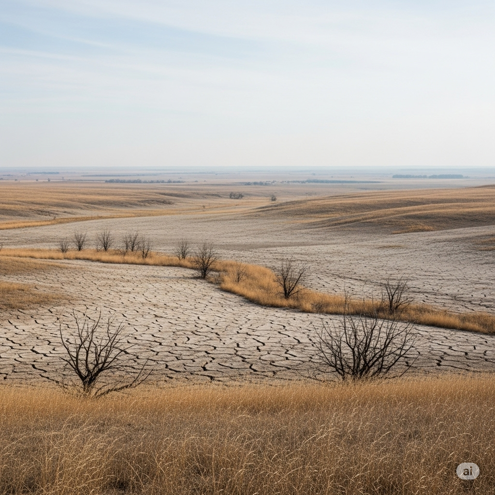

Soon, however, more families were arriving every day. These people had to travel farther, so they were in worse condition. The **rugged** journey had made their clothes **ragged**. They were cold and tired. The tiny **cathedral** was soon full.

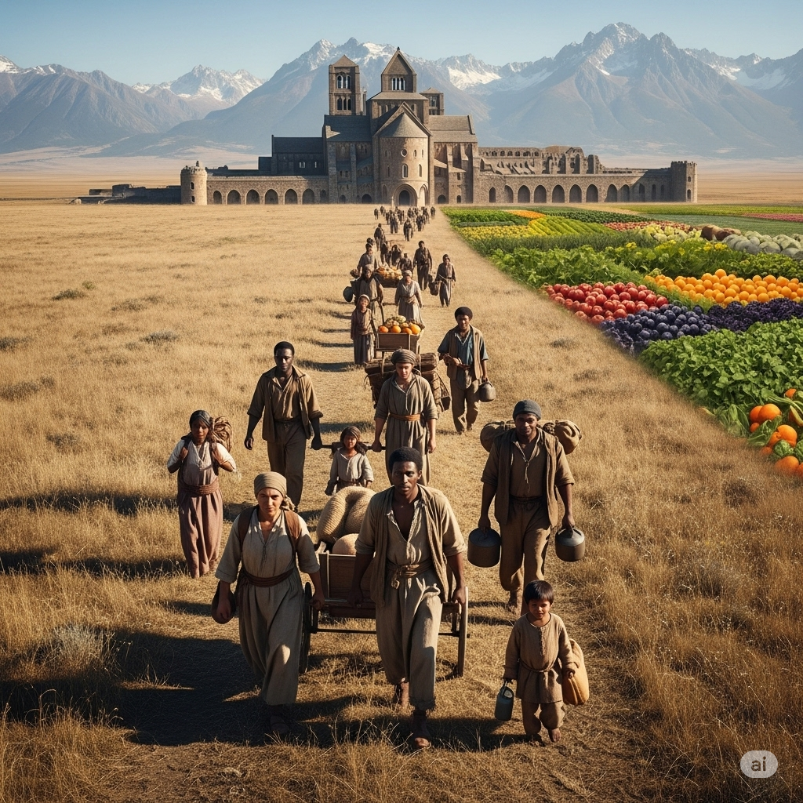

Food became **scarce**. The monks began to **grumble**. They began to **speculate** that there would be no food. “If more families come, we won’t make it through the winter,” said a young monk. “We must ask some of them to leave.”

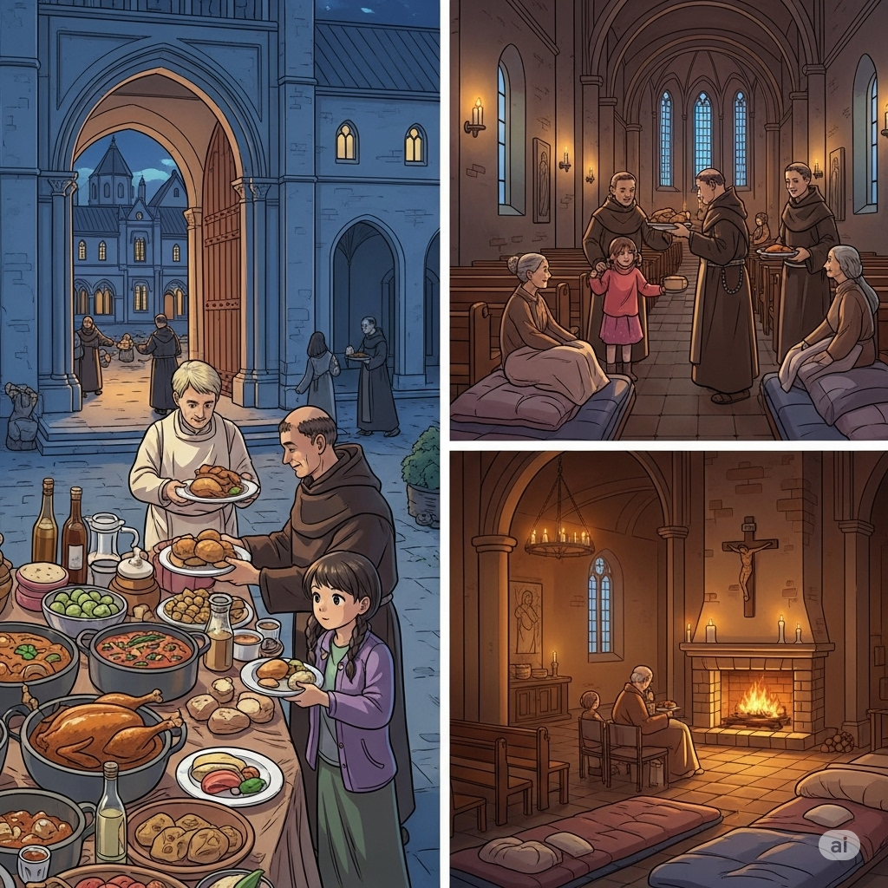

The abbot heard this. “We cannot do that,” he said. “It would be wrong to **deprive** them of food and shelter. We took an **oath** to help those that need help. All here are in need, so all are **eligible** to receive our food and shelter.”

“But we won’t have enough,” the monk said.

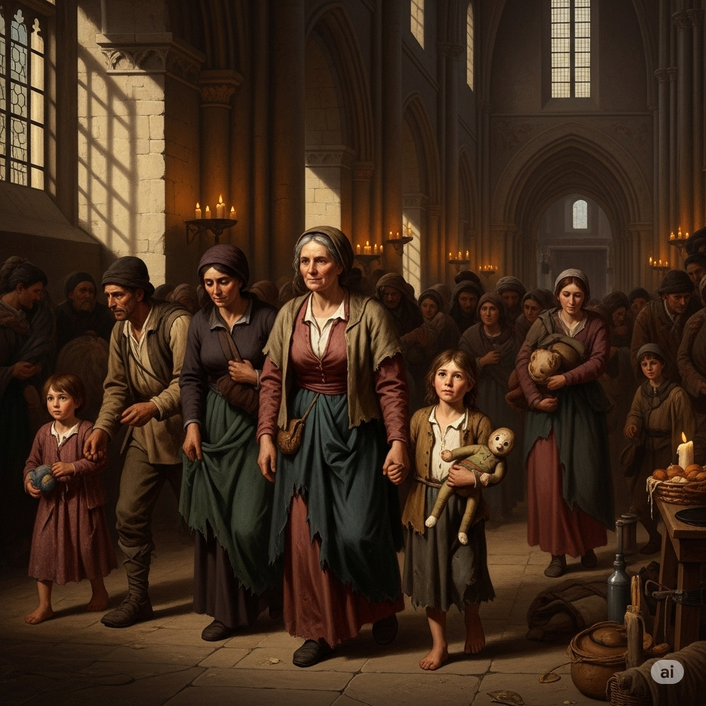

“That might be true, but we must help them **nonetheless**. We will **fast**,” the abbot replied. “Also, we will give our rooms in the **abbey** to those sleeping outside, and we will sleep in the churchyard that **adjoins** the **cathedral**.”

The monks were reluctant at first, but they did what the oldest monk said. By the end of winter, there was still enough food and shelter for everyone. They learned that sometimes helping others means you must give more help than you first expected.

---

---

## Sentences of the story 

It had not rained on the **prairie** for several months.

Because of the **drought**, the climate had become very **arid**.

There was no **moisture** left in the soil.

No crops could grow in the dry ground.

By wintertime, the people had nothing to eat.

The hungry families heard about an **abbey** near the mountains where food and water was still **abundant**.

So they traveled **inland**, across the **prairie**, to the **abbey**.

At first only a few families arrived, seeking food and shelter.

Then there was **ample** food.

The monks fed them and let them sleep in the small **cathedral**.

Soon, however, more families were arriving every day.

These people had to travel farther, so they were in worse condition.

The **rugged** journey had made their clothes **ragged**.

They were cold and tired.

The tiny **cathedral** was soon full.

Food became **scarce**.

The monks began to **grumble**.

They began to **speculate** that there would be no food.

“If more families come, we won’t make it through the winter,” said a young monk.

“We must ask some of them to leave.”

The abbot heard this.

“We cannot do that,” he said.

“It would be wrong to **deprive** them of food and shelter.

We took an **oath** to help those that need help.

All here are in need, so all are **eligible** to receive our food and shelter.”

“But we won’t have enough,” the monk said.

“That might be true, but we must help them **nonetheless**.

We will **fast**,” the abbot replied.

“Also, we will give our rooms in the **abbey** to those sleeping outside, and we will sleep in the churchyard that 
**adjoins** the **cathedral**.”

The monks were reluctant at first, but they did what the oldest monk said.

By the end of winter, there was still enough food and shelter for everyone.

They learned that sometimes helping others means you must give more help than you first expected.

---
## 1. abbey (n)
  
  - **IPA:** /ˈæbi/
  - **English Definition:** A building where monks or nuns live and work.
  - **Nghĩa trong truyện:** tu viện
  - **Câu trong truyện:** The hungry families heard about an **abbey** near the mountains where food and water was still abundant.
  - **Ví dụ:**
      - The monks lived in the abbey.
      - The old abbey had a large garden.
      - Visitors came to see the beautiful abbey.
      - The abbey was a place of peace.
      - They went to the abbey for help.

## 2. abundant (adj)
  
  - **IPA:** /əˈbʌndənt/
  - **English Definition:** Present in large quantities; more than enough.
  - **Nghĩa trong truyện:** dồi dào, phong phú
  - **Câu trong truyện:** The hungry families heard about an abbey near the mountains where food and water was still **abundant**.
  - **Ví dụ:**
      - Food was abundant after the harvest.
      - The forest has abundant wildlife.
      - Water is abundant in this area.
      - We have abundant resources.
      - Ideas were abundant in the meeting.

## 3. adjoin (v)
  
  - **IPA:** /əˈdʒɔɪn/
  - **English Definition:** To be next to or join with something.
  - **Nghĩa trong truyện:** tiếp giáp, nối liền
  - **Câu trong truyện:** Also, we will give our rooms in the abbey to those sleeping outside, and we will sleep in the churchyard that **adjoins** the cathedral.
  - **Ví dụ:**
      - The park adjoins the river.
      - Our garden adjoins their property.
      - The two rooms adjoin each other.
      - The field adjoins the forest.
      - His land adjoins the farm.

## 4. ample (adj)
  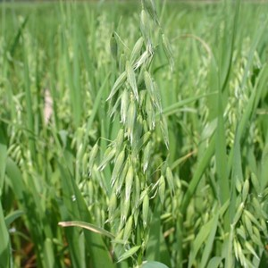
  - **IPA:** /ˈæmpəl/
  - **English Definition:** Enough or more than enough; a lot.
  - **Nghĩa trong truyện:** nhiều, dư dật
  - **Câu trong truyện:** Then there was **ample** food.
  - **Ví dụ:**
      - There is ample space for everyone.
      - We have ample time to finish.
      - She had ample evidence to prove her point.
      - The house has ample light.
      - There were ample opportunities.

## 5. arid (adj)
  
  - **IPA:** /ˈærɪd/
  - **English Definition:** Very dry, with little or no rain.
  - **Nghĩa trong truyện:** khô cằn
  - **Câu trong truyện:** Because of the drought, the climate had become very **arid**.
  - **Ví dụ:**
      - The desert is an arid region.
      - Few plants grow in arid soil.
      - The climate is too arid for farming.
      - An arid landscape stretched for miles.
      - This arid land needs water.

## 6. cathedral (n)
  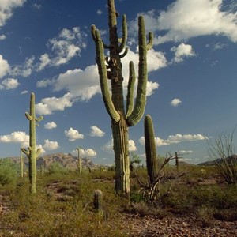
  - **IPA:** /kəˈθiːdrəl/
  - **English Definition:** A large and important church.
  - **Nghĩa trong truyện:** nhà thờ lớn, thánh đường
  - **Câu trong truyện:** The monks fed them and let them sleep in the small **cathedral**.
  - **Ví dụ:**
      - They visited the famous cathedral.
      - The cathedral has tall towers.
      - Services are held in the cathedral.
      - The old cathedral was very grand.
      - People gathered inside the cathedral.

## 7. deprive (v)
  
  - **IPA:** /dɪˈpraɪv/
  - **English Definition:** To take something important or necessary away from someone.
  - **Nghĩa trong truyện:** tước đoạt, lấy đi
  - **Câu trong truyện:** It would be wrong to **deprive** them of food and shelter.
  - **Ví dụ:**
      - Don't deprive yourself of sleep.
      - The war deprived many of their homes.
      - He was deprived of his rights.
      - The children were deprived of food.
      - Lack of sunlight deprived the plants.

## 8. drought (n)
  
  - **IPA:** /draʊt/
  - **English Definition:** A long period of time with little or no rain.
  - **Nghĩa trong truyện:** hạn hán
  - **Câu trong truyện:** It had not rained on the prairie for several months. Because of the **drought**, the climate had become very arid.
  - **Ví dụ:**
      - The drought caused crops to fail.
      - Farmers worry about the drought.
      - A severe drought hit the region.
      - The river dried up during the drought.
      - Animals suffered from the drought.

## 9. eligible (adj)
  
  - **IPA:** /ˈelɪdʒəbəl/
  - **English Definition:** Allowed to do something or receive something.
  - **Nghĩa trong truyện:** đủ điều kiện, đủ tư cách
  - **Câu trong truyện:** All here are in need, so all are **eligible** to receive our food and shelter.
  - **Ví dụ:**
      - You are eligible for a discount.
      - Only members are eligible to vote.
      - Are you eligible for the prize?
      - He is eligible for the job.
      - She is eligible for retirement.

## 10. fast (v)
  
  - **IPA:** /fæst/
  - **English Definition:** To eat no food for a period of time.
  - **Nghĩa trong truyện:** nhịn ăn
  - **Câu trong truyện:** “That might be true, but we must help them nonetheless. We will **fast**,” the abbot replied.
  - **Ví dụ:**
      - Some people fast for religious reasons.
      - He decided to fast for a day.
      - It is hard to fast when you are hungry.
      - They fast during certain holidays.
      - She will fast until noon.

## 11. grumble (v)
  
  - **IPA:** /ˈɡrʌmbəl/
  - **English Definition:** To complain in a low voice.
  - **Nghĩa trong truyện:** càu nhàu, lầm bầm
  - **Câu trong truyện:** The monks began to **grumble**.
  - **Ví dụ:**
      - He always grumbles about the weather.
      - The students grumbled about the homework.
      - She heard him grumble under his breath.
      - Don't grumble, just do the work.
      - They grumble about the long wait.

## 12. inland (adv)
  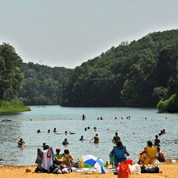
  - **IPA:** /ˈɪnlənd/
  - **English Definition:** Towards the middle of a country, away from the sea.
  - **Nghĩa trong truyện:** vào sâu trong đất liền
  - **Câu trong truyện:** So they traveled **inland**, across the prairie, to the abbey.
  - **Ví dụ:**
      - They moved inland to escape the storm.
      - The city is located far inland.
      - The river flows inland.
      - Birds fly inland during winter.
      - The road goes inland from the coast.

## 13. moisture (n)
  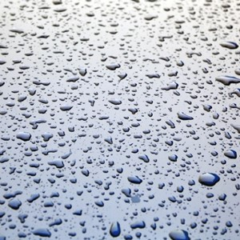
  - **IPA:** /ˈmɔɪstʃər/
  - **English Definition:** Small amounts of water in the air or on a surface.
  - **Nghĩa trong truyện:** độ ẩm, hơi ẩm
  - **Câu trong truyện:** There was no **moisture** left in the soil.
  - **Ví dụ:**
      - The air was full of moisture.
      - The plant needs moisture to grow.
      - Wipe away the moisture from the glass.
      - There was moisture on the windows.
      - The soil lacked moisture.

## 14. nonetheless (adv)
  
  - **IPA:** /ˌnʌnðəˈles/
  - **English Definition:** In spite of that; however.
  - **Nghĩa trong truyện:** tuy nhiên, dù sao đi nữa
  - **Câu trong truyện:** “That might be true, but we must help them **nonetheless**.
  - **Ví dụ:**
      - It was a hard task, but he tried nonetheless.
      - The weather was bad, nonetheless, they went out.
      - He was tired, but he continued to work nonetheless.
      - She felt nervous, but she smiled nonetheless.
      - The car was old; nonetheless, it ran well.

## 15. oath (n)
  
  - **IPA:** /oʊθ/
  - **English Definition:** A serious promise to do something.
  - **Nghĩa trong truyện:** lời thề
  - **Câu trong truyện:** We took an **oath** to help those that need help.
  - **Ví dụ:**
      - He made an oath to tell the truth.
      - The doctor took an oath to help people.
      - She broke her oath.
      - They swore an oath of loyalty.
      - He took an oath on the Bible.

## 16. prairie (n)
  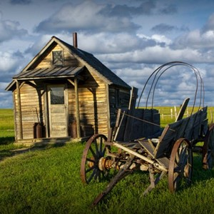
  - **IPA:** /ˈprɛəri/
  - **English Definition:** A large area of flat land with grass and few trees.
  - **Nghĩa trong truyện:** đồng cỏ, thảo nguyên
  - **Câu trong truyện:** It had not rained on the prairie for several months.
  - **Ví dụ:**
      - Wild horses run across the prairie.
      - The prairie stretched for miles.
      - They built their home on the prairie.
      - The wind blew across the open prairie.
      - The pioneers settled on the prairie.

## 17. ragged (adj)
  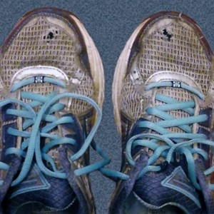
  - **IPA:** /ˈræɡɪd/
  - **English Definition:** Old and torn.
  - **Nghĩa trong truyện:** rách nát, tả tơi
  - **Câu trong truyện:** The rugged journey had made their clothes **ragged**.
  - **Ví dụ:**
      - He wore ragged clothes.
      - The old flag was ragged.
      - Her coat was ragged and thin.
      - The edges of the paper were ragged.
      - The homeless man had ragged shoes.

## 18. rugged (adj)
  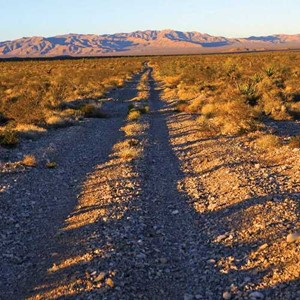
  - **IPA:** /ˈrʌɡɪd/
  - **English Definition:** Strong and difficult to travel over.
  - **Nghĩa trong truyện:** gồ ghề, hiểm trở
  - **Câu trong truyện:** The **rugged** journey had made their clothes ragged.
  - **Ví dụ:**
      - The mountain path was rugged.
      - They hiked through rugged terrain.
      - His face was rugged and strong.
      - The car is built for rugged roads.
      - It was a rugged climb to the top.

## 19. scarce (adj)
  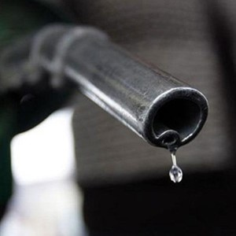
  - **IPA:** /skɛərs/
  - **English Definition:** Not enough of something; rare.
  - **Nghĩa trong truyện:** khan hiếm
  - **Câu trong truyện:** Food became **scarce**.
  - **Ví dụ:**
      - Water is scarce in the desert.
      - Good jobs are scarce.
      - Money was scarce during the war.
      - Fresh fruit is scarce in winter.
      - Fuel became scarce.

## 20. speculate (v)
  
  - **IPA:** /ˈspekjəleɪt/
  - **English Definition:** To guess about something without having all the facts.
  - **Nghĩa trong truyện:** suy đoán, phỏng đoán
  - **Câu trong truyện:** They began to **speculate** that there would be no food.
  - **Ví dụ:**
      - People speculate about his next move.
      - We can only speculate about what happened.
      - Scientists speculate about life on other planets.
      - He speculated on the outcome of the game.
      - There is no need to speculate.