# The Bachelor's Lesson

A **keen** young **bachelor** had finished his studies at the university. As soon as he had received his **diploma**, he **asserted** to everyone he met that he was the smartest person in town.

“I **excel** at everything I study,” he said, bragging about his knowledge. “I’ve mastered **calculus** and **physiology**. I even understand the great **theoretical** teachings of science, such as **relativity**. There is nothing that I don’t know. Whether it’s the movements of **celestial** objects, like planets and stars, or how to **harness** the power of **radioactive** substances, I know everything.”

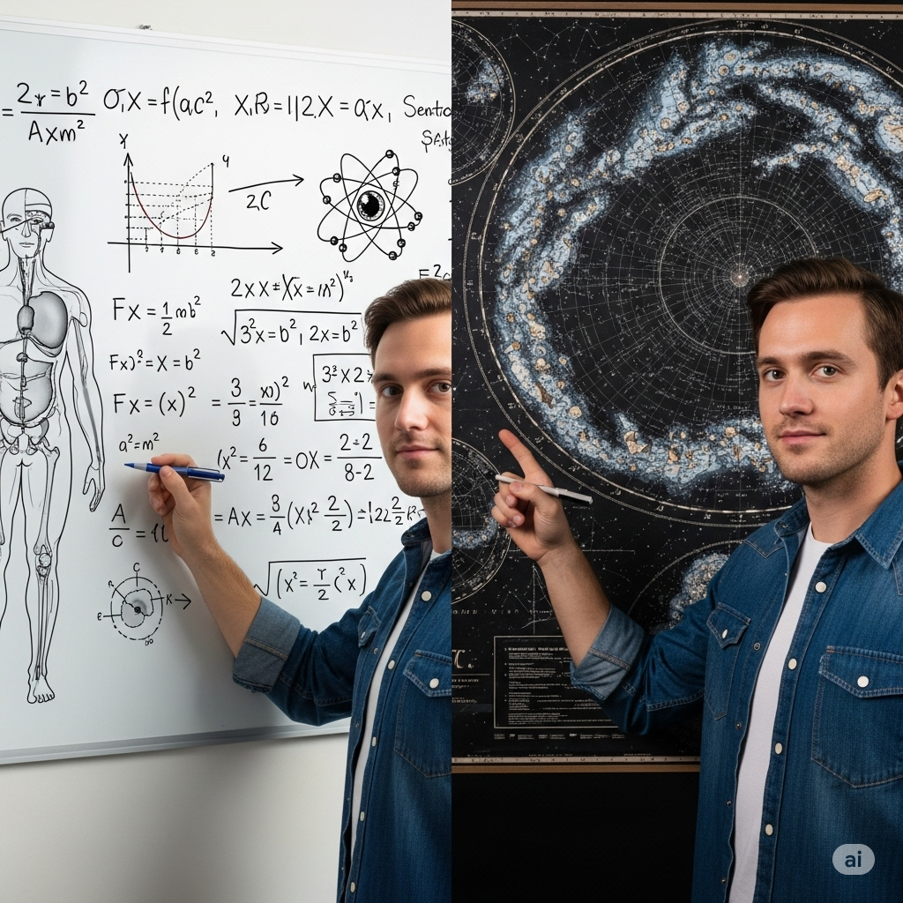

But actually, there was something the **bachelor** did not know. Though his **analytic** abilities were great, he failed to notice he was missing something very important in his life.

One day while walking through town, the **bachelor** witnessed a **collision** between two cars. Both drivers appeared to be injured, but the scholar only stood and watched.

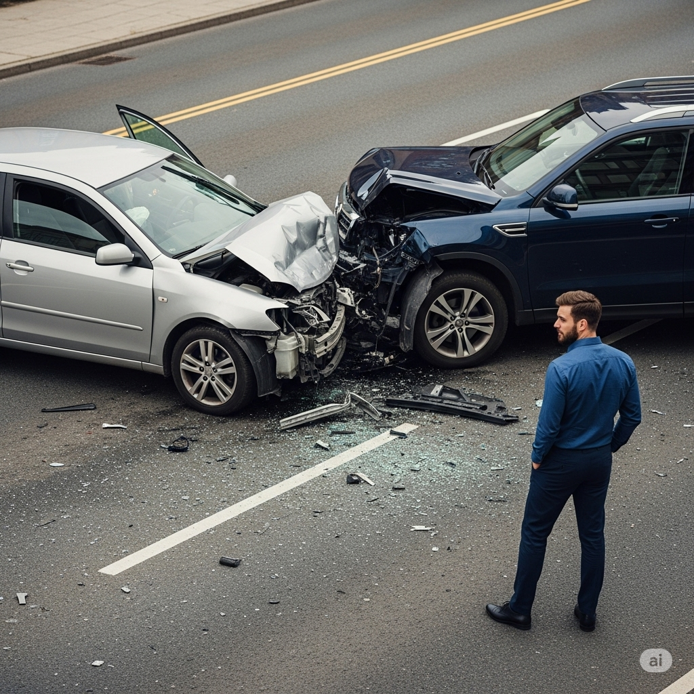

He thought to himself, “Those idiots should have been more alert. They really must not be very **competent**.” He never thought the drivers needed help.

“Please help me,” said the female driver in a weak voice. “Help me, too,” said the male driver. “I’m hurt and can’t move.”

Suddenly the **bachelor** realized he was the only person near the accident. He quit thinking and ran to help the drivers. He carefully helped them out of their vehicles and then called an ambulance.

The drivers were saved, and the **bachelor** felt the best he had in his entire life. Studying **mythology**, **sociology**, and **geology** didn’t give him this wonderful feeling. It was the act of helping others, not his **cognitive** skills, that gave him this great feeling.

He had learned an important lesson. He learned that **intellect** isn’t everything; being helpful is just as important. “Having only a brain is not enough,” he thought. “You must also have a heart.”

-------

## List of words

analytic

assert
bachelor
calculus
celestial
cognitive
collision
competent
diploma
excel
geology
harness
intellect
keen
mythology
physiology
radioactive
relativity
sociology
theoretical

## Sentences of story

A **keen** young **bachelor** had finished his studies at the university.

As soon as he had received his **diploma**, he **asserted** to everyone he met that he was the smartest person in town.

“I **excel** at everything I study,” he said, bragging about his knowledge.

“I’ve mastered **calculus** and **physiology**.

I even understand the great **theoretical** teachings of science, such as **relativity**.

There is nothing that I don’t know.

Whether it’s the movements of **celestial** objects, like planets and stars, or how to **harness** the power of 
**radioactive** substances, I know everything.”

But actually, there was something the **bachelor** did not know.

Though his **analytic** abilities were great, he failed to notice he was missing something very important in his life.

One day while walking through town, the **bachelor** witnessed a **collision** between two cars.

Both drivers appeared to be injured, but the scholar only stood and watched.

He thought to himself, “Those idiots should have been more alert.

They really must not be very **competent**.”

He never thought the drivers needed help.

“Please help me,” said the female driver in a weak voice.

“Help me, too,” said the male driver.

“I’m hurt and can’t move.”

Suddenly the **bachelor** realized he was the only person near the accident.

He quit thinking and ran to help the drivers.

He carefully helped them out of their vehicles and then called an ambulance.

The drivers were saved, and the **bachelor** felt the best he had in his entire life.

Studying **mythology**, **sociology**, and **geology** didn’t give him this wonderful feeling.

It was the act of helping others, not his **cognitive** skills, that gave him this great feeling.

He had learned an important lesson.

He learned that **intellect** isn’t everything; being helpful is just as important.

“Having only a brain is not enough,” he thought.

“You must also have a heart.”

## 1. analytic

- ipa: /ˌæn.əˈlɪt.ɪk/
- class: adj
- định nghĩa: (thuộc về) phân tích, có tính phân tích.
- english definition: relating to or using analysis or logical reasoning.
- sentence of story: Though his **analytic** abilities were great, he failed to notice he was missing something very important in his life.
- ví dụ thông dụng:
    - He has an **analytic** mind.
    - She tried to take an **analytic** approach to the problem.
    - **Analytic** skills are useful in many jobs.
    - The report provides an **analytic** review of the company's performance.
    - He is very **analytic** in the way he thinks.

## 2. assert

- ipa: /əˈsɜːrt/
- class: v
- định nghĩa: khẳng định, quả quyết một cách mạnh mẽ.
- english definition: to state a fact or belief confidently and forcefully.
- sentence of story: As soon as he had received his diploma, he **asserted** to everyone he met that he was the smartest person in town.
- ví dụ thông dụng:
    - You need to **assert** your rights.
    - She continued to **assert** that she was innocent.
    - He **asserted** his authority over the group.
    - It's important to **assert** yourself in a discussion.
    - The company **asserts** that its products are safe.

## 3. bachelor

- ipa: /ˈbætʃ.əl.ər/
- class: n
- định nghĩa: người có bằng cử nhân; người đàn ông chưa vợ. Trong truyện này, nó mang cả hai nghĩa.
- english definition: a man who is not and has never been married; a person who has completed a bachelor's degree.
- sentence of story: A keen young **bachelor** had finished his studies at the university.
- ví dụ thông dụng:
    - He is a 30-year-old **bachelor**.
    - She has a **Bachelor** of Arts degree.
    - My brother is still a **bachelor**.
    - He lived in a **bachelor** apartment.
    - The story is about a rich **bachelor**.

## 4. calculus
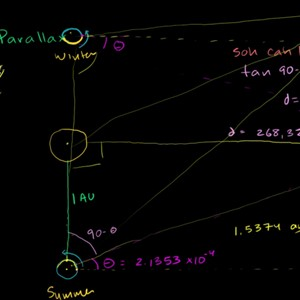
- ipa: /ˈkæl.kjə.ləs/
- class: n
- định nghĩa: giải tích, một nhánh của toán học cao cấp.
- english definition: a branch of mathematics that deals with rates of change and finding the lengths, areas, and volumes.
- sentence of story: “I’ve mastered **calculus** and physiology.”
- ví dụ thông dụng:
    - **Calculus** is a difficult subject for many students.
    - I have a **calculus** exam tomorrow.
    - She is studying **calculus** at the university.
    - Newton was one of the inventors of **calculus**.
    - You need to understand algebra before learning **calculus**.

## 5. celestial

- ipa: /səˈles.tʃəl/
- class: adj
- định nghĩa: thuộc về bầu trời hoặc không gian; thiên thể.
- english definition: of or relating to the sky, or outer space as observed in astronomy.
- sentence of story: Whether it’s the movements of **celestial** objects, like planets and stars, or how to harness the power of radioactive substances, I know everything.
- ví dụ thông dụng:
    - The sun, moon, and stars are **celestial** bodies.
    - Astronomers study **celestial** objects.
    - He was interested in **celestial** navigation.
    - The painting had a beautiful **celestial** background.
    - A telescope helps us see **celestial** events.

## 6. cognitive

- ipa: /ˈkɒɡ.nə.tɪv/
- class: adj
- định nghĩa: thuộc về nhận thức, liên quan đến quá trình suy nghĩ và hiểu biết.
- english definition: connected with thinking or conscious mental processes.
- sentence of story: It was the act of helping others, not his **cognitive** skills, that gave him this great feeling.
- ví dụ thông dụng:
    - As we get older, our **cognitive** abilities decline.
    - The study is about children's **cognitive** development.
    - Puzzles can improve your **cognitive** skills.
    - He has some **cognitive** problems after the accident.
    - **Cognitive** science studies how the mind works.

## 7. collision
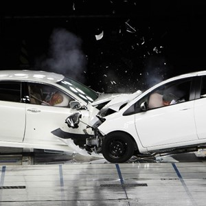
- ipa: /kəˈlɪʒ.ən/
- class: n
- định nghĩa: vụ va chạm, sự đụng nhau.
- english definition: an instance of one moving object or person striking violently against another.
- sentence of story: One day while walking through town, the bachelor witnessed a **collision** between two cars.
- ví dụ thông dụng:
    - There was a serious **collision** on the highway.
    - He was injured in a car **collision**.
    - The two players avoided a **collision**.
    - The ship changed course to prevent a **collision**.
    - A **collision** of ideas can lead to new solutions.

## 8. competent

- ipa: /ˈkɒm.pɪ.tənt/
- class: adj
- định nghĩa: có đủ năng lực, giỏi, thành thạo.
- english definition: having the necessary ability, knowledge, or skill to do something successfully.
- sentence of story: They really must not be very **competent**.
- ví dụ thông dụng:
    - We need a **competent** person for this job.
    - She is a highly **competent** doctor.
    - I want to prove that I am **competent**.
    - He is not **competent** to make that decision.
    - The mechanic was very friendly and **competent**.

## 9. diploma

- ipa: /dɪˈpləʊ.mə/
- class: n
- định nghĩa: bằng cấp, văn bằng.
- english definition: a certificate awarded by an educational establishment to show that someone has successfully completed a course of study.
- sentence of story: As soon as he had received his **diploma**, he asserted to everyone he met that he was the smartest person in town.
- ví dụ thông dụng:
    - She earned her high school **diploma** last year.
    - He is studying for a **diploma** in business.
    - You need a **diploma** to apply for this job.
    - He proudly hung his **diploma** on the wall.
    - A **diploma** is an important document.

## 10. excel

- ipa: /ɪkˈsel/
- class: v
- định nghĩa: xuất sắc, trội hơn.
- english definition: to be exceptionally good at or proficient in an activity or subject.
- sentence of story: “I **excel** at everything I study,” he said, bragging about his knowledge.
- ví dụ thông dụng:
    - She always wanted to **excel** in her studies.
    - He hopes to **excel** as a football player.
    - They **excel** at making customers feel welcome.
    - He is a student who **excels** in science.
    - To **excel**, you must practice every day.

## 11. geology
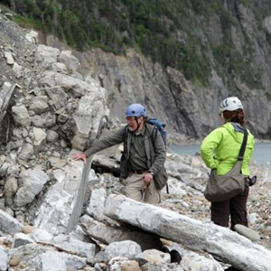
- ipa: /dʒiˈɒl.ə.dʒi/
- class: n
- định nghĩa: địa chất học.
- english definition: the science that deals with the earth's physical structure and substance, its history, and the processes which act on it.
- sentence of story: Studying mythology, sociology, and **geology** didn’t give him this wonderful feeling.
- ví dụ thông dụng:
    - He is studying **geology** at the university.
    - **Geology** helps us understand how mountains are formed.
    - My professor has a degree in **geology**.
    - This area has a very interesting **geology**.
    - I bought a book about the **geology** of our country.

## 12. harness

- ipa: /ˈhɑː.nəs/
- class: v
- định nghĩa: khai thác và kiểm soát (một nguồn tài nguyên) để tạo ra năng lượng.
- english definition: to control and make use of (natural resources), especially to produce energy.
- sentence of story: Whether it’s the movements of celestial objects, like planets and stars, or how to **harness** the power of radioactive substances, I know everything.
- ví dụ thông dụng:
    - We need to **harness** the power of the sun and wind.
    - Scientists are trying to **harness** nuclear energy safely.
    - They know how to **harness** the river's energy to make electricity.
    - It's important to **harness** technology for education.
    - She tried to **harness** her creative energy.

## 13. intellect

- ipa: /ˈɪn.təl.ekt/
- class: n
- định nghĩa: trí tuệ, khả năng suy nghĩ và hiểu biết ở mức độ cao.
- english definition: the faculty of reasoning and understanding objectively, especially with regard to abstract matters.
- sentence of story: He learned that **intellect** isn’t everything; being helpful is just as important.
- ví dụ thông dụng:
    - He is a man of great **intellect**.
    - She is known for her powerful **intellect**.
    - The book is challenging to the **intellect**.
    - A good education develops a child's **intellect**.
    - He relies on his **intellect**, not his emotions.

## 14. keen
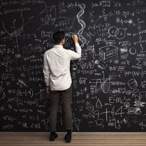
- ipa: /kiːn/
- class: adj
- định nghĩa: sắc sảo, ham học hỏi, nhiệt tình.
- english definition: having or showing eagerness or enthusiasm.
- sentence of story: A **keen** young bachelor had finished his studies at the university.
- ví dụ thông dụng:
    - He is a **keen** student.
    - She has a **keen** interest in music.
    - They were **keen** to start the project.
    - My dog has a **keen** sense of smell.
    - I am not very **keen** on that idea.

## 15. mythology
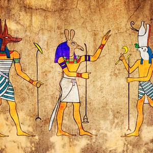
- ipa: /mɪˈθɒl.ə.dʒi/
- class: n
- định nghĩa: thần thoại học, các câu chuyện thần thoại.
- english definition: a collection of myths, especially one belonging to a particular religious or cultural tradition.
- sentence of story: Studying **mythology**, sociology, and geology didn’t give him this wonderful feeling.
- ví dụ thông dụng:
    - He is interested in Greek **mythology**.
    - The book is about the heroes of Roman **mythology**.
    - Every culture has its own **mythology**.
    - I am taking a course on world **mythology**.
    - Dragons are common creatures in **mythology**.

## 16. physiology

- ipa: /ˌfɪz.iˈɒl.ə.dʒi/
- class: n
- định nghĩa: sinh lý học, môn khoa học nghiên cứu chức năng của các sinh vật sống.
- english definition: the branch of biology that deals with the normal functions of living organisms and their parts.
- sentence of story: “I’ve mastered calculus and **physiology**.”
- ví dụ thông dụng:
    - She is a professor of **physiology**.
    - He is studying human **physiology** to become a doctor.
    - This class will cover basic animal **physiology**.
    - Understanding **physiology** is important for athletes.
    - I find plant **physiology** very interesting.

## 17. radioactive
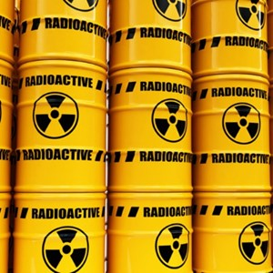
- ipa: /ˌreɪ.di.əʊˈæk.tɪv/
- class: adj
- định nghĩa: có tính phóng xạ, phát ra năng lượng có hại.
- english definition: emitting or relating to the emission of ionizing radiation or particles.
- sentence of story: Whether it’s the movements of celestial objects, like planets and stars, or how to harness the power of **radioactive** substances, I know everything.
- ví dụ thông dụng:
    - **Radioactive** materials can be very dangerous.
    - The area was closed due to **radioactive** waste.
    - Uranium is a **radioactive** element.
    - Scientists must be careful when working with **radioactive** substances.
    - A special suit protects you from **radioactive** particles.

## 18. relativity
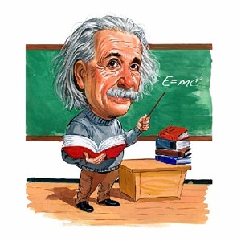
- ipa: /ˌrel.əˈtɪv.ə.ti/
- class: n
- định nghĩa: thuyết tương đối (một học thuyết của Einstein).
- english definition: a theory, formulated essentially by Albert Einstein, that all motion must be defined relative to a frame of reference and that space and time are relative.
- sentence of story: I even understand the great theoretical teachings of science, such as **relativity**.
- ví dụ thông dụng:
    - Einstein's theory of **relativity** is famous.
    - The professor explained the concept of general **relativity**.
    - **Relativity** changed how we understand space and time.
    - Very few people truly understand **relativity**.
    - I read a simple book about the theory of **relativity**.

## 19. sociology
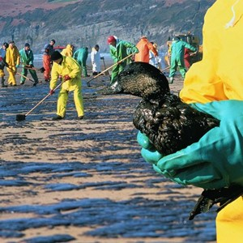
- ipa: /ˌsəʊ.siˈɒl.ə.dʒi/
- class: n
- định nghĩa: xã hội học, môn khoa học nghiên cứu về xã hội và hành vi của con người.
- english definition: the study of the development, structure, and functioning of human society.
- sentence of story: Studying mythology, **sociology**, and geology didn’t give him this wonderful feeling.
- ví dụ thông dụng:
    - She has a degree in **sociology**.
    - **Sociology** helps us understand social problems.
    - I am taking a **sociology** class this year.
    - He is a professor of **sociology** at the university.
    - This book discusses the **sociology** of modern life.

## 20. theoretical
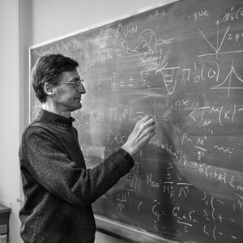
- ipa: /ˌθɪəˈret.ɪ.kəl/
- class: adj
- định nghĩa: (thuộc về) lý thuyết, không dựa trên kinh nghiệm thực tế.
- english definition: concerned with or involving the theory of a subject or area of study rather than its practical application.
- sentence of story: I even understand the great **theoretical** teachings of science, such as relativity.
- ví dụ thông dụng:
    - The first part of the course is **theoretical**.
    - He has a **theoretical** understanding of the job, but no experience.
    - This is a **theoretical** problem, not a real one.
    - She is a **theoretical** physicist.
    - His ideas are purely **theoretical**.