# The Corrupt Administrator

Mr. Pig was an **administrator** at a big factory that made different kinds of **merchandise**. During a meeting at the company’s **headquarters**, his bosses said they wanted the factory to make more money.

“If the factory makes more money, then you will too,” his boss, Mr. Horse, told him. It was a great **incentive**. Pig had always wanted to be as **affluent** as his bosses.

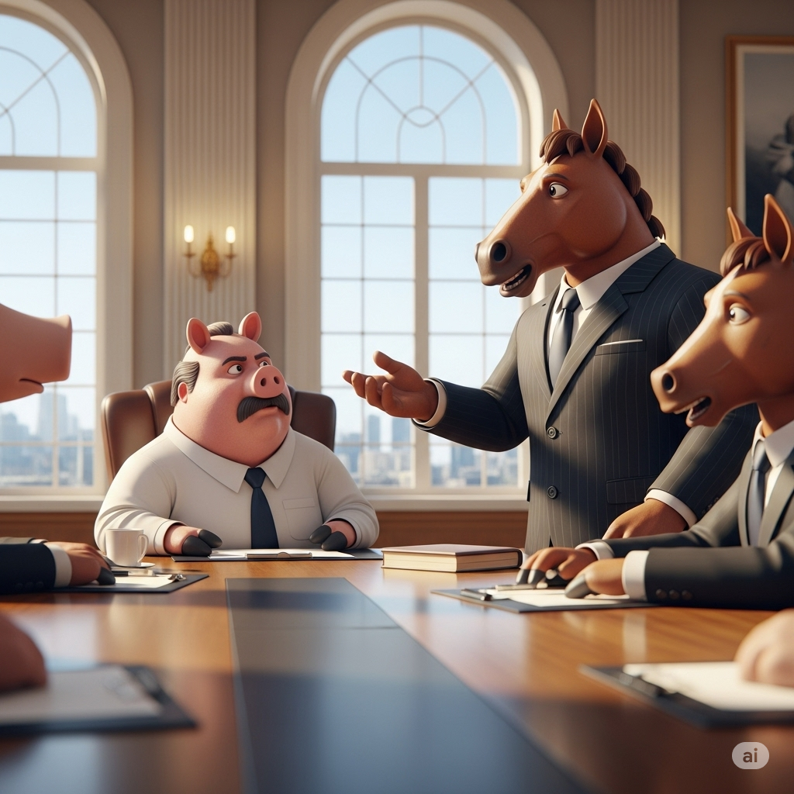
Mr. Pig returned to the factory and started making changes. However, most were not very nice, and some were not **legitimate**.

First, he fired all his employees. Then he **automated** the entire factory. Machines now made everything, and the other animals, Mr. Rabbit, Mr. Sheep, and Mr. Dog had no jobs. Next, he **bribed** some **corrupt** senators into **legislating** special **subsidies** for the factory. Finally, instead of paying a company to **dispose** of the factory’s **rubbish** properly, he **violated** the law by throwing it into the river to save money.

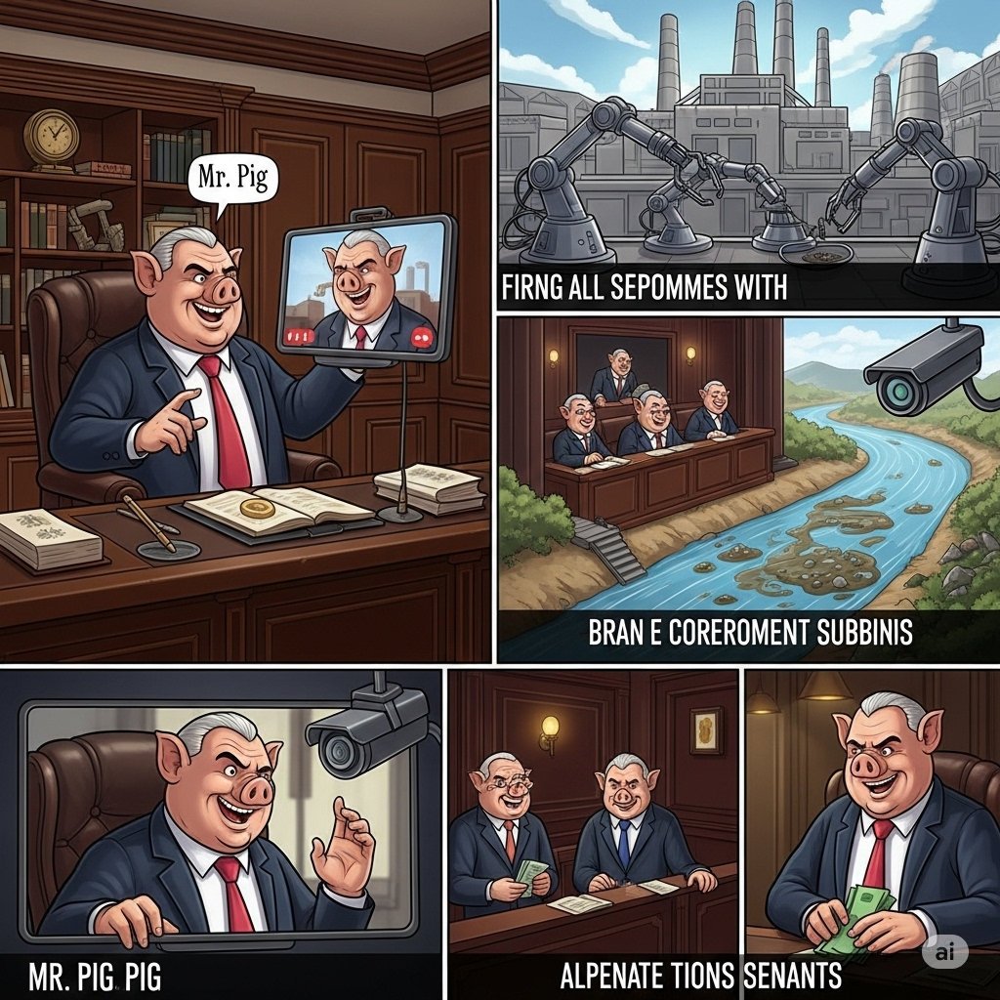

At first, all the changes to the factory’s **infrastructure** created more **revenue**. But soon many stores could no longer sell the factory’s goods at **retail**. It seemed that the machines couldn’t make products as well as the workers. The customers were disappointed with the factory’s **merchandise**.

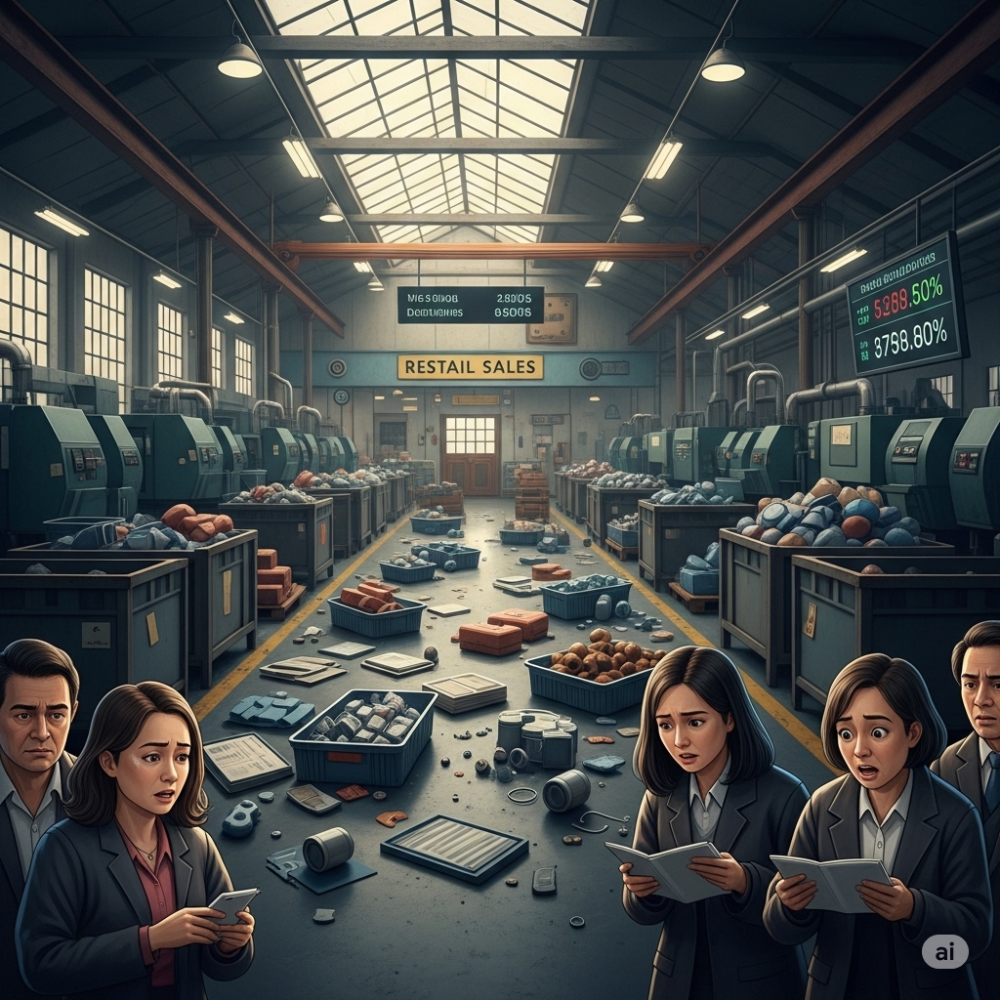

There were other problems, too. The animals had told their friends and family to stop buying the factory’s goods. Officials discovered the factory’s **rubbish** in the river, and when they **audited** the company, they discovered that Pig had **manipulated** the law in order to get more money.

All **transactions** with Pig’s factory stopped. The factory lost money, and Pig lost his job. He realized his mistakes too late. He had tried to become rich by saving money any way possible, but the cheapest way was not always the best.

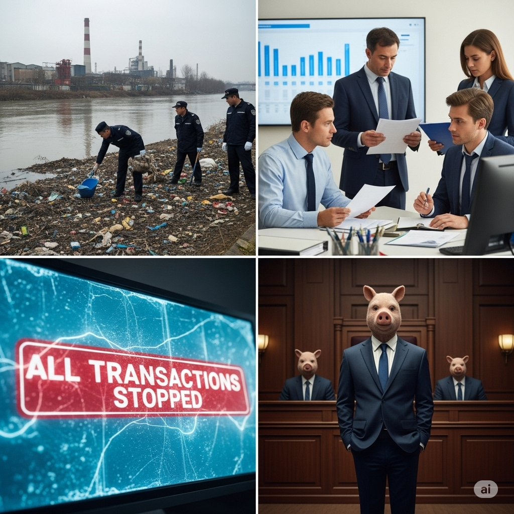

----

## List of words

administrator

merchandise
headquarters
incentive
affluent
legitimate
automated
bribed
corrupt
legislating
subsidies
dispose
rubbish
violated
infrastructure
revenue
retail
audited
manipulated
transactions

----

## Sentences of story

Mr. Pig was an **administrator** at a big factory that made different kinds of **merchandise**.

During a meeting at the company’s **headquarters**, his bosses said they wanted the factory to make more money.

“If the factory makes more money, then you will too,” his boss, Mr. Horse, told him.

It was a great **incentive**.

Pig had always wanted to be as **affluent** as his bosses.

Mr. Pig returned to the factory and started making changes.

However, most were not very nice, and some were not **legitimate**.

First, he fired all his employees.

Then he **automated** the entire factory.

Machines now made everything, and the other animals, Mr. Rabbit, Mr. Sheep, and Mr. Dog had no jobs.

Next, he **bribed** some **corrupt** senators into **legislating** special **subsidies** for the factory.

Finally, instead of paying a company to **dispose** of the factory’s **rubbish** properly, he **violated** the 
law by throwing it into the river to save money.

At first, all the changes to the factory’s **infrastructure** created more **revenue**.

But soon many stores could no longer sell the factory’s goods at **retail**.

It seemed that the machines couldn’t make products as well as the workers.

The customers were disappointed with the factory’s **merchandise**.

There were other problems, too.

The animals had told their friends and family to stop buying the factory’s goods.

Officials discovered the factory’s **rubbish** in the river, and when they **audited** the company, they 
discovered that Pig had **manipulated** the law in order to get more money.

All **transactions** with Pig’s factory stopped.

The factory lost money, and Pig lost his job.

He realized his mistakes too late.

He had tried to become rich by saving money any way possible, but the cheapest way was not always the best.

## 1. administrator

- ipa: /ədˈmɪn.ɪ.streɪ.tər/
- class: n
- định nghĩa: người quản lý, người quản trị.
- english definition: a person responsible for running a business, organization, or institution.
- sentence of story: Mr. Pig was an **administrator** at a big factory that made different kinds of merchandise.
- ví dụ thông dụng:
  - She works as a school **administrator**.
  - The network **administrator** is responsible for the computer system.
  - You should speak to the hospital **administrator**.
  - He is a very efficient **administrator**.
  - The job of an **administrator** involves a lot of paperwork.

## 2. merchandise

- ipa: /ˈmɜː.tʃən.daɪs/
- class: n
- định nghĩa: hàng hóa (để mua và bán).
- english definition: goods that are bought and sold.
- sentence of story: Mr. Pig was an administrator at a big factory that made different kinds of **merchandise**.
- ví dụ thông dụng:
  - The store sells a variety of **merchandise**.
  - All **merchandise** must be paid for before you leave.
  - They sell official team **merchandise** like shirts and hats.
  - The quality of the **merchandise** was very poor.
  - You can return damaged **merchandise** within 10 days.

## 3. headquarters

- ipa: /ˌhedˈkwɔː.təz/
- class: n
- định nghĩa: trụ sở chính.
- english definition: the main offices of an organization such as the army, the police, or a business company.
- sentence of story: During a meeting at the company’s **headquarters**, his bosses said they wanted the factory to make more money.
- ví dụ thông dụng:
  - The company's **headquarters** is in New York.
  - I have a meeting at **headquarters** tomorrow.
  - Police **headquarters** issued a statement.
  - He was transferred to the **headquarters** in London.
  - The army's **headquarters** is located outside the city.

## 4. incentive
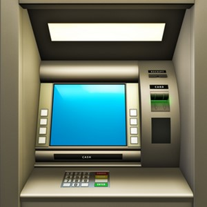
- ipa: /ɪnˈsen.tɪv/
- class: n
- định nghĩa: sự khích lệ, sự khuyến khích.
- english definition: something that encourages a person to do something.
- sentence of story: It was a great **incentive**.
- ví dụ thông dụng:
  - The company offers a sales **incentive** to its employees.
  - Money is a powerful **incentive**.
  - There is little **incentive** for people to save fuel.
  - Tax **incentives** are used to encourage investment.
  - A bonus is a good **incentive** to work harder.

## 5. affluent
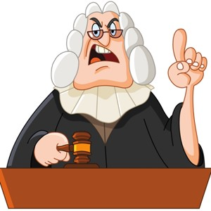
- ipa: /ˈæf.lu.ənt/
- class: adj
- định nghĩa: giàu có, sung túc.
- english definition: having a lot of money or owning a lot of things; rich.
- sentence of story: Pig had always wanted to be as **affluent** as his bosses.
- ví dụ thông dụng:
  - They live in an **affluent** neighborhood.
  - He was born into an **affluent** family.
  - This is one of the most **affluent** areas of the country.
  - Only **affluent** people can afford to live here.
  - The store targets **affluent** customers.

## 6. legitimate

- ipa: /ləˈdʒɪt.ə.mət/
- class: adj
- định nghĩa: hợp pháp, chính đáng.
- english definition: conforming to the law or to rules.
- sentence of story: However, most were not very nice, and some were not **legitimate**.
- ví dụ thông dụng:
  - He has a **legitimate** claim to the property.
  - That's a **legitimate** question.
  - The army is a **legitimate** target in a war.
  - You need a **legitimate** reason for being absent.
  - Is this a **legitimate** business?

## 7. automated
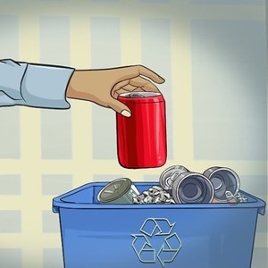
- ipa: /ˈɔː.tə.meɪ.tɪd/
- class: v (past tense of automate) / adj
- định nghĩa: (đã) tự động hóa.
- english definition: to make a process in a factory or office operate by machines or computers, in order to reduce the amount of work done by humans.
- sentence of story: Then he **automated** the entire factory.
- ví dụ thông dụng:
  - The factory is fully **automated**.
  - We use an **automated** system for our calls.
  - Many jobs have been **automated** in the last ten years.
  - They have **automated** the ticket-buying process.
  - She received an **automated** email response.

## 8. bribed

- ipa: /braɪbd/
- class: v (past tense of bribe)
- định nghĩa: (đã) hối lộ, đút lót.
- english definition: to try to make someone do something for you by giving them money, presents, or something else that they want.
- sentence of story: Next, he **bribed** some corrupt senators into legislating special subsidies for the factory.
- ví dụ thông dụng:
  - He **bribed** the official to get the contract.
  - She was accused of having **bribed** a witness.
  - They **bribed** him with a new car.
  - It is illegal to have **bribed** a police officer.
  - The judge was **bribed** to give a lighter sentence.

## 9. corrupt

- ipa: /kəˈrʌpt/
- class: adj
- định nghĩa: tham nhũng, đồi bại.
- english definition: dishonestly using your position or power to get an advantage, especially for money.
- sentence of story: Next, he bribed some **corrupt** senators into legislating special subsidies for the factory.
- ví dụ thông dụng:
  - He is a **corrupt** politician.
  - The whole system is **corrupt**.
  - People believe the government is **corrupt**.
  - The file on my computer is **corrupt**.
  - Power can make people **corrupt**.

## 10. legislating
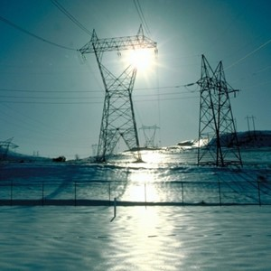
- ipa: /ˈledʒ.ɪs.leɪ.tɪŋ/
- class: v (present participle of legislate)
- định nghĩa: lập pháp, làm luật.
- english definition: to make or enact laws.
- sentence of story: Next, he bribed some corrupt senators into **legislating** special subsidies for the factory.
- ví dụ thông dụng:
  - The government is **legislating** against tax increases.
  - **Legislating** new rules takes time.
  - They are responsible for **legislating** on these matters.
  - Parliament spent the week **legislating**.
  - It is difficult to start **legislating** for every small problem.

## 11. subsidies
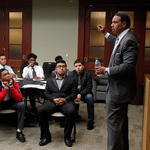
- ipa: /ˈsʌb.sɪ.diz/
- class: n (plural)
- định nghĩa: tiền trợ cấp.
- english definition: money given as part of the cost of something, to help or encourage it to happen.
- sentence of story: Next, he bribed some corrupt senators into legislating special **subsidies** for the factory.
- ví dụ thông dụng:
  - The government gives **subsidies** to farmers.
  - The company received large **subsidies**.
  - They are cutting **subsidies** for fuel.
  - Housing **subsidies** help low-income families.
  - The art festival relies on **subsidies**.

## 12. dispose

- ipa: /dɪˈspəʊz/
- class: v
- định nghĩa: vứt bỏ, xử lý (rác).
- english definition: to get rid of something, especially by throwing it away. (Usually followed by 'of')
- sentence of story: Finally, instead of paying a company to **dispose** of the factory’s rubbish properly, he violated the law by throwing it into the river to save money.
- ví dụ thông dụng:
  - How do you **dispose** of old batteries?
  - You must **dispose** of the waste carefully.
  - He wanted to **dispose** of the old car.
  - Please **dispose** of your trash in the bin.
  - The company was fined for failing to **dispose** of the chemicals.

## 13. rubbish

- ipa: /ˈrʌb.ɪʃ/
- class: n
- định nghĩa: rác, đồ bỏ đi.
- english definition: waste material or things that are no longer wanted or needed.
- sentence of story: Finally, instead of paying a company to dispose of the factory’s **rubbish** properly, he violated the law by throwing it into the river to save money.
- ví dụ thông dụng:
  - Please put your **rubbish** in the bin.
  - The street is full of **rubbish**.
  - The **rubbish** is collected on Mondays.
  - Don't talk **rubbish**! (This means 'Don't talk nonsense!')
  - I need to take out the **rubbish**.

## 14. violated
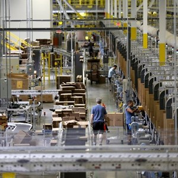
- ipa: /ˈvaɪ.ə.leɪ.tɪd/
- class: v (past tense of violate)
- định nghĩa: (đã) vi phạm, xâm phạm.
- english definition: to break or act against something, especially a law, agreement, or principle.
- sentence of story: Finally, instead of paying a company to dispose of the factory’s rubbish properly, he **violated** the law by throwing it into the river to save money.
- ví dụ thông dụng:
  - He **violated** the terms of the contract.
  - The company **violated** safety regulations.
  - She **violated** my trust.
  - They **violated** the rules of the game.
  - The army **violated** the country's border.

## 15. infrastructure

- ipa: /ˈɪn.frəˌstrʌk.tʃər/
- class: n
- định nghĩa: cơ sở hạ tầng.
- english definition: the basic systems and services, such as transport and power supplies, that a country or organization uses in order to work effectively.
- sentence of story: At first, all the changes to the factory’s **infrastructure** created more revenue.
- ví dụ thông dụng:
  - The country needs to invest in its **infrastructure**.
  - A good transport **infrastructure** is very important.
  - The war damaged the city's **infrastructure**.
  - We are upgrading our company's IT **infrastructure**.
  - More money is needed for roads, bridges, and other **infrastructure**.

## 16. revenue

- ipa: /ˈrev.ən.juː/
- class: n
- định nghĩa: doanh thu.
- english definition: the income that a government or company receives regularly.
- sentence of story: At first, all the changes to the factory’s infrastructure created more **revenue**.
- ví dụ thông dụng:
  - The company's **revenue** grew by 10% last year.
  - The government gets **revenue** from taxes.
  - We need to find new sources of **revenue**.
  - Advertising is a major source of **revenue** for the newspaper.
  - Their annual **revenue** is over $1 million.

## 17. retail
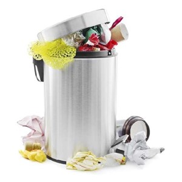
- ipa: /ˈriː.teɪl/
- class: n
- định nghĩa: bán lẻ.
- english definition: the activity of selling goods to the public, usually in small quantities, for their own use.
- sentence of story: But soon many stores could no longer sell the factory’s goods at **retail**.
- ví dụ thông dụng:
  - She works in **retail**.
  - The **retail** price of this shirt is $20.
  - The store is a major **retail** chain.
  - He has over 10 years of experience in the **retail** sector.
  - **Retail** sales went up during the holidays.

## 18. audited

- ipa: /ˈɔː.dɪtɪd/
- class: v (past tense of audit)
- định nghĩa: (đã) kiểm toán.
- english definition: to make an official examination of the accounts of a business and produce a report.
- sentence of story: ...and when they **audited** the company, they discovered that Pig had manipulated the law in order to get more money.
- ví dụ thông dụng:
  - The company is **audited** every year.
  - An independent firm **audited** our accounts.
  - The government **audited** the program's spending.
  - After they **audited** the books, they found many errors.
  - All departments will be **audited**.

## 19. manipulated

- ipa: /məˈnɪp.jə.leɪ.tɪd/
- class: v (past tense of manipulate)
- định nghĩa: (đã) thao túng, lôi kéo.
- english definition: to control something or someone to your advantage, often unfairly or dishonestly.
- sentence of story: ...and when they audited the company, they discovered that Pig had **manipulated** the law in order to get more money.
- ví dụ thông dụng:
  - He **manipulated** his friends to get what he wanted.
  - The media can be used to **manipulate** public opinion.
  - She felt that her boss had **manipulated** her.
  - The company was accused of having **manipulated** its accounts.
  - He knows how to **manipulate** people.

## 20. transactions
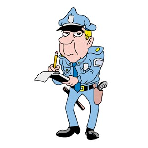
- ipa: /trænˈzæk.ʃənz/
- class: n (plural)
- định nghĩa: các giao dịch.
- english definition: an occasion when someone buys or sells something, or when money is exchanged.
- sentence of story: All **transactions** with Pig’s factory stopped.
- ví dụ thông dụng:
  - All credit card **transactions** are protected.
  - The bank handles thousands of **transactions** every day.
  - We need a record of all financial **transactions**.
  - The police are investigating some suspicious **transactions**.
  - Online **transactions** are very common now.