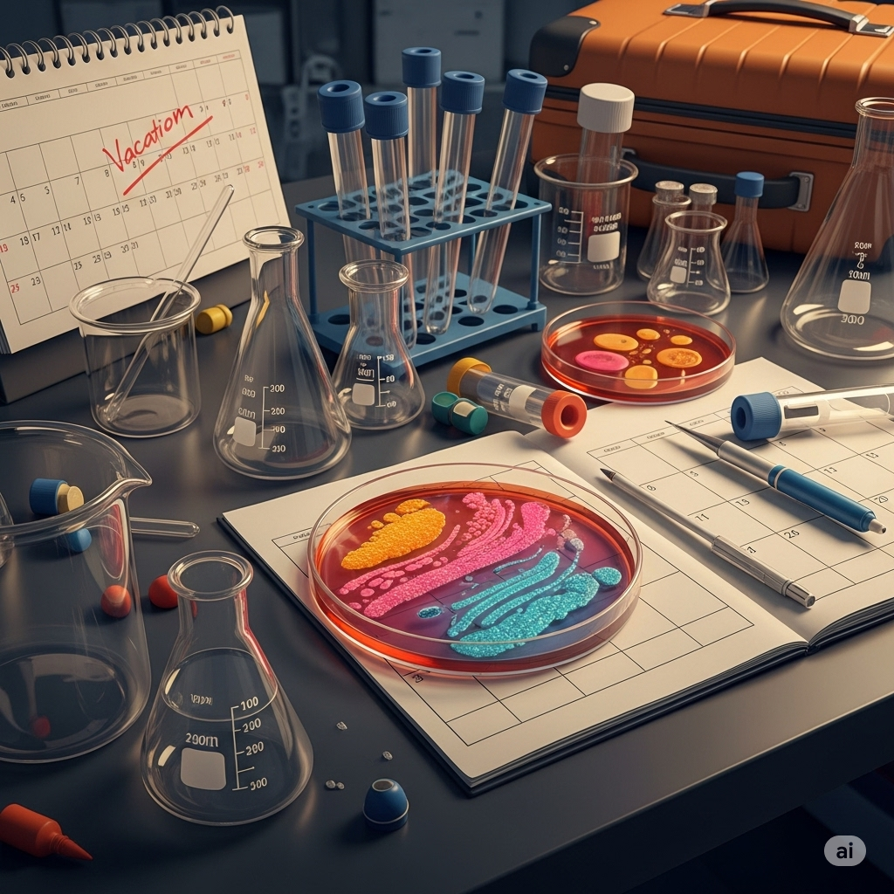
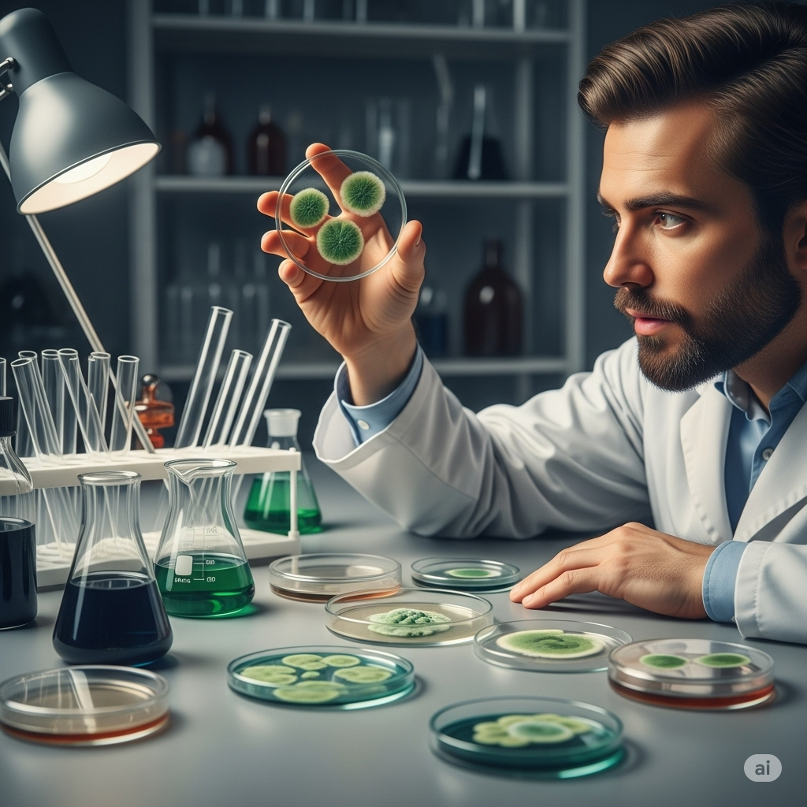
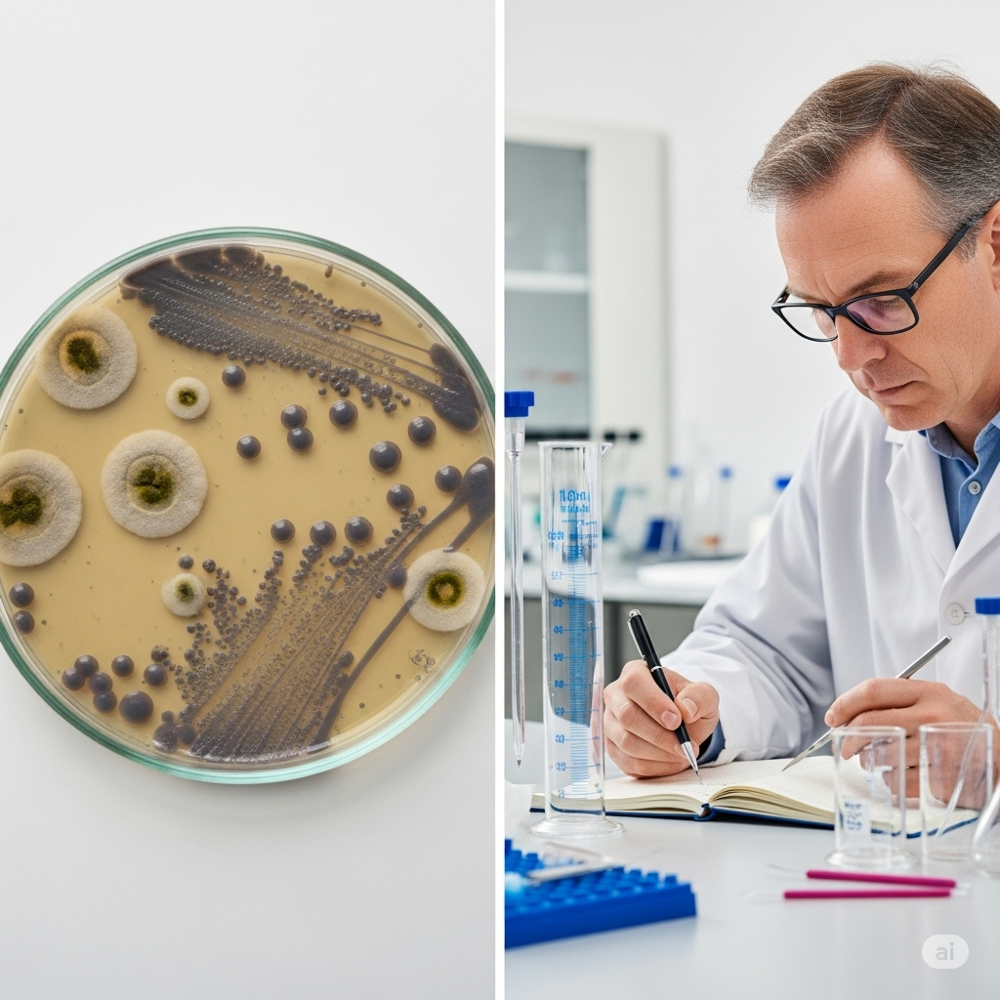
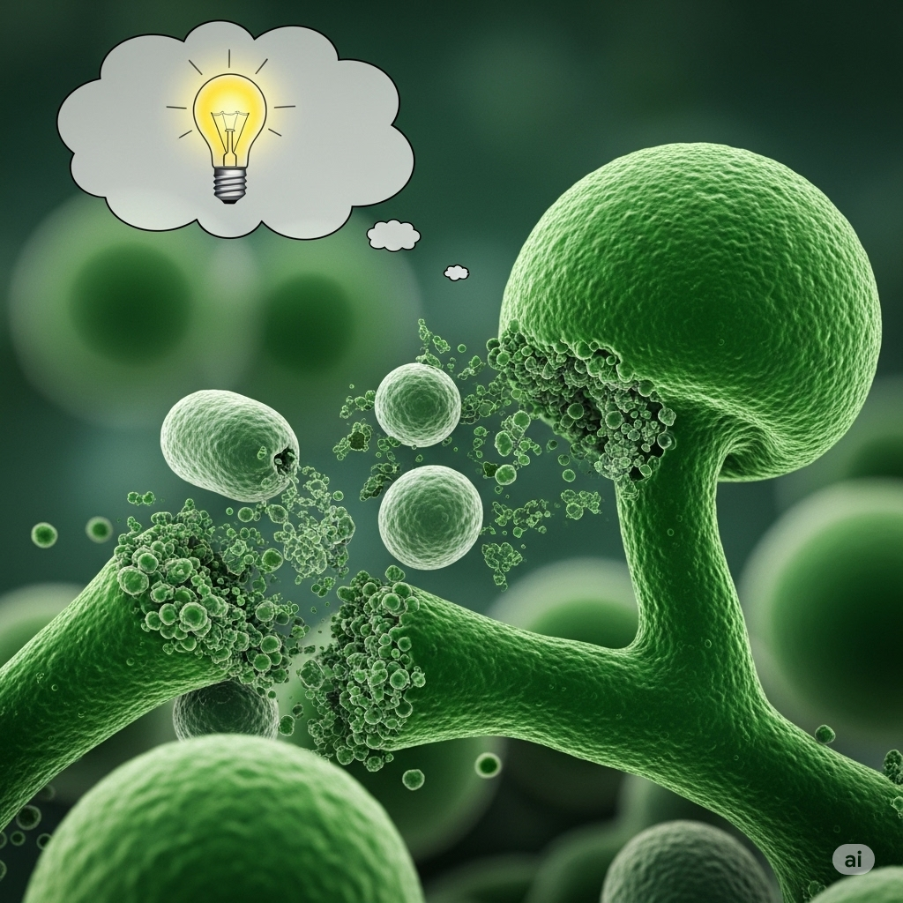
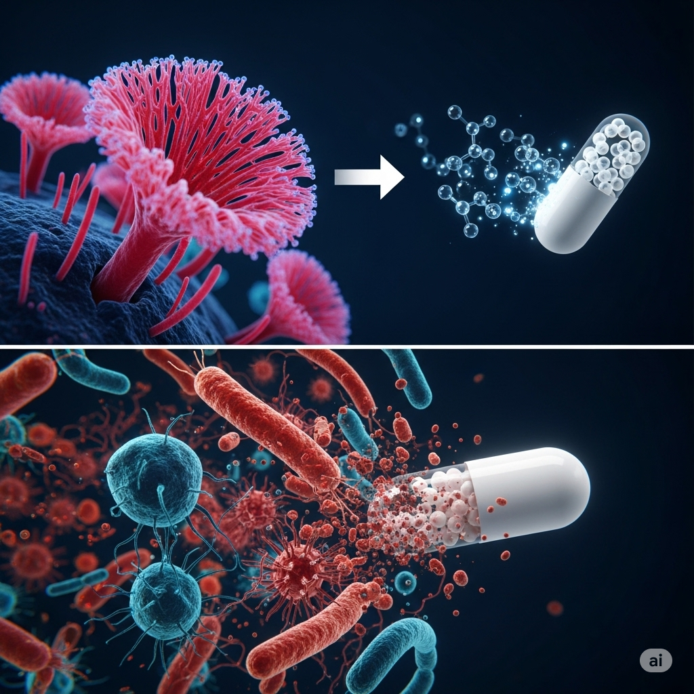
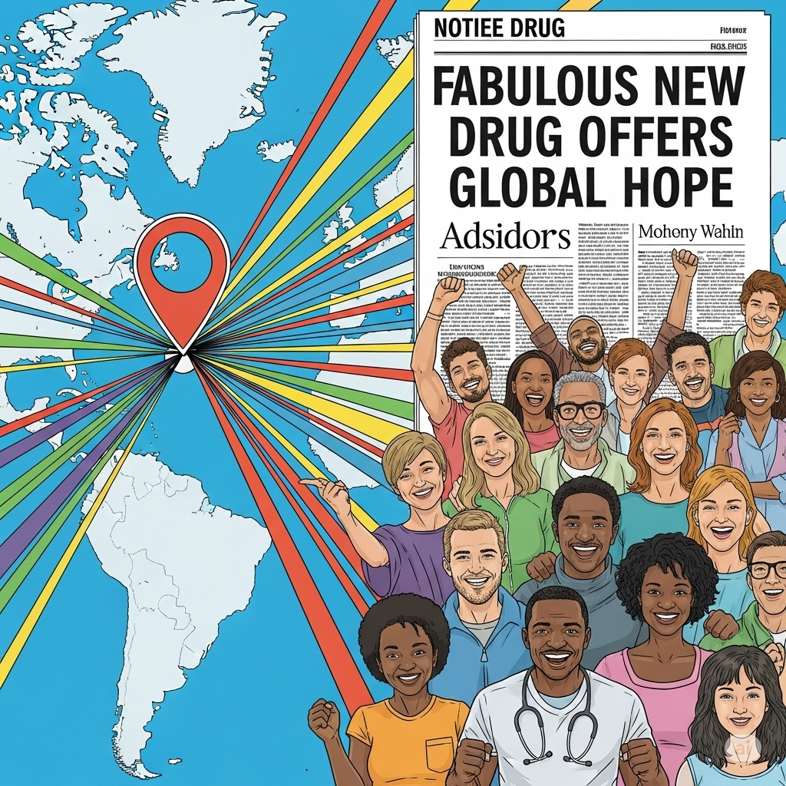
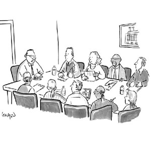
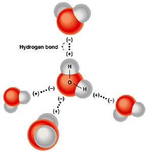
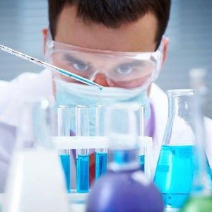
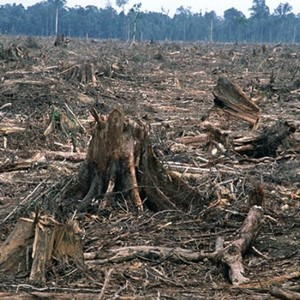

# A Famous Accident

One of the greatest **pharmaceutical** discoveries happened by accident. In his **haste** to go on vacation, Alexander Fleming had left his laboratory in a mess. The **essence** of his **ongoing** work involved a type of bacteria. An infection caused by the bacteria was often **terminal**, and he was looking for a **remedy**. He had left the bacteria out while he was away.

When he returned from vacation, he found that his lab was covered in fungus. He started cleaning up the mess. While he was cleaning, he had an **impulse** to examine the fungus. He saw that whenever the fungus was in close **proximity** to the bacteria, the bacteria died.

Though he was a messy scientist, his experiments were **precise**. He thought that there might be some **significance** to the fungus. He immediately **commenced** an experiment to **assess** what had happened to the bacteria. It had either died by accident or the fungus had killed it. The **subsequent** tests proved it was the **latter** reason.

What he found **astonished** him. The fungus actually killed the bad bacteria. All this time, he had been looking for a **synthetic** material to kill the bacteria. Instead, a common fungus did the job.

He knew that something in the fungus had killed the bacteria. His next step was to find those **molecules** that had done it. When he found them, he **extracted** them and put them into a pill. The drug proved to be very effective. It also worked against other types of harmful bacteria.

The discovery received a lot of **publicity**. Soon after, the new drug was being used all over the world. Because of the success, the scientist was able to develop even more **fabulous** drugs to help people. His accidental discovery changed the world and helped save many people’s lives.

## Sentences of story

A Famous Accident

One of the greatest **pharmaceutical** discoveries happened by accident.

In his **haste** to go on vacation, Alexander Fleming had left his laboratory in a mess.

The **essence** of his **ongoing** work involved a type of bacteria.

An infection caused by the bacteria was often **terminal**, and he was looking for a **remedy**.

He had left the bacteria out while he was away.

When he returned from vacation, he found that his lab was covered in fungus.

He started cleaning up the mess.

While he was cleaning, he had an **impulse** to examine the fungus.

He saw that whenever the fungus was in close **proximity** to the bacteria, the bacteria died.

Though he was a messy scientist, his experiments were **precise**.

He thought that there might be some **significance** to the fungus.

He immediately **commenced** an experiment to **assess** what had happened to the bacteria.

It had either died by accident or the fungus had killed it.

The **subsequent** tests proved it was the **latter** reason.

What he found **astonished** him.

The fungus actually killed the bad bacteria.

All this time, he had been looking for a **synthetic** material to kill the bacteria.

Instead, a common fungus did the job.

He knew that something in the fungus had killed the bacteria.

His next step was to find those **molecules** that had done it.

When he found them, he **extracted** them and put them into a pill.

The drug proved to be very effective.

It also worked against other types of harmful bacteria.

The discovery received a lot of **publicity**.

Soon after, the new drug was being used all over the world.

Because of the success, the scientist was able to develop even more **fabulous** drugs to help people.

His accidental discovery changed the world and helped save many people’s lives.

## 1. assess

- ipa: /əˈses/
- class: v
- định nghĩa: đánh giá, xem xét.
- english definition: to judge or decide the amount, value, quality, or importance of something.
- sentence of story: He immediately commenced an experiment to **assess** what had happened to the bacteria.
- ví dụ thông dụng:
  - We need to **assess** the situation carefully.
  - The teacher will **assess** your work at the end of the month.
  - It's difficult to **assess** the impact of the changes.
  - They need to **assess** the risks before starting the project.
  - Can you **assess** my chances of winning?

## 2. astonish

- ipa: /əˈstɒn.ɪʃ/
- class: v
- định nghĩa: làm kinh ngạc, làm ngạc nhiên.
- english definition: to surprise someone very much.
- sentence of story: What he found **astonished** him.
- ví dụ thông dụng:
  - Her excellent memory continues to **astonish** me.
  - The news will **astonish** everyone.
  - I was **astonished** by her beauty.
  - His decision to quit his job **astonished** his family.
  - It may **astonish** you to learn that he is 40 years old.

## 3. commence

- ipa: /kəˈmens/
- class: v
- định nghĩa: bắt đầu, mở đầu (thường dùng trong bối cảnh trang trọng).
- english definition: to begin something.
- sentence of story: He immediately **commenced** an experiment to assess what had happened to the bacteria.
- ví dụ thông dụng:
  - The meeting will **commence** at 10 AM.
  - We will **commence** building work in August.
  - The ceremony is about to **commence**.
  - They **commenced** legal action against the company.
  - Dinner will **commence** once all the guests have arrived.

## 4. essence

- ipa: /ˈes.əns/
- class: n
- định nghĩa: bản chất, cốt lõi.
- english definition: the basic or most important idea or quality of something.
- sentence of story: The **essence** of his ongoing work involved a type of bacteria.
- ví dụ thông dụng:
  - The **essence** of his argument is that we need more time.
  - Teamwork is the **essence** of success.
  - In **essence**, we are all the same.
  - This book captures the **essence** of the city.
  - The **essence** of the problem is a lack of communication.

## 5. extract

- ipa: /ˈek.strækt/ (noun), /ɪkˈstrækt/ (verb)
- class: v
- định nghĩa: chiết xuất, trích ra.
- english definition: to remove or take out something.
- sentence of story: When he found them, he **extracted** them and put them into a pill.
- ví dụ thông dụng:
  - The dentist had to **extract** my tooth.
  - They **extract** oil from the ground.
  - This machine can **extract** juice from fruit.
  - She **extracted** a promise from him.
  - It is hard to **extract** information from him.

## 6. fabulous

- ipa: /ˈfæb.jə.ləs/
- class: adj
- định nghĩa: tuyệt vời, phi thường.
- english definition: very good; excellent.
- sentence of story: Because of the success, the scientist was able to develop even more **fabulous** drugs to help people.
- ví dụ thông dụng:
  - You look **fabulous** in that dress!
  - We had a **fabulous** time at the party.
  - The weather was absolutely **fabulous**.
  - She has a **fabulous** collection of shoes.
  - What a **fabulous** idea!

## 7. haste

- ipa: /heɪst/
- class: n
- định nghĩa: sự vội vàng, sự hấp tấp.
- english definition: (too much) speed.
- sentence of story: In his **haste** to go on vacation, Alexander Fleming had left his laboratory in a mess.
- ví dụ thông dụng:
  - Why all the **haste**? We have plenty of time.
  - He left the house in great **haste**.
  - In his **haste**, he forgot his keys.
  - "More **haste**, less speed" is a common saying.
  - The letter was written in **haste**.

## 8. impulse

- ipa: /ˈɪm.pʌls/
- class: n
- định nghĩa: sự thôi thúc, sự bốc đồng.
- english definition: a sudden strong wish to do something.
- sentence of story: While he was cleaning, he had an **impulse** to examine the fungus.
- ví dụ thông dụng:
  - I had a sudden **impulse** to shout out loud.
  - He bought the car on an **impulse**.
  - You must learn to control your **impulses**.
  - She resisted the **impulse** to eat another piece of cake.
  - It was a dangerous **impulse**.

## 9. latter

- ipa: /ˈlæt.ər/
- class: adj
- định nghĩa: cái sau, cái đề cập sau (trong hai thứ).
- english definition: near or towards the end of something; the second of two people, things, or groups previously mentioned.
- sentence of story: The subsequent tests proved it was the **latter** reason.
- ví dụ thông dụng:
  - I was offered tea or coffee, and I chose the **latter**.
  - Between the book and the movie, I prefer the **latter**.
  - The project will be completed in the **latter** half of the year.
  - He presented two options; the **latter** seemed more practical.
  - In the **latter** case, we should call the police.

## 10. molecule

- ipa: /ˈmɒl.ɪ.kjuːl/
- class: n
- định nghĩa: phân tử.
- english definition: the simplest unit of a chemical substance, usually a group of two or more atoms.
- sentence of story: His next step was to find those **molecules** that had done it.
- ví dụ thông dụng:
  - A water **molecule** consists of two hydrogen atoms and one oxygen atom.
  - Everything is made of atoms and **molecules**.
  - Scientists are studying the structure of the DNA **molecule**.
  - A **molecule** is very small.
  - They discovered a new type of **molecule**.

## 11. ongoing

- ipa: /ˈɒnˌɡəʊ.ɪŋ/
- class: adj
- định nghĩa: đang diễn ra, đang tiếp tục.
- english definition: continuing to exist or develop, or happening at the present moment.
- sentence of story: The **essence** of his **ongoing** work involved a type of bacteria.
- ví dụ thông dụng:
  - There is an **ongoing** investigation into the accident.
  - The discussions are still **ongoing**.
  - We have an **ongoing** problem with our computer system.
  - This is part of an **ongoing** process.
  - He is receiving **ongoing** medical treatment.

## 12. pharmaceutical

- ipa: /ˌfɑː.məˈsuː.tɪ.kəl/
- class: adj
- định nghĩa: (thuộc về) dược, ngành dược.
- english definition: relating to the production of medicines.
- sentence of story: One of the greatest **pharmaceutical** discoveries happened by accident.
- ví dụ thông dụng:
  - He works for a large **pharmaceutical** company.
  - The **pharmaceutical** industry is highly regulated.
  - This is a new **pharmaceutical** product.
  - She is studying **pharmaceutical** science.
  - The cost of **pharmaceutical** drugs is rising.

## 13. precise

- ipa: /prəˈsaɪs/
- class: adj
- định nghĩa: chính xác, tỉ mỉ.
- english definition: exact and accurate in form, time, detail, or description.
- sentence of story: Though he was a messy scientist, his experiments were **precise**.
- ví dụ thông dụng:
  - Can you give me a **precise** location?
  - The meeting will start at 2:00 PM **precise**.
  - I can't give you a **precise** date.
  - Her instructions were very **precise**.
  - This job requires **precise** measurements.

## 14. proximity

- ipa: /prɒkˈsɪm.ə.ti/
- class: n
- định nghĩa: sự gần gũi, sự lân cận.
- english definition: the state of being near in space or time.
- sentence of story: He saw that whenever the fungus was in close **proximity** to the bacteria, the bacteria died.
- ví dụ thông dụng:
  - The hotel is in close **proximity** to the airport.
  - We chose this house for its **proximity** to schools.
  - The **proximity** of the two countries led to a war.
  - His car was parked in close **proximity** to mine.
  - The main benefit of this location is its **proximity** to the city center.

## 15. publicity

- ipa: /pʌbˈlɪs.ə.ti/
- class: n
- định nghĩa: sự công khai, sự chú ý của công chúng.
- english definition: attention given to someone or something by the media.
- sentence of story: The discovery received a lot of **publicity**.
- ví dụ thông dụng:
  - The movie received a lot of good **publicity**.
  - She avoids **publicity** whenever she can.
  - He hired a new manager to handle his **publicity**.
  - Bad **publicity** can damage a company's reputation.
  - The event was a great **publicity** stunt.

## 16. remedy

- ipa: /ˈrem.ə.di/
- class: n
- định nghĩa: phương thuốc, cách chữa trị.
- english definition: a successful way of curing an illness or dealing with a problem.
- sentence of story: An infection caused by the bacteria was often terminal, and he was looking for a **remedy**.
- ví dụ thông dụng:
  - Is there a **remedy** for a cold?
  - A hot drink is a good **remedy** for a sore throat.
  - There is no simple **remedy** for this problem.
  - She knows a lot of home **remedies**.
  - We need to find a **remedy** for the situation.

## 17. significance

- ipa: /sɪɡˈnɪf.ɪ.kəns/
- class: n
- định nghĩa: tầm quan trọng, ý nghĩa.
- english definition: importance.
- sentence of story: He thought that there might be some **significance** to the fungus.
- ví dụ thông dụng:
  - The discovery has great **significance** for science.
  - They don't understand the **significance** of this event.
  - It's a place of historical **significance**.
  - This decision is of little **significance**.
  - What is the **significance** of that symbol?

## 18. subsequent

- ipa: /ˈsʌb.sɪ.kwənt/
- class: adj
- định nghĩa: xảy ra sau đó, tiếp theo.
- english definition: happening after something else.
- sentence of story: The **subsequent** tests proved it was the latter reason.
- ví dụ thông dụng:
  - The first test was negative, but a **subsequent** test was positive.
  - His first book was good, but his **subsequent** books were even better.
  - **Subsequent** events showed that he was right.
  - The plan was changed in a **subsequent** meeting.
  - In **subsequent** years, the company grew very fast.

## 19. synthetic

- ipa: /sɪnˈθet.ɪk/
- class: adj
- định nghĩa: tổng hợp, nhân tạo.
- english definition: made or put together by people; not natural.
- sentence of story: All this time, he had been looking for a **synthetic** material to kill the bacteria.
- ví dụ thông dụng:
  - This shirt is made of **synthetic** fabric.
  - **Synthetic** materials are often cheaper than natural ones.
  - The company produces **synthetic** rubber.
  - I don't like the feel of **synthetic** clothes.
  - **Synthetic** vitamins are not always as good as natural ones.

## 20. terminal

- ipa: /ˈtɜː.mɪ.nəl/
- class: adj
- định nghĩa: giai đoạn cuối, không thể chữa khỏi (bệnh).
- english definition: (of a disease) causing death.
- sentence of story: An infection caused by the bacteria was often **terminal**, and he was looking for a remedy.
- ví dụ thông dụng:
  - He was diagnosed with **terminal** cancer.
  - It is a **terminal** illness.
  - The patient is in **terminal** decline.
  - She is receiving care for her **terminal** condition.
  - This news was difficult for the family of the **terminal** patient.