# The Island

“Where am I?” Bob thought to himself when he woke up on a **peculiar** beach. “I can’t remember what happened.” There had been a bad storm, and Bob’s fishing boat sunk. He washed ashore on a small island, but he had gotten hurt during the storm. He had a terrible **migraine**, and he had a **fracture** in his shoulder. He felt awful. But he had a strong desire to make it home to his **spouse** and children. He had to **tolerate** all the pain and **devise** a plan.

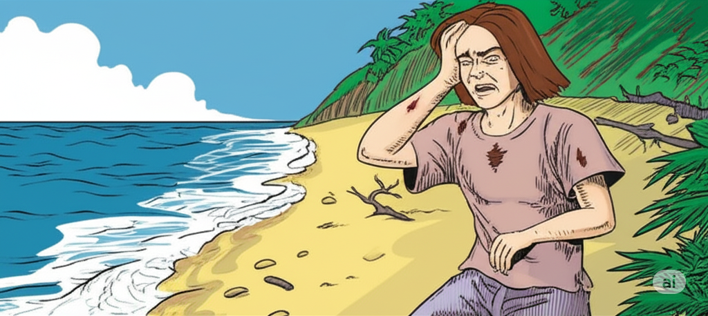

Bob stood up and looked around. “I’ll walk to a higher **altitude**, so I can see everything around me,” thought Bob. “Maybe I’ll gain some **insight** about this island and find something to help me escape.” As he walked along a mountain **ridge**, he noticed that the tall **indigenous** trees looked sturdy and thick. Bob got a brilliant idea. He could build a raft! He cut down some leaves and tree **limbs**. Even though his shoulder injury **impaired** his ability to carry the materials, he slowly dragged them down the mountain until he reached the **coastline**.

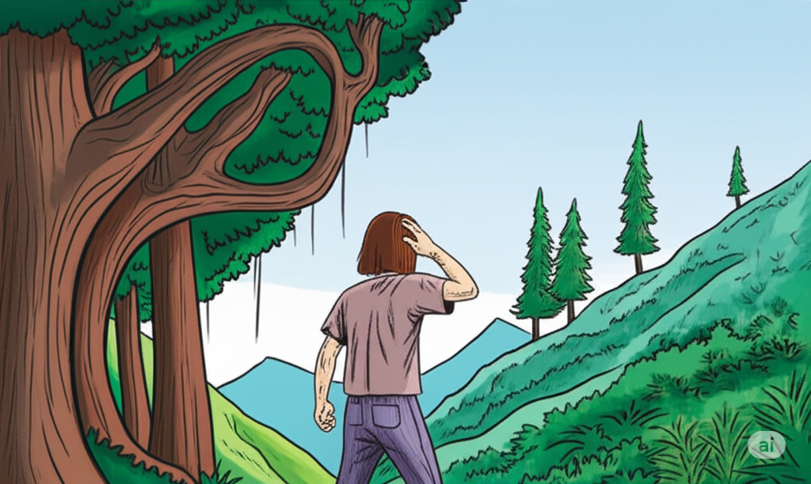

Bob was a **proficient** builder. He used his building **expertise** to line up the **limbs** and tie them together with long vines. When the raft was finished, Bob was happy with his work. “This will bring me home to my family,” he said with a smile.

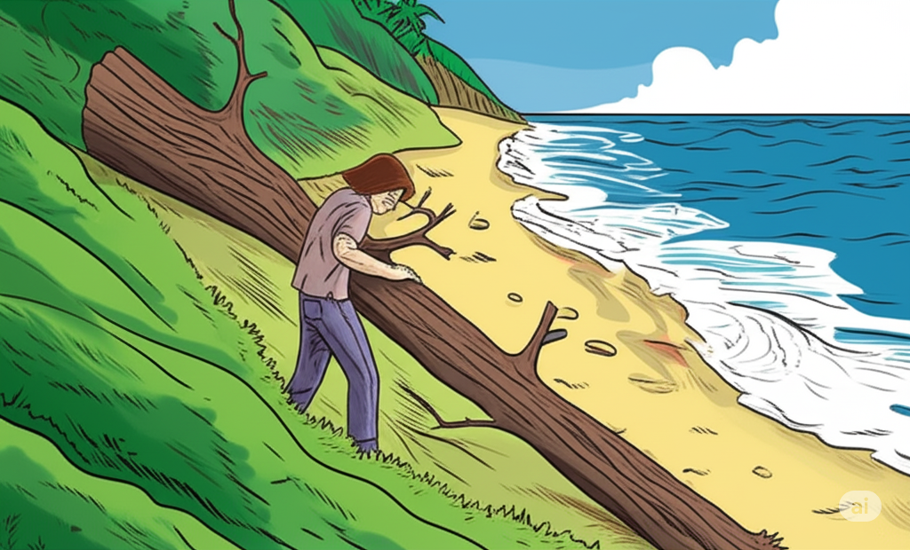

At last, Bob was ready to **implement** his escape plan. With all his might, he **thrust** the raft into the water. He climbed on and began the **quest** to find his way home. Bob smiled again, and thought, “I’m glad I kept a good attitude. It prevented the pain from **deterring** me from my plan. **Optimism** and ambition make anything possible.” Slowly, he floated out to sea. In a few days, he made it to shore and ran home to see his happy family.

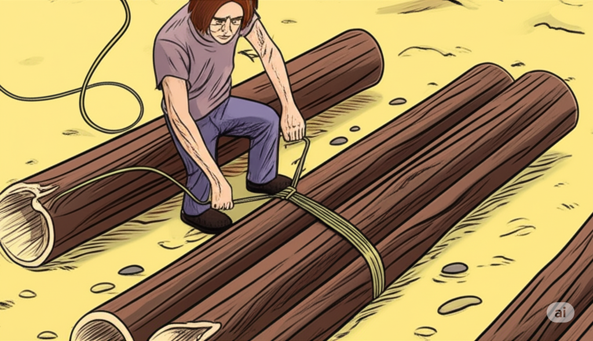

## List of word

altitude
coastline
deter
devise
expertise
fracture
impair
implement
indigenous
insight
limb
migraine
optimism
peculiar
proficient
quest
ridge
spouse
thrust
tolerate

## Sentences of story

The Island

“Where am I?” Bob thought to himself when he woke up on a **peculiar** beach.

“I can’t remember what happened.”

There had been a bad storm, and Bob’s fishing boat sunk.

He washed ashore on a small island, but he had gotten hurt during the storm.

He had a terrible **migraine**, and he had a **fracture** in his shoulder.

He felt awful.

But he had a strong desire to make it home to his **spouse** and children.

He had to **tolerate** all the pain and **devise** a plan.

Bob stood up and looked around.

“I’ll walk to a higher **altitude**, so I can see everything around me,” thought Bob.

“Maybe I’ll gain some **insight** about this island and find something to help me escape.”

As he walked along a mountain **ridge**, he noticed that the tall **indigenous** trees looked sturdy and thick.

Bob got a brilliant idea.

He could build a raft!

He cut down some leaves and tree **limbs**.

Even though his shoulder injury **impaired** his ability to carry the materials, he slowly dragged them down the mountain until he reached the **coastline**.

Bob was a **proficient** builder.

He used his building **expertise** to line up the **limbs** and tie them together with long vines.

When the raft was finished, Bob was happy with his work.

“This will bring me home to my family,” he said with a smile.

At last, Bob was ready to **implement** his escape plan.

With all his might, he **thrust** the raft into the water.

He climbed on and began the **quest** to find his way home.

Bob smiled again, and thought, “I’m glad I kept a good attitude.

It prevented the pain from **deterring** me from my plan.

**Optimism** and ambition make anything possible.”

Slowly, he floated out to sea.

In a few days, he made it to shore and ran home to see his happy family.

## 1. altitude

- ipa: /ˈæl.tɪ.tjuːd/
- class: n
- định nghĩa: độ cao (so với mực nước biển).
- english definition: the height of an object or point in relation to sea level or ground level.
- sentence of story: “I’ll walk to a higher **altitude**, so I can see everything around me,” thought Bob.
- ví dụ thông dụng:
  - We are flying at an **altitude** of 10,000 meters.
  - The plane reached its cruising **altitude**.
  - It's hard to breathe at high **altitudes**.
  - What is the **altitude** of this mountain?
  - He is not used to living at this **altitude**.

## 2. coastline
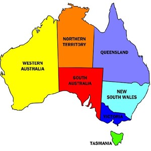
- ipa: /ˈkəʊst.laɪn/
- class: n
- định nghĩa: đường bờ biển.
- english definition: the line where the land meets the sea.
- sentence of story: Even though his shoulder injury impaired his ability to carry the materials, he slowly dragged them down the mountain until he reached the **coastline**.
- ví dụ thông dụng:
  - Vietnam has a long **coastline**.
  - We walked along the **coastline**.
  - The hotel has beautiful views of the **coastline**.
  - The storm damaged a large part of the **coastline**.
  - The map shows the country's **coastline**.

## 3. deter
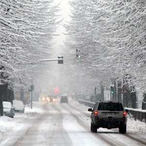
- ipa: /dɪˈtɜːr/
- class: v
- định nghĩa: ngăn cản, làm nản lòng.
- english definition: to discourage someone from doing something by instilling doubt or fear of the consequences.
- sentence of story: It prevented the pain from **deterring** me from my plan.
- ví dụ thông dụng:
  - High prices **deter** many people from buying a house.
  - The rain didn't **deter** them from going for a walk.
  - The warning signs are there to **deter** trespassers.
  - Fear of failure should not **deter** you from trying.
  - The difficult exam might **deter** some students.

## 4. devise

- ipa: /dɪˈvaɪz/
- class: v
- định nghĩa: nghĩ ra, sáng chế, lập (kế hoạch).
- english definition: to invent a plan, system, object, etc., usually cleverly or imaginatively.
- sentence of story: He had to tolerate all the pain and **devise** a plan.
- ví dụ thông dụng:
  - We need to **devise** a new way to solve this problem.
  - He **devised** a plan to escape.
  - The students must **devise** an experiment.
  - They **devised** a system to share the work.
  - It took a long time to **devise** the new machine.

## 5. expertise

- ipa: /ˌek.spɜːˈtiːz/
- class: n
- định nghĩa: chuyên môn, sự thành thạo.
- english definition: a high level of knowledge or skill.
- sentence of story: He used his building **expertise** to line up the limbs and tie them together with long vines.
- ví dụ thông dụng:
  - We need someone with legal **expertise**.
  - She has a lot of **expertise** in marketing.
  - I don't have the **expertise** to fix this computer.
  - His **expertise** is in great demand.
  - This project requires technical **expertise**.

## 6. fracture
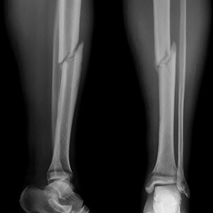
- ipa: /ˈfræk.tʃər/
- class: n
- định nghĩa: vết nứt, chỗ gãy (xương).
- english definition: a break or crack in something hard, especially a bone.
- sentence of story: He had a terrible migraine, and he had a **fracture** in his shoulder.
- ví dụ thông dụng:
  - He has a **fracture** in his leg.
  - The doctor confirmed it was a small **fracture**.
  - It took six weeks for the **fracture** to heal.
  - A bad fall can cause a **fracture**.
  - She suffered a minor **fracture** in her arm.

## 7. impair

- ipa: /ɪmˈpeər/
- class: v
- định nghĩa: làm suy yếu, làm hỏng.
- english definition: to spoil something or make it weaker so that it is less effective.
- sentence of story: Even though his shoulder injury **impaired** his ability to carry the materials, he slowly dragged them down the mountain until he reached the coastline.
- ví dụ thông dụng:
  - Lack of sleep can **impair** your ability to drive.
  - Drinking alcohol will **impair** your judgment.
  - His hearing was **impaired** by the loud noise.
  - The injury did not **impair** his performance.
  - Stress can **impair** your memory.

## 8. implement

- ipa: /ˈɪm.plɪ.ment/
- class: v
- định nghĩa: thực hiện, thi hành.
- english definition: to put a plan or system into operation.
- sentence of story: At last, Bob was ready to **implement** his escape plan.
- ví dụ thông dụng:
  - The government will **implement** the new policy next year.
  - We need to **implement** these changes as soon as possible.
  - It is time to **implement** the plan.
  - The company failed to **implement** the new system correctly.
  - It's easier to make a plan than to **implement** it.

## 9. indigenous
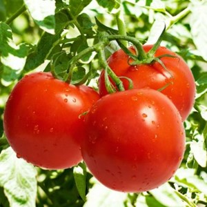
- ipa: /ɪnˈdɪdʒ.ɪ.nəs/
- class: adj
- định nghĩa: bản địa, bản xứ.
- english definition: naturally existing in a place or country rather than arriving from another place.
- sentence of story: As he walked along a mountain ridge, he noticed that the tall **indigenous** trees looked sturdy and thick.
- ví dụ thông dụng:
  - The kangaroo is **indigenous** to Australia.
  - We want to protect the rights of **indigenous** people.
  - This plant is **indigenous** to the Amazon rainforest.
  - They are studying the **indigenous** culture of the region.
  - Are there any **indigenous** tribes in this area?

## 10. insight

- ipa: /ˈɪn.saɪt/
- class: n
- định nghĩa: sự thấu hiểu, cái nhìn sâu sắc.
- english definition: a clear, deep, and sometimes sudden understanding of a complicated problem or situation.
- sentence of story: “Maybe I’ll gain some **insight** about this island and find something to help me escape.”
- ví dụ thông dụng:
  - The book gives a real **insight** into the lives of the poor.
  - His experience gave him a unique **insight** into the problem.
  - Can you offer any **insight** on this matter?
  - The report provides valuable **insight**.
  - I hope you can give me some **insight**.

## 11. limb

- ipa: /lɪm/
- class: n
- định nghĩa: cành cây; hoặc chân, tay của người.
- english definition: an arm or leg of a person or animal; a large branch of a tree.
- sentence of story: He cut down some leaves and tree **limbs**.
- ví dụ thông dụng:
  - A strong wind broke a **limb** from the tree.
  - Be careful not to fall and break a **limb**.
  - The monkey was swinging from **limb** to **limb**.
  - After the accident, he couldn't feel his lower **limbs**.
  - The tree's heavy **limbs** hung over the house.

## 12. migraine

- ipa: /ˈmaɪ.ɡreɪn/
- class: n
- định nghĩa: chứng đau nửa đầu.
- english definition: a severe continuous pain in the head, often with sickness and difficulty in seeing.
- sentence of story: He had a terrible **migraine**, and he had a fracture in his shoulder.
- ví dụ thông dụng:
  - I have a terrible **migraine** today.
  - She suffers from frequent **migraines**.
  - Stress can sometimes cause a **migraine**.
  - Do you have any medicine for a **migraine**?
  - Bright lights can make my **migraine** worse.

## 13. optimism
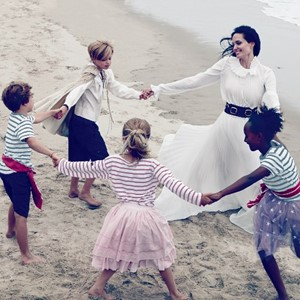
- ipa: /ˈɒp.tɪ.mɪ.zəm/
- class: n
- định nghĩa: sự lạc quan, tinh thần lạc quan.
- english definition: the quality of being full of hope and emphasizing the good parts of a situation, or a belief that something good will happen.
- sentence of story: **Optimism** and ambition make anything possible.
- ví dụ thông dụng:
  - He is full of **optimism** about the future.
  - There is a feeling of **optimism** in the country.
  - Her **optimism** is a great quality.
  - Despite the problems, she never lost her **optimism**.
  - I admire his endless **optimism**.

## 14. peculiar

- ipa: /pɪˈkjuː.li.ər/
- class: adj
- định nghĩa: kỳ lạ, khác thường, đặc biệt.
- english definition: unusual and strange, sometimes in an unpleasant way.
- sentence of story: “Where am I?” Bob thought to himself when he woke up on a **peculiar** beach.
- ví dụ thông dụng:
  - The food had a **peculiar** taste.
  - He has a very **peculiar** way of walking.
  - That's a **peculiar** question to ask.
  - It was a **peculiar** situation.
  - There was a **peculiar** smell in the room.

## 15. proficient

- ipa: /prəˈfɪʃ.ənt/
- class: adj
- định nghĩa: thành thạo, tài giỏi.
- english definition: skilled and experienced.
- sentence of story: Bob was a **proficient** builder.
- ví dụ thông dụng:
  - She is **proficient** in two languages.
  - He is a **proficient** driver.
  - You need to become **proficient** with the software.
  - After much practice, he became a **proficient** cook.
  - The job requires someone who is **proficient** in English.

## 16. quest

- ipa: /kwest/
- class: n
- định nghĩa: cuộc tìm kiếm, cuộc truy lùng (thường dài và khó khăn).
- english definition: a long search for something that is difficult to find.
- sentence of story: He climbed on and began the **quest** to find his way home.
- ví dụ thông dụng:
  - He is on a **quest** for knowledge.
  - The hero went on a **quest** to find the treasure.
  - Her **quest** for a new job was finally successful.
  - Their **quest** took them to many different countries.
  - The story is about a young man's **quest** for adventure.

## 17. ridge

- ipa: /rɪdʒ/
- class: n
- định nghĩa: sườn núi, chóp, gờ.
- english definition: a long, narrow raised part of a surface, especially a high edge along a mountain.
- sentence of story: As he walked along a mountain **ridge**, he noticed that the tall indigenous trees looked sturdy and thick.
- ví dụ thông dụng:
  - We walked along the **ridge** of the hill.
  - The house is built on a high **ridge**.
  - There was snow on the mountain **ridge**.
  - You can see the whole valley from the **ridge**.
  - The roof has a central **ridge**.

## 18. spouse

- ipa: /spaʊs/
- class: n
- định nghĩa: vợ hoặc chồng.
- english definition: a person's husband or wife.
- sentence of story: But he had a strong desire to make it home to his **spouse** and children.
- ví dụ thông dụng:
  - Please bring your **spouse** to the party.
  - You need your **spouse**'s signature on this form.
  - He lives with his **spouse** in a small apartment.
  - This event is for employees and their **spouses**.
  - It's important to communicate with your **spouse**.

## 19. thrust
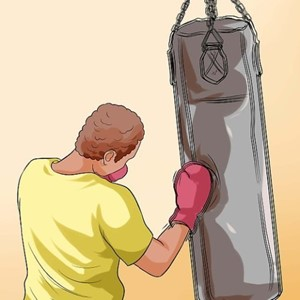
- ipa: /θrʌst/
- class: v
- định nghĩa: đẩy mạnh, xô, thọc.
- english definition: to push suddenly and strongly.
- sentence of story: With all his might, he **thrust** the raft into the water.
- ví dụ thông dụng:
  - He **thrust** his hands into his pockets.
  - She **thrust** the letter into my hand.
  - The engine provides a lot of **thrust**. (noun)
  - He **thrust** the key into the lock.
  - The main **thrust** of his argument was that we need more money. (noun)

## 20. tolerate
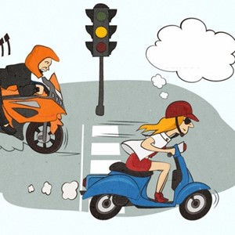
- ipa: /ˈtɒl.ə.reɪt/
- class: v
- định nghĩa: chịu đựng, tha thứ, chấp nhận.
- english definition: to accept behaviour and beliefs that are different from your own, although you might not agree with or approve of them.
- sentence of story: He had to **tolerate** all the pain and devise a plan.
- ví dụ thông dụng:
  - I cannot **tolerate** his rude behavior.
  - She can't **tolerate** cow's milk.
  - We have to **tolerate** each other's differences.
  - My teacher will not **tolerate** cheating.
  - How do you **tolerate** this hot weather?