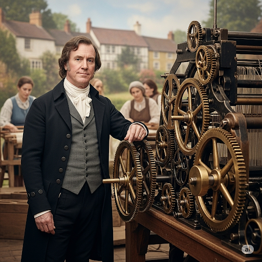
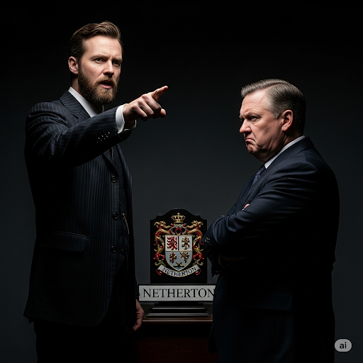
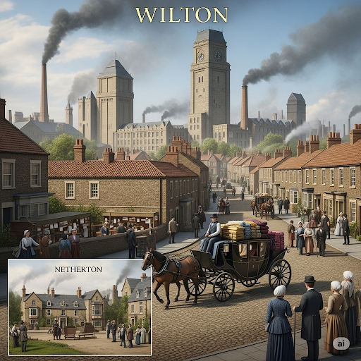
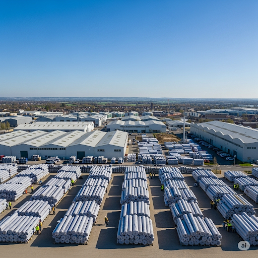

# The Weaving Machine

Mr. Joseph Franklin invented a machine that could **weave** cloth. It wove faster and straighter than anyone could **weave** by hand. He decided to take it to two cities on a **peninsula**, Netherton and Wilton. In these cities, a large **proportion** of the people worked in weaving. Joseph felt sure he could sell his machine there.

Joseph first took his machine to the mayor of Netherton. “Think of the money you will earn from this machine!” Joseph said to him.

But the mayor was a **benevolent** man. He knew about the people’s **dependence** on weaving for their livelihood. If he bought the machine, the people would lose their jobs. So he refused to buy it.

Joseph said, “We are no longer in the **medieval** age! Soon everything will be made by machines. Cloth made by hand will soon be **obsolete**. If you don’t change your **archaic** ways, your town’s income will **diminish**!”

But the mayor said, “I don’t like **capitalism**. Don’t **impose** your **radical** ideas on my town. Go away!”

So Joseph took his machine to the mayor at Wilton. This mayor thought Joseph’s machine was **spectacular** and spent a long time looking at its different **components** made of **brass**. The mayor couldn’t **refute** the fact that the machine had **drawbacks** that would affect the people’s jobs. But he realized the machine could bring money and **prestige**. So he ordered Joseph to build twenty of them.

Within a year, Wilton was a wealthy city, famous for its wonderful cloth. People no longer wove but worked in **managerial** jobs at cloth factories instead. Nobody bought the cloth from Netherton anymore. The people of Netherton became poor and hungry.

Finally, the mayor of Netherton called Joseph and said, “Now I realize that your machine is not just a passing **fad**. To succeed in business, we must be willing to change.” He then ordered twenty weaving machines.

After that, both Netherton and Wilton became rich cities, famous throughout the land for their wonderful cloth.

## List of word
archaic benevolent brass capitalism component dependence diminish drawback fad impose managerial medieval obsolete peninsula prestige proportion radical refute spectacular weave.

## Sentences of story
Mr. Joseph Franklin invented a machine that could **weave** cloth.
It wove faster and straighter than anyone could **weave** by hand.
He decided to take it to two cities on a **peninsula**, Netherton and Wilton.
In these cities, a large **proportion** of the people worked in weaving.
Joseph felt sure he could sell his machine there.
Joseph first took his machine to the mayor of Netherton.
“Think of the money you will earn from this machine!” Joseph said to him.
But the mayor was a **benevolent** man.
He knew about the people’s **dependence** on weaving for their livelihood.
If he bought the machine, the people would lose their jobs.
So he refused to buy it.
Joseph said, “We are no longer in the **medieval** age!
Soon everything will be made by machines.
Cloth made by hand will soon be **obsolete**.
If you don’t change your **archaic** ways, your town’s income will **diminish**!”
But the mayor said, “I don’t like **capitalism**.
Don’t **impose** your **radical** ideas on my town. Go away!”
So Joseph took his machine to the mayor at Wilton.
This mayor thought Joseph’s machine was **spectacular** and spent a long time looking at its different **components** made of **brass**.
The mayor couldn’t **refute** the fact that the machine had **drawbacks** that would affect the people’s jobs.
But he realized the machine could bring money and **prestige**.
So he ordered Joseph to build twenty of them.
Within a year, Wilton was a wealthy city, famous for its wonderful cloth.
People no longer wove but worked in **managerial** jobs at cloth factories instead.
Nobody bought the cloth from Netherton anymore.
The people of Netherton became poor and hungry.
Finally, the mayor of Netherton called Joseph and said, “Now I realize that your machine is not just a passing **fad**.
To succeed in business, we must be willing to change.”
He then ordered twenty weaving machines.
After that, both Netherton and Wilton became rich cities, famous throughout the land for their wonderful cloth.

## 1. archaic

- ipa: /ɑːˈkeɪ.ɪk/
- class: adj
- định nghĩa: cổ xưa, lỗi thời.
- english definition: of or belonging to an ancient period in history.
- sentence of story: If you don’t change your **archaic** ways, your town’s income will diminish!
- ví dụ thông dụng:
  - The museum has a collection of **archaic** tools.
  - This law is **archaic** and should be changed.
  - He uses some **archaic** words when he speaks.
  - The computer system is **archaic**.
  - They want to get rid of the **archaic** rules.

## 2. benevolent

- ipa: /bəˈnev.əl.ənt/
- class: adj
- định nghĩa: nhân từ, nhân đức, rộng lượng.
- english definition: kind and helpful.
- sentence of story: But the mayor was a **benevolent** man.
- ví dụ thông dụng:
  - He was a **benevolent** leader who cared for his people.
  - She gave me a **benevolent** smile.
  - A **benevolent** organization helped the poor family.
  - He is known for his **benevolent** actions.
  - The queen was loved for her **benevolent** rule.

## 3. brass

- ipa: /brɑːs/
- class: n
- định nghĩa: đồng thau.
- english definition: a bright yellow metal made from copper and zinc.
- sentence of story: This mayor thought Joseph’s machine was spectacular and spent a long time looking at its different components made of **brass**.
- ví dụ thông dụng:
  - The door handle is made of solid **brass**.
  - He plays a **brass** instrument in the band.
  - We need to polish the **brass**.
  - The old clock has a **brass** frame.
  - The **brass** section of the orchestra sounds great.

## 4. capitalism

- ipa: /ˈkæp.ɪ.təl.ɪ.zəm/
- class: n
- định nghĩa: chủ nghĩa tư bản.
- english definition: an economic and political system in which a country's trade and industry are controlled by private owners for profit, rather than by the state.
- sentence of story: But the mayor said, “I don’t like **capitalism**.”
- ví dụ thông dụng:
  - The United States has an economy based on **capitalism**.
  - He is a strong believer in free-market **capitalism**.
  - The book discusses the history of **capitalism**.
  - Some people argue against **capitalism**.
  - **Capitalism** encourages competition between businesses.

## 5. component

- ipa: /kəmˈpəʊ.nənt/
- class: n
- định nghĩa: thành phần, bộ phận.
- english definition: a part that combines with other parts to form something bigger.
- sentence of story: This mayor thought Joseph’s machine was spectacular and spent a long time looking at its different **components** made of brass.
- ví dụ thông dụng:
  - Trust is a vital **component** of a good relationship.
  - The machine has many different **components**.
  - We need to order a new **component** for the computer.
  - The main **component** of this dish is rice.
  - He checked every **component** of the engine.

## 6. dependence

- ipa: /dɪˈpen.dəns/
- class: n
- định nghĩa: sự phụ thuộc, sự lệ thuộc.
- english definition: the state of relying on or being controlled by someone or something else.
- sentence of story: He knew about the people’s **dependence** on weaving for their livelihood.
- ví dụ thông dụng:
  - The country's **dependence** on oil is a problem.
  - We need to reduce our **dependence** on fossil fuels.
  - His **dependence** on his parents is not healthy.
  - Drug **dependence** is a serious issue.
  - The child's **dependence** on her mother decreased as she got older.

## 7. diminish

- ipa: /dɪˈmɪn.ɪʃ/
- class: v
- định nghĩa: giảm bớt, thu nhỏ, làm yếu đi.
- english definition: to reduce or be reduced in size or importance.
- sentence of story: If you don’t change your archaic ways, your town’s income will **diminish**!
- ví dụ thông dụng:
  - The population of the town started to **diminish**.
  - We need to **diminish** the risks.
  - Her interest in the project began to **diminish**.
  - Nothing could **diminish** his enthusiasm.
  - The medicine should **diminish** the pain.

## 8. drawback

- ipa: /ˈdrɔː.bæk/
- class: n
- định nghĩa: nhược điểm, hạn chế, mặt trái.
- english definition: a disadvantage or the negative part of a situation.
- sentence of story: The mayor couldn’t refute the fact that the machine had **drawbacks** that would affect the people’s jobs.
- ví dụ thông dụng:
  - The main **drawback** of this car is its high price.
  - One **drawback** of living in the city is the noise.
  - Every plan has its **drawbacks**.
  - Despite a few **drawbacks**, it's a good place to work.
  - What are the **drawbacks** of this new system?

## 9. fad

- ipa: /fæd/
- class: n
- định nghĩa: mốt nhất thời, sự ưa thích tạm thời.
- english definition: a style, activity, or interest that is very popular for a short period of time.
- sentence of story: Now I realize that your machine is not just a passing **fad**.
- ví dụ thông dụng:
  - That new hairstyle is just a **fad**.
  - I'm not interested in the latest fashion **fads**.
  - Do you think this technology is a **fad** or the future?
  - Many diets are just a short-term **fad**.
  - The toy was a huge **fad** for a few months.

## 10. impose

- ipa: /ɪmˈpəʊz/
- class: v
- định nghĩa: áp đặt.
- english definition: to force an opinion, rule, or punishment on someone.
- sentence of story: Don’t **impose** your radical ideas on my town. Go away!
- ví dụ thông dụng:
  - The government will **impose** a new tax.
  - Don't **impose** your beliefs on others.
  - I don't want to **impose** on your time.
  - She feels like her parents **impose** too many rules.
  - The school **imposes** a strict dress code.

## 11. managerial

- ipa: /ˌmæn.əˈdʒɪə.ri.əl/
- class: adj
- định nghĩa: (thuộc về) quản lý, của người quản lý.
- english definition: relating to the job of a manager.
- sentence of story: People no longer wove but worked in **managerial** jobs at cloth factories instead.
- ví dụ thông dụng:
  - He has no **managerial** experience.
  - The job requires good **managerial** skills.
  - She was promoted to a **managerial** position.
  - This course is for people with **managerial** responsibilities.
  - The company is looking for a new **managerial** team.

## 12. medieval

- ipa: /ˌmed.iˈiː.vəl/
- class: adj
- định nghĩa: (thuộc về) thời Trung cổ.
- english definition: related to the Middle Ages (the period in European history from about 600 to 1500 AD).
- sentence of story: We are no longer in the **medieval** age!
- ví dụ thông dụng:
  - We visited a **medieval** castle.
  - This book is about **medieval** history.
  - The town has a beautiful **medieval** church.
  - Life was very different in **medieval** times.
  - He is an expert on **medieval** art.

## 13. obsolete

- ipa: /ˈɒb.səl.iːt/
- class: adj
- định nghĩa: lỗi thời, cổ xưa, không còn được sử dụng.
- english definition: not in use any more, having been replaced by something newer and better or more fashionable.
- sentence of story: Cloth made by hand will soon be **obsolete**.
- ví dụ thông dụng:
  - This type of computer is now **obsolete**.
  - New technology is making many old skills **obsolete**.
  - The company needs to replace its **obsolete** equipment.
  - His methods are completely **obsolete**.
  - The manual typewriter is almost **obsolete**.

## 14. peninsula

- ipa: /pəˈnɪn.sjə.lə/
- class: n
- định nghĩa: bán đảo.
- english definition: a long piece of land that is mostly surrounded by water, but is connected to a larger landmass.
- sentence of story: He decided to take it to two cities on a **peninsula**, Netherton and Wilton.
- ví dụ thông dụng:
  - Italy is a famous **peninsula**.
  - They live on a small **peninsula**.
  - We drove around the entire **peninsula**.
  - The Korean **Peninsula** is in East Asia.
  - A **peninsula** is a beautiful place for a vacation.

## 15. prestige

- ipa: /presˈtiːʒ/
- class: n
- định nghĩa: uy tín, thanh thế.
- english definition: respect and admiration given to someone or something, usually because of a high position or success.
- sentence of story: But he realized the machine could bring money and **prestige**.
- ví dụ thông dụng:
  - Being a doctor has a lot of **prestige**.
  - The company wants to improve its **prestige**.
  - He values **prestige** more than money.
  - Winning the award brought great **prestige** to the school.
  - It is a **prestige** job.

## 16. proportion

- ipa: /prəˈpɔː.ʃən/
- class: n
- định nghĩa: tỉ lệ, phần.
- english definition: the number or amount of a group or part of something when compared to the whole.
- sentence of story: In these cities, a large **proportion** of the people worked in weaving.
- ví dụ thông dụng:
  - A large **proportion** of the students live nearby.
  - What **proportion** of your income do you spend on rent?
  - The **proportion** of women in the police force has increased.
  - The room's **proportions** make it feel very spacious.
  - A small **proportion** of the books were damaged.

## 17. radical

- ipa: /ˈræd.ɪ.kəl/
- class: adj
- định nghĩa: cấp tiến, cực đoan; triệt để, hoàn toàn.
- english definition: believing or expressing the belief that there should be great or extreme social or political change.
- sentence of story: Don’t impose your **radical** ideas on my town. Go away!
- ví dụ thông dụng:
  - The country needs a **radical** change in its education system.
  - He has some **radical** ideas about politics.
  - This is a **radical** new approach to the problem.
  - The difference between the two plans is **radical**.
  - She is a member of a **radical** political party.

## 18. refute

- ipa: /rɪˈfjuːt/
- class: v
- định nghĩa: bác bỏ (một ý kiến, lập luận).
- english definition: to say or prove that a person, statement, opinion, etc. is wrong or false.
- sentence of story: The mayor couldn’t **refute** the fact that the machine had drawbacks that would affect the people’s jobs.
- ví dụ thông dụng:
  - She tried to **refute** the accusations against her.
  - Can you **refute** his argument?
  - The evidence is difficult to **refute**.
  - He published an article to **refute** the claims.
  - It is hard to **refute** a simple fact.

## 19. spectacular

- ipa: /spekˈtæk.jə.lər/
- class: adj
- định nghĩa: ngoạn mục, đẹp mắt, ấn tượng.
- english definition: very exciting to look at; extremely good, exciting, or surprising.
- sentence of story: This mayor thought Joseph’s machine was **spectacular** and spent a long time looking at its different components made of brass.
- ví dụ thông dụng:
  - The view from the top of the mountain is **spectacular**.
  - The fireworks display was **spectacular**.
  - She gave a **spectacular** performance.
  - The team scored a **spectacular** goal.
  - The wedding was a **spectacular** event.

## 20. weave

- ipa: /wiːv/
- class: v
- định nghĩa: dệt (vải).
- english definition: to make cloth by repeatedly crossing a single thread through two sets of long threads on a loom.
- sentence of story: Mr. Joseph Franklin invented a machine that could **weave** cloth.
- ví dụ thông dụng:
  - My grandmother taught me how to **weave**.
  - They **weave** beautiful carpets by hand.
  - Spiders **weave** webs to catch insects.
  - The story **weaves** together fact and fiction.
  - She can **weave** a basket from grass.