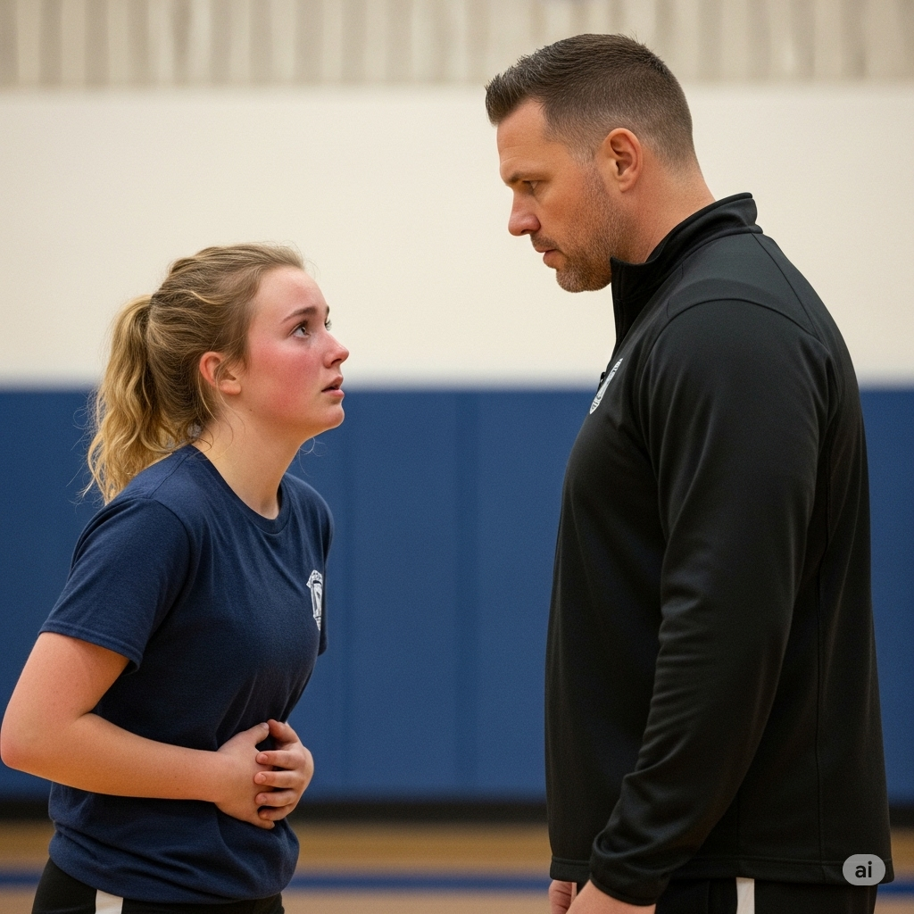

# GWEN'S NEW FRIENDS

Gwen walked into the gym for her next class. Coach Peeves said, “Today, we’re playing basketball. The **custom** is to let you choose your own teams. However, we’re going to do things differently.”

The coach assigned each girl to a team. There were six girls **per** team. Gwen **glimpsed** at her teammates. She didn’t know any of them. All of her friends were on the other teams. She couldn’t believe her **misfortune**.

“I feel sick. May I go to the nurse?” asked Gwen.

The coach could **foresee** Gwen’s excuses. It wasn’t the first time Gwen tried to leave class. With a **stern** voice, the coach said, “No.”

Gwen was **vehement**. “I don’t know any of these girls! Let me play on another team. Please!” she **pleaded**.

“Gwen, don’t be **disobedient**. I don’t want to hear any more **negative** comments from you.”

Gwen had no choice. Then a girl smiled at her. “Hi, I’m Stephanie. I was in your English class last year,” she said. Gwen remembered her. “For the **sake** of the team, please try your best. I know you’re a good player,” said Stephanie.

When the game started, Gwen played as best as she could. She took a long shot. The ball sailed through the air and went right through the **hoop**!

“That was awesome!” said one of her teammates. Later, Gwen fell with a loud **thump**.

“Are you OK?” asked her teammates. They were worried. She had **ripped** her jeans. She had **scraped** her knee and had a small **bruise**.

Gwen told her teammates, “My knee is fine, and I can **stitch** my pants later. Let’s keep playing!”

By the end of the game, Gwen forgot **altogether** that she hadn’t wanted to play, and her team won! The victory **bound** Gwen’s team together. She had made a lot of new friends, and they were a **source** of happiness for her for many years.

---

Laika, the Space Dog Laika, the Space Dog

One of the world’s most **beloved** space travelers was also the furriest.

Laika was a little dog living on the streets of Moscow, Russia.

She **matured** on the streets because no one would give her a home.

She had to learn how to live without eating much.

She found ways to keep warm in a very cold **climate**.

Scientists thought a tough dog like Laika would do well in a project they were putting together.

In a **prior** launch, Russia had put the first man-made object into space.

Now, scientists wanted to see if a living thing could go to space.

**Although** many facts about space had been learned, they weren’t enough to help send humans to space safely.

Laika and two other dogs were chosen to help scientists with their **research**.

The animals were used in a **variety** of tests.

In the end, though, only Laika would go to space.

On November 3,1957 the Sputnik 2 spaceship was **due** to leave Earth.

Scientists carefully **applied** wires to Laika’s skin to **measure** her body’s reactions once she got into space.

Laika also wore a special **leash**.

Without it, she would float around in the spaceship.

Soon after, Laika left the planet.

Scientists on Earth **awaited** information from the ship.

But in the **midst** of so much excitement, something very sad happened.

Scientists were able to tell that Laika was under a lot of stress.

The trip **confused** and scared her.

Laika’s **entire** ship had become as hot as a **furnace**.

Scientists were powerless to help the dog in her **misery**.

After about five hours, Laika died.

Some have **complained** that the little dog should never have been used in the mission.

Scientists knew that she would not survive the trip.

Laika was never **buried**, but an **establish**ed memorial has been **establish**ed in Moscow.

There are many songs and books about her, too.

It seems that Laika became a hero to many people.

---

## 1. altogether adv
Trong câu chuyện: Hoàn toàn, toàn bộ (Gwen hoàn toàn quên rằng cô ấy không muốn chơi).
Nghĩa thường gặp: Hoàn toàn, tổng cộng.

Ví dụ:
1.  Simple Present: She **altogether** forgets about the time when she is reading.
2.  Present Continuous: They are **altogether** ignoring the warning signs.
3.  Present Perfect: We have **altogether** finished the project.
4.  Present Perfect Continuous: I have been **altogether** avoiding that topic lately.
5.  Simple Past: He **altogether** denied knowing anything about it.
6.  Past Continuous: We were **altogether** enjoying the party when the power went out.
7.  Past Perfect: She had **altogether** changed her mind before the meeting started.
8.  Past Perfect Continuous: They had been **altogether** planning the surprise for months.
9.  Simple Future (will): You will **altogether** understand once you see it.
10. Future Continuous: This time tomorrow, I will be **altogether** relaxing on the beach.
11. Future Perfect: By next year, they will have **altogether** moved to a new city.
12. Future Perfect Continuous: By the end of the day, I will have been **altogether** working on this report for eight hours.

## 2. bind v
Trong câu chuyện: Gắn kết, kết nối (chiến thắng gắn kết đội của Gwen lại với nhau).
Nghĩa thường gặp: Buộc, ràng buộc, gắn kết.

Ví dụ:
1.  Simple Present: The rules **bind** us to the agreement.
2.  Present Continuous: She is **binding** the papers together with string.
3.  Present Perfect: They have **bound** themselves to a strict contract.
4.  Present Perfect Continuous: We have been **binding** these books all morning.
5.  Simple Past: The rope **bound** his hands tightly.
6.  Past Continuous: They were **binding** the package when the courier arrived.
7.  Past Perfect: He had **bound** the wound before the ambulance came.
8.  Past Perfect Continuous: The workers had been **binding** the materials for hours.
9.  Simple Future (will): This promise will **bind** us forever.
10. Future Continuous: Tomorrow morning, I will be **binding** the final reports.
11. Future Perfect: By noon, she will have **bind** all the documents.
12. Future Perfect Continuous: By the time you arrive, I will have been **binding** these boxes for two hours.

## 3. bruise n
Trong câu chuyện: Vết bầm tím (Gwen có một vết bầm nhỏ trên đầu gối).
Nghĩa thường gặp: Vết bầm tím (trên da), vết thâm (trên trái cây).

Ví dụ:
1.  Simple Present: He often gets a **bruise** when he plays soccer.
2.  Present Continuous: The apple is getting a **bruise** from being dropped.
3.  Present Perfect: She has a nasty **bruise** on her arm from the fall.
4.  Present Perfect Continuous: My leg has been getting a **bruise** since I hit it yesterday.
5.  Simple Past: I got a **bruise** when I bumped into the table.
6.  Past Continuous: He was showing me the **bruise** he got during the game.
7.  Past Perfect: She had already treated the **bruise** before I saw it.
8.  Past Perfect Continuous: His ankle had been developing a **bruise** since the accident.
9.  Simple Future (will): That fall will probably leave a **bruise**.
10. Future Continuous: By tomorrow, the **bruise** will be showing more clearly.
11. Future Perfect: By the end of the week, the **bruise** will have faded significantly.
12. Future Perfect Continuous: By this time tomorrow, the **bruise** will have been hurting for 24 hours.

## 4. custom n
Trong câu chuyện: Phong tục, thông lệ (thông lệ là để các cô gái tự chọn đội của mình).
Nghĩa thường gặp: Phong tục, tập quán, thói quen.

Ví dụ:
1.  Simple Present: It is the **custom** to exchange gifts during the holidays.
2.  Present Continuous: They are currently studying the local **customs**.
3.  Present Perfect: We have learned about many different **customs** on our travels.
4.  Present Perfect Continuous: Anthropologists have been researching this ancient **custom** for years.
5.  Simple Past: In the past, this was a common **custom**.
6.  Past Continuous: They were discussing the wedding **customs** of their country.
7.  Past Perfect: The old **custom** had died out by the time we visited.
8.  Past Perfect Continuous: The community had been following that **custom** for centuries.
9.  Simple Future (will): This new tradition will become a **custom** over time.
10. Future Continuous: Next year, we will be observing this **custom** in Japan.
11. Future Perfect: By the next generation, this **custom** will have changed.
12. Future Perfect Continuous: By the time the festival ends, they will have been practicing this **custom** for a week.

## 5. disobedient adj
Trong câu chuyện: Không vâng lời (huấn luyện viên nói Gwen đừng không vâng lời).
Nghĩa thường gặp: Không vâng lời, bất tuân.

Ví dụ:
1.  Simple Present: The child is often **disobedient**.
2.  Present Continuous: He is being deliberately **disobedient** today.
3.  Present Perfect: She has been **disobedient** on several occasions.
4.  Present Perfect Continuous: The dog has been **disobedient** all morning.
5.  Simple Past: The student was **disobedient** and refused to sit down.
6.  Past Continuous: They were being **disobedient** during the lesson.
7.  Past Perfect: He had been **disobedient** before, so his parents weren't surprised.
8.  Past Perfect Continuous: The children had been **disobedient** for hours before their parents intervened.
9.  Simple Future (will): If you are **disobedient**, you will be punished.
10. Future Continuous: I'm worried he will be being **disobedient** while I'm away.
11. Future Perfect: By the end of the day, he will have been **disobedient** for the entire class.
12. Future Perfect Continuous: By the time the teacher returns, the class will have been being **disobedient** for twenty minutes.

## 6. foresee v
Trong câu chuyện: Dự đoán, nhìn thấy trước (huấn luyện viên có thể nhìn thấy trước những lời bào chữa của Gwen).
Nghĩa thường gặp: Dự đoán, thấy trước.

Ví dụ:
1.  Simple Present: She can **foresee** potential problems.
2.  Present Continuous: We are **foreseeing** some difficulties with the plan.
3.  Present Perfect: They have **foreseen** this outcome for a while.
4.  Present Perfect Continuous: I have been **foreseeing** this possibility since the beginning.
5.  Simple Past: He **foresaw** the consequences of his actions.
6.  Past Continuous: We were **foreseeing** a delay due to the weather.
7.  Past Perfect: They had **foreseen** the market changes.
8.  Past Perfect Continuous: The analysts had been **foreseeing** a recession for months.
9.  Simple Future (will): Nobody can **foresee** the future perfectly.
10. Future Continuous: By this time next week, we will be **foreseeing** the results of the experiment.
11. Future Perfect: By the end of the year, we will have **foreseen** all major risks.
12. Future Perfect Continuous: By the time the project is finished, they will have been **foreseeing** challenges for over a year.

## 7. glimpse v
Trong câu chuyện: Nhìn thoáng qua (Gwen nhìn thoáng qua các đồng đội của mình).
Nghĩa thường gặp: Nhìn thoáng qua, thoáng thấy.

Ví dụ:
1.  Simple Present: I often **glimpse** deer in the woods.
2.  Present Continuous: She is **glimpsing** at the menu quickly.
3.  Present Perfect: We have **glimpsed** the celebrity several times.
4.  Present Perfect Continuous: I have been **glimpsing** at the report while waiting.
5.  Simple Past: He **glimpsed** her across the crowded room.
6.  Past Continuous: I was **glimpsing** at the scenery as the train passed by.
7.  Past Perfect: She had **glimpsed** the answer before the teacher covered it.
8.  Past Perfect Continuous: They had been **glimpsing** at the secret documents for weeks.
9.  Simple Future (will): You will **glimpse** the ocean from the top of the hill.
10. Future Continuous: Tomorrow morning, I will be **glimpsing** the sunrise from my window.
11. Future Perfect: By the time we leave, I will have **glimpsed** all the main attractions.
12. Future Perfect Continuous: By the end of the tour, we will have been **glimpsing** historical sites for hours.

## 8. hoop n
Trong câu chuyện: Vành rổ (quả bóng đi thẳng qua vành rổ).
Nghĩa thường gặp: Vành, vòng (đặc biệt là trong bóng rổ hoặc thể dục nhịp điệu).

Ví dụ:
1.  Simple Present: He shoots the ball through the **hoop**.
2.  Present Continuous: The player is aiming for the **hoop**.
3.  Present Perfect: She has made every shot through the **hoop**.
4.  Present Perfect Continuous: They have been practicing shooting hoops all afternoon.
5.  Simple Past: The ball went right through the **hoop**.
6.  Past Continuous: He was trying to jump through the **hoop**.
7.  Past Perfect: The gymnast had already gone through the **hoop** twice.
8.  Past Perfect Continuous: The kids had been playing with the hula **hoop** for an hour.
9.  Simple Future (will): I hope I will make this shot through the **hoop**.
10. Future Continuous: This evening, they will be practicing shooting hoops.
11. Future Perfect: By the end of the game, he will have made ten shots through the **hoop**.
12. Future Perfect Continuous: By the time practice finishes, she will have been shooting hoops for three hours.

## 9. misfortune n
Trong câu chuyện: Sự không may, rủi ro (Gwen không thể tin vào sự không may của mình khi không có bạn bè cùng đội).
Nghĩa thường gặp: Sự không may, vận rủi, tai họa.

Ví dụ:
1.  Simple Present: **Misfortune** often strikes when you least expect it.
2.  Present Continuous: He is currently experiencing some **misfortune**.
3.  Present Perfect: They have suffered great **misfortune**.
4.  Present Perfect Continuous: The family has been facing **misfortune** for years.
5.  Simple Past: It was my **misfortune** to be in the wrong place at the wrong time.
6.  Past Continuous: We were discussing his recent **misfortunes**.
7.  Past Perfect: She had already overcome many **misfortunes** in her life.
8.  Past Perfect Continuous: The company had been dealing with **misfortune** after **misfortune**.
9.  Simple Future (will): I hope you will not encounter any **misfortune**.
10. Future Continuous: I'm worried about what **misfortune** they will be facing next.
11. Future Perfect: By the end of the year, they will have survived a lot of **misfortune**.
12. Future Perfect Continuous: By the time the crisis is over, they will have been enduring **misfortune** for months.

## 10. negative adj
Trong câu chuyện: Tiêu cực (huấn luyện viên không muốn nghe thêm bình luận tiêu cực nào từ Gwen).
Nghĩa thường gặp: Tiêu cực, phủ định, âm tính.

Ví dụ:
1.  Simple Present: He always has a **negative** attitude.
2.  Present Continuous: She is being very **negative** about the proposal.
3.  Present Perfect: They have received some **negative** feedback.
4.  Present Perfect Continuous: I have been feeling **negative** about the situation all week.
5.  Simple Past: His comments were entirely **negative**.
6.  Past Continuous: We were discussing the **negative** impacts of the policy.
7.  Past Perfect: She had already anticipated the **negative** reaction.
8.  Past Perfect Continuous: The team had been receiving **negative** reviews for months.
9.  Simple Future (will): This decision will have a **negative** effect.
10. Future Continuous: I'm afraid they will be giving **negative** responses during the meeting.
11. Future Perfect: By tomorrow, the test results will have come back **negative**.
12. Future Perfect Continuous: By the end of the day, he will have been expressing **negative** opinions for hours.

## 11. per prep
Trong câu chuyện: Mỗi (có sáu cô gái mỗi đội).
Nghĩa thường gặp: Mỗi, trên mỗi.

Ví dụ:
1.  Simple Present: The cost is ten dollars **per** person.
2.  Present Continuous: We are calculating the earnings **per** share.
3.  Present Perfect: They have charged us fifty cents **per** mile.
4.  Present Perfect Continuous: The machine has been producing 100 units **per** hour.
5.  Simple Past: We paid five pounds **per** ticket.
6.  Past Continuous: They were earning a certain amount **per** day.
7.  Past Perfect: He had already read ten pages **per** minute.
8.  Past Perfect Continuous: The factory had been operating at 50 items **per** minute.
9.  Simple Future (will): The speed limit will be 60 miles **per** hour.
10. Future Continuous: Next month, we will be paying rent **per** week instead of **per** month.
11. Future Perfect: By the end of the year, they will have sold a million units **per** region.
12. Future Perfect Continuous: By the time the project is complete, we will have been spending $1000 **per** week.

## 12. plead v
Trong câu chuyện: Cầu xin, van nài (cô ấy cầu xin được chơi ở đội khác).
Nghĩa thường gặp: Cầu xin, van nài, biện hộ (trước tòa).

Ví dụ:
1.  Simple Present: She **pleads** with him to stay.
2.  Present Continuous: He is **pleading** for mercy.
3.  Present Perfect: They have **pleaded** guilty to the charge.
4.  Present Perfect Continuous: She has been **pleading** her case all morning.
5.  Simple Past: He **pleaded** with the police not to arrest him.
6.  Past Continuous: She was **pleading** her innocence in court.
7.  Past Perfect: He had already **pleaded** his case to the manager.
8.  Past Perfect Continuous: The lawyers had been **pleading** for a mistrial for days.
9.  Simple Future (will): I will **plead** with them to change their minds.
10. Future Continuous: Tomorrow, the defense attorney will be **pleading** his client's case.
11. Future Perfect: By the end of the trial, he will have **pleaded** his side of the story.
12. Future Perfect Continuous: By the time the judge makes a decision, they will have been **pleading** for leniency for hours.

## 13. rip v
Trong câu chuyện: Xé rách (cô ấy đã xé rách quần jean của mình).
Nghĩa thường gặp: Xé, làm rách, rạch.

Ví dụ:
1.  Simple Present: He often **rips** his pants when climbing.
2.  Present Continuous: She is **ripping** the fabric into strips.
3.  Present Perfect: I have **ripped** my shirt.
4.  Present Perfect Continuous: The wind has been **ripping** the flag all night.
5.  Simple Past: I accidentally **ripped** the paper.
6.  Past Continuous: He was **ripping** open the package.
7.  Past Perfect: She had already **ripped** the seam before she noticed.
8.  Past Perfect Continuous: The machine had been **ripping** the material incorrectly.
9.  Simple Future (will): Be careful, or you will **rip** it.
10. Future Continuous: This afternoon, I will be **ripping** out the old carpet.
11. Future Perfect: By the time you get here, I will have **ripped** all the pages.
12. Future Perfect Continuous: By the end of the day, they will have been **ripping** down the old building for a week.

## 14. sake n
Trong câu chuyện: Vì lợi ích của (vì lợi ích của đội).
Nghĩa thường gặp: Vì lợi ích của, vì mục đích. (Thường dùng trong cụm "for the sake of").

Ví dụ:
1.  Simple Present: We do it for the **sake** of peace.
2.  Present Continuous: They are arguing for the **sake** of arguing.
3.  Present Perfect: He has done a lot for the **sake** of his family.
4.  Present Perfect Continuous: She has been working hard for the **sake** of the project.
5.  Simple Past: They compromised for the **sake** of unity.
6.  Past Continuous: We were discussing the rules for the **sake** of clarity.
7.  Past Perfect: He had already sacrificed a lot for the **sake** of his beliefs.
8.  Past Perfect Continuous: The leaders had been negotiating for the **sake** of the agreement.
9.  Simple Future (will): I will do it for your **sake**.
10. Future Continuous: Tomorrow, they will be meeting for the **sake** of resolving the issue.
11. Future Perfect: By the end of the year, they will have completed the merger for the **sake** of growth.
12. Future Perfect Continuous: By the time the conference finishes, they will have been talking for the **sake** of diplomacy for days.

## 15. scrape v
Trong câu chuyện: Làm trầy xước (cô ấy đã làm trầy đầu gối của mình).
Nghĩa thường gặp: Cạo, nạo, làm trầy xước.

Ví dụ:
1.  Simple Present: He often **scrapes** his knees when he falls.
2.  Present Continuous: She is **scraping** the paint off the wall.
3.  Present Perfect: I have **scraped** my car against the fence.
4.  Present Perfect Continuous: The branches have been **scraping** against the window all night.
5.  Simple Past: I **scraped** my elbow when I fell.
6.  Past Continuous: He was **scraping** the ice off the windshield.
7.  Past Perfect: She had already **scraped** the bottom of the pan.
8.  Past Perfect Continuous: The workers had been **scraping** the old wallpaper for hours.
9.  Simple Future (will): Be careful, or you will **scrape** your hand.
10. Future Continuous: This afternoon, I will be **scraping** the rust off the metal.
11. Future Perfect: By the time you finish, you will have **scraped** the entire floor.
12. Future Perfect Continuous: By the end of the day, he will have been **scraping** paint for six hours.

## 16. source n
Trong câu chuyện: Nguồn (họ là nguồn hạnh phúc cho cô ấy).
Nghĩa thường gặp: Nguồn, nguồn gốc.

Ví dụ:
1.  Simple Present: The sun is the primary **source** of energy.
2.  Present Continuous: They are currently investigating the **source** of the problem.
3.  Present Perfect: We have found a reliable **source** of information.
4.  Present Perfect Continuous: Researchers have been looking for the **source** of the river.
5.  Simple Past: The leak was the **source** of the water damage.
6.  Past Continuous: We were discussing the historical **sources** for the book.
7.  Past Perfect: They had already identified the **source** of the infection.
8.  Past Perfect Continuous: The police had been tracking the **source** of the signal.
9.  Simple Future (will): This discovery will be a new **source** of hope.
10. Future Continuous: Next week, we will be analyzing the data from the new **source**.
11. Future Perfect: By the end of the study, they will have traced the **source** of the pollution.
12. Future Perfect Continuous: By the time the investigation concludes, they will have been examining the **source** for months.

## 17. stern adj
Trong câu chuyện: Nghiêm khắc (với giọng nói nghiêm khắc).
Nghĩa thường gặp: Nghiêm khắc, cứng rắn, nghiêm nghị.

Ví dụ:
1.  Simple Present: The teacher has a **stern** look.
2.  Present Continuous: He is being very **stern** with the children.
3.  Present Perfect: She has given us a **stern** warning.
4.  Present Perfect Continuous: The principal has been very **stern** about the new rules.
5.  Simple Past: His father gave him a **stern** lecture.
6.  Past Continuous: They were receiving **stern** instructions.
7.  Past Perfect: He had already received a **stern** reprimand.
8.  Past Perfect Continuous: The coach had been giving **stern** advice all season.
9.  Simple Future (will): The judge will be **stern** with repeat offenders.
10. Future Continuous: I'm sure she will be being **stern** with them while I'm gone.
11. Future Perfect: By the end of the meeting, he will have delivered a **stern** message.
12. Future Perfect Continuous: By the time the training is over, the instructor will have been being **stern** for two days.

## 18. stitch v
Trong câu chuyện: Khâu (cô ấy có thể khâu quần của mình sau).
Nghĩa thường gặp: Khâu, may, khâu vết thương.

Ví dụ:
1.  Simple Present: She **stitches** the fabric by hand.
2.  Present Continuous: He is **stitching** up the tear in his jacket.
3.  Present Perfect: I have **stitched** my button back on.
4.  Present Perfect Continuous: She has been **stitching** this quilt for months.
5.  Simple Past: I **stitched** the hole in my sock.
6.  Past Continuous: She was **stitching** the hem of her dress.
7.  Past Perfect: He had already **stitched** the wound before the doctor arrived.
8.  Past Perfect Continuous: The tailor had been **stitching** the suit all morning.
9.  Simple Future (will): I will **stitch** this up for you.
10. Future Continuous: This evening, I will be **stitching** the final pieces together.
11. Future Perfect: By tomorrow, she will have **stitched** the entire garment.
12. Future Perfect Continuous: By the time the show starts, the costume designer will have been **stitching** for a week.

## 19. thump n
Trong câu chuyện: Tiếng va đập mạnh (Gwen ngã với một tiếng va đập mạnh).
Nghĩa thường gặp: Tiếng va đập mạnh, tiếng đập (tim).

Ví dụ:
1.  Simple Present: The heavy book lands with a **thump**.
2.  Present Continuous: His heart is giving a loud **thump**.
3.  Present Perfect: We have heard a strange **thump** from upstairs.
4.  Present Perfect Continuous: My heart has been giving a nervous **thump**.
5.  Simple Past: He fell to the ground with a **thump**.
6.  Past Continuous: We were listening to the rhythmic **thump** of the drums.
7.  Past Perfect: The package had landed with a soft **thump**.
8.  Past Perfect Continuous: His foot had been making a rhythmic **thump** as he walked.
9.  Simple Future (will): The box will land with a **thump**.
10. Future Continuous: I'm sure I will be hearing a **thump** from the construction next door.
11. Future Perfect: By the time you get home, the package will have arrived with a **thump**.
12. Future Perfect Continuous: By the end of the night, the music will have been making a constant **thump**.

## 20. vehement adj
Trong câu chuyện: Kịch liệt, mãnh liệt (Gwen kịch liệt phản đối).
Nghĩa thường gặp: Mãnh liệt, kịch liệt, dữ dội (thường chỉ cảm xúc hoặc cách thể hiện).

Ví dụ:
1.  Simple Present: She is **vehement** in her opposition.
2.  Present Continuous: He is being particularly **vehement** about this issue today.
3.  Present Perfect: They have expressed **vehement** disapproval.
4.  Present Perfect Continuous: She has been **vehement**ly arguing her point.
5.  Simple Past: He made a **vehement** denial.
6.  Past Continuous: They were expressing **vehement** protests.
7.  Past Perfect: She had already shown her **vehement** dislike.
8.  Past Perfect Continuous: The crowd had been **vehement**ly demanding change.
9.  Simple Future (will): He will be **vehement** in his response.
10. Future Continuous: I expect they will be being **vehement** during the debate.
11. Future Perfect: By the end of the speech, he will have delivered a **vehement** message.
12. Future Perfect Continuous: By the time the meeting is over, she will have been **vehement**ly expressing her views for an hour.