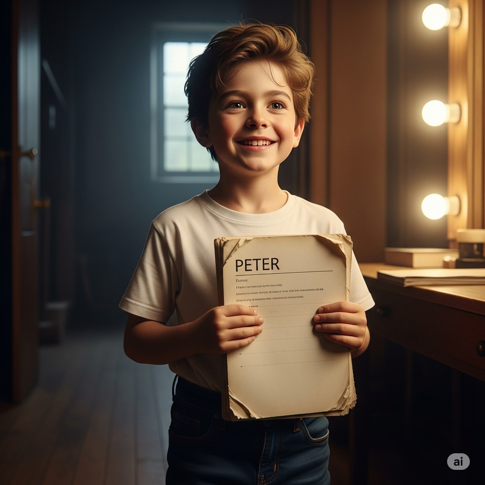
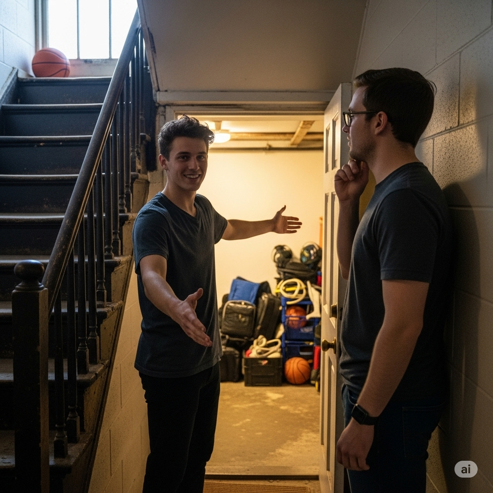

# The School Play

Peter was excited. Next week he was going to audition for the school play. Everybody knew he was a great actor. He was sure he would get the lead role.

Later, his friend Robby asked him, “Have you seen the **script** for the play?”

“Yes. The title is The Lost **Glove**—it’s a **comic** play,” replied Peter.

Robby said, “I want to play the part of the **hermit** because the **hermit** gets to talk with an **accent**!”

“I want the lead role of the **barber**. I didn’t know you liked acting. I thought you liked **choir** better,” said Peter.

“Acting is also a hobby of mine. Do you want to practice with me? The **basement** at my house is quiet. It’s perfect!” Robby replied.

“I don’t like practicing with others. It **complicates** the process for me,” said Peter.

Actually, Peter didn’t want to practice at all. The teacher would surely **reserve** the lead part for him. A few days later, Robby came to his house.

Robby said, “Do you want to practice the scene on the **staircase**? It’s the part where the migrant **searches** for a new job.”

Peter **declined** the invitation. “I can’t today. I need to do some **errands**.” Then he **slammed** the door. It was just an excuse. Peter didn’t want to help Robby.

On the day of auditions, Peter wore his lucky **leather** jacket. He always got the best part when he wore it. The teacher told him to begin, but his mind was **blank**. He couldn’t **blink** his eyes and looked again. He didn’t get the lead part—Robby did! Peter **pondered** the situation and came to the idea that Robby **justly** received the part. He earned it by practicing. Next time, Peter would practice, too.

---

Peter was excited.

Next week he was going to audition for the school play.

Everybody knew he was a great actor.

He was sure he would get the lead role.

Later, his friend Robby asked him, 

“Have you seen the **script** for the play?”

“Yes.The title is The Lost **Glove**—it’s a **comic** play,” replied Peter.

Robby said, “I want to play the part of the **hermit** because the **hermit** gets to talk with an **accent**!”

“I want the lead role of the **barber**.

I didn’t know you liked acting.

I thought you liked **choir** better,” said Peter.

“Acting is also a hobby of mine.

Do you want to practice with me?

The **basement** at my house is quiet.

It’s perfect!” Robby replied.

“I don’t like practicing with others.

It **complicates** the process for me,” said Peter.

Actually, Peter didn’t want to practice at all.

The teacher would surely **reserve** the lead part for him.

A few days later, Robby came to his house.

Robby said, “Do you want to practice the scene on the **staircase**?

It’s the part where the migrant **searches** for a new job.”

Peter **declined** the invitation.

“I can’t today.

I need to do some **errands**.” Then he **slammed** the door.

It was just an excuse.

Peter didn’t want to help Robby.

On the day of auditions, Peter wore his lucky **leather** jacket.

He always got the best part when he wore it.

The teacher told him to begin, but his mind was **blank**.

He couldn’t **blink** his eyes and looked again.

He didn’t get the lead part—Robby did!

Peter **pondered** the situation and came to the idea that Robby **justly** received the part.

He earned it by practicing.

Next time, Peter would practice, too.

----------

## DANH SÁCH TỪ VỰNG

## 1. accent n
**Nghĩa trong truyện:** the hermit gets to talk with an **accent**!
**Nghĩa thường gặp:** A distinctive mode of pronunciation of a language, especially one associated with a particular nation, locality, or social class.
**Ví dụ (12 thì):**
*   Simple Present: She speaks with a strong French accent.
*   Present Continuous: He is currently practicing his British accent for the play.
*   Present Perfect: They have developed a slight regional accent since moving there.
*   Present Perfect Continuous: She has been speaking with that accent for years.
*   Simple Past: He spoke with a noticeable accent.
*   Past Continuous: He was speaking with a foreign accent when I met him.
*   Past Perfect: He had lost his original accent after living abroad for a decade.
*   Past Perfect Continuous: She had been speaking with a Southern accent before she moved north.
*   Simple Future (will): He will try to lose his accent.
*   Future Continuous: He will be speaking with a clearer accent after the training.
*   Future Perfect: By next year, she will have perfected her accent.
*   Future Perfect Continuous: By the time he finishes the course, he will have been practicing his accent for six months.

## 2. barber n
**Nghĩa trong truyện:** I want the lead role of the **barber**.
**Nghĩa thường gặp:** A person who cuts men's hair and shaves or trims beards.
**Ví dụ (12 thì):**
*   Simple Present: The barber opens his shop at 9 AM.
*   Present Continuous: The barber is cutting a customer's hair right now.
*   Present Perfect: He has been a barber for twenty years.
*   Present Perfect Continuous: The barber has been working non-stop since morning.
*   Simple Past: I went to the barber yesterday.
*   Past Continuous: The barber was shaving a beard when I walked in.
*   Past Perfect: He had already finished cutting hair when I arrived.
*   Past Perfect Continuous: The barber had been cutting hair for hours before taking a break.
*   Simple Future (will): I will see the barber tomorrow.
*   Future Continuous: He will be cutting hair at this time tomorrow.
*   Future Perfect: By noon, the barber will have served five customers.
*   Future Perfect Continuous: By the end of the day, the barber will have been standing for eight hours.

## 3. basement n
**Nghĩa trong truyện:** The **basement** at my house is quiet.
**Nghĩa thường gặp:** The floor of a building which is partly or wholly below ground level.
**Ví dụ (12 thì):**
*   Simple Present: The basement is usually cool in the summer.
*   Present Continuous: They are currently renovating the basement.
*   Present Perfect: We have stored old furniture in the basement.
*   Present Perfect Continuous: They have been living in the basement apartment for a year.
*   Simple Past: We had a party in the basement last night.
*   Past Continuous: They were cleaning the basement all afternoon.
*   Past Perfect: We had already finished the basement before the flood.
*   Past Perfect Continuous: He had been working in the basement for hours before dinner.
*   Simple Future (will): We will store the bikes in the basement.
*   Future Continuous: They will be using the basement for practice next week.
*   Future Perfect: By next month, they will have finished waterproofing the basement.
*   Future Perfect Continuous: By the time the rain stops, the basement will have been leaking for hours.

## 4. blank adj
**Nghĩa trong truyện:** The teacher told him to begin, but his mind was **blank**.
**Nghĩa thường gặp:** (of a surface or space) having no marks, writing, or pictures; empty. (of a person's face or look) showing no emotion or understanding. (of a mind or memory) empty of thoughts or information.
**Ví dụ (12 thì):**
*   Simple Present: His mind often goes blank during exams.
*   Present Continuous: The screen is currently blank.
*   Present Perfect: I have never seen his face look so blank.
*   Present Perfect Continuous: The page has been blank for an hour; I can't think of anything to write.
*   Simple Past: My mind went blank when she asked the question.
*   Past Continuous: His face was looking blank as he listened to the news.
*   Past Perfect: He had already gone blank before the teacher finished speaking.
*   Past Perfect Continuous: Her mind had been going blank every time she tried to remember.
*   Simple Future (will): I hope my mind won't go blank during the interview.
*   Future Continuous: His screen will be looking blank if the power goes out.
*   Future Perfect: By the time he gets on stage, his mind will have gone blank.
*   Future Perfect Continuous: By the end of the test, his mind will have been feeling blank for twenty minutes.

## 5. blink v
**Nghĩa trong truyện:** He couldn’t **blink** his eyes and looked again.
**Nghĩa thường gặp:** Shut and open the eyes quickly.
**Ví dụ (12 thì):**
*   Simple Present: He blinks when the light is too bright.
*   Present Continuous: She is blinking because something is in her eye.
*   Present Perfect: I have blinked several times already.
*   Present Perfect Continuous: His eyes have been blinking rapidly since he started using the computer.
*   Simple Past: He blinked in surprise.
*   Past Continuous: He was blinking rapidly during the dusty wind.
*   Past Perfect: He had already blinked before the camera flashed.
*   Past Perfect Continuous: Her eyes had been blinking from the smoke for five minutes.
*   Simple Future (will): You will blink if I shine this light in your eyes.
*   Future Continuous: He will be blinking a lot if he doesn't wear sunglasses.
*   Future Perfect: By the time the scene is over, the actor will have blinked many times.
*   Future Perfect Continuous: By the end of the movie, her eyes will have been blinking from tiredness for an hour.

## 6. choir n
**Nghĩa trong truyện:** I thought you liked **choir** better.
**Nghĩa thường gặp:** An organized group of singers, typically one that takes part in church services or performs in public concerts.
**Ví dụ (12 thì):**
*   Simple Present: The choir sings every Sunday.
*   Present Continuous: The school choir is practicing for the concert.
*   Present Perfect: She has been a member of the choir for five years.
*   Present Perfect Continuous: The choir has been rehearsing this song all morning.
*   Simple Past: I joined the choir last year.
*   Past Continuous: The choir was singing beautifully during the service.
*   Past Perfect: They had already formed the choir before I moved here.
*   Past Perfect Continuous: The choir had been practicing for months before the competition.
*   Simple Future (will): The choir will perform at the festival.
*   Future Continuous: The choir will be singing when you arrive.
*   Future Perfect: By next month, the choir will have learned three new songs.
*   Future Perfect Continuous: By the end of the tour, the choir will have been performing for weeks.

## 7. comic adj
**Nghĩa trong truyện:** The title is The Lost Glove—it’s a **comic** play.
**Nghĩa thường gặp:** Causing or intended to cause laughter.
**Ví dụ (12 thì):**
*   Simple Present: He finds that show very comic.
*   Present Continuous: They are currently watching a comic movie.
*   Present Perfect: I have read many comic books in my life.
*   Present Perfect Continuous: The situation has been feeling quite comic lately.
*   Simple Past: We saw a very comic play last night.
*   Past Continuous: They were telling comic stories all evening.
*   Past Perfect: He had already written several comic scripts before this one.
*   Past Perfect Continuous: The comedian had been telling comic jokes for an hour.
*   Simple Future (will): I will recommend that comic series to you.
*   Future Continuous: They will be performing a comic sketch at the party.
*   Future Perfect: By the end of the show, the actors will have delivered many comic lines.
*   Future Perfect Continuous: By this time tomorrow, he will have been reading that comic novel for two days.

## 8. complicate v
**Nghĩa trong truyện:** It **complicates** the process for me.
**Nghĩa thường gặp:** Make (something) more complicated or difficult.
**Ví dụ (12 thì):**
*   Simple Present: This new rule complicates the process.
*   Present Continuous: They are complicating the issue unnecessarily.
*   Present Perfect: The bad weather has complicated our travel plans.
*   Present Perfect Continuous: This problem has been complicating things for weeks.
*   Simple Past: His arrival complicated the situation.
*   Past Continuous: They were complicating the instructions as they explained them.
*   Past Perfect: The previous error had already complicated the calculation.
*   Past Perfect Continuous: The negotiations had been complicating the relationship for months.
*   Simple Future (will): This might complicate matters further.
*   Future Continuous: Adding that feature will be complicating the design.
*   Future Perfect: By tomorrow, they will have complicated the simple task.
*   Future Perfect Continuous: By the end of the project, this small issue will have been complicating everything for a long time.

## 9. decline v
**Nghĩa trong truyện:** Peter **declined** the invitation.
**Nghĩa thường gặp:** (typically of a polite refusal) politely refuse (an offer or invitation).
**Ví dụ (12 thì):**
*   Simple Present: He usually declines invitations to large parties.
*   Present Continuous: She is currently declining the job offer.
*   Present Perfect: I have declined their request several times.
*   Present Perfect Continuous: He has been declining all social invitations lately.
*   Simple Past: She declined his offer of help.
*   Past Continuous: He was declining the second piece of cake politely.
*   Past Perfect: They had already declined the proposal before the meeting.
*   Past Perfect Continuous: She had been declining his calls all morning.
*   Simple Future (will): I will decline if they ask me to work late.
*   Future Continuous: He will be declining the award in person.
*   Future Perfect: By the end of the week, she will have declined all the offers.
*   Future Perfect Continuous: By this time tomorrow, he will have been declining interviews for a week.

## 10. errand n
**Nghĩa trong truyện:** I need to do some **errands**.
**Nghĩa thường gặp:** A short journey undertaken in order to deliver or collect something, often on someone else's behalf.
**Ví dụ (12 thì):**
*   Simple Present: She runs errands for her grandmother every Saturday.
*   Present Continuous: I am just running a quick errand.
*   Present Perfect: He has already finished his errands for the day.
*   Present Perfect Continuous: She has been running errands all morning.
*   Simple Past: I did a few errands downtown yesterday.
*   Past Continuous: He was running errands when you called.
*   Past Perfect: She had already finished her errands before it started raining.
*   Past Perfect Continuous: He had been running errands since breakfast.
*   Simple Future (will): I will run that errand for you.
*   Future Continuous: She will be running errands this afternoon.
*   Future Perfect: By noon, I will have finished all my errands.
*   Future Perfect Continuous: By the time you get home, I will have been running errands for three hours.

## 11. glove n
**Nghĩa trong truyện:** The title is The Lost **Glove**—it’s a comic play.
**Nghĩa thường gặp:** A covering for the hand worn for protection against cold or dirt and typically having individual sections for each finger and the thumb.
**Ví dụ (12 thì):**
*   Simple Present: He wears a glove on his left hand.
*   Present Continuous: She is currently knitting a pair of gloves.
*   Present Perfect: I have lost one of my gloves.
*   Present Perfect Continuous: He has been wearing those work gloves all day.
*   Simple Past: I bought new gloves for the winter.
*   Past Continuous: She was wearing warm gloves when I saw her.
*   Past Perfect: He had already put on his gloves before going outside.
*   Past Perfect Continuous: She had been wearing the same pair of gloves for weeks.
*   Simple Future (will): I will need gloves if it snows.
*   Future Continuous: He will be wearing his boxing gloves during the match.
*   Future Perfect: By the time spring arrives, I will have worn these gloves every day.
*   Future Perfect Continuous: By the end of the shift, he will have been wearing those protective gloves for eight hours.

## 12. hermit n
**Nghĩa trong truyện:** I want to play the part of the **hermit** because the **hermit** gets to talk with an accent!
**Nghĩa thường gặp:** A person living in solitude as a religious discipline or from personal conviction.
**Ví dụ (12 thì):**
*   Simple Present: The hermit lives in a small cave.
*   Present Continuous: He is currently living like a hermit.
*   Present Perfect: She has become a hermit since retiring.
*   Present Perfect Continuous: He has been living as a hermit for ten years.
*   Simple Past: The old man lived as a hermit in the mountains.
*   Past Continuous: He was living like a hermit after his wife passed away.
*   Past Perfect: He had already decided to become a hermit before leaving the city.
*   Past Perfect Continuous: He had been living as a hermit for years before anyone found him.
*   Simple Future (will): He will live like a hermit if he wins the lottery.
*   Future Continuous: He will be living as a hermit by this time next year.
*   Future Perfect: By the time he is sixty, he will have lived as a hermit for half his life.
*   Future Perfect Continuous: By the end of the decade, he will have been living as a hermit for twenty years.

## 13. justly adv
**Nghĩa trong truyện:** Peter pondered the situation and came to the idea that Robby **justly** received the part.
**Nghĩa thường gặp:** In accordance with what is morally right or fair.
**Ví dụ (12 thì):**
*   Simple Present: The judge justly applies the law.
*   Present Continuous: They are justly dividing the profits.
*   Present Perfect: He has justly earned his reward.
*   Present Perfect Continuous: The system has been justly treating all citizens.
*   Simple Past: The prize was justly awarded to the best student.
*   Past Continuous: They were justly distributing the resources.
*   Past Perfect: The king had justly ruled his kingdom for many years.
*   Past Perfect Continuous: The committee had been justly evaluating the candidates.
*   Simple Future (will): The winner will be justly rewarded.
*   Future Continuous: They will be justly compensating the victims.
*   Future Perfect: By the end of the trial, justice will have been justly served.
*   Future Perfect Continuous: By the time the project is finished, the team will have been justly sharing the credit.

## 14. leather n
**Nghĩa trong truyện:** On the day of auditions, Peter wore his lucky **leather** jacket.
**Nghĩa thường gặp:** A material made from the skin of an animal by tanning or a similar process.
**Ví dụ (12 thì):**
*   Simple Present: Leather feels smooth.
*   Present Continuous: They are currently working with leather.
*   Present Perfect: I have bought a new leather jacket.
*   Present Perfect Continuous: The factory has been producing leather goods for decades.
*   Simple Past: He wore a leather belt.
*   Past Continuous: She was polishing her leather boots.
*   Past Perfect: They had already tanned the leather before selling it.
*   Past Perfect Continuous: The craftsman had been working with leather all day.
*   Simple Future (will): I will buy a leather wallet.
*   Future Continuous: They will be selling leather products at the market tomorrow.
*   Future Perfect: By next month, the company will have produced a ton of leather.
*   Future Perfect Continuous: By the end of the year, the designer will have been working with leather for five years.

## 15. ponder v
**Nghĩa trong truyện:** Peter **pondered** the situation and came to the idea that Robby justly received the part.
**Nghĩa thường gặp:** Think about (something) carefully, especially before making a decision or reaching a conclusion.
**Ví dụ (12 thì):**
*   Simple Present: He often ponders the meaning of life.
*   Present Continuous: She is currently pondering her next move.
*   Present Perfect: I have pondered this question for a long time.
*   Present Perfect Continuous: He has been pondering the offer since yesterday.
*   Simple Past: He pondered the problem before answering.
*   Past Continuous: She was pondering the possibilities while walking.
*   Past Perfect: He had already pondered the consequences before acting.
*   Past Perfect Continuous: They had been pondering the decision for weeks.
*   Simple Future (will): I will ponder your suggestion.
*   Future Continuous: He will be pondering the results all night.
*   Future Perfect: By tomorrow, she will have pondered the issue thoroughly.
*   Future Perfect Continuous: By the time the meeting starts, he will have been pondering the proposal for hours.

## 16. reserve v
**Nghĩa trong truyện:** The teacher would surely **reserve** the lead part for him.
**Nghĩa thường gặp:** Arrange for (a place, seat, or ticket) to be kept for a particular person. (of a person) keep one's thoughts and feelings to oneself rather than expressing them.
**Ví dụ (12 thì):**
*   Simple Present: The restaurant reserves this table for regulars.
*   Present Continuous: They are reserving seats for the VIPs.
*   Present Perfect: I have reserved a room for the night.
*   Present Perfect Continuous: The hotel has been reserving this suite for a special guest.
*   Simple Past: I reserved a table for two.
*   Past Continuous: They were reserving the best seats for the early birds.
*   Past Perfect: He had already reserved the book at the library.
*   Past Perfect Continuous: The company had been reserving funds for the project.
*   Simple Future (will): I will reserve a ticket for you.
*   Future Continuous: They will be reserving the conference room tomorrow morning.
*   Future Perfect: By the time we arrive, they will have reserved our table.
*   Future Perfect Continuous: By the end of the day, the system will have been reserving tickets for hours.

## 17. script n
**Nghĩa trong truyện:** Have you seen the **script** for the play?
**Nghĩa thường gặp:** The written text of a play, movie, or broadcast.
**Ví dụ (12 thì):**
*   Simple Present: The actor reads the script carefully.
*   Present Continuous: She is currently writing a new script.
*   Present Perfect: I have memorized my lines from the script.
*   Present Perfect Continuous: He has been working on this script for months.
*   Simple Past: We received the script last week.
*   Past Continuous: They were reading the script during the rehearsal.
*   Past Perfect: He had already finished the script before the deadline.
*   Past Perfect Continuous: She had been revising the script all night.
*   Simple Future (will): I will read the script tonight.
*   Future Continuous: They will be filming the scene from the script tomorrow.
*   Future Perfect: By next month, she will have completed the entire script.
*   Future Perfect Continuous: By the time the director arrives, the actors will have been rehearsing the script for hours.

## 18. search v
**Nghĩa trong truyện:** It’s the part where the migrant **searches** for a new job.
**Nghĩa thường gặp:** Try to find something by looking or otherwise seeking carefully and thoroughly.
**Ví dụ (12 thì):**
*   Simple Present: He searches for his keys every morning.
*   Present Continuous: She is currently searching for a new job.
*   Present Perfect: I have searched everywhere for my phone.
*   Present Perfect Continuous: They have been searching for the missing hiker since yesterday.
*   Simple Past: I searched the internet for information.
*   Past Continuous: He was searching through the documents when I called.
*   Past Perfect: They had already searched the house before calling the police.
*   Past Perfect Continuous: She had been searching for the answer all night.
*   Simple Future (will): I will search for a solution.
*   Future Continuous: He will be searching for clues at the crime scene tomorrow.
*   Future Perfect: By noon, they will have searched the entire area.
*   Future Perfect Continuous: By the time the sun sets, the rescue team will have been searching for ten hours.

## 19. slam v
**Nghĩa trong truyện:** Then he **slammed** the door.
**Nghĩa thường gặp:** Shut a door, window, or lid forcefully and loudly.
**Ví dụ (12 thì):**
*   Simple Present: He always slams the door when he's angry.
*   Present Continuous: She is slamming the cupboard doors.
*   Present Perfect: I have never slammed a door in anger.
*   Present Perfect Continuous: He has been slamming things around all morning.
*   Simple Past: He slammed the door shut.
*   Past Continuous: She was slamming the phone down repeatedly.
*   Past Perfect: He had already slammed the door before I could stop him.
*   Past Perfect Continuous: They had been slamming doors during the argument.
*   Simple Future (will): Please don't slam the door.
*   Future Continuous: He will be slamming his locker shut when the bell rings.
*   Future Perfect: By the time you get home, I will have slammed that window shut.
*   Future Perfect Continuous: By the end of the day, the wind will have been slamming the gate for hours.

## 20. staircase n
**Nghĩa trong truyện:** Do you want to practice the scene on the **staircase**?
**Nghĩa thường gặp:** A set of stairs and its surrounding structure.
**Ví dụ (12 thì):**
*   Simple Present: The staircase leads to the second floor.
*   Present Continuous: They are currently cleaning the staircase.
*   Present Perfect: I have climbed that staircase many times.
*   Present Perfect Continuous: The old staircase has been creaking for years.
*   Simple Past: I walked up the staircase.
*   Past Continuous: She was sitting on the staircase reading a book.
*   Past Perfect: He had already fallen down the staircase once before.
*   Past Perfect Continuous: They had been decorating the staircase all afternoon.
*   Simple Future (will): I will meet you at the bottom of the staircase.
*   Future Continuous: He will be painting the staircase tomorrow.
*   Future Perfect: By the end of the day, they will have finished repairing the staircase.
*   Future Perfect Continuous: By the time the guests arrive, the workers will have been polishing the staircase for hours.