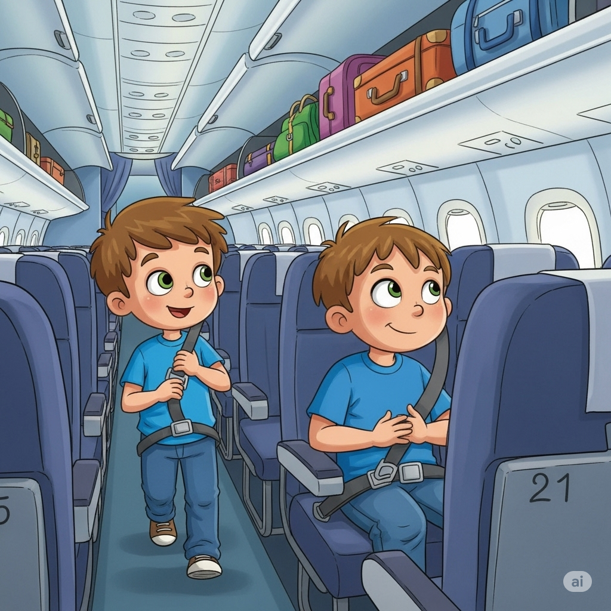
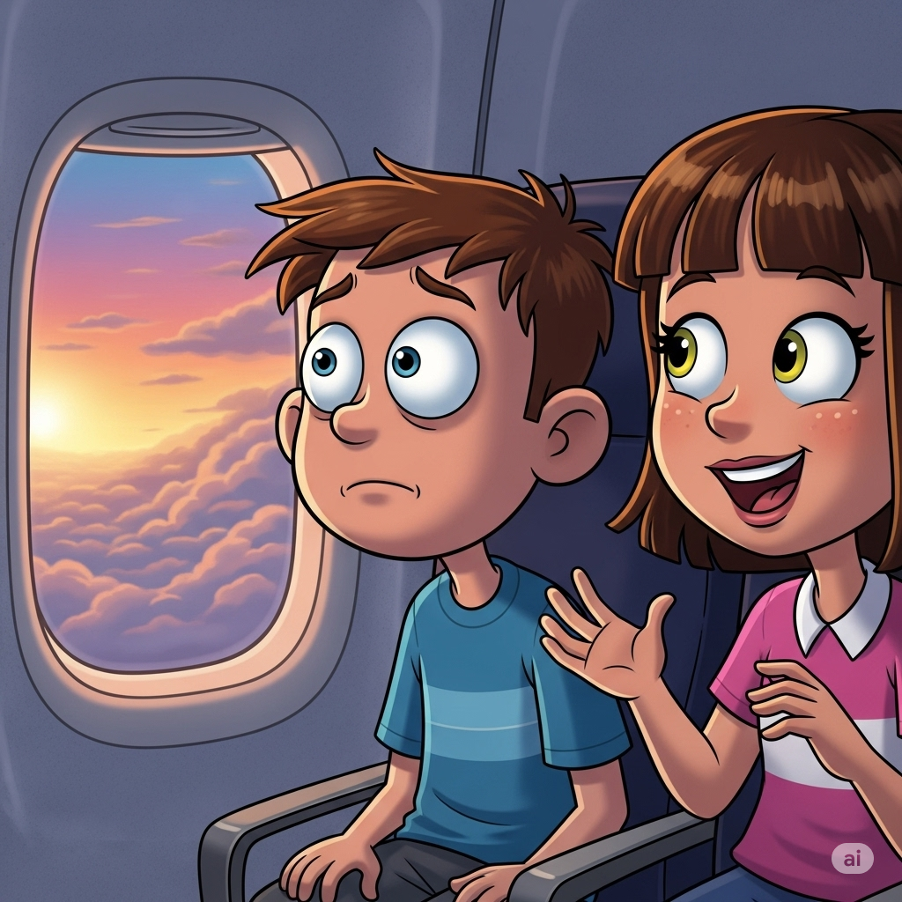
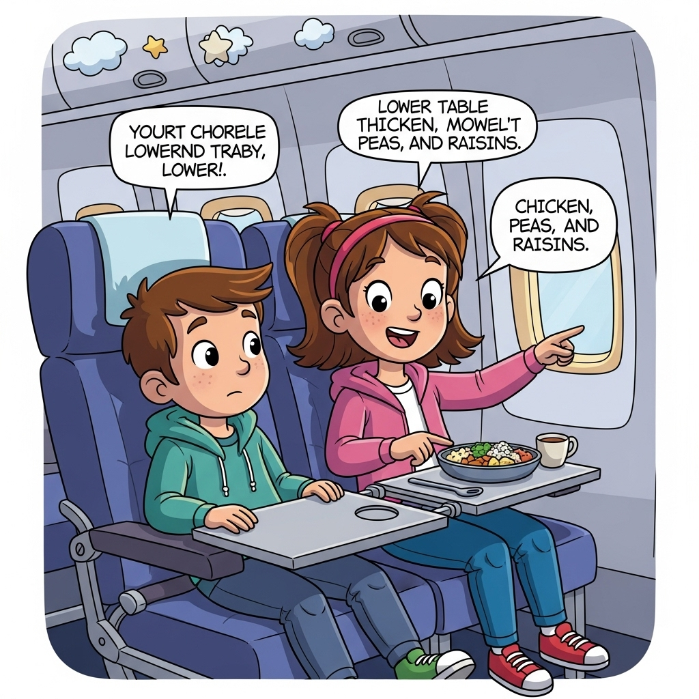
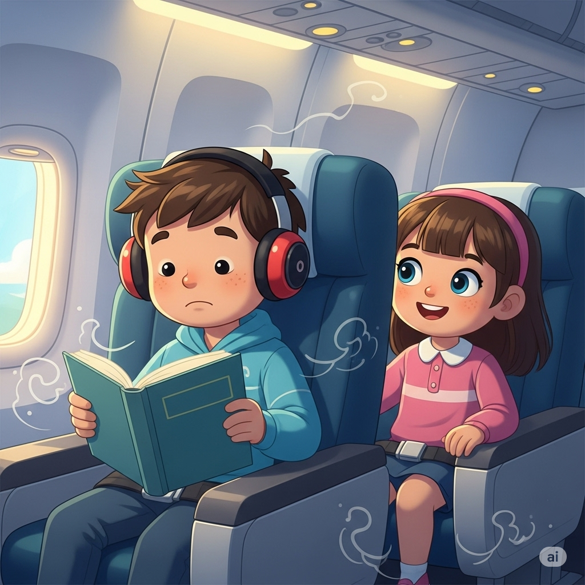
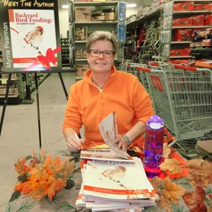
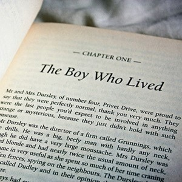
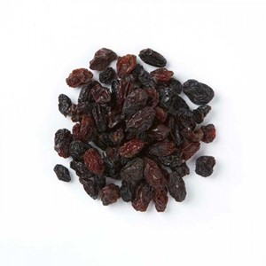

# Isaac’s First Plane Trip

Isaac’s family was going on vacation. He was excited about the trip except for one thing. He had never been on a plane before. He was scared that his plane would have a **breakdown**.

Isaac got onto the plane. He walked down the **aisle** until he found his seat. He sat down and **connected** the ends of his seat belt. After being **idle** for a few minutes, the pilot announced that they were ready to leave.

He looked out the window at the **vivid** colors of the sky. He began to feel scared. The girl sitting next to him said, “Hi, I’m Rachel! You look nervous, but you don’t need to be. Flying is fun!”

“I’m still a bit nervous,” Issac said, “and I’m getting hungry.”

“The food service will begin soon. Just lower the **tray** on the seat in front of you, and **flip** this switch. Then they’ll bring your dinner! Last time, they served chicken, **peas**, and a box of **raisins**,” Rachel explained.

Then the pilot **notified** the passengers of bad conditions in the **atmosphere**. “We’re tracking the weather: lightning, clouds, **etc**. The ride might get a bit rough,” he **stated**.

Suddenly, the plane started to shake. Isaac was badly **afflicted** by his fear. His stomach hurt, and he thought he might **vomit**. He couldn’t believe that he was in such an **unfortunate** place. Finally, the shaking stopped. Isaac was still scared, but he tried to **retain** a good attitude.

“The first time I flew, the plane shook so bad that **cargo** started falling. My parents told me to listen to music and read a **chapter** in my book. It calmed me,” Rachel said.

Suddenly, the plane shook again. This time, Isaac followed Rachel’s advice. He put on headphones and took out a book by his favorite **author**. The book and the music helped Isaac feel better. After a while, he didn’t even notice the bad weather. The bad situation didn’t feel so bad after someone helped him.

---

Isaac’s family was going on vacation.

He was excited about the trip except for one thing.

He had never been on a plane before.

He was scared that his plane would have a **breakdown**.

Isaac got onto the plane.

He walked down the **aisle** until he found his seat.

He sat down and **connected** the ends of his seat belt.

After being **idle** for a few minutes, the pilot announced that they were ready to leave.

He looked out the window at the **vivid** colors of the sky.

He began to feel scared.

The girl sitting next to him said, “Hi, I’m Rachel!

You look nervous, but you don’t need to be.

Flying is fun!”

“I’m still a bit nervous,” Issac said, “and I’m getting hungry.”

“The food service will begin soon.

Just lower the **tray** on the seat in front of you, and **flip** this switch.

Then they’ll bring your dinner!

Last time, they served chicken, **peas**, and a box of **raisins**,” Rachel explained.

Then the pilot **notified** the passengers of bad conditions in the **atmosphere**.

“We’re tracking the weather: lightning, clouds, **etc**.

The ride might get a bit rough,” he **stated**.

Suddenly, the plane started to shake.

Isaac was badly **afflicted** by his fear.

His stomach hurt, and he thought he might **vomit**.

He couldn’t believe that he was in such an **unfortunate** place.

Finally, the shaking stopped.

Isaac was still scared, but he tried to **retain** a good attitude.

“The first time I flew, the plane shook so bad that **cargo** started falling.

My parents told me to listen to music and read a **chapter** in my book.

It calmed me,” Rachel said.

Suddenly, the plane shook again.

This time, Isaac followed Rachel’s advice.

He put on headphones and took out a book by his favorite **author**.

The book and the music helped Isaac feel better.

After a while, he didn’t even notice the bad weather.

The bad situation didn’t feel so bad after someone helped him.

---

## 1. afflicted adj

*   **Nghĩa trong câu truyện:** Isaac was badly **afflicted** by his fear.
*   **Nghĩa thường gặp:** Bị ảnh hưởng hoặc gây ra đau khổ, bệnh tật, hoặc khó khăn.
*   **Ví dụ 12 thì:**
    *   **Present Simple:** The disease afflicts many people in the region.
    *   **Present Continuous:** She is currently being afflicted by a severe headache.
    *   **Present Perfect:** He has been afflicted with chronic pain for years.
    *   **Present Perfect Continuous:** They have been being afflicted by financial problems since the recession began.
    *   **Past Simple:** He was afflicted by doubt before making the decision.
    *   **Past Continuous:** While he was traveling, he was being afflicted by a strange illness.
    *   **Past Perfect:** Before the treatment, she had been afflicted by constant fatigue.
    *   **Past Perfect Continuous:** The community had been being afflicted by drought for months before the rain finally came.
    *   **Future Simple:** The new policy will afflict small businesses.
    *   **Future Continuous:** This time next year, he will be being afflicted by exam stress.
    *   **Future Perfect:** By the end of the century, many more areas will have been afflicted by rising sea levels.
    *   **Future Perfect Continuous:** By the time the aid arrives, the villagers will have been being afflicted by hunger for weeks.

## 2. aisle n

*   **Nghĩa trong câu truyện:** He walked down the **aisle** until he found his seat.
*   **Nghĩa thường gặp:** Lối đi giữa các hàng ghế (trong nhà thờ, rạp hát, máy bay, siêu thị, v.v.).
*   **Ví dụ 12 thì:**
    *   **Present Simple:** She always chooses an aisle seat.
    *   **Present Continuous:** He is walking down the aisle now.
    *   **Present Perfect:** They have walked down that aisle many times.
    *   **Present Perfect Continuous:** We have been walking down this aisle looking for milk for ten minutes.
    *   **Past Simple:** I found my seat in the aisle.
    *   **Past Continuous:** While I was boarding, someone was blocking the aisle.
    *   **Past Perfect:** Before the ceremony, the flowers had been placed along the aisle.
    *   **Past Perfect Continuous:** The ushers had been clearing the aisle for an hour before the guests arrived.
    *   **Future Simple:** I will meet you in the aisle.
    *   **Future Continuous:** This time tomorrow, we will be walking down the aisle.
    *   **Future Perfect:** By the time the plane lands, the flight attendants will have cleared the aisles.
    *   **Future Perfect Continuous:** By the end of the service, the bride will have been standing at the end of the aisle for an hour.

## 3. atmosphere n

*   **Nghĩa trong câu truyện:** Then the pilot notified the passengers of bad conditions in the **atmosphere**.
*   **Nghĩa thường gặp:** Lớp khí bao quanh một hành tinh; hoặc không khí, bầu không khí của một địa điểm hoặc tình huống.
*   **Ví dụ 12 thì:**
    *   **Present Simple:** The Earth's atmosphere protects us from radiation.
    *   **Present Continuous:** The atmosphere is becoming increasingly polluted.
    *   **Present Perfect:** Scientists have studied the atmosphere for centuries.
    *   **Present Perfect Continuous:** Researchers have been studying the upper atmosphere for decades.
    *   **Past Simple:** The atmosphere felt tense before the announcement.
    *   **Past Continuous:** While we were hiking, the atmosphere was clear and crisp.
    *   **Past Perfect:** Before the storm, the atmosphere had been unusually still.
    *   **Past Perfect Continuous:** The team had been monitoring the atmosphere for signs of change all night.
    *   **Future Simple:** The atmosphere will likely change with global warming.
    *   **Future Continuous:** Tomorrow, they will be analyzing samples from the atmosphere.
    *   **Future Perfect:** By 2050, the composition of the atmosphere will have changed significantly.
    *   **Future Perfect Continuous:** By the time the mission ends, the satellite will have been collecting data on the atmosphere for five years.

## 4. author n

*   **Nghĩa trong câu truyện:** He put on headphones and took out a book by his favorite **author**.
*   **Nghĩa thường gặp:** Người viết sách, kịch, bài báo, v.v.
*   **Ví dụ 12 thì:**
    *   **Present Simple:** This author writes historical novels.
    *   **Present Continuous:** The author is signing books at the moment.
    *   **Present Perfect:** She has become a famous author.
    *   **Present Perfect Continuous:** He has been working as an author for twenty years.
    *   **Past Simple:** The author released a new book last month.
    *   **Past Continuous:** While I was reading, the author was giving an interview on TV.
    *   **Past Perfect:** Before he became a teacher, he had been a published author.
    *   **Past Perfect Continuous:** She had been writing as a freelance author for years before getting a book deal.
    *   **Future Simple:** He will be a successful author one day.
    *   **Future Continuous:** This time next year, she will be promoting her new book as a bestselling author.
    *   **Future Perfect:** By the end of the year, she will have finished her third novel as an author.
    *   **Future Perfect Continuous:** By the time the conference starts, the author will have been traveling for 12 hours.

## 5. breakdown n

*   **Nghĩa trong câu truyện:** He was scared that his plane would have a **breakdown**.
*   **Nghĩa thường gặp:** Sự cố, hỏng hóc (của máy móc, phương tiện); sự suy sụp tinh thần hoặc thể chất.
*   **Ví dụ 12 thì:**
    *   **Present Simple:** The old car often has a breakdown.
    *   **Present Continuous:** The system is having a breakdown right now.
    *   **Present Perfect:** We have had three breakdowns this month.
    *   **Present Perfect Continuous:** The factory has been having breakdowns frequently lately.
    *   **Past Simple:** The bus had a breakdown on the highway.
    *   **Past Continuous:** While we were driving, the engine was having a breakdown.
    *   **Past Perfect:** Before they replaced the part, the machine had had several breakdowns.
    *   **Past Perfect Continuous:** The old computer system had been having breakdowns for weeks before it was finally replaced.
    *   **Future Simple:** I hope the car won't have a breakdown on our trip.
    *   **Future Continuous:** Don't worry, the new equipment won't be having a breakdown anytime soon.
    *   **Future Perfect:** By the end of the journey, the truck will have had a breakdown if it's not repaired.
    *   **Future Perfect Continuous:** By the time the mechanics arrive, the machine will have been having a breakdown for hours.

## 6. cargo n

*   **Nghĩa trong câu truyện:** “The first time I flew, the plane shook so bad that **cargo** started falling.”
*   **Nghĩa thường gặp:** Hàng hóa được vận chuyển bằng tàu, máy bay, xe tải, v.v.
*   **Ví dụ 12 thì:**
    *   **Present Simple:** The ship carries various types of cargo.
    *   **Present Continuous:** The plane is loading cargo now.
    *   **Present Perfect:** They have transported a lot of cargo this week.
    *   **Present Perfect Continuous:** The company has been shipping cargo overseas for years.
    *   **Past Simple:** The cargo shifted during the storm.
    *   **Past Continuous:** While the ship was sailing, the crew was securing the cargo.
    *   **Past Perfect:** Before the inspection, all the cargo had been unloaded.
    *   **Past Perfect Continuous:** The dockworkers had been handling the cargo since early morning.
    *   **Future Simple:** The train will deliver the cargo tomorrow.
    *   **Future Continuous:** This time tomorrow, they will be inspecting the cargo.
    *   **Future Perfect:** By the end of the day, they will have loaded all the cargo.
    *   **Future Perfect Continuous:** By the time the ship reaches port, it will have been carrying the cargo for two weeks.

## 7. chapter n

*   **Nghĩa trong câu truyện:** My parents told me to listen to music and read a **chapter** in my book.
*   **Nghĩa thường gặp:** Một phần chính của cuốn sách hoặc tài liệu; một giai đoạn trong cuộc đời hoặc lịch sử.
*   **Ví dụ 12 thì:**
    *   **Present Simple:** This book has ten chapters.
    *   **Present Continuous:** I am reading the final chapter now.
    *   **Present Perfect:** She has finished reading the first chapter.
    *   **Present Perfect Continuous:** He has been working on this chapter for three hours.
    *   **Past Simple:** I read the first chapter last night.
    *   **Past Continuous:** While I was studying, my friend was writing a chapter for his thesis.
    *   **Past Perfect:** Before I lent you the book, I had already read the first chapter.
    *   **Past Perfect Continuous:** She had been revising the same chapter all morning before taking a break.
    *   **Future Simple:** I will read the next chapter tonight.
    *   **Future Continuous:** This time tomorrow, I will be reading the third chapter.
    *   **Future Perfect:** By the weekend, I will have finished the entire chapter.
    *   **Future Perfect Continuous:** By the time the class starts, I will have been reading this chapter for an hour.

## 8. connect v

*   **Nghĩa trong câu truyện:** He sat down and **connected** the ends of his seat belt.
*   **Nghĩa thường gặp:** Nối, kết nối; liên kết.
*   **Ví dụ 12 thì:**
    *   **Present Simple:** This bridge connects the two cities.
    *   **Present Continuous:** He is connecting the wires now.
    *   **Present Perfect:** They have connected to the internet.
    *   **Present Perfect Continuous:** We have been connecting these pipes all morning.
    *   **Past Simple:** I connected the device to the computer.
    *   **Past Continuous:** While I was working, she was connecting the printer.
    *   **Past Perfect:** Before I left, I had connected all the cables.
    *   **Past Perfect Continuous:** The technicians had been connecting the system for hours before it finally worked.
    *   **Future Simple:** I will connect the phone to the charger.
    *   **Future Continuous:** This time tomorrow, they will be connecting the new network.
    *   **Future Perfect:** By the time you arrive, I will have connected everything.
    *   **Future Perfect Continuous:** By the end of the day, he will have been connecting devices for eight hours.

## 9. etc n

*   **Nghĩa trong câu truyện:** “We’re tracking the weather: lightning, clouds, **etc**.”
*   **Nghĩa thường gặp:** Viết tắt của "et cetera", được sử dụng ở cuối danh sách để chỉ rằng còn nhiều mục tương tự khác.
*   **Ví dụ về cách dùng:**
    *   **Present Simple:** The list includes fruits like apples, bananas, oranges, etc.
    *   **Present Continuous:** We are discussing plans, budget, timeline, etc.
    *   **Present Perfect:** They have covered topics like history, geography, etc., in the exam.
    *   **Present Perfect Continuous:** He has been mentioning his hobbies like reading, swimming, etc., during the interview.
    *   **Past Simple:** The report listed expenses for travel, accommodation, etc.
    *   **Past Continuous:** While packing, she was gathering clothes, shoes, toiletries, etc.
    *   **Past Perfect:** Before the meeting, they had prepared documents, presentations, etc.
    *   **Past Perfect Continuous:** The team had been collecting data on temperature, humidity, etc., for weeks.
    *   **Future Simple:** The store will sell groceries, household items, etc.
    *   **Future Continuous:** Tomorrow, we will be buying supplies like paper, pens, notebooks, etc.
    *   **Future Perfect:** By the deadline, they will have completed the main tasks, reports, etc.
    *   **Future Perfect Continuous:** By the time the project is finished, they will have been managing resources, schedules, etc., for months.

## 10. flip v

*   **Nghĩa trong câu truyện:** Just lower the **tray** on the seat in front of you, and **flip** this switch.
*   **Nghĩa thường gặp:** Lật, búng, hất nhẹ; chuyển đổi trạng thái nhanh chóng.
*   **Ví dụ 12 thì:**
    *   **Present Simple:** He flips the coin to decide.
    *   **Present Continuous:** She is flipping through the channels.
    *   **Present Perfect:** I have flipped the switch.
    *   **Present Perfect Continuous:** They have been flipping pancakes all morning.
    *   **Past Simple:** He flipped the page quickly.
    *   **Past Continuous:** While I was watching, the chef was flipping the omelet.
    *   **Past Perfect:** Before I entered, someone had already flipped the sign to 'Open'.
    *   **Past Perfect Continuous:** She had been flipping through old photos for an hour before she found the one she wanted.
    *   **Future Simple:** I will flip the card over.
    *   **Future Continuous:** This time tomorrow, he will be flipping burgers at the BBQ.
    *   **Future Perfect:** By the time you get here, I will have flipped the mattress.
    *   **Future Perfect Continuous:** By the end of the game, he will have been flipping cards for two hours.

## 11. idle adj

*   **Nghĩa trong câu truyện:** After being **idle** for a few minutes, the pilot announced that they were ready to leave.
*   **Nghĩa thường gặp:** Không hoạt động, rảnh rỗi; lười biếng; không có mục đích.
*   **Ví dụ 12 thì (sử dụng với động từ 'to be'):**
    *   **Present Simple:** The factory is idle on Sundays.
    *   **Present Continuous:** He is being idle instead of working.
    *   **Present Perfect:** The machinery has been idle since the shutdown.
    *   **Present Perfect Continuous:** The workers have been being idle because of the power cut.
    *   **Past Simple:** The car was idle at the traffic light.
    *   **Past Continuous:** While the boss was away, the employees were being idle.
    *   **Past Perfect:** Before the new order came, the production line had been idle for a week.
    *   **Past Perfect Continuous:** The computer had been being idle for so long that it went into sleep mode.
    *   **Future Simple:** The equipment will be idle until the repairs are finished.
    *   **Future Continuous:** This time tomorrow, the office will be being idle during the holiday.
    *   **Future Perfect:** By next month, the construction site will have been idle for three months.
    *   **Future Perfect Continuous:** By the end of the year, the old factory will have been being idle for over a decade.

## 12. notify v

*   **Nghĩa trong câu truyện:** Then the pilot **notified** the passengers of bad conditions in the atmosphere.
*   **Nghĩa thường gặp:** Thông báo, báo cho ai biết về điều gì đó.
*   **Ví dụ 12 thì:**
    *   **Present Simple:** The system notifies users of updates.
    *   **Present Continuous:** The secretary is notifying the staff about the meeting.
    *   **Present Perfect:** They have notified all the applicants.
    *   **Present Perfect Continuous:** The company has been notifying customers about the changes all week.
    *   **Past Simple:** I notified the police about the incident.
    *   **Past Continuous:** While I was waiting, they were notifying the next patient.
    *   **Past Perfect:** Before I left, I had notified my manager.
    *   **Past Perfect Continuous:** The school had been notifying parents about the closure since morning.
    *   **Future Simple:** We will notify you of the results next week.
    *   **Future Continuous:** This time next week, they will be notifying the winners.
    *   **Future Perfect:** By the end of the day, I will have notified everyone on the list.
    *   **Future Perfect Continuous:** By the time the event starts, they will have been notifying attendees for a month.

## 13. pea n

*   **Nghĩa trong câu truyện:** Last time, they served chicken, **peas**, and a box of raisins.
*   **Nghĩa thường gặp:** Hạt tròn nhỏ màu xanh, mọc trong vỏ, được dùng làm rau.
*   **Ví dụ 12 thì (sử dụng trong câu):**
    *   **Present Simple:** She likes to eat peas with her dinner.
    *   **Present Continuous:** We are planting peas in the garden this week.
    *   **Present Perfect:** I have never eaten fresh peas before.
    *   **Present Perfect Continuous:** They have been growing peas in their garden for years.
    *   **Past Simple:** I ate peas for lunch yesterday.
    *   **Past Continuous:** While I was cooking, the children were shelling peas.
    *   **Past Perfect:** Before I added the vegetables, I had already boiled the peas.
    *   **Past Perfect Continuous:** The farmers had been harvesting peas all morning before the rain started.
    *   **Future Simple:** I will buy some peas at the market.
    *   **Future Continuous:** This time tomorrow, we will be picking peas from the vine.
    *   **Future Perfect:** By the end of the summer, we will have harvested all the peas.
    *   **Future Perfect Continuous:** By the time the market opens, the vendors will have been selling peas since dawn.

## 14. raisin n

*   **Nghĩa trong câu truyện:** Last time, they served chicken, peas, and a box of **raisins**.
*   **Nghĩa thường gặp:** Quả nho đã sấy khô, ngọt.
*   **Ví dụ 12 thì (sử dụng trong câu):**
    *   **Present Simple:** Raisins are a good source of energy.
    *   **Present Continuous:** She is adding raisins to the cookie dough now.
    *   **Present Perfect:** I have never liked raisins.
    *   **Present Perfect Continuous:** They have been including raisins in their trail mix for years.
    *   **Past Simple:** I ate a handful of raisins.
    *   **Past Continuous:** While I was baking, my sister was snacking on raisins.
    *   **Past Perfect:** Before I made the cake, I had soaked the raisins.
    *   **Past Perfect Continuous:** The children had been eating raisins from the box all afternoon.
    *   **Future Simple:** I will put some raisins in my oatmeal.
    *   **Future Continuous:** This time tomorrow, she will be packing raisins for the trip.
    *   **Future Perfect:** By the end of the week, I will have eaten all the raisins.
    *   **Future Perfect Continuous:** By the time the recipe is finished, he will have been adding raisins for ten minutes.

## 15. retain v

*   **Nghĩa trong câu truyện:** Isaac was still scared, but he tried to **retain** a good attitude.
*   **Nghĩa thường gặp:** Giữ lại, duy trì; ghi nhớ.
*   **Ví dụ 12 thì:**
    *   **Present Simple:** This material retains heat well.
    *   **Present Continuous:** He is retaining his composure despite the pressure.
    *   **Present Perfect:** She has retained her fluency in French.
    *   **Present Perfect Continuous:** They have been retaining the same staff for years.
    *   **Past Simple:** I retained the information easily.
    *   **Past Continuous:** While the situation was difficult, he was retaining a positive outlook.
    *   **Past Perfect:** Before the update, the system had retained old data.
    *   **Past Perfect Continuous:** The company had been retaining its market share despite increased competition.
    *   **Future Simple:** You will retain this knowledge if you practice.
    *   **Future Continuous:** This time tomorrow, I will be retaining the key points from the lecture.
    *   **Future Perfect:** By the end of the course, you will have retained a lot of new vocabulary.
    *   **Future Perfect Continuous:** By the time he retires, he will have been retaining his position as CEO for twenty years.

## 16. state v

*   **Nghĩa trong câu truyện:** The ride might get a bit rough,” he **stated**.
*   **Nghĩa thường gặp:** Phát biểu, tuyên bố, nói rõ.
*   **Ví dụ 12 thì:**
    *   **Present Simple:** The report states the facts clearly.
    *   **Present Continuous:** The witness is stating his version of events.
    *   **Present Perfect:** The contract has stated the terms and conditions.
    *   **Present Perfect Continuous:** The politician has been stating his position on the issue all week.
    *   **Past Simple:** He stated his opinion firmly.
    *   **Past Continuous:** While the meeting was ongoing, the chairman was stating the company's goals.
    *   **Past Perfect:** Before the decision was made, all parties had stated their concerns.
    *   **Past Perfect Continuous:** The official had been stating the regulations repeatedly.
    *   **Future Simple:** I will state my intentions tomorrow.
    *   **Future Continuous:** This time next week, the president will be stating the new policy.
    *   **Future Perfect:** By the end of the speech, he will have stated his main arguments.
    *   **Future Perfect Continuous:** By the time the press conference finishes, she will have been stating the company's position for an hour.

## 17. tray n

*   **Nghĩa trong câu truyện:** Just lower the **tray** on the seat in front of you, and flip this switch.
*   **Nghĩa thường gặp:** Cái khay, mâm.
*   **Ví dụ 12 thì (sử dụng trong câu):**
    *   **Present Simple:** The waiter carries the drinks on a tray.
    *   **Present Continuous:** She is putting the dishes on the tray now.
    *   **Present Perfect:** I have never used a serving tray like this.
    *   **Present Perfect Continuous:** They have been using that same tray for years.
    *   **Past Simple:** I put my food on the tray.
    *   **Past Continuous:** While I was eating, the flight attendant was collecting the trays.
    *   **Past Perfect:** Before the meal, the trays had been set out.
    *   **Past Perfect Continuous:** The kitchen staff had been preparing the trays since morning.
    *   **Future Simple:** I will bring you a tray for your tea.
    *   **Future Continuous:** This time tomorrow, the students will be returning their lunch trays.
    *   **Future Perfect:** By the time the party is over, all the trays will have been emptied.
    *   **Future Perfect Continuous:** By the end of the shift, the dishwasher will have been cleaning trays for eight hours.

## 18. unfortunate adj

*   **Nghĩa trong câu truyện:** He couldn’t believe that he was in such an **unfortunate** place.
*   **Nghĩa thường gặp:** Không may mắn, đáng tiếc; gây ra sự không may.
*   **Ví dụ 12 thì (sử dụng với động từ 'to be'):**
    *   **Present Simple:** It is an unfortunate situation.
    *   **Present Continuous:** He is being unfortunate in his recent attempts.
    *   **Present Perfect:** There has been an unfortunate delay.
    *   **Present Perfect Continuous:** The team has been being unfortunate with injuries all season.
    *   **Past Simple:** The accident was unfortunate.
    *   **Past Continuous:** While they were trying their best, the circumstances were being unfortunate.
    *   **Past Perfect:** Before the rescue, their situation had been truly unfortunate.
    *   **Past Perfect Continuous:** The family had been being unfortunate with bad luck for years.
    *   **Future Simple:** It will be unfortunate if they miss the train.
    *   **Future Continuous:** This time tomorrow, the weather will be being unfortunate for our picnic.
    *   **Future Perfect:** By the time the event starts, the cancellation will have been an unfortunate outcome.
    *   **Future Perfect Continuous:** By the end of the trial, the defendant will have been being unfortunate in his legal battles for months.

## 19. vivid adj

*   **Nghĩa trong câu truyện:** He looked out the window at the **vivid** colors of the sky.
*   **Nghĩa thường gặp:** Sống động, rực rỡ (màu sắc); rõ ràng, mạnh mẽ (ký ức, trí tưởng tượng).
*   **Ví dụ 12 thì (sử dụng với động từ 'to be'):**
    *   **Present Simple:** The colors in the painting are vivid.
    *   **Present Continuous:** The sky is being particularly vivid this evening.
    *   **Present Perfect:** Her description has been very vivid.
    *   **Present Perfect Continuous:** The artist has been being vivid in his use of color lately.
    *   **Past Simple:** The memory was vivid in my mind.
    *   **Past Continuous:** While I was dreaming, the images were being incredibly vivid.
    *   **Past Perfect:** Before the accident, his recollection of the event had been very vivid.
    *   **Past Perfect Continuous:** The storyteller had been being vivid in his descriptions all night.
    *   **Future Simple:** The sunset will be vivid tonight.
    *   **Future Continuous:** This time tomorrow, the flowers in the garden will be being vivid after the rain.
    *   **Future Perfect:** By the time the exhibition opens, the paintings will have been vivid for months.
    *   **Future Perfect Continuous:** By the end of the trip, her memories will have been being vivid for a long time.

## 20. vomit v

*   **Nghĩa trong câu truyện:** His stomach hurt, and he thought he might **vomit**.
*   **Nghĩa thường gặp:** Nôn mửa, ói.
*   **Ví dụ 12 thì:**
    *   **Present Simple:** He sometimes vomits when he is seasick.
    *   **Present Continuous:** She is vomiting now because she ate something bad.
    *   **Present Perfect:** He has vomited twice this morning.
    *   **Present Perfect Continuous:** The patient has been vomiting since midnight.
    *   **Past Simple:** I felt sick and vomited.
    *   **Past Continuous:** While the car was moving, the child was vomiting.
    *   **Past Perfect:** Before the doctor arrived, he had already vomited several times.
    *   **Past Perfect Continuous:** She had been vomiting for an hour before they took her to the hospital.
    *   **Future Simple:** If you eat that, you will vomit.
    *   **Future Continuous:** This time tomorrow, he will be vomiting if he doesn't take the medicine.
    *   **Future Perfect:** By the time the nurse checks on him, he will have vomited again.
    *   **Future Perfect Continuous:** By the end of the night, the sick child will have been vomiting for many hours.