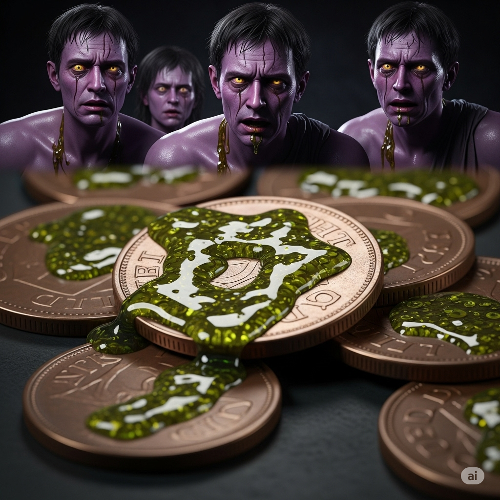
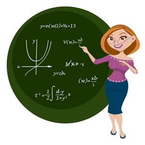
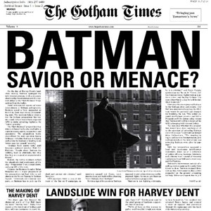
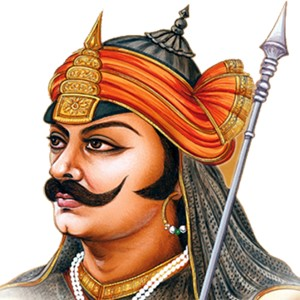
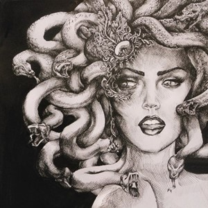
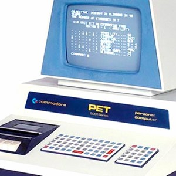
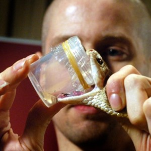

# The Teller and the Thieves

A **teller** at a bank suspected some of her fellow employees of not being very **trustworthy**. She thought they were stealing. In order to catch them, though, she needed some way to link them to the crime.

She had a **background** in **religion** and **folklore**. She remembered that one **religion**’s **literature** had a **myth** that **chronicled** how a group of thieves was captured.

In the **millennium**-old story, coins of **copper** were covered with **venom** taken from a poisonous snake. The coins were left as **bait** for the robbers. When they touched the coins, the **venom** **infected** their bodies through their skin. The **venom** ran through their **veins**, and they all became very sick as if they had a **disease**. It made their skin purple. The police arrested whoever had purple skin.

She knew she couldn’t use **venom** because it might hurt someone. However, she thought of a way to **update** the old story. She decided to cover a **sum** of money with a special powder. If people touched the money, the powder would cause their skin to **itch**. She placed the stack of money in the bank’s safe. No one was supposed to take money from the safe. If somebody did, then they had to be stealing.

Within a few hours, three of her coworkers were scratching their hands and arms. They **itched** so badly that they couldn’t even work. She checked the money, and it was gone. She told her boss what she had done, and he had the thieves arrested. He thanked her and **promoted** her.

Because events from history often repeat, ancient **literature** had helped the **teller** solve a crime. She proved that stories from the past still **relate** with the problems of today, and they can be helpful in solving problems.

---

A **teller** at a bank suspected some of her fellow employees of not being very **trustworthy**.

She thought they were stealing.

In order to catch them, though, she needed some way to link them to the crime.

She had a **background** in **religion** and **folklore**.

She remembered that one **religion**’s **literature** had a **myth** that **chronicled** how a group of thieves was captured.

In the **millennium**-old story, coins of **copper** were covered with **venom** taken from a poisonous snake.

The coins were left as **bait** for the robbers.

When they touched the coins, the **venom** **infected** their bodies through their skin.

The **venom** ran through their **veins**, and they all became very sick as if they had a **disease**.

It made their skin purple.

The police arrested whoever had purple skin.

She knew she couldn’t use **venom** because it might hurt someone.

However, she thought of a way to **update** the old story.

She decided to cover a **sum** of money with a special powder.

If people touched the money, the powder would cause their skin to **itch**.

She placed the stack of money in the bank’s safe.

No one was supposed to take money from the safe.

If somebody did, then they had to be stealing.

Within a few hours, three of her coworkers were scratching their hands and arms.

They **itched** so badly that they couldn’t even work.

She checked the money, and it was gone.

She told her boss what she had done, and he had the thieves arrested.

He thanked her and **promoted** her.

Because events from history often repeat, ancient **literature** had helped the **teller** solve a crime.

She proved that stories from the past still **relate** with the problems of today, and they can be helpful in solving problems.

---

## 1. background n

*   **Nghĩa trong câu truyện:** Kinh nghiệm hoặc kiến thức trước đó.
*   **Nghĩa thường gặp:** Bối cảnh; nền tảng kiến thức, kinh nghiệm; phần phía sau của một bức tranh hoặc cảnh vật.
*   **Câu trong câu truyện:** She had a **background** in **religion** and **folklore**.
*   **12 ví dụ:**
    *   Present Simple: She has a strong **background** in science.
    *   Present Continuous: He is currently building his **background** in marketing.
    *   Present Perfect: They have gained valuable **background** experience over the years.
    *   Present Perfect Continuous: I have been working on my technical **background** for months.
    *   Past Simple: He mentioned his diverse **background** during the interview.
    *   Past Continuous: While I was studying, I was also developing my professional **background**.
    *   Past Perfect: By the time she applied, she had already established a solid **background**.
    *   Past Perfect Continuous: He had been researching the historical **background** of the event for weeks.
    *   Future Simple: She will use her artistic **background** in this project.
    *   Future Continuous: This time next year, I will be expanding my **background** in renewable energy.
    *   Future Perfect: By the end of the course, you will have a good **background** in programming.
    *   Future Perfect Continuous: By the time the project starts, we will have been building our team's **background** for a year.

## 2. bait n

*   **Nghĩa trong câu truyện:** Mồi nhử, thứ dùng để dụ dỗ ai đó vào bẫy.
*   **Nghĩa thường gặp:** Mồi (để câu cá, bẫy động vật); sự cám dỗ, mồi nhử.
*   **Câu trong câu truyện:** The coins were left as **bait** for the robbers.
*   **12 ví dụ:**
    *   Present Simple: He uses worms as **bait** when fishing.
    *   Present Continuous: They are setting up the **bait** now.
    *   Present Perfect: The trap has been set with the perfect **bait**.
    *   Present Perfect Continuous: We have been preparing the **bait** since morning.
    *   Past Simple: The mouse took the **bait**.
    *   Past Continuous: The fish were ignoring the **bait** I was using.
    *   Past Perfect: By the time we arrived, the **bait** had already been taken.
    *   Past Perfect Continuous: They had been leaving **bait** out for days without success.
    *   Future Simple: We will need more **bait** for tomorrow's trip.
    *   Future Continuous: This evening, I will be putting out the **bait**.
    *   Future Perfect: By noon, all the **bait** will have been used.
    *   Future Perfect Continuous: By the time you get here, I will have been waiting with the **bait** for hours.

## 3. chronicle v

*   **Nghĩa trong câu truyện:** Ghi chép lại các sự kiện một cách chi tiết và theo trình tự thời gian.
*   **Nghĩa thường gặp:** Ghi chép lại (các sự kiện); biên niên sử.
*   **Câu trong câu truyện:** She remembered that one **religion**’s **literature** had a **myth** that **chronicled** how a group of thieves was captured.
*   **12 ví dụ:**
    *   Present Simple: The book **chronicles** the history of the city.
    *   Present Continuous: The journalist is **chronicling** the events as they happen.
    *   Present Perfect: Historians have **chronicled** many significant moments.
    *   Present Perfect Continuous: They have been **chronicling** the family's journey for generations.
    *   Past Simple: The diary **chronicled** her daily life.
    *   Past Continuous: The historian was **chronicling** the war when he was interrupted.
    *   Past Perfect: By the end of the year, she had **chronicled** all the major events.
    *   Past Perfect Continuous: He had been **chronicling** the expedition for months before it ended.
    *   Future Simple: I will **chronicle** my travels in a blog.
    *   Future Continuous: Tomorrow, she will be **chronicling** the conference proceedings.
    *   Future Perfect: By next week, the team will have **chronicled** the entire project development.
    *   Future Perfect Continuous: By the time the book is finished, the author will have been **chronicling** these events for years.

## 4. copper n

*   **Nghĩa trong câu truyện:** Đồng, một loại kim loại màu đỏ nâu dùng để đúc tiền xu.
*   **Nghĩa thường gặp:** Đồng (kim loại).
*   **Câu trong câu truyện:** In the **millennium**-old story, coins of **copper** were covered with **venom** taken from a poisonous snake.
*   **12 ví dụ:**
    *   Present Simple: **Copper** is a good conductor of electricity.
    *   Present Continuous: The factory is currently producing **copper** wire.
    *   Present Perfect: They have discovered a new source of **copper**.
    *   Present Perfect Continuous: Miners have been extracting **copper** from this site for decades.
    *   Past Simple: Ancient civilizations used **copper** tools.
    *   Past Continuous: Workers were installing **copper** pipes all morning.
    *   Past Perfect: By the time the project finished, they had used tons of **copper**.
    *   Past Perfect Continuous: He had been polishing the **copper** pots until they shone.
    *   Future Simple: We will need more **copper** for the new building.
    *   Future Continuous: Next month, they will be shipping **copper** overseas.
    *   Future Perfect: By the end of the year, the price of **copper** will have risen significantly.
    *   Future Perfect Continuous: By the time the mine closes, they will have been producing **copper** for over a century.

## 5. disease n

*   **Nghĩa trong câu truyện:** Bệnh tật, ốm đau.
*   **Nghĩa thường gặp:** Bệnh, căn bệnh.
*   **Câu trong câu truyện:** The **venom** ran through their **veins**, and they all became very sick as if they had a **disease**.
*   **12 ví dụ:**
    *   Present Simple: This **disease** affects millions of people.
    *   Present Continuous: Scientists are currently studying the spread of the **disease**.
    *   Present Perfect: They have found a cure for the **disease**.
    *   Present Perfect Continuous: Researchers have been working on this **disease** for years.
    *   Past Simple: The **disease** spread rapidly last year.
    *   Past Continuous: While he was traveling, he contracted a rare **disease**.
    *   Past Perfect: By the time help arrived, the **disease** had already taken many lives.
    *   Past Perfect Continuous: The community had been fighting the **disease** for months.
    *   Future Simple: A new vaccine will prevent the **disease**.
    *   Future Continuous: Next year, they will be monitoring the **disease** outbreak closely.
    *   Future Perfect: By the end of the decade, this **disease** will have been eradicated.
    *   Future Perfect Continuous: By the time the trial ends, they will have been testing the treatment for the **disease** for two years.

## 6. folklore n

*   **Nghĩa trong câu truyện:** Văn hóa dân gian, bao gồm các truyền thuyết, phong tục, truyện cổ được truyền miệng qua nhiều thế hệ.
*   **Nghĩa thường gặp:** Văn hóa dân gian, truyện dân gian, phong tục truyền thống.
*   **Câu trong câu truyện:** She had a **background** in **religion** and **folklore**.
*   **12 ví dụ:**
    *   Present Simple: Local **folklore** tells of a hidden treasure.
    *   Present Continuous: Anthropologists are currently studying the **folklore** of the region.
    *   Present Perfect: They have collected a vast amount of local **folklore**.
    *   Present Perfect Continuous: She has been researching ancient **folklore** for her book.
    *   Past Simple: I learned about that myth from Irish **folklore**.
    *   Past Continuous: While I was reading, I was discovering fascinating **folklore**.
    *   Past Perfect: By the time the book was published, he had documented all the local **folklore**.
    *   Past Perfect Continuous: They had been preserving the island's **folklore** for centuries.
    *   Future Simple: This festival will celebrate regional **folklore**.
    *   Future Continuous: Next semester, I will be teaching a course on European **folklore**.
    *   Future Perfect: By the end of the project, we will have recorded all the village's **folklore**.
    *   Future Perfect Continuous: By the time the museum opens, they will have been curating the **folklore** exhibit for a year.

## 7. infect v

*   **Nghĩa trong câu truyện:** Nhiễm độc, làm cho bị bệnh do chất độc (nọc độc).
*   **Nghĩa thường gặp:** Nhiễm bệnh, lây nhiễm; ảnh hưởng xấu.
*   **Câu trong câu truyện:** When they touched the coins, the **venom** **infected** their bodies through their skin.
*   **12 ví dụ:**
    *   Present Simple: The virus can **infect** computers quickly.
    *   Present Continuous: The wound is **infecting** rapidly.
    *   Present Perfect: The disease has **infected** many people.
    *   Present Perfect Continuous: The bacteria have been **infecting** the water supply.
    *   Past Simple: The bite **infected** his arm.
    *   Past Continuous: While the doctor was worried the cut was **infecting**.
    *   Past Perfect: By the time he saw a doctor, the area had already been severely **infected**.
    *   Past Perfect Continuous: The wound had been **infecting** for days before he noticed.
    *   Future Simple: This spray will prevent the area from becoming **infected**.
    *   Future Continuous: Tomorrow, they will be disinfecting the area to prevent it from **infecting** others.
    *   Future Perfect: By morning, the entire system will have been **infected**.
    *   Future Perfect Continuous: By the time the vaccine is ready, the disease will have been **infecting** the population for months.

## 8. itch v

*   **Nghĩa trong câu truyện:** Ngứa, cảm giác khó chịu trên da khiến muốn gãi.
*   **Nghĩa thường gặp:** Ngứa; cảm thấy bồn chồn hoặc rất muốn làm gì đó.
*   **Câu trong câu truyện:** If people touched the money, the powder would cause their skin to **itch**. / They **itched** so badly that they couldn’t even work.
*   **12 ví dụ:**
    *   Present Simple: My skin always **itches** in the summer.
    *   Present Continuous: My mosquito bite is **itching** right now.
    *   Present Perfect: I have never **itched** this much before.
    *   Present Perfect Continuous: My arm has been **itching** all day.
    *   Past Simple: My nose suddenly **itched**.
    *   Past Continuous: While I was sitting there, my leg was **itching**.
    *   Past Perfect: By the time I got home, the rash had **itched** for hours.
    *   Past Perfect Continuous: His hands had been **itching** since he touched the powder.
    *   Future Simple: This cream will stop the rash from **itching**.
    *   Future Continuous: Tonight, my sunburn will probably be **itching**.
    *   Future Perfect: By tomorrow, the irritation will have **itched** itself out.
    *   Future Perfect Continuous: By the time the medicine works, my skin will have been **itching** for a long time.

## 9. literature n

*   **Nghĩa trong câu truyện:** Văn học, các tác phẩm viết.
*   **Nghĩa thường gặp:** Văn học; tài liệu, sách báo về một chủ đề cụ thể.
*   **Câu trong câu truyện:** She remembered that one **religion**’s **literature** had a **myth** that **chronicled** how a group of thieves was captured. / Because events from history often repeat, ancient **literature** had helped the **teller** solve a crime.
*   **12 ví dụ:**
    *   Present Simple: English **literature** is a vast subject.
    *   Present Continuous: We are currently studying American **literature**.
    *   Present Perfect: I have read a lot of classic **literature**.
    *   Present Perfect Continuous: She has been teaching world **literature** for twenty years.
    *   Past Simple: I enjoyed the **literature** course last semester.
    *   Past Continuous: While I was on vacation, I was reading some interesting **literature**.
    *   Past Perfect: By the time he finished his degree, he had studied a wide range of **literature**.
    *   Past Perfect Continuous: They had been discussing the **literature** for hours before the meeting ended.
    *   Future Simple: I will buy some new **literature** for my studies.
    *   Future Continuous: Next year, I will be exploring French **literature**.
    *   Future Perfect: By the end of the course, you will have covered all the required **literature**.
    *   Future Perfect Continuous: By the time the conference starts, she will have been reviewing the relevant **literature** for months.

## 10. millennium n

*   **Nghĩa trong câu truyện:** Thiên niên kỷ, khoảng thời gian một nghìn năm.
*   **Nghĩa thường gặp:** Thiên niên kỷ (một nghìn năm).
*   **Câu trong câu truyện:** In the **millennium**-old story, coins of **copper** were covered with **venom** taken from a poisonous snake.
*   **12 ví dụ:**
    *   Present Simple: The new **millennium** began in 2001.
    *   Present Continuous: We are living in the third **millennium**.
    *   Present Perfect: The city has existed for over a **millennium**.
    *   Present Perfect Continuous: The ancient forest has been growing for a **millennium**.
    *   Past Simple: The second **millennium** ended in 2000.
    *   Past Continuous: While the empire was flourishing, it was entering its second **millennium**.
    *   Past Perfect: By the year 1000, the civilization had existed for a **millennium**.
    *   Past Perfect Continuous: The ancient tradition had been practiced for a **millennium** before it stopped.
    *   Future Simple: The monument will stand for another **millennium**.
    *   Future Continuous: In the next **millennium**, humanity will be exploring distant galaxies.
    *   Future Perfect: By the year 3000, we will have completed three **millennia** since the common era began.
    *   Future Perfect Continuous: By the time the building is finished, it will have been under construction for a significant part of the **millennium**.

## 11. myth n

*   **Nghĩa trong câu truyện:** Thần thoại, truyện cổ tích, truyện truyền thuyết.
*   **Nghĩa thường gặp:** Thần thoại, truyện hoang đường; quan niệm sai lầm phổ biến.
*   **Câu trong câu truyện:** She remembered that one **religion**’s **literature** had a **myth** that **chronicled** how a group of thieves was captured.
*   **12 ví dụ:**
    *   Present Simple: Greek **myth** is full of interesting characters.
    *   Present Continuous: They are currently discussing a popular **myth**.
    *   Present Perfect: Scientists have debunked that old **myth**.
    *   Present Perfect Continuous: Historians have been studying this ancient **myth** for years.
    *   Past Simple: I read a fascinating **myth** about dragons.
    *   Past Continuous: While I was researching, I was discovering many local **myths**.
    *   Past Perfect: By the time the book was written, the author had collected many **myths**.
    *   Past Perfect Continuous: The community had been passing down this **myth** for generations.
    *   Future Simple: I will tell you a famous **myth**.
    *   Future Continuous: Next class, we will be analyzing a creation **myth**.
    *   Future Perfect: By the end of the semester, we will have studied several different **myths**.
    *   Future Perfect Continuous: By the time the exhibition opens, they will have been preparing the display on ancient **myths** for months.

## 12. relate v

*   **Nghĩa trong câu truyện:** Liên quan, kết nối, có sự tương đồng.
*   **Nghĩa thường gặp:** Liên quan, kết nối; đồng cảm; kể lại (câu chuyện).
*   **Câu trong câu truyện:** She proved that stories from the past still **relate** with the problems of today, and they can be helpful in solving problems.
*   **12 ví dụ:**
    *   Present Simple: This issue doesn't **relate** to the main topic.
    *   Present Continuous: The findings are currently **relating** to our hypothesis.
    *   Present Perfect: I have always been able to **relate** to her struggles.
    *   Present Perfect Continuous: They have been **relating** their experiences to the audience.
    *   Past Simple: He **related** the story of his adventure.
    *   Past Continuous: While I was listening, I was **relating** his situation to my own.
    *   Past Perfect: By the time he finished, he had **related** everything that happened.
    *   Past Perfect Continuous: They had been **relating** their findings to the committee for an hour.
    *   Future Simple: I will **relate** this information to the team.
    *   Future Continuous: Tomorrow, she will be **relating** her research results.
    *   Future Perfect: By the end of the meeting, we will have **related** all the key points.
    *   Future Perfect Continuous: By the time the project is complete, we will have been **relating** our progress regularly.

## 13. religion n

*   **Nghĩa trong câu truyện:** Tôn giáo, một hệ thống tín ngưỡng và thờ cúng cụ thể.
*   **Nghĩa thường gặp:** Tôn giáo.
*   **Câu trong câu truyện:** She had a **background** in **religion** and **folklore**. / She remembered that one **religion**’s **literature** had a **myth** that **chronicled** how a group of thieves was captured.
*   **12 ví dụ:**
    *   Present Simple: Freedom of **religion** is important.
    *   Present Continuous: Many people are currently exploring different forms of **religion**.
    *   Present Perfect: She has studied several world **religions**.
    *   Present Perfect Continuous: They have been practicing their **religion** for many years.
    *   Past Simple: He converted to a new **religion**.
    *   Past Continuous: While I was traveling, I was learning about local **religions**.
    *   Past Perfect: By the time he wrote the book, he had researched various **religions**.
    *   Past Perfect Continuous: The community had been following that **religion** for centuries.
    *   Future Simple: The conference will discuss the role of **religion** in society.
    *   Future Continuous: Next semester, I will be taking a class on comparative **religion**.
    *   Future Perfect: By the end of the year, they will have built a new place of **religion**.
    *   Future Perfect Continuous: By the time the festival begins, they will have been preparing the site for their **religion**'s celebration for weeks.

## 14. sum n

*   **Nghĩa trong câu truyện:** Một khoản tiền.
*   **Nghĩa thường gặp:** Tổng số; khoản tiền.
*   **Câu trong câu truyện:** She decided to cover a **sum** of money with a special powder.
*   **12 ví dụ:**
    *   Present Simple: The **sum** of two and two is four.
    *   Present Continuous: The accountant is currently calculating the total **sum**.
    *   Present Perfect: They have donated a large **sum** to charity.
    *   Present Perfect Continuous: We have been saving a considerable **sum** for our trip.
    *   Past Simple: He paid a large **sum** for the car.
    *   Past Continuous: While I was working, I was earning a small **sum** each week.
    *   Past Perfect: By the time he retired, he had accumulated a significant **sum**.
    *   Past Perfect Continuous: They had been raising a large **sum** for the new building.
    *   Future Simple: We will need a large **sum** to start the business.
    *   Future Continuous: Next year, they will be investing a substantial **sum**.
    *   Future Perfect: By the end of the month, I will have saved a decent **sum**.
    *   Future Perfect Continuous: By the time the project is funded, we will have been seeking a large **sum** for over a year.

## 15. teller n

*   **Nghĩa trong câu truyện:** Giao dịch viên ngân hàng.
*   **Nghĩa thường gặp:** Giao dịch viên ngân hàng; người kể chuyện.
*   **Câu trong câu truyện:** A **teller** at a bank suspected some of her fellow employees of not being very **trustworthy**. / Because events from history often repeat, ancient **literature** had helped the **teller** solve a crime.
*   **12 ví dụ:**
    *   Present Simple: The **teller** counts the money carefully.
    *   Present Continuous: The **teller** is currently assisting a customer.
    *   Present Perfect: I have spoken to the head **teller**.
    *   Present Perfect Continuous: The **tellers** have been busy all morning.
    *   Past Simple: I withdrew money from the **teller**.
    *   Past Continuous: While I was waiting, the **teller** was counting a large deposit.
    *   Past Perfect: By the time I got to the counter, the **teller** had already closed her window.
    *   Past Perfect Continuous: The **tellers** had been working overtime all week.
    *   Future Simple: A new **teller** will start next week.
    *   Future Continuous: Tomorrow morning, the **tellers** will be handling the rush.
    *   Future Perfect: By noon, the head **teller** will have finished the reports.
    *   Future Perfect Continuous: By the time the bank closes, the **tellers** will have been serving customers for eight hours.

## 16. trustworthy adj

*   **Nghĩa trong câu truyện:** Đáng tin cậy, trung thực.
*   **Nghĩa thường gặp:** Đáng tin cậy.
*   **Câu trong câu truyện:** A **teller** at a bank suspected some of her fellow employees of not being very **trustworthy**.
*   **12 ví dụ:**
    *   Present Simple: He is a very **trustworthy** person.
    *   Present Continuous: She is proving herself to be increasingly **trustworthy**.
    *   Present Perfect: They have always been **trustworthy**.
    *   Present Perfect Continuous: He has been acting in a very **trustworthy** manner lately.
    *   Past Simple: I found her to be completely **trustworthy**.
    *   Past Continuous: While I was working with him, I realized how **trustworthy** he was.
    *   Past Perfect: By the time the project finished, he had shown himself to be the most **trustworthy** member.
    *   Past Perfect Continuous: They had been relying on him because he had been consistently **trustworthy**.
    *   Future Simple: I believe she will be a **trustworthy** employee.
    *   Future Continuous: Next year, he will be working in a position where being **trustworthy** is essential.
    *   Future Perfect: By the end of the trial period, she will have proven herself to be fully **trustworthy**.
    *   Future Perfect Continuous: By the time the audit is complete, they will have been demonstrating their **trustworthy** practices for months.

## 17. update v

*   **Nghĩa trong câu truyện:** Cập nhật, làm cho mới hơn, hiện đại hơn.
*   **Nghĩa thường gặp:** Cập nhật, làm cho mới hơn; thông báo thông tin mới nhất.
*   **Câu trong câu truyện:** However, she thought of a way to **update** the old story.
*   **12 ví dụ:**
    *   Present Simple: The software **updates** automatically.
    *   Present Continuous: We are currently **updating** the website.
    *   Present Perfect: I have **updated** my profile.
    *   Present Perfect Continuous: They have been **updating** the system all night.
    *   Past Simple: I **updated** my phone yesterday.
    *   Past Continuous: While I was working, the computer was **updating**.
    *   Past Perfect: By the time I left, they had already **updated** the report.
    *   Past Perfect Continuous: He had been **updating** the database for hours.
    *   Future Simple: I will **update** you on the progress tomorrow.
    *   Future Continuous: This evening, the system will be **updating**.
    *   Future Perfect: By noon, the software will have been **updated**.
    *   Future Perfect Continuous: By the time the meeting starts, I will have been **updating** the presentation for two hours.

## 18. vein n

*   **Nghĩa trong câu truyện:** Tĩnh mạch, mạch máu.
*   **Nghĩa thường gặp:** Tĩnh mạch; đường vân (trên gỗ, đá); mạch (khoáng sản).
*   **Câu trong câu truyện:** The **venom** ran through their **veins**, and they all became very sick as if they had a **disease**.
*   **12 ví dụ:**
    *   Present Simple: Blood flows through the **veins**.
    *   Present Continuous: The doctor is checking the patient's **veins**.
    *   Present Perfect: The surgeon has repaired the damaged **vein**.
    *   Present Perfect Continuous: The nurse has been trying to find a suitable **vein** for the injection.
    *   Past Simple: I saw a prominent **vein** on his hand.
    *   Past Continuous: While the blood was flowing, it was passing through the main **vein**.
    *   Past Perfect: By the time they reached the surface, they had discovered a rich **vein** of gold.
    *   Past Perfect Continuous: Miners had been following that **vein** for months.
    *   Future Simple: The doctor will examine the **veins** in your leg.
    *   Future Continuous: This afternoon, the nurse will be drawing blood from a **vein**.
    *   Future Perfect: By the end of the procedure, the surgeon will have repaired all the affected **veins**.
    *   Future Perfect Continuous: By the time the treatment is complete, the patient's **veins** will have been recovering for weeks.

## 19. venom n

*   **Nghĩa trong câu truyện:** Nọc độc (của rắn).
*   **Nghĩa thường gặp:** Nọc độc (của động vật); sự cay độc, ác ý.
*   **Câu trong câu truyện:** In the **millennium**-old story, coins of **copper** were covered with **venom** taken from a poisonous snake. / When they touched the coins, the **venom** **infected** their bodies through their skin. / The **venom** ran through their **veins**, and they all became very sick as if they had a **disease**. / She knew she couldn’t use **venom** because it might hurt someone.
*   **12 ví dụ:**
    *   Present Simple: Some snakes produce deadly **venom**.
    *   Present Continuous: The spider is currently injecting **venom**.
    *   Present Perfect: Scientists have extracted the **venom** for research.
    *   Present Perfect Continuous: They have been studying snake **venom** for years.
    *   Past Simple: The bite injected **venom** into his bloodstream.
    *   Past Continuous: While the snake was biting, it was releasing **venom**.
    *   Past Perfect: By the time he got to the hospital, the **venom** had spread.
    *   Past Perfect Continuous: The wound had been reacting to the **venom** for hours.
    *   Future Simple: This antivenom will neutralize the **venom**.
    *   Future Continuous: Tomorrow, they will be analyzing the **venom** sample.
    *   Future Perfect: By the end of the experiment, they will have tested the effects of the **venom**.
    *   Future Perfect Continuous: By the time the research is published, they will have been working with the **venom** for months.

## 20. promote v

*   **Nghĩa trong câu truyện:** Thăng chức, đề bạt lên vị trí cao hơn.
*   **Nghĩa thường gặp:** Thúc đẩy, quảng bá; thăng chức.
*   **Câu trong câu truyện:** He thanked her and **promoted** her.
*   **12 ví dụ:**
    *   Present Simple: The company **promotes** from within.
    *   Present Continuous: They are currently **promoting** their new product.
    *   Present Perfect: She has been **promoted** to manager.
    *   Present Perfect Continuous: He has been **promoting** healthy eating habits for years.
    *   Past Simple: The boss **promoted** her last week.
    *   Past Continuous: While I was working there, they were **promoting** several colleagues.
    *   Past Perfect: By the time he left, he had been **promoted** twice.
    *   Past Perfect Continuous: She had been **promoting** the event for weeks before it happened.
    *   Future Simple: They will **promote** the best candidate.
    *   Future Continuous: Next month, we will be **promoting** our new service.
    *   Future Perfect: By the end of the year, she will have been **promoted**.
    *   Future Perfect Continuous: By the time the campaign finishes, they will have been **promoting** the product for six months.

