# The Scribe’s Warning (Từ vựng in đậm)

A great and powerful **empire** needed the wood from its western areas to build palaces and homes for the emperor and his friends. However, the empire had **depleted** many of the forests. The trees were important to the western areas’ **economy**. With no trees to sell, the **commerce** in that area was **reduced**. Citizens could no longer purchase the **goods** that they needed to survive. Their life became difficult.

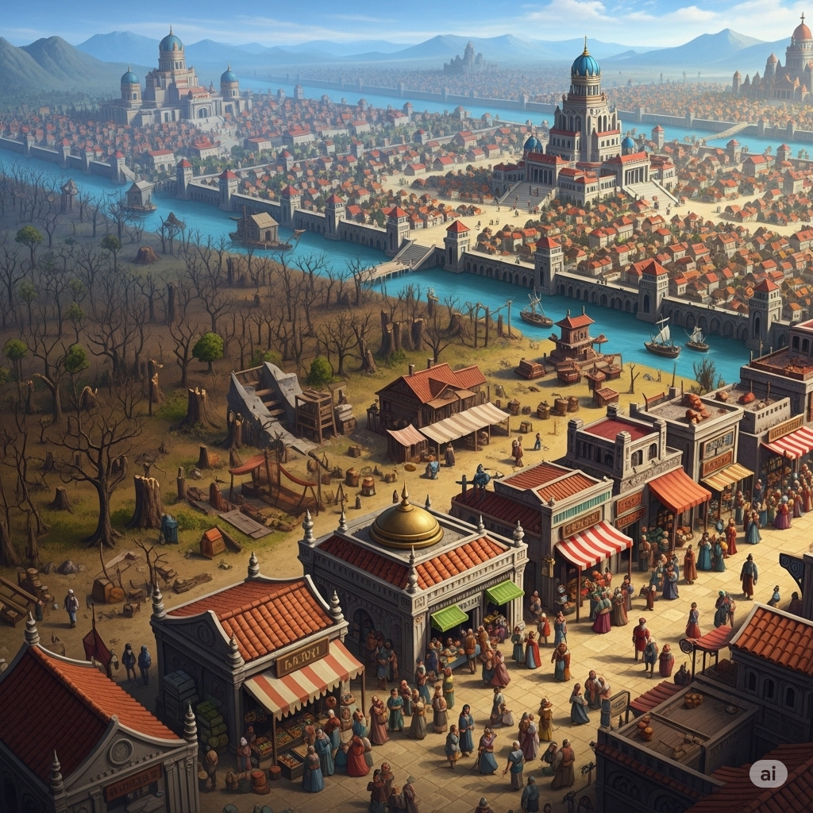

A poor **scribe** from the area wanted to help. He **hitchhiked** to the capital to ask the emperor for **charity**. He was invited to the palace. It was large and **cozy**. Tables were loaded with food, and fires burned warmly in every fireplace.

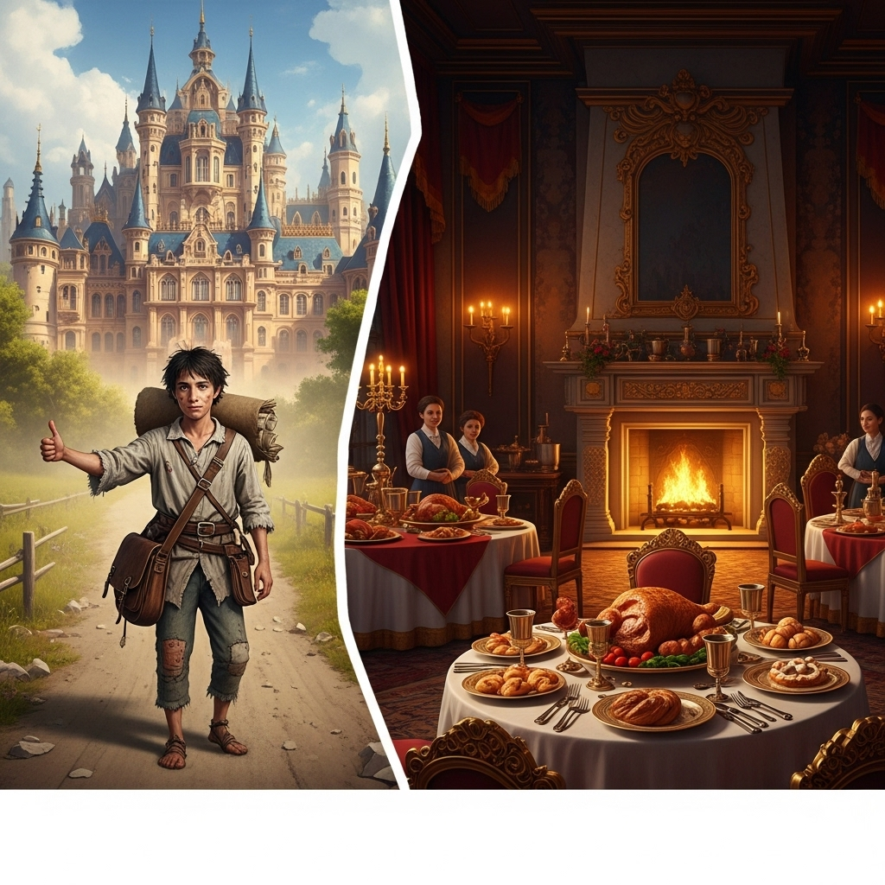

The emperor sat up upon his **throne**, and the scribe stood in front of him.

“I’ve come to ask for help,” the scribe said. “We’re all very poor and hungry. You’ve used up all of the forests, and now we have nothing to sell.” Then he added a warning. “If we don’t receive help, I’m afraid that the entire empire will suffer. We must establish some **unity**.”

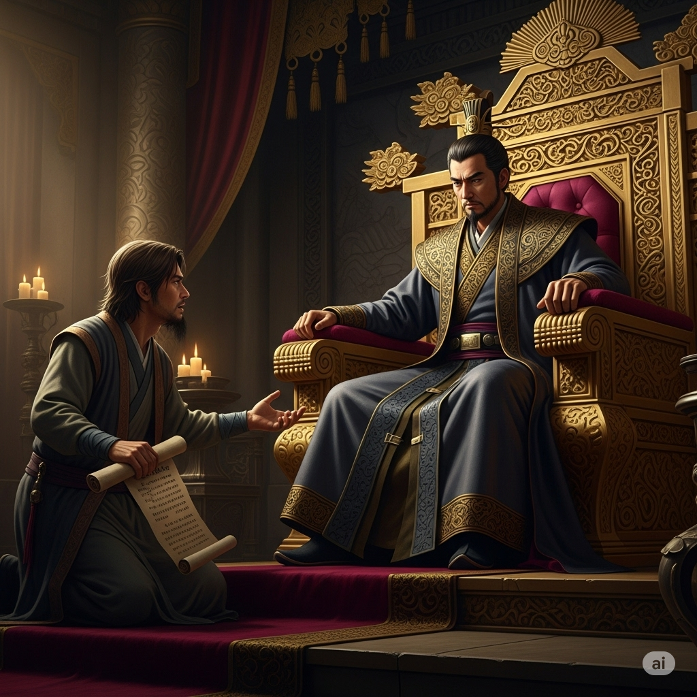

Upon hearing the scribe’s request, the emperor’s bad **temper** surfaced. He **mocked** the scribe. “You think I should help,” he said and laughed. “You should just be happy to belong to this great empire. You will get nothing from me.”

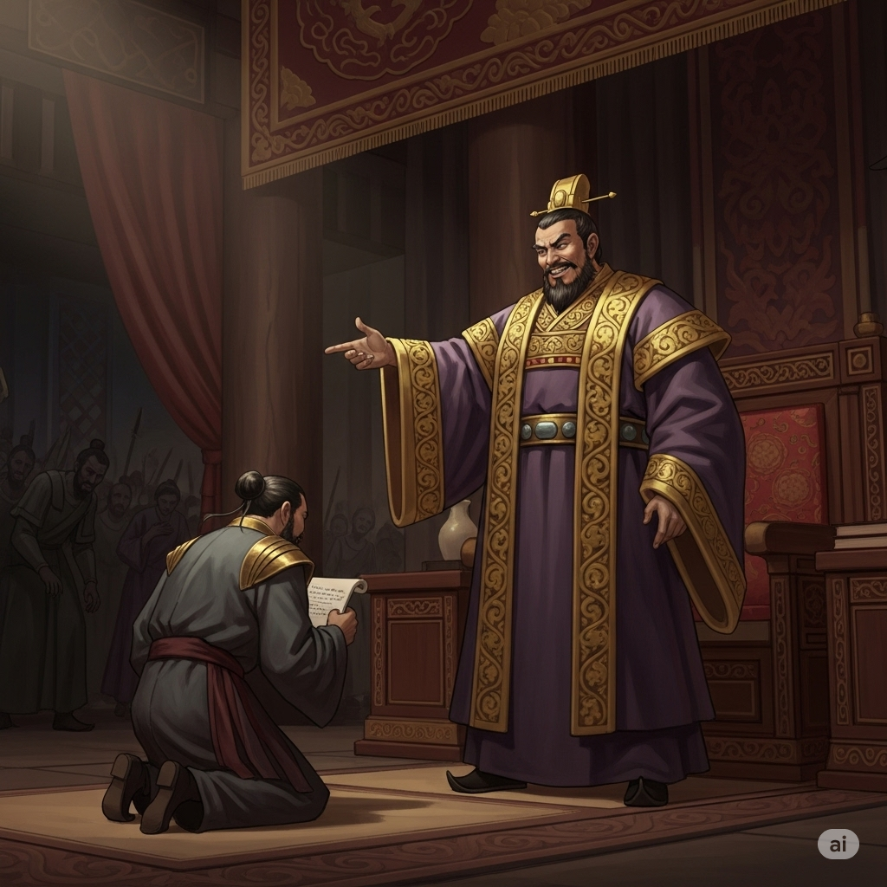

The emperor felt no **pity** for the citizens of the western area. They were **condemned** to starve. The scribe returned home with nothing.

Not long after, an enemy invaded the empire from the west. They were marching to the capital. Because the citizens felt **persecuted** by the emperor, they remained **neutral**. They didn’t fight the invaders but allowed them to march freely to the capital.

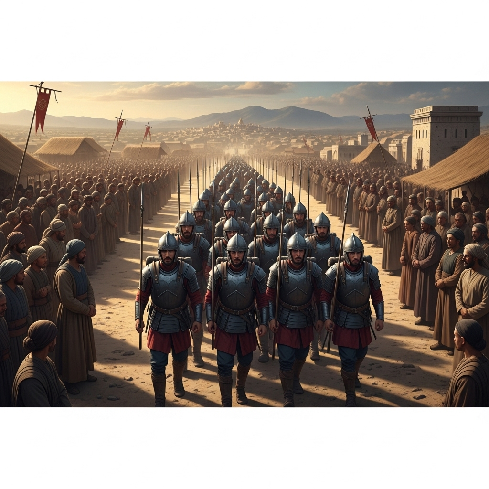

The emperor was defeated. If he had **heeded** the words of the scribe, then the citizens might have been the **victors**. But because he had treated them badly, they treated him badly in return.

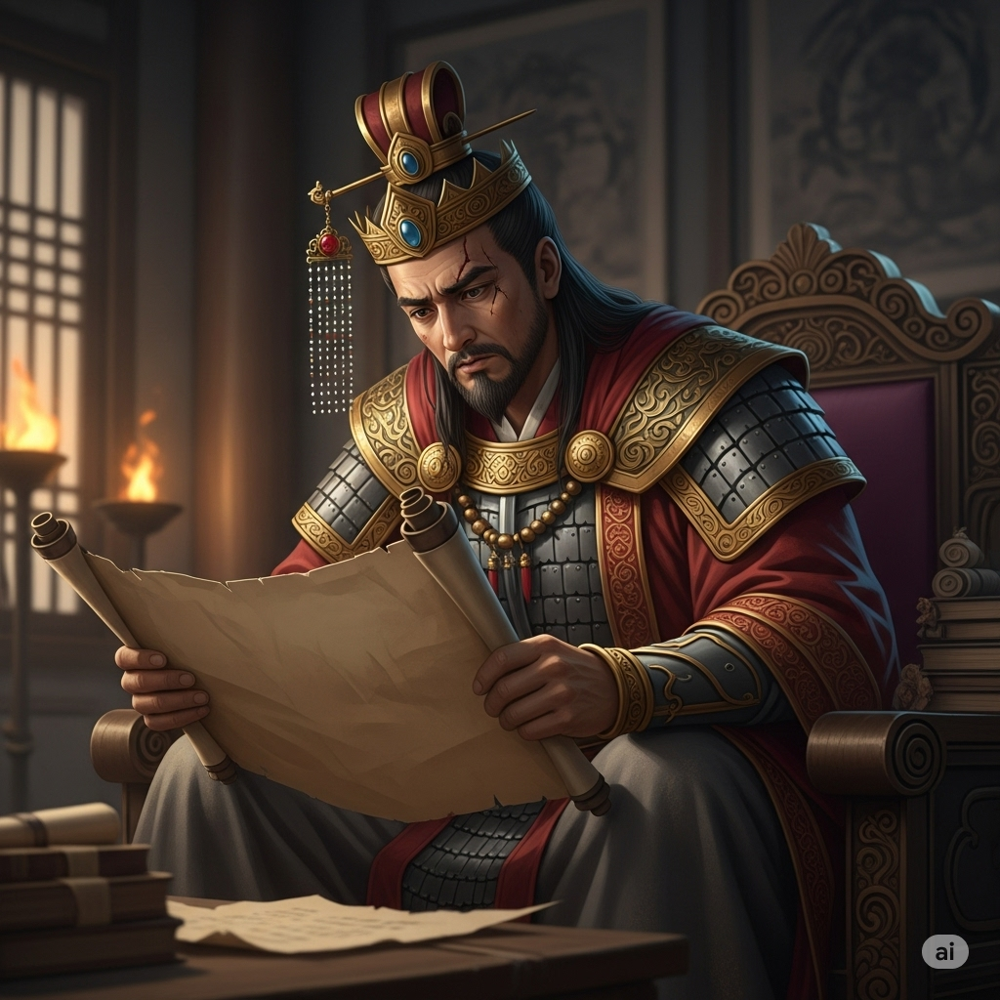

---

A great and powerful **empire** needed the wood from its western areas to build palaces and homes for the emperor and his friends.

However, the empire had **depleted** many of the forests.

The trees were important to the western areas’ **economy**.

With no trees to sell, the **commerce** in that area was **reduced**.

Citizens could no longer purchase the **goods** that they needed to survive.

Their life became difficult.

A poor **scribe** from the area wanted to help.

He **hitchhiked** to the capital to ask the emperor for **charity**.

He was invited to the palace.

It was large and **cozy**.

Tables were loaded with food, and fires burned warmly in every fireplace.

The emperor sat up upon his **throne**, and the scribe stood in front of him.

“I’ve come to ask for help,” the scribe said.

“We’re all very poor and hungry.

You’ve used up all of the forests, and now we have nothing to sell.”

Then he added a warning.

“If we don’t receive help, I’m afraid that the entire empire will suffer.

We must establish some **unity**.”

Upon hearing the scribe’s request, the emperor’s bad **temper** surfaced.

He **mocked** the scribe.

“You think I should help,” he said and laughed.

“You should just be happy to belong to this great empire.

You will get nothing from me.”

The emperor felt no **pity** for the citizens of the western area.

They were **condemned** to starve.

The scribe returned home with nothing.

Not long after, an enemy invaded the empire from the west.

They were marching to the capital.

Because the citizens felt **persecuted** by the emperor, they remained **neutral**.

They didn’t fight the invaders but allowed them to march freely to the capital.

The emperor was defeated.

If he had **heeded** the words of the scribe, then the citizens might have been the **victors**.

But because he had treated them badly, they treated him badly in return.

---

## 1. charity (n)

- **Nghĩa trong truyện:** sự giúp đỡ, lòng từ thiện  
- **Câu xuất hiện:** He hitchhiked to the capital to ask the emperor for charity.

**12 ví dụ với các thì:**
1. I give charity every month. *(Present Simple)*
2. She is giving charity now. *(Present Continuous)*
3. They have given charity before. *(Present Perfect)*
4. He gave charity yesterday. *(Past Simple)*
5. We were giving charity when you called. *(Past Continuous)*
6. I had given charity before I left. *(Past Perfect)*
7. She will give charity tomorrow. *(Future Simple)*
8. They will be giving charity at noon. *(Future Continuous)*
9. He will have given charity by then. *(Future Perfect)*
10. If I give charity, I feel happy. *(Conditional)*
11. Giving charity is important. *(Gerund)*
12. I want to give charity. *(To-infinitive)*

---

## 2. commerce (n)

- **Nghĩa trong truyện:** thương mại, buôn bán  
- **Câu xuất hiện:** the commerce in that area was reduced.

**12 ví dụ với các thì:**
1. Commerce increases every year.
2. Commerce is growing rapidly.
3. Commerce has changed a lot.
4. Commerce declined last year.
5. Commerce was booming in 2020.
6. Commerce had improved before the crisis.
7. Commerce will expand soon.
8. Commerce will be changing next year.
9. Commerce will have doubled by 2030.
10. If commerce grows, jobs increase.
11. Commerce helps the economy.
12. I want to study commerce.

---

## 3. condemn (v)

- **Nghĩa trong truyện:** kết án, kết tội  
- **Câu xuất hiện:** They were condemned to starve.

**12 ví dụ với các thì:**
1. I condemn violence.
2. She is condemning the act.
3. They have condemned the plan.
4. He condemned the decision.
5. We were condemning the actions.
6. They had condemned the policy.
7. The judge will condemn the criminal.
8. People will be condemning the event.
9. He will have condemned the act by then.
10. If you condemn, you show disapproval.
11. Condemning injustice is right.
12. I want to condemn corruption.

---

## 4. cozy (adj)

- **Nghĩa trong truyện:** ấm cúng  
- **Câu xuất hiện:** It was large and cozy.

**12 ví dụ với các thì:**
1. The room feels cozy.
2. She is making the house cozy.
3. We have kept the place cozy.
4. The cabin looked cozy.
5. They were feeling cozy inside.
6. She had made the room cozy.
7. The house will be cozy in winter.
8. We will be feeling cozy tonight.
9. The place will have become cozy.
10. If it’s cozy, I’ll stay longer.
11. Making a home cozy is fun.
12. I want a cozy blanket.

---

## 5. deplete (v)

- **Nghĩa trong truyện:** làm cạn kiệt  
- **Câu xuất hiện:** the empire had depleted many of the forests.

**12 ví dụ với các thì:**
1. Factories deplete resources.
2. Pollution is depleting the ozone layer.
3. We have depleted our supplies.
4. They depleted the stock.
5. The workers were depleting the fuel.
6. He had depleted his savings.
7. The project will deplete funds.
8. They will be depleting the reserves.
9. We will have depleted the water.
10. If you deplete energy, you get tired.
11. Depleting forests is dangerous.
12. I want to deplete my workload.

---

## 6. economy (n)
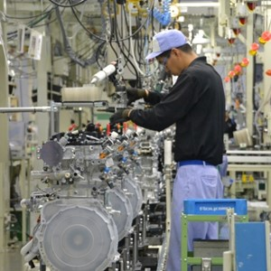

- **Nghĩa trong truyện:** nền kinh tế  
- **Câu xuất hiện:** The trees were important to the western areas’ economy.

**12 ví dụ với các thì:**
1. The economy grows fast.
2. The economy is improving.
3. The economy has changed.
4. The economy declined last year.
5. The economy was booming.
6. The economy had recovered.
7. The economy will expand.
8. The economy will be growing.
9. The economy will have improved.
10. If the economy grows, people benefit.
11. Improving the economy is vital.
12. I want to study the economy.

---

## 7. empire (n)
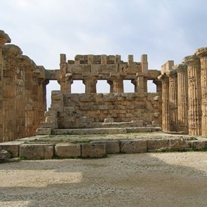

- **Nghĩa trong truyện:** đế chế  
- **Câu xuất hiện:** A great and powerful empire needed the wood...

**12 ví dụ với các thì:**
1. The empire rules many lands.
2. The empire is expanding.
3. The empire has fallen.
4. The empire conquered new lands.
5. The empire was growing.
6. The empire had collapsed.
7. The empire will rise again.
8. The empire will be expanding.
9. The empire will have changed.
10. If the empire grows, it gets stronger.
11. Building an empire takes time.
12. I want to visit an ancient empire.

---

## 8. goods (n)

- **Nghĩa trong truyện:** hàng hóa  
- **Câu xuất hiện:** Citizens could no longer purchase the goods that they needed...

**12 ví dụ với các thì:**
1. The store sells goods.
2. They are buying goods.
3. We have received the goods.
4. He sold the goods yesterday.
5. They were delivering goods.
6. We had shipped the goods.
7. The company will import goods.
8. They will be exporting goods.
9. We will have received the goods.
10. If goods are cheap, people buy more.
11. Selling goods is profitable.
12. I want to order goods online.

---

## 9. heed (v)
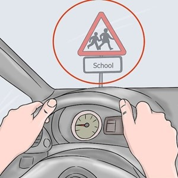

- **Nghĩa trong truyện:** chú ý, lắng nghe  
- **Câu xuất hiện:** If he had heeded the words of the scribe...

**12 ví dụ với các thì:**
1. I heed advice.
2. She is heeding the warning.
3. They have heeded the rules.
4. He heeded the teacher’s words.
5. We were heeding the instructions.
6. She had heeded the signs.
7. I will heed your suggestion.
8. They will be heeding the advice.
9. He will have heeded the warning.
10. If you heed, you avoid mistakes.
11. Heeding advice is wise.
12. I want to heed your words.

---

## 10. hitchhike (v)

- **Nghĩa trong truyện:** đi nhờ xe  
- **Câu xuất hiện:** He hitchhiked to the capital...

**12 ví dụ với các thì:**
1. I hitchhike to school.
2. She is hitchhiking now.
3. They have hitchhiked before.
4. He hitchhiked last summer.
5. We were hitchhiking together.
6. She had hitchhiked to Paris.
7. I will hitchhike tomorrow.
8. They will be hitchhiking soon.
9. He will have hitchhiked by noon.
10. If you hitchhike, be careful.
11. Hitchhiking is adventurous.
12. I want to hitchhike across the country.

---

## 11. mock (v)

- **Nghĩa trong truyện:** chế nhạo  
- **Câu xuất hiện:** He mocked the scribe.

**12 ví dụ với các thì:**
1. They mock his accent.
2. She is mocking me.
3. He has mocked my idea.
4. They mocked the plan.
5. We were mocking the movie.
6. She had mocked his speech.
7. I will not mock you.
8. They will be mocking the show.
9. He will have mocked the answer.
10. If you mock, people feel bad.
11. Mocking others is rude.
12. I want to mock the test.

---

## 12. neutral (adj)
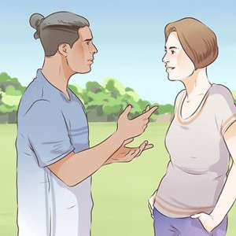

- **Nghĩa trong truyện:** trung lập  
- **Câu xuất hiện:** they remained neutral.

**12 ví dụ với các thì:**
1. I stay neutral in arguments.
2. She is remaining neutral.
3. They have been neutral.
4. He stayed neutral yesterday.
5. We were being neutral.
6. She had remained neutral.
7. I will stay neutral.
8. They will be remaining neutral.
9. He will have stayed neutral.
10. If you are neutral, you avoid conflict.
11. Being neutral is sometimes wise.
12. I want to remain neutral.

---

## 13. persecute (v)
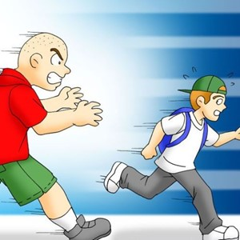

- **Nghĩa trong truyện:** đàn áp, ngược đãi  
- **Câu xuất hiện:** Because the citizens felt persecuted by the emperor...

**12 ví dụ với các thì:**
1. They persecute minorities.
2. He is persecuting the group.
3. She has persecuted others.
4. They persecuted the villagers.
5. We were persecuting no one.
6. He had persecuted the rebels.
7. The regime will persecute dissenters.
8. They will be persecuting people.
9. He will have persecuted many.
10. If you persecute, you cause harm.
11. Persecuting is wrong.
12. I want to stop persecution.

---

## 14. pity (n)

- **Nghĩa trong truyện:** lòng thương hại  
- **Câu xuất hiện:** The emperor felt no pity for the citizens...

**12 ví dụ với các thì:**
1. I feel pity for him.
2. She is showing pity.
3. They have felt pity.
4. He showed pity yesterday.
5. We were feeling pity.
6. She had shown pity before.
7. I will feel pity.
8. They will be showing pity.
9. He will have felt pity.
10. If you feel pity, you help.
11. Showing pity is kind.
12. I want to express pity.

---

## 15. reduce (v)

- **Nghĩa trong truyện:** giảm bớt  
- **Câu xuất hiện:** the commerce in that area was reduced.

**12 ví dụ với các thì:**
1. I reduce waste.
2. She is reducing costs.
3. They have reduced prices.
4. He reduced the speed.
5. We were reducing expenses.
6. She had reduced her weight.
7. I will reduce sugar intake.
8. They will be reducing pollution.
9. He will have reduced the risk.
10. If you reduce, you save.
11. Reducing stress is important.
12. I want to reduce noise.

---

## 16. scribe (n)
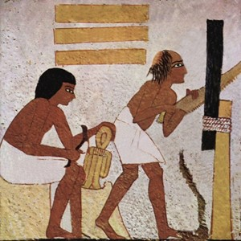

- **Nghĩa trong truyện:** người chép sách, thư lại  
- **Câu xuất hiện:** A poor scribe from the area wanted to help.

**12 ví dụ với các thì:**
1. The scribe writes daily.
2. He is working as a scribe.
3. They have hired a scribe.
4. She became a scribe.
5. We were training a scribe.
6. He had worked as a scribe.
7. I will become a scribe.
8. They will be hiring a scribe.
9. She will have finished as a scribe.
10. If you are a scribe, you write.
11. Being a scribe is interesting.
12. I want to be a scribe.

---

## 17. temper (n)

- **Nghĩa trong truyện:** tính khí, cơn giận  
- **Câu xuất hiện:** the emperor’s bad temper surfaced.

**12 ví dụ với các thì:**
1. He loses his temper easily.
2. She is controlling her temper.
3. They have shown bad temper.
4. He lost his temper yesterday.
5. We were watching his temper.
6. She had lost her temper before.
7. I will keep my temper.
8. They will be testing his temper.
9. He will have lost his temper.
10. If you lose temper, calm down.
11. Controlling temper is good.
12. I want to improve my temper.

---

## 18. throne (n)
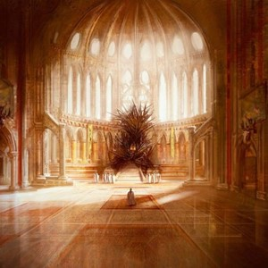

- **Nghĩa trong truyện:** ngai vàng  
- **Câu xuất hiện:** The emperor sat up upon his throne...

**12 ví dụ với các thì:**
1. The king sits on the throne.
2. She is approaching the throne.
3. They have claimed the throne.
4. He took the throne.
5. We were guarding the throne.
6. She had reached the throne.
7. I will see the throne.
8. They will be building a throne.
9. He will have inherited the throne.
10. If you sit on the throne, you rule.
11. Protecting the throne is vital.
12. I want to see the throne.

---

## 19. unity (n)
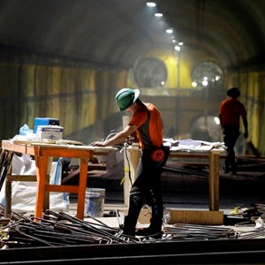

- **Nghĩa trong truyện:** sự đoàn kết  
- **Câu xuất hiện:** We must establish some unity.

**12 ví dụ với các thì:**
1. Unity brings strength.
2. We are seeking unity.
3. They have achieved unity.
4. The team showed unity.
5. We were building unity.
6. They had lost unity.
7. We will promote unity.
8. They will be seeking unity.
9. We will have achieved unity.
10. If there is unity, we succeed.
11. Building unity is important.
12. I want to see unity.

---

## 20. victor (n)

- **Nghĩa trong truyện:** người chiến thắng  
- **Câu xuất hiện:** the citizens might have been the victors.

**12 ví dụ với các thì:**
1. The victor claims the prize.
2. She is becoming the victor.
3. They have been victors before.
4. He became the victor.
5. We were cheering the victor.
6. She had been the victor.
7. I will be the victor.
8. They will be naming the victor.
9. He will have become the victor.
10. If you are the victor, you celebrate.
11. Being a victor feels great.
12. I want to be the