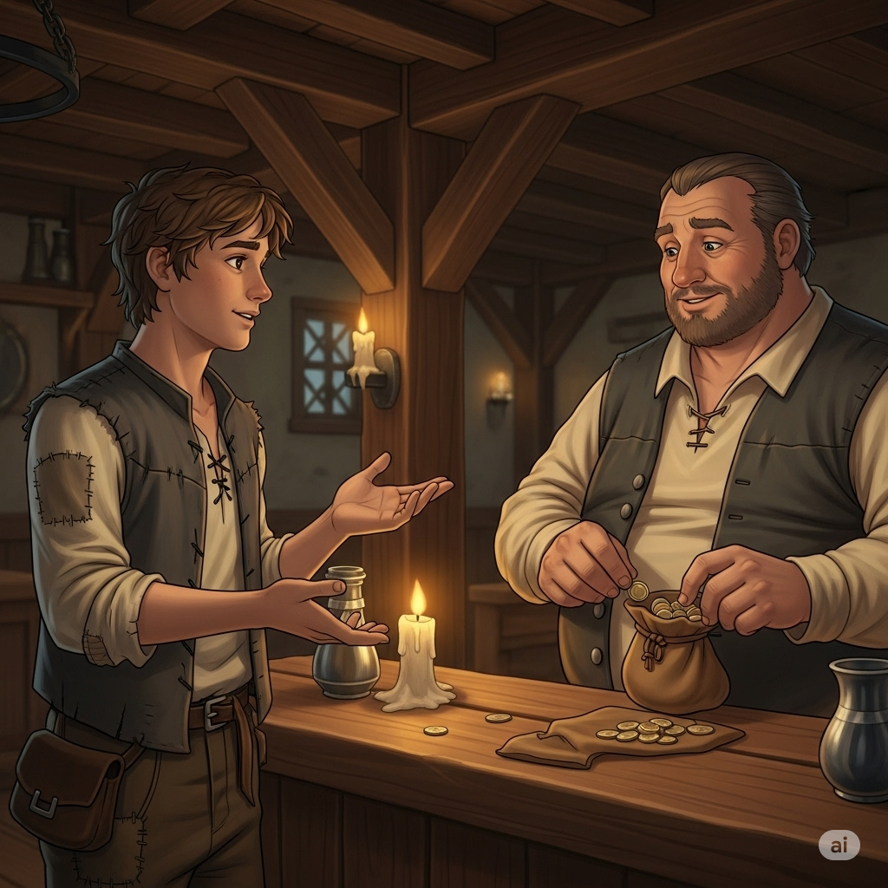
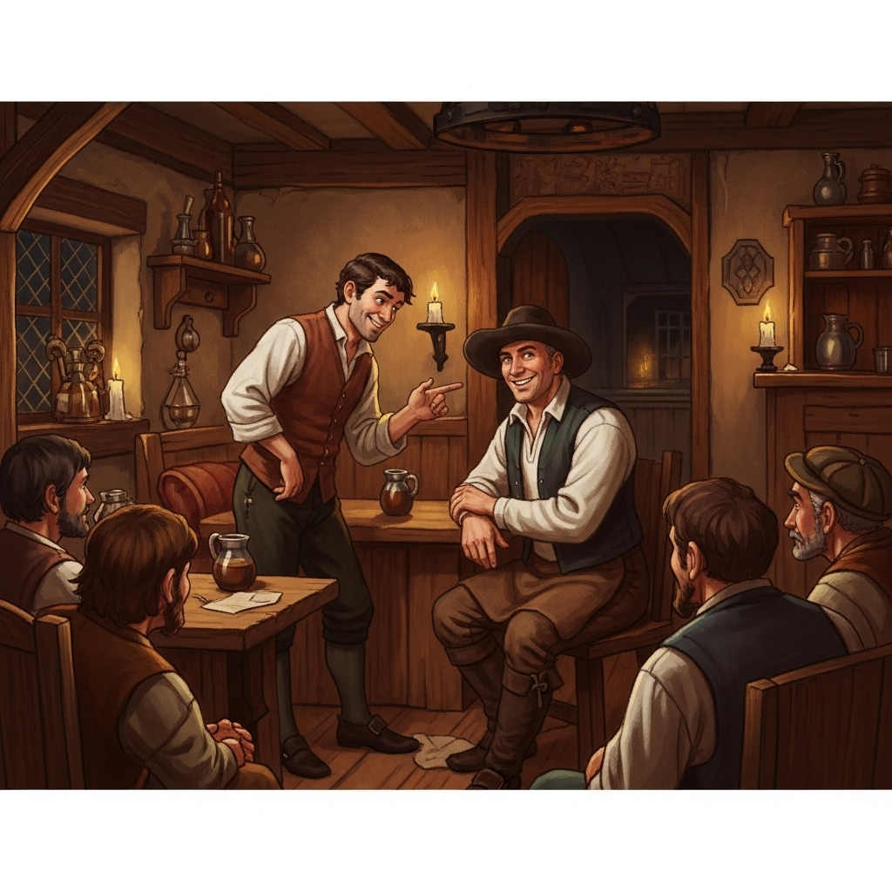
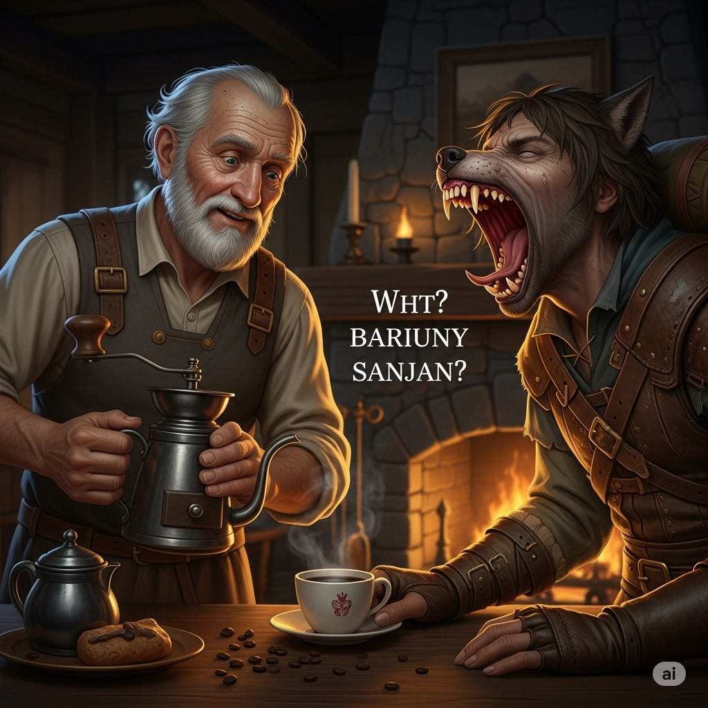
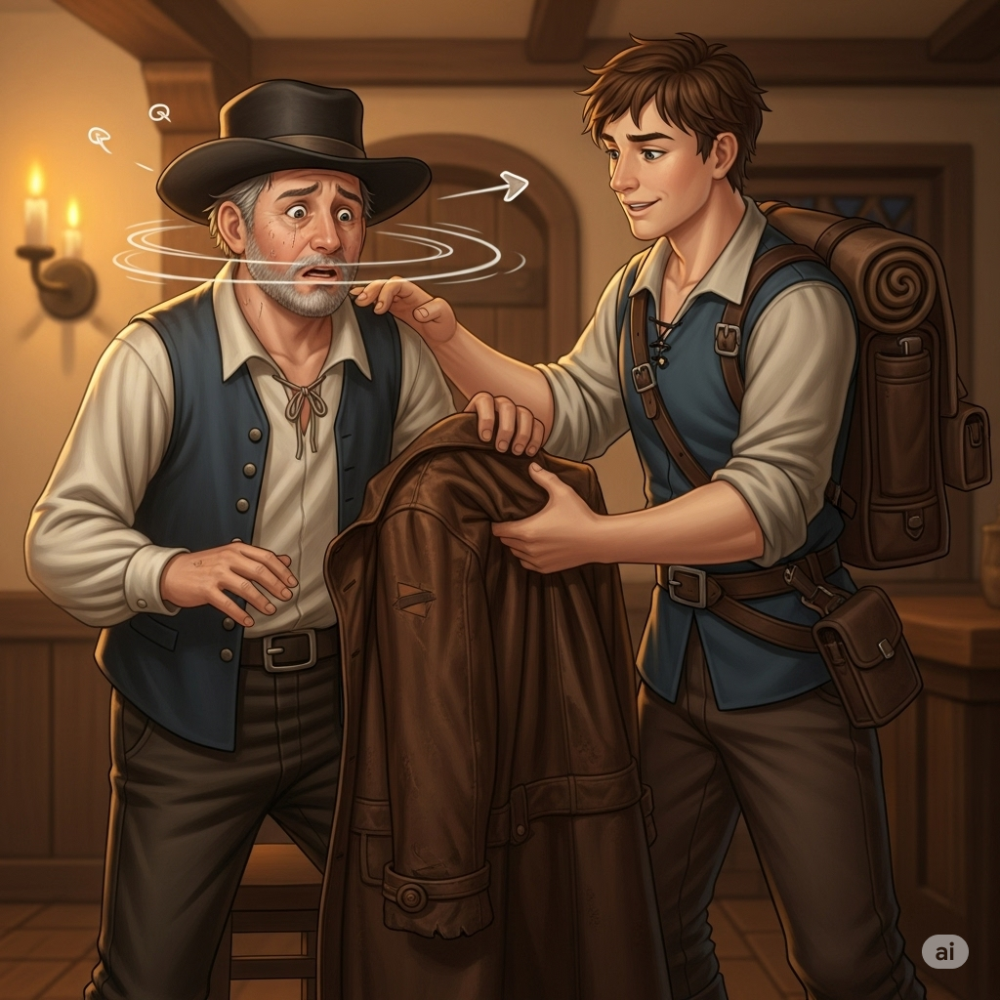
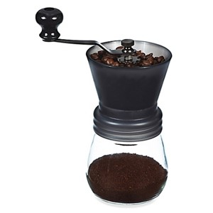
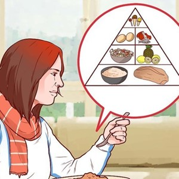
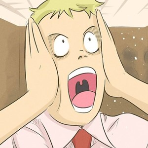
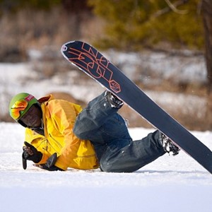

# The Traveler and the Innkeeper

A traveler stopped at an inn. He sat and watched people closely, like a **predator**. He heard the old innkeeper talking to a young man in the **core** of the inn.

“I just need to borrow some money. I swear that I’ll spend it in **moderation**, and my friend will pay you back tomorrow,” the man said. The innkeeper gave his **consent** and pulled out some money.

The traveler knew that this was a trick. The man was going to leave with the poor innkeeper’s money and never return. He felt **compassion** for the nice innkeeper and did not want him to be tricked. The **cunning** traveler decided to teach the innkeeper a lesson.

The traveler walked over to the innkeeper and sat down. The innkeeper had started to **grind** coffee beans to make coffee. He made the coffee and handed the traveler a **saucer** and a cup. The two started talking. After a while the traveler yawned and then growled like a wolf.

“Are you not **sane**? I thought I just heard you growl,” said the innkeeper.

“I did. I am cursed. Every time I yawn three times in a row, I turn into a wolf and attack people.”

The innkeeper became **tense**. Then the traveler yawned again. As the traveler started to yawn a third time, the innkeeper turned to run outside. As he ran, the traveler **snatched** his coat. The scared innkeeper **staggered** outside and **tumbled** into the street.

The traveler followed him out because he did not want to **withhold** the truth any longer. He just wanted to **foster** happiness and restore the innkeeper’s emotional **equilibrium**. The innkeeper was **dizzy**, and he **stumbled**. The traveler helped him stand up.

“That was a trick,” the traveler said as he returned the coat.

“Oh, good. I **cherish** this coat,” responded the innkeeper.

“Well, hopefully this will teach you that you shouldn’t believe every story that you hear.

---

# The Traveler and the Innkeeper

A traveler stopped at an inn.

He sat and watched people closely, like a **predator**.

He heard the old innkeeper talking to a young man in the **core** of the inn.

“I just need to borrow some money.

I swear that I’ll spend it in **moderation**, and my friend will pay you back tomorrow,” the man said.

The innkeeper gave his **consent** and pulled out some money.

The traveler knew that this was a trick.

The man was going to leave with the poor innkeeper’s money and never return.

He felt **compassion** for the nice innkeeper and did not want him to be tricked.

The **cunning** traveler decided to teach the innkeeper a lesson.

The traveler walked over to the innkeeper and sat down.

The innkeeper had started to **grind** coffee beans to make coffee.

He made the coffee and handed the traveler a **saucer** and a cup.

The two started talking.

After a while the traveler yawned and then growled like a wolf.

“Are you not **sane**?

I thought I just heard you growl,” said the innkeeper.

“I did.

I am cursed.

Every time I yawn three times in a row, I turn into a wolf and attack people.”

The innkeeper became **tense**.

Then the traveler yawned again.

As the traveler started to yawn a third time, the innkeeper turned to run outside.

As he ran, the traveler **snatched** his coat.

The scared innkeeper **staggered** outside and **tumbled** into the street.

The traveler followed him out because he did not want to **withhold** the truth any longer.

He just wanted to **foster** happiness and restore the innkeeper’s emotional **equilibrium**.

The innkeeper was **dizzy**, and he **stumbled**.

The traveler helped him stand up.

“That was a trick,” the traveler said as he returned the coat.

“Oh, good.

I **cherish** this coat,” responded the innkeeper.

“Well, hopefully this will teach you that you shouldn’t believe every story that you hear.

---

## 1. cherish (v)

- **Nghĩa trong truyện:** trân trọng  
- **Câu xuất hiện:** “Oh, good. I cherish this coat,” responded the innkeeper.

**12 ví dụ với các thì:**
1. I cherish our memories. *(Present Simple)*
2. She is cherishing the moment. *(Present Continuous)*
3. They have cherished this tradition for years. *(Present Perfect)*
4. He cherished his old guitar. *(Past Simple)*
5. We were cherishing the peace and quiet. *(Past Continuous)*
6. She had cherished the gift. *(Past Perfect)*
7. I will cherish this experience. *(Future Simple)*
8. They will be cherishing their time together. *(Future Continuous)*
9. He will have cherished the memory forever. *(Future Perfect)*
10. If you cherish something, you protect it. *(Conditional)*
11. Cherishing family is important. *(Gerund)*
12. I want to cherish every day. *(To-infinitive)*

---

## 2. compassion (n)

- **Nghĩa trong truyện:** lòng trắc ẩn, lòng thương hại  
- **Câu xuất hiện:** He felt compassion for the nice innkeeper and did not want him to be tricked.

**12 ví dụ với các thì:**
1. She shows compassion for others. *(Present Simple)*
2. He is showing compassion now. *(Present Continuous)*
3. They have felt compassion for the victims. *(Present Perfect)*
4. She felt compassion for the poor man. *(Past Simple)*
5. We were feeling compassion for the refugees. *(Past Continuous)*
6. He had shown compassion before. *(Past Perfect)*
7. I will feel compassion for them. *(Future Simple)*
8. They will be showing compassion. *(Future Continuous)*
9. She will have felt compassion by then. *(Future Perfect)*
10. If you have compassion, you help. *(Conditional)*
11. Showing compassion is a virtue. *(Gerund)*
12. I want to show compassion. *(To-infinitive)*

---

## 3. consent (n)

- **Nghĩa trong truyện:** sự đồng ý  
- **Câu xuất hiện:** The innkeeper gave his consent and pulled out some money.

**12 ví dụ với các thì:**
1. He gives his consent. *(Present Simple)*
2. She is giving her consent now. *(Present Continuous)*
3. They have given their consent. *(Present Perfect)*
4. He gave his consent yesterday. *(Past Simple)*
5. We were giving our consent. *(Past Continuous)*
6. She had given her consent before. *(Past Perfect)*
7. I will give my consent tomorrow. *(Future Simple)*
8. They will be giving their consent at the meeting. *(Future Continuous)*
9. He will have given his consent by then. *(Future Perfect)*
10. If you give consent, it is allowed. *(Conditional)*
11. Giving consent is necessary. *(Gerund)*
12. I want to get his consent. *(To-infinitive)*

---

## 4. core (n)

- **Nghĩa trong truyện:** trung tâm, phần chính  
- **Câu xuất hiện:** He heard the old innkeeper talking to a young man in the core of the inn.

**12 ví dụ với các thì:**
1. The Earth has a core. *(Present Simple)*
2. They are working on the core issue. *(Present Continuous)*
3. We have reached the core of the problem. *(Present Perfect)*
4. The core of the apple was rotten. *(Past Simple)*
5. They were discussing the core principles. *(Past Continuous)*
6. He had understood the core concept. *(Past Perfect)*
7. This will be the core of the plan. *(Future Simple)*
8. They will be focusing on the core business. *(Future Continuous)*
9. The core structure will have been completed. *(Future Perfect)*
10. If you understand the core, you understand everything. *(Conditional)*
11. Getting to the core is important. *(Gerund)*
12. I want to understand the core idea. *(To-infinitive)*

---

## 5. cunning (adj)

- **Nghĩa trong truyện:** xảo quyệt, ranh mãnh  
- **Câu xuất hiện:** The cunning traveler decided to teach the innkeeper a lesson.

**12 ví dụ với các thì:**
1. The fox is cunning. *(Present Simple)*
2. He is being cunning. *(Present Continuous)*
3. They have been cunning in their plan. *(Present Perfect)*
4. She was cunning in her approach. *(Past Simple)*
5. They were being cunning. *(Past Continuous)*
6. He had been cunning before. *(Past Perfect)*
7. He will be cunning. *(Future Simple)*
8. They will be being cunning. *(Future Continuous)*
9. She will have been cunning enough. *(Future Perfect)*
10. If you are cunning, you can trick people. *(Conditional)*
11. Being cunning can be useful. *(Gerund)*
12. I want to be cunning. *(To-infinitive)*

---

## 6. dizzy (adj)

- **Nghĩa trong truyện:** chóng mặt  
- **Câu xuất hiện:** The innkeeper was dizzy, and he stumbled.

**12 ví dụ với các thì:**
1. I feel dizzy. *(Present Simple)*
2. She is feeling dizzy. *(Present Continuous)*
3. They have felt dizzy before. *(Present Perfect)*
4. He felt dizzy after standing up. *(Past Simple)*
5. We were feeling dizzy on the ride. *(Past Continuous)*
6. She had felt dizzy earlier. *(Past Perfect)*
7. I will feel dizzy if I spin. *(Future Simple)*
8. They will be feeling dizzy. *(Future Continuous)*
9. He will have felt dizzy by then. *(Future Perfect)*
10. If you feel dizzy, sit down. *(Conditional)*
11. Feeling dizzy is unpleasant. *(Gerund)*
12. I want to avoid feeling dizzy. *(To-infinitive)*

---

## 7. equilibrium (n)

- **Nghĩa trong truyện:** sự cân bằng  
- **Câu xuất hiện:** He just wanted to foster happiness and restore the innkeeper’s emotional equilibrium.

**12 ví dụ với các thì:**
1. The system is in equilibrium. *(Present Simple)*
2. The market is reaching equilibrium. *(Present Continuous)*
3. They have found a new equilibrium. *(Present Perfect)*
4. The balance reached equilibrium. *(Past Simple)*
5. The forces were seeking equilibrium. *(Past Continuous)*
6. She had restored her emotional equilibrium. *(Past Perfect)*
7. The price will reach equilibrium. *(Future Simple)*
8. They will be seeking equilibrium. *(Future Continuous)*
9. The system will have reached equilibrium. *(Future Perfect)*
10. If you lose equilibrium, you fall. *(Conditional)*
11. Maintaining equilibrium is key. *(Gerund)*
12. I want to find my equilibrium. *(To-infinitive)*

---

## 8. foster (v)

- **Nghĩa trong truyện:** nuôi dưỡng, thúc đẩy  
- **Câu xuất hiện:** He just wanted to foster happiness and restore the innkeeper’s emotional equilibrium.

**12 ví dụ với các thì:**
1. They foster creativity. *(Present Simple)*
2. She is fostering a sense of community. *(Present Continuous)*
3. We have fostered good relationships. *(Present Perfect)*
4. He fostered innovation. *(Past Simple)*
5. They were fostering growth. *(Past Continuous)*
6. She had fostered the idea. *(Past Perfect)*
7. This program will foster talent. *(Future Simple)*
8. They will be fostering collaboration. *(Future Continuous)*
9. The project will have fostered change. *(Future Perfect)*
10. If you foster talent, it grows. *(Conditional)*
11. Fostering positive change is important. *(Gerund)*
12. I want to foster a love of reading. *(To-infinitive)*

---

## 9. grind (v)

- **Nghĩa trong truyện:** xay, nghiền  
- **Câu xuất hiện:** The innkeeper had started to grind coffee beans to make coffee.

**12 ví dụ với các thì:**
1. I grind my own coffee. *(Present Simple)*
2. She is grinding spices. *(Present Continuous)*
3. They have ground the grain. *(Present Perfect)*
4. He ground the beans this morning. *(Past Simple)*
5. We were grinding the herbs. *(Past Continuous)*
6. She had ground the pepper. *(Past Perfect)*
7. I will grind the flour tomorrow. *(Future Simple)*
8. They will be grinding the ingredients. *(Future Continuous)*
9. He will have ground all the coffee by noon. *(Future Perfect)*
10. If you grind it finely, it mixes well. *(Conditional)*
11. Grinding fresh spices adds flavor. *(Gerund)*
12. I want to grind the nuts. *(To-infinitive)*

---

## 10. moderation (n)

- **Nghĩa trong truyện:** sự điều độ  
- **Câu xuất hiện:** I swear that I’ll spend it in moderation...

**12 ví dụ với các thì:**
1. He eats in moderation. *(Present Simple)*
2. She is practicing moderation. *(Present Continuous)*
3. They have lived in moderation. *(Present Perfect)*
4. He acted with moderation. *(Past Simple)*
5. We were showing moderation. *(Past Continuous)*
6. She had always believed in moderation. *(Past Perfect)*
7. I will try to live in moderation. *(Future Simple)*
8. They will be practicing moderation. *(Future Continuous)*
9. He will have learned moderation by then. *(Future Perfect)*
10. If you live in moderation, you are healthy. *(Conditional)*
11. Practicing moderation is wise. *(Gerund)*
12. I want to live in moderation. *(To-infinitive)*

---

## 11. predator (n)

- **Nghĩa trong truyện:** kẻ săn mồi  
- **Câu xuất hiện:** He sat and watched people closely, like a predator.

**12 ví dụ với các thì:**
1. A lion is a predator. *(Present Simple)*
2. The hawk is hunting like a predator. *(Present Continuous)*
3. They have studied this predator. *(Present Perfect)*
4. The wolf acted like a predator. *(Past Simple)*
5. They were observing the predator. *(Past Continuous)*
6. She had identified the predator. *(Past Perfect)*
7. The animal will behave like a predator. *(Future Simple)*
8. They will be tracking the predator. *(Future Continuous)*
9. The predator will have caught its prey. *(Future Perfect)*
10. If it is a predator, it hunts. *(Conditional)*
11. Studying predators is interesting. *(Gerund)*
12. I want to learn about predators. *(To-infinitive)*

---

## 12. sane (adj)

- **Nghĩa trong truyện:** tỉnh táo, minh mẫn  
- **Câu xuất hiện:** “Are you not sane? I thought I just heard you growl,” said the innkeeper.

**12 ví dụ với các thì:**
1. He seems sane. *(Present Simple)*
2. She is remaining sane under pressure. *(Present Continuous)*
3. They have been sane throughout the ordeal. *(Present Perfect)*
4. He was sane yesterday. *(Past Simple)*
5. We were being sane. *(Past Continuous)*
6. She had remained sane. *(Past Perfect)*
7. He will be sane. *(Future Simple)*
8. They will be remaining sane. *(Future Continuous)*
9. She will have remained sane. *(Future Perfect)*
10. If you are sane, you think clearly. *(Conditional)*
11. Staying sane is important. *(Gerund)*
12. I want to remain sane. *(To-infinitive)*

---

## 13. saucer (n)

- **Nghĩa trong truyện:** đĩa lót tách  
- **Câu xuất hiện:** He made the coffee and handed the traveler a saucer and a cup.

**12 ví dụ với các thì:**
1. The cup sits on the saucer. *(Present Simple)*
2. She is holding a saucer. *(Present Continuous)*
3. They have used this saucer. *(Present Perfect)*
4. He dropped the saucer. *(Past Simple)*
5. We were washing the saucers. *(Past Continuous)*
6. She had placed the saucer there. *(Past Perfect)*
7. I will get a saucer. *(Future Simple)*
8. They will be using the saucers. *(Future Continuous)*
9. The saucers will have been cleaned. *(Future Perfect)*
10. If you use a saucer, it catches spills. *(Conditional)*
11. Using a saucer is polite. *(Gerund)*
12. I want a matching saucer. *(To-infinitive)*

---

## 14. snatch (v)

- **Nghĩa trong truyện:** giật lấy, chộp lấy  
- **Câu xuất hiện:** As he ran, the traveler snatched his coat.

**12 ví dụ với các thì:**
1. He snatches the ball. *(Present Simple)*
2. She is snatching the keys. *(Present Continuous)*
3. They have snatched the opportunity. *(Present Perfect)*
4. He snatched the bag. *(Past Simple)*
5. We were snatching a quick lunch. *(Past Continuous)*
6. She had snatched the victory. *(Past Perfect)*
7. I will snatch a moment of rest. *(Future Simple)*
8. They will be snatching the documents. *(Future Continuous)*
9. He will have snatched the prize. *(Future Perfect)*
10. If you snatch it, you take it quickly. *(Conditional)*
11. Snatching things is rude. *(Gerund)*
12. I want to snatch a bargain. *(To-infinitive)*

---

## 15. stagger (v)

- **Nghĩa trong truyện:** loạng choạng  
- **Câu xuất hiện:** The scared innkeeper staggered outside and tumbled into the street.

**12 ví dụ với các thì:**
1. He staggers when he is tired. *(Present Simple)*
2. She is staggering down the street. *(Present Continuous)*
3. They have staggered the start times. *(Present Perfect)*
4. He staggered out of the building. *(Past Simple)*
5. We were staggering under the heavy load. *(Past Continuous)*
6. She had staggered before. *(Past Perfect)*
7. He will stagger if he is weak. *(Future Simple)*
8. They will be staggering the payments. *(Future Continuous)*
9. The work will have been staggered. *(Future Perfect)*
10. If you stagger, you might fall. *(Conditional)*
11. Staggering the tasks helps. *(Gerund)*
12. I want to avoid staggering. *(To-infinitive)*

---

## 16. stumble (v)

- **Nghĩa trong truyện:** vấp, bước hụt  
- **Câu xuất hiện:** The innkeeper was dizzy, and he stumbled.

**12 ví dụ với các thì:**
1. He stumbles sometimes. *(Present Simple)*
2. She is stumbling over her words. *(Present Continuous)*
3. They have stumbled upon a solution. *(Present Perfect)*
4. He stumbled on a rock. *(Past Simple)*
5. We were stumbling in the dark. *(Past Continuous)*
6. She had stumbled before. *(Past Perfect)*
7. I will stumble if I'm not careful. *(Future Simple)*
8. They will be stumbling through the forest. *(Future Continuous)*
9. He will have stumbled by then. *(Future Perfect)*
10. If you stumble, you might fall. *(Conditional)*
11. Stumbling is common when learning. *(Gerund)*
12. I want to avoid stumbling. *(To-infinitive)*

---

## 17. tense (adj)

- **Nghĩa trong truyện:** căng thẳng  
- **Câu xuất hiện:** The innkeeper became tense.

**12 ví dụ với các thì:**
1. The atmosphere is tense. *(Present Simple)*
2. She is being tense about the exam. *(Present Continuous)*
3. They have been tense all day. *(Present Perfect)*
4. He was tense before the interview. *(Past Simple)*
5. We were being tense. *(Past Continuous)*
6. She had been tense before. *(Past Perfect)*
7. He will be tense. *(Future Simple)*
8. They will be being tense. *(Future Continuous)*
9. She will have been tense. *(Future Perfect)*
10. If you are tense, relax. *(Conditional)*
11. Being tense is not good for you. *(Gerund)*
12. I want to feel less tense. *(To-infinitive)*

---

## 18. tumble (v)

- **Nghĩa trong truyện:** ngã nhào, lăn  
- **Câu xuất hiện:** The scared innkeeper staggered outside and tumbled into the street.

**12 ví dụ với các thì:**
1. Leaves tumble from the trees. *(Present Simple)*
2. The prices are tumbling. *(Present Continuous)*
3. They have tumbled down the hill. *(Present Perfect)*
4. He tumbled down the stairs. *(Past Simple)*
5. We were tumbling in the grass. *(Past Continuous)*
6. She had tumbled before. *(Past Perfect)*
7. The stock market will tumble. *(Future Simple)*
8. They will be tumbling. *(Future Continuous)*
9. The acrobats will have tumbled. *(Future Perfect)*
10. If you tumble, you might get hurt. *(Conditional)*
11. Tumbling is fun for kids. *(Gerund)*
12. I want to watch them tumble. *(To-infinitive)*

---

## 19. withhold (v)

- **Nghĩa trong truyện:** giữ lại, không cho biết  
- **Câu xuất hiện:** The traveler followed him out because he did not want to withhold the truth any longer.

**12 ví dụ với các thì:**
1. They withhold information. *(Present Simple)*
2. She is withholding payment. *(Present Continuous)*
3. He has withheld the details. *(Present Perfect)*
4. They withheld the evidence. *(Past Simple)*
5. We were withholding judgment. *(Past Continuous)*
6. She had withheld the truth. *(Past Perfect)*
7. I will not withhold anything. *(Future Simple)*
8. They will be withholding funds. *(Future Continuous)*
9. He will have withheld the report. *(Future Perfect)*
10. If you withhold information, it can cause problems. *(Conditional)*
11. Withholding payment is a last resort. *(Gerund)*
12. I want to withhold my opinion. *(To-infinitive)*