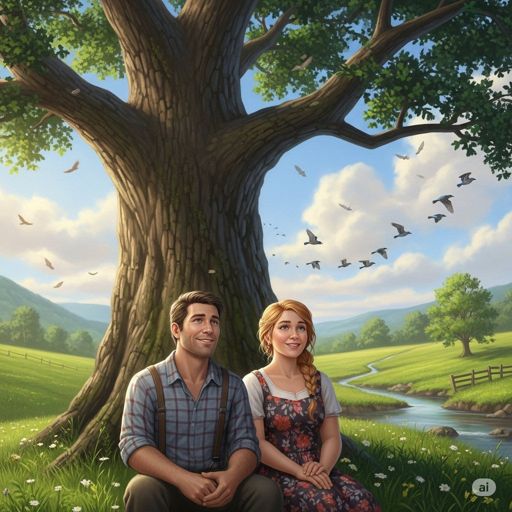
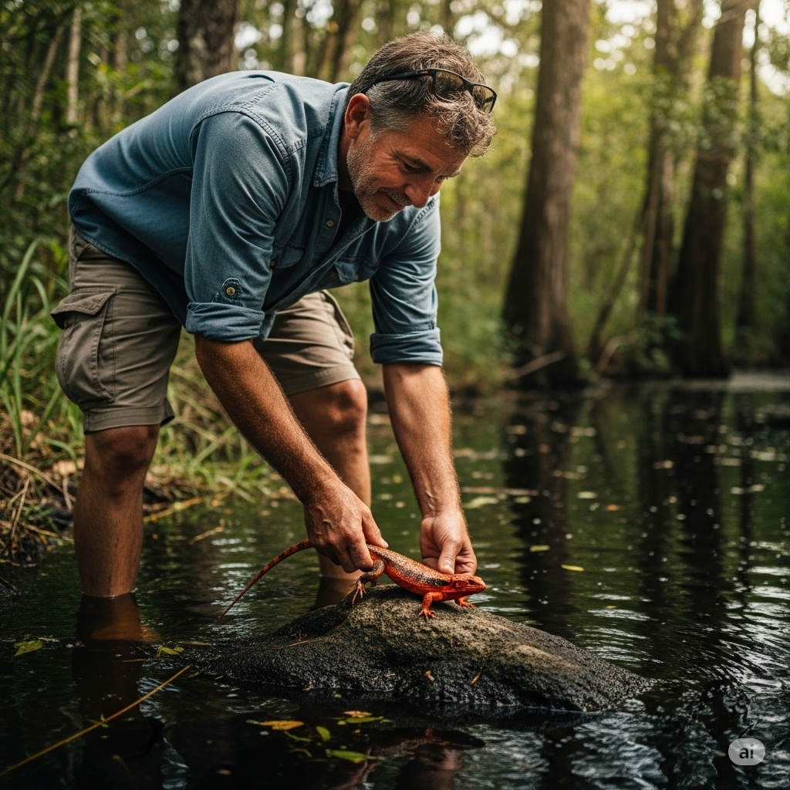
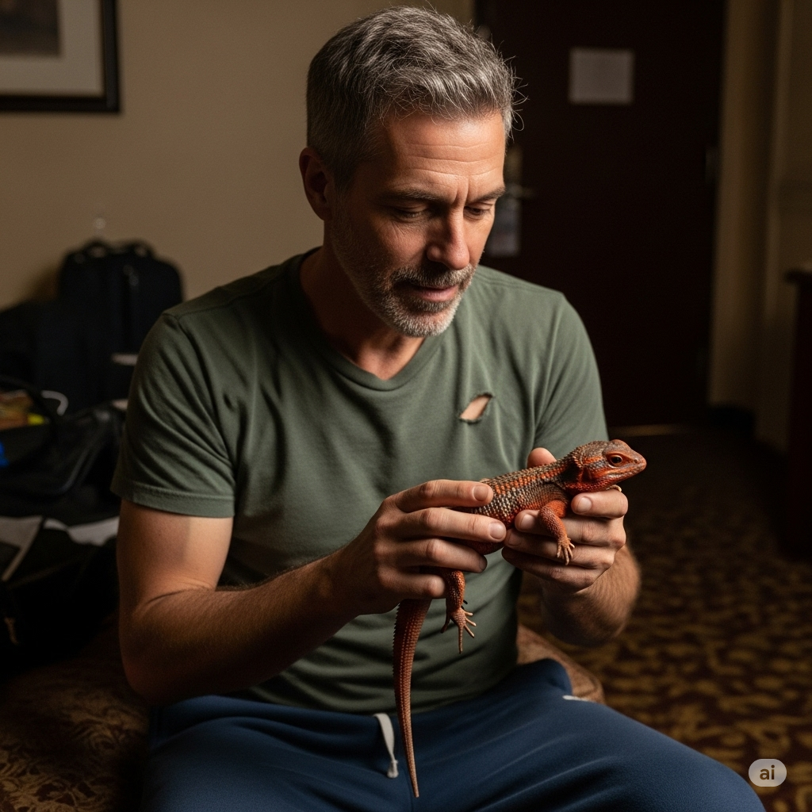
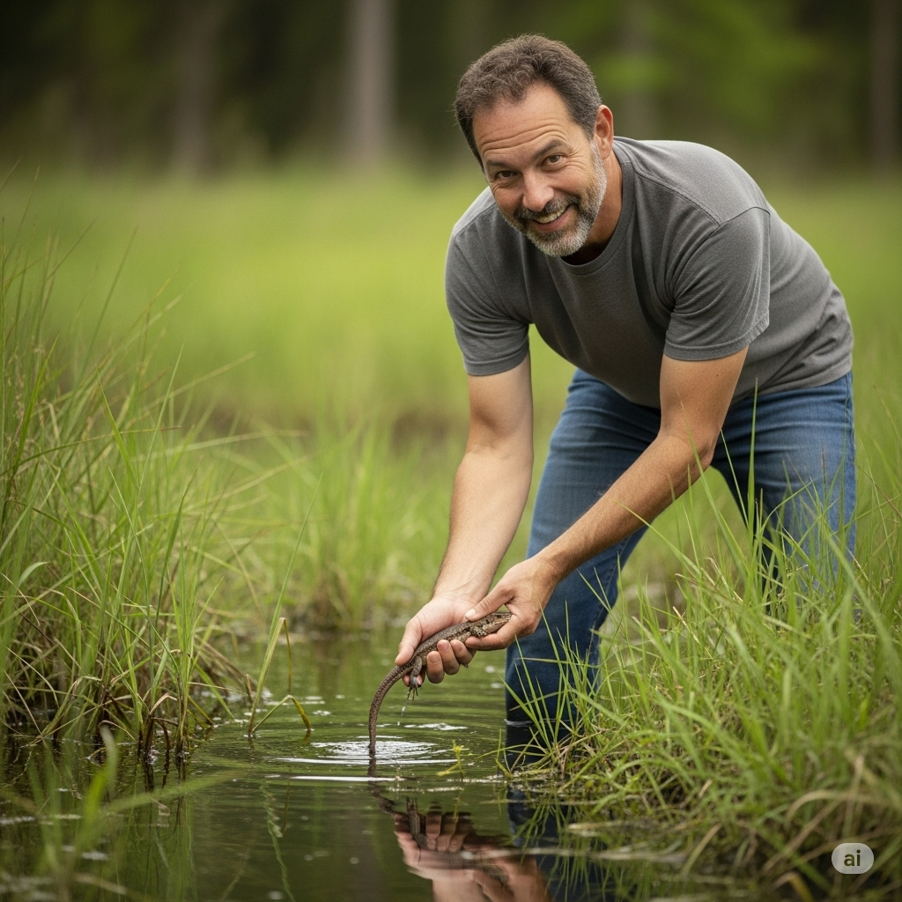

# Gilbert and the Lizard Gilbert and the Lizard

Eliza disliked Australia. Firstly, she’d had to spend twenty uncomfortable hours on an **aircraft** getting here. She wanted to go to the beach, but her husband was a **zoology** professor and wanted to look for some interesting animals. So now she was **traversing** a **swamp** in the midday heat.

“Let me sit down, Gilbert. I’m not **hardy** like you,” she said, eventually.

They sat under a tree. There were lots of birds in that **secluded**, **rural** place, and they watched them flying **overhead**.

Then suddenly Gilbert saw something on a rock. “That’s strange,” said Gilbert. “That looks like a Red **Swamp** Lizard, but I thought that **species** was **extinct**.” He carefully picked it up. “Yes, it is! I’m going to take it back to the **Zoology Institute**. They will be filled with so much **jealousy** when they see what I have found!”

“Are you sure we should take it from its home?” asked Eliza.

“Nonsense, many animals **migrate**. They’re used to changes,” said Gilbert.

“Hmm, I don’t agree with the **principle** of it,” said Eliza. “It isn’t **ethical**.” But Gilbert was **decisive** and took the lizard back to the hotel in the city. He thought that this find would make him a highly **esteemed** **celebrity** at the **Zoology Institute**.

For the next few days, Gilbert fed and **nurtured** the lizard. But the lizard wasn’t happy. It lost its beautiful red color and began to look ordinary. In fact, Gilbert started to wonder whether it was special at all. He went outside and found a common lizard on a piece of **concrete**. When he compared them, they looked exactly alike. The lizard was only red in the **swamp**!

Gilbert said to Eliza, “I’m going to return this lizard to the **swamp**. I’ve learned an important lesson. Home is where we are happiest. At home, we are special like the red lizard. We can never be so happy when we are away.”

“Good,” said Eliza. “So, can we go home now?”

---

Eliza disliked Australia.

Firstly, she’d had to spend twenty uncomfortable hours on an **aircraft** getting here.

She wanted to go to the beach, but her husband was a **zoology** professor and wanted to look for some interesting animals.

So now she was **traversing** a **swamp** in the midday heat.

“Let me sit down, Gilbert.

I’m not **hardy** like you,” she said, eventually.

They sat under a tree.

There were lots of birds in that **secluded**, **rural** place, and they watched them flying **overhead**.

Then suddenly Gilbert saw something on a rock.

“That’s strange,” said Gilbert.

“That looks like a Red **Swamp** Lizard, but I thought that **species** was **extinct**.”

He carefully picked it up.

“Yes, it is!

I’m going to take it back to the **Zoology Institute**.

They will be filled with so much **jealousy** when they see what I have found!”

“Are you sure we should take it from its home?” asked Eliza.

“Nonsense, many animals **migrate**.

They’re used to changes,” said Gilbert.

“Hmm, I don’t agree with the **principle** of it,” said Eliza.

“It isn’t **ethical**.”

But Gilbert was **decisive** and took the lizard back to the hotel in the city.

He thought that this find would make him a highly **esteemed** **celebrity** at the **Zoology Institute**.

For the next few days, Gilbert fed and **nurtured** the lizard.

But the lizard wasn’t happy.

It lost its beautiful red color and began to look ordinary.

In fact, Gilbert started to wonder whether it was special at all.

He went outside and found a common lizard on a piece of **concrete**.

When he compared them, they looked exactly alike.

The lizard was only red in the **swamp**!

Gilbert said to Eliza, “I’m going to return this lizard to the **swamp**.

I’ve learned an important lesson.

Home is where we are happiest.

At home, we are special like the red lizard.

We can never be so happy when we are away.”

“Good,” said Eliza.

“So, can we go home now?”
---

## 1. aircraft, n.
/ˈɛərkræft/

**Nghĩa trong truyện:** Một phương tiện di chuyển trên không, thường là máy bay.
**Câu trong truyện:** Firstly, she’d had to spend twenty uncomfortable hours on an **aircraft** getting here.

**12 ví dụ:**
*   Simple Present: An **aircraft** flies high above the clouds.
*   Present Continuous: The **aircraft** is currently boarding passengers.
*   Present Perfect: They have just landed the **aircraft** safely.
*   Present Perfect Continuous: The mechanics have been inspecting the **aircraft** all morning.
*   Simple Past: The **aircraft** departed an hour ago.
*   Past Continuous: While we were waiting, another **aircraft** was taking off.
*   Past Perfect: By the time we arrived, the **aircraft** had already left.
*   Past Perfect Continuous: The pilot had been flying this **aircraft** for ten hours before landing.
*   Simple Future (will): The new **aircraft** will arrive next week.
*   Future Continuous: This time tomorrow, we will be flying on that **aircraft**.
*   Future Perfect: By noon, the **aircraft** will have completed its journey.
*   Future Perfect Continuous: By the end of the year, this **aircraft** will have been operating for twenty years.

## 2. celebrity, n.
/səˈlɛbrəti/

**Nghĩa trong truyện:** Một người nổi tiếng, được nhiều người biết đến.
**Câu trong truyện:** He thought that this find would make him a highly esteemed **celebrity** at the Zoology Institute.

**12 ví dụ:**
*   Simple Present: A **celebrity** often attracts a lot of attention.
*   Present Continuous: The **celebrity** is signing autographs right now.
*   Present Perfect: She has become a major **celebrity** in Hollywood.
*   Present Perfect Continuous: He has been working as a **celebrity** chef for years.
*   Simple Past: A famous **celebrity** visited our town last week.
*   Past Continuous: While I was shopping, I saw a **celebrity** walking by.
*   Past Perfect: Before the scandal, he had been a respected **celebrity**.
*   Past Perfect Continuous: She had been living like a **celebrity** until her career ended.
*   Simple Future (will): He will be a global **celebrity** very soon.
*   Future Continuous: This time next year, she will be living the life of a **celebrity**.
*   Future Perfect: By the age of thirty, he will have become a famous **celebrity**.
*   Future Perfect Continuous: By the time the tour ends, she will have been performing as a **celebrity** for months.

## 3. concrete, n.
/ˈkɒŋkriːt/

**Nghĩa trong truyện:** Vật liệu xây dựng cứng được làm từ xi măng, cát, sỏi và nước.
**Câu trong truyện:** He went outside and found a common lizard on a piece of **concrete**.

**12 ví dụ:**
*   Simple Present: **Concrete** is a very durable material.
*   Present Continuous: The workers are pouring **concrete** for the new foundation.
*   Present Perfect: They have laid the **concrete** for the patio.
*   Present Perfect Continuous: The machine has been mixing **concrete** all morning.
*   Simple Past: We walked on the wet **concrete** yesterday.
*   Past Continuous: While they were building the wall, they were using a lot of **concrete**.
*   Past Perfect: By the time we arrived, the **concrete** had already set.
*   Past Perfect Continuous: The construction crew had been working with **concrete** for hours before the rain started.
*   Simple Future (will): They will finish the **concrete** work tomorrow.
*   Future Continuous: This afternoon, they will be smoothing the **concrete**.
*   Future Perfect: By the end of the day, they will have finished pouring the **concrete**.
*   Future Perfect Continuous: By next week, the foundation will have been curing as **concrete** for seven days.

## 4. decisive, adj.
/dɪˈsaɪsɪv/

**Nghĩa trong truyện:** Có khả năng đưa ra quyết định nhanh chóng và dứt khoát.
**Câu trong truyện:** But Gilbert was **decisive** and took the lizard back to the hotel in the city.

**12 ví dụ:**
*   Simple Present: A good leader is often **decisive**.
*   Present Continuous: The committee is being **decisive** about the new policy.
*   Present Perfect: She has been very **decisive** in her career choices.
*   Present Perfect Continuous: He has been acting in a **decisive** manner since taking charge.
*   Simple Past: She made a **decisive** move in the game.
*   Past Continuous: While the others were hesitating, he was being **decisive**.
*   Past Perfect: Before the meeting, they had already made a **decisive** plan.
*   Past Perfect Continuous: The manager had been being **decisive** about staffing issues for weeks.
*   Simple Future (will): He will be more **decisive** in the future.
*   Future Continuous: Tomorrow, she will be being **decisive** about the final design.
*   Future Perfect: By the end of the day, he will have made a **decisive** choice.
*   Future Perfect Continuous: By the time the project finishes, she will have been being **decisive** about every step.

## 5. esteemed, adj.
/ɪˈstiːmd/

**Nghĩa trong truyện:** Được kính trọng, ngưỡng mộ.
**Câu trong truyện:** He thought that this find would make him a highly **esteemed** celebrity at the Zoology Institute.

**12 ví dụ:**
*   Simple Present: An **esteemed** professor teaches this class.
*   Present Continuous: He is currently being **esteemed** for his research.
*   Present Perfect: She has been an **esteemed** member of the community for years.
*   Present Perfect Continuous: They have been being **esteemed** for their charitable work.
*   Simple Past: He was an **esteemed** scholar in his time.
*   Past Continuous: While he was alive, he was being **esteemed** by his colleagues.
*   Past Perfect: Before his retirement, he had been an **esteemed** figure in the field.
*   Past Perfect Continuous: She had been being **esteemed** for her contributions throughout her career.
*   Simple Future (will): He will be an **esteemed** expert in the future.
*   Future Continuous: Next year, she will be being **esteemed** for her new book.
*   Future Perfect: By the conference, he will have become an **esteemed** speaker.
*   Future Perfect Continuous: By the time she retires, she will have been being **esteemed** for decades.

## 6. ethical, adj.
/ˈɛθɪkəl/

**Nghĩa trong truyện:** Liên quan đến đạo đức, đúng đắn về mặt đạo đức.
**Câu trong truyện:** “Hmm, I don’t agree with the principle of it,” said Eliza. “It isn’t **ethical**.”

**12 ví dụ:**
*   Simple Present: It is not **ethical** to lie.
*   Present Continuous: The company is being **ethical** in its business practices.
*   Present Perfect: They have always maintained high **ethical** standards.
*   Present Perfect Continuous: The team has been being **ethical** in all their dealings.
*   Simple Past: He made an **ethical** decision.
*   Past Continuous: While others were cheating, she was being **ethical**.
*   Past Perfect: Before the audit, they had ensured all practices were **ethical**.
*   Past Perfect Continuous: The organization had been being **ethical** in its operations for years.
*   Simple Future (will): We will ensure our actions are **ethical**.
*   Future Continuous: Next quarter, the board will be being **ethical** in reviewing the reports.
*   Future Perfect: By the deadline, all procedures will have been made **ethical**.
*   Future Perfect Continuous: By the time the investigation finishes, the company will have been being **ethical** for months.

## 7. extinct, adj.
/ɪkˈstɪŋkt/

**Nghĩa trong truyện:** Không còn tồn tại, đã tuyệt chủng.
**Câu trong truyện:** “That looks like a Red Swamp Lizard, but I thought that **species** was **extinct**.”

**12 ví dụ:**
*   Simple Present: The dodo bird is **extinct**.
*   Present Continuous: (Rarely used with this adjective)
*   Present Perfect: Many species have become **extinct** due to climate change.
*   Present Perfect Continuous: (Rarely used with this adjective)
*   Simple Past: The dinosaurs became **extinct** millions of years ago.
*   Past Continuous: (Rarely used with this adjective)
*   Past Perfect: Before humans arrived, some island species had not been **extinct**.
*   Past Perfect Continuous: (Rarely used with this adjective)
*   Simple Future (will): Scientists fear this animal will become **extinct**.
*   Future Continuous: (Rarely used with this adjective)
*   Future Perfect: By the next century, this species may have become **extinct**.
*   Future Perfect Continuous: (Rarely used with this adjective)

## 8. hardy, adj.
/ˈhɑːrdi/

**Nghĩa trong truyện:** Chịu đựng tốt điều kiện khó khăn, bền bỉ.
**Câu trong truyện:** “Let me sit down, Gilbert. I’m not **hardy** like you,” she said, eventually.

**12 ví dụ:**
*   Simple Present: This plant is very **hardy**.
*   Present Continuous: He is being very **hardy** during the hike.
*   Present Perfect: She has always been a **hardy** person.
*   Present Perfect Continuous: They have been being **hardy** throughout the challenging expedition.
*   Simple Past: He was surprisingly **hardy** in the cold weather.
*   Past Continuous: While others were complaining, she was being **hardy**.
*   Past Perfect: Before the storm, they had been **hardy** enough to camp outside.
*   Past Perfect Continuous: He had been being **hardy** during the entire winter season.
*   Simple Future (will): You will need to be **hardy** for this trip.
*   Future Continuous: Tomorrow, he will be being **hardy** during the mountain climb.
*   Future Perfect: By the end of the week, she will have been **hardy** enough to finish the race.
*   Future Perfect Continuous: By the time the project is over, they will have been being **hardy** for months.

## 9. institute, n.
/ˈɪnstɪtuːt/

**Nghĩa trong truyện:** Một tổ chức chuyên về nghiên cứu hoặc giáo dục.
**Câu trong truyện:** I’m going to take it back to the Zoology **Institute**. They will be filled with so much jealousy when they see what I have found! ... He thought that this find would make him a highly esteemed celebrity at the Zoology **Institute**.

**12 ví dụ:**
*   Simple Present: The **institute** conducts cutting-edge research.
*   Present Continuous: The **institute** is currently hosting a conference.
*   Present Perfect: They have established a new **institute** for environmental studies.
*   Present Perfect Continuous: The **institute** has been working on this project for five years.
*   Simple Past: I studied at that **institute** last year.
*   Past Continuous: While I was visiting, the **institute** was undergoing renovations.
*   Past Perfect: Before the merger, the two **institute**s had been competitors.
*   Past Perfect Continuous: The **institute** had been providing training for decades.
*   Simple Future (will): The **institute** will open a new branch next month.
*   Future Continuous: This time next year, the **institute** will be celebrating its anniversary.
*   Future Perfect: By 2030, the **institute** will have trained thousands of students.
*   Future Perfect Continuous: By the end of the decade, the **institute** will have been operating for fifty years.

## 10. jealousy, n.
/ˈdʒɛləsi/

**Nghĩa trong truyện:** Cảm giác ghen tị, đố kỵ.
**Câu trong truyện:** They will be filled with so much **jealousy** when they see what I have found!

**12 ví dụ:**
*   Simple Present: **Jealousy** is a negative emotion.
*   Present Continuous: (Rarely used with this noun)
*   Present Perfect: He has felt **jealousy** towards his successful brother.
*   Present Perfect Continuous: (Rarely used with this noun)
*   Simple Past: Her success caused a lot of **jealousy** among her peers.
*   Past Continuous: (Rarely used with this noun)
*   Past Perfect: Before the truth came out, there had been a lot of **jealousy** in the team.
*   Past Perfect Continuous: (Rarely used with this noun)
*   Simple Future (will): His promotion will likely cause some **jealousy**.
*   Future Continuous: (Rarely used with this noun)
*   Future Perfect: By the time she wins, she will have overcome any feelings of **jealousy**.
*   Future Perfect Continuous: (Rarely used with this noun)

## 11. migrate, v.
/ˈmaɪɡreɪt/

**Nghĩa trong truyện:** Di chuyển từ nơi này sang nơi khác, thường theo mùa.
**Câu trong truyện:** “Nonsense, many animals **migrate**. They’re used to changes,” said Gilbert.

**12 ví dụ:**
*   Simple Present: Birds often **migrate** south for the winter.
*   Present Continuous: The whales are currently **migrating** along the coast.
*   Present Perfect: These birds have **migrated** to this region every year.
*   Present Perfect Continuous: The butterflies have been **migrating** for weeks.
*   Simple Past: The family **migrated** to Canada last year.
*   Past Continuous: While we were watching, a flock of geese was **migrating** overhead.
*   Past Perfect: Before the cold snap, the birds had already **migrated**.
*   Past Perfect Continuous: They had been **migrating** for days when the storm hit.
*   Simple Future (will): The birds will **migrate** next month.
*   Future Continuous: This time next week, the animals will be **migrating**.
*   Future Perfect: By November, all the birds will have **migrated**.
*   Future Perfect Continuous: By the end of the season, the herd will have been **migrating** for months.

## 12. nurture, v.
/ˈnɜːrtʃər/

**Nghĩa trong truyện:** Nuôi dưỡng, chăm sóc để phát triển.
**Câu trong truyện:** For the next few days, Gilbert fed and **nurtured** the lizard.

**12 ví dụ:**
*   Simple Present: Parents **nurture** their children.
*   Present Continuous: She is **nurturing** her plants carefully.
*   Present Perfect: They have **nurtured** a strong relationship over the years.
*   Present Perfect Continuous: He has been **nurturing** his talent since he was young.
*   Simple Past: She **nurtured** the injured bird back to health.
*   Past Continuous: While I was away, my neighbor was **nurturing** my garden.
*   Past Perfect: Before the competition, she had **nurtured** her skills diligently.
*   Past Perfect Continuous: The teacher had been **nurturing** the students' creativity all semester.
*   Simple Future (will): We will **nurture** this new idea.
*   Future Continuous: This weekend, I will be **nurturing** my friendships.
*   Future Perfect: By the time the project is finished, they will have **nurtured** it from concept to reality.
*   Future Perfect Continuous: By the end of the year, she will have been **nurturing** her small business for five years.

## 13. overhead, adv.
/ˌoʊvərˈhɛd/

**Nghĩa trong truyện:** Trên đầu, ở phía trên.
**Câu trong truyện:** There were lots of birds in that secluded, rural place, and they watched them flying **overhead**.

**12 ví dụ:**
*   Simple Present: Birds fly **overhead**.
*   Present Continuous: A plane is flying **overhead**.
*   Present Perfect: We have seen many stars **overhead** tonight.
*   Present Perfect Continuous: The fan has been spinning **overhead** all day.
*   Simple Past: A helicopter flew **overhead**.
*   Past Continuous: While we were picnicking, a drone was hovering **overhead**.
*   Past Perfect: Before the storm, the clouds had gathered **overhead**.
*   Past Perfect Continuous: The satellite had been passing **overhead** every hour.
*   Simple Future (will): The fireworks will explode **overhead**.
*   Future Continuous: This evening, the bats will be flying **overhead**.
*   Future Perfect: By midnight, the meteor shower will have passed **overhead**.
*   Future Perfect Continuous: By the end of the flight, the sun will have been shining **overhead** for hours.

## 14. principle, n.
/ˈprɪnsəpəl/

**Nghĩa trong truyện:** Nguyên tắc, quy tắc đạo đức hoặc niềm tin cơ bản.
**Câu trong truyện:** “Hmm, I don’t agree with the **principle** of it,” said Eliza. “It isn’t **ethical**.”

**12 ví dụ:**
*   Simple Present: Honesty is a core **principle**.
*   Present Continuous: (Rarely used with this noun)
*   Present Perfect: He has always lived by his **principle**s.
*   Present Perfect Continuous: (Rarely used with this noun)
*   Simple Past: They discussed the fundamental **principle**s of physics.
*   Past Continuous: (Rarely used with this noun)
*   Past Perfect: Before the change, the company had operated on different **principle**s.
*   Past Perfect Continuous: (Rarely used with this noun)
*   Simple Future (will): We will uphold this **principle**.
*   Future Continuous: (Rarely used with this noun)
*   Future Perfect: By the end of the course, you will have understood the main **principle**s.
*   Future Perfect Continuous: (Rarely used with this noun)

## 15. rural, adj.
/ˈrʊərəl/

**Nghĩa trong truyện:** Thuộc về nông thôn, vùng quê.
**Câu trong truyện:** There were lots of birds in that secluded, **rural** place, and they watched them flying overhead.

**12 ví dụ:**
*   Simple Present: Life in a **rural** area is often quiet.
*   Present Continuous: The region is becoming more **rural** as people move away.
*   Present Perfect: They have always preferred **rural** living.
*   Present Perfect Continuous: (Rarely used with this adjective)
*   Simple Past: We visited a beautiful **rural** village.
*   Past Continuous: While I was growing up, my town was still very **rural**.
*   Past Perfect: Before the highway was built, the area had been completely **rural**.
*   Past Perfect Continuous: (Rarely used with this adjective)
*   Simple Future (will): The landscape will remain **rural**.
*   Future Continuous: (Rarely used with this adjective)
*   Future Perfect: By the next decade, the town will have become less **rural**.
*   Future Perfect Continuous: (Rarely used with this adjective)

## 16. secluded, adj.
/sɪˈkluːdɪd/

**Nghĩa trong truyện:** Hẻo lánh, tách biệt khỏi những nơi khác.
**Câu trong truyện:** There were lots of birds in that **secluded**, rural place, and they watched them flying overhead.

**12 ví dụ:**
*   Simple Present: The cabin is in a **secluded** spot.
*   Present Continuous: The beach is being kept **secluded** from tourists.
*   Present Perfect: They have found a very **secluded** place to build their house.
*   Present Perfect Continuous: (Rarely used with this adjective)
*   Simple Past: We stayed in a **secluded** hotel.
*   Past Continuous: While we were on vacation, we were staying in a **secluded** villa.
*   Past Perfect: Before the road was built, the area had been completely **secluded**.
*   Past Perfect Continuous: (Rarely used with this adjective)
*   Simple Future (will): The garden will remain **secluded**.
*   Future Continuous: (Rarely used with this adjective)
*   Future Perfect: By the time they finish, the area will have been made more **secluded**.
*   Future Perfect Continuous: (Rarely used with this adjective)

## 17. species, n.
/ˈspiːʃiːz/

**Nghĩa trong truyện:** Loài (sinh vật), một nhóm sinh vật có thể sinh sản với nhau.
**Câu trong truyện:** “That looks like a Red Swamp Lizard, but I thought that **species** was **extinct**.”

**12 ví dụ:**
*   Simple Present: This **species** is native to Australia.
*   Present Continuous: A new **species** is being discovered.
*   Present Perfect: Scientists have identified a new **species**.
*   Present Perfect Continuous: Researchers have been studying this **species** for years.
*   Simple Past: That **species** became extinct long ago.
*   Past Continuous: While we were exploring, a rare **species** was observed.
*   Past Perfect: Before the fire, the forest had been home to many **species**.
*   Past Perfect Continuous: The team had been tracking the endangered **species** for months.
*   Simple Future (will): This **species** will thrive in the new environment.
*   Future Continuous: Next year, they will be monitoring the **species**' population.
*   Future Perfect: By the end of the decade, this **species** will have recovered.
*   Future Perfect Continuous: By the time the study concludes, they will have been observing the **species** for a decade.

## 18. swamp, n.
/swɑːmp/

**Nghĩa trong truyện:** Đầm lầy, vùng đất ngập nước.
**Câu trong truyện:** So now she was traversing a **swamp** in the midday heat. ... “That looks like a Red **Swamp** Lizard, but I thought that species was extinct.” ... The lizard was only red in the **swamp**! ... I’m going to return this lizard to the **swamp**.

**12 ví dụ:**
*   Simple Present: A **swamp** is a wetland area.
*   Present Continuous: The area is becoming a **swamp** due to heavy rain.
*   Present Perfect: They have explored the nearby **swamp**.
*   Present Perfect Continuous: (Rarely used with this noun)
*   Simple Past: We saw alligators in the **swamp**.
*   Past Continuous: While we were hiking, we were walking near the edge of the **swamp**.
*   Past Perfect: Before the drought, the **swamp** had been much larger.
*   Past Perfect Continuous: (Rarely used with this noun)
*   Simple Future (will): The **swamp** will dry up in the summer.
*   Future Continuous: (Rarely used with this noun)
*   Future Perfect: By next month, the **swamp** will have expanded.
*   Future Perfect Continuous: (Rarely used with this noun)

## 19. traverse, v.
/ˈtrævərs/

**Nghĩa trong truyện:** Đi qua, băng qua một khu vực.
**Câu trong truyện:** So now she was **traversing** a swamp in the midday heat.

**12 ví dụ:**
*   Simple Present: Hikers **traverse** the mountain trails.
*   Present Continuous: She is **traversing** the desert on foot.
*   Present Perfect: They have **traversed** the entire country.
*   Present Perfect Continuous: He has been **traversing** the jungle for days.
*   Simple Past: We **traversed** the bridge carefully.
*   Past Continuous: While I was on vacation, I was **traversing** the national park.
*   Past Perfect: Before the road was built, people had to **traverse** the river by boat.
*   Past Perfect Continuous: The explorers had been **traversing** the wilderness for weeks.
*   Simple Future (will): We will **traverse** the valley tomorrow.
*   Future Continuous: This time next week, they will be **traversing** the Alps.
*   Future Perfect: By the end of the journey, he will have **traversed** three continents.
*   Future Perfect Continuous: By the time they reach the coast, they will have been **traversing** the interior for months.

## 20. zoology, n.
/zuˈɒlədʒi/

**Nghĩa trong truyện:** Ngành khoa học nghiên cứu về động vật.
**Câu trong truyện:** She muốn đi đến bãi biển, nhưng chồng cô là một giáo sư **zoology** và muốn tìm kiếm một số động vật thú vị. ... Tôi sẽ mang nó trở lại **Zoology** Institute. ... Anh ấy nghĩ rằng phát hiện này sẽ khiến anh ấy trở thành một **celebrity** được kính trọng tại **Zoology** Institute.

**12 ví dụ:**
*   Simple Present: **Zoology** is the study of animals.
*   Present Continuous: (Rarely used with this noun)
*   Present Perfect: She has specialized in **zoology**.
*   Present Perfect Continuous: (Rarely used with this noun)
*   Simple Past: I took a course in **zoology** at university.
*   Past Continuous: (Rarely used with this noun)
*   Past Perfect: Before becoming a vet, he had studied **zoology**.
*   Past Perfect Continuous: (Rarely used with this noun)
*   Simple Future (will): He will major in **zoology**.
*   Future Continuous: (Rarely used with this noun)
*   Future Perfect: By the end of his degree, he will have completed all the **zoology** modules.
*   Future Perfect Continuous: (Rarely used with this noun)