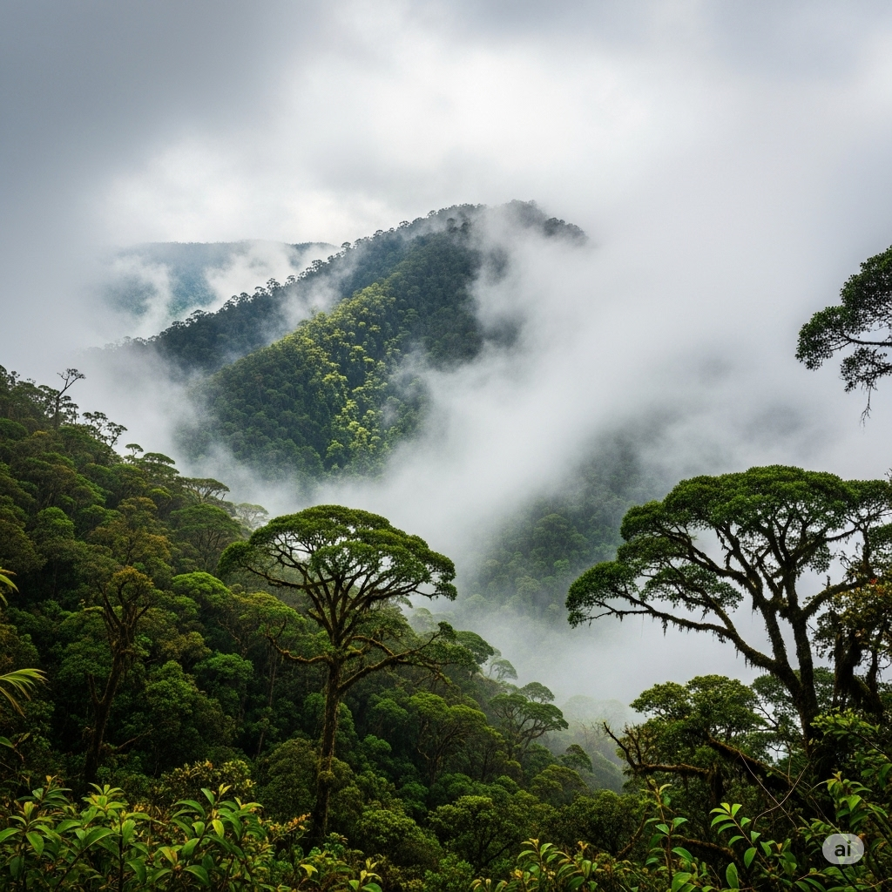

# a Dying Forest

**Rainforests** provide much of the world’s **oxygen** supply. But the forests’ **exotic** trees and animals are being killed to make room for farmers and roads. People have been trying to **conserve** rainforests for years. But another type of forest—the cloud forest—is just as **beneficial** to humans. Cloud forests are also in danger of disappearing, but little is being done to save them.

These forests are located at the tops of mountains, generally near the **equator**. These humid, **wooded** mountaintops are mainly in African and Central and South American countries. They are called “cloud forests” because their height allows for the **formation** of clouds among the trees.

Rainforests produce large amounts of oxygen. Cloud forests produce **comparative** amounts of water. The trees in these forests pull water out of the clouds. The moisture gathers on the leaves. When it drips, it is **deposited** into streams. The streams flow into towns at the bottom of the mountain. Then, it’s **distributed** to people. The yearly **cumulative** rainfall in these areas is 173-198 centimeters. Cloud forests can pull in up to 60 percent of that. This water is **crucial** to the plants and the people in the area. It helps them survive.

Cloud forests are also the **birthplace** of countless species of plants that can’t be found anywhere else. One small cloud forest has the **capacity** for as many types of plants as there are in all of Europe. There are so many, in fact, that scientists haven’t made a **comprehensive** list of them yet.

These forests are being destroyed with increasing **frequency**. Trees are being cut down, and roads are being built in their place. Some people have an **objective** to get **federal** money to protect the forests. But they have had little success. Another **strategy** is to replace the destroyed plants. That, too, has been difficult because the plants are so unique. There’s plenty of work to be done, but saving the cloud forests is still a possibility.

---
# a Dying Forest

**Rainforests** provide much of the world’s **oxygen** supply.

But the forests’ **exotic** trees and animals are being killed to make room for farmers and roads.

People have been trying to **conserve** rainforests for years.

But another type of forest—the cloud forest—is just as **beneficial** to humans.

Cloud forests are also in danger of disappearing, but little is being done to save them.

These forests are located at the tops of mountains, generally near the **equator**.

These humid, **wooded** mountaintops are mainly in African and Central and South American countries.

They are called “cloud forests” because their height allows for the **formation** of clouds among the trees.

Rainforests produce large amounts of oxygen.

Cloud forests produce **comparative** amounts of water.

The trees in these forests pull water out of the clouds.

The moisture gathers on the leaves.

When it drips, it is **deposited** into streams.

The streams flow into towns at the bottom of the mountain.

Then, it’s **distributed** to people.

The yearly **cumulative** rainfall in these areas is 173-198 centimeters.

Cloud forests can pull in up to 60 percent of that.

This water is **crucial** to the plants and the people in the area.

It helps them survive.

Cloud forests are also the **birthplace** of countless species of plants that can’t be found anywhere else.

One small cloud forest has the **capacity** for as many types of plants as there are in all of Europe.

There are so many, in fact, that scientists haven’t made a **comprehensive** list of them yet.

These forests are being destroyed with increasing **frequency**.

Trees are being cut down, and roads are being built in their place.

Some people have an **objective** to get **federal** money to protect the forests.

But they have had little success.

Another **strategy** is to replace the destroyed plants.

That, too, has been difficult because the plants are so unique.

There’s plenty of work to be done, but saving the cloud forests is still a possibility.

---

## 1. beneficial, adj

**Nghĩa trong câu truyện:** có lợi; tốt.
**Câu trong câu truyện:** "But another type of forest—the cloud forest—is just as beneficial to humans."

**Ví dụ:**
- Exercise is beneficial for your health.
- Reading is beneficial for the mind.
- This new policy is beneficial to the company.
- Sunlight can be beneficial in moderation.
- Learning a new language is beneficial.
- The rain was beneficial for the crops.
- It's beneficial to save money.
- This program is mutually beneficial.
- The changes were beneficial to everyone.
- Eating vegetables is very beneficial.
- The advice he gave was beneficial.
- It's beneficial to get enough sleep.

## 2. birthplace, n

**Nghĩa trong câu truyện:** nơi một người hoặc một thứ gì đó bắt đầu tồn tại.
**Câu trong câu truyện:** "Cloud forests are also the birthplace of countless species of plants that can’t be found anywhere else."

**Ví dụ:**
- This city is his birthplace.
- The small village is the birthplace of the artist.
- This region is considered the birthplace of democracy.
- The cafe is the birthplace of many ideas.
- This house is my mother's birthplace.
- The river's birthplace is high in the mountains.
- This country is the birthplace of jazz music.
- They visited the birthplace of the famous writer.
- The company's birthplace was a small garage.
- This forest is the birthplace of rare animals.
- The island is the birthplace of a unique culture.
- He returned to his birthplace after many years.

## 3. capacity, n

**Nghĩa trong câu truyện:** khả năng chứa hoặc chứa đựng thứ gì đó; khả năng làm điều gì đó.
**Câu trong câu truyện:** "One small cloud forest has the capacity for as many types of plants as there are in all of Europe."

**Ví dụ:**
- The room has a seating capacity of 100 people.
- The battery has a large capacity.
- He has a great capacity for learning.
- The stadium was filled to capacity.
- The factory is operating at full capacity.
- She has a remarkable capacity for empathy.
- The hard drive has a storage capacity of 1 terabyte.
- The human brain has an enormous capacity.
- The truck has a loading capacity of 5 tons.
- He showed a great capacity for leadership.
- The theater has a capacity of 500 seats.
- The new system increased our production capacity.

## 4. comparative, adj

**Nghĩa trong câu truyện:** được đo hoặc đánh giá bằng cách so sánh với thứ khác.
**Câu trong câu truyện:** "Cloud forests produce comparative amounts of water."

**Ví dụ:**
- We made a comparative study of the two methods.
- The cost was low in comparative terms.
- She has a comparative advantage in this area.
- They discussed the comparative merits of each option.
- The results showed a comparative improvement.
- This is a comparative analysis of the data.
- His speed is comparative to a professional runner.
- We looked at the comparative performance of the teams.
- The report provides a comparative overview.
- The two products have comparative features.
- There was a comparative increase in sales.
- The test measures comparative ability.

## 5. comprehensive, adj

**Nghĩa trong câu truyện:** bao gồm hoặc bao quát tất cả hoặc hầu hết các khía cạnh của thứ gì đó.
**Câu trong câu truyện:** "There are so many, in fact, that scientists haven’t made a comprehensive list of them yet."

**Ví dụ:**
- The book provides a comprehensive guide to the subject.
- We need a comprehensive plan.
- The report was very comprehensive.
- She received a comprehensive education.
- The insurance policy offers comprehensive coverage.
- They conducted a comprehensive review.
- The list is not comprehensive.
- He gave a comprehensive answer.
- The library has a comprehensive collection.
- We need a comprehensive approach to the problem.
- The training was comprehensive.
- The document provides comprehensive details.

## 6. conserve, v

**Nghĩa trong câu truyện:** bảo vệ thứ gì đó khỏi bị mất hoặc lãng phí; bảo tồn.
**Câu trong câu truyện:** "People have been trying to conserve rainforests for years."

**Ví dụ:**
- We should conserve water.
- They are working to conserve wildlife.
- It's important to conserve energy.
- The organization helps conserve historical buildings.
- We need to conserve our natural resources.
- He tried to conserve his strength.
- The goal is to conserve the environment.
- They are teaching people how to conserve food.
- We must conserve these ancient traditions.
- The park was created to conserve the landscape.
- Try to conserve fuel when driving.
- It is our duty to conserve the planet.

## 7. crucial, adj

**Nghĩa trong câu truyện:** cực kỳ quan trọng hoặc cần thiết.
**Câu trong câu truyện:** "This water is crucial to the plants and the people in the area."

**Ví dụ:**
- This decision is crucial for our future.
- Timing is crucial in this situation.
- It is crucial to follow the instructions.
- Communication is crucial for a good relationship.
- Getting enough sleep is crucial for health.
- This step is crucial to the process.
- The support of my family was crucial.
- It's crucial that you arrive on time.
- This information is crucial for the investigation.
- The final exam is crucial.
- Water is crucial for survival.
- His help was absolutely crucial.

## 8. cumulative, adj

**Nghĩa trong câu truyện:** tăng dần về số lượng, khối lượng hoặc mức độ bằng cách tích lũy.
**Câu trong câu truyện:** "The yearly cumulative rainfall in these areas is 173-198 centimeters."

**Ví dụ:**
- The cumulative effect of pollution is harmful.
- The cumulative score determines the winner.
- The cumulative impact of small changes can be significant.
- This is the cumulative total over five years.
- The cumulative stress led to burnout.
- The cumulative evidence points to his guilt.
- The cumulative effect of practice is improvement.
- We calculated the cumulative sales figures.
- The cumulative damage was extensive.
- The cumulative interest on the loan was high.
- The cumulative effect of these factors is unknown.
- The cumulative result was surprising.

## 9. deposit, v

**Nghĩa trong câu truyện:** đặt hoặc để thứ gì đó ở một nơi cụ thể.
**Câu trong câu truyện:** "When it drips, it is deposited into streams."

**Ví dụ:**
- Please deposit your trash in the bin.
- She deposited the money in her bank account.
- The river deposits sediment at the delta.
- He deposited the keys on the table.
- The snow was deposited on the ground.
- Please deposit your luggage here.
- The machine deposits coins.
- The birds deposit seeds in different places.
- He deposited the letter in the mailbox.
- The flood deposited mud everywhere.
- They deposited the documents in the safe.
- The glacier deposited rocks and soil.

## 10. distribute, v

**Nghĩa trong câu truyện:** chia sẻ thứ gì đó trong một nhóm người; cung cấp hàng hóa cho các cửa hàng hoặc khách hàng.
**Câu trong câu truyện:** "Then, it’s distributed to people."

**Ví dụ:**
- The teacher will distribute the test papers.
- They distribute food to the homeless.
- The company distributes its products nationwide.
- The heat is distributed evenly by the system.
- Please distribute these flyers.
- The profits were distributed among the shareholders.
- The organization helps distribute aid.
- The network distributes television signals.
- The tasks were distributed among the team members.
- They distribute newspapers every morning.
- The water is distributed through pipes.
- The software is distributed online.

## 11. equator, n

**Nghĩa trong câu truyện:** một đường tưởng tượng quanh Trái đất cách đều hai cực, chia Trái đất thành bán cầu bắc và nam.
**Câu trong câu truyện:** "These forests are located at the tops of mountains, generally near the equator."

**Ví dụ:**
- The equator is an imaginary line.
- Countries near the equator are often hot.
- The sun is directly overhead at the equator during the equinoxes.
- The equator divides the Earth into two hemispheres.
- The climate near the equator is tropical.
- Singapore is located very close to the equator.
- The length of day and night is almost equal at the equator.
- The equator is at 0 degrees latitude.
- Many rainforests are found near the equator.
- The air pressure is generally low at the equator.
- The magnetic equator is slightly different from the geographic equator.
- He crossed the equator on his journey.

## 12. exotic, adj

**Nghĩa trong câu truyện:** có nguồn gốc từ một quốc gia nước ngoài; khác thường và thú vị.
**Câu trong câu truyện:** "But the forests’ exotic trees and animals are being killed to make room for farmers and roads."

**Ví dụ:**
- She likes to travel to exotic places.
- The market sells exotic fruits.
- He has a collection of exotic birds.
- The restaurant serves exotic dishes.
- She wore an exotic dress.
- The garden was full of exotic plants.
- He told stories of his exotic adventures.
- The music had an exotic sound.
- They saw many exotic animals at the zoo.
- The perfume had an exotic scent.
- She dreams of living in an exotic country.
- The store sells exotic spices.

## 13. federal, adj

**Nghĩa trong câu truyện:** liên quan đến chính phủ trung ương, chứ không phải chính phủ của một bang hoặc khu vực.
**Câu trong câu truyện:** "Some people have an objective to get federal money to protect the forests."

**Ví dụ:**
- The federal government is based in Washington D.C.
- He works for a federal agency.
- The crime is a federal offense.
- They received federal funding for the project.
- The federal law applies nationwide.
- She pays federal taxes.
- The federal reserve controls monetary policy.
- He was elected to a federal position.
- The case went to federal court.
- The state and federal governments share power.
- The federal budget was approved.
- They followed federal guidelines.

## 14. formation, n

**Nghĩa trong câu truyện:** quá trình hoặc cách thức hình thành hoặc được tạo ra; một cấu trúc hoặc sự sắp xếp cụ thể.
**Câu trong câu truyện:** "They are called “cloud forests” because their height allows for the formation of clouds among the trees."

**Ví dụ:**
- The formation of mountains took millions of years.
- They studied the rock formation.
- The clouds were in a strange formation.
- The formation of ice crystals causes frost.
- The team practiced their formation.
- The formation of a new government was announced.
- The formation of stars occurs in nebulae.
- They observed the bird formation in the sky.
- The formation of rust is a chemical process.
- The dancers moved into a new formation.
- The formation of the company was in 2005.
- The geological formation was unique.

## 15. frequency, n

**Nghĩa trong câu truyện:** tốc độ mà thứ gì đó xảy ra hoặc được lặp lại.
**Câu trong câu truyện:** "These forests are being destroyed with increasing frequency."

**Ví dụ:**
- The train runs with high frequency.
- He visits his parents with increasing frequency.
- What is the frequency of these events?
- The radio station broadcasts on a specific frequency.
- The frequency of his headaches increased.
- She checks her email with great frequency.
- The data shows the frequency of accidents.
- The sound wave has a high frequency.
- The bus service has a low frequency on Sundays.
- The doctor asked about the frequency of her symptoms.
- The earthquake occurred with low frequency.
- We adjusted the frequency of the reports.

## 16. objective, adj

**Nghĩa trong câu truyện:** (được sử dụng như danh từ trong câu truyện) một mục tiêu hoặc mục đích.
**Câu trong câu truyện:** "Some people have an objective to get federal money to protect the forests."

**Ví dụ:**
- His objective is to finish the project on time.
- What is your main objective?
- The company's objective is to increase sales.
- They set clear objectives for the meeting.
- Our objective is to provide the best service.
- The military objective was to capture the bridge.
- She achieved her objective.
- The objective of the game is to score points.
- We need to define our objectives.
- His objective was to help others.
- The training program has specific learning objectives.
- They failed to meet their objective.

## 17. oxygen, n

**Nghĩa trong câu truyện:** một loại khí không màu, không mùi cần thiết cho sự sống.
**Câu trong câu truyện:** "Rainforests provide much of the world’s oxygen supply."

**Ví dụ:**
- Humans need oxygen to breathe.
- Plants produce oxygen.
- The air is made up of nitrogen and oxygen.
- He needed extra oxygen in the hospital.
- Fish get oxygen from the water.
- The fire needs oxygen to burn.
- Divers use oxygen tanks.
- There is less oxygen at high altitudes.
- The doctor checked her oxygen level.
- Oxygen is a chemical element.
- The process of photosynthesis releases oxygen.
- We breathed in the fresh oxygen.

## 18. rainforest, n

**Nghĩa trong câu truyện:** một khu rừng rậm rạp ở vùng nhiệt đới có lượng mưa lớn.
**Câu trong câu truyện:** "Rainforests provide much of the world’s oxygen supply."

**Ví dụ:**
- The Amazon is the largest rainforest.
- Many unique animals live in the rainforest.
- The rainforest climate is hot and humid.
- Logging is destroying the rainforests.
- We visited a rainforest in Costa Rica.
- The rainforest floor is dark.
- There are many layers in a rainforest.
- The rainforest is home to indigenous tribes.
- Protecting the rainforest is important.
- The sound of the rainforest is amazing.
- They studied the plants in the rainforest.
- The rainforest receives a lot of rain.

## 19. strategy, n

**Nghĩa trong câu truyện:** một kế hoạch hành động được thiết kế để đạt được một mục tiêu dài hạn hoặc tổng thể.
**Câu trong câu truyện:** "Another strategy is to replace the destroyed plants."

**Ví dụ:**
- They developed a new marketing strategy.
- What is your strategy for winning?
- The company's business strategy is successful.
- We need a clear strategy to solve this problem.
- His chess strategy was brilliant.
- The military planned their strategy.
- This is a long-term strategy.
- They discussed their negotiation strategy.
- The government announced its economic strategy.
- Having a good strategy is key to success.
- We need to rethink our strategy.
- Her investment strategy paid off.

## 20. wooded, adj

**Nghĩa trong câu truyện:** (của đất đai) được bao phủ bởi cây cối.
**Câu trong câu truyện:** "These humid, wooded mountaintops are mainly in African and Central and South American countries."

**Ví dụ:**
- We walked through a wooded area.
- The house is located on a wooded hill.
- The path led into a dense wooded forest.
- The property includes a large wooded lot.
- They enjoyed hiking in the wooded mountains.
- The area is mostly wooded.
- We saw deer in the wooded park.
- The cabin was surrounded by wooded land.
- The trail was shaded by wooded trees.
- It was a beautiful wooded landscape.
- The campsite was in a wooded clearing.
- The map showed a large wooded region.