# The **Solar** Car Race

We live in a **mobile** society. But the cars we drive require too much gas, plus they **pollute** the air. Eventually, the natural resources used to make gas will run out. So what happens then? Many people think **solar**-powered **automobiles** are the answer. To learn more about this type of **transportation**, teams from universities and **corporate** organizations gather in Australia every two years for a **solar** car race.

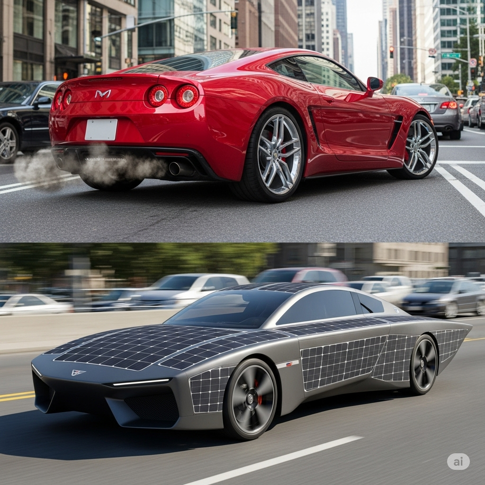

The race is called the World **Solar** Challenge. **Candidates** for this **tournament** must design their own cars. The teams keep all their plans **confidential**. They don’t **interact** with other teams because the race is very competitive. And these cars aren’t just **enhanced** and **modified** versions of normal cars. They are completely different.

The cars only have room for one person and are very simple inside—they don’t even have a cushion for the driver to sit on. These cars are shorter and much more flat than normal cars. Most importantly, the cars **incorporate** **solar** panels onto the outside that lie **parallel** to each other. These panels are made from materials that take in light from the sun and turn it into electric energy. That’s how they move.

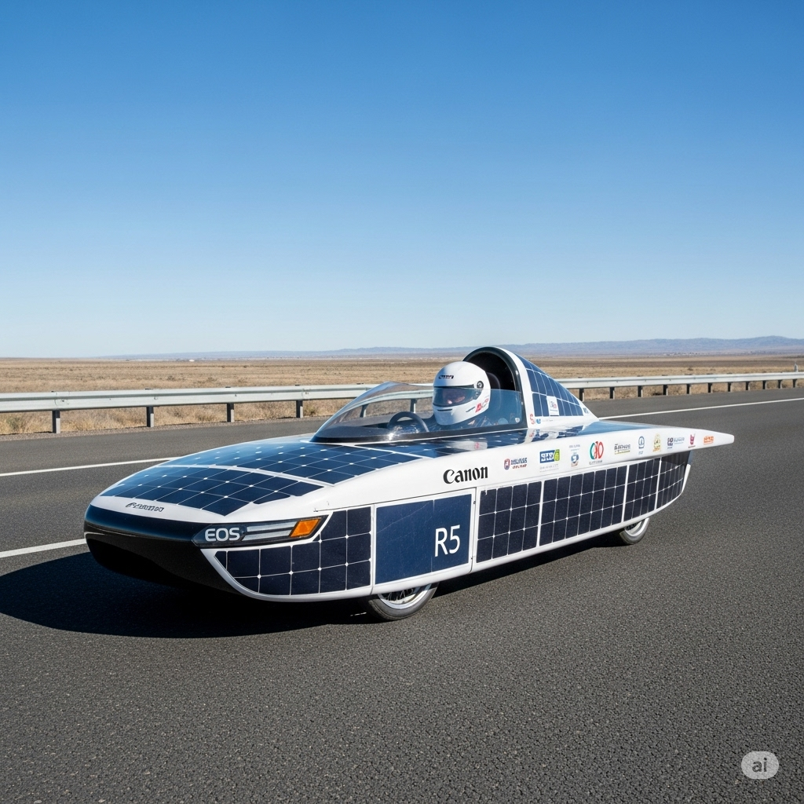

These cars race over 3,000 kilometers across the Australian **territories**. The drivers have to heed strict **guidelines**. They must stop at certain **intervals** to charge their batteries. And unlike normal race cars, they can’t go very fast. They have to drive at the normal speed limits. Although the drivers want to finish the race quickly, that is not the main goal. The objective is to see how well the cars work under normal driving conditions.

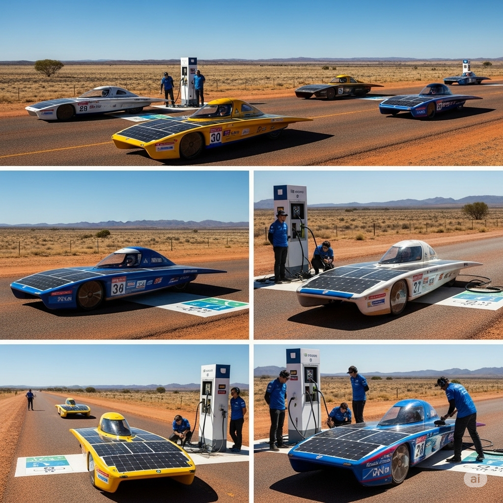

Because of the World **Solar** Challenge, a new **era** in car making and in driving is beginning. People may **ridicule** the **solar** cars because they look strange, but this is a **phenomenon** that isn’t going away. Using the technology from the vehicles, car makers will eventually create **solar** cars for the rest of us.

---

We live in a **mobile** society.

But the cars we drive require too much gas, plus they **pollute** the air.

Eventually, the natural resources used to make gas will run out.

So what happens then?

Many people think **solar**-powered **automobiles** are the answer.

To learn more about this type of **transportation**, teams from universities and **corporate** organizations gather in Australia every two years for a **solar** car race.

The race is called the World **Solar** Challenge.

**Candidates** for this **tournament** must design their own cars.

The teams keep all their plans **confidential**.

They don’t **interact** with other teams because the race is very competitive.

And these cars aren’t just **enhanced** and **modified** versions of normal cars.

They are completely different.

The cars only have room for one person and are very simple inside—they don’t even have a cushion for the driver to sit on.

These cars are shorter and much more flat than normal cars.

Most importantly, the cars **incorporate** **solar** panels onto the outside that lie **parallel** to each other.

These panels are made from materials that take in light from the sun and turn it into electric energy.

That’s how they move.

These cars race over 3,000 kilometers across the Australian **territories**.

The drivers have to heed strict **guidelines**.

They must stop at certain **intervals** to charge their batteries.

And unlike normal race cars, they can’t go very fast.

They have to drive at the normal speed limits.

Although the drivers want to finish the race quickly, that is not the main goal.

The objective is to see how well the cars work under normal driving conditions.

Because of the World **Solar** Challenge, a new **era** in car making and in driving is beginning.

People may **ridicule** the **solar** cars because they look strange, but this is a **phenomenon** that isn’t going away.

Using the technology from the vehicles, car makers will eventually create **solar** cars for the rest of us.

---

automobile

candidate

confidential

corporate

enhance

era

guideline

incorporate

interact

interval

mobile

modify

parallel

phenomenon

pollute

ridicule

solar

territory

tournament

transportation

---

## 1. **automobile** (n)
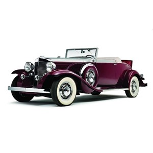
- Nghĩa trong truyện: xe ô tô
- Câu xuất hiện: "Many people think solar-powered **automobiles** are the answer."
- Ví dụ:
  - I bought a new automobile.
  - Automobiles are parked outside.
  - She drives her automobile to work.
  - The automobile is very fast.
  - Automobiles need fuel to run.

---

## 2. **candidate** (n)

- Nghĩa trong truyện: thí sinh, người dự thi
- Câu xuất hiện: "**Candidates** for this tournament must design their own cars."
- Ví dụ:
  - He is a candidate for the job.
  - There are three candidates in the race.
  - The candidate answered all questions.
  - She is the best candidate.
  - Candidates must apply before Friday.

---

## 3. **confidential** (adj)

- Nghĩa trong truyện: bí mật
- Câu xuất hiện: "The teams keep all their plans **confidential**."
- Ví dụ:
  - This is a confidential document.
  - Please keep this information confidential.
  - The meeting is confidential.
  - Confidential files are locked.
  - He shared a confidential secret.

---

## 4. **corporate** (adj)

- Nghĩa trong truyện: thuộc về công ty, tổ chức
- Câu xuất hiện: "teams from universities and **corporate** organizations gather in Australia..."
- Ví dụ:
  - She works in a corporate office.
  - Corporate rules are strict.
  - The corporate team is large.
  - Corporate meetings are important.
  - He joined a corporate company.

---

## 5. **enhance** (v)

- Nghĩa trong truyện: nâng cấp, cải tiến
- Câu xuất hiện: "these cars aren’t just **enhanced** and modified versions of normal cars."
- Ví dụ:
  - The new paint will enhance the house.
  - Music can enhance your mood.
  - We enhance the photo quality.
  - Training will enhance your skills.
  - Lights enhance the room.

---

## 6. **era** (n)

- Nghĩa trong truyện: thời đại
- Câu xuất hiện: "a new **era** in car making and in driving is beginning."
- Ví dụ:
  - We live in a digital era.
  - The era of dinosaurs ended long ago.
  - This marks a new era.
  - The era lasted for decades.
  - It was the era of kings.

---

## 7. **guideline** (n)

- Nghĩa trong truyện: hướng dẫn, quy định
- Câu xuất hiện: "The drivers have to heed strict **guidelines**."
- Ví dụ:
  - Follow the guidelines.
  - Guidelines help us work safely.
  - The teacher gave guidelines.
  - Read the guidelines before starting.
  - Guidelines are important.

---

## 8. **incorporate** (v)

- Nghĩa trong truyện: tích hợp, kết hợp
- Câu xuất hiện: "the cars **incorporate** solar panels onto the outside..."
- Ví dụ:
  - We incorporate new ideas.
  - The recipe incorporates cheese.
  - Please incorporate these changes.
  - The design incorporates blue colors.
  - They incorporate feedback.

---

## 9. **interact** (v)

- Nghĩa trong truyện: tương tác
- Câu xuất hiện: "They don’t **interact** with other teams..."
- Ví dụ:
  - Children interact at school.
  - I interact with my friends online.
  - The teacher interacts with students.
  - Animals interact in nature.
  - We interact during meetings.

---

## 10. **interval** (n)
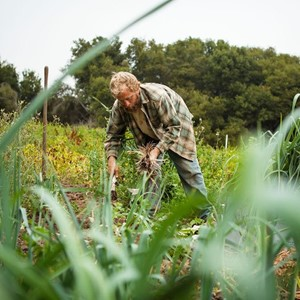
- Nghĩa trong truyện: khoảng thời gian
- Câu xuất hiện: "They must stop at certain **intervals** to charge their batteries."
- Ví dụ:
  - There is a short interval between classes.
  - The show has a ten-minute interval.
  - Take breaks at regular intervals.
  - The interval was too long.
  - We rest at intervals.

---

## 11. **mobile** (adj)
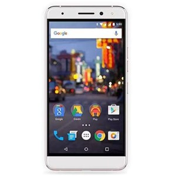
- Nghĩa trong truyện: di động, dễ di chuyển
- Câu xuất hiện: "We live in a **mobile** society."
- Ví dụ:
  - Mobile phones are popular.
  - She has a mobile job.
  - The table is mobile.
  - Mobile devices are everywhere.
  - He is very mobile.

---

## 12. **modify** (v)

- Nghĩa trong truyện: sửa đổi, thay đổi
- Câu xuất hiện: "these cars aren’t just enhanced and **modified** versions of normal cars."
- Ví dụ:
  - Please modify the plan.
  - We modify the design.
  - The car was modified.
  - Modify your answer.
  - They modify the rules.

---

## 13. **parallel** (adj)
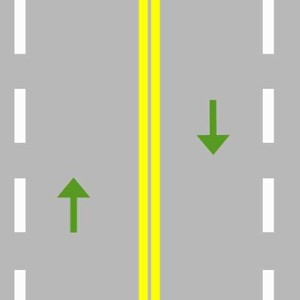
- Nghĩa trong truyện: song song
- Câu xuất hiện: "solar panels onto the outside that lie **parallel** to each other."
- Ví dụ:
  - The lines are parallel.
  - Draw two parallel roads.
  - The walls are parallel.
  - The trains run parallel.
  - Parallel lines never meet.

---

## 14. **phenomenon** (n)

- Nghĩa trong truyện: hiện tượng
- Câu xuất hiện: "this is a **phenomenon** that isn’t going away."
- Ví dụ:
  - Rainbows are a phenomenon.
  - The phenomenon surprised us.
  - It is a rare phenomenon.
  - The phenomenon is studied.
  - Lightning is a natural phenomenon.

---

## 15. **pollute** (v)

- Nghĩa trong truyện: làm ô nhiễm
- Câu xuất hiện: "they **pollute** the air."
- Ví dụ:
  - Cars pollute the air.
  - Factories pollute rivers.
  - Do not pollute the beach.
  - Smoke can pollute the sky.
  - Litter pollutes the park.

---

## 16. **ridicule** (v)

- Nghĩa trong truyện: chế giễu, cười nhạo
- Câu xuất hiện: "People may **ridicule** the solar cars because they look strange..."
- Ví dụ:
  - Do not ridicule others.
  - He was ridiculed for his idea.
  - They ridicule her clothes.
  - The movie ridicules the hero.
  - She felt ridiculed.

---

## 17. **solar** (adj)
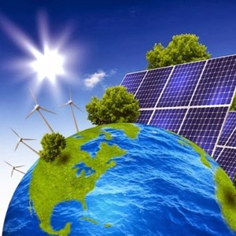
- Nghĩa trong truyện: thuộc về mặt trời, năng lượng mặt trời
- Câu xuất hiện: "Many people think **solar**-powered automobiles are the answer."
- Ví dụ:
  - Solar energy is clean.
  - We use solar panels.
  - Solar lights are bright.
  - Solar power is cheap.
  - The house has solar cells.

---

## 18. **territory** (n)
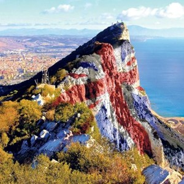
- Nghĩa trong truyện: lãnh thổ
- Câu xuất hiện: "These cars race over 3,000 kilometers across the Australian **territories**."
- Ví dụ:
  - The dog protects its territory.
  - Birds mark their territory.
  - This is our territory.
  - The territory is large.
  - They crossed into new territory.

---

## 19. **tournament** (n)
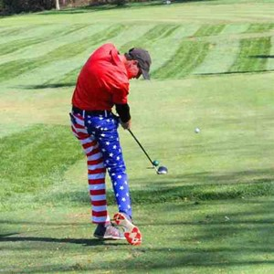
- Nghĩa trong truyện: giải đấu
- Câu xuất hiện: "Candidates for this **tournament** must design their own cars."
- Ví dụ:
  - The tournament starts today.
  - He won the tournament.
  - Many teams join the tournament.
  - The tournament lasts a week.
  - She plays in the tournament.

---

## 20. **transportation** (n)
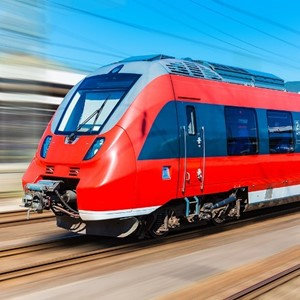
- Nghĩa trong truyện: phương tiện di chuyển, vận tải
- Câu xuất hiện: "To learn more about this type of **transportation**..."
- Ví dụ:
  - Buses are a type of transportation.
  - Transportation is important.
  - We use transportation daily.
  - The city has good transportation.
  - Transportation costs money.