# The **Heirs** 

Martin, Paul and Tom were brothers. They were very different, but they were **consistent** about two things. They couldn’t succeed in business, and they never agreed about anything. Martin was a hardworking farmer, growing **organic** vegetables and raising **poultry**. But he was disorganized and forgot to pay his **bills**. Paul owned a **textile** factory that produced clothes. He was organized, but he was greedy and took too much clothing. His **wardrobe** was filled with his own products. Tom was once a **sergeant** in the army. He ran a **martial** arts school, but his **stance** on discipline was too strong. He had almost no students.

One day, they received a **telegraph** saying that their father had died. They were **heirs** to his old farm. They planned to sell it as soon as possible, so they went to see it even though there was a terrible storm. The house didn’t look great, but there was a lot of land. There was so much, in fact, that they could barely see its **boundary**.

Suddenly, the storm got worse. The **sheer** force of the wind almost knocked them over. Martin said, “Look, it’s a **typhoon**!” Paul said, “No, it’s a **cyclone**.” Tom said, “No, it’s a **tornado**!” They argued until Paul began to **wail** and said, “Whatever it is, it’s coming right at us! We’re **doomed**!” The three brothers **scrambled** inside the old house. Martin said, “If we survive, we must stop fighting. This farm could be great if we fixed it up. With my hard work, Paul’s organization and Tom’s discipline, we could run a great business together!” The storm finally ended. And luckily, it didn’t wreck the farm.

“Just think,” Martin said, “it took the **chaos** of a **typhoon** to bring us together.” Paul replied, “You mean a **cyclone** brought us together.” Tom said, “Didn’t I tell you both that it was a **tornado**?” The brothers never agreed on what kind of storm it was, but by combining their skills, they started a successful farm.

---
## Sentences in story 
Martin, Paul and Tom were brothers.

They were very different, but they were **consistent** about two things.

They couldn’t succeed in business, and they never agreed about anything.

Martin was a hardworking farmer, growing **organic** vegetables and raising **poultry**.

But he was disorganized and forgot to pay his **bills**.

Paul owned a **textile** factory that produced clothes.

He was organized, but he was greedy and took too much clothing.

His **wardrobe** was filled with his own products.

Tom was once a **sergeant** in the army.

He ran a **martial** arts school, but his **stance** on discipline was too strong.

He had almost no students.

One day, they received a **telegraph** saying that their father had died.

They were **heirs** to his old farm.

They planned to sell it as soon as possible, so they went to see it even though there was a terrible storm.

The house didn’t look great, but there was a lot of land.

There was so much, in fact, that they could barely see its **boundary**.

Suddenly, the storm got worse.

The **sheer** force of the wind almost knocked them over.

Martin said, “Look, it’s a **typhoon**!”

Paul said, “No, it’s a **cyclone**.”

Tom said, “No, it’s a **tornado**!”

They argued until Paul began to **wail** and said, “Whatever it is, it’s coming right at us! We’re **doomed**!”

The three brothers **scrambled** inside the old house.

Martin said, “If we survive, we must stop fighting.

This farm could be great if we fixed it up.

With my hard work, Paul’s organization and Tom’s discipline, we could run a great business together!”

The storm finally ended.

And luckily, it didn’t wreck the farm.

“Just think,” Martin said, “it took the **chaos** of a **typhoon** to bring us together.”

Paul replied, “You mean a **cyclone** brought us together.”

Tom said, “Didn’t I tell you both that it was a **tornado**?”

The brothers never agreed on what kind of storm it was, but by combining their skills, they started a successful farm.

---

bill, 

boundary

chaos

consistent

cyclone

heir

doomed

martial

organic

poultry

scramble,

sergeant

sheer

stance

telegraph

textile

tornado

typhoon

wail

wardrobe

---

## 1. **bill** (n)

- Nghĩa trong truyện: hóa đơn
- Câu xuất hiện: "But he was disorganized and forgot to pay his **bills**."
- Ví dụ:
  - I have to pay the bills.
  - The bill is due next week.
  - He received a large bill.
  - She paid the bill online.
  - The bill was too high.

---

## 2. **boundary** (n)
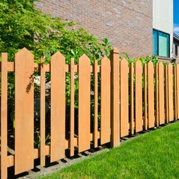
- Nghĩa trong truyện: ranh giới
- Câu xuất hiện: "that they could barely see its **boundary**."
- Ví dụ:
  - The fence marks the boundary.
  - Do not cross the boundary.
  - The boundary is clearly defined.
  - The river is the boundary.
  - They set the boundary.

---

## 3. **chaos** (n)

- Nghĩa trong truyện: sự hỗn loạn
- Câu xuất hiện: "it took the **chaos** of a typhoon to bring us together."
- Ví dụ:
  - The city was in chaos.
  - There was chaos after the storm.
  - The meeting ended in chaos.
  - The chaos was overwhelming.
  - Everything was in chaos.

---

## 4. **consistent** (adj)
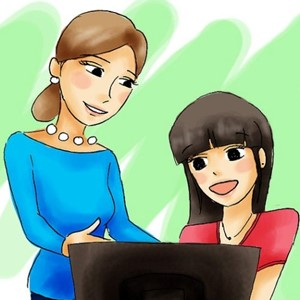
- Nghĩa trong truyện: nhất quán, kiên định
- Câu xuất hiện: "They were very different, but they were **consistent** about two things."
- Ví dụ:
  - He is a consistent worker.
  - Her story is consistent.
  - Be consistent with your rules.
  - The results are consistent.
  - He is consistent in his actions.

---

## 5. **cyclone** (n)
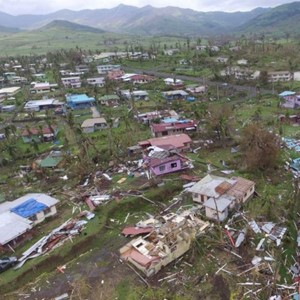
- Nghĩa trong truyện: lốc xoáy
- Câu xuất hiện: "No, it’s a **cyclone**."
- Ví dụ:
  - The cyclone hit the coast.
  - A cyclone is a strong storm.
  - The cyclone caused damage.
  - They prepared for the cyclone.
  - The cyclone destroyed homes.

---

## 6. **heir** (n)

- Nghĩa trong truyện: người thừa kế
- Câu xuất hiện: "They were **heirs** to his old farm."
- Ví dụ:
  - He is the heir to the throne.
  - She is the heir to the fortune.
  - The heir inherited the land.
  - The king named his heir.
  - The heir is very young.

---

## 7. **doomed** (adj)
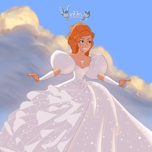
- Nghĩa trong truyện: обречённый
- Câu xuất hiện: "Whatever it is, it’s coming right at us! We’re **doomed**!"
- Ví dụ:
  - We are all doomed.
  - The ship is doomed.
  - He is doomed to fail.
  - They are doomed to repeat the past.
  - The project is doomed from the start.

---

## 8. **martial** (adj)
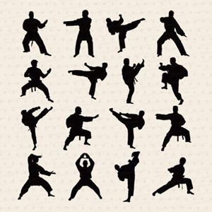
- Nghĩa trong truyện: thuộc về võ thuật
- Câu xuất hiện: "He ran a **martial** arts school..."
- Ví dụ:
  - He practices martial arts.
  - She is skilled in martial arts.
  - Martial law was declared.
  - The martial arts school is popular.
  - He teaches martial arts.

---

## 9. **organic** (adj)

- Nghĩa trong truyện: hữu cơ
- Câu xuất hiện: "growing **organic** vegetables..."
- Ví dụ:
  - She buys organic food.
  - Organic farming is healthy.
  - Organic products are expensive.
  - He grows organic tomatoes.
  - Organic food is better.

---

## 10. **poultry** (n)
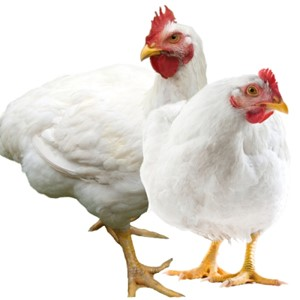
- Nghĩa trong truyện: gia cầm
- Câu xuất hiện: "growing organic vegetables and raising **poultry**."
- Ví dụ:
  - They raise poultry on the farm.
  - Poultry includes chickens and ducks.
  - Poultry is a good source of protein.
  - He sells poultry at the market.
  - Poultry farming is common.

---

## 11. **scramble** (v)

- Nghĩa trong truyện: vội vã, tranh giành
- Câu xuất hiện: "The three brothers **scrambled** inside the old house."
- Ví dụ:
  - They scrambled for the door.
  - The climbers scrambled up the hill.
  - He scrambled to find his keys.
  - The children scrambled for candy.
  - We scrambled to finish the work.

---

## 12. **sergeant** (n)
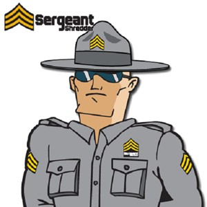
- Nghĩa trong truyện: trung sĩ
- Câu xuất hiện: "Tom was once a **sergeant** in the army."
- Ví dụ:
  - The sergeant gave orders.
  - He is a sergeant in the army.
  - The sergeant is in charge.
  - She is a police sergeant.
  - The sergeant trained the soldiers.

---

## 13. **sheer** (adj)

- Nghĩa trong truyện: hoàn toàn, tuyệt đối
- Câu xuất hiện: "The **sheer** force of the wind almost knocked them over."
- Ví dụ:
  - The sheer drop was scary.
  - It was sheer luck.
  - The sheer size was impressive.
  - Sheer curtains let in light.
  - The sheer volume was overwhelming.

---

## 14. **stance** (n)

- Nghĩa trong truyện: lập trường, quan điểm
- Câu xuất hiện: "but his **stance** on discipline was too strong."
- Ví dụ:
  - He has a strong stance on the issue.
  - Her stance is very clear.
  - The company changed its stance.
  - He took a firm stance.
  - What is your stance on this?

---

## 15. **telegraph** (n)
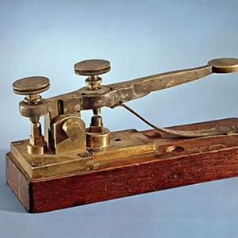
- Nghĩa trong truyện: điện báo
- Câu xuất hiện: "they received a **telegraph** saying that their father had died."
- Ví dụ:
  - They sent a telegraph.
  - The telegraph is old technology.
  - He received a telegraph message.
  - The telegraph operator sent the news.
  - The telegraph was used for quick communication.

---

## 16. **textile** (n)
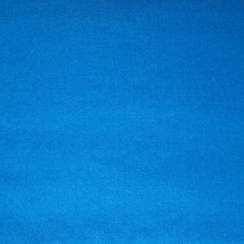
- Nghĩa trong truyện: vải
- Câu xuất hiện: "Paul owned a **textile** factory that produced clothes."
- Ví dụ:
  - The textile industry is large.
  - They produce textiles.
  - The textile is very soft.
  - The textile factory is busy.
  - She works in the textile business.

---

## 17. **tornado** (n)
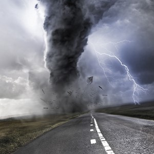
- Nghĩa trong truyện: lốc xoáy
- Câu xuất hiện: "No, it’s a **tornado**!"
- Ví dụ:
  - The tornado destroyed the town.
  - A tornado is a dangerous storm.
  - They hid from the tornado.
  - The tornado sirens went off.
  - The tornado caused widespread damage.

---

## 18. **typhoon** (n)
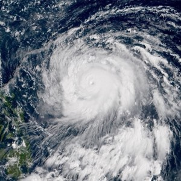
- Nghĩa trong truyện: bão lớn
- Câu xuất hiện: "Look, it’s a **typhoon**!"
- Ví dụ:
  - The typhoon hit the island.
  - A typhoon is a tropical storm.
  - The typhoon caused flooding.
  - They evacuated before the typhoon.
  - The typhoon damaged the port.

---

## 19. **wail** (v)
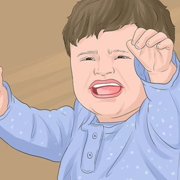
- Nghĩa trong truyện: than khóc
- Câu xuất hiện: "They argued until Paul began to **wail**..."
- Ví dụ:
  - The baby began to wail.
  - She wailed in sorrow.
  - The siren wailed loudly.
  - He wailed in pain.
  - The wind wailed through the trees.

---

## 20. **wardrobe** (n)
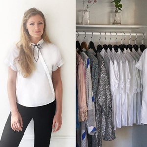
- Nghĩa trong truyện: tủ quần áo
- Câu xuất hiện: "His **wardrobe** was filled with his own products."
- Ví dụ:
  - She has a large wardrobe.
  - He needs a new wardrobe.
  - The wardrobe is full of clothes.
  - She organized her wardrobe.
  - The wardrobe is made of wood.