# Life on the Farm

Bill was an excellent **capitalist**. He **financed** a large aviation **enterprise** that made a lot of money. He knew how to **maximize** **monetary** gains in every business deal he made. Bill had one big problem, though. He was unhappy all the time. Bill knew that he had to do something about it, or he would be depressed for the rest of his life.

One day, Bill was in his office when he heard a knock at the door. “Come in!” Bill said loudly.

His **accountant**, Jane, walked in. Jane said, “Sir, I haven’t seen you smile in a year. What are you so sad about? Your company is doing very well.”

Bill told her, “I’m **indifferent** about my company’s success. I have **contempt** toward my job. I just want to do something I enjoy. I’ve always loved growing plants as a hobby. I’m going to quit my job and become a farmer!”

“You’re crazy!” Jane said.

“I don’t think so,” Bill replied. “I want the **simplicity** of a life on a farm. I’m tired of all this stress. Farming will make me happy.”

The very next day, Bill carried out the **preliminary** task of buying land and tools. Then he got to work. He **sowed** many types of seeds. He planted **soy**, cabbage, carrots, and onions.

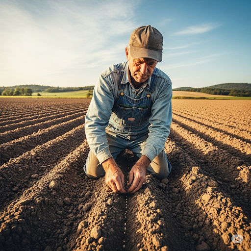

“The **upcoming** summer is going to be very dry,” thought Bill. “I need to **irrigate** my crops as a **precaution**, in case it doesn’t rain enough.” He took his **spade** and dug a **ditch** down the middle of his farm. “Water from the stream will flow down the **ditch** and **saturate** the soil around every plant,” Bill thought.

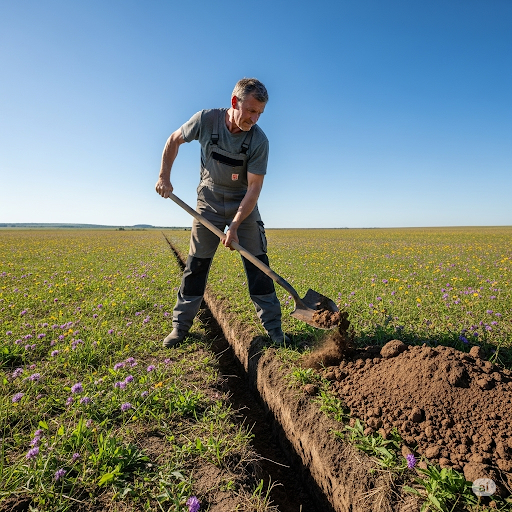

Bill **dedicated** himself to farming. After a year, his farm looked **exquisite**. Most importantly, Bill was happy. He finally had the life he always wanted.

---------

## List of word
accountant capitalist contempt dedicate ditch enterprise exquisite finance indifferent irrigate maximize monetary precaution preliminary saturate simplicity sow soy spade upcoming

## Sentences of story

Bill was an excellent **capitalist**.

He **financed** a large aviation 
**enterprise** that made a lot of money.

He knew how to **maximize** **monetary** 
gains in every business deal he made.

Bill had one big problem, though.

He was unhappy all the time.

Bill knew that he had to do something 
about it, or he would be depressed for 
the rest of his life.

One day, Bill was in his office when he 
heard a knock at the door.

“Come in!” Bill said loudly.

His **accountant**, Jane, walked in.

Jane said, “Sir, I haven’t seen you smile 
in a year. What are you so sad about? 
Your company is doing very well.”

Bill told her, “I’m **indifferent** about 
my company’s success.

I have **contempt** toward my job.

I just want to do something I enjoy.

I’ve always loved growing plants as a 
hobby.

I’m going to quit my job and become a 
farmer!”

“You’re crazy!” Jane said.

“I don’t think so,” Bill replied.

“I want the **simplicity** of a life on a 
farm.

I’m tired of all this stress.

Farming will make me happy.”

The very next day, Bill carried out the 
**preliminary** task of buying land and 
tools.

Then he got to work.

He **sowed** many types of seeds.

He planted **soy**, cabbage, carrots, and 
onions.

“The **upcoming** summer is going to be 
very dry,” thought Bill.

“I need to **irrigate** my crops as a 
**precaution**, in case it doesn’t rain 
enough.”

He took his **spade** and dug a **ditch** 
down the middle of his farm.

“Water from the stream will flow down the 
**ditch** and **saturate** the soil 
around every plant,” Bill thought.

Bill **dedicated** himself to farming.

After a year, his farm looked 
**exquisite**.

Most importantly, Bill was happy.

He finally had the life he always wanted.

-----

## 1. accountant

- ipa: /əˈkaʊn.tənt/
- class: n
- định nghĩa: kế toán viên, người làm kế toán.
- english definition: someone who keeps or examines the records of money received, paid, and owed by a company or person.
- sentence of story: His **accountant**, Jane, walked in.
- ví dụ thông dụng:
  - My **accountant** helps me with my taxes.
  - She is studying to become an **accountant**.
  - The company hired a new **accountant**.
  - You should talk to an **accountant** for financial advice.
  - An **accountant** checks the company's money.

## 2. capitalist

- ipa: /ˈkæp.ɪ.təl.ɪst/
- class: n
- định nghĩa: nhà tư bản, người theo chủ nghĩa tư bản.
- english definition: a person who uses their money to invest in trade and industry for profit in accordance with the principles of capitalism.
- sentence of story: Bill was an excellent **capitalist**.
- ví dụ thông dụng:
  - He is a rich **capitalist** who owns many businesses.
  - A **capitalist** invests money to make more money.
  - The country's economy is run by **capitalists**.
  - The book is a critique of the **capitalist** system.
  - She is a firm believer in the **capitalist** way of life.

## 3. contempt

- ipa: /kənˈtempt/
- class: n
- định nghĩa: sự khinh miệt, sự coi thường.
- english definition: a strong feeling of disrespect for someone or something.
- sentence of story: I have **contempt** toward my job.
- ví dụ thông dụng:
  - He looked at me with **contempt**.
  - She feels nothing but **contempt** for them.
  - He has a deep **contempt** for dishonest people.
  - Her voice was full of **contempt**.
  - Treating people with **contempt** is wrong.

## 4. dedicate
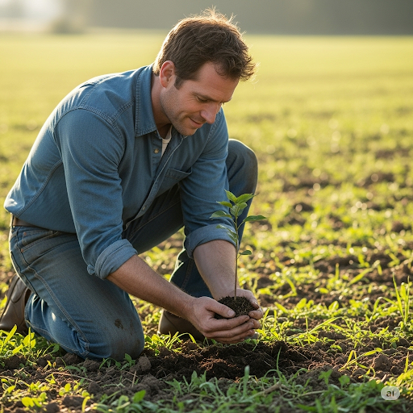
- ipa: /ˈded.ɪ.keɪt/
- class: v
- định nghĩa: cống hiến, dành trọn (thời gian, công sức).
- english definition: to give all of your energy, time, etc.
- sentence of story: Bill **dedicated** himself to farming.
- ví dụ thông dụng:
  - She **dedicated** her life to helping the poor.
  - He **dedicated** the book to his parents.
  - You need to **dedicate** more time to your studies.
  - The doctor **dedicated** himself to finding a cure.
  - They **dedicated** a new park to the city's founder.

## 5. ditch
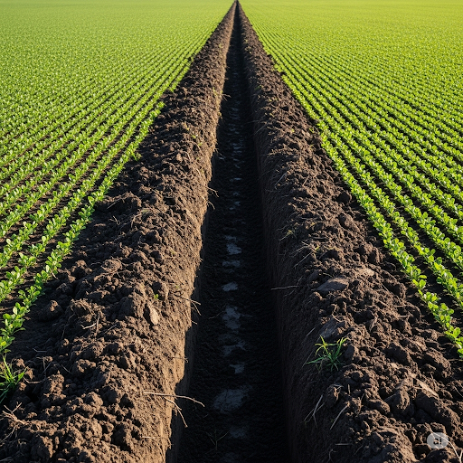
- ipa: /dɪtʃ/
- class: n
- định nghĩa: con mương, rãnh nước.
- english definition: a long, narrow open channel dug in the ground, typically used for drainage or irrigation.
- sentence of story: He took his spade and dug a **ditch** down the middle of his farm.
- ví dụ thông dụng:
  - There is a **ditch** along the side of the road.
  - The car fell into a **ditch**.
  - They are digging a **ditch** to lay a new pipe.
  - The field is full of water because the **ditch** is blocked.
  - A small frog was sitting in the **ditch**.

## 6. enterprise
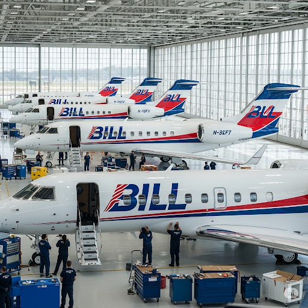
- ipa: /ˈen.tə.praɪz/
- class: n
- định nghĩa: doanh nghiệp, công ty; công trình kinh doanh.
- english definition: an organization, especially a business, or a difficult and important plan, especially one that will earn money.
- sentence of story: He financed a large aviation **enterprise** that made a lot of money.
- ví dụ thông dụng:
  - His new **enterprise** was very successful.
  - She is the head of a large commercial **enterprise**.
  - Starting a new business is a risky **enterprise**.
  - The government supports small and medium-sized **enterprises**.
  - The new shopping mall is a joint **enterprise** between two companies.

## 7. exquisite
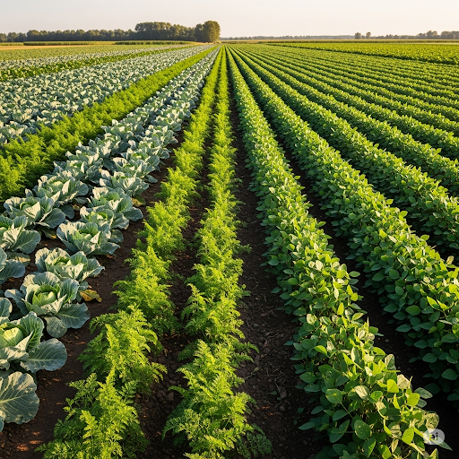
- ipa: /ɪkˈskwɪz.ɪt/
- class: adj
- định nghĩa: tuyệt đẹp, tinh xảo, tinh tế.
- english definition: extremely beautiful and delicate.
- sentence of story: After a year, his farm looked **exquisite**.
- ví dụ thông dụng:
  - The museum has an **exquisite** collection of jewelry.
  - She was wearing an **exquisite** dress.
  - The food had an **exquisite** taste.
  - He has **exquisite** manners.
  - The small hotel was **exquisite**.

## 8. finance

- ipa: /ˈfaɪ.næns/
- class: v
- định nghĩa: cấp vốn, tài trợ.
- english definition: to provide the money needed for something to happen.
- sentence of story: He **financed** a large aviation enterprise that made a lot of money.
- ví dụ thông dụng:
  - The project was **financed** by the government.
  - Who is going to **finance** your new business?
  - My parents **financed** my education.
  - The bank agreed to **finance** the purchase of our new house.
  - The movie was **financed** by a big studio.

## 9. indifferent

- ipa: /ɪnˈdɪf.ər.ənt/
- class: adj
- định nghĩa: thờ ơ, lãnh đạm, không quan tâm.
- english definition: not thinking about or interested in someone or something.
- sentence of story: I’m **indifferent** about my company’s success.
- ví dụ thông dụng:
  - Why are you so **indifferent** to what is happening?
  - He seemed **indifferent** to my question.
  - She was **indifferent** to the result of the game.
  - I don't like him; he is **indifferent** to other people's feelings.
  - It is hard to be **indifferent** when you see suffering.

## 10. irrigate
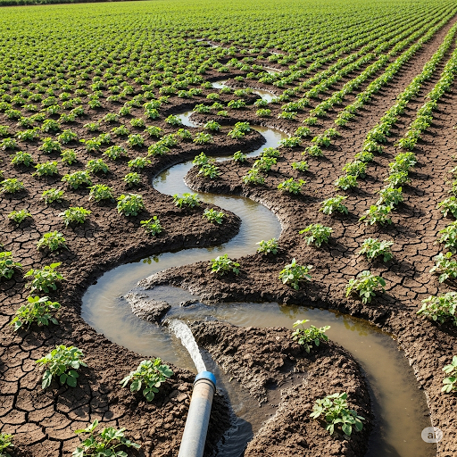
- ipa: /ˈɪr.ɪ.ɡeɪt/
- class: v
- định nghĩa: tưới (nước cho cây trồng).
- english definition: to supply land with water so that crops and plants will grow.
- sentence of story: “I need to **irrigate** my crops as a precaution, in case it doesn’t rain enough.”
- ví dụ thông dụng:
  - Farmers need to **irrigate** their fields in the dry season.
  - They built a system to **irrigate** the desert land.
  - The river is used to **irrigate** the farms.
  - We need more water to **irrigate** the garden.
  - A good irrigation system helps farmers **irrigate** their crops easily.

## 11. maximize

- ipa: /ˈmæk.sɪ.maɪz/
- class: v
- định nghĩa: tối đa hóa.
- english definition: to make something as great in amount, size, or importance as possible.
- sentence of story: He knew how to **maximize** monetary gains in every business deal he made.
- ví dụ thông dụng:
  - We need to **maximize** our profits.
  - The company wants to **maximize** its efficiency.
  - You should arrange your furniture to **maximize** the space in the room.
  - The goal is to **maximize** the use of our resources.
  - To **maximize** your chances of winning, you should practice every day.

## 12. monetary

- ipa: /ˈmʌn.ɪ.tər.i/
- class: adj
- định nghĩa: (thuộc về) tiền tệ, tài chính.
- english definition: relating to the money in a country.
- sentence of story: He knew how to maximize **monetary** gains in every business deal he made.
- ví dụ thông dụng:
  - The gift had no **monetary** value, but it was important to me.
  - The government is introducing a new **monetary** policy.
  - The company is having some **monetary** problems.
  - What is the **monetary** unit of Japan?
  - The central bank controls **monetary** supply.

## 13. precaution
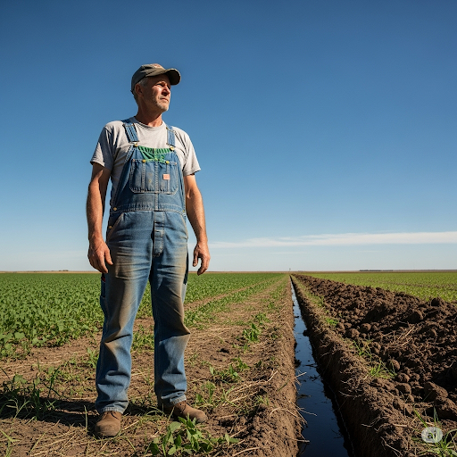
- ipa: /prɪˈkɔː.ʃən/
- class: n
- định nghĩa: sự phòng ngừa, sự đề phòng.
- english definition: an action that is done to prevent something unpleasant or dangerous from happening.
- sentence of story: “I need to irrigate my crops as a **precaution**, in case it doesn’t rain enough.”
- ví dụ thông dụng:
  - As a **precaution**, you should always lock your car.
  - They took every **precaution** to ensure the children's safety.
  - Wearing a helmet is a sensible **precaution**.
  - We should take fire **precautions** seriously.
  - I brought an umbrella as a **precaution**.

## 14. preliminary
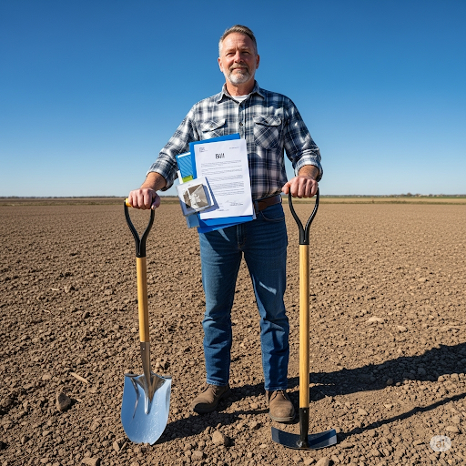
- ipa: /prɪˈlɪm.ɪ.nər.i/
- class: adj
- định nghĩa: sơ bộ, mở đầu, chuẩn bị.
- english definition: coming before a more important action or event, especially preparing for it.
- sentence of story: The very next day, Bill carried out the **preliminary** task of buying land and tools.
- ví dụ thông dụng:
  - The **preliminary** results of the study are positive.
  - We had a **preliminary** meeting before the main conference.
  - After a few **preliminary** remarks, he started his speech.
  - This is just a **preliminary** draft of the report.
  - The team won the **preliminary** round of the competition.

## 15. saturate

- ipa: /ˈsætʃ.ər.eɪt/
- class: v
- định nghĩa: làm cho bão hòa, làm cho thấm đẫm.
- english definition: to make something or someone completely wet.
- sentence of story: “Water from the stream will flow down the ditch and **saturate** the soil around every plant,” Bill thought.
- ví dụ thông dụng:
  - The heavy rain will **saturate** the ground.
  - My clothes were **saturated** with sweat after the run.
  - Use a cloth to **saturate** the surface with cleaner.
  - The market is **saturated** with similar products.
  - Don't **saturate** the plant with too much water.

## 16. simplicity

- ipa: /sɪmˈplɪs.ə.ti/
- class: n
- định nghĩa: sự đơn giản, sự giản dị.
- english definition: the fact that something is easy to understand or do.
- sentence of story: “I want the **simplicity** of a life on a farm.
- ví dụ thông dụng:
  - I love the **simplicity** of this design.
  - For the sake of **simplicity**, let's use whole numbers.
  - He lives a life of great **simplicity**.
  - The **simplicity** of the instructions makes it easy to build.
  - She explained the complex idea with beautiful **simplicity**.

## 17. sow
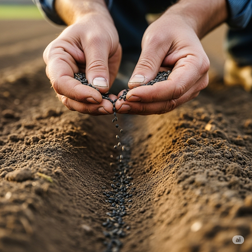
- ipa: /səʊ/
- class: v
- định nghĩa: gieo, rắc (hạt).
- english definition: to put seeds in or on the ground so that plants will grow.
- sentence of story: He **sowed** many types of seeds.
- ví dụ thông dụng:
  - It's time to **sow** the seeds for the spring flowers.
  - The farmer will **sow** the field with wheat.
  - You should **sow** the seeds in a sunny place.
  - "You reap what you **sow**" is a famous saying.
  - She **sowed** a few rows of carrots in her garden.

## 18. soy
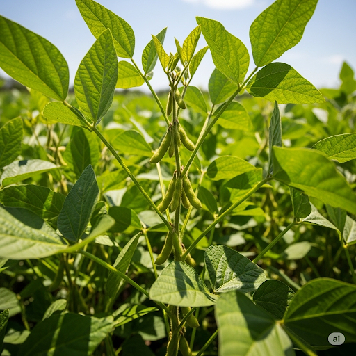
- ipa: /sɔɪ/
- class: n
- định nghĩa: đậu nành, đậu tương.
- english definition: a type of bean, originally from Asia, that is used to make a variety of food products.
- sentence of story: He planted **soy**, cabbage, carrots, and onions.
- ví dụ thông dụng:
  - I like to drink **soy** milk.
  - Please pass me the **soy** sauce.
  - Tofu is made from **soy**.
  - Many vegetarian foods use **soy** as a protein source.
  - Farmers in this area grow a lot of **soy**.

## 19. spade
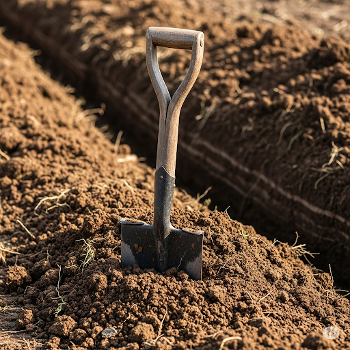
- ipa: /speɪd/
- class: n
- định nghĩa: cái xẻng (vuông).
- english definition: a tool used for digging, especially one with a flat metal blade and a long handle.
- sentence of story: He took his **spade** and dug a ditch down the middle of his farm.
- ví dụ thông dụng:
  - I need a **spade** to dig a hole for this tree.
  - He used a **spade** to turn over the soil in the garden.
  - The workers used shovels and **spades**.
  - A **spade** is a useful garden tool.
  - He cleaned the dirt off his **spade**.

## 20. upcoming

- ipa: /ˌʌpˈkʌm.ɪŋ/
- class: adj
- định nghĩa: sắp tới, sắp diễn ra.
- english definition: happening soon.
- sentence of story: “The **upcoming** summer is going to be very dry,” thought Bill.
- ví dụ thông dụng:
  - Are you excited about your **upcoming** trip?
  - The teacher told us about the **upcoming** exam.
  - There is an article about the **upcoming** election in the newspaper.
  - I am busy preparing for the **upcoming** event.
  - She is the star of an **upcoming** movie.