# Brothers

John and Mark were brothers, but they were quite different people. Mark looked very **masculine**. He had a mustache and was very **muscular**. He was a sculptor. He made things out of stone. Mark was a good artist, but he was not very intelligent.

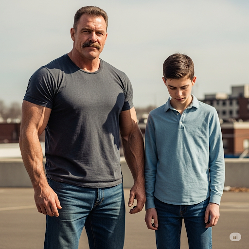

John looked nothing like his brother. He was small and weak, but he was very smart. John was an **undergraduate** in college, and he studied **anthropology** and history. He knew a lot about ancient cultures. The brothers loved each other very much, but they thought they had nothing in common.

One day, the mayor **appointed** Mark to build a **monument**: a statue of Egyptian Pharaoh, Tut. Mark agreed to do the job, but he had a problem. He had no idea who Pharaoh Tut was\! However, he thought he had the **competence** to build a good statue anyway. He made some **crude** measurements and sculpted a statue of a very old man with a **tattoo** on his chest. Mark was proud of his work, but when John saw the statue, he laughed aloud.

“What’s so funny?” Mark asked.

John replied, “Your **ignorance** makes me laugh. Don’t you know that Tut was only a teenager when he was pharaoh? Let me help you. I’ll **supervise** your work. I’ll give you **feedback**, and we’ll make this a great monument.”

Mark got another **cube** of stone. John told him what Tut looked like. “Make him tall with good **posture**,” John said. “And make sure there is **symmetry** in his body.”

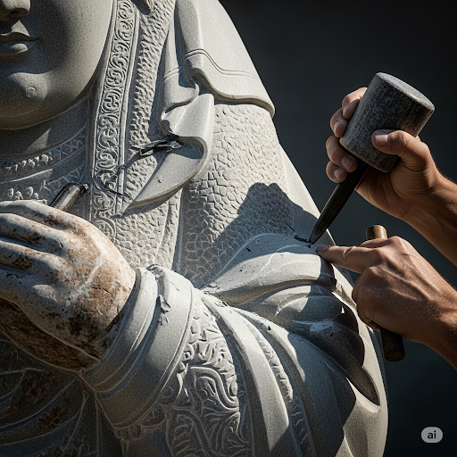

Mark **conferred** with John about every detail. For ten **consecutive** hours, the brothers worked. At last, the finished statue was **situated** in front of the museum. Everyone **applauded** the brothers’ good work.

“We worked together very well. I guess we are **compatible** after all,” Mark said.

John replied, “I agree\! When we combine our talents, we are capable of greatness.”

## List of word

anthropology applaud appoint compatible competence confer consecutive crude cube feedback ignorance masculine monument muscular posture situate supervise symmetry tattoo undergraduate

## Sentences of story

John and Mark were brothers, but they were quite different people. 

Mark looked very **masculine**. He had a mustache and was very **muscular**. 

He was a sculptor. 

He made things out of stone. 

Mark was a good artist, but he was not very intelligent.

John looked nothing like his brother. 

He was small and weak, but he was very smart. 

John was an **undergraduate** in college, and he studied **anthropology** and history. 

He knew a lot about ancient cultures. 

The brothers loved each other very much, but they thought they had nothing in common.

One day, the mayor **appointed** Mark to build a **monument**: a statue of Egyptian Pharaoh, Tut. 

Mark agreed to do the job, but he had a problem. 

He had no idea who Pharaoh Tut was\! However, he thought he had the **competence** to build a good statue anyway. 

He made some **crude** measurements and sculpted a statue of a very old man with a **tattoo** on his chest. 

Mark was proud of his work, but when John saw the statue, he laughed aloud.

“What’s so funny?” Mark asked.

John replied, “Your **ignorance** makes me laugh. 

Don’t you know that Tut was only a teenager when he was pharaoh? Let me help you. 

I’ll **supervise** your work. 

I’ll give you **feedback**, and we’ll make this a great monument.”

Mark got another **cube** of stone. John told him what Tut looked like. 

“Make him tall with good **posture**,” John said. 

“And make sure there is **symmetry** in his body.”

Mark **conferred** with John about every detail. 

For ten **consecutive** hours, the brothers worked. 

At last, the finished statue was **situated** in front of the museum. 

Everyone **applauded** the brothers’ good work.

“We worked together very well. I guess we are **compatible** after all,” Mark said.

John replied, “I agree\! When we combine our talents, we are capable of greatness.”

## 1\. anthropology

  - ipa: /ˌænθrəˈpɒlədʒi/
  - class: n
  - định nghĩa: ngành nghiên cứu về con người, xã hội, văn hóa và sự phát triển của loài người
  - english definition: the study of humankind, especially its customs, beliefs, and relationships
  - sentence of story: John was an undergraduate in college, and he studied **anthropology** and history.
  - ví dụ thông dụng:
      - She is studying anthropology at university.
      - He has a degree in social anthropology.
      - Anthropology helps us understand different cultures.
      - The professor specializes in cultural anthropology.
      - Anthropology is a broad field of study.

## 2\. applaud
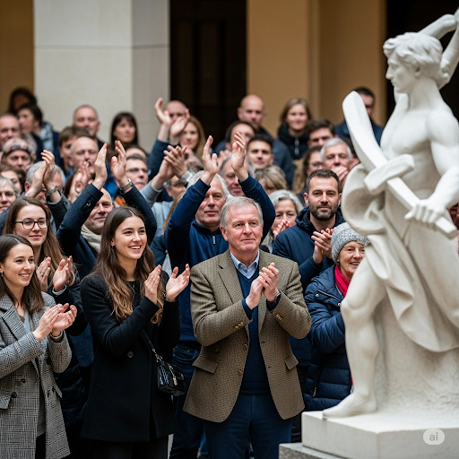

  - ipa: /əˈplɔːd/
  - class: v
  - định nghĩa: vỗ tay tán thưởng
  - english definition: to show approval or praise by clapping hands
  - sentence of story: Everyone **applauded** the brothers’ good work.
  - ví dụ thông dụng:
      - The audience applauded the performance.
      - We all applauded when he finished his speech.
      - She applauded politely after the concert.
      - The crowd applauded the winning team.
      - Please applaud our guest speaker.

## 3\. appoint
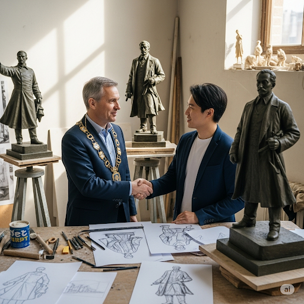

  - ipa: /əˈpɔɪnt/
  - class: v
  - định nghĩa: chỉ định, bổ nhiệm
  - english definition: to choose someone for a job or position
  - sentence of story: One day, the mayor **appointed** Mark to build a monument: a statue of Egyptian Pharaoh, Tut.
  - ví dụ thông dụng:
      - They appointed him as the new manager.
      - The committee appointed a new chairman.
      - She was appointed to the board of directors.
      - He was appointed by the president.
      - The company will appoint a successor soon.

## 4\. compatible

  - ipa: /kəmˈpætəbl/
  - class: adj
  - định nghĩa: tương thích, hợp nhau
  - english definition: able to exist or occur together without conflict
  - sentence of story: “We worked together very well. I guess we are **compatible** after all,” Mark said.
  - ví dụ thông dụng:
      - They are a very compatible couple.
      - The software is compatible with your computer.
      - We need to find compatible partners for the project.
      - Their personalities are not very compatible.
      - This printer is compatible with most operating systems.

## 5\. competence

  - ipa: /ˈkɒmpɪtəns/
  - class: n
  - định nghĩa: năng lực, khả năng
  - english definition: the ability to do something successfully or efficiently
  - sentence of story: However, he thought he had the **competence** to build a good statue anyway.
  - ví dụ thông dụng:
      - She demonstrated great competence in her work.
      - He questioned her competence to lead the team.
      - The job requires a high level of technical competence.
      - They assessed his competence for the role.
      - Training can improve your professional competence.

## 6\. confer

  - ipa: /kənˈfɜːr/
  - class: v
  - định nghĩa: bàn bạc, hội ý
  - english definition: to have discussions with someone in order to exchange opinions or get advice
  - sentence of story: Mark **conferred** with John about every detail.
  - ví dụ thông dụng:
      - They conferred about the best way to proceed.
      - He needs to confer with his colleagues.
      - The doctors conferred on the patient's treatment.
      - We will confer on the matter next week.
      - The team conferred to make a decision.

## 7\. consecutive
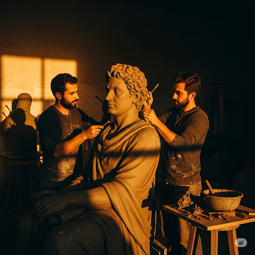

  - ipa: /kənˈsekjətɪv/
  - class: adj
  - định nghĩa: liên tiếp, liên tục
  - english definition: following one after another continuously
  - sentence of story: For ten **consecutive** hours, the brothers worked.
  - ví dụ thông dụng:
      - This is their fifth consecutive win.
      - He worked for three consecutive days.
      - We had rain for four consecutive mornings.
      - She was absent for two consecutive lessons.
      - The team won three consecutive championships.

## 8\. crude
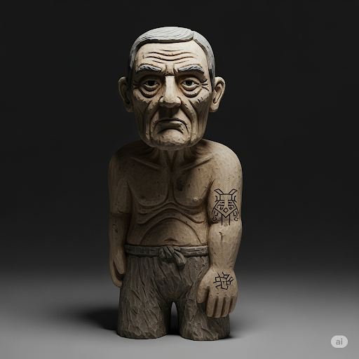

  - ipa: /kruːd/
  - class: adj
  - định nghĩa: thô sơ, sơ sài
  - english definition: in a natural or raw state; not yet processed or refined
  - sentence of story: He made some **crude** measurements and sculpted a statue of a very old man with a tattoo on his chest.
  - ví dụ thông dụng:
      - He made a crude drawing of the house.
      - They built a crude shelter from branches.
      - The first tools were very crude.
      - She made a crude attempt at painting.
      - We use crude oil to make petrol.

## 9\. cube

  - ipa: /kjuːb/
  - class: n
  - định nghĩa: khối lập phương
  - english definition: a symmetrical three-dimensional shape, either solid or hollow, contained by six equal squares
  - sentence of story: Mark got another **cube** of stone.
  - ví dụ thông dụng:
      - Please give me a sugar cube.
      - The ice cubes melted quickly.
      - He drew a perfect cube on the paper.
      - We played with building blocks, like cubes.
      - Cut the vegetables into small cubes.

## 10\. feedback
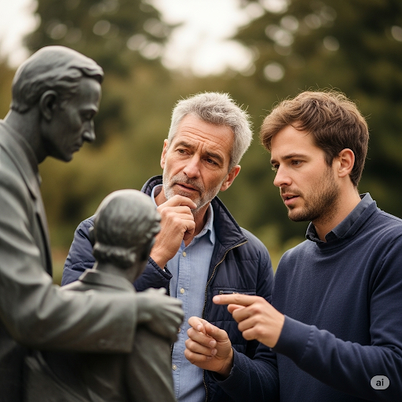

  - ipa: /ˈfiːdbæk/
  - class: n
  - định nghĩa: phản hồi, thông tin phản hồi
  - english definition: information about reactions to a product, a person's performance of a task, etc., used as a basis for improvement
  - sentence of story: I’ll give you **feedback**, and we’ll make this a great monument.”
  - ví dụ thông dụng:
      - We welcome your feedback on our services.
      - She received positive feedback from her manager.
      - The teacher gave detailed feedback on the essay.
      - Customer feedback is very important to us.
      - Can you give me some feedback on my presentation?

## 11\. ignorance
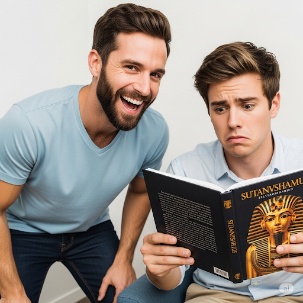

  - ipa: /ˈɪɡnərəns/
  - class: n
  - định nghĩa: sự thiếu hiểu biết, sự dốt nát
  - english definition: lack of knowledge or information
  - sentence of story: John replied, “Your **ignorance** makes me laugh.
  - ví dụ thông dụng:
      - His ignorance of the rules caused a problem.
      - She was surprised by his ignorance of history.
      - Ignorance can lead to serious mistakes.
      - The law is no excuse for ignorance.
      - He admitted his ignorance about the topic.

## 12\. masculine

  - ipa: /ˈmæskjəlɪn/
  - class: adj
  - định nghĩa: nam tính
  - english definition: having qualities or appearance traditionally associated with men, especially strength and aggressiveness
  - sentence of story: Mark looked very **masculine**.
  - ví dụ thông dụng:
      - He has a very masculine voice.
      - The painting shows a masculine figure.
      - He prefers masculine scents.
      - She likes his strong, masculine features.
      - The room had a masculine feel.

## 13\. monument
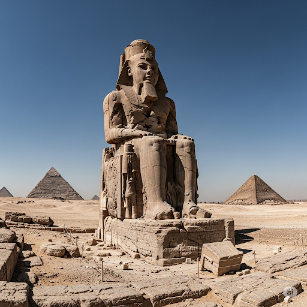

  - ipa: /ˈmɒnjumənt/
  - class: n
  - định nghĩa: đài tưởng niệm, tượng đài
  - english definition: a statue, building, or other structure erected to commemorate a famous person or event
  - sentence of story: One day, the mayor appointed Mark to build a **monument**: a statue of Egyptian Pharaoh, Tut.
  - ví dụ thông dụng:
      - The Eiffel Tower is a famous monument.
      - They built a monument to the fallen soldiers.
      - The ancient city has many historical monuments.
      - This church is a national monument.
      - The statue serves as a monument to peace.

## 14\. muscular

  - ipa: /ˈmʌskjələr/
  - class: adj
  - định nghĩa: vạm vỡ, có cơ bắp
  - english definition: having well-developed muscles
  - sentence of story: He had a mustache and was very **muscular**.
  - ví dụ thông dụng:
      - He has a very muscular build.
      - The athlete had strong, muscular legs.
      - She trains to become more muscular.
      - The dog was large and muscular.
      - He admires muscular physiques.

## 15\. posture

  - ipa: /ˈpɒstʃər/
  - class: n
  - định nghĩa: tư thế
  - english definition: the position in which someone holds their body when standing or sitting
  - sentence of story: “Make him tall with good **posture**,” John said.
  - ví dụ thông dụng:
      - Good posture is important for your back.
      - She has excellent posture.
      - His posture improved after exercise.
      - He sat with a relaxed posture.
      - Poor posture can cause pain.

## 16\. situate
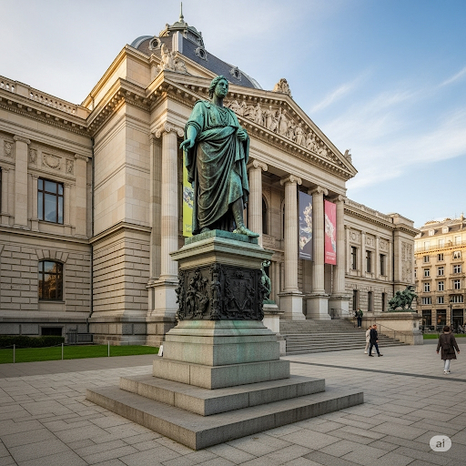

  - ipa: /ˈsɪtʃueɪt/
  - class: v
  - định nghĩa: đặt ở, định vị
  - english definition: to place or locate in a particular position or array
  - sentence of story: At last, the finished statue was **situated** in front of the museum.
  - ví dụ thông dụng:
      - The hotel is ideally situated near the beach.
      - Our office is situated in the city center.
      - The town is situated on a hill.
      - The house is situated in a quiet neighborhood.
      - The monument is situated in the park.

## 17\. supervise
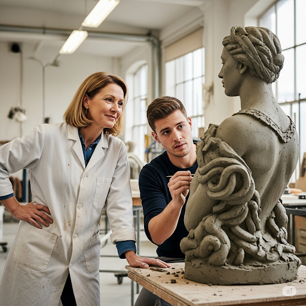

  - ipa: /ˈsuːpərvaɪz/
  - class: v
  - định nghĩa: giám sát
  - english definition: to observe and direct the execution of a task or activity
  - sentence of story: I’ll **supervise** your work.
  - ví dụ thông dụng:
      - She supervises a team of five people.
      - He was asked to supervise the construction.
      - The teacher supervises the students during exams.
      - You need to supervise children closely.
      - I supervise the quality control department.

## 18\. symmetry
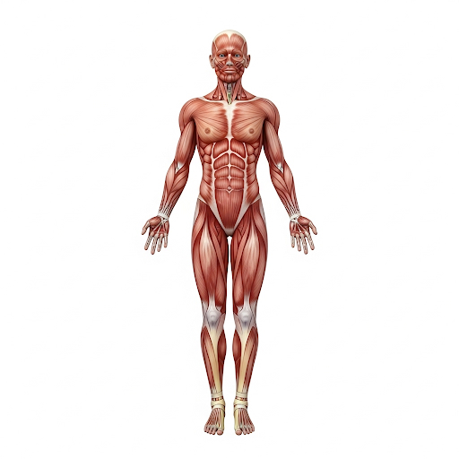

  - ipa: /ˈsɪmətriz/
  - class: n
  - định nghĩa: sự đối xứng
  - english definition: the quality of being made up of exactly similar parts facing each other or around an axis
  - sentence of story: “And make sure there is **symmetry** in his body.”
  - ví dụ thông dụng:
      - The building has perfect symmetry.
      - Butterflies often show beautiful symmetry.
      - He likes the symmetry of the design.
      - There was a noticeable lack of symmetry in the sculpture.
      - The artist aimed for perfect symmetry in his work.

## 19\. tattoo

  - ipa: /təˈtuː/
  - class: n
  - định nghĩa: hình xăm
  - english definition: a form of body modification where a design is made by inserting ink, dyes and pigments, either indelible or temporary, into the dermis layer of the skin to change the pigment.
  - sentence of story: He made some crude measurements and sculpted a statue of a very old man with a **tattoo** on his chest.
  - ví dụ thông dụng:
      - She has a small tattoo on her ankle.
      - Getting a tattoo can be painful.
      - Many sailors have tattoos.
      - He decided to get a new tattoo.
      - The tattoo parlor was busy.

## 20\. undergraduate

  - ipa: /ˌʌndərˈɡrædʒuət/
  - class: n
  - định nghĩa: sinh viên chưa tốt nghiệp đại học
  - english definition: a university student who has not yet taken a first degree
  - sentence of story: John was an **undergraduate** in college, and he studied anthropology and history.
  - ví dụ thông dụng:
      - She is an undergraduate at Oxford University.
      - The course is designed for undergraduates.
      - He spent three years as an undergraduate.
      - Many undergraduates live in dorms.
      - We have a new program for undergraduate students.