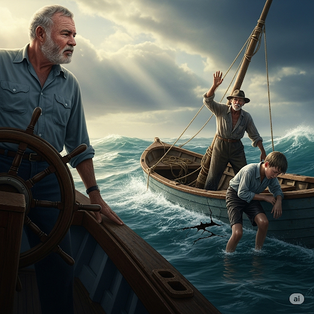
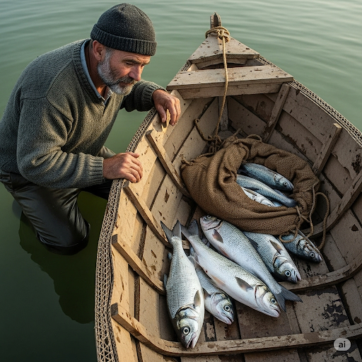
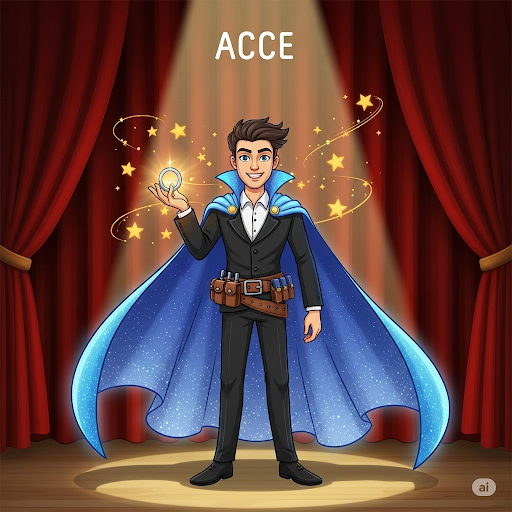
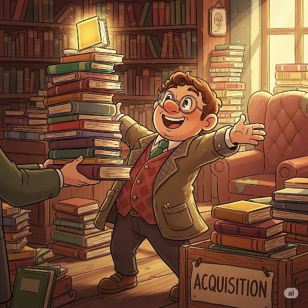
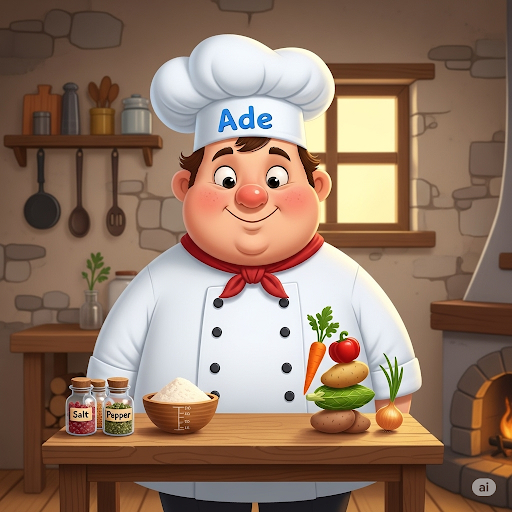
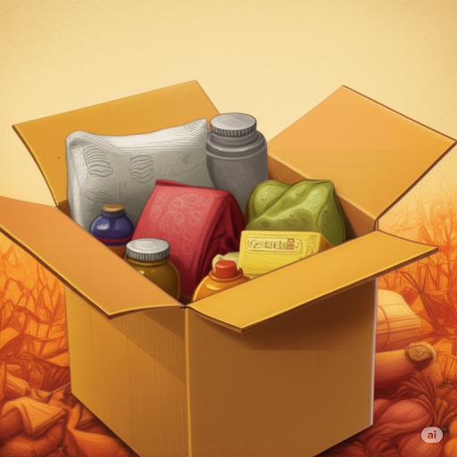
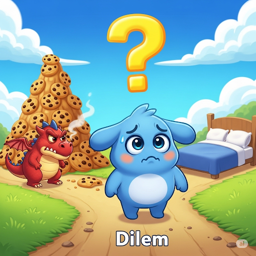
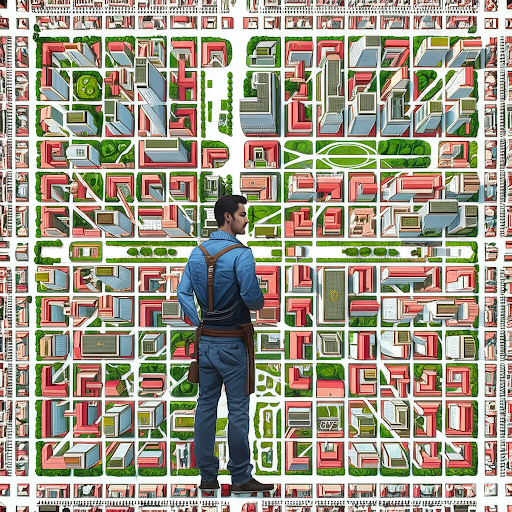
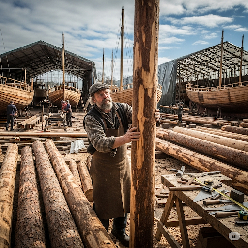

# The Big Ship

Ernest looked at his **fleet** of ships. Usually, he used them for his firm, which **imported** **marble** statues from other countries. But today he was going fishing. And the ship he chose was his favorite. It had an **elaborate** painting on the side that showed a **naval** battle. It also had some new **updates** to its computer system. His favorite ship’s latest **acquisition** was a device with a small **grid** to show the ship’s exact location. This new **accessory** kept Ernest from getting lost.

At daybreak, Ernest happily sailed the temperate waters until he was far from land. Then he saw a small boat in the distance. There was an old man standing next to its **mast**. He was waving his arms in the air. There was also a boy with his head hanging over the boat’s edge. Ernest **inferred** that the boy was suffering from **nausea**. Both of their clothes were **saturated** with sea water. Ernest assumed that they were in trouble. Most people never realized, but Ernest had an **innate** desire to help people. He began sailing toward them, eager to **facilitate** their rescue and thus solve their **dilemma**.

As he got closer to the boat, he was shocked by its simplicity. The boat’s wood looked no stronger than **cardboard**, and the equipment was old. Still, there were several large fish in a **pouch** in the boat.

Ernest threw a large package onto the boat. He yelled, “Here! You can **inflate** this boat to get you back to land.”
“Get out of here!” screamed the old man.
Ernest was confused. “Don’t you need help?” he asked. “Your ship doesn’t seem **adequate** enough to sail so far away from land.”
“You’ve just scared away a huge fish,” the boy said. “We waved to let you know you were too close to us.”
Ernest turned around and headed home. He learned that it’s better not to help unless asked to. Otherwise, you might not help anyone at all.

## Sentences of story

The Big Ship

Ernest looked at his fleet of ships.

Usually, he used them for his firm, which imported marble statues from other countries.

But today he was going fishing.

And the ship he chose was his favorite.

It had an elaborate painting on the side that showed a naval battle.

It also had some new updates to its computer system.

His favorite ship’s latest acquisition was a device with a small grid to show the ship’s exact location.

This new accessory kept Ernest from getting lost.

At daybreak, Ernest happily sailed the temperate waters until he was far from land.

Then he saw a small boat in the distance.

There was an old man standing next to its mast.

He was waving his arms in the air.

There was also a boy with his head hanging over the boat’s edge.

Ernest inferred that the boy was suffering from nausea.

Both of their clothes were saturated with sea water.

Ernest assumed that they were in trouble.

Most people never realized, but Ernest had an innate desire to help people.

He began sailing toward them, eager to facilitate their rescue and thus solve their dilemma.

As he got closer to the boat, he was shocked by its simplicity.

The boat’s wood looked no stronger than cardboard, and the equipment was old.

Still, there were several large fish in a pouch in the boat.

Ernest threw a large package onto the boat.

He yelled, “Here! You can inflate this boat to get you back to land.”

“Get out of here!” screamed the old man.

Ernest was confused.

“Don’t you need help?” he asked.

“Your ship doesn’t seem adequate enough to sail so far away from land.”

“You’ve just scared away a huge fish,” the boy said.

“We waved to let you know you were too close to us.”

Ernest turned around and headed home.

He learned that it’s better not to help unless asked to.

Otherwise, you might not help anyone at all.

## List of word
accessory acquisition adequate cardboard dilemma elaborate facilitate fleet grid import infer inflate innate marble mast nausea naval pouch saturated update

## 1. accessory

- IPA: /əkˈsesəri/
- Class: n.
- Câu truyện ẩn dụ: Có một ảo thuật gia tên là Acce (nghe giống âm đầu của từ accessory). Anh ta là một ảo thuật gia giỏi, nhưng các màn trình diễn của anh thường hơi đơn điệu. Một ngày nọ, anh được tặng một bộ accessory (phụ kiện) ma thuật: một chiếc mũ tỏa sáng, một chiếc nhẫn lấp lánh và một chiếc thắt lưng với nhiều ngăn bí mật. Kể từ đó, các màn biểu diễn của anh trở nên ngoạn mục hơn. Chiếc mũ ma thuật giúp anh làm biến mất các vật thể một cách ấn tượng, chiếc nhẫn tạo ra những tia sáng kỳ ảo và chiếc thắt lưng giúp anh cất giấu những đạo cụ nhỏ. Nhờ có những accessory này, màn trình diễn của anh đã trở nên hoàn hảo hơn.
- Định nghĩa : Phụ kiện, đồ phụ tùng.
- Enlish definition: Something added to a machine or to clothing that has a useful or decorative purpose.
- Sentence of stroy: This new **accessory** kept Ernest from getting lost.
- Ví dụ thông dụng:
1. She wore a simple black dress, accessorized with a silver belt.
2. A car's standard accessories include a spare tire and a jack.

## 2. acquisition

- IPA: /ˌækwɪˈzɪʃn/
- Class: n.
- Câu truyện ẩn dụ:  Có một anh chàng đam mê sưu tầm tên là A-qui. Anh luôn tìm cách acquisition (tiếp thu) thêm kiến thức bằng cách mua lại những cuốn sách quý hiếm. Mặc dù anh đã có một bộ sưu tập khổng lồ, nhưng anh vẫn cảm thấy mình cần phải có thêm nữa. Một ngày nọ, anh tìm thấy một bộ sách cổ vô cùng giá trị. Anh đã bỏ rất nhiều công sức để có thể thực hiện acquisition (thâu tóm) bộ sách này. Cuối cùng, khi cầm trên tay những cuốn sách mới, anh biết rằng mình đã có thêm một kho tàng kiến thức mới.
- Định nghĩa : Sự giành được, sự thu được, sự mua lại.
- Enlish definition: The process of getting something; the item that is bought or obtained.
- Sentence of stroy: His favorite ship’s latest **acquisition** was a device with a small grid to show the ship’s exact location.
- Ví dụ thông dụng:
1. The company's latest acquisition is a small startup specializing in AI.
2. Language acquisition is easiest for children.

## 3. adequate

- IPA: /ˈædɪkwət/
- Class: adj.
- Câu truyện ẩn dụ: Có một đầu bếp tên là Ade. Anh ta không phải là đầu bếp giàu có nhất, nhưng anh lại là người giỏi nhất trong việc nấu ăn với những gì mình có. Khi được giao nhiệm vụ chuẩn bị bữa tối cho 10 người, anh ta chỉ có một lượng nguyên liệu adequate (đầy đủ) - không dư thừa một chút nào. Anh có adequate flour (vừa đủ bột mì), adequate vegetables (vừa đủ rau củ), và adequate seasoning (vừa đủ gia vị). Mọi thứ đều được tính toán kỹ lưỡng. Nhờ vậy, anh đã tạo ra một bữa ăn hoàn hảo mà không lãng phí bất cứ thứ gì.
- Định nghĩa : Đầy đủ, tương xứng, thích đáng.
- Enlish definition: Enough or satisfactory for a particular purpose.
- Sentence of stroy: “Your ship doesn’t seem **adequate** enough to sail so far away from land.”
- Ví dụ thông dụng:
1. The food was adequate but not exceptional.
2. He didn't have adequate time to prepare for the exam.

## 4. cardboard

- IPA: /ˈkɑːrdbɔːrd/
- Class: n.
- Câu truyện ẩn dụ: Trong một thị trấn, có một anh hùng thầm lặng tên là Cà-bò. Anh ấy không có sức mạnh siêu phàm, nhưng lại rất bền bỉ và đáng tin cậy. Khi ai đó cần di chuyển đồ đạc, Cà-bò sẽ xuất hiện. Anh ấy có thể biến thành bất kỳ hình dạng nào để chứa và bảo vệ đồ vật: từ một cái hộp lớn để đựng quần áo, đến một cái thùng nhỏ để chứa những món đồ dễ vỡ. Mặc dù anh rất hữu ích, nhưng sau khi công việc hoàn thành, mọi người lại thường cà-bò (bỏ đi). Anh chính là hiện thân của cardboard - mạnh mẽ, hữu dụng, nhưng chỉ trong một khoảng thời gian nhất định.
- Định nghĩa : Bìa cứng, các-tông.
- Enlish definition: A thick, stiff paper-like material that's used for making boxes.
- Sentence of stroy: The boat’s wood looked no stronger than **cardboard**, and the equipment was old.
- Ví dụ thông dụng:
1. We packed our books in cardboard boxes.
2. The kids made a castle out of a large cardboard box.

## 5. dilemma

- IPA: /dɪˈlemə/
- Class: n.
- Câu truyện ẩn dụ: Có một cậu bé tên là Đi-lem. Cậu đứng trước một ngã rẽ. Một con đường dẫn đến một vườn trái cây ngon tuyệt, nhưng lại bị canh gác bởi một con rồng đáng sợ. Con đường còn lại dẫn thẳng về nhà, nơi cậu có thể đi ngủ, nhưng bụng cậu lại đang đói cồn cào. Cậu bé Đi-lem không biết phải làm gì, cậu đứng giữa hai lựa chọn khó khăn và tự hỏi "Đi đâu đây? Chọn cái nào lem (lắm) mà khó khăn quá!". Tình huống của cậu chính là một dilemma.
- Định nghĩa : Tình thế tiến thoái lưỡng nan, tình thế khó xử.
- Enlish definition: A situation in which a difficult choice has to be made between two or more alternatives, especially equally undesirable ones.
- Sentence of stroy: He began sailing toward them, eager to facilitate their rescue and thus solve their **dilemma**.
- Ví dụ thông dụng:
1. She faced the dilemma of disobeying her father or losing the man she loved.
2. The president is clearly in a dilemma about how to tackle the crisis.

## 6. elaborate

- IPA: /ɪˈlæbərət/
- Class: adj.
- Câu truyện ẩn dụ: Có một họa sĩ trẻ tên là Labi (nghe giống âm cuối của từ elaborate). Anh có một bức tranh rất đơn giản, chỉ là một bông hoa phác thảo. Nhưng anh không dừng lại ở đó. Anh bắt đầu elaborate (thêm chi tiết) cho bức tranh: vẽ từng chiếc gân lá, tạo màu sắc chuyển động trên cánh hoa, và thậm chí thêm một chú bướm nhỏ đang đậu. Dần dần, từ một phác thảo đơn giản, anh đã tạo ra một kiệt tác đầy tỉ mỉ và công phu.
- Định nghĩa : Tỉ mỉ, công phu, tinh xảo.
- Enlish definition: Containing a lot of careful detail or many detailed parts.
- Sentence of stroy: It had an **elaborate** painting on the side that showed a naval battle.
- Ví dụ thông dụng:
1. They're making elaborate preparations for the wedding.
2. He came out with an elaborate excuse for being late.

## 7. facilitate

- IPA: /fəˈsɪlɪteɪt/
- Class: v.
- Câu truyện ẩn dụ:  Trong một khu rừng nọ, có một cô tiên tốt bụng tên là Faci. Cô không bao giờ làm hộ người khác, nhưng lại luôn giúp họ vượt qua những khó khăn. Khi một nhóm du khách muốn qua một con sông, cô không cõng họ. Thay vào đó, cô dùng phép thuật của mình để dựng một chiếc cầu bằng lá cây, hoặc làm cho những tảng đá trên sông nổi lên để họ có thể bước qua. Bằng cách đó, cô đã facilitate (tạo điều kiện) cho chuyến đi của họ trở nên dễ dàng và an toàn hơn rất nhiều. Với cô, giúp đỡ không phải là làm thay, mà là giúp người khác tự mình vượt qua thử thách.
- Định nghĩa : Tạo điều kiện thuận lợi, làm cho dễ dàng hơn.
- Enlish definition: To make an action or process easy or easier.
- Sentence of stroy: He began sailing toward them, eager to **facilitate** their rescue and thus solve their dilemma.
- Ví dụ thông dụng:
1. The new airport will facilitate the development of tourism.
2. A good teacher can facilitate learning.

## 8. fleet

- IPA: /fliːt/
- Class: n.
- Câu truyện ẩn dụ: Trong một thành phố, có một anh tài xế rất nhanh nhẹn và tài giỏi tên là Flít. Một ngày nọ, anh nhận ra rằng anh không thể giao hết tất cả hàng hóa chỉ với một chiếc xe. Anh nảy ra một ý tưởng: xây dựng một đội xe giao hàng hùng hậu của riêng mình. Với anh, đó không chỉ là một nhóm xe, mà là một fleet (đội xe) được anh quản lý và điều phối một cách hiệu quả. Mỗi chiếc xe đều được đặt tên là "Flít", và chúng cùng nhau "flít" (bay) khắp thành phố để giao hàng.
- Định nghĩa : Hạm đội, đội tàu.
- Enlish definition: A group of ships sailing together, engaged in the same activity, or under the same ownership.
- Sentence of stroy: Ernest looked at his **fleet** of ships.
- Ví dụ thông dụng:
1. The company has a fleet of 20 trucks.
2. The British fleet was victorious in the battle.

## 9. grid

- IPA: /ɡrɪd/
- Class: n.
- Câu truyện ẩn dụ:  Trong một thành phố, có một kiến trúc sư tên là Gờ-rít. Anh có một niềm đam mê mãnh liệt với trật tự. Khi thiết kế thành phố, anh luôn sử dụng một hệ thống các đường kẻ ngang và dọc để tạo ra một "lưới" hoàn hảo cho tất cả mọi thứ. Từ đường phố, công viên, cho đến các khu nhà, tất cả đều nằm trong hệ thống grid (lưới) này. Nhờ có anh Gờ-rít, cư dân trong thành phố không bao giờ bị lạc và mọi thứ đều được sắp xếp một cách hợp lý và hiệu quả.
- Định nghĩa : Lưới, mạng lưới (hệ thống đường kẻ).
- Enlish definition: A pattern of straight lines that cross each other to form squares.
- Sentence of stroy: His favorite ship’s latest acquisition was a device with a small **grid** to show the ship’s exact location.
- Ví dụ thông dụng:
1. The map showed a grid of streets.
2. The national power grid supplies electricity to the entire country.

## 10. import

- IPA: /ɪmˈpɔːrt/
- Class: v.
- Câu truyện ẩn dụ: Có một anh chàng thợ giao hàng đặc biệt tên là Im-pọt. Anh không vận chuyển hàng hóa bình thường mà có khả năng import (nhập khẩu) những món đồ quý hiếm từ các thế giới khác. Khi một người thợ gốm cần một loại đất sét đặc biệt từ hành tinh "Gốm", anh Im-pọt sẽ xuất hiện, và với một tiếng "pọt" nhỏ, anh lặng lẽ đặt nguyên liệu đó vào xưởng. Anh ta luôn làm việc một cách "im lặng" (im) và chỉ cần một tiếng "pọt" để hoàn thành nhiệm vụ nhập khẩu của mình.
- Định nghĩa : Nhập khẩu.
- Enlish definition: To bring a product, service, or idea into one country from another.
- Sentence of stroy: Usually, he used them for his firm, which **imported** marble statues from other countries.
- Ví dụ thông dụng:
1. We import a large number of cars from Japan.
2. The country has to import most of its raw materials.

## 11. infer

- IPA: /ɪnˈfɜːr/
- Class: v.
- Câu truyện ẩn dụ: Có một thám tử tài ba tên là In-fờ. Anh không bao giờ cần nghe lời giải thích. Khi anh thấy một chiếc bánh kem bị mất, một vết kem dính trên miệng một cậu bé, và một cái thìa dính kem ở gần đó, anh không cần hỏi. Với anh, những bằng chứng đó đủ để infer (suy luận) rằng cậu bé đã ăn trộm bánh kem. Anh luôn nói: "Tôi không cần câu trả lời, tôi chỉ cần các dấu vết để tự infer ra sự thật."
- Định nghĩa : Suy ra, luận ra.
- Enlish definition: To form an opinion or guess that something is true because of the information that you have.
- Sentence of stroy: Ernest **inferred** that the boy was suffering from nausea.
- Ví dụ thông dụng:
1. From his frown, I inferred that he was not pleased.
2. What do you infer from her silence?

## 12. inflate

- IPA: /ɪnˈfleɪt/
- Class: v.
- Câu truyện ẩn dụ: Có một chú bé rất thích chơi bóng bay tên là In-phết. Cứ mỗi khi có quả bóng xẹp, In-phết lại dùng chiếc bơm kỳ diệu của mình để inflate (thổi phồng) nó lên. Chỉ cần một vài lần "phết" (hành động bơm), quả bóng lại căng tròn và bay lên cao. Nhưng đôi khi, In-phết cũng nghịch ngợm, cố tình inflate (thổi phồng) những con số trong trò chơi để mình có điểm cao hơn.
- Enlish definition: To fill something with air or gas so it expands.
- Sentence of stroy: You can **inflate** this boat to get you back to land.
- Ví dụ thông dụng:
1. He inflated the tires of his bike.
2. The media has inflated the importance of this issue.

## 13. innate

- IPA: /ɪˈneɪt/
- Class: adj.
- Câu truyện ẩn dụ:  Hãy tưởng tượng một chú chim nhỏ tên là In-nét. Ngay từ khi vừa nở ra khỏi trứng, chú đã có bản năng (innate ability) biết hót những giai điệu rất hay và biết cách xây tổ ấm. Không ai dạy chú cả, đó dường như là một khả năng innate (bẩm sinh) đã nằm sẵn trong gen của chú. Giống như tên của mình, những tài năng của In-nét đã "nằm nét" (ẩn chứa) bên trong chú từ khi mới xuất hiện trên đời.
- Định nghĩa : Bẩm sinh, thiên phú.
- Enlish definition: An innate quality or ability is one that you are born with, not one you have learned.
- Sentence of stroy: Most people never realized, but Ernest had an **innate** desire to help people.
- Ví dụ thông dụng:
1. He has an innate talent for music.
2. Her innate sense of justice made her a great lawyer.

## 14. marble

- IPA: /ˈmɑːrbl/
- Class: n.
- Câu truyện ẩn dụ: Có một nhà điêu khắc nổi tiếng với tên gọi Mác-bồ. Ông ấy không dùng bất cứ loại đá nào khác, mà chỉ dùng marble (đá cẩm thạch) để tạo ra những tác phẩm của mình. Mọi người đều biết rằng, những tác phẩm của Mác-bồ không chỉ đẹp mà còn bền vững qua hàng thế kỷ. Ông có thể "mặc-bổ" (mài và chạm khắc) cho một khối đá thô trở thành một bức tượng uy nghi, hay một mặt sàn sang trọng. Đối với ông, vẻ đẹp của marble là vĩnh cửu.
- Định nghĩa : Đá cẩm thạch.
- Enlish definition: A type of hard rock that becomes smooth and shiny when it is polished, used for decoration and in buildings.
- Sentence of stroy: Usually, he used them for his firm, which imported **marble** statues from other countries.
- Ví dụ thông dụng:
1. The floor was made of polished marble.
2. The statue was carved from a single block of marble.

## 15. mast

- IPA: /mæst/
- Class: n.
- Câu truyện ẩn dụ: Hãy tưởng tượng một người thợ đóng thuyền tài ba tên là bác Mát. Bác luôn cẩn thận lựa chọn những thân cây gỗ cao và chắc chắn nhất để làm mast (cột buồm) cho những con thuyền của mình. Bác tin rằng, một chiếc mast vững chãi sẽ giúp con thuyền vượt qua mọi sóng gió trên biển khơi. Khi những cánh buồm căng phồng nhờ gió, bác Mát thường mỉm cười mãn nguyện, cảm nhận sự "mát mẻ" mà chiếc cột buồm mang lại cho hành trình của con thuyền.
- Enlish definition: A tall pole on a boat or ship that supports the sails.
- Sentence of stroy: There was an old man standing next to its **mast**.
- Ví dụ thông dụng:
1. The ship's mast was broken in the storm.
2. The flag was raised to the top of the mast.

## 16. nausea

- IPA: /ˈnɔːziə/
- Class: n.
- Câu truyện ẩn dụ: Hãy tưởng tượng một cậu bé tên là Nao-sờ. Cậu bé được lên một chiếc tàu ra khơi lần đầu tiên. Ban đầu mọi thứ đều ổn, nhưng khi con tàu bắt đầu dập dềnh trên những con sóng lớn, bụng cậu bé bắt đầu cồn cào. Cậu cảm thấy nao-sờ (nôn nao) trong người, mọi thứ dường như bị đảo lộn. Khuôn mặt cậu tái mét, và cậu chỉ muốn đứng trên mặt đất bằng phẳng. Cảm giác khó chịu và bất ổn trong bụng cậu bé khi con tàu "nôn nao" trên sóng biển chính là nausea.
- Định nghĩa : Sự buồn nôn, sự kinh tởm.
- Enlish definition: The feeling that you are going to vomit.
- Sentence of stroy: Ernest inferred that the boy was suffering from **nausea**.
- Ví dụ thông dụng:
1. Early pregnancy is often accompanied by nausea.
2. The sight of the blood filled him with nausea.

## 17. naval

- IPA: /ˈneɪvl/
- Class: adj.
- Câu truyện ẩn dụ: Hãy tưởng tượng một vị đô đốc hải quân dũng mãnh tên là Na-vồ. Ông chỉ huy một lực lượng naval (hải quân) hùng mạnh với những chiếc tàu chiến hiện đại. Mỗi khi nhắc đến ông, người ta lại nhớ đến những chiến công hiển hách trên biển cả. Mọi mệnh lệnh naval (thuộc về hải quân) quan trọng đều do ông đưa ra. Sức mạnh và uy quyền của đô đốc Na-vồ gắn liền với sự hùng mạnh của lực lượng hải quân mà ông chỉ huy.
- Định nghĩa : (thuộc) Hải quân.
- Enlish definition: Relating to a country's navy or ships.
- Sentence of stroy: It had an elaborate painting on the side that showed a **naval** battle.
- Ví dụ thông dụng:
1. He joined the naval academy after high school.
2. The port is a major naval base.

## 18. pouch

- IPA: /paʊtʃ/
- Class: n.
- Câu truyện ẩn dụ: Hãy tưởng tượng một chú chuột túi con tên là Pao-chi. Chú luôn cảm thấy an toàn và ấm áp trong chiếc pouch (túi) của mẹ. Đó là nơi chú được bảo vệ, được mẹ mang theo khắp nơi và luôn có sẵn sữa để bú. Chiếc pouch không chỉ là một cái túi, mà còn là ngôi nhà di động và là biểu tượng của tình mẫu tử yêu thương đối với chú chuột túi Pao-chi.
- Định nghĩa : Túi nhỏ.
- Enlish definition: A small, soft bag, often made of leather or cloth.
- Sentence of stroy: Still, there were several large fish in a **pouch** in the boat.
- Ví dụ thông dụng:
1. A kangaroo carries its baby in a pouch.
2. He kept his coins in a small leather pouch.

## 19. saturated

- IPA: /ˈsætʃəreɪtɪd/
- Class: adj.
- Câu truyện ẩn dụ: Trong một ngôi làng nhỏ, có một thợ làm bánh tên là Sa-chơ. Anh có một niềm đam mê với những chiếc bánh đầy màu sắc và hương vị đậm đà. Mỗi khi làm bánh, anh lại cho thêm rất nhiều si-rô trái cây vào bột. Anh cứ cho vào cho đến khi hỗn hợp bột bánh trở nên saturated (bão hòa) với màu đỏ rực và vị ngọt đậm đà, đến mức không thể thấm thêm một giọt si-rô nào nữa. Nhờ vậy, bánh của anh luôn có hương vị độc đáo và màu sắc cực kỳ sống động.
- Định nghĩa : Ướt sũng, bão hòa.
- Enlish definition: Completely wet.
- Sentence of stroy: Both of their clothes were **saturated** with sea water.
- Ví dụ thông dụng:
1. My shoes were saturated after walking in the rain.
2. The market for these products is already saturated.

## 20. update

- IPA: /ˈʌpdeɪt/
- Class: n.
- Câu truyện ẩn dụ: Hãy tưởng tượng một anh chàng kỹ thuật số tên là Úp-đét. Công việc của anh là thường xuyên update (cập nhật) các phần mềm và hệ thống. Khi có một phiên bản mới tốt hơn, anh Úp-đét sẽ nhanh chóng cài đặt nó, giống như việc thay một bộ áo giáp mới mạnh mẽ hơn cho một chiến binh. Anh luôn đảm bảo mọi thứ đều hoạt động với phiên bản "đúp-đét" (double-date - ý chỉ phiên bản mới nhất) để mọi người có trải nghiệm tốt nhất.
- Định nghĩa : Sự cập nhật, bản cập nhật.
- Enlish definition: New information; a new or more modern version of something.
- Sentence of stroy: It also had some new **updates** to its computer system.
- Ví dụ thông dụng:
1. I need to get an update on the project's progress.
2. Please install the latest software update.
