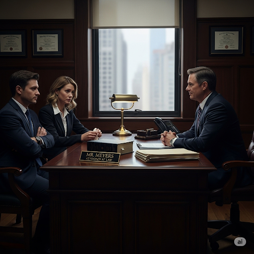
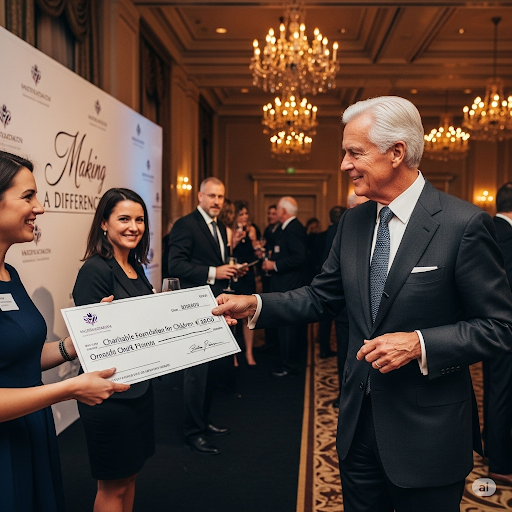
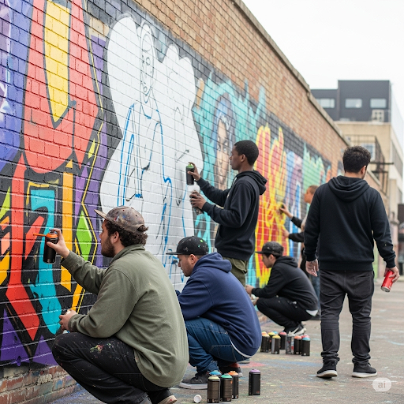
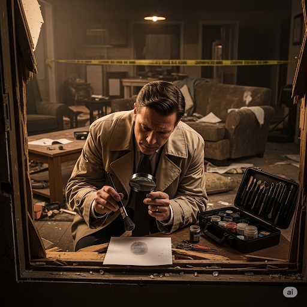
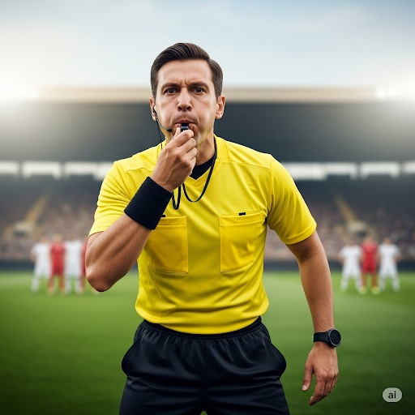
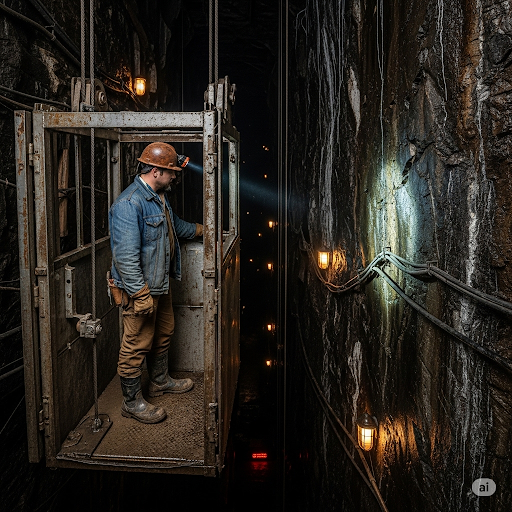
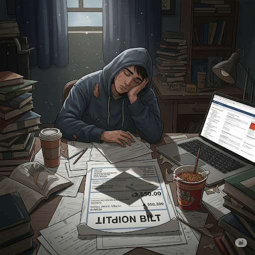

# “I Didn’t Do It!”

Billy was in big trouble. The day before, a **donor** gave the school a painting with a sports **theme**. It showed a **referee** congratulating two athletes. The principal hung the painting in front of the office, hoping that it would be a **stimulus** for students to play sports. The next morning, however, the painting was destroyed. There was **graffiti** on it, and it had many holes in it. The worst part was that one of Billy’s **fellow** students said she thought she saw Billy do it!

But Billy didn’t do it. The principal called Billy’s parents and said, “Billy won’t tell us the truth. He’s a **chronic** liar, and he ruined the painting. If you don’t pay for it, we’ll **terminate** his education here.”

Billy’s parents didn’t have enough money to pay for the painting and for his **tuition**. But Billy’s parents had an idea. That afternoon, they went to see Mr. Meyers, an **attorney**.

“Mr. Meyers, my son has been **implicated** in a crime he says he didn’t do,” Billy’s father said. “Everybody believes the **gossip**. Even some of our own **kin** think he did it!”

“I believe you. My **suspicion** is that the tape from the security cameras will show who really did it,” said Mr. Meyers.

The next day, Mr. Meyers received a packet with the videotape from the school. It showed another student who resembled Billy walking up to the painting and writing on it. Then the student took a knife by the **shaft** and started to **stab** large holes in it. Finally, he **severed** the rope that held up the painting, and it fell to the floor.

Mr. Meyers showed the tape to the principal. “Clearly, that’s not Billy,” he said. “This boy is actually responsible and needs some **discipline**.”

Billy was happy that someone believed him. He said to Mr. Meyers, “When I **graduate** and go to university, I will major in law, so I can be a **guardian** of justice like you!”

## Sentences of story

“I Didn’t Do It!”

Billy was in big trouble.

The day before, a donor gave the school a painting with a sports theme.

It showed a referee congratulating two athletes.

The principal hung the painting in front of the office, hoping that it would be a stimulus for students to play sports.

The next morning, however, the painting was destroyed.

There was graffiti on it, and it had many holes in it.

The worst part was that one of Billy’s fellow students said she thought she saw Billy do it!

But Billy didn’t do it.

The principal called Billy’s parents and said, “Billy won’t tell us the truth. He’s a chronic liar, and he ruined the painting. If you don’t pay for it, we’ll terminate his education here.”

Billy’s parents didn’t have enough money to pay for the painting and for his tuition.

But Billy’s parents had an idea.

That afternoon, they went to see Mr. Meyers, an attorney.

“Mr. Meyers, my son has been implicated in a crime he says he didn’t do,” Billy’s father said.

“Everybody believes the gossip.

Even some of our own kin think he did it!”

“I believe you.

My suspicion is that the tape from the security cameras will show who really did it,” said Mr. Meyers.

The next day, Mr. Meyers received a packet with the videotape from the school.

It showed another student who resembled Billy walking up to the painting and writing on it.

Then the student took a knife by the shaft and started to stab large holes in it.

Finally, he severed the rope that held up the painting, and it fell to the floor.

Mr. Meyers showed the tape to the principal.

“Clearly, that’s not Billy,” he said.

“This boy is actually responsible and needs some discipline.”

Billy was happy that someone believed him.

He said to Mr. Meyers, “When I graduate and go to university, I will major in law, so I can be a guardian of justice like you!”

## List of word
attorney chronic discipline donor fellow gossip graduate graffiti guardian implicate kin referee sever shaft stab stimulus suspicion terminate theme tuition

## 1. attorney

- IPA: /əˈtɜːrni/
- Class: n.
- Câu truyện ẩn dụ: Ở một phiên tòa, có một người "ở-tòa-này" (attorney) suốt. Ông là luật sư, người đại diện cho thân chủ của mình trước tòa, dùng lý lẽ và luật pháp để bảo vệ họ.
- Định nghĩa : Luật sư.
- Enlish definition: A lawyer, especially one who can act for someone in court.
- Sentence of stroy: That afternoon, they went to see Mr. Meyers, an **attorney**.
- Ví dụ thông dụng:
1. They hired a top attorney to handle their case.
2. She works as a prosecuting attorney for the state.

## 2. chronic

- IPA: /ˈkrɑːnɪk/
- Class: adj.
- Câu truyện ẩn dụ: Một ông lão bị ho "cờ-ró-nách" (chronic) quanh năm. Cơn ho này kéo dài dai dẳng, không dứt, trở thành một phần cuộc sống của ông. Bất cứ điều gì kéo dài và khó chữa đều được gọi là chronic (mãn tính, kinh niên).
- Định nghĩa : Mãn tính, kinh niên.
- Enlish definition: (Of an illness or problem) persisting for a long time or constantly recurring.
- Sentence of stroy: He’s a **chronic** liar, and he ruined the painting.
- Ví dụ thông dụng:
1. He suffers from chronic back pain.
2. There is a chronic shortage of teachers in the city.

## 3. discipline

- IPA: /ˈdɪsəplɪn/
- Class: n.
- Câu truyện ẩn dụ: Để trở thành một võ sĩ giỏi, bạn phải "đít-sờ-bờ-lin" (discipline) vào luyện tập hàng ngày. Bạn cần có kỷ luật, tuân theo quy tắc, và tự kiểm soát bản thân một cách nghiêm ngặt. Discipline chính là chìa khóa của thành công.
- Định nghĩa : Kỷ luật, sự trừng phạt.
- Enlish definition: The practice of training people to obey rules or a code of behavior; the punishment given to correct someone.
- Sentence of stroy: This boy is actually responsible and needs some **discipline**.
- Ví dụ thông dụng:
1. The school has a strict policy on discipline.
2. It takes a lot of discipline to study for a PhD.

## 4. donor

- IPA: /ˈdəʊnər/
- Class: n.
- Câu truyện ẩn dụ: Có một người giàu có tên là Đô-nơ. Ông thích "đô-nết" (donate - hiến tặng) tiền bạc và tài sản của mình cho người nghèo và các tổ chức từ thiện. Mọi người gọi ông là một donor (người hiến tặng) hào phóng.
- Định nghĩa : Người hiến tặng, người cho.
- Enlish definition: A person who gives some of their blood or a part of their body to help someone who is ill; a person who gives money or goods to an organization.
- Sentence of stroy: The day before, a **donor** gave the school a painting with a sports theme.
- Ví dụ thông dụng:
1. We are grateful to all our donors for their generous contributions.
2. He was a blood donor for many years.

## 5. fellow

- IPA: /ˈfeləʊ/
- Class: n.
- Câu truyện ẩn dụ: Hai người bạn cùng làm chung một công việc, họ là "fellow" (bạn, đồng nghiệp) của nhau. Họ "phe-lâu" (fellow) với nhau, cùng chia sẻ công việc và những khó khăn. Fellow chỉ một người trong cùng một nhóm hoặc có cùng hoàn cảnh.
- Định nghĩa : Bạn, đồng nghiệp, người cùng nhóm.
- Enlish definition: A person in the same position, involved in the same activity, or otherwise associated with another.
- Sentence of stroy: The worst part was that one of Billy’s **fellow** students said she thought she saw Billy do it!
- Ví dụ thông dụng:
1. She discussed the problem with her fellow workers.
2. He is a fellow of the Royal Society.

## 6. gossip

- IPA: /ˈɡɑːsɪp/
- Class: n.
- Câu truyện ẩn dụ: Ở một góc chợ, mấy bà "gõ-xíp" (gossip) xì xào bàn tán chuyện của người khác. Họ nói những chuyện không chắc có thật, những tin đồn, những chuyện riêng tư. Những cuộc nói chuyện đó chính là gossip (chuyện tầm phào, tin đồn).
- Định nghĩa : Chuyện tầm phào, tin đồn.
- Enlish definition: Casual conversation or reports about other people, typically involving details that are not confirmed as being true.
- Sentence of stroy: Everybody believes the **gossip**.
- Ví dụ thông dụng:
1. Don't believe all the gossip you hear.
2. I have some juicy gossip for you.

## 7. graduate

- IPA: /ˈɡrædʒueɪt/
- Class: v.
- Câu truyện ẩn dụ: Sau nhiều năm học hành, anh sinh viên cuối cùng cũng "ra-đu-ấy" (graduate). Anh mặc áo cử nhân, nhận bằng và chính thức graduate (tốt nghiệp) khỏi trường đại học, sẵn sàng cho một chương mới của cuộc đời.
- Định nghĩa : Tốt nghiệp.
- Enlish definition: To successfully complete an academic degree, course of training, or high school.
- Sentence of stroy: When I **graduate** and go to university, I will major in law, so I can be a guardian of justice like you!
- Ví dụ thông dụng:
1. He graduated from Harvard University last year.
2. After she graduates, she intends to travel for a year.

## 8. graffiti

- IPA: /ɡrəˈfiːti/
- Class: n.
- Câu truyện ẩn dụ: Một nhóm thanh niên "gờ-ra-phít-ti" (graffiti) lên các bức tường trong thành phố. Họ dùng bình sơn xịt để vẽ những hình ảnh và chữ viết đầy màu sắc. Những hình vẽ, chữ viết trên tường nơi công cộng đó được gọi là graffiti.
- Định nghĩa: Hình vẽ hoặc chữ viết trên tường nơi công cộng.
- Enlish definition: Words or drawings, especially humorous, rude, or political, on walls, doors, etc. in public places.
- Sentence of stroy: There was **graffiti** on it, and it had many holes in it.
- Ví dụ thông dụng:
    1. The subway was covered in graffiti.
    2. He was arrested for spraying graffiti on the school building.

## 9. guardian

- IPA: /ˈɡɑːrdiən/
- Class: n.
- Câu truyện ẩn dụ: Hãy tưởng tượng một vị thần "gác-đi-đền" (guardian). Nhiệm vụ của ông là canh gác, bảo vệ ngôi đền thiêng. Ông là người guardian (người bảo vệ, người giám hộ) của nơi đó, đảm bảo không ai có thể xâm phạm.
- Định nghĩa : Người bảo vệ, người giám hộ.
- Enlish definition: A person who protects or defends something; a person who is legally responsible for someone who is unable to manage their own affairs, such as a child.
- Sentence of stroy: I will major in law, so I can be a **guardian** of justice like you!
- Ví dụ thông dụng:
1. The police are guardians of law and order.
2. After his parents died, his aunt became his legal guardian.

## 10. implicate

- IPA: /ˈɪmplɪkeɪt/
- Class: v.
- Câu truyện ẩn dụ: Cảnh sát tìm thấy dấu vân tay của một người tại hiện trường vụ án. Điều này "im-bờ-lì-kết" (implicate) anh ta, tức là làm cho anh ta bị lôi kéo, bị dính líu vào vụ án đó, cho thấy anh ta có thể là thủ phạm.
- Định nghĩa : Làm cho dính líu, làm cho liên can.
- Enlish definition: To show that someone is involved in a crime or a dishonest act.
- Sentence of stroy: My son has been **implicated** in a crime he says he didn’t do.
- Ví dụ thông dụng:
1. The evidence seems to implicate him in the robbery.
2. He was implicated in the scandal.

## 11. kin

- IPA: /kɪn/
- Class: n.
- Câu truyện ẩn dụ: Trong một gia đình, mọi người đều có mối quan hệ "kín" (kin) đáo, gắn bó. Họ là họ hàng, là kin của nhau. Kin là một từ ngắn gọn để chỉ những người có quan hệ huyết thống, gia đình và họ hàng.
- Định nghĩa : Họ hàng, gia đình.
- Enlish definition: Your family or your relatives.
- Sentence of stroy: Even some of our own **kin** think he did it!
- Ví dụ thông dụng:
1. All his kin came to the wedding.
2. She has no kin in this country.

## 12. referee

- IPA: /ˌrefəˈriː/
- Class: n.
- Câu truyện ẩn dụ: Trong một trận bóng đá, có một người chạy khắp sân, thổi còi "ré-phê-ri" (referee). Ông là trọng tài, người đảm bảo các cầu thủ chơi đúng luật và đưa ra các quyết định công bằng.
- Định nghĩa : Trọng tài.
- Enlish definition: A person who is in charge of a sports game and who makes certain it is played according to the rules.
- Sentence of stroy: It showed a **referee** congratulating two athletes.
- Ví dụ thông dụng:
1. The referee blew the whistle for a foul.
2. He was sent off for arguing with the referee.

## 13. sever

- IPA: /ˈsevər/
- Class: v.
- Câu truyện ẩn dụ: Một người thợ dùng một cái cưa sắc "xé-vờ" (sever) một khúc gỗ ra làm đôi. Hành động cắt đứt, chặt đứt một thứ gì đó một cách dứt khoát chính là sever. Nó cũng có thể dùng để chỉ việc cắt đứt một mối quan hệ.
- Định nghĩa : Cắt đứt, chặt đứt.
- Enlish definition: To cut something into two pieces; to cut something off.
- Sentence of stroy: Finally, he **severed** the rope that held up the painting, and it fell to the floor.
- Ví dụ thông dụng:
1. His finger was severed in the accident.
2. The company decided to sever all ties with the supplier.

## 14. shaft

- IPA: /ʃæft/
- Class: n.
- Câu truyện ẩn dụ: Một người thợ mỏ đi xuống hầm bằng một cái thang máy trong một cái hố thẳng đứng, sâu hun hút. Cái hố đó là một cái shaft (hầm, giếng). Shaft cũng có thể là phần thân dài của một công cụ, như "cán" dao hay "thân" mũi tên. Nó có hình dạng như một cái "sáp" dài.
- Định nghĩa : Cán, thân (của công cụ), hầm, giếng (mỏ).
- Enlish definition: The long, narrow part of a tool or weapon; a long, narrow space, usually vertical, in a building or underground.
- Sentence of stroy: Then the student took a knife by the **shaft** and started to stab large holes in it.
- Ví dụ thông dụng:
1. He held the spear by its shaft.
2. The miners descended the mine shaft.

## 15. stab

- IPA: /stæb/
- Class: v.
- Câu truyện ẩn dụ: Một tên cướp "sờ-táp" (stab) nạn nhân bằng một con dao. Hắn dùng vật nhọn đâm mạnh vào người đó. Hành động đâm bằng một vật có mũi nhọn được gọi là stab.
- Định nghĩa : Đâm (bằng dao, vật nhọn).
- Enlish definition: To injure someone with a sharp-pointed object such as a knife.
- Sentence of stroy: Then the student took a knife by the shaft and started to **stab** large holes in it.
- Ví dụ thông dụng:
1. He was stabbed to death in a street fight.
2. She stabbed the intruder with a kitchen knife.

## 16. stimulus

- IPA: /ˈstɪmjələs/
- Class: n.
- Câu truyện ẩn dụ: Một con ốc sên "sờ-tí-mù-lòa" (stimulus) vào một chiếc lá. Chiếc lá là một stimulus (sự kích thích), khiến con ốc sên phản ứng lại bằng cách co mình vào vỏ. Stimulus là bất cứ thứ gì gây ra một phản ứng hoặc một hoạt động.
- Định nghĩa : Sự kích thích, tác nhân kích thích.
- Enlish definition: Something that causes growth, activity, or reaction.
- Sentence of stroy: The principal hung the painting in front of the office, hoping that it would be a **stimulus** for students to play sports.
- Ví dụ thông dụng:
1. The pay raise was a stimulus for the workers to improve their productivity.
2. Foreign investment has been a stimulus to the economy.

## 17. suspicion

- IPA: /səˈspɪʃn/
- Class: n.
- Câu truyện ẩn dụ: Cảnh sát "sợ-sập-bẫy-sình" (suspicion) khi điều tra một vụ án. Họ luôn có sự suspicion (sự nghi ngờ) đối với mọi manh mối, vì họ tin rằng có điều gì đó không đúng hoặc ai đó đang nói dối. Suspicion là cảm giác nghi ngờ mà không có bằng chứng chắc chắn.
- Định nghĩa : Sự nghi ngờ, sự ngờ vực.
- Enlish definition: A feeling or belief that someone has done something wrong, dishonest, or illegal.
- Sentence of stroy: My **suspicion** is that the tape from the security cameras will show who really did it.
- Ví dụ thông dụng:
1. He was arrested on suspicion of murder.
2. I have a suspicion that she's not telling the truth.

## 18. terminate

- IPA: /ˈtɜːrmɪneɪt/
- Class: v.
- Câu truyện ẩn dụ: Kẻ hủy diệt (The Terminator) được gửi đến để "tơ-mì-nết" (terminate) mục tiêu, tức là chấm dứt sự sống của họ. Terminate có nghĩa là kết thúc, chấm dứt một cái gì đó một cách chính thức và vĩnh viễn, như một hợp đồng, một chuyến tàu, hay một chương trình.
- Định nghĩa : Chấm dứt, kết thúc.
- Enlish definition: To bring to an end or to cause something to end.
- Sentence of stroy: If you don’t pay for it, we’ll **terminate** his education here.
- Ví dụ thông dụng:
1. They terminated his contract without notice.
2. This train will terminate at the next station.

## 19. theme

- IPA: /θiːm/
- Class: n.
- Câu truyện ẩn dụ: Một bữa tiệc có theme (chủ đề) là "cướp biển". Mọi người đều ăn mặc như cướp biển, và trang trí cũng toàn hình đầu lâu xương chéo. Theme là ý tưởng chính, là chủ đề xuyên suốt một cuốn sách, bộ phim, hay một sự kiện.
- Định nghĩa : Chủ đề, đề tài.
- Enlish definition: The main subject of a talk, book, film, etc.
- Sentence of stroy: The day before, a donor gave the school a painting with a sports **theme**.
- Ví dụ thông dụng:
1. The theme of the conference was "The Future of Technology".
2. Friendship is a common theme in her novels.

## 20. tuition

- IPA: /tuˈɪʃn/
- Class: n.
- Câu truyện ẩn dụ: Để đi học, bạn phải trả tiền. Số tiền này giống như "túi-tiền" (tuition) của bố mẹ vơi đi. Tuition chính là học phí, số tiền bạn trả cho việc giảng dạy ở một trường đại học hoặc trường tư.
- Định nghĩa : Học phí.
- Enlish definition: Money that you pay to be taught, especially at a college or university.
- Sentence of stroy: Billy’s parents didn’t have enough money to pay for the painting and for his **tuition**.
- Ví dụ thông dụng:
1. University tuition fees are very high in the US.
2. He had to take out a loan to pay his tuition.