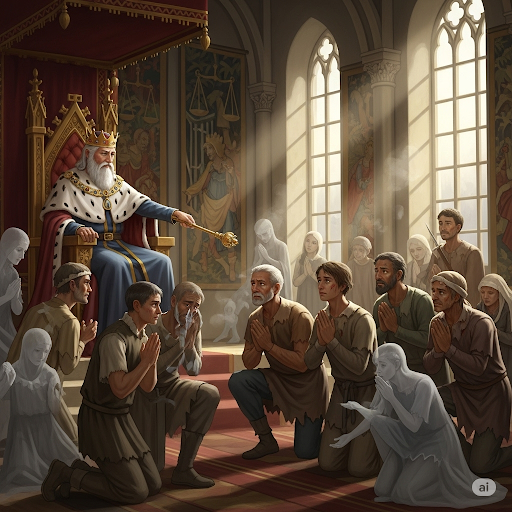

# The Soldier’s Decision

A soldier was captured while fighting in an enemy king’s land. It was well known that this king would make **captives** fight one another. This was **commonplace** during his **reign**. For these fights, the king had built several large **arenas**. He often awarded the winners by setting them free or even having them join his elite army **corps**.

The soldier, however, decided he had seen too much violence. He now felt that all life was **sacred**. The night before his first match, he made a risky decision. He decided that he would not engage in **combat**. He knew he may never be set free, but it was a decision that he was willing to accept.

In the morning, he was led from the prisoners’ **compound** to one of the king’s arenas. A gate coated in **rust** stood between him and the **auditorium’s** floor. He was worried, but he knew what he had to do.

When the gate opened, he calmly walked to the center of the arena and sat. He started to **meditate**. His **foe** Darius, who was skilled in the **realm** of sword fighting and was typically not very **aggressive**, would not fight the quiet soldier until he attacked Darius first.

Darius tried to **provoke** him by **hacking** at the air close to his head with his sword. But the soldier was not **distracted**. He sat quietly, as if he were **dumb**, and looked calmly up at the sky. Even when Darius **nicked** him on the cheek with the edge of his sword, the soldier did not move.

At last he threw down his sword and shield and gave up. “I can’t fight someone who refuses to fight me!” Darius shouted to the king.

The king was very impressed with the soldier. Never in any battle had he seen someone so brave. As a result, he gave the peaceful soldier **amnesty**. The soldier’s actions proved to the king and everyone in the arena that peace was more powerful than fighting.

## Sentences of story

The Soldier’s Decision

A soldier was captured while fighting in an enemy king’s land.

It was well known that this king would make captives fight one another.

This was commonplace during his reign.

For these fights, the king had built several large arenas.

He often awarded the winners by setting them free or even having them join his elite army corps.

The soldier, however, decided he had seen too much violence.

He now felt that all life was sacred.

The night before his first match, he made a risky decision.

He decided that he would not engage in combat.

He knew he may never be set free, but it was a decision that he was willing to accept.

In the morning, he was led from the prisoners’ compound to one of the king’s arenas.

A gate coated in rust stood between him and the auditorium’s floor.

He was worried, but he knew what he had to do.

When the gate opened, he calmly walked to the center of the arena and sat.

He started to meditate.

His foe Darius, who was skilled in the realm of sword fighting and was typically not very aggressive, would not fight the quiet soldier until he attacked Darius first.

Darius tried to provoke him by hacking at the air close to his head with his sword.

But the soldier was not distracted.

He sat quietly, as if he were dumb, and looked calmly up at the sky.

Even when Darius nicked him on the cheek with the edge of his sword, the soldier did not move.

At last he threw down his sword and shield and gave up.

“I can’t fight someone who refuses to fight me!” Darius shouted to the king.

The king was very impressed with the soldier.

Never in any battle had he seen someone so brave.

As a result, he gave the peaceful soldier amnesty.

The soldier’s actions proved to the king and everyone in the arena that peace was more powerful than fighting.

## List of word

aggressive amnesty arena auditorium captive combat commonplace compound corps distract dumb foe hack meditate nick provoke realm reign rust sacred

## 1. aggressive

- IPA: /əˈɡresɪv/
- Class: adj.
- Câu truyện ẩn dụ: Nghe như "ặc-rét-sịp". Một người mà "ặc" ra tiếng, "rét" run cả người, lại còn mặc "sịp" ra ngoài thì rất là hung hăng, hiếu chiến (aggressive).
- Định nghĩa : Hung hăng, hiếu chiến.
- English definition: Ready or likely to attack or confront; characterized by or resulting from aggression.
- Sentence of stroy: His foe Darius, who was skilled in the realm of sword fighting and was typically not very **aggressive**, would not fight the quiet soldier until he attacked Darius first.
- Ví dụ thông dụng:
1. The dog became aggressive and started barking.
2. He has a very aggressive style of playing tennis.

## 2. amnesty

- IPA: /ˈæmnəsti/
- Class: n.
- Câu truyện ẩn dụ: "Ám-nét-tí" (amnesty). Vua ra lệnh, những tù nhân nào bị "ám" ảnh tội lỗi, giờ chỉ cần "nét" mặt thành tâm "tí" là sẽ được ân xá. Amnesty là sự ân xá.
- Định nghĩa : Sự ân xá, sự tha tội.
- English definition: An official pardon for people who have been convicted of political offenses.
- Sentence of stroy: As a result, he gave the peaceful soldier **amnesty**.
- Ví dụ thông dụng:
1. The government granted an amnesty to all political prisoners.
2. Illegal immigrants were offered an amnesty.

## 3. arena

- IPA: /əˈriːnə/
- Class: n.
- Câu truyện ẩn dụ: "Ơ-ri-nà". "Ơ, đây là đâu?". "Đây là đấu trường La Mã nà". Arena là đấu trường.
- Định nghĩa : Đấu trường.
- English definition: A level area surrounded by seating, in which sports, entertainments, and other public events are held.
- Sentence of stroy: For these fights, the king had built several large **arenas**.
- Ví dụ thông dụng:
1. The concert was held at the city's largest sports arena.
2. The gladiators entered the arena to fight.

## 4. auditorium

- IPA: /ˌɔːdɪˈtɔːriəm/
- Class: n.
- Câu truyện ẩn dụ: "O-đi-to-ri-um". Nghe như "Ồ, đi to rồi ùm". Mọi người "ồ" lên khi đi vào một khán phòng "to" lớn, âm thanh trong đó vang "ùm" cả lên. Auditorium là khán phòng, giảng đường.
- Định nghĩa : Khán phòng, giảng đường.
- English definition: The part of a theater, concert hall, or other public building in which the audience sits.
- Sentence of stroy: A gate coated in rust stood between him and the **auditorium’s** floor.
- Ví dụ thông dụng:
1. The school's auditorium can seat 500 people.
2. The lecture will take place in the main auditorium.

## 5. captive

- IPA: /ˈkæptɪv/
- Class: n.
- Câu truyện ẩn dụ: "Cáp-típ". Tên cướp biển "cáp" (captain) bị bắt, hắn bị trói bằng "cáp" và bị đòi tiền "típ" (tip) để chuộc. Hắn trở thành một captive (tù binh).
- Định nghĩa : Tù binh, người bị giam cầm.
- English definition: A person who has been taken prisoner or an animal that has been confined.
- Sentence of stroy: It was well known that this king would make **captives** fight one another.
- Ví dụ thông dụng:
1. The captives were released after the war.
2. He was held captive for three years.

## 6. combat

- IPA: /ˈkɑːmbæt/
- Class: n.
- Câu truyện ẩn dụ: "Cơm-bát". Những người lính trước khi ra trận "cơm-bát" (combat) đều ăn một bát cơm đầy để có sức chiến đấu. Combat là trận đấu, trận chiến.
- Định nghĩa : Trận đấu, trận chiến.
- English definition: Fighting between armed forces.
- Sentence of stroy: He decided that he would not engage in **combat**.
- Ví dụ thông dụng:
1. He was killed in combat.
2. The soldiers were trained for close combat.

## 7. commonplace

- IPA: /ˈkɑːmənpleɪs/
- Class: adj.
- Câu truyện ẩn dụ: "Common-place". "Common" là chung, "place" là nơi. Một thứ gì đó ở "nơi chốn chung" nào cũng thấy thì nó rất là tầm thường, phổ biến (commonplace).
- Định nghĩa : Tầm thường, phổ biến, thông thường.
- English definition: Not unusual; ordinary.
- Sentence of stroy: This was **commonplace** during his reign.
- Ví dụ thông dụng:
1. Computers are now commonplace in homes and offices.
2. It's commonplace to see people using smartphones on the bus.

## 8. compound

- IPA: /ˈkɑːmpaʊnd/
- Class: n.
- Câu truyện ẩn dụ: "Cơm-bao". Trong khu nhà tù, tù nhân được phát "cơm" đựng trong "bao". Khu vực có hàng rào bao quanh đó gọi là compound (khu vực có rào, hợp chất).
- Định nghĩa : Khu vực có rào vây quanh; hợp chất.
- English definition: An area of land with a group of buildings on it that is enclosed by a fence or wall; a thing that is composed of two or more separate elements.
- Sentence of stroy: In the morning, he was led from the prisoners’ **compound** to one of the king’s arenas.
- Ví dụ thông dụng:
1. The embassy compound was heavily guarded.
2. Water is a compound of hydrogen and oxygen.

## 9. corps

- IPA: /kɔːr/
- Class: n.
- Câu truyện ẩn dụ: Phát âm giống "core" (cốt lõi). Quân đoàn (corps) là lực lượng "cốt" lõi, tinh nhuệ của quân đội. Chữ `ps` cuối câm.
- Định nghĩa : Quân đoàn, đoàn.
- English definition: A main subdivision of an army in the field, consisting of two or more divisions; a body of people engaged in a particular activity.
- Sentence of stroy: He often awarded the winners by setting them free or even having them join his elite army **corps**.
- Ví dụ thông dụng:
1. He joined the Marine Corps after high school.
2. The press corps followed the president everywhere.

## 10. distract

- IPA: /dɪˈstrækt/
- Class: v.
- Câu truyện ẩn dụ: "Dis-track". "Dis" là trái ngược, "track" là đường đi. Bị làm cho đi lệch "đường đi" của sự tập trung, tức là bị làm cho xao lãng (distract).
- Định nghĩa : Làm xao lãng, làm mất tập trung.
- English definition: To prevent someone from giving their full attention to something.
- Sentence of stroy: But the soldier was not **distracted**.
- Ví dụ thông dụng:
1. Don't distract me while I'm driving.
2. The loud music distracted her from her studies.

## 11. dumb

- IPA: /dʌm/
- Class: adj.
- Câu truyện ẩn dụ: "Đâm". Bị "đâm" một cú trời giáng vào đầu nên anh ta bị câm, không nói được lời nào. Dumb có nghĩa là câm, hoặc ngớ ngẩn.
- Định nghĩa : Câm, không nói được; ngớ ngẩn.
- English definition: Unable to speak; temporarily unable or unwilling to speak.
- Sentence of stroy: He sat quietly, as if he were **dumb**, and looked calmly up at the sky.
- Ví dụ thông dụng:
1. The shock of the accident left him dumb.
2. That was a dumb thing to do.

## 12. foe

- IPA: /fəʊ/
- Class: n.
- Câu truyện ẩn dụ: Nghe như "phở". Hai quán "phở" cạnh tranh nhau, coi nhau là kẻ thù (foe) không đội trời chung.
- Định nghĩa : Kẻ thù, đối thủ.
- English definition: An enemy or opponent.
- Sentence of stroy: His **foe** Darius, who was skilled in the realm of sword fighting and was typically not very aggressive, would not fight the quiet soldier until he attacked Darius first.
- Ví dụ thông dụng:
1. The two armies were longtime foes.
2. He was a formidable foe in the chess tournament.

## 13. hack

- IPA: /hæk/
- Class: v.
- Câu truyện ẩn dụ: Tin tặc (hacker) "hắc" (hack) vào hệ thống máy tính, tức là chặt, đẽo, xâm nhập một cách thô bạo. Hack cũng có nghĩa là chặt mạnh, bổ.
- Định nghĩa : Chặt, đốn, bổ (một cách thô bạo).
- English definition: To cut with rough or heavy blows.
- Sentence of stroy: Darius tried to **provoke** him by **hacking** at the air close to his head with his sword.
- Ví dụ thông dụng:
1. He hacked the tree down.
2. The butcher hacked off a large piece of meat.

## 14. meditate

- IPA: /ˈmedɪteɪt/
- Class: v.
- Câu truyện ẩn dụ: "Me-đi-tết". "Mẹ đi Tết", còn con ở nhà ngồi "me-đi-tết" (meditate) - ngồi thiền để tĩnh tâm, mong mẹ mau về. Meditate là thiền, trầm tư.
- Định nghĩa : Thiền, ngẫm nghĩ, trầm tư.
- English definition: To focus one's mind for a period of time, in silence or with the aid of chanting, for religious or spiritual purposes or as a method of relaxation.
- Sentence of stroy: He started to **meditate**.
- Ví dụ thông dụng:
1. I try to meditate for 20 minutes every morning.
2. She was meditating on the meaning of life.

## 15. nick

- IPA: /nɪk/
- Class: v.
- Câu truyện ẩn dụ: Dao cạo râu "nhích" (nick) một cái, tạo ra một vết cắt nhỏ trên da. Nick là cắt nhẹ, khía nhẹ.
- Định nghĩa : Cắt nhẹ, khía, làm sứt.
- English definition: To make a small cut in something.
- Sentence of stroy: Even when Darius **nicked** him on the cheek with the edge of his sword, the soldier did not move.
- Ví dụ thông dụng:
1. He nicked himself while shaving.
2. The car was nicked in several places.

## 16. provoke

- IPA: /prəˈvəʊk/
- Class: v.
- Câu truyện ẩn dụ: "Pro-vốc". Một người rất "pro" (chuyên nghiệp) trong việc "vốc" lời nói ra để khiêu khích, chọc tức người khác. Provoke là khiêu khích.
- Định nghĩa : Khiêu khích, chọc tức.
- English definition: To deliberately make someone angry or annoyed.
- Sentence of stroy: Darius tried to **provoke** him by hacking at the air close to his head with his sword.
- Ví dụ thông dụng:
1. The dog is harmless unless provoked.
2. His comments were intended to provoke a reaction.

## 17. realm

- IPA: /relm/
- Class: n.
- Câu truyện ẩn dụ: Nghe như "rèm". Vị vua cai trị vương quốc của mình từ sau tấm "rèm" ngọc. Realm là vương quốc, lĩnh vực.
- Định nghĩa : Vương quốc; lĩnh vực, phạm vi.
- English definition: A kingdom; a field or domain of activity or interest.
- Sentence of stroy: His foe Darius, who was skilled in the **realm** of sword fighting and was typically not very aggressive, would not fight the quiet soldier until he attacked Darius first.
- Ví dụ thông dụng:
1. The king ruled over a vast realm.
2. He is a master in the realm of theoretical physics.

## 18. reign

- IPA: /reɪn/
- Class: n.
- Câu truyện ẩn dụ: Nghe như "rain" (mưa). Trong triều đại của vị vua này, "mưa" thuận gió hòa, đất nước thịnh vượng. Reign là triều đại, thời gian trị vì.
- Định nghĩa : Triều đại, thời gian trị vì.
- English definition: The period during which a sovereign rules.
- Sentence of stroy: This was commonplace during his **reign**.
- Ví dụ thông dụng:
1. The reign of Queen Victoria was a long one.
2. Peace and prosperity marked his reign.

## 19. rust

- IPA: /rʌst/
- Class: n.
- Câu truyện ẩn dụ: "Rớt". Thanh sắt để ngoài trời, bị nước mưa "rớt" vào nên bị gỉ sét. Rust là gỉ sét.
- Định nghĩa : Gỉ, gỉ sét.
- English definition: A reddish-brown flaky coating of iron oxide that is formed on iron or steel by oxidation, especially in the presence of moisture.
- Sentence of stroy: A gate coated in **rust** stood between him and the auditorium’s floor.
- Ví dụ thông dụng:
1. The old bike was covered in rust.
2. You can remove rust with vinegar.

## 20. sacred

- IPA: /ˈseɪkrɪd/
- Class: adj.
- Câu truyện ẩn dụ: "Say-crid". "Say" hello với "credit" card, nhưng không phải để mua sắm, mà để cúng vào chùa. Vì nơi đây là nơi thiêng liêng (sacred), mọi thứ đều linh thiêng.
- Định nghĩa : Thiêng liêng, linh thiêng.
- English definition: Connected with God or a god or dedicated to a religious purpose and so deserving veneration.
- Sentence of stroy: He now felt that all life was **sacred**.
- Ví dụ thông dụng:
1. The cow is a sacred animal in India.
2. The monks live in a sacred place.