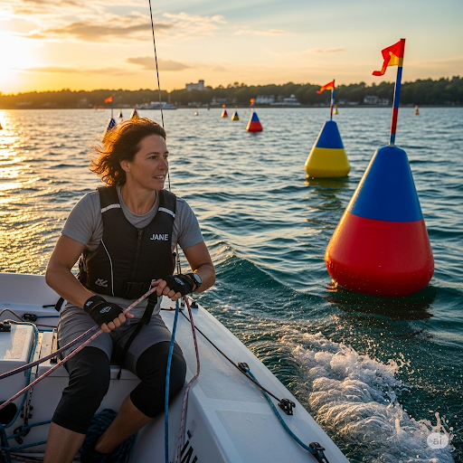

# Jane’s Pride

Jane and her father, Mike, owned a **secondhand** boat. They called it “High Hopes.” The two loved to spend time together on the ocean and would often go on long fishing trips.

Mike taught Jane how to perform important tasks. Jane learned how to steer the boat and adjust the sails. She learned how to put **grease** on the **intricate** gears of the motor. She learned how to **submerge** the **anchor** and secure it by putting a rope in a **slot**. Jane liked helping her father, but she thought that she wasn’t very good at it. Sometimes, she omitted important steps and made **frequent** mistakes. Jane thought she wasn’t capable of manual labor.

Mike wanted to prove to her that she was indeed capable and important. He thought of a **tactic** to test Jane’s skills in the **context** of a **catastrophe**. He hid under the deck and pretended to be trapped. He shouted, “Jane, I can’t get out! You have to get back to the **dock** and find help!”

Jane began to panic. She thought she might make her usual mistakes, which would **precipitate** a disaster. However, she had to listen to her dad and act **accordingly**. She pulled up the anchor with all of her might. She remembered to **overlap** the sails to **offset** the wind. She steered the boat around **buoys** where the water was shallow. When they got to shore, Mike came out from under the deck.

Jane said, “I thought you were trapped!”

Mike laughed. He said, “It wasn’t a **genuine** emergency. I **distorted** the truth to test your abilities. Look at what a great job you did getting the boat home safely! I knew you could do it.”

To honor his daughter, Mike decided to rename his boat. He **designated** it “Jane’s Pride” and painted the name on the **fore** of the ship. Jane finally had something to be proud of.

## Sentences of story

Jane’s Pride

Jane and her father, Mike, owned a secondhand boat.

They called it “High Hopes.”

The two loved to spend time together on the ocean and would often go on long fishing trips.

Mike taught Jane how to perform important tasks.

Jane learned how to steer the boat and adjust the sails.

She learned how to put grease on the intricate gears of the motor.

She learned how to submerge the anchor and secure it by putting a rope in a slot.

Jane liked helping her father, but she thought that she wasn’t very good at it.

Sometimes, she omitted important steps and made frequent mistakes.

Jane thought she wasn’t capable of manual labor.

Mike wanted to prove to her that she was indeed capable and important.

He thought of a tactic to test Jane’s skills in the context of a catastrophe.

He hid under the deck and pretended to be trapped.

He shouted, “Jane, I can’t get out! You have to get back to the dock and find help!”

Jane began to panic.

She thought she might make her usual mistakes, which would precipitate a disaster.

However, she had to listen to her dad and act accordingly.

She pulled up the anchor with all of her might.

She remembered to overlap the sails to offset the wind.

She steered the boat around buoys where the water was shallow.

When they got to shore, Mike came out from under the deck.

Jane said, “I thought you were trapped!”

Mike laughed.

He said, “It wasn’t a genuine emergency. I distorted the truth to test your abilities. Look at what a great job you did getting the boat home safely! I knew you could do it.”

To honor his daughter, Mike decided to rename his boat.

He designated it “Jane’s Pride” and painted the name on the fore of the ship.

Jane finally had something to be proud of.

## List of word

accordingly anchor buoy catastrophe context designate distort dock fore frequent genuine grease intricate offset overlap precipitate secondhand slot submerge tactic

## 1. accordingly

- IPA: /əˈkɔːrdɪŋli/
- Class: adv.
- Câu truyện ẩn dụ: "Ơ-kó-đing-ly". Theo "cốt-đinh" (coding) mà làm, phải làm một cách tương ứng, phù hợp (accordingly).
- Định nghĩa : Một cách tương ứng, cho phù hợp.
- English definition: In a way that is appropriate to the particular circumstances.
- Sentence of stroy: However, she had to listen to her dad and act **accordingly**.
- Ví dụ thông dụng:
1. She's an expert, so we'll act accordingly.
2. He knew the rules and acted accordingly.

## 2. anchor

- IPA: /ˈæŋkər/
- Class: n.
- Câu truyện ẩn dụ: "Ăn-cơ". Thuyền trưởng hô to: "Thả neo đi rồi cả tàu vào 'ăn cơ'm!". Anchor là mỏ neo.
- Định nghĩa : Mỏ neo.
- English definition: A heavy object attached to a rope or chain and used to moor a vessel to the sea bottom.
- Sentence of stroy: She learned how to submerge the **anchor** and secure it by putting a rope in a slot.
- Ví dụ thông dụng:
1. The captain ordered the crew to drop anchor.
2. We raised the anchor and sailed away.

## 3. buoy

- IPA: /ˈbuːi/
- Class: n.
- Câu truyện ẩn dụ: Nghe như "boi" (boy). Cậu "boi" (boy) mập nổi lềnh bềnh trên mặt nước như một cái phao (buoy).
- Định nghĩa : Phao tiêu.
- English definition: An anchored float serving as a navigation mark, to show reefs or other hazards, or for mooring.
- Sentence of stroy: She steered the boat around **buoys** where the water was shallow.
- Ví dụ thông dụng:
1. The ship sailed past the warning buoy.
2. A buoy marked the entrance to the channel.

## 4. catastrophe

- IPA: /kəˈtæstrəfi/
- Class: n.
- Câu truyện ẩn dụ: "Cá-tát-trô-phi". "Cá" sấu hung dữ "tát" một cú, "trô"i hết cả làng đi, gây ra một thảm họa (catastrophe) kinh hoàng.
- Định nghĩa : Thảm họa, tai ương.
- English definition: An event causing great and often sudden damage or suffering; a disaster.
- Sentence of stroy: He thought of a tactic to test Jane’s skills in the context of a **catastrophe**.
- Ví dụ thông dụng:
1. The earthquake was a catastrophe of enormous proportions.
2. The new policy could be a financial catastrophe for the company.

## 5. context

- IPA: /ˈkɑːntekst/
- Class: n.
- Câu truyện ẩn dụ: "Con-text". "Con" phải đọc kỹ "text" (văn bản) xung quanh để hiểu được bối cảnh (context) của câu chuyện.
- Định nghĩa : Bối cảnh, ngữ cảnh.
- English definition: The circumstances that form the setting for an event, statement, or idea, and in terms of which it can be fully understood.
- Sentence of stroy: He thought of a tactic to test Jane’s skills in the **context** of a catastrophe.
- Ví dụ thông dụng:
1. You have to understand the historical context of the novel.
2. His comments, taken out of context, seem offensive.

## 6. designate

- IPA: /ˈdezɪɡneɪt/
- Class: v.
- Câu truyện ẩn dụ: "Đi-dấu-nết". Ông sếp "đi" kiểm tra, "dấu" một cái "nết" mực đỏ để chỉ định (designate) ai là người được thăng chức.
- Định nghĩa : Chỉ định, định rõ.
- English definition: To officially give a specified status or name to.
- Sentence of stroy: He **designated** it “Jane’s Pride” and painted the name on the fore of the ship.
- Ví dụ thông dụng:
1. The area has been designated as a national park.
2. We will designate one person to be in charge of the project.

## 7. distort

- IPA: /dɪˈstɔːrt/
- Class: v.
- Câu truyện ẩn dụ: "Dis-tọt". Bị "tọt" một cái vào gương nên hình ảnh bị "dis-" (biến dạng) đi. Distort là làm méo mó, xuyên tạc.
- Định nghĩa : Làm méo mó, xuyên tạc.
- English definition: To pull or twist out of shape; to give a misleading or false account or impression of.
- Sentence of stroy: I **distorted** the truth to test your abilities.
- Ví dụ thông dụng:
1. The funhouse mirror distorted my reflection.
2. The media can sometimes distort the facts.

## 8. dock

- IPA: /dɑːk/
- Class: n.
- Câu truyện ẩn dụ: Nghe như "đốc". Thuyền trưởng "đốc" thúc thủy thủ mau chóng cập vào bến (dock) trước khi trời tối.
- Định nghĩa : Bến tàu, ụ tàu.
- English definition: A structure built along or out from the shore into a body of water, to which boats may be moored.
- Sentence of stroy: You have to get back to the **dock** and find help!
- Ví dụ thông dụng:
1. The ship is currently in dry dock for repairs.
2. We walked along the dock and watched the boats.

## 9. fore

- IPA: /fɔːr/
- Class: n.
- Câu truyện ẩn dụ: Giống "four" (bốn). Con tàu có "bốn" phía, nhưng phía trước (fore) là quan trọng nhất.
- Định nghĩa : Phần trước (của tàu, thuyền).
- English definition: The front part of something, especially a ship.
- Sentence of stroy: He ... painted the name on the **fore** of the ship.
- Ví dụ thông dụng:
1. The waves crashed over the fore of the boat.
2. The mast is located in the fore section of the vessel.

## 10. frequent

- IPA: /ˈfriːkwənt/
- Class: adj.
- Câu truyện ẩn dụ: "Free-quần". Cửa hàng này tốt quá, "free" (miễn phí) "quần" cho khách hàng thường xuyên (frequent) lui tới.
- Định nghĩa : Thường xuyên, hay xảy ra.
- English definition: Occurring or done on many occasions, in many cases, or in quick succession.
- Sentence of stroy: ...she omitted important steps and made **frequent** mistakes.
- Ví dụ thông dụng:
1. He is a frequent visitor to the library.
2. There is a frequent bus service to the city center.

## 11. genuine

- IPA: /ˈdʒenjuɪn/
- Class: adj.
- Câu truyện ẩn dụ: "Dê-nu-in". Chú "dê" này được "nu"ôi và "in" dấu chứng nhận, đảm bảo là hàng thật, chính hãng (genuine).
- Định nghĩa : Thật, chính cống.
- English definition: Truly what something is said to be; authentic.
- Sentence of stroy: It wasn’t a **genuine** emergency.
- Ví dụ thông dụng:
1. This is a genuine leather jacket.
2. Her apology seemed genuine.

## 12. grease

- IPA: /ɡriːs/
- Class: n.
- Câu truyện ẩn dụ: Nghe như "gờ-ri". Để máy móc chạy "gờ-ri" (trơn tru), phải bôi dầu mỡ (grease) vào.
- Định nghĩa : Dầu mỡ, mỡ bôi trơn.
- English definition: A thick, oily substance, especially one used as a lubricant.
- Sentence of stroy: She learned how to put **grease** on the intricate gears of the motor.
- Ví dụ thông dụng:
1. You need to put some grease on the bike chain.
2. My hands were covered in grease after fixing the car.

## 13. intricate

- IPA: /ˈɪntrɪkət/
- Class: adj.
- Câu truyện ẩn dụ: "In-tri-kết". Muốn "in" ra được một tác phẩm có những chi tiết "kết" nối phức tạp, tinh xảo (intricate) này thì "trí" tuệ phải cao siêu lắm.
- Định nghĩa : Phức tạp, tinh xảo.
- English definition: Very complicated or detailed.
- Sentence of stroy: She learned how to put grease on the **intricate** gears of the motor.
- Ví dụ thông dụng:
1. The watch had an intricate design.
2. He was explaining the intricate details of the plan.

## 14. offset

- IPA: /ˌɔːfˈset/
- Class: v.
- Câu truyện ẩn dụ: "Ọp-sét". Sếp "ọp" (họp) lại để tìm cách "sét" (set) up một kế hoạch mới nhằm bù lại (offset) những thua lỗ vừa qua.
- Định nghĩa : Bù lại, đền bù.
- English definition: To counteract (something) by having an equal and opposite force or effect.
- Sentence of stroy: She remembered to overlap the sails to **offset** the wind.
- Ví dụ thông dụng:
1. The profits from the new product will offset our losses.
2. He planted trees to offset his carbon footprint.

## 15. overlap

- IPA: /ˌoʊvərˈlæp/
- Class: v.
- Câu truyện ẩn dụ: "Over-láp". Tấm tôn "láp" (lợp) lên mái nhà phải "over" (chồng lên) nhau để không bị dột. Overlap là chồng lên nhau, gối lên nhau.
- Định nghĩa : Chồng lên nhau, gối lên nhau.
- English definition: To extend over so as to cover partly.
- Sentence of stroy: She remembered to **overlap** the sails to offset the wind.
- Ví dụ thông dụng:
1. The two meetings overlap, so I can only attend one.
2. The shingles on the roof overlap to keep out the rain.

## 16. precipitate

- IPA: /prɪˈsɪpɪteɪt/
- Class: v.
- Câu truyện ẩn dụ: "Pờ-rê-xi-pi-tết". "Pờ-rê" (pray - cầu nguyện) cho "xi-pi" (shipping) đừng đến vào dịp "Tết", nếu không sẽ gây ra (precipitate) sự hỗn loạn.
- Định nghĩa : Gây ra, dẫn đến (một cách đột ngột).
- English definition: To cause (an event or situation, typically one that is bad or undesirable) to happen suddenly, unexpectedly, or prematurely.
- Sentence of stroy: She thought she might make her usual mistakes, which would **precipitate** a disaster.
- Ví dụ thông dụng:
1. The assassination precipitated a war.
2. His resignation precipitated a leadership crisis.

## 17. secondhand

- IPA: /ˈsekəndhænd/
- Class: adj.
- Câu truyện ẩn dụ: "Second-hand" (bàn tay thứ hai). Món đồ đã qua "bàn tay thứ hai", tức là đồ cũ, đã qua sử dụng (secondhand).
- Định nghĩa : Đã qua sử dụng, đồ cũ.
- English definition: Having had a previous owner; not new.
- Sentence of stroy: Jane and her father, Mike, owned a **secondhand** boat.
- Ví dụ thông dụng:
1. I bought a secondhand car.
2. She loves shopping for secondhand clothes.

## 18. slot

- IPA: /slɑːt/
- Class: n.
- Câu truyện ẩn dụ: Nghe như "sờ-lót". Đút tiền vào cái khe (slot) của máy bán hàng, phải "sờ" và "lót" tờ tiền cho thẳng.
- Định nghĩa : Khe, rãnh.
- English definition: A long, narrow aperture or slit in a machine for something to be inserted into.
- Sentence of stroy: ...and secure it by putting a rope in a **slot**.
- Ví dụ thông dụng:
1. Insert your card into the slot.
2. He found a time slot for the meeting at 3 PM.

## 19. submerge

- IPA: /səbˈmɜːrdʒ/
- Class: v.
- Câu truyện ẩn dụ: "Sắp-mợ-chờ". "Sắp" đến giờ thủy triều lên, "mợ" phải "chờ" cho con tàu chìm xuống nước (submerge) hoàn toàn rồi mới bơi đi.
- Định nghĩa : Làm chìm, nhấn chìm.
- English definition: To cause (something) to be under water.
- Sentence of stroy: She learned how to **submerge** the anchor...
- Ví dụ thông dụng:
1. The submarine submerged to avoid detection.
2. The fields were submerged by the flood.

## 20. tactic

- IPA: /ˈtæktɪk/
- Class: n.
- Câu truyện ẩn dụ: "Tắc-tích". Khi đường bị "tắc", phải dùng chiến thuật (tactic) đi đường "tích" cực hơn.
- Định nghĩa : Chiến thuật, mưu kế.
- English definition: An action or strategy carefully planned to achieve a specific end.
- Sentence of stroy: He thought of a **tactic** to test Jane’s skills...
- Ví dụ thông dụng:
1. The general planned his tactics for the upcoming battle.
2. Negotiation is a common tactic in business.

