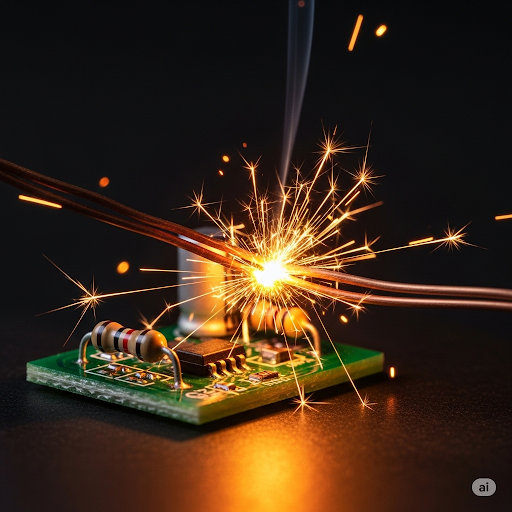

# Microchips

The bond between humans and computers is becoming more **intimate** than ever before. Scientists are now putting **microchips** inside people’s bodies. They are made up of **compressed** electrical **circuits** that can detect and record data about the body. They are tiny, but they hold the **equivalent** amount of data as most computers.

A microchip is put to use inside a person with a simple procedure. First, a doctor must put data about the patient onto a chip. **Input** about the person’s age, race, gender, and medical history is stored on the chip. The second **phase** of the process involves putting it in the person’s skin. The doctor **pinches** a piece of skin and cuts a tiny hole with a tool shaped like a **spiral**. The chip is inserted, and the skin is allowed to heal. At last, it begins the task of putting data into its **database**.

Microchips scan the patient’s body to record what is happening on the **quantum** level. They can find problems with the person’s **metabolism** and organs. They can also detect **viral** infections. They can find the **aggregate** number of **immune** and infected cells and present the results in a **ratio**. They can even tell doctors what type of **antibiotic** to give to the patient!

To recover the chip’s data, the doctor uses a special **magnet** that copies it. This way, the doctor can put the information from the chip onto a computer. Then they can find out exactly what is wrong with the person.

The idea of putting chips in humans is still very new. However, it is now becoming more **prevalent**. Scientists and doctors are hopeful about the future uses of microchips. Someday, all new babies might get a microchip soon after they are born. Doctors will be able to know about any problems from the very beginning. It is obvious that medicine and computers **complement** each other well.

## Sentences of story

Microchips

The bond between humans and computers is becoming more intimate than ever before.

Scientists are now putting microchips inside people’s bodies.

They are made up of compressed electrical circuits that can detect and record data about the body.

They are tiny, but they hold the equivalent amount of data as most computers.

A microchip is put to use inside a person with a simple procedure.

First, a doctor must put data about the patient onto a chip.

Input about the person’s age, race, gender, and medical history is stored on the chip.

The second phase of the process involves putting it in the person’s skin.

The doctor pinches a piece of skin and cuts a tiny hole with a tool shaped like a spiral.

The chip is inserted, and the skin is allowed to heal.

At last, it begins the task of putting data into its database.

Microchips scan the patient’s body to record what is happening on the quantum level.

They can find problems with the person’s metabolism and organs.

They can also detect viral infections.

They can find the aggregate number of immune and infected cells and present the results in a ratio.

They can even tell doctors what type of antibiotic to give to the patient!

To recover the chip’s data, the doctor uses a special magnet that copies it.

This way, the doctor can put the information from the chip onto a computer.

Then they can find out exactly what is wrong with the person.

The idea of putting chips in humans is still very new.

However, it is now becoming more prevalent.

Scientists and doctors are hopeful about the future uses of microchips.

Someday, all new babies might get a microchip soon after they are born.

Doctors will be able to know about any problems from the very beginning.

It is obvious that medicine and computers complement each other well.

## List of word

aggregate antibiotic circuit complement compress database equivalent immune input intimate magnet metabolism microchip phase pinch prevalent quantum ratio spiral viral

## 1. aggregate

- IPA: /ˈæɡrɪɡət/
- Class: adj.
- Câu truyện ẩn dụ: "Á-gờ-ri-gết". "Á", sao cái cổng ("gết" - gate) này "gờ" ghê thế, nó được làm từ tổng hợp (aggregate) các loại đá.
- Định nghĩa : Tổng hợp, toàn bộ.
- English definition: Formed or calculated by the combination of many separate units or items; total.
- Sentence of stroy: They can find the **aggregate** number of immune and infected cells and present the results in a ratio.
- Ví dụ thông dụng:
1. The aggregate score of the two games was 5-2.
2. The company's aggregate sales increased by 10%.

## 2. antibiotic

- IPA: /ˌæntibaɪˈɑːtɪk/
- Class: n.
- Câu truyện ẩn dụ: "An-ti-bai-ô-tích". "An-ti" (chống lại) những vi khuẩn "tích" tụ trong "bai-ô" (bio - cơ thể sống) thì phải dùng thuốc kháng sinh (antibiotic).
- Định nghĩa : Thuốc kháng sinh.
- English definition: A medicine (such as penicillin or its derivatives) that inhibits the growth of or destroys microorganisms.
- Sentence of stroy: They can even tell doctors what type of **antibiotic** to give to the patient!
- Ví dụ thông dụng:
1. The doctor prescribed an antibiotic for my ear infection.
2. Overuse of antibiotics can lead to resistant bacteria.

## 3. circuit

- IPA: /ˈsɜːrkɪt/
- Class: n.
- Câu truyện ẩn dụ: "Sơ-kít". Mạch điện này "sơ" sài quá, dễ bị chập, "kít" một cái là hỏng. Circuit là mạch điện.
- Định nghĩa : Mạch điện.
- English definition: A complete and closed path around which a circulating electric current can flow.
- Sentence of stroy: They are made up of compressed electrical **circuits** that can detect and record data about the body.
- Ví dụ thông dụng:
1. An electrician is needed to repair the circuit.
2. A short circuit caused the power outage.

## 4. complement

- IPA: /ˈkɑːmplɪment/
- Class: v.
- Câu truyện ẩn dụ: "Com-lì-mừn". Món "com" (cơm) này ăn với "lì-mừn" (lemon - chanh) thì sẽ bổ sung (complement) cho nhau, tạo ra hương vị tuyệt vời.
- Định nghĩa : Bổ sung, làm cho hoàn thiện.
- English definition: To add to (something) in a way that enhances or improves it; make perfect.
- Sentence of stroy: It is obvious that medicine and computers **complement** each other well.
- Ví dụ thông dụng:
1. The sauce complements the flavor of the meat.
2. Her skills complement his, making them a great team.

## 5. compress

- IPA: /kəmˈpres/
- Class: v.
- Câu truyện ẩn dụ: "Com-pờ-rét". Chiếc máy ép "com" (cơm) này "pờ-rét" (press) một cái là nén (compress) cơm lại thành nắm.
- Định nghĩa : Nén, ép.
- English definition: To squeeze or press together; to reduce in size, quantity, or volume as if by squeezing.
- Sentence of stroy: They are made up of **compressed** electrical circuits that can detect and record data about the body.
- Ví dụ thông dụng:
1. You need to compress the file before sending it.
2. The machine compresses old cars into blocks of metal.

## 6. database

- IPA: /ˈdeɪtəbeɪs/
- Class: n.
- Câu truyện ẩn dụ: "Data-base" (dữ liệu - nền tảng). Nơi lưu trữ "data" (dữ liệu) một cách có hệ thống, làm "base" (nền tảng) cho mọi hoạt động. Đó là cơ sở dữ liệu (database).
- Định nghĩa : Cơ sở dữ liệu.
- English definition: A structured set of data held in a computer, especially one that is accessible in various ways.
- Sentence of stroy: At last, it begins the task of putting data into its **database**.
- Ví dụ thông dụng:
1. The police have a database of fingerprints.
2. All our customer information is stored in a secure database.

## 7. equivalent

- IPA: /ɪˈkwɪvələnt/
- Class: n.
- Câu truyện ẩn dụ: "I-quy-vơ-lần". "I" (tôi) "quy" đổi tiền "vơ" được mấy "lần" nhưng giá trị tương đương (equivalent) vẫn vậy.
- Định nghĩa : Cái tương đương, vật tương đương.
- English definition: A person or thing that is equal to or corresponds with another in value, amount, function, meaning, etc.
- Sentence of stroy: They are tiny, but they hold the **equivalent** amount of data as most computers.
- Ví dụ thông dụng:
1. Sending a text message is the modern equivalent of writing a letter.
2. He earns the equivalent of 100,000 dollars a year in his country.

## 8. immune

- IPA: /ɪˈmjuːn/
- Class: adj.
- Câu truyện ẩn dụ: "I-miun". "I" (tôi) thấy "miun" (muỗi) mà không sợ vì tôi đã miễn dịch (immune) với bệnh sốt rét rồi.
- Định nghĩa : Miễn dịch, được miễn.
- English definition: Resistant to a particular infection or toxin owing to the presence of specific antibodies or sensitized white blood cells.
- Sentence of stroy: They can find the aggregate number of **immune** and infected cells and present the results in a ratio.
- Ví dụ thông dụng:
1. After getting the vaccine, you will be immune to the virus.
2. No one is immune to criticism.

## 9. input

- IPA: /ˈɪnpʊt/
- Class: n.
- Câu truyện ẩn dụ: "In-pút". "In" (vào) "pút" (put - đặt). "Đặt vào" máy tính dữ liệu đầu vào (input).
- Định nghĩa : Dữ liệu đầu vào, thông tin nhập vào.
- English definition: What is put in, taken in, or operated on by any process or system.
- Sentence of stroy: **Input** about the person’s age, race, gender, and medical history is stored on the chip.
- Ví dụ thông dụng:
1. I'd appreciate your input on this problem.
2. The keyboard is the main input device for a computer.

## 10. intimate

- IPA: /ˈɪntɪmət/
- Class: adj.
- Câu truyện ẩn dụ: "In-tì-mệt". "In" trong lòng, "tì"m kiếm mệt mỏi mới có được mối quan hệ thân mật, gần gũi (intimate) thế này.
- Định nghĩa : Thân mật, gần gũi.
- English definition: Closely acquainted; familiar, close.
- Sentence of stroy: The bond between humans and computers is becoming more **intimate** than ever before.
- Ví dụ thông dụng:
1. They have an intimate friendship.
2. The restaurant has a cozy, intimate atmosphere.

## 11. magnet

- IPA: /ˈmæɡnət/
- Class: n.
- Câu truyện ẩn dụ: "Mắc-nịt". Cái thắt "nịt" này bị "mắc" vào nam châm (magnet) rồi.
- Định nghĩa : Nam châm.
- English definition: A piece of iron or other material that can attract iron-containing objects and that points north and south when suspended.
- Sentence of stroy: To recover the chip’s data, the doctor uses a special **magnet** that copies it.
- Ví dụ thông dụng:
1. I use a magnet to hold notes on my refrigerator door.
2. A compass needle is a small magnet.

## 12. metabolism

- IPA: /məˈtæbəlɪzəm/
- Class: n.
- Câu truyện ẩn dụ: "Mê-ta-bô-li-dừm". Cô ấy "mê" tập "ta-bô" (tabata) để "lì" lợm chống lại sự trao đổi chất (metabolism) chậm "dừm" của cơ thể.
- Định nghĩa : Sự trao đổi chất.
- English definition: The chemical processes that occur within a living organism in order to maintain life.
- Sentence of stroy: They can find problems with the person’s **metabolism** and organs.
- Ví dụ thông dụng:
1. Eating breakfast can help to speed up your metabolism.
2. People with a fast metabolism burn calories more quickly.

## 13. microchip

- IPA: /ˈmaɪkroʊtʃɪp/
- Class: n.
- Câu truyện ẩn dụ: "Micro-chip" (siêu nhỏ-con chip). Con chip (chip) có kích thước "micro" (siêu nhỏ) được gọi là vi mạch (microchip).
- Định nghĩa : Vi mạch, vi chip.
- English definition: A tiny wafer of semiconducting material used to make an integrated circuit.
- Sentence of stroy: A **microchip** is put to use inside a person with a simple procedure.
- Ví dụ thông dụng:
1. My credit card has a security microchip.
2. Vets can implant a microchip in your pet for identification.

## 14. phase

- IPA: /feɪz/
- Class: n.
- Câu truyện ẩn dụ: Nghe như "phây" (face). Mỗi "phây" (face - mặt) của mặt trăng là một giai đoạn (phase) khác nhau.
- Định nghĩa : Giai đoạn, thời kỳ.
- English definition: A distinct period or stage in a series of events or a process of change or development.
- Sentence of stroy: The second **phase** of the process involves putting it in the person’s skin.
- Ví dụ thông dụng:
1. The project is now in its final phase.
2. The first phase of renovations should be finished by next week.

## 15. pinch

- IPA: /pɪntʃ/
- Class: v.
- Câu truyện ẩn dụ: Nghe như "pin". Bị kẹp "pin" vào tay đau như bị véo (pinch).
- Định nghĩa : Véo, cấu, kẹp.
- English definition: To grip (something, typically a person's flesh) tightly and sharply between finger and thumb.
- Sentence of stroy: The doctor **pinches** a piece of skin and cuts a tiny hole with a tool shaped like a spiral.
- Ví dụ thông dụng:
1. "Ouch! Don't pinch me!"
2. My new shoes pinch my toes.

## 16. prevalent

- IPA: /ˈprevələnt/
- Class: adj.
- Câu truyện ẩn dụ: "Bờ-re-vơ-lần". "Bờ-re" (break) xong, "vơ" được mấy "lần" đồ giảm giá, vì xu hướng này đang rất thịnh hành (prevalent).
- Định nghĩa : Thịnh hành, phổ biến.
- English definition: Widespread in a particular area or at a particular time.
- Sentence of stroy: However, it is now becoming more **prevalent**.
- Ví dụ thông dụng:
1. Colds are prevalent during the winter months.
2. This particular fashion trend is prevalent among teenagers.

## 17. quantum

- IPA: /ˈkwɑːntəm/
- Class: adj.
- Câu truyện ẩn dụ: "Quan-tùm". Ông "quan" này nghiên cứu những thứ nhỏ "tùm" lum ở cấp độ lượng tử (quantum).
- Định nghĩa : Lượng tử.
- English definition: Relating to quantum mechanics, the branch of mechanics that deals with the mathematical description of the motion and interaction of subatomic particles.
- Sentence of stroy: Microchips scan the patient’s body to record what is happening on the **quantum** level.
- Ví dụ thông dụng:
1. Quantum physics is a fascinating but difficult field of study.
2. The discovery was a quantum leap forward in technology.

## 18. ratio

- IPA: /ˈreɪʃioʊ/
- Class: n.
- Câu truyện ẩn dụ: "Rây-si-ô". Dùng cái "rây" để lọc gạo, phải tính "si-ô" (sao cho) tỷ lệ (ratio) gạo và nước là chuẩn nhất.
- Định nghĩa : Tỷ lệ, tỷ số.
- English definition: The quantitative relation between two amounts showing the number of times one value contains or is contained within the other.
- Sentence of stroy: They can find the aggregate number of immune and infected cells and present the results in a **ratio**.
- Ví dụ thông dụng:
1. The ratio of students to teachers is 20 to 1.
2. To make the perfect concrete, the ratio of sand to cement is crucial.

## 19. spiral

- IPA: /ˈspaɪrəl/
- Class: n.
- Câu truyện ẩn dụ: "Sờ-bai-rồ". Con nhện ("sờ-bai-đờ" - spider) chăng tơ theo hình xoắn ốc (spiral) "rồ"i nghỉ.
- Định nghĩa : Đường xoắn ốc.
- English definition: A curve which emanates from a central point, getting progressively farther away as it revolves around the point.
- Sentence of stroy: The doctor pinches a piece of skin and cuts a tiny hole with a tool shaped like a **spiral**.
- Ví dụ thông dụng:
1. The seashell had a beautiful spiral pattern.
2. The cost of living is in an upward spiral.

## 20. viral

- IPA: /ˈvaɪrəl/
- Class: adj.
- Câu truyện ẩn dụ: "Vai-rồ". Bị "vai" (đau vai) "rồ"i, chắc là do nhiễm vi-rút (viral).
- Định nghĩa : (Thuộc) vi-rút, do vi-rút gây ra.
- English definition: Of the nature of, caused by, or relating to a virus.
- Sentence of stroy: They can also detect **viral** infections.
- Ví dụ thông dụng:
1. The flu is a common viral illness.
2. The funny cat video went viral on social media.