# The Twins

Katie and Alice were twins. They were so alike that few people could tell the **siblings** apart. They were almost like **clones**. They even used the same **colloquial** language as each other. They were best friends.

But the twins’ **attributes** were not all identical. Alice liked **humanities**, and Katie was a good **linguist**. One summer, Katie decided to be a **participant** at a summer camp in France. Alice wasn’t interested in the French language, so she didn’t go. But she felt angry that Katie wanted to spend the summer away from her.

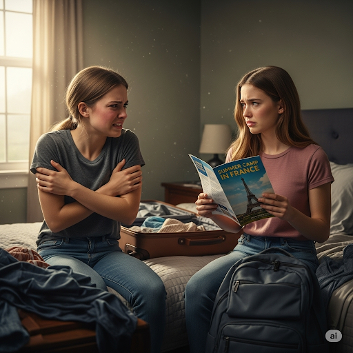

Two months later, Katie returned. Alice **dashed** to the airport to greet her sister. But when Alice saw Katie, she was **astounded**. Katie was now **bilingual**, and she looked completely different! She was wearing nice clothes, **cosmetics** and looked **skinnier**. Alice felt very messy next to her. She was just wearing a **fluorescent** t-shirt, and her hair had **knots** in it.

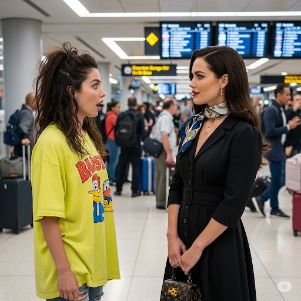

When Alice asked Katie about France, Katie was **vague** and didn’t say much. It made Alice **furious** and filled her with **disgust** because in the past they’d always told each other everything. Now there was a huge **gulf** between them. Over the weeks, the sisters spoke even less.

Two months later, it was the twins’ birthday. All their lives, they’d had a **ritual**. Before their birthday, they’d talk all night long. That night, Alice came into Katie’s bedroom.

“I’m sorry I haven’t spoken much lately,” Katie said.

“I understand. You have new friends now,” said Alice, angrily.

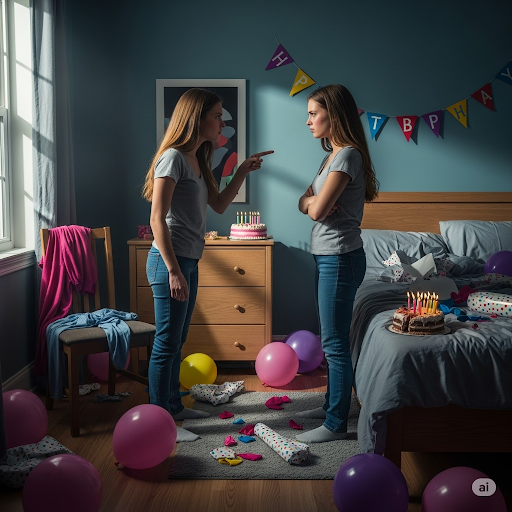

Katie said, “My French friends don’t write much nowadays. For a while, I thought they were more exciting than my friends at home. But I was wrong. You’re my sister, and you’ll always be my best friend.”

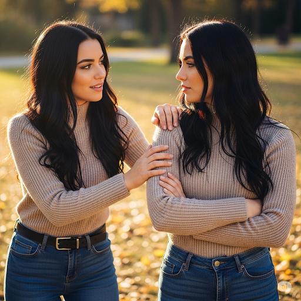

Alice said, “I’m sorry, too. I wanted our relationship to stay the same forever. But it’s totally **plausible** for twins to have different interests. We can still be best friends without being together all the time.”

## Sentences of story

The Twins

Katie and Alice were twins.

They were so alike that few people could tell the siblings apart.

They were almost like clones.

They even used the same colloquial language as each other.

They were best friends.

But the twins’ attributes were not all identical.

Alice liked humanities, and Katie was a good linguist.

One summer, Katie decided to be a participant at a summer camp in France.

Alice wasn’t interested in the French language, so she didn’t go.

But she felt angry that Katie wanted to spend the summer away from her.

Two months later, Katie returned.

Alice dashed to the airport to greet her sister.

But when Alice saw Katie, she was astounded.

Katie was now bilingual, and she looked completely different!

She was wearing nice clothes, cosmetics and looked skinnier.

Alice felt very messy next to her.

She was just wearing a fluorescent t-shirt, and her hair had knots in it.

When Alice asked Katie about France, Katie was vague and didn’t say much.

It made Alice furious and filled her with disgust because in the past they’d always told each other everything.

Now there was a huge gulf between them.

Over the weeks, the sisters spoke even less.

Two months later, it was the twins’ birthday.

All their lives, they’d had a ritual.

Before their birthday, they’d talk all night long.

That night, Alice came into Katie’s bedroom.

“I’m sorry I haven’t spoken much lately,” Katie said.

“I understand. You have new friends now,” said Alice, angrily.

Katie said, “My French friends don’t write much nowadays. For a while, I thought they were more exciting than my friends at home. But I was wrong. You’re my sister, and you’ll always be my best friend.”

Alice said, “I’m sorry, too. I wanted our relationship to stay the same forever. But it’s totally plausible for twins to have different interests. We can still be best friends without being together all the time.”

## List of word

astounded attribute bilingual clone colloquial cosmetics dash disgust fluorescent furious gulf humanities knot linguist participant plausible ritual sibling skinny vague

## 1. astounded
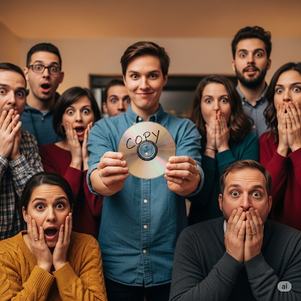
- IPA: /əˈstaʊndɪd/
- Class: adj.
- Câu truyện ẩn dụ: "Ơ-stao-địt". "Ơ", tớ "sao" chép được cái đĩa ("địt" - disc) này, mọi người đều kinh ngạc (astounded).
- Định nghĩa : Kinh ngạc, sửng sốt.
- English definition: Greatly surprised or amazed.
- Sentence of stroy: But when Alice saw Katie, she was **astounded**.
- Ví dụ thông dụng:
1. I was astounded to hear he had won the lottery.
2. She was astounded by his arrogance.

## 2. attribute

- IPA: /ˈætrɪbjuːt/
- Class: n.
- Câu truyện ẩn dụ: "Át-tri-bút". Cây "bút" này là "át" chủ bài, một thuộc tính (attribute) quan trọng của nhà văn.
- Định nghĩa : Thuộc tính, đặc tính.
- English definition: A quality or feature regarded as a characteristic or inherent part of someone or something.
- Sentence of stroy: But the twins’ **attributes** were not all identical.
- Ví dụ thông dụng:
1. Patience is one of his best attributes.
2. What attributes do you look for in a manager?

## 3. bilingual
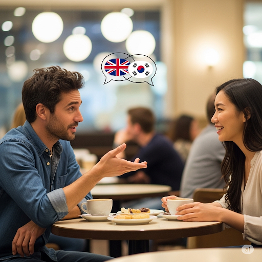
- IPA: /ˌbaɪˈlɪŋɡwəl/
- Class: adj.
- Câu truyện ẩn dụ: "Bai-lin-guồl". "Bai" (by - bằng) cách nói chuyện "lin"h hoạt với "guồl" (girl) nước ngoài, anh ấy chứng tỏ mình song ngữ (bilingual).
- Định nghĩa : Song ngữ, nói được hai thứ tiếng.
- English definition: Speaking two languages fluently.
- Sentence of stroy: Katie was now **bilingual**, and she looked completely different!
- Ví dụ thông dụng:
1. She is bilingual in English and French.
2. The company is looking for a bilingual secretary.

## 4. clone
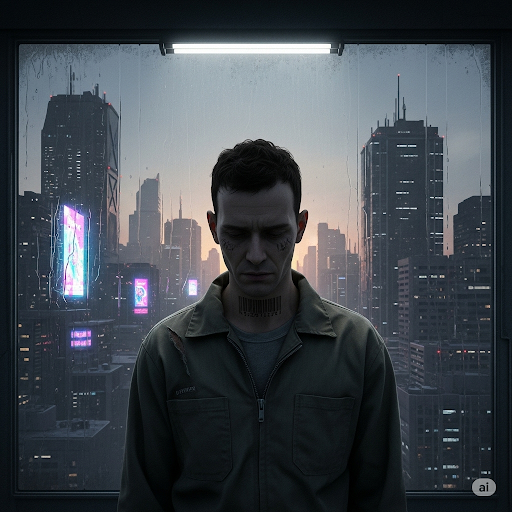
- IPA: /kloʊn/
- Class: n.
- Câu truyện ẩn dụ: "Cờ-lôn". "Cờ-lôn" nghe như "cô đơn", những bản sao (clone) thường sống rất cô đơn.
- Định nghĩa : Bản sao, nhân bản vô tính.
- English definition: A person or thing regarded as an exact copy of another.
- Sentence of stroy: They were almost like **clones**.
- Ví dụ thông dụng:
1. Dolly the sheep was the first clone of an adult mammal.
2. All the houses in the new development are clones of each other.

## 5. colloquial

- IPA: /kəˈloʊkwiəl/
- Class: adj.
- Câu truyện ẩn dụ: "Cơ-lâu-quy-ồ". "Cơ" hội nói chuyện "lâu" với người bản xứ sẽ giúp bạn học được nhiều từ ngữ thông tục (colloquial) "quy" giá "ồ" lên.
- Định nghĩa : Thông tục, dùng trong giao tiếp hàng ngày.
- English definition: (Of language) used in ordinary or familiar conversation; not formal or literary.
- Sentence of stroy: They even used the same **colloquial** language as each other.
- Ví dụ thông dụng:
1. "Gonna" is a colloquial form of "going to".
2. His speech was full of colloquialisms.

## 6. cosmetics

- IPA: /kɑːzˈmetɪks/
- Class: n.
- Câu truyện ẩn dụ: "Cót-mê-tích". Cô ấy "tích" cóp tiền để mua cả "cót" đồ mỹ phẩm (cosmetics) vì quá "mê".
- Định nghĩa : Mỹ phẩm.
- English definition: Substances or products used to enhance or alter the appearance of the face or body.
- Sentence of stroy: She was wearing nice clothes, **cosmetics** and looked skinnier.
- Ví dụ thông dụng:
1. She works on the cosmetics counter in a large department store.
2. The company sells a wide range of cosmetics and toiletries.

## 7. dash
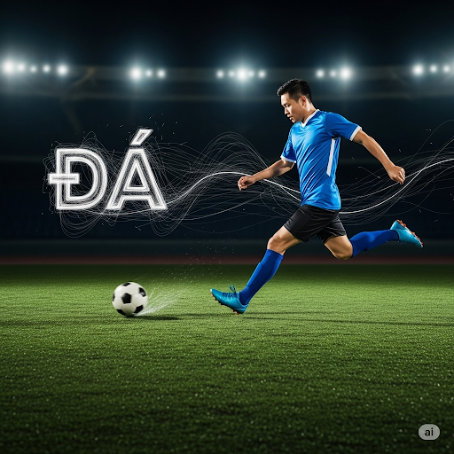
- IPA: /dæʃ/
- Class: v.
- Câu truyện ẩn dụ: Nghe như "đá". Anh ta "đá" quả bóng rồi lao (dash) nhanh về phía trước.
- Định nghĩa : Lao tới, xông tới.
- English definition: To run or travel somewhere in a great hurry.
- Sentence of stroy: Alice **dashed** to the airport to greet her sister.
- Ví dụ thông dụng:
1. I must dash, I'm late for my appointment.
2. He dashed across the road to avoid the car.

## 8. disgust
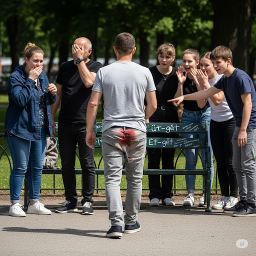
- IPA: /dɪsˈɡʌst/
- Class: n.
- Câu truyện ẩn dụ: "Đít-gớt". Cái "đít" quần bị rách, để lộ vết bẩn làm mọi người cảm thấy ghê tởm (disgust).
- Định nghĩa : Sự ghê tởm, sự phẫn nộ.
- English definition: A feeling of revulsion or strong disapproval aroused by something unpleasant or offensive.
- Sentence of stroy: It made Alice furious and filled her with **disgust** because in the past they’d always told each other everything.
- Ví dụ thông dụng:
1. She looked at him with disgust.
2. I felt a sense of disgust at his behaviour.

## 9. fluorescent

- IPA: /ˌflɔːˈresnt/
- Class: adj.
- Câu truyện ẩn dụ: "Phờ-lo-re-sần". "Phờ" phạc cả người vì phải đi dưới ánh đèn huỳnh quang (fluorescent) "sần" sùi trong "lo" sợ.
- Định nghĩa : Huỳnh quang, phát quang.
- English definition: (Of a substance) having or showing fluorescence; vividly colourful.
- Sentence of stroy: She was just wearing a **fluorescent** t-shirt, and her hair had knots in it.
- Ví dụ thông dụng:
1. The room was lit by a single fluorescent tube.
2. He wore a fluorescent yellow jacket to be visible to traffic.

## 10. furious

- IPA: /ˈfjʊriəs/
- Class: adj.
- Câu truyện ẩn dụ: Giống trong phim "Fast and Furious", toàn những tay lái giận dữ (furious).
- Định nghĩa : Giận dữ, điên tiết.
- English definition: Extremely angry.
- Sentence of stroy: It made Alice **furious** and filled her with disgust because in the past they’d always told each other everything.
- Ví dụ thông dụng:
1. My boss was furious with me for being late.
2. She was furious at the way she had been treated.

## 11. gulf

- IPA: /ɡʌlf/
- Class: n.
- Câu truyện ẩn dụ: Nghe như "gấp". Khoảng cách giữa họ trở nên "gấp" bội, tạo ra một hố sâu ngăn cách (gulf).
- Định nghĩa : Hố sâu ngăn cách, vịnh.
- English definition: A deep inlet of the sea almost surrounded by land, with a narrow mouth; a large gap or division between two people or groups.
- Sentence of stroy: Now there was a huge **gulf** between them.
- Ví dụ thông dụng:
1. The Gulf of Mexico is a large body of water.
2. There is a growing gulf between the rich and the poor.

## 12. humanities
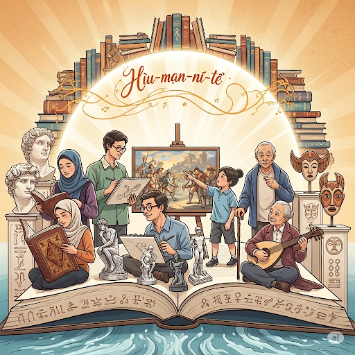
- IPA: /hjuːˈmænətiz/
- Class: n.
- Câu truyện ẩn dụ: "Hiu-man-ni-tì". "Hiu-man" (human - con người) cần học khoa học nhân văn (humanities) để hiểu về "ni"ềm tin và "tì"nh cảm của đồng loại.
- Định nghĩa : Khoa học nhân văn.
- English definition: Academic disciplines that study aspects of human society and culture.
- Sentence of stroy: Alice liked **humanities**, and Katie was a good linguist.
- Ví dụ thông dụng:
1. She has a degree in the humanities.
2. The humanities include subjects like history, literature, and philosophy.

## 13. knot
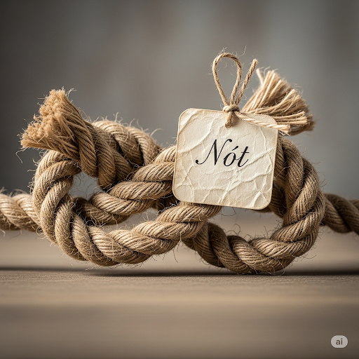
- IPA: /nɑːt/
- Class: n.
- Câu truyện ẩn dụ: Nghe như "nót". Lấy dây "nót" (note) lại bằng một nút thắt (knot).
- Định nghĩa : Nút thắt, chỗ rối.
- English definition: A fastening made by looping a piece of string, rope, or something similar on itself and tightening it.
- Sentence of stroy: ...and her hair had **knots** in it.
- Ví dụ thông dụng:
1. He tied a knot in the rope.
2. I can't get this knot out of my shoelace.

## 14. linguist

- IPA: /ˈlɪŋɡwɪst/
- Class: n.
- Câu truyện ẩn dụ: "Lin-guýt". Người "lin"h hoạt "uýt" sáo bằng nhiều thứ tiếng đích thị là một nhà ngôn ngữ học (linguist).
- Định nghĩa : Nhà ngôn ngữ học, người giỏi ngoại ngữ.
- English definition: A person skilled in foreign languages or a person who studies linguistics.
- Sentence of stroy: ...and Katie was a good **linguist**.
- Ví dụ thông dụng:
1. He is a brilliant linguist and can speak seven languages.
2. A linguist studies how language works.

## 15. participant
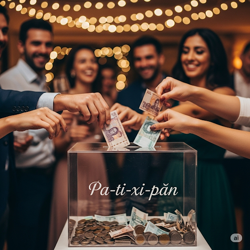
- IPA: /pɑːrˈtɪsɪpənt/
- Class: n.
- Câu truyện ẩn dụ: "Pa-ti-xi-pần". Đến "pa-ti" (party) thì phải "xì" tiền ra "pần" (phần) của mình, đó là trách nhiệm của người tham gia (participant).
- Định nghĩa : Người tham gia.
- English definition: A person who takes part in something.
- Sentence of stroy: Katie decided to be a **participant** at a summer camp in France.
- Ví dụ thông dụng:
1. All participants in the conference received a welcome pack.
2. He has been an active participant in the team's success.

## 16. plausible

- IPA: /ˈplɔːzəbl/
- Class: adj.
- Câu truyện ẩn dụ: "Plausible" nghe như "possible". Nếu một điều gì đó "plausible" thì nó nghe có vẻ "possible" (có thể xảy ra), tức là có vẻ hợp lý.
- Định nghĩa : Có vẻ hợp lý, đáng tin.
- English definition: (of an argument or statement) seeming reasonable or probable.
- Sentence of stroy: But it’s totally **plausible** for twins to have different interests.
- Ví dụ thông dụng:
1. Her story sounded plausible enough.
2. The police have a plausible theory about the crime.

## 17. ritual
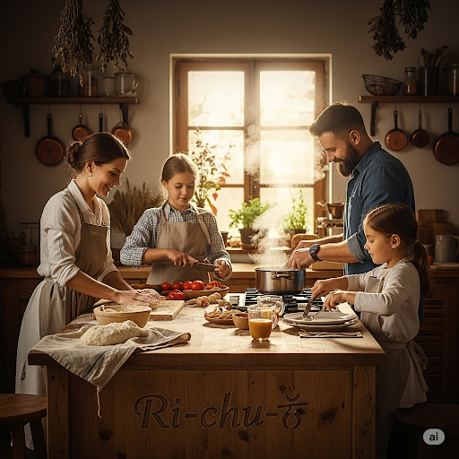
- IPA: /ˈrɪtʃuəl/
- Class: n.
- Câu truyện ẩn dụ: "Ri-chu-ồ". "Ri"êng trong nhà này, việc "chu"ẩn bị cho bữa tối là một nghi thức (ritual) quan trọng, "ồ" lên là biết ngay.
- Định nghĩa : Nghi lễ, nghi thức.
- English definition: A religious or solemn ceremony consisting of a series of actions performed according to a prescribed order.
- Sentence of stroy: All their lives, they’d had a **ritual**.
- Ví dụ thông dụng:
1. Sunday lunch with my grandparents is a family ritual.
2. The tribe has a special ritual for the start of the harvest season.

## 18. sibling

- IPA: /ˈsɪblɪŋ/
- Class: n.
- Câu truyện ẩn dụ: "Síp-lin". Anh chị em (sibling) trong nhà phải "ship" hàng "lin"h tinh phụ giúp nhau.
- Định nghĩa : Anh chị em ruột.
- English definition: Each of two or more children or offspring having one or both parents in common; a brother or sister.
- Sentence of stroy: They were so alike that few people could tell the **siblings** apart.
- Ví dụ thông dụng:
1. Do you have any siblings?
2. There was a lot of sibling rivalry between my brother and me.

## 19. skinny

- IPA: /ˈskɪni/
- Class: adj.
- Câu truyện ẩn dụ: "Sờ-kin-ni". "Sờ" vào "kin" (da - skin) của cô ấy thấy toàn xương vì cô ấy quá gầy (skinny).
- Định nghĩa : Gầy, mảnh khảnh.
- English definition: (of a person or part of their body) very thin.
- Sentence of stroy: She was wearing nice clothes, cosmetics and looked **skinnier**.
- Ví dụ thông dụng:
1. He was a skinny kid with big glasses.
2. I like to wear skinny jeans.

## 20. vague

- IPA: /veɪɡ/
- Class: adj.
- Câu truyện ẩn dụ: Nghe như "vây". Bị "vây" quanh bởi đám đông, câu trả lời của anh ta trở nên mơ hồ (vague).
- Định nghĩa : Mơ hồ, không rõ ràng.
- English definition: Of uncertain, indefinite, or unclear character or meaning.
- Sentence of stroy: When Alice asked Katie about France, Katie was **vague** and didn’t say much.
- Ví dụ thông dụng:
1. I have a vague memory of my first day at school.
2. The instructions he gave me were very vague.