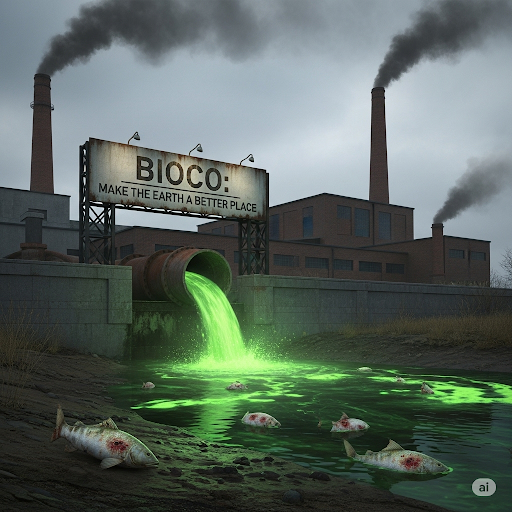
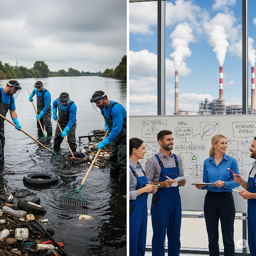
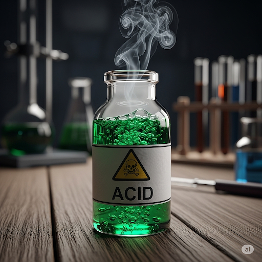
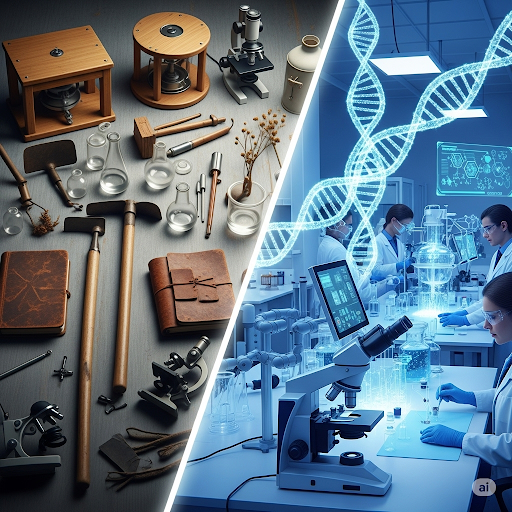
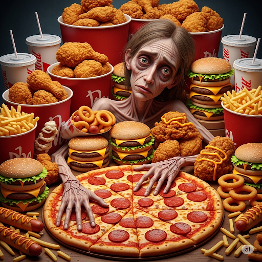
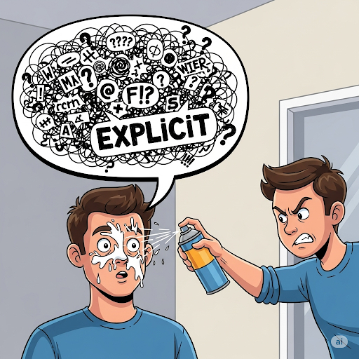
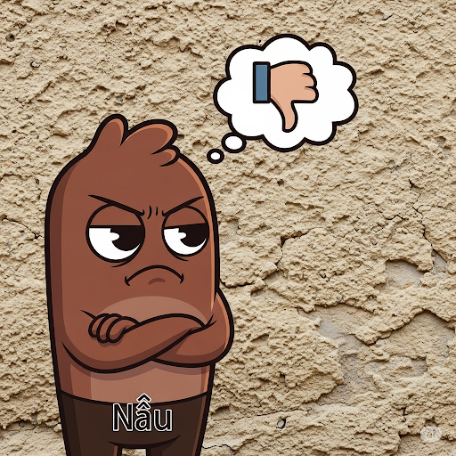

# The New Bioco

Jack got a new job at a **biotechnology** company called Bioco. Bioco **manufactured** drugs to treat **diabetes** and high **cholesterol**. Jack’s job was to use a tiny **mechanism** to get **nectar** from flowers. The nectar was a main ingredient in the drugs. Jack liked his job, and he thought that Bioco was a caring company. However, Jack soon learned that the company wasn’t as kind as he first thought.

Bioco’s motto was “Make the Earth a Better Place.” However, this motto was **deceptive**. The company actually did a number of really bad things to the environment. The company produced a lot of smog and harmful **acid**. Bioco poured the acid in a nearby river, which caused **erosion** and made fish **prone** to illness.

After a few weeks at the new job, Jack saw all the bad things Bioco was doing. He had always had strong **ethics**, and he knew he had to do something. One day, while the Bioco workers were eating in the cafeteria, Jack stood up and gave a speech. He said, “My fellow coworkers, I know you have all seen the evil things our company is doing. I have a **notion** that we can fix them if we form a **coalition**. We can go to the **administration** and tell them we’ll quit if they don’t **eliminate** the problems. They’ll have no choice but to listen to us.”

Jack explained what they were to do. His coworkers liked his **explicit** plan. They went to the **administrative** offices and demanded that Bioco stop damaging the environment, or they all would quit. One supervisor said to them, “Thank you for being **straightforward** about this issue. Since I can’t afford to lose all of you workers, I guess we’ll just have to fix things.”

Jack, his supervisor, and his coworkers spent the next month designing a new **framework** for the company. They cleaned up the acid from the river and **minimized** the amount of air pollution the company released. At last, the company motto became apt.

## Sentences of story

The New Bioco

Jack got a new job at a biotechnology company called Bioco.

Bioco manufactured drugs to treat diabetes and high cholesterol.

Jack’s job was to use a tiny mechanism to get nectar from flowers.

The nectar was a main ingredient in the drugs.

Jack liked his job, and he thought that Bioco was a caring company.

However, Jack soon learned that the company wasn’t as kind as he first thought.

Bioco’s motto was “Make the Earth a Better Place.”

However, this motto was deceptive.

The company actually did a number of really bad things to the environment.

The company produced a lot of smog and harmful acid.

Bioco poured the acid in a nearby river, which caused erosion and made fish prone to illness.

After a few weeks at the new job, Jack saw all the bad things Bioco was doing.

He had always had strong ethics, and he knew he had to do something.

One day, while the Bioco workers were eating in the cafeteria, Jack stood up and gave a speech.

He said, “My fellow coworkers, I know you have all seen the evil things our company is doing.

I have a notion that we can fix them if we form a coalition.

We can go to the administration and tell them we’ll quit if they don’t eliminate the problems.

They’ll have no choice but to listen to us.”

Jack explained what they were to do.

His coworkers liked his explicit plan.

They went to the administrative offices and demanded that Bioco stop damaging the environment, or they all would quit.

One supervisor said to them, “Thank you for being straightforward about this issue.

Since I can’t afford to lose all of you workers, I guess we’ll just have to fix things.”

Jack, his supervisor, and his coworkers spent the next month designing a new framework for the company.

They cleaned up the acid from the river and minimized the amount of air pollution the company released.

At last, the company motto became apt.

## List of word

acid administration administrative biotechnology cholesterol coalition deceptive diabetes eliminate erosion ethics explicit framework manufacture mechanism minimize nectar notion prone straightforward

## 1. acid

- IPA: /ˈæsɪd/
- Class: n.
- Câu truyện ẩn dụ: "A-xít". Nghe như "a-xít" trong tiếng Việt. A-xít là một loại chất hóa học có vị chua.
- Định nghĩa : Axit.
- English definition: A chemical substance that has a sour taste and can burn or dissolve other substances.
- Sentence of stroy: Bioco poured the **acid** in a nearby river, which caused erosion and made fish prone to illness.
- Ví dụ thông dụng:
1. Lemons contain citric acid.
2. Be careful not to spill the battery acid.

## 2. administration

- IPA: /ədˌmɪnɪˈstreɪʃn/
- Class: n.
- Câu truyện ẩn dụ: "Ớt-min-nít-trây-sần". "Ớt" cay "mìn" (mình) không ăn được, nhưng bộ máy "quản trị" (administration) lại "trây" (chây) ì, "sần" sùi không giải quyết.
- Định nghĩa : Sự quản lý, bộ máy quản trị.
- English definition: The process or activity of running a business, organization, etc.; the management of public affairs; government.
- Sentence of stroy: We can go to the **administration** and tell them we’ll quit if they don’t eliminate the problems.
- Ví dụ thông dụng:
1. The school administration has decided to cancel the event.
2. He works in the hospital administration.

## 3. administrative

- IPA: /ədˈmɪnɪstreɪtɪv/
- Class: adj.
- Câu truyện ẩn dụ: "Ớt-min-nít-trây-tịp". Công việc "hành chính" (administrative) này cần sự "tịp" (tệp) trung, không là bị sếp cho ăn "ớt" cay "mìn" không chịu nổi.
- Định nghĩa : Thuộc về hành chính, quản trị.
- English definition: Relating to the running of a business, organization, etc.
- Sentence of stroy: They went to the **administrative** offices and demanded that Bioco stop damaging the environment, or they all would quit.
- Ví dụ thông dụng:
1. She has an administrative job in the university.
2. The work is mainly administrative.

## 4. biotechnology

- IPA: /ˌbaɪoʊtekˈnɑːlədʒi/
- Class: n.
- Câu truyện ẩn dụ: "Bai-ô-tếch-no-lơ-gi". "Bai" (bye) với các phương pháp cũ, giờ là thời của "công nghệ sinh học" (biotechnology) rồi, "tếch" (tech) là "no-lơ-gi" (technology) mà.
- Định nghĩa : Công nghệ sinh học.
- English definition: The use of living cells, bacteria, etc., to make useful products.
- Sentence of stroy: Jack got a new job at a **biotechnology** company called Bioco.
- Ví dụ thông dụng:
1. Biotechnology is used to develop new medicines.
2. He is studying for a degree in biotechnology.

## 5. cholesterol

- IPA: /kəˈlestərɔːl/
- Class: n.
- Câu truyện ẩn dụ: "Cơ-lét-tơ-rồ". "Cơ" thể bị "lét" đi vì ăn quá nhiều "rồ" (đồ) ăn chứa cholesterol.
- Định nghĩa : Chất béo có trong máu, có thể gây bệnh tim nếu ở mức cao.
- English definition: A substance containing a lot of fat that is found in the body and in dairy products, and can cause heart disease if you have too much.
- Sentence of stroy: Bioco manufactured drugs to treat diabetes and high **cholesterol**.
- Ví dụ thông dụng:
1. You need to lower your cholesterol level.
2. Eggs are high in cholesterol.

## 6. coalition

- IPA: /ˌkoʊəˈlɪʃn/
- Class: n.
- Câu truyện ẩn dụ: "Cô-ơ-li-sần". "Cô" "ơ"i, chúng ta hãy "li"ên minh (coalition) lại, "sần" sùi gì cũng vượt qua.
- Định nghĩa : Sự liên minh, liên hiệp.
- English definition: A temporary alliance for combined action, especially of political parties forming a government.
- Sentence of stroy: I have a notion that we can fix them if we form a **coalition**.
- Ví dụ thông dụng:
1. The two parties formed a coalition to govern the country.
2. A coalition of environmental groups is working to protect the forest.

## 7. deceptive

- IPA: /dɪˈseptɪv/
- Class: adj.
- Câu truyện ẩn dụ: "Đi-xép-tịp". "Đi" với hắn phải cẩn thận, hắn hay dùng mánh khóe "xếp" đặt để "lừa dối" (deceptive) người khác, đúng là một "típ" (type) người không đáng tin.
- Định nghĩa : Dối trá, lừa dối, dễ gây nhầm lẫn.
- English definition: Giving an appearance or impression different from the true one; misleading.
- Sentence of stroy: However, this motto was **deceptive**.
- Ví dụ thông dụng:
1. Appearances can be deceptive.
2. The advertisement was deceptive and misleading.

## 8. diabetes

- IPA: /ˌdaɪəˈbiːtiːz/
- Class: n.
- Câu truyện ẩn dụ: "Đai-ơ-bi-tít". Bị bệnh "tiểu đường" (diabetes) phải "đai" (die - chết) từ từ vì kiêng khem "tít" mù.
- Định nghĩa : Bệnh tiểu đường.
- English definition: A disease in which the body cannot control the level of sugar in the blood.
- Sentence of stroy: Bioco manufactured drugs to treat **diabetes** and high cholesterol.
- Ví dụ thông dụng:
1. My grandfather has diabetes.
2. People with diabetes need to control their diet carefully.

## 9. eliminate

- IPA: /ɪˈlɪmɪneɪt/
- Class: v.
- Câu truyện ẩn dụ: "I-lim-mi-nết". "Y"êu cầu "lim" (ghim) lại các "nết" xấu để "loại bỏ" (eliminate) chúng đi.
- Định nghĩa : Loại bỏ, trừ khử.
- English definition: To completely remove or get rid of (something).
- Sentence of stroy: ...tell them we’ll quit if they don’t **eliminate** the problems.
- Ví dụ thông dụng:
1. We must eliminate the possibility of error.
2. The company plans to eliminate 50 jobs.

## 10. erosion

- IPA: /ɪˈroʊʒn/
- Class: n.
- Câu truyện ẩn dụ: "I-râu- dần". "Y" như rằng, mảnh đất này "dần" "dần" bị "sự xói mòn" (erosion) làm cho biến mất.
- Định nghĩa : Sự xói mòn.
- English definition: The process of eroding or being eroded by wind, water, or other natural agents.
- Sentence of stroy: Bioco poured the acid in a nearby river, which caused **erosion** and made fish prone to illness.
- Ví dụ thông dụng:
1. Soil erosion is a major problem in this area.
2. The coastline is suffering from severe erosion.

## 11. ethics

- IPA: /ˈeθɪks/
- Class: n.
- Câu truyện ẩn dụ: "E-thích". "Em" "thích" những người sống có "đạo đức" (ethics).
- Định nghĩa : Đạo đức, luân thường đạo lý.
- English definition: Moral principles that govern a person's behaviour or the conducting of an activity.
- Sentence of stroy: He had always had strong **ethics**, and he knew he had to do something.
- Ví dụ thông dụng:
1. Medical ethics prevent doctors from revealing patient information.
2. The company needs to improve its business ethics.

## 12. explicit

- IPA: /ɪkˈsplɪsɪt/
- Class: adj.
- Câu truyện ẩn dụ: "Ích-pli-xịt". "Ích" lợi của việc nói "rõ ràng" (explicit) là không bị người khác "xịt" keo vào mặt vì hiểu nhầm. "Pli"z (please) hãy nói rõ ràng.
- Định nghĩa : Rõ ràng, dứt khoát.
- English definition: Stated clearly and in detail, leaving no room for confusion or doubt.
- Sentence of stroy: His coworkers liked his **explicit** plan.
- Ví dụ thông dụng:
1. I gave him explicit instructions not to touch anything.
2. The contract must be explicit about the terms of payment.

## 13. framework

- IPA: /ˈfreɪmwɜːrk/
- Class: n.
- Câu truyện ẩn dụ: "Ph-rêm-uốc". Cái "khung" (frame) ảnh này là "uốc" (work - tác phẩm) nghệ thuật, nó tạo thành một "khuôn khổ" (framework) đẹp.
- Định nghĩa : Khuôn khổ, sườn, cơ cấu.
- English definition: A basic structure underlying a system, concept, or text.
- Sentence of stroy: Jack, his supervisor, and his coworkers spent the next month designing a new **framework** for the company.
- Ví dụ thông dụng:
1. We need to establish a legal framework for the new system.
2. The book provides a framework for understanding modern politics.

## 14. manufacture

- IPA: /ˌmænjuˈfæktʃər/
- Class: v.
- Câu truyện ẩn dụ: "Me-niu-phếch-chờ". "Me" (mẹ) dặn phải chờ, không được mua hàng "phếch" (fake), chỉ mua hàng do các công ty lớn "sản xuất" (manufacture) thôi.
- Định nghĩa : Sản xuất, chế tạo.
- English definition: To make (something) on a large scale using machinery.
- Sentence of stroy: Bioco **manufactured** drugs to treat diabetes and high cholesterol.
- Ví dụ thông dụng:
1. This company manufactures cars.
2. The toys are manufactured in China.

## 15. mechanism

- IPA: /ˈmekənɪzəm/
- Class: n.
- Câu truyện ẩn dụ: "Mếch-cơ-ni-dầm". "Mếch" lòng với cái "cơ cấu" (mechanism) này quá, nó cứ kêu "cà dầm cà dầm".
- Định nghĩa : Cơ cấu, cơ chế, bộ máy.
- English definition: A system of parts working together in a machine; a piece of machinery.
- Sentence of stroy: Jack’s job was to use a tiny **mechanism** to get nectar from flowers.
- Ví dụ thông dụng:
1. The camera's focusing mechanism is broken.
2. We need a mechanism for resolving disputes.

## 16. minimize

- IPA: /ˈmɪnɪmaɪz/
- Class: v.
- Câu truyện ẩn dụ: "Mi-ni-mai-z". Để "giảm thiểu" (minimize) chi phí, hãy mua đồ "mini" (nhỏ) thôi, để "mai" (ngày mai) còn có cái mà "xài" (z).
- Định nghĩa : Giảm thiểu, giảm đến mức tối thiểu.
- English definition: To reduce (something, especially something undesirable) to the smallest possible amount or degree.
- Sentence of stroy: They ... **minimized** the amount of air pollution the company released.
- Ví dụ thông dụng:
1. We must minimize the risk of infection.
2. The goal is to minimize costs and maximize profits.

## 17. nectar

- IPA: /ˈnektər/
- Class: n.
- Câu truyện ẩn dụ: "Nếch-tơ". "Nếch" nhác không chịu làm việc, chỉ thích uống "mật hoa" (nectar), lười như con "tơ" (bướm).
- Định nghĩa : Mật hoa.
- English definition: A sugary fluid secreted by plants, especially within flowers to encourage pollination by insects and other animals.
- Sentence of stroy: The **nectar** was a main ingredient in the drugs.
- Ví dụ thông dụng:
1. Bees collect nectar from flowers to make honey.
2. The hummingbird drank nectar from the feeder.

## 18. notion

- IPA: /ˈnoʊʃn/
- Class: n.
- Câu truyện ẩn dụ: "Nâu-sần". "Nâu" có "ý niệm" (notion) rằng màu "sần" sùi này không đẹp.
- Định nghĩa : Ý niệm, khái niệm, quan điểm.
- English definition: A conception of or belief about something.
- Sentence of stroy: I have a **notion** that we can fix them if we form a coalition.
- Ví dụ thông dụng:
1. He has some strange notions about women.
2. I had a vague notion of what she was talking about.

## 19. prone

- IPA: /proʊn/
- Class: adj.
- Câu truyện ẩn dụ: "P-rôn". Những người chơi "game pro" thường "dễ" (prone) bị mỏi mắt.
- Định nghĩa : Dễ bị, có khuynh hướng bị.
- English definition: Likely or liable to suffer from, do, or experience something, typically something regrettable or unwelcome.
- Sentence of stroy: ...and made fish **prone** to illness.
- Ví dụ thông dụng:
1. He is prone to getting colds.
2. This area is prone to flooding.

## 20. straightforward

- IPA: /ˌstreɪtˈfɔːrwərd/
- Class: adj.
- Câu truyện ẩn dụ: "S-trết-pho-uốt". Hãy đi "thẳng" (straight) về "phía trước" (forward), đó là cách "thẳng thắn" (straightforward) nhất.
- Định nghĩa : Thẳng thắn, rõ ràng, không phức tạp.
- English definition: Uncomplicated and easy to do or understand; honest and frank.
- Sentence of stroy: Thank you for being **straightforward** about this issue.
- Ví dụ thông dụng:
1. The instructions are quite straightforward.
2. She is very straightforward and always says what she thinks.
