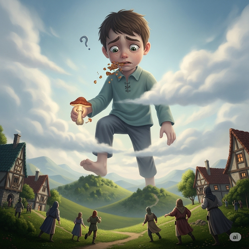
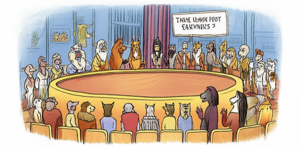

# How Comet Got His Tail

A **solitary** rock **roamed** through the cold **gloom** of outer space. It slowly drifted through the **debris** of broken asteroids with a feeling of sadness. In the vast and beautiful **galaxy**, it was only a tiny rock. It felt like an insignificant **atom**.

In its journeys it encountered many amazing objects. It flew by beautiful **crescent** moons that were covered with **craters** and moon dust.

“Why can’t I be as beautiful as them?” it thought.

The rock passed a **gigantic** planet. The **sphere** had a **circumference** hundreds of times larger than the **breadth** of the small rock.

“Why can’t I be as large as that?” it wondered.

The rock was filled with **despair**. It was surrounded by beauty and greatness, yet it was just a small and ugly **fragment** of rock.

One day, it approached the area of an **astronomical** star.

“What’s wrong?” the star asked.

“Oh, I wish I had a higher **status** in the galaxy. All the other objects are so beautiful and large,” the rock replied. “But I’m just an ugly rock.”

The star considered the problem. At last it said, “You don’t have to worry anymore. I think I can help.” The star **radiated** its light brighter and hotter than it had ever done before. “Come a little closer,” the star said to the rock.

The rock drifted closer to the star. Suddenly, the ice that was **embedded** in the rock’s tiny cracks melted and became steam. Then the steam extended behind the **comet** to form a brilliant tail. The tail shined with all the colors of the **spectrum**.

The little rock had become a beautiful comet. It looked so amazing. It realized that the star helped it change its appearance. “Thank you,” the comet said and then flew away with its new beautiful tail following behind it like a galactic cape.

## Sentences of story

How Comet Got His Tail

A solitary rock roamed through the cold gloom of outer space.

It slowly drifted through the debris of broken asteroids with a feeling of sadness.

In the vast and beautiful galaxy, it was only a tiny rock.

It felt like an insignificant atom.

In its journeys it encountered many amazing objects.

It flew by beautiful crescent moons that were covered with craters and moon dust.

“Why can’t I be as beautiful as them?” it thought.

The rock passed a gigantic planet.

The sphere had a circumference hundreds of times larger than the breadth of the small rock.

“Why can’t I be as large as that?” it wondered.

The rock was filled with despair.

It was surrounded by beauty and greatness, yet it was just a small and ugly fragment of rock.

One day, it approached the area of an astronomical star.

“What’s wrong?” the star asked.

“Oh, I wish I had a higher status in the galaxy.

All the other objects are so beautiful and large,” the rock replied.

“But I’m just an ugly rock.”

The star considered the problem.

At last it said, “You don’t have to worry anymore. I think I can help.”

The star radiated its light brighter and hotter than it had ever done before.

“Come a little closer,” the star said to the rock.

The rock drifted closer to the star.

Suddenly, the ice that was embedded in the rock’s tiny cracks melted and became steam.

Then the steam extended behind the comet to form a brilliant tail.

The tail shined with all the colors of the spectrum.

The little rock had become a beautiful comet.

It looked so amazing.

It realized that the star helped it change its appearance.

“Thank you,” the comet said and then flew away with its new beautiful tail following behind it like a galactic cape.

## List of word

astronomical atom breadth circumference comet crater crescent debris despair embed fragment galaxy gigantic gloom radiate roam solitary spectrum sphere status

## 1. astronomical

### IPA: /ˌæstrəˈnɑːmɪkl/
### Class: adj.
### Câu truyện ẩn dụ: 
<!-- câu truyện khoảng 200 từ -->

Ngày xửa ngày xưa, có một ngôi làng nhỏ nằm dưới chân một ngọn núi cao chót vót. Ngôi làng này có một cậu bé tên là Astron, rất tò mò về bầu trời đêm. Cậu thường kể với bạn bè rằng: "Mình sẽ chờ đợi, nó sẽ đến, rồi mình sẽ mim cười thật tươi, vì mình đã khám phá ra những bí mật của các vì sao!"

Cứ mỗi đêm, Astron lại trèo lên ngọn đồi gần nhà, kiên nhẫn chờ đợi. Cậu tin rằng bầu trời sẽ nói cho cậu biết những điều kỳ diệu. Một đêm nọ, cậu thấy một ngôi sao chổi khổng lồ, sáng rực, lướt qua bầu trời. Cảnh tượng này quá lộng lẫy và vĩ đại, khiến cậu phải thốt lên: "Ôi, minh nhìn thấy một thứ thật khổng lồ, thật phi thường, giống như bầu trời vậy!"

Từ đó, mỗi khi nhìn thấy một điều gì đó to lớn, vĩ đại đến mức không thể tưởng tượng nổi, mọi người trong làng lại nhớ đến câu chuyện của cậu bé Astron và gọi đó là "điều át chờ nó mi cô".

### Định nghĩa : 
<!-- Định nghĩa thông dụng -->
 Chỉ một con số, số lượng hoặc quy mô cực kỳ lớn, lớn đến mức khó tin hoặc không tưởng

### English definition: 

Relating to astronomy; (of an amount) extremely large.

### Sentence of stroy:

 One day, it approached the area of an **astronomical** star.

### Ví dụ thông dụng:

1. He is an expert in astronomical research.
2. The cost of the project was astronomical.

## 2. atom

### IPA: /ˈætəm/
### Class: n.
### Câu truyện ẩn dụ:
Dưới đáy đại dương sâu thẳm, có một chú tôm rất thông thái tên là Tôm. Vì lớn tuổi và uyên bác, mọi người đều kính trọng gọi chú là "Anh Tôm". Anh Tôm không thích những thứ to lớn như cá voi hay rạn san hô khổng lồ. Thay vào đó, chú bị mê hoặc bởi những thứ nhỏ bé nhất.

Anh Tôm dành cả đời mình để nghiên cứu xem mọi vật được tạo thành từ cái gì. Chú nói với các sinh vật biển khác: "Mọi thứ, từ vỏ sò đến dòng nước, đều được cấu tạo từ những hạt vô cùng nhỏ, không thể nhìn thấy bằng mắt thường." Mọi người thấy thật khó tin. "Làm sao có thể chứ, Anh Tôm?"

Để chứng minh, Anh Tôm đã chế tạo một chiếc kính hiển vi từ một giọt nước trong suốt. Qua đó, chú chỉ cho mọi người thấy những hạt li ti đang chuyển động. "Đó," chú nói, "là những phần tử nhỏ nhất." Từ đó, để chỉ một vật gì đó cực kỳ nhỏ bé, các sinh vật biển lại gọi nó là "cái của Anh Tôm", đọc nhanh nghe như "atom".

### Định nghĩa :
Một phần cực kỳ nhỏ của một vật; phần tử nhỏ nhất của một nguyên tố hóa học.

### English definition:
The smallest particle of a chemical element that can exist; an extremely small amount of a thing.

### Sentence of stroy:
It felt like an insignificant atom.

### Ví dụ thông dụng:
1. A molecule of water is made up of two hydrogen atoms and one oxygen atom.
2. There isn't an atom of truth in what he said.

## 3. breadth

### IPA: /bredθ/
### Class: n.
### Câu truyện ẩn dụ:
Trong một vương quốc nọ, có một người thợ may nổi tiếng có thể may ra những chiếc áo choàng ấm áp nhất. Mùa đông năm đó lạnh giá bất thường, và nhà vua muốn có một chiếc áo choàng thật rộng để giữ ấm.

Người thợ may đo đạc rất cẩn thận. Ông nói với người phụ tá: "Để chiếc áo này có thể xua tan cái lạnh, bề ngang của nó phải đủ rộng để 'bỏ' đi cái 'rét'. Ta cần đo chính xác độ rộng này."

Người phụ tá tò mò hỏi: "Thưa thầy, 'bỏ rét' là sao ạ?"

Người thợ may mỉm cười giải thích: "Tức là chiều rộng, bề ngang của tấm vải. Chiều rộng càng lớn, nó càng che phủ được nhiều hơn, giữ ấm tốt hơn, giúp ta 'bỏ' đi cái 'rét' của mùa đông."

Từ đó, người phụ tá luôn nhớ rằng khi nói đến chiều rộng hay bề ngang của một vật, anh lại nhớ đến câu nói của thầy mình, "bỏ rét," nghe rất giống từ "breadth".

### Định nghĩa :
Khoảng cách hoặc số đo từ bên này sang bên kia của một vật; chiều rộng.

### English definition:
The distance or measurement from side to side of something; width.

### Sentence of stroy:
The sphere had a circumference hundreds of times larger than the breadth of the small rock.

### Ví dụ thông dụng:
1. The breadth of the river was impressive.
2. She has a great breadth of knowledge on the subject.

## 4. circumference

### IPA: /sərˈkʌmfərəns/
### Class: n.
### Câu truyện ẩn dụ:
Tại một hội làng nọ, người ta tổ chức cuộc thi nấu nồi cơm lớn nhất thế giới. Đầu bếp trưởng, ông Ba Phi, đã nấu một nồi cơm khổng lồ, hình tròn. Để biết xem có phá kỷ lục không, ban tổ chức cần đo chu vi của nồi cơm.

Họ cử một cậu bé lanh lợi ra đo. Cậu bé bắt đầu đi vòng quanh miệng nồi. Đi được nửa đường, cậu đã thấm mệt. Cậu lẩm bẩm: "Sơ sơ cái nồi cơm này mà đi một vòng đã thấy phờ râu."

Một người trong ban tổ chức nghe thấy và hỏi: "Cậu nói gì vậy?"

Cậu bé đáp: "Dạ, cháu nói 'sơ cơm phờ râu ạ' (sơ-cơm-phơ-rừn-s)! Chu vi của nó lớn quá, đi một vòng quanh thôi mà mệt phờ cả người."

Mọi người bật cười vì câu nói dí dỏm của cậu bé. Kể từ đó, mỗi khi cần đo đường tròn bao quanh một vật gì, họ lại nói đùa với nhau: "Cẩn thận kẻo 'sơ cơm phờ râu' đấy nhé!" Và từ "circumference" trở nên dễ nhớ hơn bao giờ hết.

### Định nghĩa :
Đường thẳng bao quanh một vật hoặc không gian hình tròn; chu vi.

### English definition:
The distance around a circle, or a round body or area.

### Sentence of stroy:
The sphere had a circumference hundreds of times larger than the breadth of the small rock.

### Ví dụ thông dụng:
1. The circumference of the Earth is about 40,000 kilometers.
2. He measured the circumference of the tree trunk.

## 5. comet

### IPA: /ˈkɑːmɪt/
### Class: n.
### Câu truyện ẩn dụ:
Ở một ngôi làng trên trời, có một cô tiên nữ tên là Mết rất xinh đẹp nhưng lại hay buồn. Một ngày nọ, cô quyết định rời khỏi ngôi làng để đi tìm niềm vui. Cô bay vút qua bầu trời đêm, và vì bay quá nhanh, mái tóc dài óng ả của cô phát sáng, tạo thành một cái đuôi rực rỡ phía sau.

Các thiên thần và vị thần khác trên trời nhìn thấy một vệt sáng lạ lướt qua. Họ ngạc nhiên hỏi nhau: "Cái gì kia?"

Một vị thần già tinh tường nhìn kỹ và nhận ra cô tiên nữ. Ông nói: "À, là Cô Mết đấy. Cô ấy đang bay đi đâu đó."

Cái tên "Cô Mết" được truyền đi khắp nơi. Mỗi khi vật thể có cái đuôi sáng rực đó xuất hiện trên bầu trời, mọi người lại gọi nó là "Cô Mết". Dần dần, cách gọi này được đọc trại đi thành "comet", dùng để chỉ những ngôi sao chổi có cái đuôi phát sáng tuyệt đẹp.

### Định nghĩa :
Một thiên thể gồm băng và bụi, khi đến gần mặt trời, sẽ hình thành một "cái đuôi" phát sáng.

### English definition:
An object in outer space made of ice and dust that develops a long, bright tail when it passes near the sun.

### Sentence of stroy:
Then the steam extended behind the comet to form a brilliant tail.

### Ví dụ thông dụng:
1. Halley's Comet is visible from Earth every 76 years.
2. We used a telescope to watch the comet pass across the night sky.

## 6. crater

### IPA: /ˈkreɪtər/
### Class: n.
### Câu truyện ẩn dụ:
Ngày xưa, có một người khổng lồ hay đi du ngoạn khắp nơi. Một hôm, ông đi qua một vùng đất mềm và vô tình làm rơi chiếc "cây tơ" quý giá của mình. Chiếc cây này rất nặng, nó cắm thẳng xuống đất rồi biến mất.

Khi người khổng lồ nhấc chiếc "cây tơ" lên, mặt đất tại đó đã bị lún xuống, tạo thành một cái hố rất lớn và sâu, hình tròn giống như cái bát. Người dân địa phương kéo đến xem, họ chưa bao giờ thấy cái hố nào to như vậy.

Họ hỏi nhau: "Cái gì đã tạo ra cái hố này?"

Một cậu bé nhìn thấy dấu vết còn lại, liền la lên: "Là do chiếc 'cây tơ' của người khổng lồ!"

Từ đó, để gọi những cái hố lớn, tròn và sâu trên mặt đất hay trên mặt trăng, người ta dùng từ "crater", nghe gần giống như "cây tơ", để nhớ về sự tích cái hố do cây tơ của người khổng lồ tạo ra.

### Định nghĩa :
Một cái hố lớn hình tròn trên mặt đất hoặc trên bề mặt của một hành tinh hoặc mặt trăng, gây ra bởi một vụ nổ hoặc do một vật lớn va vào.

### English definition:
A large round hole in the ground or in the surface of a planet or moon, that is caused by something hitting it or by an explosion.

### Sentence of stroy:
It flew by beautiful crescent moons that were covered with craters and moon dust.

### Ví dụ thông dụng:
1. The astronauts explored the large crater on the Moon.
2. The volcano's crater was filled with smoke.

## 7. crescent

### IPA: /ˈkresnt/
### Class: n.
### Câu truyện ẩn dụ:
Có một nghệ nhân làm bánh nổi tiếng tên là Rét-sừn. Ông nổi tiếng với món bánh hình trăng khuyết độc đáo. Một hôm, có vị khách hỏi ông: "Thưa ông Rét-sừn, vì sao ông lại thích làm bánh có hình dáng cong cong, khuyết khuyết như thế này?"

Ông Rét-sừn mỉm cười, chỉ tay lên bầu trời đêm, nơi có vầng trăng non đang tỏa sáng. Ông nói: "Vì ta yêu vẻ đẹp của vầng trăng non. Hình dáng cong của nó thật thanh tao. Ta muốn đưa vẻ đẹp ấy vào những chiếc bánh của mình."

Vị khách trầm trồ: "Vậy ra đây là bánh 'Rét-sừn'."

Từ đó, tiệm bánh của ông trở nên nổi tiếng với món bánh "Rét-sừn". Và mỗi khi người ta nhìn thấy một vật gì có hình cong như trăng non đầu tháng, họ lại nhớ đến những chiếc bánh ấy và gọi nó là "crescent", một cái tên nghe tựa như tên của người nghệ nhân tài hoa.

### Định nghĩa :
Hình cong có hai đầu nhọn, giống như mặt trăng ở tuần đầu tiên hoặc tuần cuối cùng.

### English definition:
A curved shape that is wide in the middle and pointed at each end, like the moon in its first or last quarter.

### Sentence of stroy:
It flew by beautiful crescent moons that were covered with craters and moon dust.

### Ví dụ thông dụng:
1. The crescent moon shone brightly in the sky.
2. She wore a beautiful crescent-shaped necklace.

## 8. debris

### IPA: /dəˈbriː/
### Class: n.
### Câu truyện ẩn dụ:
Ngày xưa, có một cơn bão lớn quét qua một ngôi làng. Sau khi bão tan, khắp nơi chỉ còn lại là một mớ hỗn độn. Nhà cửa đổ nát, cây cối gãy đổ, đồ đạc văng tứ tung.

Một họa sĩ đi ngang qua, ông muốn vẽ lại cảnh tượng này. Ông nhìn thấy những mảnh vỡ, vụn vặt khắp nơi và cảm thấy thật bi thương. Ông lẩm bẩm một mình: "Đời người thật buồn...". Một đứa trẻ gần đó nghe không rõ, tưởng ông nói "đờ-bu-ri".

Đứa trẻ chạy về kể với mẹ: "Mẹ ơi, ông họa sĩ gọi đống đổ nát này là 'đờ-bu-ri' ạ."

Người mẹ nghe vậy cũng gọi theo. Dần dần, cả làng dùng từ "đờ-bu-ri" để chỉ những mảnh vỡ, rác rưởi còn sót lại sau một sự phá hủy nào đó. Cái tên này, đọc gần giống với "debris", đã trở thành một cách để nhớ về những tàn tích, mảnh vụn sau một thảm họa.

### Định nghĩa :
Những mảnh vụn của một thứ gì đó đã bị phá hủy hoặc vỡ ra.

### English definition:
Pieces of something that has been destroyed or broken.

### Sentence of stroy:
It slowly drifted through the debris of broken asteroids with a feeling of sadness.

### Ví dụ thông dụng:
1. After the earthquake, the streets were covered with debris.
2. He cleared the debris from the garden.

## 9. despair

### IPA: /dɪˈsper/
### Class: n.
### Câu truyện ẩn dụ:
Có một chàng sinh viên tên Hải. Cậu vừa nhận được kết quả thi trượt một môn rất quan trọng. Cảm thấy vô cùng chán nản và mất hết hy vọng, Hải quyết định đi lang thang cho khuây khỏa.

Cậu đi ngang qua một tiệm spa sang trọng, trên biển hiệu có dòng chữ "Đi Spa Êm ái". Đọc đến đó, Hải bật cười chua chát. Cậu nghĩ: "Mình đang tuyệt vọng thế này, có 'đi spa' thì cũng thế thôi. Nỗi thất vọng này không thể chữa được."

Cậu cứ lẩm bẩm trong miệng cụm từ "đi spa" như một lời tự giễu cho tình trạng của mình. Bạn của Hải đi tìm và thấy cậu đang ngồi thẫn thờ. Người bạn hỏi: "Cậu sao vậy?"

Hải trả lời: "Tớ đang 'đi-spa' đây."

Người bạn không hiểu, nhưng sau khi nghe Hải giải thích, anh nhận ra "đi-spa" là cách nói của Hải về sự tuyệt vọng, một cảm giác không còn chút hy vọng nào. Từ đó, "despair" được liên tưởng đến câu chuyện "đi spa" trong lúc tuyệt vọng của Hải.

### Định nghĩa :
Cảm giác không còn hy vọng; sự tuyệt vọng.

### English definition:
The feeling of having no hope.

### Sentence of stroy:
The rock was filled with despair.

### Ví dụ thông dụng:
1. He fell into a state of deep despair after losing his job.
2. In despair, she called her friends for help.

## 10. embed

### IPA: /ɪmˈbed/
### Class: v.
### Câu truyện ẩn dụ:
Có một người thợ kim hoàn đang dạy nghề cho cậu con trai. Hôm đó, ông giao cho cậu một nhiệm vụ khó: gắn một viên kim cương nhỏ vào chiếc nhẫn vàng.

Cậu con trai loay hoay mãi không làm được, viên đá cứ rơi ra. Người cha đến bên, cầm lấy dụng cụ và nói một cách nghiêm khắc nhưng đầy kinh nghiệm: "Con nhìn đây. Phải giữ cho thật chắc. Sau đó, 'im' lặng, tập trung và 'bét' nó vào. Phải dùng lực vừa đủ để nó dính chặt, gắn sâu vào trong mà không làm hỏng."

Ông làm mẫu, và viên kim cương nằm gọn gàng, chắc chắn bên trong chiếc nhẫn. Cậu con trai reo lên: "A, 'im-bét' ạ! Con hiểu rồi!"

Cậu nhớ mãi lời dặn "im và bét nó vào" của cha. Từ đó, mỗi khi cần phải gắn chặt một vật vào sâu bên trong một vật khác, cậu lại nhớ đến từ "embed", nghe như lời dặn quý báu của người cha năm xưa.

### Định nghĩa :
Gắn một vật gì đó vào sâu và chắc chắn bên trong một vật khác.

### English definition:
To fix something firmly and deeply in a surrounding mass.

### Sentence of stroy:
Suddenly, the ice that was embedded in the rock’s tiny cracks melted and became steam.

### Ví dụ thông dụng:
1. A piece of glass was embedded in her hand.
2. The journalist was embedded with the troops during the war.

## 11. fragment

### IPA: /ˈfræɡmənt/
### Class: n.
### Câu truyện ẩn dụ:
Trong một khu rừng nọ, có một vị thần cây già tên là Mừn. Thần cây này có một tấm gương thần, có thể phản chiếu mọi sự thật trong khu rừng. Một ngày kia, một cơn gió mạnh thổi qua, làm tấm gương rơi xuống và vỡ tan thành trăm mảnh.

Mỗi mảnh vỡ, dù nhỏ, vẫn phản chiếu một phần của khu rừng. Một con sóc nhặt được một mảnh, thấy trong đó có hình ảnh của chính nó. Nó reo lên: "Ồ, rác của Mừn!" Nó nghĩ rằng những mảnh vỡ này là rác của thần Mừn.

Câu chuyện "rác của Mừn" lan truyền khắp khu rừng. Các con vật khác cũng đi tìm "rác của Mừn" và mỗi con lại thấy một hình ảnh khác nhau trong đó. Dần dần, người ta đọc trại từ "rác Mừn" thành "phờ-rác-mừn" (fragment) để chỉ những mảnh vỡ nhỏ của một vật lớn.

### Định nghĩa :
Một mảnh nhỏ, không hoàn chỉnh bị vỡ ra từ một vật lớn hơn.

### English definition:
A small, incomplete part that has broken off a larger object.

### Sentence of stroy:
It was surrounded by beauty and greatness, yet it was just a small and ugly fragment of rock.

### Ví dụ thông dụng:
1. Police found fragments of glass near the scene.
2. I could only remember a few fragments of the dream.

## 12. galaxy

### IPA: /ˈɡæləksi/
### Class: n.
### Câu truyện ẩn dụ:
Ngày xửa ngày xưa, vũ trụ chỉ là một khoảng không đen tối. Ngọc Hoàng muốn tạo ra một thứ gì đó thật đẹp để trang trí cho bầu trời đêm. Ngài bèn gọi các nàng tiên lại và ban cho mỗi người một chiếc giỏ đầy sao.

Ngài ra lệnh: "Các con hãy bay đi khắp nơi và 'gảy lạc-xi' những ngôi sao này ra. Hãy gảy chúng một cách ngẫu nhiên nhưng phải tạo thành những dải sáng lấp lánh."

Các nàng tiên vâng lời, bay đi khắp nơi và dùng ngón tay "gảy" những ngôi sao "lạc xi" (rơi lung tung) ra khỏi giỏ. Những ngôi sao rơi xuống, tụ lại thành từng cụm, từng dải sáng khổng lồ, tạo nên những hệ thống sao tuyệt đẹp.

Khi nhìn thấy công trình vĩ đại của mình, Ngọc Hoàng mỉm cười và đặt tên cho những hệ thống sao đó là "galaxy", nghe như hành động "gảy lạc-xi" của các nàng tiên, để ghi nhớ cách mà chúng được tạo ra.

### Định nghĩa :
Một hệ thống cực lớn gồm hàng tỷ ngôi sao, cùng với khí và bụi, được giữ lại với nhau bởi lực hấp dẫn; thiên hà.

### English definition:
Any of the very large groups of stars and other matter that are found throughout the universe.

### Sentence of stroy:
In the vast and beautiful galaxy, it was only a tiny rock.

### Ví dụ thông dụng:
1. Our sun is just one star in the Milky Way galaxy.
2. Astronomers have discovered a new galaxy far away.

## 13. gigantic

### IPA: /dʒaɪˈɡæntɪk/
### Class: adj.
### Câu truyện ẩn dụ:
Ở một vùng đất nọ, có một chàng trai tên Tích. Một hôm, Tích đi vào rừng và thấy một cây nấm lạ. Tò mò, cậu ăn thử một miếng. Ngay lập tức, Tích cảm thấy cơ thể mình lớn lên một cách nhanh chóng.

Cậu trở nên to lớn đến mức có thể bước qua những ngọn đồi, tay chạm tới mây. Dân làng nhìn thấy cậu thì vô cùng kinh hãi và bỏ chạy. Tích buồn bã, cậu không muốn làm ai sợ hãi. Cậu hét lên từ trên cao: "Tôi chỉ ăn một miếng nấm thôi! Tại sao tôi lại bị 'dài ra gần Tích' thế này?"

Tích muốn nói là cậu đã "dài ra gần một tấc" nhưng vì quá hoảng hốt nên nói nhịu. Mọi người ở dưới nghe loáng thoáng thành "dài-gan-tích". Kể từ đó, mỗi khi nhìn thấy một vật gì đó cực kỳ to lớn, khổng lồ, họ lại nhớ đến câu chuyện về chàng Tích và gọi nó là "gigantic".

### Định nghĩa :
Cực kỳ lớn; khổng lồ.

### English definition:
Extremely large; huge.

### Sentence of stroy:
The rock passed a gigantic planet.

### Ví dụ thông dụng:
1. They live in a gigantic house.
2. The company made a gigantic profit last year.

## 14. gloom

### IPA: /ɡluːm/
### Class: n.
### Câu truyện ẩn dụ:
Có một vương quốc luôn chìm trong bóng tối và nỗi buồn. Nhà vua vì quá đau buồn trước sự ra đi của hoàng hậu nên đã ra lệnh kéo hết rèm cửa lại, không cho một chút ánh sáng nào lọt vào.

Cả cung điện trở nên tối tăm, ảm đạm. Mọi người sống trong cảnh u sầu. Công chúa nhỏ thấy vậy rất đau lòng. Cô bé đi tìm một nhà thông thái và hỏi cách để mang lại ánh sáng và niềm vui.

Nhà thông thái nói: "Nỗi buồn này giống như một lớp 'keo lúm' đồng tiền. Nó dính chặt lấy tâm hồn, khiến mọi thứ trở nên đen tối và u ám."

Công chúa hiểu ra. Cô bé chạy về nói với vua cha: "Thưa cha, chúng ta không thể để 'keo lúm' của nỗi buồn bao trùm mãi được. Hãy mở cửa ra đi ạ!"

Nhà vua nghe lời con. Khi ánh sáng chiếu vào, sự u ám tan biến. Nhưng mọi người vẫn nhớ từ "keo lúm" đó, và đọc trại đi thành "gloom" để chỉ sự tối tăm, u ám và buồn bã.

### Định nghĩa :
Cảm giác buồn bã và không có hy vọng; sự tối tăm một phần hoặc hoàn toàn.

### English definition:
A feeling of sadness and of having no hope; partial or total darkness.

### Sentence of stroy:
A solitary rock roamed through the cold gloom of outer space.

### Ví dụ thông dụng:
1. He was in a state of gloom after hearing the bad news.
2. The candles did little to dispel the gloom of the cave.

## 15. radiate

### IPA: /ˈreɪdieɪt/
### Class: v.
### Câu truyện ẩn dụ:
Ngày xưa, Mặt Trời là một vị thần rất tốt bụng nhưng lại nhút nhát. Ngài thường trốn sau những đám mây, chỉ dám tỏa ra một chút hơi ấm yếu ớt.

Một hôm, các vị thần khác thách thức ngài: "Ngài có dám 'rây đi hết' ánh sáng và hơi nóng của mình ra khắp thế gian không?"

Mặt Trời ngần ngại, nhưng rồi ngài lấy hết can đảm. Ngài nghĩ: "Đúng vậy, ta phải lan tỏa năng lượng của mình." Thế là ngài bắt đầu tỏa sáng rực rỡ, chiếu những tia nắng ấm áp đi khắp mọi hướng. Ngài "rây đi hết" ánh sáng và nhiệt lượng của mình, lan tỏa chúng ra xung quanh.

Hành động "rây-đi-hết" của Mặt Trời đã mang lại sự sống cho muôn loài. Từ đó, để chỉ hành động phát ra, lan tỏa năng lượng (như ánh sáng, nhiệt) từ một điểm trung tâm, người ta dùng từ "radiate".

### Định nghĩa :
Phát ra hoặc lan tỏa (năng lượng như nhiệt hoặc ánh sáng) theo dạng tia hoặc sóng.

### English definition:
To send out energy, such as heat or light, in the form of rays or waves.

### Sentence of stroy:
The star radiated its light brighter and hotter than it had ever done before.

### Ví dụ thông dụng:
1. The sun radiates light and heat.
2. She radiated happiness on her wedding day.

## 16. roam

### IPA: /roʊm/
### Class: v.
### Câu truyện ẩn dụ:
Có một con sói già sống trong một khu rừng rộng lớn. Nó không thích ở yên một chỗ mà thích đi lang thang khắp nơi. Mỗi ngày, nó lại đi đến một vùng đất mới, không có mục đích cụ thể nào cả.

Một hôm, nó gặp một con cáo. Cáo hỏi: "Bác Sói, ngày nào tôi cũng thấy bác đi. Bác đi đâu mà vội thế?"

Sói già khoan thai đáp: "Ta không đi đâu cả. Ta chỉ đi lang thang thôi. Ta đi cho 'rỗ' hết cả 'mồm' thì thôi."

Cáo không hiểu "rỗ mồm" là gì, nhưng nó thấy con sói cứ đi mãi, đi mãi. Nó kể lại cho các con vật khác: "Bác Sói đi 'rỗ mồm' khắp nơi."

Từ đó, các con vật trong rừng dùng từ "rỗ mồm", đọc lái đi thành "rôm" (roam), để chỉ việc đi lang thang không mục đích, đi hết nơi này đến nơi khác.

### Định nghĩa :
Đi hoặc di chuyển không mục đích qua một khu vực rộng lớn.

### English definition:
To walk or travel around an area without any definite aim or direction.

### Sentence of stroy:
A solitary rock roamed through the cold gloom of outer space.

### Ví dụ thông dụng:
1. Wild horses roam freely across the plains.
2. He used to roam the streets at night.

## 17. solitary

### IPA: /ˈsɑːləteri/
### Class: adj.
### Câu truyện ẩn dụ:
Trong một khu rừng sâu, có một vị ẩn sĩ sống một mình trong một túp lều nhỏ. Ông không giao tiếp với ai, chỉ bầu bạn với cây cỏ, chim muông. Người dân trong làng rất tò mò về ông.

Một hôm, một cậu bé can đảm tìm đến túp lều. Cậu thấy vị ẩn sĩ đang ngồi thiền. Cậu bé hỏi: "Thưa ông, sao ông lại sống một mình ở đây?"

Vị ẩn sĩ mở mắt, mỉm cười hiền từ và nói: "Ta thích sự tĩnh lặng. Ta 'sợ lũ trẻ đi' qua đây làm ồn ào."

Cậu bé nghe không rõ, lại nghe thành "so-li-te-ri". Cậu chạy về làng và kể với mọi người: "Ông ấy nói ông ấy sống 'so-li-te-ri'!"

Dân làng không hiểu nghĩa là gì, nhưng họ đoán rằng đó là cách nói về việc sống một mình, đơn độc. Từ đó, từ "solitary" được dùng để chỉ trạng thái đơn độc, một mình, giống như cuộc sống của vị ẩn sĩ sợ tiếng ồn của lũ trẻ.

### Định nghĩa :
Được thực hiện một mình; có xu hướng thích ở một mình.

### English definition:
Done alone; preferring to be alone.

### Sentence of stroy:
A solitary rock roamed through the cold gloom of outer space.

### Ví dụ thông dụng:
1. He led a solitary life.
2. A solitary figure was walking on the beach.

## 18. spectrum

### IPA: /ˈspektrəm/
### Class: n.
### Câu truyện ẩn dụ:
Ở một vương quốc nọ, có một cuộc thi pha màu dành cho các họa sĩ. Giải thưởng là một viên kim cương lớn. Có một họa sĩ nghèo tên Trùm, nhưng anh ta chỉ có ba màu cơ bản: đỏ, vàng và xanh.

Trong khi các họa sĩ khác có đủ loại màu sắc, anh Trùm chỉ ngồi im. Bỗng anh nảy ra một ý. Anh dùng một lăng kính thủy tinh, chiếu một tia nắng qua đó. Lăng kính tách ánh sáng trắng thành một dải màu sắc rực rỡ, từ đỏ, cam, vàng, lục, lam, chàm, tím.

Mọi người kinh ngạc. Nhà vua hỏi: "Ngươi đã làm gì vậy?"

Họa sĩ Trùm đáp: "Thưa bệ hạ, tôi chỉ 'sắp xếp' lại ánh sáng thôi ạ. Đây là 'sắp xếp của Trùm'."

Mọi người nghe không rõ, lại nghe thành "spéc-trùm". Họ rất thán phục dải màu mà anh tạo ra. Kể từ đó, từ "spectrum" được dùng để chỉ một dải màu sắc hoặc một loạt các ý kiến, đối tượng... liên quan.

### Định nghĩa :
Một dải màu sắc, như trong cầu vồng; một loạt các ý kiến, cảm xúc...

### English definition:
A band of colors, as seen in a rainbow; a range of different positions, opinions, etc.

### Sentence of stroy:
The tail shined with all the colors of the spectrum.

### Ví dụ thông dụng:
1. The project attracted opinions from across the political spectrum.
2. A prism can split light into its spectrum of colors.

## 19. sphere

### IPA: /sfɪr/
### Class: n.
### Câu truyện ẩn dụ:
Ngày xưa, các vị thần trên đỉnh Olympus thường chơi một trò chơi. Họ lấy đất sét và nặn thành những vật thể tròn vo, hoàn hảo như quả bóng.

Thần Zeus, vua của các vị thần, là người nặn đẹp nhất. Những quả cầu của ngài tròn đều và láng mịn. Một hôm, thần Hermes tò mò hỏi: "Thưa cha, làm sao cha có thể nặn ra những vật thể tròn hoàn hảo như vậy?"

Zeus cười lớn, tiếng cười của ngài làm rung chuyển cả ngọn núi. Ngài vừa cười vừa nói: "Ha ha, sướng phìa...!" Ý ngài là nặn được quả cầu tròn như vậy làm ngài rất sung sướng.

Các vị thần khác nghe tiếng cười và câu nói của Zeus, họ nghe thành "sờ-phia" (sphere). Họ bắt chước nặn những quả cầu tròn và cũng gọi chúng là "sphere" để tưởng nhớ đến niềm vui của thần Zeus. Từ đó, "sphere" được dùng để chỉ bất kỳ vật thể nào có hình cầu.

### Định nghĩa :
Một vật thể tròn hoàn toàn, giống như một quả bóng; hình cầu.

### English definition:
An object that is completely round, like a ball.

### Sentence of stroy:
The sphere had a circumference hundreds of times larger than the breadth of the small rock.

### Ví dụ thông dụng:
1. The Earth is not a perfect sphere.
2. He held a glass sphere in his hand.

## 20. status

### IPA: /ˈsteɪtəs/
### Class: n.
### Câu truyện ẩn dụ:
Tại một cuộc họp của các loài vật trong rừng, Sư Tử, với tư cách là vua, ngồi trên một tảng đá cao nhất. Các loài vật khác ngồi ở dưới, tùy theo vị trí của mình trong khu rừng.

Một con Cáo ranh mãnh muốn có vị trí cao hơn. Nó đến gần Sư Tử và nói: "Tâu đức vua, tôi thấy ngài ngồi một mình trên này thật cô đơn. Hay là ngài 'stay' (ở lại) đây, còn 'tớ' sẽ lên ngồi cùng ngài nhé?"

Sư Tử nhìn Cáo và gầm lên: "'Stay' và 'tớ' ư? Ngươi nghĩ địa vị của ngươi ngang hàng với ta sao? Hãy biết vị trí của mình!"

Câu chuyện Cáo đòi "stay-tớ" (ở cùng) với vua Sư Tử để có địa vị cao hơn đã lan truyền khắp khu rừng. Các con vật dùng từ "status", đọc gần giống "stay-tớ", để nói về địa vị, vị thế xã hội của một người hay một vật nào đó trong một hệ thống.

### Định nghĩa :
Vị trí xã hội, pháp lý hoặc nghề nghiệp của một người; địa vị.

### English definition:
The social, legal, or professional position of a person.

### Sentence of stroy:
“Oh, I wish I had a higher status in the galaxy.

### Ví dụ thông dụng:
1. What is your marital status?
2. Doctors have a high status in the community.

