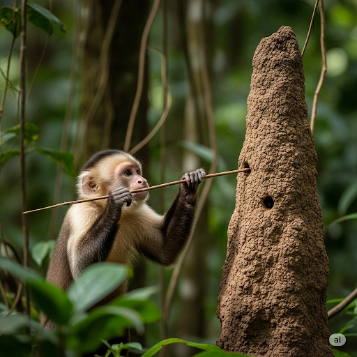
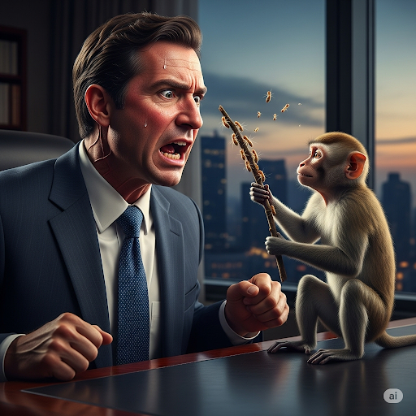
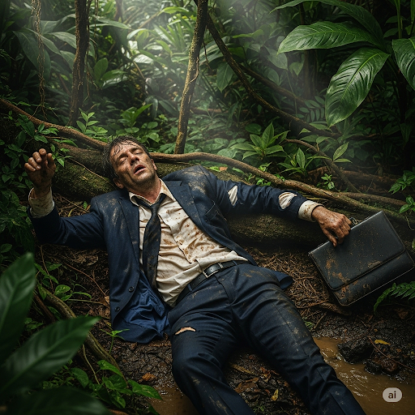
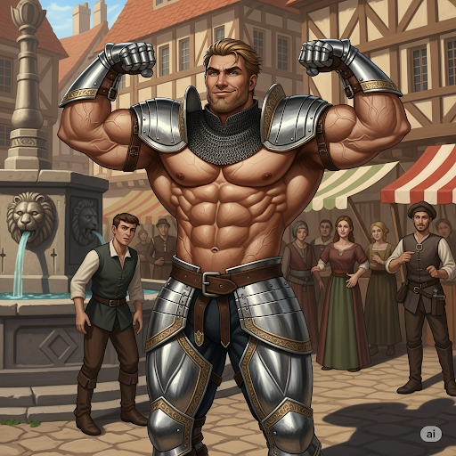
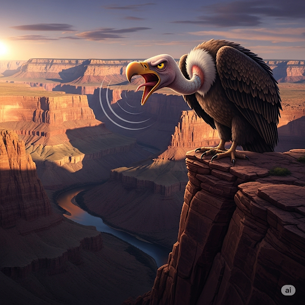
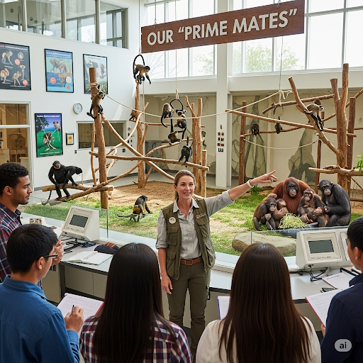
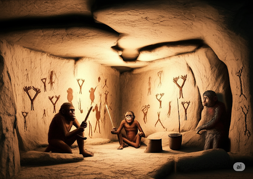
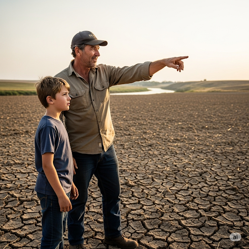
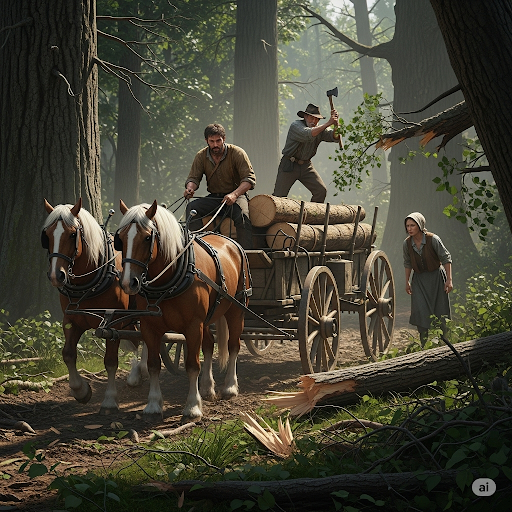

# The Man and the Monkey

The Man and the Monkey
While flying over a jungle, a wealthy **executive**’s private plane crashed. Some of the crew were hurt, so the pilot decided to stay with them and wait for help. The **arrogant** executive, though, didn’t care about the **welfare** of the pilot and crew. Rather, he thought he could walkout of the jungle and find a town to stay in.

He followed a **trail** through a **canyon** and along a **creek**. The jungle was actually very stunning. If the **arrogant** executive had stopped to look around, he might have **perceived** the jungle’s beauty. But he was in a **nasty** mood and had no care for the **aesthetic** value of the jungle. He continued to walk up the steep **incline** of the jungle’s hills.

Soon, he was lost. Several days passed, and **fatigue** and hunger weakened him. He was very tired and afraid.

Just then, a monkey came out of the trees. It was carrying a **twig** covered in honey. It walked up to a mound where **termites** lived. He then used the **twig** like a **drill** to make a hole in the mound. Then very carefully, it removed the **twig** from the hole. The **sticky** **twig** was covered with **termites**.

Instead of eating the bugs, the monkey offered them to the executive, but he didn’t want what the monkey offered. He shouted at the monkey, “Get away from me, you stupid **primate**!”

The executive’s **stereotype** of the monkey was wrong. The monkey was not stupid. It knew how to find food, whereas the executive did not. He refused the help of the monkey, **thereby** leaving himself to starve.

When the executive was finally found, he was very skinny and sick. He had not eaten for a very longtime. Because he held a **bias** against the **primitive** ways of the monkey, he had gone hungry and almost died. The executive didn’t understand that it was his **arrogant** attitude that had caused all of his problems.

## Sentences of story

The Man and the Monkey

While flying over a jungle, a wealthy executive’s private plane crashed.

Some of the crew were hurt, so the pilot decided to stay with them and wait for help.

The arrogant executive, though, didn’t care about the welfare of the pilot and crew.

Rather, he thought he could walkout of the jungle and find a town to stay in.

He followed a trail through a canyon and along a creek.

The jungle was actually very stunning.

If the arrogant executive had stopped to look around, he might have perceived the jungle’s beauty.

But he was in a nasty mood and had no care for the aesthetic value of the jungle.

He continued to walk up the steep incline of the jungle’s hills.

Soon, he was lost.

Several days passed, and fatigue and hunger weakened him.

He was very tired and afraid.

Just then, a monkey came out of the trees.

It was carrying a twig covered in honey.

It walked up to a mound where termites lived.

He then used the twig like a drill to make a hole in the mound.

Then very carefully, it removed the twig from the hole.

The sticky twig was covered with termites.

Instead of eating the bugs, the monkey offered them to the executive, but he didn’t want what the monkey offered.

He shouted at the monkey, “Get away from me, you stupid primate!”

The executive’s stereotype of the monkey was wrong.

The monkey was not stupid.

It knew how to find food, whereas the executive did not.

He refused the help of the monkey, thereby leaving himself to starve.

When the executive was finally found, he was very skinny and sick.

He had not eaten for a very longtime.

Because he held a bias against the primitive ways of the monkey, he had gone hungry and almost died.

The executive didn’t understand that it was his arrogant attitude that had caused all of his problems.

## List of word

aesthetic arrogant bias canyon creek drill executive fatigue incline nasty perceive primate primitive stereotype sticky termite thereby trail twig welfare

## 1. aesthetic

### IPA: /esˈθet.ɪk/
### Class: adj
### Câu truyện ẩn dụ: 
Một anh chàng sinh viên nghệ thuật tên Thét nổi tiếng với cách cảm thụ đặc biệt. Khi đến thăm một viện bảo tàng, anh đứng sững người trước một bức tranh tuyệt đẹp. Bức tranh với màu sắc và bố cục hoàn hảo khiến anh quá choáng ngợp. Anh bất giác thốt lên một âm thanh đầy cảm xúc: "É... thét... íc!". Mọi người xung quanh hiểu rằng đó là cách anh thể hiện sự trân trọng cao nhất đối với cái đẹp. Kể từ đó, mỗi khi bàn luận về nghệ thuật hay một thiết kế có tính thẩm mỹ cao, họ đều nói rằng nó có "chất Thét-íc", gợi nhớ đến tiếng kêu đầy đam mê của anh.

### Định nghĩa : 
Liên quan đến vẻ đẹp hoặc sự đánh giá cái đẹp; có thẩm mỹ.

### English definition: 
Concerned with beauty or the appreciation of beauty.

### Sentence of stroy:

 But he was in a nasty mood and had no care for the **aesthetic** value of the jungle.

### Ví dụ thông dụng:

1. The new building has a very pleasing aesthetic design.
2. He is a designer with a keen aesthetic sense.

## 2. arrogant

### IPA: /ˈær.ə.ɡənt/
### Class: adj
### Câu truyện ẩn dụ:
Ngày xưa, có một hiệp sĩ tên Arro rất khỏe mạnh nhưng cũng vô cùng kiêu ngạo. Mỗi khi đến một thị trấn mới, ông ta đều đi lại vênh váo, gồng mình khoe cơ bắp và những đường "gân" cuồn cuộn. Ông ta thường khoe khoang: "À, rờ gân của ta xem! Không ai sánh bằng!". Ông ta tin mình giỏi hơn tất cả mọi người, coi thường từ nông dân đến thương gia. Dần dần, người dân phát ngán với thái độ trịch thượng đó và bắt đầu gọi ông ta một cách mỉa mai là "Arrogant", từ đó dùng để chỉ bất kỳ ai kiêu căng, ngạo mạn.

### Định nghĩa :
Tin rằng mình tốt hơn hoặc quan trọng hơn người khác một cách khó chịu; kiêu ngạo.

### English definition:
Believing that you are better or more important than other people.

### Sentence of stroy:
The **arrogant** executive, though, didn’t care about the welfare of the pilot and crew.

### Ví dụ thông dụng:
1. I found him arrogant and rude.
2. He was too arrogant to admit that he had been wrong.

## 3. bias

### IPA: /ˈbaɪ.əs/
### Class: n
### Câu truyện ẩn dụ:
Tại một ngôi làng nọ, có một vị quan tòa với thói quen xét xử rất kỳ lạ. Ông ta luôn có thành kiến sâu sắc với những người ăn được cay, cho rằng họ là những người hung hăng. Trong các phiên tòa, ông ta luôn "bài" xích những người này và đưa ra những phán quyết cay nghiệt như "ớt". Cách xử án thiếu công bằng, chỉ dựa trên cảm tính và định kiến "bài-ớt" của ông đã trở nên khét tiếng. Mọi người bắt đầu dùng từ "bias" để chỉ bất kỳ sự thiên vị, thành kiến vô lý nào trong việc đánh giá người khác.

### Định nghĩa :
Một cảm giác mạnh mẽ ủng hộ hoặc chống lại một nhóm người, hoặc một phe trong một cuộc tranh luận, thường không dựa trên sự phán xét công bằng; thành kiến, thiên vị.

### English definition:
A strong feeling in favour of or against one group of people, or one side in an argument, often not based on fair judgment.

### Sentence of stroy:
Because he held a **bias** against the primitive ways of the monkey, he had gone hungry and almost died.

### Ví dụ thông dụng:
1. The news channel was accused of political bias.
2. It's important to avoid bias in your research.

## 4. canyon

### IPA: /ˈkæn.jən/
### Class: n
### Câu truyện ẩn dụ:
Truyền thuyết kể về một hẻm núi sâu thẳm được tạo ra bởi một dòng sông cổ đại. Sinh vật duy nhất đủ can đảm sống trên những vách đá dựng đứng đó là một con 'kền kền' khổng lồ và rất hay 'cằn nhằn'. Tiếng kêu của nó vang vọng khắp hẻm núi, nghe như "Ken-nhằn! Ken-nhằn!". Những nhà thám hiểm đầu tiên đến đây, khi nghe thấy tiếng kêu ám ảnh không ngớt đó, đã quyết định đặt tên cho hẻm núi vĩ đại này theo tên của sinh vật cáu kỉnh duy nhất cai trị nó. Họ gọi đó là "canyon", một nơi hùng vĩ và hiểm trở như chính tiếng kêu của con 'kền kền nhằn' đó.

### Định nghĩa :
Một thung lũng sâu với các vách đá rất dốc, thường được hình thành bởi một con sông.

### English definition:
A deep valley with very steep sides of rock that has usually been formed by a river.

### Sentence of stroy:
He followed a trail through a **canyon** and along a creek.

### Ví dụ thông dụng:
1. The Grand Canyon is one of the world's most famous natural wonders.
2. We hiked down into the canyon.

## 5. creek

### IPA: /kriːk/
### Class: n
### Câu truyện ẩn dụ:
Sau ngôi nhà cũ của ông bà tôi là một thế giới bí mật của lũ trẻ chúng tôi. Đó là một con lạch nhỏ uốn lượn xuyên qua khu rừng. Chúng tôi gọi nơi đó là "vương quốc" của mình. Dòng nước trong vắt chảy qua những viên sỏi nhẵn bóng, tạo ra một âm thanh nhẹ nhàng rất đặc trưng: "cờ-ríc... cờ-ríc...". Chúng tôi dành hàng giờ ở đó, xây đập bằng đá và ngắm những chú cá nhỏ bơi lội. Con lạch nhỏ với âm thanh "cờ-ríc" êm dịu đó là nơi yêu thích của chúng tôi, và chúng tôi đã đặt cho nó một cái tên hoàn hảo: "creek".

### Định nghĩa :
Một dòng suối hoặc con sông nhỏ, hẹp; con lạch.

### English definition:
A small, narrow stream or river.

### Sentence of stroy:
He followed a trail through a canyon and along a **creek**.

### Ví dụ thông dụng:
1. The children love to play in the creek.
2. We crossed a shallow creek.

## 6. drill

### IPA: /drɪl/
### Class: n
### Câu truyện ẩn dụ:
Một nhà phát minh già muốn tạo ra một công cụ để tạo lỗ một cách nhanh chóng. Sau nhiều tuần mày mò với bánh răng và động cơ, cuối cùng ông cũng chế tạo được một thiết bị quay. Khi ông nhấn nút, nó hoạt động, tạo ra một âm thanh mạnh mẽ và nhịp nhàng: "Đờ-riuuuu... Đờ-riuuuu...". Nó dễ dàng khoan một lỗ hoàn hảo vào một tấm ván gỗ dày. Người học việc trẻ của ông, kinh ngạc theo dõi, đã thốt lên: "Cái máy 'đờ-riu' đó là gì vậy ạ?". Cái tên ấy gắn liền với nó. Kể từ đó, bất kỳ công cụ nào dùng để tạo lỗ, tức cái máy khoan, đều được gọi là "drill".

### Định nghĩa :
Một công cụ hoặc máy có đầu nhọn để tạo lỗ; mũi khoan, máy khoan.

### English definition:
A tool or machine with a pointed end for making holes.

### Sentence of stroy:
He then used the twig like a **drill** to make a hole in the mound.

### Ví dụ thông dụng:
1. He used an electric drill to put up the shelves.
2. We need a drill to make a hole in the wall.

## 7. executive

### IPA: /ɪɡˈzek.jə.tɪv/
### Class: n
### Câu truyện ẩn dụ:
Trong một tòa nhà chọc trời, cuộc họp hội đồng quản trị đang rất căng thẳng. Một quyết định lớn cần được đưa ra. Một nữ quản lý cấp cao, nổi tiếng với sự quyết đoán, đã đứng lên trình bày một kế hoạch táo bạo. "Ích lợi (Ex) của con đường này là rất rõ ràng," bà tuyên bố. "Chúng ta phải thực thi (execute) nó ngay lập tức." Khả năng nhìn ra 'ích lợi' và lòng can đảm để 'thực thi' kế hoạch của bà đã gây ấn tượng với tất cả mọi người. Bà là người biến quyết định thành hành động. Từ đó, người ta gọi bà là giám đốc điều hành, "executive".

### Định nghĩa :
Một người ở vị trí cao, đặc biệt là trong kinh doanh, người đưa ra quyết định và thực hiện chúng; giám đốc điều hành.

### English definition:
Someone in a high position, especially in business, who makes decisions and puts them into action.

### Sentence of stroy:
While flying over a jungle, a wealthy **executive**’s private plane crashed.

### Ví dụ thông dụng:
1. She is a senior executive in a major corporation.
2. The executives of the company held a meeting.

## 8. fatigue

### IPA: /fəˈtiːɡ/
### Class: n
### Câu truyện ẩn dụ:
Một nhóm binh sĩ đã hành quân ba ngày liền qua khu rừng rậm. Cơ thể họ đau nhức và tâm trí tê liệt vì mệt mỏi. Một người lính trẻ kiệt sức, lảo đảo rồi ngã quỵ. Đồng đội vội chạy đến đỡ. Gương mặt anh tái nhợt, người "phờ phạc". Anh thì thầm: "Tôi phờ quá... tí nữa là gục rồi." Tình trạng cơ thể "phờ" đi và sắp "gục" ngã — sự mệt mỏi tột độ cả về thể chất lẫn tinh thần — là kẻ thù thường trực của họ. Họ gọi cảm giác kiệt quệ đó là "fatigue," một từ gợi nhớ về khoảnh khắc mệt mỏi đến suy sụp.

### Định nghĩa :
Sự mệt mỏi cực độ, do gắng sức về thể chất hoặc tinh thần hoặc do bệnh tật.

### English definition:
Extreme tiredness, resulting from mental or physical exertion or illness.

### Sentence of stroy:
Several days passed, and **fatigue** and hunger weakened him.

### Ví dụ thông dụng:
1. He was suffering from physical and mental fatigue.
2. Driver fatigue was the cause of the accident.

## 9. incline

### IPA: /ˈɪn.klaɪn/
### Class: n
### Câu truyện ẩn dụ:
Hãy tưởng tượng bạn đang xây dựng một tuyến đường sắt qua vùng núi. Để đưa tàu lên một ngọn đồi cao, bạn không thể đi thẳng lên. Thay vào đó, bạn phải xây dựng đường ray trên một con dốc thoai thoải. Một kỹ sư giải thích kế hoạch: "Chúng ta sẽ đặt đường ray 'in' (trong) một 'line' (đường) đi lên dần dần. Nó không bằng phẳng, nó là một 'in-line'." Con đường 'in-line' hay con dốc này cho phép tàu hỏa leo lên. Các công nhân bắt đầu gọi bất kỳ con dốc hoặc đoạn đường nghiêng nào là "incline", một đường thẳng có độ dốc.

### Định nghĩa :
Một bề mặt dốc; con dốc, đoạn dốc.

### English definition:
A sloping surface.

### Sentence of stroy:
He continued to walk up the steep **incline** of the jungle’s hills.

### Ví dụ thông dụng:
1. The house is built on a slight incline.
2. He struggled to push the wheelchair up the incline.

## 10. nasty

### IPA: /ˈnæs.ti/
### Class: adj
### Câu truyện ẩn dụ:
Một cậu bé tìm thấy một loại quả lạ trong rừng. Nó bị dập, trông 'nát' bét và có mùi rất khó chịu. Tò mò, cậu cắn một miếng và ngay lập tức nhổ ra vì vị của nó thật kinh khủng. Cậu chạy về nhà, vừa mếu máo vừa nói với chị gái: "Đừng bao giờ ăn cái quả 'nát-tì' đó nhé! Nó kinh khủng lắm!". Kể từ đó, hai chị em dùng từ "nasty" để mô tả bất cứ thứ gì khó chịu và kinh tởm, từ mùi hôi, vị dở, cho đến một người xấu tính hay một cơn mưa tầm tã, u ám.

### Định nghĩa :
Rất tệ hoặc rất khó chịu; kinh tởm, xấu xa.

### English definition:
Very bad or unpleasant.

### Sentence of stroy:
But he was in a **nasty** mood and had no care for the aesthetic value of the jungle.

### Ví dụ thông dụng:
1. There's a nasty smell in here.
2. Don't be so nasty to your brother.

## 11. perceive

### IPA: /pəˈsiːv/
### Class: v
### Câu truyện ẩn dụ:
Một vị thiền sư già đang dạy cho học trò về sự nhận thức. Ngài giơ lên một chiếc cốc gỗ mộc mạc và hỏi: "Con thấy gì?". Người học trò đáp: "Một cái cốc ạ." Vị sư mỉm cười: "Hãy nhìn kỹ hơn. Hãy 'bơ' (per) đi lớp vỏ ngoài, 'siv' (suy/see) xét thật kỹ. Con sẽ thấy cái cây nơi nó sinh ra, những cơn mưa đã nuôi dưỡng nó, và đôi tay của người thợ mộc đã tạo hình nó." Người học trò chợt hiểu ra. Việc nhận thức thực sự không chỉ là nhìn, mà là hiểu và nhận ra một thực tại sâu sắc hơn. Hành động nhìn sâu sắc, "bơ-siv" này, được gọi là "perceive."

### Định nghĩa :
Nhận thấy hoặc nhận thức được điều gì đó.

### English definition:
To notice or become aware of something.

### Sentence of stroy:
...he might have **perceived** the jungle’s beauty.

### Ví dụ thông dụng:
1. I perceived a change in his behavior.
2. How do you perceive your new role?

## 12. primate

### IPA: /ˈpraɪ.meɪt/
### Class: n
### Câu truyện ẩn dụ:
Một nhà sinh vật học nổi tiếng dẫn một nhóm sinh viên tham quan cơ sở nghiên cứu của mình. Bà chỉ vào khu vực của khỉ và vượn người, nói với một nụ cười ấm áp: "Đây là những 'prime mates' (người bạn hàng đầu) của chúng ta." Bà giải thích: "Trong đại gia đình sự sống, chúng là những người bạn đồng hành chính, hay 'prime', và là họ hàng gần gũi nhất của con người." Các sinh viên rất cảm động trước cách mô tả này. Thuật ngữ "primate" đã khắc sâu trong tâm trí họ, không chỉ như một phân loại khoa học, mà còn là lời nhắc nhở về mối liên hệ sâu sắc của chúng ta với bộ linh trưởng.

### Định nghĩa :
Một thành viên của nhóm động vật có vú phát triển và thông minh nhất, bao gồm con người, khỉ và vượn.

### English definition:
A member of the most developed and intelligent group of mammals, including humans, monkeys, and apes.

### Sentence of stroy:
“Get away from me, you stupid **primate**!”

### Ví dụ thông dụng:
1. Humans, gorillas, and monkeys are all primates.
2. The zookeeper is an expert on primates.

## 13. primitive

### IPA: /ˈprɪm.ɪ.tɪv/
### Class: adj
### Câu truyện ẩn dụ:
Hãy tưởng tượng các nhà khảo cổ học khám phá ra một hang động từ hàng ngàn năm trước. Bên trong, họ tìm thấy những công cụ đơn giản làm bằng đá và xương, cùng những bức vẽ thô sơ trên tường. Vị trưởng đoàn nhận xét: "Đây là từ một 'prime time' (thời kỳ đầu tiên), một thời điểm khi nền văn minh nhân loại chỉ mới bắt đầu." Đó là thời đại sơ khai, hay 'prime' nhất. Các công cụ còn rất cơ bản, nghệ thuật đơn giản. Họ mô tả giai đoạn đầu, chưa phát triển này của lịch sử loài người là "primitive", gợi nhớ về "thời kỳ sơ khai" nguyên thủy đó.

### Định nghĩa :
Thuộc về giai đoạn đầu trong quá trình phát triển tiến hóa hoặc lịch sử của một cái gì đó; nguyên thủy.

### English definition:
Relating to an early stage in the evolutionary or historical development of something.

### Sentence of stroy:
Because he held a bias against the **primitive** ways of the monkey, he had gone hungry and almost died.

### Ví dụ thông dụng:
1. The explorers discovered a primitive tribe in the jungle.
2. They lived in primitive conditions.

## 14. stereotype

### IPA: /ˈster.i.ə.taɪp/
### Class: n
### Câu truyện ẩn dụ:
Vào thời kỳ đầu của ngành in ấn, để sao chép một trang sách, người ta tạo ra một tấm kim loại nguyên khối từ các con chữ rời. Tấm kim loại này được gọi là "stereotype". Nó rất bền và có thể in đi in lại cùng một trang giấy hàng nghìn lần mà không có bất kỳ thay đổi nào. Mọi bản sao đều giống hệt nhau, một bản sao rập khuôn, cố định. Chẳng bao lâu sau, người ta bắt đầu dùng từ này để mô tả những ý tưởng cố định, không thay đổi về một nhóm người nào đó. "Stereotype" trở thành một "khuôn in" trong tâm trí, luôn tạo ra cùng một hình ảnh đơn giản, rập khuôn.

### Định nghĩa :
Một ý tưởng cố định mà mọi người có về ai đó hoặc cái gì đó trông như thế nào, đặc biệt là một ý tưởng sai lầm.

### English definition:
A set idea that people have about what someone or something is like, especially an idea that is wrong.

### Sentence of stroy:
The executive’s **stereotype** of the monkey was wrong.

### Ví dụ thông dụng:
1. It's a stereotype that all British people drink tea.
2. We should challenge negative stereotypes.

## 15. sticky

### IPA: /ˈstɪk.i/
### Class: adj
### Câu truyện ẩn dụ:
Hai anh em đang làm bánh dẻo với mật mía cho Tết Trung thu. Tay của họ nhanh chóng bị dính đầy hỗn hợp ngọt ngào. Người anh tinh nghịch bắt đầu lấy ngón tay chọc vào má em gái. Cô bé la lên: "Anh đừng 'sờ tí kì' lạ thế! Dính quá đi mất!". Mẹ của chúng nghe thấy và bật cười. Cụm từ "sờ tí kì" đã trở thành từ ngữ hài hước của gia đình họ để chỉ bất cứ thứ gì dính và nhớp nháp, từ mật ong, keo dán cho đến những vũng bùn. Và cứ như vậy, chúng đã học được từ "sticky".

### Định nghĩa :
Làm từ hoặc được bao phủ bởi một chất dính vào bất kỳ vật nào chạm vào nó; dính, nhớp nháp.

### English definition:
Made of or covered with a substance that stays attached to any object that touches it.

### Sentence of stroy:
The **sticky** twig was covered with termites.

### Ví dụ thông dụng:
1. My fingers are sticky after eating the honey.
2. Be careful, the floor is sticky.

## 16. termite

### IPA: /ˈtɜː.maɪt/
### Class: n
### Câu truyện ẩn dụ:
Một nhà thơ nghèo sống trong một túp lều gỗ. Một ngày nọ, ông phát hiện mùn cưa chất đống dưới sàn nhà và nhìn thấy những con côn trùng trắng nhỏ đang gặm nhấm gỗ. Trong nỗi tuyệt vọng pha chút hài hước đen tối, ông đã làm một bài thơ: "Ôi bầy côn trùng, chúng làm ta 'thờ' than / Rằng 'mai' đây thôi, nhà ta sẽ tan." Ông đọc bài thơ về những sinh vật sẽ phá hủy ngôi nhà của mình vào ngày 'mai' cho người hàng xóm nghe. Người hàng xóm, khi cố gắng gọi tên loài vật gây hại này, đã kết hợp hai từ 'thờ' và 'mai' của nhà thơ, gọi con mối phá hoại là "termite".

### Định nghĩa :
Một loài côn trùng nhỏ sống thành đàn lớn và ăn gỗ; con mối.

### English definition:
A small insect that lives in large groups and eats wood.

### Sentence of stroy:
It walked up to a mound where **termites** lived.

### Ví dụ thông dụng:
1. Termites had eaten away the wooden beams.
2. We had to call an exterminator to get rid of the termites.

## 17. thereby

### IPA: /ˌðerˈbaɪ/
### Class: adv
### Câu truyện ẩn dụ:
Một người nông dân thông minh đang cố gắng tưới nước cho cánh đồng trong trận hạn hán. Con sông thì ở xa, nhưng có một con suối nhỏ 'ở kia' (there) trên một ngọn đồi nhỏ. Ông nhận ra mình có thể đào một con kênh từ con suối đến cánh đồng. Ông giải thích kế hoạch cho con trai: "Chúng ta sẽ đào con kênh 'ở kia' (there). 'Bằng cách' (by) làm việc này, chúng ta sẽ dẫn nước đến cây trồng và cứu chúng." Sự kết hợp giữa địa điểm ('there') và phương pháp ('by') đã trực tiếp dẫn đến kết quả mong muốn. Nguyên tắc này, nơi một hành động trực tiếp gây ra một kết quả khác, được biết đến là "thereby" (do đó, bằng cách đó).

### Định nghĩa :
Như một kết quả của hành động này; do đó, bằng cách đó.

### English definition:
As a result of this action.

### Sentence of stroy:
He refused the help of the monkey, **thereby** leaving himself to starve.

### Ví dụ thông dụng:
1. He trained hard every day, thereby improving his skills.
2. The new bridge will reduce travel time, thereby boosting the local economy.

## 18. trail

### IPA: /treɪl/
### Class: n
### Câu truyện ẩn dụ:
Khi những người định cư đầu tiên di chuyển về phía Tây, không có con đường nào xuyên qua những khu rừng và ngọn núi rộng lớn. Để tạo ra một lối đi cho những người khác theo sau, họ thường kéo những khúc gỗ nặng sau xe ngựa hoặc bẻ cành cây để đánh dấu. Họ đã 'trải' một con đường xuyên qua vùng hoang dã, để lại một vệt rõ ràng cho những người đến sau. Vệt đường mòn này với đất bị xáo trộn, cành cây gãy và vết xe ngựa chính là kim chỉ nam của họ. Mọi người bắt đầu gọi con đường mòn này là "trail," một từ được sinh ra từ hành động 'trải' một con đường cho người khác đi theo.

### Định nghĩa :
Một con đường mòn đi qua vùng nông thôn, núi hoặc khu vực rừng rậm.

### English definition:
A path through a countryside, mountain, or forest area.

### Sentence of stroy:
He followed a **trail** through a canyon and along a creek.

### Ví dụ thông dụng:
1. We followed a narrow trail through the woods.
2. The hikers got lost on the trail.

## 19. twig

### IPA: /twɪɡ/
### Class: n
### Câu truyện ẩn dụ:
Một con chim mẹ đang dạy những chú chim non cách xây tổ. "Các con cần tìm những cành cây nhỏ và mảnh," nó líu lo. Nó bay đến một cây bạch dương và bằng một cú vặn mỏ nhanh và dứt khoát, nó bẻ gãy một cành cây nhỏ hoàn hảo. Khi cành cây gãy, nó tạo ra một âm thanh nhỏ và sắc, nghe như "tu-ít!". "Thấy chưa?" chim mẹ nói. "Hãy tìm những cành cây tạo ra âm thanh 'tu-ít' đó. Chúng là tốt nhất." Những chú chim non nhớ bài học này, và mỗi khi chúng nhìn thấy một cành cây nhỏ, chúng lại nghĩ đến âm thanh sắc bén đó và gọi nó là "twig".

### Định nghĩa :
Một cành cây nhỏ, mảnh của cây hoặc bụi cây.

### English definition:
A small, thin branch of a tree or bush.

### Sentence of stroy:
It was carrying a **twig** covered in honey.

### Ví dụ thông dụng:
1. The bird was building its nest with small twigs.
2. He gathered some dry twigs to start a fire.

## 20. welfare

### IPA: /ˈwel.fer/
### Class: n
### Câu truyện ẩn dụ:
Một nữ hoàng thông thái đã từng tập hợp các cố vấn của mình lại và nói: "Mục tiêu của vương quốc chúng ta rất đơn giản. Ta muốn mọi công dân đều 'fare well' (sống tốt). Điều đó có nghĩa là họ phải 'well' (khỏe mạnh) và cuộc sống của họ phải 'fair' (công bằng)." Nguyên tắc đảm bảo mọi người đều có thể 'sống tốt' này đã trở thành nền tảng cho sự cai trị của bà. Sức khỏe, hạnh phúc và sự thịnh vượng chung của người dân, hay phúc lợi xã hội, được tóm gọn trong một ý tưởng mạnh mẽ: "welfare" của họ.

### Định nghĩa :
Sức khỏe, hạnh phúc và tài vận của một người hoặc một nhóm; phúc lợi.

### English definition:
The health, happiness, and fortunes of a person or group.

### Sentence of stroy:
The **arrogant** executive, though, didn’t care about the **welfare** of the pilot and crew.

### Ví dụ thông dụng:
1. The government is responsible for the welfare of its citizens.
2. Animal welfare is a major concern for the organization.