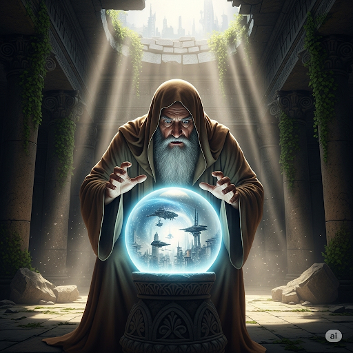

# Cosmo’s Flight

When Cosmo woke up, he was crying. He had a dream that he was falling. This dream had recurred for the previous five nights. Cosmo was scared that his dreams were a preview of what was going to happen on his flight the next day.

Cosmo was a supernatural being who was about to turn 15 years old. In his culture, boys of his age were required to participate in an important rite. They were given wings and instructed to orbit the Earth. After successful flights, the boys officially became men. Cosmo certainly wanted to be a man, but he was scared. He went to the oracle of a god named Dano. Cosmo said, “I’m not sure I can make such a long trip. What if I get tired? What if my strength stalls, and I can’t stay in the air. I’ll crash and die!”

Dano replied, “Don’t be afraid. You have all the relevant skills in your personal inventory that have been building up over the years. To ease your worry, let me tell you a little about what will happen tomorrow. You’ll begin over Africa. You’ll keep flying north until you come to the Himalayas. The mountaintops will look like small loaves of bread at such a high distance. The rivers of the world will look like pieces of blue string that cross the globe. Keep your body horizontal when flying against the winds of the Pacific Ocean. Keep your eyes open and enjoy the beauty of the Earth. You will be fine, you’ll see.”

Cosmo replied, “Thanks for the overview of my journey, I’ll do my best.”

The next morning, Cosmo was provided with a divine set of wings and sent on his way. He flapped his wings and went high above the Earth. He flew over mountains, oceans, and glaciers. After a while, his inward thoughts were no longer about falling. He was actually having fun! He began to hum a song as he enjoyed the view. When he reached home, his tribe was there to greet him.

The chief said, “On behalf of the tribe, I declare you a man. We’re proud of you, Cosmo!”

Cosmo was proud of himself, too.

## Sentences of story

Cosmo’s Flight

When Cosmo woke up, he was crying.

He had a dream that he was falling.

This dream had recurred for the previous five nights.

Cosmo was scared that his dreams were a preview of what was going to happen on his flight the next day.

Cosmo was a supernatural being who was about to turn 15 years old.

In his culture, boys of his age were required to participate in an important rite.

They were given wings and instructed to orbit the Earth.

After successful flights, the boys officially became men.

Cosmo certainly wanted to be a man, but he was scared.

He went to the oracle of a god named Dano.

Cosmo said, “I’m not sure I can make such a long trip. What if I get tired? What if my strength stalls, and I can’t stay in the air. I’ll crash and die!”

Dano replied, “Don’t be afraid. You have all the relevant skills in your personal inventory that have been building up over the years.

To ease your worry, let me tell you a little about what will happen tomorrow.

You’ll begin over Africa.

You’ll keep flying north until you come to the Himalayas.

The mountaintops will look like small loaves of bread at such a high distance.

The rivers of the world will look like pieces of blue string that cross the globe.

Keep your body horizontal when flying against the winds of the Pacific Ocean.

Keep your eyes open and enjoy the beauty of the Earth.

You will be fine, you’ll see.”

Cosmo replied, “Thanks for the overview of my journey, I’ll do my best.”

The next morning, Cosmo was provided with a divine set of wings and sent on his way.

He flapped his wings and went high above the Earth.

He flew over mountains, oceans, and glaciers.

After a while, his inward thoughts were no longer about falling.

He was actually having fun!

He began to hum a song as he enjoyed the view.

When he reached home, his tribe was there to greet him.

The chief said, “On behalf of the tribe, I declare you a man. We’re proud of you, Cosmo!”

Cosmo was proud of himself, too.

## List of word

behalf, flap, glacier, globe, horizontal, hum, inventory, inward, loaf, oracle, orbit, overview, preview, previous, provide, recur, relevant, rite, stall, supernatural

## 1. behalf

### IPA: /bɪˈhɑːf/
### Class: n
### Câu truyện ẩn dụ: 
Trong một phiên tòa, một luật sư đứng lên bênh vực cho thân chủ của mình. Ông nói: "Bị hại (behalf) của tôi vô tội!". Cách ông nhấn mạnh vào việc bảo vệ "bị hại" của mình đã gây ấn tượng mạnh. Từ đó, "on behalf of" mang ý nghĩa là "thay mặt cho", "nhân danh" ai đó, như cách người luật sư đã đứng ra đại diện và bênh vực cho người mà ông coi là "bị hại".

### Định nghĩa : 
Thay mặt cho ai đó, hoặc với tư cách là đại diện của họ.

### English definition: 
As a representative of or a proxy for.

### Sentence of stroy:

 On **behalf** of the tribe, I declare you a man.

### Ví dụ thông dụng:

1. I am writing to you on behalf of my client.
2. She accepted the award on behalf of the entire team.

## 2. flap

### IPA: /flæp/
### Class: v
### Câu truyện ẩn dụ:
Một chú chim non đang tập bay. Nó nhìn mẹ nó và cố gắng bắt chước. Nó cố gắng đập cánh nhưng chỉ tạo ra những tiếng "phờ-láp... phờ-láp..." yếu ớt và vụng về. Âm thanh đó chính là mô tả hoàn hảo cho hành động vỗ cánh lên xuống nhanh và nhẹ. Mọi người bắt đầu dùng từ "flap" để chỉ hành động đập, vỗ (cánh) đó.

### Định nghĩa :
(về một con chim) vỗ cánh lên xuống khi bay, hoặc để chuẩn bị bay.

### English definition:
(of a bird) move its wings up and down when flying or preparing to fly.

### Sentence of stroy:
He **flapped** his wings and went high above the Earth.

### Ví dụ thông dụng:
1. The bird flapped its wings and flew away.
2. The flag flapped in the wind.

## 3. glacier

### IPA: /ˈɡleɪ.si.ər/
### Class: n
### Câu truyện ẩn dụ:
Một nhà thám hiểm đang khám phá vùng Bắc Cực. Anh ta kinh ngạc trước một khối băng khổng lồ, di chuyển cực kỳ chậm chạp. Anh ta cảm thấy lạnh cóng và run rẩy, răng va vào nhau lập cập, tạo ra âm thanh như "gờ-lây-sờ...". Anh ta đặt tên cho khối băng di động khổng lồ này là "glacier", một cái tên gợi nhớ đến sự lạnh giá khiến anh ta phải run lên "gờ-lây-sờ".

### Định nghĩa :
Một khối băng lớn di chuyển chậm, được hình thành bởi sự tích tụ và nén chặt của tuyết trên núi hoặc gần các cực.

### English definition:
A slowly moving mass or river of ice formed by the accumulation and compaction of snow on mountains or near the poles.

### Sentence of stroy:
He flew over mountains, oceans, and **glaciers**.

### Ví dụ thông dụng:
1. The glacier is melting at an alarming rate.
2. We took a helicopter tour over the glacier.

## 4. globe

### IPA: /ɡləʊb/
### Class: n
### Câu truyện ẩn dụ:
Một nhà thiên văn học Hy Lạp cổ đại đang cố gắng giải thích hình dạng của Trái Đất cho học trò. Ông lấy một quả cầu đất sét và nói: "Trái Đất của chúng ta không phẳng, nó tròn như quả cầu này. Nó 'gồ lên' (g-lô) ở mọi phía." Ông xoay quả cầu để minh họa. Học trò của ông, ghi nhớ từ "gồ lên" đó, bắt đầu gọi bất kỳ vật thể hình cầu nào, đặc biệt là mô hình Trái Đất, là "globe".

### Định nghĩa :
Trái Đất; một vật thể hình cầu, đặc biệt là một quả địa cầu.

### English definition:
The earth; a spherical or rounded object, especially a model of the earth.

### Sentence of stroy:
The rivers of the world will look like pieces of blue string that cross the **globe**.

### Ví dụ thông dụng:
1. She has traveled all over the globe.
2. He has a globe of the world in his study.

## 5. horizontal

### IPA: /ˌhɒr.ɪˈzɒn.təl/
### Class: adj
### Câu truyện ẩn dụ:
Một nghệ sĩ đang dạy học trò về phối cảnh. "Khi các con nhìn ra biển," ông nói, "đường nơi trời và biển gặp nhau được gọi là đường chân trời. Nó là một đường thẳng hoàn hảo, song song với mặt đất. Hãy nhớ, đường 'ho-ra-giăng-tới' (horizon-tới) đó luôn nằm ngang." Học trò của ông đã lấy cảm hứng từ đó, và bắt đầu gọi bất cứ thứ gì song song với mặt đất hoặc nằm ngang là "horizontal".

### Định nghĩa :
Song song với mặt phẳng của đường chân trời; nằm ngang.

### English definition:
Parallel to the plane of the horizon; at right angles to the vertical.

### Sentence of stroy:
Keep your body **horizontal** when flying against the winds of the Pacific Ocean.

### Ví dụ thông dụng:
1. Draw a horizontal line across the page.
2. The patient must remain in a horizontal position.

## 6. hum

### IPA: /hʌm/
### Class: v
### Câu truyện ẩn dụ:
Một cậu bé đang ngồi trong vườn, lắng nghe tiếng vo vo của những con ong mật. Chúng tạo ra một âm thanh đều đặn, êm dịu: "hăm... hăm...". Cậu bé thích thú và bắt đầu ngân nga một giai điệu mà không mở miệng, cố gắng bắt chước âm thanh "hăm" đó. Mẹ cậu nghe thấy và hỏi: "Con đang 'hăm' gì đấy?". Từ đó, "hum" được dùng để chỉ hành động ngân nga một giai điệu với đôi môi khép lại.

### Định nghĩa :
Ngân nga một giai điệu với đôi môi khép lại.

### English definition:
To sing a tune with your lips closed.

### Sentence of stroy:
He began to **hum** a song as he enjoyed the view.

### Ví dụ thông dụng:
1. He started to hum a little tune.
2. The refrigerator was humming in the kitchen.

## 7. inventory

### IPA: /ˈɪn.vən.tɔːr.i/
### Class: n
### Câu truyện ẩn dụ:
Một người chủ cửa hàng mới rất cẩn thận. Mỗi tối, ông đi khắp cửa hàng của mình, ghi lại mọi thứ. "Mình phải 'in' (ghi) vào sổ 'vạn' (mọi) 'thứ-ri'," ông lẩm bẩm. Ông muốn có một danh sách đầy đủ tất cả hàng hóa. Việc "in vạn thứ ri" này đã giúp ông quản lý cửa hàng rất tốt. Dần dần, bản danh sách chi tiết tất cả các mặt hàng được gọi là "inventory" (bản kiểm kê, hàng tồn kho).

### Định nghĩa :
Một danh sách hoàn chỉnh các mặt hàng như tài sản, hàng hóa trong kho, hoặc nội dung của một tòa nhà.

### English definition:
A complete list of items such as property, goods in stock, or the contents of a building.

### Sentence of stroy:
You have all the relevant skills in your personal **inventory** that have been building up over the years.

### Ví dụ thông dụng:
1. We need to do a full inventory of the warehouse.
2. The store has a large inventory of furniture.

## 8. inward

### IPA: /ˈɪn.wəd/
### Class: adj
### Câu truyện ẩn dụ:
Một nhà hiền triết dạy rằng: "Sự bình yên thực sự không đến từ thế giới bên ngoài. Nó nằm 'in' (bên trong) 'word' (lời) của trái tim bạn, trong những suy nghĩ và cảm xúc thầm kín." Ông khuyến khích mọi người hãy nhìn vào bên trong, hướng vào nội tâm. Hành trình đi "vào trong lời của trái tim" đó, hay còn gọi là hành trình hướng nội, được gọi là "inward".

### Định nghĩa :
Hướng vào bên trong; thuộc về tâm trí hoặc tinh thần.

### English definition:
Directed or proceeding towards the inside; coming in from outside.

### Sentence of stroy:
After a while, his **inward** thoughts were no longer about falling.

### Ví dụ thông dụng:
1. She gave an inward sigh of relief.
2. The door opens inward.

## 9. loaf

### IPA: /ləʊf/
### Class: n
### Câu truyện ẩn dụ:
Một người thợ làm bánh lấy ra khỏi lò một khối bánh mì nóng hổi. Nó có hình dạng thuôn dài, nguyên khối. Ông đưa nó cho một cậu bé và nói đùa: "Ổ bánh mì này là 'lộc' của cháu hôm nay đấy. Mang về đi, kẻo nó 'phai' (bay) mất mùi thơm." Cậu bé rất vui. Từ "lộc phai" ngộ nghĩnh đó được rút gọn thành "loaf", dùng để chỉ một ổ bánh mì nguyên khối.

### Định nghĩa :
Một lượng bánh mì được nướng thành một khối và có thể được cắt thành lát.

### English definition:
A quantity of bread that is shaped and baked in a single piece and can be sliced for eating.

### Sentence of stroy:
The mountaintops will look like small **loaves** of bread at such a high distance.

### Ví dụ thông dụng:
1. Can you buy a loaf of bread on your way home?
2. She sliced the loaf.

## 10. oracle

### IPA: /ˈɒr.ə.kəl/
### Class: n
### Câu truyện ẩn dụ:
Trong một ngôi đền cổ, người ta tìm đến một nhà tiên tri để hỏi về tương lai. Nhà tiên tri này có một thói quen kỳ lạ: trước khi phán truyền, ông thường nhìn vào một quả cầu pha lê và lẩm bẩm: "Ồ, ra cả rồi...". Ông tin rằng "ra cả rồi" mọi bí mật của tương lai trong quả cầu đó. Mọi người bắt đầu gọi ông là "oracle" (nhà tiên tri), người có thể thấy trước "ra cả rồi" mọi việc.

### Định nghĩa :
Một nhà tiên tri hoặc người được coi là nguồn cung cấp lời khuyên hoặc lời tiên tri thông thái.

### English definition:
A priest or priestess acting as a medium through whom advice or prophecy was sought from the gods in classical antiquity.

### Sentence of stroy:
He went to the **oracle** of a god named Dano.

### Ví dụ thông dụng:
1. The ancient Greeks consulted the oracle at Delphi.
2. She is considered a fashion oracle.

## 11. orbit

### IPA: /ˈɔː.bɪt/
### Class: v
### Câu truyện ẩn dụ:
Một giáo viên thiên văn đang giải thích về chuyển động của Trái Đất. "Hãy tưởng tượng Mặt Trời là một cái bánh khổng lồ. Trái Đất của chúng ta cứ 'đi một vòng quanh cái bánh' (go a round a bit) đó," ông nói. "Cứ 'o... bit' (a bit - một chút) một, nó lại đi một chút nữa, tạo thành một quỹ đạo hoàn chỉnh." Cách diễn giải "đi một chút" (a bit) lặp đi lặp lại để tạo thành vòng tròn đã giúp học sinh hình dung ra quỹ đạo, và họ gọi hành động bay theo quỹ đạo là "orbit".

### Định nghĩa :
Đi theo một quỹ đạo cong quanh một ngôi sao, hành tinh hoặc mặt trăng.

### English definition:
To follow a curved path around a star, planet, or moon.

### Sentence of stroy:
They were given wings and instructed to **orbit** the Earth.

### Ví dụ thông dụng:
1. The Earth orbits the Sun.
2. The satellite was launched into orbit around the moon.

## 12. overview

### IPA: /ˈəʊ.və.vjuː/
### Class: n
### Câu truyện ẩn dụ:
Một vị tướng đang đứng trên một ngọn đồi cao, nhìn xuống toàn bộ chiến trường. Ông nói với sĩ quan của mình: "Từ đây, chúng ta có một 'cái nhìn bao quát' (over view). Chúng ta có thể thấy mọi thứ." Cái nhìn từ trên cao (over) cho phép ông có một cái nhìn (view) tổng thể về tình hình. Từ đó, "overview" được dùng để chỉ một bản tóm tắt, một cái nhìn tổng quan về một vấn đề hoặc một chủ đề.

### Định nghĩa :
Một bản tóm tắt hoặc mô tả chung về một chủ đề hoặc tình huống.

### English definition:
A general review or summary of a subject or situation.

### Sentence of stroy:
Thanks for the **overview** of my journey, I’ll do my best.

### Ví dụ thông dụng:
1. The report provides a brief overview of the company's financial situation.
2. Let me give you a quick overview of the plan.

## 13. preview

### IPA: /ˈpriː.vjuː/
### Class: n
### Câu truyện ẩn dụ:
Trước khi một bộ phim được công chiếu, hãng phim thường tung ra một đoạn phim ngắn giới thiệu những cảnh hấp dẫn nhất. Một cô bé xem xong và nói với mẹ: "Con đã 'xem trước' (pre-view) phim rồi! Hay lắm mẹ ạ!". Hành động "xem" (view) "trước" (pre) một phần nhỏ của tác phẩm đã cho cô bé một cái nhìn ban đầu. Từ đó, "preview" có nghĩa là một buổi xem trước hoặc giới thiệu trước một cái gì đó.

### Định nghĩa :
Một buổi xem (một bộ phim, vở kịch, v.v.) trước khi nó được trình chiếu cho công chúng.

### English definition:
A viewing of (a movie, play, etc.) before it is shown to the general public.

### Sentence of stroy:
Cosmo was scared that his dreams were a **preview** of what was going to happen on his flight the next day.

### Ví dụ thông dụng:
1. We saw a preview of the new movie.
2. The software offers a print preview feature.

## 14. previous

### IPA: /ˈpriː.vi.əs/
### Class: adj
### Câu truyện ẩn dụ:
Một người kể chuyện đang thuật lại một chuỗi sự kiện. "Trước (pre) khi chúng ta đến với chương này, chúng ta cần nhớ lại 'việc' (vi) 'ấy' (ous) đã xảy ra," ông nói. Ông luôn nhắc lại "việc ấy" đã xảy ra "trước" để mọi người có thể theo dõi câu chuyện. Mọi người bắt đầu dùng từ "previous" để chỉ bất cứ điều gì đã tồn tại hoặc xảy ra trước thời điểm hiện tại hoặc một sự kiện cụ thể.

### Định nghĩa :
Tồn tại hoặc xảy ra trước thời điểm hiện tại hoặc trước sự kiện đang được đề cập.

### English definition:
Existing or occurring before in time or order.

### Sentence of stroy:
This dream had recurred for the **previous** five nights.

### Ví dụ thông dụng:
1. The previous owner of the house was an artist.
2. I have met him on a previous occasion.

## 15. provide

### IPA: /prəˈvaɪd/
### Class: v
### Câu truyện ẩn dụ:
Một người cha già chuẩn bị cho con trai lên đường đi xa. Ông đưa cho cậu một túi đồ ăn và tiền bạc, và nói: "Bố 'pro' (cho) con, để 'vài' (vid) ngày tới con không bị thiếu thốn." Hành động "cho vài thứ" để đảm bảo người khác có đủ những gì họ cần đã trở thành ý nghĩa cốt lõi. Từ đó, "provide" có nghĩa là cung cấp, chu cấp.

### Định nghĩa :
Cung cấp hoặc trang bị cho ai đó thứ gì đó.

### English definition:
To make available for use; supply.

### Sentence of stroy:
The next morning, Cosmo was **provided** with a divine set of wings and sent on his way.

### Ví dụ thông dụng:
1. The hotel provides a free breakfast.
2. We are here to provide a service for the public.

## 16. recur

### IPA: /rɪˈkɜː(r)/
### Class: v
### Câu truyện ẩn dụ:
Một người thợ sửa đồng hồ đang gặp rắc rối với một chiếc đồng hồ cũ. Cứ sau vài giờ, nó lại ngừng chạy. Anh ta sửa nó, nhưng rồi vấn đề lại 'quay trở lại' (re) 'xảy ra' (occur). "Cái lỗi này cứ 'lại xảy ra' (re-occur) hoài!" anh ta than thở. Việc một sự kiện "lại xảy ra" lặp đi lặp lại được gọi là "recur".

### Định nghĩa :
Xảy ra lần nữa, định kỳ hoặc lặp đi lặp lại.

### English definition:
To occur again, periodically, or repeatedly.

### Sentence of stroy:
This dream had **recurred** for the previous five nights.

### Ví dụ thông dụng:
1. If the symptoms recur, you should see a doctor.
2. It's a recurring theme in his novels.

## 17. relevant

### IPA: /ˈrel.ə.vənt/
### Class: adj
### Câu truyện ẩn dụ:
Trong một cuộc tranh luận, một người cứ nói lan man về những chủ đề không liên quan. Vị chủ tọa ngắt lời: "Xin lỗi, điều ông nói có 'rõ là liên quan' (re-lơ-vần) đến vấn đề chính không? Chúng ta cần tập trung vào những điểm 'có liên quan'." Yêu cầu phải đưa ra những ý kiến "rõ là liên quan" đó đã nhấn mạnh tầm quan trọng của sự thích hợp. Từ đó, "relevant" được dùng để chỉ sự liên quan, thích hợp với vấn đề đang được thảo luận.

### Định nghĩa :
Liên quan mật thiết đến những gì đang được thảo luận hoặc xem xét.

### English definition:
Closely connected or appropriate to what is being done or considered.

### Sentence of stroy:
You have all the **relevant** skills in your personal inventory that have been building up over the years.

### Ví dụ thông dụng:
1. Please only include relevant information in your report.
2. His comments were not relevant to the topic.

## 18. rite

### IPA: /raɪt/
### Class: n
### Câu truyện ẩn dụ:
Một cậu bé trong bộ tộc sắp trải qua một nghi lễ trưởng thành. Cậu phải đi vào rừng một mình và trở về với một chiếc lông đại bàng. Cha cậu nói: "Đây là 'quyền' (right) và cũng là nghĩa vụ của con. Hãy thực hiện nghi lễ này một cách 'đúng đắn' (right)." Sự tương đồng về âm thanh giữa "rite" (nghi lễ) và "right" (đúng, quyền) nhấn mạnh rằng nghi lễ là một hành động đúng đắn và quan trọng, một phần không thể thiếu của truyền thống.

### Định nghĩa :
Một nghi lễ hoặc buổi lễ tôn giáo hoặc trang trọng khác.

### English definition:
A religious or other solemn ceremony or act.

### Sentence of stroy:
In his culture, boys of his age were required to participate in an important **rite**.

### Ví dụ thông dụng:
1. The funeral rite was performed by the priest.
2. The tribe has a special rite of passage for young men.

## 19. stall

### IPA: /stɔːl/
### Class: v
### Câu truyện ẩn dụ:
Một tay đua xe đang dẫn đầu cuộc đua. Đột nhiên, động cơ xe của anh ta phát ra tiếng "s...t...o...l..." rồi tắt ngúm. Chiếc xe bị 'chết máy' và dừng lại đột ngột. Sự cố dừng đột ngột, không mong muốn này đã khiến anh ta thua cuộc. Từ đó, động từ "stall" được dùng để chỉ việc dừng lại hoặc làm cho dừng lại, thường là do một vấn đề nào đó (như động cơ chết máy, hoặc một cuộc đàm phán bị đình trệ).

### Định nghĩa :
(của động cơ hoặc phương tiện) dừng chạy đột ngột; ngừng tiến triển.

### English definition:
(of an engine or vehicle) to stop running suddenly; to stop making progress.

### Sentence of stroy:
What if my strength **stalls**, and I can’t stay in the air.

### Ví dụ thông dụng:
1. The car stalled at the traffic lights.
2. The peace talks have stalled.

## 20. supernatural

### IPA: /ˌsuː.pəˈnætʃ.rəl/
### Class: adj
### Câu truyện ẩn dụ:
Một nhà khoa học đang nghiên cứu những hiện tượng kỳ lạ không thể giải thích được bằng các quy luật tự nhiên. Ông nói: "Những điều này 'siêu' (super) 'tự nhiên' (natural). Chúng vượt ra ngoài hiểu biết của chúng ta về thế giới vật lý." Sự kết hợp của "siêu" (vượt lên trên) và "tự nhiên" đã tạo ra một từ hoàn hảo để mô tả những thứ được cho là tồn tại ngoài thế giới tự nhiên, như ma, phép thuật hay các vị thần.

### Định nghĩa :
(của một hiện tượng hoặc thực thể) được cho là tồn tại ngoài thế giới tự nhiên và không thể giải thích bằng các quy luật tự nhiên.

### English definition:
(of a phenomenon or entity) attributed to some force beyond scientific understanding or the laws of nature.

### Sentence of stroy:
Cosmo was a **supernatural** being who was about to turn 15 years old.

### Ví dụ thông dụng:
1. She believes in ghosts and other supernatural beings.
2. The story was full of supernatural events.