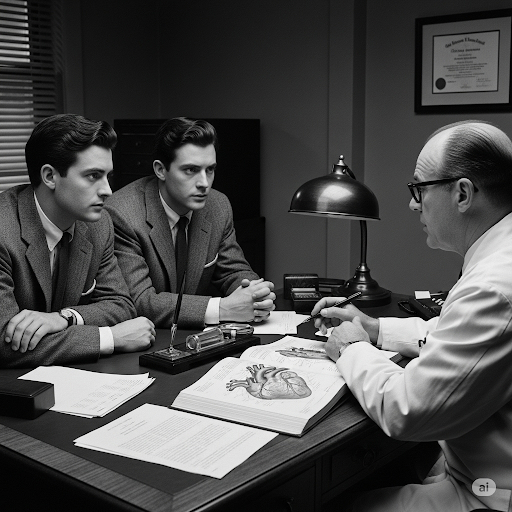
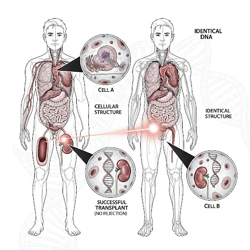
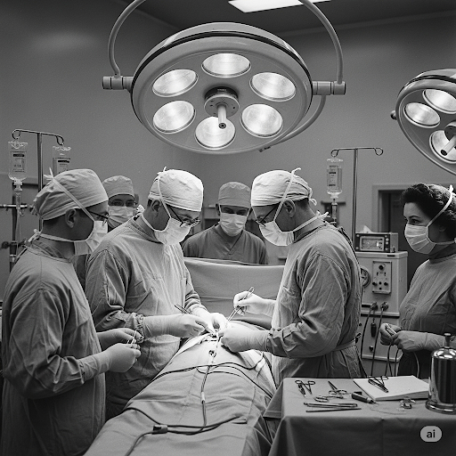
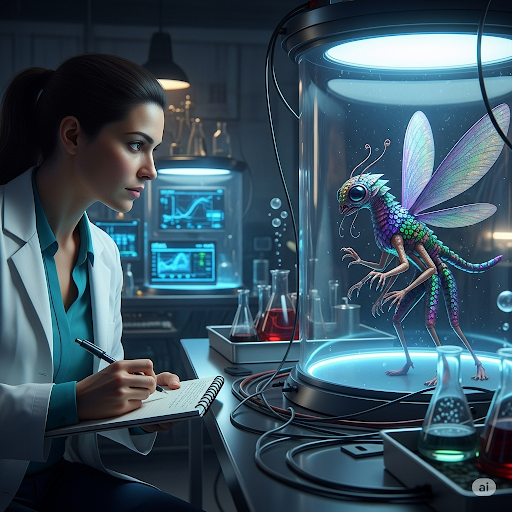
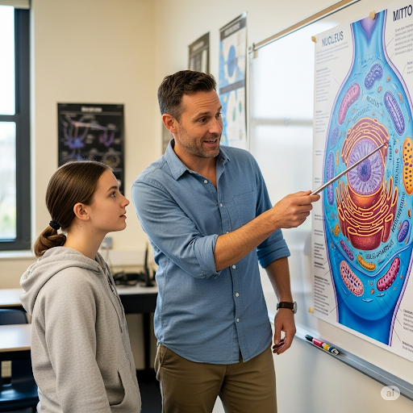
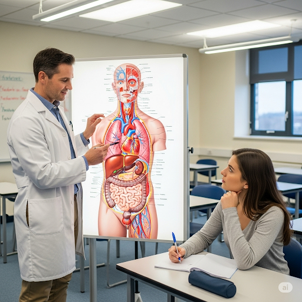
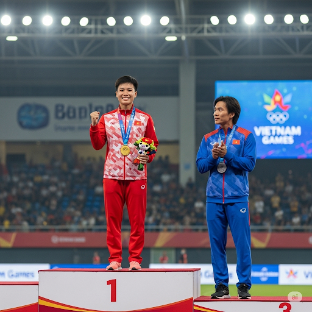
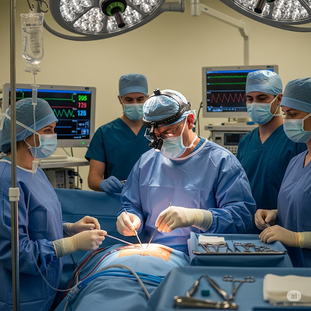

# The First Organ Transplant

In 1954, a man named Richard was dying of kidney disease. He wouldn’t survive for long unless he got a new kidney right away. Richard’s twin brother, Robert, was willing to donate one of his kidneys to his dying brother. At the time, however, no doctor had ever performed a successful internal organ transplant. The idea of taking an organ out of one person and putting it into another was just a fantasy. But the brothers decided to be brave and found a doctor who could make organ transplants a reality.

Since Richard and Robert were twins, their heredity was identical. They had the exact same biological traits. Even their kidneys were identical on the cellular level. Therefore, Robert’s working kidney could be substituted for Richard’s bad one. Richard’s body could adapt to the new organ if the operation was done correctly.

The twins went to Dr. Murray, who was a pioneer of new surgical methods. His dynamic team of surgeons performed the transplant. Dr. Murray made sure his surgeons followed a rigid sequence of directions so that no mistakes were made. First, they made a minimal cut in Richard’s side and removed the bad kidney. Then, they made another small cut in Robert’s side, removed his kidney, and transferred it into Richard’s body. Finally, they sewed up the respective cuts. The entire operation only took about one hour.

After the surgery, it was clear that both brothers were going to be OK. The operation was confirmed a success. Richard’s new kidney worked great! Doctors prescribed medicine for the pain caused by the surgery. Since Richard was still weak, he used physical therapy to revive his strength. At last, Richard’s transition into a healthy, happy person was complete.

Dr. Murray became a hero in the medical world. His success gave other doctors confidence to try organ transplants themselves. Now, doctors perform life-saving transplants and surgeries every day.

## Sentences of story

The First Organ Transplant

In 1954, a man named Richard was dying of kidney disease.

He wouldn’t survive for long unless he got a new kidney right away.

Richard’s twin brother, Robert, was willing to donate one of his kidneys to his dying brother.

At the time, however, no doctor had ever performed a successful internal organ transplant.

The idea of taking an organ out of one person and putting it into another was just a fantasy.

But the brothers decided to be brave and found a doctor who could make organ transplants a reality.

Since Richard and Robert were twins, their heredity was identical.

They had the exact same biological traits.

Even their kidneys were identical on the cellular level.

Therefore, Robert’s working kidney could be substituted for Richard’s bad one.

Richard’s body could adapt to the new organ if the operation was done correctly.

The twins went to Dr. Murray, who was a pioneer of new surgical methods.

His dynamic team of surgeons performed the transplant.

Dr. Murray made sure his surgeons followed a rigid sequence of directions so that no mistakes were made.

First, they made a minimal cut in Richard’s side and removed the bad kidney.

Then, they made another small cut in Robert’s side, removed his kidney, and transferred it into Richard’s body.

Finally, they sewed up the respective cuts.

The entire operation only took about one hour.

After the surgery, it was clear that both brothers were going to be OK.

The operation was confirmed a success.

Richard’s new kidney worked great!

Doctors prescribed medicine for the pain caused by the surgery.

Since Richard was still weak, he used physical therapy to revive his strength.

At last, Richard’s transition into a healthy, happy person was complete.

Dr. Murray became a hero in the medical world.

His success gave other doctors confidence to try organ transplants themselves.

Now, doctors perform life-saving transplants and surgeries every day.

## List of word

adapt, biological, cellular, dynamic, fantasy, heredity, internal, minimal, pioneer, prescribe, respective, revive, rigid, sequence, substitute, surgeon, therapy, transfer, transition, transplant

## 1. adapt

### IPA: /əˈdæpt/
### Class: v
### Câu truyện ẩn dụ: 

<!-- khoảng 200 từ -->

Một nhà thám hiểm bị lạc vào một khu rừng rậm. Ban đầu, anh ta rất khó khăn. Nhưng rồi anh ta học cách tìm thức ăn và làm chỗ ở từ cành cây. Anh ta tự nhủ: "Mình phải 'à, đáp' lại những thử thách của thiên nhiên, phải thay đổi để sống sót." Hành động "à, đáp" lại hoàn cảnh, tức là tìm ra câu trả lời và thay đổi cho phù hợp, đã trở thành "adapt" - thích nghi.

### Định nghĩa : 
Thay đổi để phù hợp với một tình huống mới hoặc khác.

### English definition: 
To change, or to change something, to suit different conditions or uses.

### Sentence of stroy:
Richard’s body could **adapt** to the new organ if the operation was done correctly.

### Ví dụ thông dụng:

1. It took him a while to adapt to his new school.
2. Many species have adapted to live in desert environments.

## 2. biological

### IPA: /ˌbaɪ.əˈlɒdʒ.ɪ.kəl/
### Class: adj
### Câu truyện ẩn dụ:
Một nhà khoa học đang nghiên cứu một loài sinh vật lạ. Ông dành cả ngày để ghi chép về cách nó ăn, ngủ, và sinh sản. Ông nói: "Mọi thứ về nó đều 'bài ở logic cả'. Tức là, mọi hoạt động sống của nó đều tuân theo một logic riêng của sinh học." Cách nói "bài ở logic cả" đó đã được dùng để mô tả những gì thuộc về sự sống và các cơ thể sống, và trở thành "biological".

### Định nghĩa :
Liên quan đến sự sống và các cơ thể sống.

### English definition:
Connected with the natural processes of living things.

### Sentence of stroy:
They had the exact same **biological** traits.

### Ví dụ thông dụng:
1. The biological clock controls our sleep patterns.
2. He is her biological father.

## 3. cellular

### IPA: /ˈsel.jə.lər/
### Class: adj
### Câu truyện ẩn dụ:
Một giáo viên sinh học đang giải thích về cấu trúc cơ thể. "Cơ thể chúng ta được tạo thành từ hàng tỷ đơn vị nhỏ li ti gọi là tế bào," cô nói. "Chúng nhỏ đến mức, nếu 'sờ lùa' vào da, ta cũng không cảm nhận được từng cái một." Cô nhấn mạnh tầm quan trọng của những đơn vị nhỏ bé này. Từ "sờ lùa" đó đã gợi ý cho từ "cellular", có nghĩa là thuộc về tế bào.

### Định nghĩa :
Liên quan đến các tế bào của động vật hoặc thực vật.

### English definition:
Connected with or consisting of the cells of a living thing.

### Sentence of stroy:
Even their kidneys were identical on the **cellular** level.

### Ví dụ thông dụng:
1. Cellular biology is a fascinating field of study.
2. The virus causes damage at the cellular level.

## 4. dynamic

### IPA: /daɪˈnæm.ɪk/
### Class: adj
### Câu truyện ẩn dụ:
Có một vị lãnh đạo trẻ rất năng nổ. Anh ta luôn có những ý tưởng mới mẻ và thúc đẩy mọi người làm việc hết mình. Mọi người nói rằng anh ta như một cỗ máy, lúc nào cũng "đầy năng-lực". Cách nói "đầy năng-lực" này, với sự nhiệt huyết và sức mạnh, đã được rút gọn và biến đổi thành "dynamic", có nghĩa là năng động, đầy năng lượng.

### Định nghĩa :
(của một người) có nhiều ý tưởng và nhiệt huyết; (của một quá trình) liên tục thay đổi hoặc hoạt động.

### English definition:
Having a lot of ideas and enthusiasm; continuously changing or developing.

### Sentence of stroy:
His **dynamic** team of surgeons performed the transplant.

### Ví dụ thông dụng:
1. She's a dynamic and ambitious person.
2. The business world is a dynamic environment.

## 5. fantasy

### IPA: /ˈfæn.tə.si/
### Class: n
### Câu truyện ẩn dụ:
Một cậu bé suốt ngày mơ mộng về những thế giới phép thuật. Cậu tưởng tượng mình là hiệp sĩ chiến đấu với rồng. Mẹ cậu thường nói: "Con đừng có 'phân tâm-suy' nghĩ lung tung nữa, hãy tập trung vào bài vở đi." Nhưng chính những lúc "phân tâm-suy" nghĩ đó đã tạo ra những câu chuyện kỳ ảo tuyệt vời. Từ đó, "fantasy" được dùng để chỉ sự tưởng tượng, mộng tưởng.

### Định nghĩa :
Một tình huống được tưởng tượng bởi một cá nhân nhưng không có thật.

### English definition:
A situation or an idea that is exciting and unusual but that is not real or likely to happen.

### Sentence of stroy:
The idea of taking an organ out of one person and putting it into another was just a **fantasy**.

### Ví dụ thông dụng:
1. He lives in a fantasy world of his own.
2. The Lord of the Rings is a classic fantasy novel.

## 6. heredity

### IPA: /həˈred.ə.ti/
### Class: n
### Câu truyện ẩn dụ:
Một gia đình có truyền thống làm nghệ sĩ. Ông nội là họa sĩ, cha là nhạc sĩ, và con trai có năng khiếu điêu khắc. Mọi người nói rằng tài năng nghệ thuật của gia đình này cứ 'hễ ra đời thì' có. Cái quy luật "hễ ra đời thì" có những đặc điểm giống cha ông đó chính là di truyền. Từ "hễ ra đời thì" được biến tấu thành "heredity".

### Định nghĩa :
Sự truyền lại các đặc điểm thể chất hoặc tinh thần từ thế hệ này sang thế hệ khác.

### English definition:
The process by which physical and mental qualities are passed from a parent to a child.

### Sentence of stroy:
Since Richard and Robert were twins, their **heredity** was identical.

### Ví dụ thông dụng:
1. Heredity plays a major role in determining our height.
2. She believed that personality was a matter of heredity.

## 7. internal

### IPA: /ɪnˈtɜː.nəl/
### Class: adj
### Câu truyện ẩn dụ:
Một bác sĩ đang giải thích về cơ thể con người cho một sinh viên. "Chúng ta có các cơ quan bên ngoài như mắt, mũi, tay, chân. Nhưng bên 'in' (trong) cơ thể, còn có 'tơ-nan' (nhiều thứ) phức tạp hơn nhiều, như tim, gan, phổi." Việc nhấn mạnh vào những gì ở "bên trong, tơ-nan" đó đã tạo ra từ "internal", có nghĩa là bên trong, nội bộ.

### Định nghĩa :
Ở bên trong hoặc thuộc về bên trong của một cái gì đó.

### English definition:
Existing or happening inside a person, object, organization, place, or country.

### Sentence of stroy:
At the time, however, no doctor had ever performed a successful **internal** organ transplant.

### Ví dụ thông dụng:
1. The medicine is not for internal use.
2. He suffered internal injuries in the accident.

## 8. minimal

### IPA: /ˈmɪn.ɪ.məl/
### Class: adj
### Câu truyện ẩn dụ:
Một nghệ sĩ theo trường phái tối giản. Các tác phẩm của ông chỉ có vài đường nét và màu sắc cơ bản. Ông nói: "Nghệ thuật của tôi chỉ cần 'mini-mồ'. Tức là, mọi thứ đều ở mức 'mini', mức tối thiểu nhất có thể." Triết lý "mini-mồ" đó đã trở thành "minimal", có nghĩa là rất nhỏ, tối thiểu.

### Định nghĩa :
Rất nhỏ về số lượng hoặc mức độ; tối thiểu.

### English definition:
Very small in amount or degree; the least possible.

### Sentence of stroy:
First, they made a **minimal** cut in Richard’s side and removed the bad kidney.

### Ví dụ thông dụng:
1. The storm caused only minimal damage.
2. We need to keep costs to a minimal level.

## 9. pioneer

### IPA: /ˌpaɪəˈnɪər/
### Class: n
### Câu truyện ẩn dụ:
Những người đầu tiên di cư đến miền Tây nước Mỹ phải đối mặt với vô vàn khó khăn. Họ phải tự khai hoang, xây nhà, và tìm nguồn nước. Họ thường phải 'bài binh' bố trận để chống lại thú dữ và tự 'níu' lấy sự sống. Những người "bài-binh-níu" sự sống, những người đi đầu và mở đường đó được gọi là "pioneer", tức là người tiên phong.

### Định nghĩa :
Một người trong số những người đầu tiên khám phá hoặc định cư ở một vùng đất mới; người đi đầu trong một lĩnh vực.

### English definition:
A person who is one of the first people to do something.

### Sentence of stroy:
The twins went to Dr. Murray, who was a **pioneer** of new surgical methods.

### Ví dụ thông dụng:
1. He was a pioneer in the field of aviation.
2. The pioneers faced many hardships.

## 10. prescribe

### IPA: /prɪˈskraɪb/
### Class: v
### Câu truyện ẩn dụ:
Một bệnh nhân đến gặp bác sĩ và than phiền về chứng mất ngủ. Bác sĩ sau khi khám đã nói: "Tôi 'phải ghi ra đây' một loại thuốc cho ông. Ông phải uống đúng theo chỉ dẫn." Hành động "phải ghi ra đây", tức là viết ra một đơn thuốc có thẩm quyền, đã được gọi là "prescribe" - kê đơn.

### Định nghĩa :
(của một bác sĩ) khuyên và cho phép sử dụng (một loại thuốc hoặc phương pháp điều trị) cho ai đó.

### English definition:
(of a doctor) to say what medical treatment someone should have.

### Sentence of stroy:
Doctors **prescribed** medicine for the pain caused by the surgery.

### Ví dụ thông dụng:
1. The doctor prescribed some painkillers.
2. What would you prescribe for this problem?

## 11. respective

### IPA: /rɪˈspek.tɪv/
### Class: adj
### Câu truyện ẩn dụ:
Trong một buổi trao giải, hai vận động viên, An và Bình, cùng lên nhận huy chương. Người dẫn chương trình nói: "Xin chúc mừng An và Bình. Xin mời hai bạn về 'vị trí riêng' của mình để nhận huy chương vàng và bạc." Việc nhấn mạnh mỗi người có một "vị trí riêng" và phần thưởng "riêng" đã tạo ra từ "respective", có nghĩa là tương ứng, của riêng từng người.

### Định nghĩa :
Thuộc về hoặc liên quan riêng biệt đến mỗi người hoặc vật trong số hai hoặc nhiều người/vật đã được đề cập.

### English definition:
Relating or belonging to each of the separate people or things you have just mentioned.

### Sentence of stroy:
Finally, they sewed up the **respective** cuts.

### Ví dụ thông dụng:
1. The two friends went back to their respective homes.
2. Everyone received a score based on their respective performance.

## 12. revive

### IPA: /rɪˈvaɪv/
### Class: v
### Câu truyện ẩn dụ:
Một cái cây héo úa vì thiếu nước. Một cậu bé thấy vậy liền mang nước đến tưới cho nó. Vài giờ sau, cái cây tươi tỉnh trở lại. Cậu bé reo lên: "Nó 'lại-vui-vẻ' rồi!". Hành động làm cho một thứ gì đó "lại vui vẻ", tức là làm cho nó sống lại, hồi sinh, đã được gọi là "revive".

### Định nghĩa :
Phục hồi sự sống hoặc ý thức; làm cho cái gì đó trở nên mạnh mẽ, khỏe mạnh hoặc hoạt động trở lại.

### English definition:
To come or bring someone or something back to life, health, or existence.

### Sentence of stroy:
Since Richard was still weak, he used physical therapy to **revive** his strength.

### Ví dụ thông dụng:
1. The paramedics tried to revive him.
2. They are trying to revive the local economy.

## 13. rigid

### IPA: /ˈrɪdʒ.ɪd/
### Class: adj
### Câu truyện ẩn dụ:
Một vị tướng già nổi tiếng là người rất nghiêm khắc và cứng nhắc. Mọi quy tắc ông đặt ra đều không thể thay đổi. Một người lính mới nói với bạn: "Ông ấy 'rất-rắn'. Mọi thứ phải răm rắp theo lệnh, không có linh động gì cả." Sự "rất rắn" và không thể uốn cong đó đã tạo nên từ "rigid", có nghĩa là cứng, không linh hoạt.

### Định nghĩa :
Không thể uốn cong hoặc bị ép thay đổi hình dạng; không linh hoạt.

### English definition:
Stiff or fixed; not able to be bent or moved.

### Sentence of stroy:
His dynamic team of surgeons followed a **rigid** sequence of directions so that no mistakes were made.

### Ví dụ thông dụng:
1. He has very rigid views on education.
2. The support is made of a rigid plastic.

## 14. sequence

### IPA: /ˈsiː.kwəns/
### Class: n
### Câu truyện ẩn dụ:
Một nhà ảo thuật đang trình diễn một tiết mục. Ông thực hiện một loạt các hành động theo một thứ tự chính xác để tạo ra điều kỳ diệu. Khán giả thán phục và tự hỏi: "Sao ông ấy có thể 'ghi nhớ' (see-quence) chính xác từng bước như vậy?". Việc thực hiện các hành động theo một chuỗi, một trình tự được "ghi nhớ" sẵn đã được gọi là "sequence".

### Định nghĩa :
Một chuỗi các sự kiện hoặc sự vật liên quan theo một thứ tự cụ thể.

### English definition:
A series of related things or events, or the order in which they follow each other.

### Sentence of stroy:
His dynamic team of surgeons followed a rigid **sequence** of directions so that no mistakes were made.

### Ví dụ thông dụng:
1. The events happened in a strange sequence.
2. He described the sequence of events leading up to the accident.

## 15. substitute

### IPA: /ˈsʌb.stɪ.tʃuːt/
### Class: v
### Câu truyện ẩn dụ:
Trong một trận bóng đá, một cầu thủ bị chấn thương. Huấn luyện viên gọi một cầu thủ dự bị vào sân và nói: "Cậu 'sắp-sửa-thế-chỗ' cho anh ấy. Hãy vào sân và thi đấu hết mình." Hành động "sắp-sửa-thế-chỗ" đó, tức là thay thế cho ai đó hoặc cái gì đó, đã trở thành "substitute".

### Định nghĩa :
Sử dụng ai đó hoặc cái gì đó thay cho một người hoặc vật khác.

### English definition:
To use something or someone instead of another thing or person.

### Sentence of stroy:
Therefore, Robert’s working kidney could be **substituted** for Richard’s bad one.

### Ví dụ thông dụng:
1. You can substitute oil for butter in this recipe.
2. The coach substituted the injured player.

## 16. surgeon

### IPA: /ˈsɜː.dʒən/
### Class: n
### Câu truyện ẩn dụ:
Một cậu bé tò mò hỏi cha mình, một bác sĩ phẫu thuật: "Sao người ta lại gọi bố là 'sơ-dần'?". Người cha cười và giải thích: "Vì công việc của bố đòi hỏi phải 'sờ-dần' và xử lý các cơ quan bên trong cơ thể một cách cẩn thận và chính xác." Cái tên "sơ-dần" (sờ-dần) ngộ nghĩnh đó đã gắn liền với hình ảnh người bác sĩ thực hiện các ca mổ, và trở thành "surgeon".

### Định nghĩa :
Một bác sĩ được đào tạo để thực hiện các ca phẫu thuật.

### English definition:
A doctor who is specially trained to perform medical operations.

### Sentence of stroy:
His dynamic team of **surgeons** performed the transplant.

### Ví dụ thông dụng:
1. The surgeon performed a life-saving operation.
2. She is a top heart surgeon.

## 17. therapy

### IPA: /ˈθer.ə.pi/
### Class: n
### Câu truyện ẩn dụ:
Một người bị đau lưng mãn tính. Anh ta đã thử nhiều cách nhưng không khỏi. Cuối cùng, anh ta tìm đến một chuyên gia vật lý trị liệu. Sau vài buổi tập, anh ta cảm thấy đỡ hơn nhiều và nói: "Thế là 'thấy-ra-phí' công đi tìm thầy thuốc bấy lâu. Phương pháp này mới hiệu quả." Cách nói "thấy-ra-phí" đã bị đọc trại đi thành "therapy", mang ý nghĩa là một phương pháp trị liệu, chữa bệnh.

### Định nghĩa :
Phương pháp điều trị nhằm giảm bớt hoặc chữa lành một chứng rối loạn.

### English definition:
A treatment that helps someone feel better, grow stronger, etc., especially after an illness.

### Sentence of stroy:
Since Richard was still weak, he used physical **therapy** to revive his strength.

### Ví dụ thông dụng:
1. He is receiving therapy for his back problems.
2. Speech therapy helped the child to speak clearly.

## 18. transfer

### IPA: /trænsˈfɜːr/
### Class: v
### Câu truyện ẩn dụ:
Một công ty quyết định chuyển văn phòng sang một tòa nhà mới. Giám đốc thông báo cho nhân viên: "Chúng ta sẽ 'chuyển-phòng' vào cuối tháng này. Mọi người hãy chuẩn bị đồ đạc cá nhân." Hành động "chuyển phòng" từ nơi này sang nơi khác, tức là di chuyển, đã được gọi là "transfer".

### Định nghĩa :
Di chuyển ai đó hoặc cái gì đó từ nơi này đến nơi khác.

### English definition:
To move someone or something from one place to another.

### Sentence of stroy:
Then, they made another small cut in Robert’s side, removed his kidney, and **transferred** it into Richard’s body.

### Ví dụ thông dụng:
1. I need to transfer some money to my savings account.
2. He was transferred to a different department.

## 19. transition

### IPA: /trænˈzɪʃ.ən/
### Class: n
### Câu truyện ẩn dụ:
Một con sâu đang chuẩn bị hóa thành bướm. Nó tự tạo một cái kén bao bọc lấy mình. Giai đoạn này là một sự thay đổi lớn. Nó giống như đang "chuyển-sang-sinh-thể" mới. Quá trình "chuyển-sang-sinh-thể" này, tức là quá trình chuyển đổi từ trạng thái này sang trạng thái khác, đã được gọi là "transition".

### Định nghĩa :
Quá trình hoặc một giai đoạn thay đổi từ trạng thái này sang trạng thái khác.

### English definition:
A process or period of changing from one state or condition to another.

### Sentence of stroy:
At last, Richard’s **transition** into a healthy, happy person was complete.

### Ví dụ thông dụng:
1. The transition from school to work can be difficult.
2. The country is in the process of transition to democracy.

## 20. transplant

### IPA: /ˈtræns.plɑːnt/
### Class: n
### Câu truyện ẩn dụ:
Một người làm vườn đang cấy một cái cây từ chậu nhỏ sang một mảnh đất lớn hơn. Ông nói: "Phải 'trồng-sang' chỗ này để nó có không gian phát triển." Hành động "trồng sang", tức là di chuyển và cấy một cái gì đó (như cây, hoặc trong y học là cơ quan) từ nơi này sang nơi khác, đã được gọi là "transplant".

### Định nghĩa :
Một ca phẫu thuật trong đó một cơ quan hoặc mô được cấy ghép.

### English definition:
A medical operation in which a new organ or tissue is put into someone's body.

### Sentence of stroy:
His success gave other doctors confidence to try organ **transplants** themselves.

### Ví dụ thông dụng:
1. He is waiting for a heart transplant.
2. The doctor will transplant the kidney tomorrow.