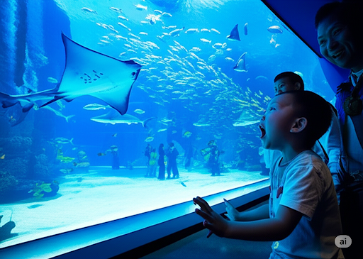
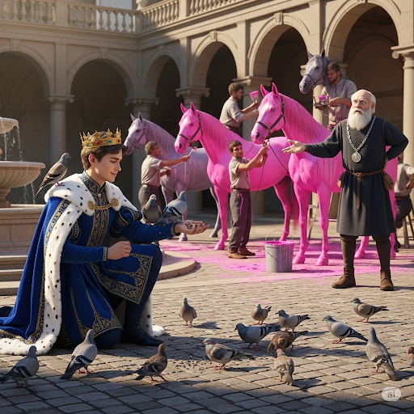
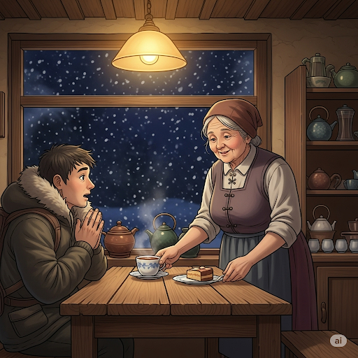

# The Lottery

Joe was watching television when he heard a knock at the door. He thought, “Who could that be? It’s probably one of the naughty neighborhood children.” Joe stood up and walked to the door. When he opened it, he saw a beautiful woman.

She said, “Good morning, Joe! I have great news. You’re the recipient of this check for one million dollars! You won the lottery!”

Joe couldn’t believe it. His mind was overloaded with emotions. Joe said, “Thankyou! Thank you!”

After he calmed down, Joe made a photocopy of the check in case he misplaced the original one. He sat and thought about what he wanted to do with the money. He didn’t want to spend it in an arbitrary way. Joe thought, “I know there are others who need this money more than I do. I’ve always loved animals, so I think I’ll buy things for the zoo!”

Joe knew that the zoo was in bad shape. The cages were too small, and they weren’t insulated from the cold. Animals couldn’t thrive in such conditions.

He took out some stationery and wrote a letter to the zoo. He offered to help the zoo buy huge cages for the large mammals and reptiles. He offered to buy healthy food for the orangutans to increase their longevity. He even said that he would buy new glass walls for the aquarium because the old ones were cracked.

Joe’s act of philanthropy intrigued the zookeeper. He probed Joe to learn why he spent his money to improve the zoo. It wasn’t a social convention for a person to be so gracious.

Joe told the zookeeper, “I know it’s not the norm, but my ultimate decision to help these animals is better than anything I could have done for myself. If I ever write an autobiography, I will write that this was the happiest day of my life.”

## Sentences of story

The Lottery

Joe was watching television when he heard a knock at the door.

He thought, “Who could that be? It’s probably one of the naughty neighborhood children.”

Joe stood up and walked to the door.

When he opened it, he saw a beautiful woman.

She said, “Good morning, Joe! I have great news. You’re the recipient of this check for one million dollars! You won the lottery!”

Joe couldn’t believe it.

His mind was overloaded with emotions.

Joe said, “Thankyou! Thank you!”

After he calmed down, Joe made a photocopy of the check in case he misplaced the original one.

He sat and thought about what he wanted to do with the money.

He didn’t want to spend it in an arbitrary way.

Joe thought, “I know there are others who need this money more than I do. I’ve always loved animals, so I think I’ll buy things for the zoo!”

Joe knew that the zoo was in bad shape.

The cages were too small, and they weren’t insulated from the cold.

Animals couldn’t thrive in such conditions.

He took out some stationery and wrote a letter to the zoo.

He offered to help the zoo buy huge cages for the large mammals and reptiles.

He offered to buy healthy food for the orangutans to increase their longevity.

He even said that he would buy new glass walls for the aquarium because the old ones were cracked.

Joe’s act of philanthropy intrigued the zookeeper.

He probed Joe to learn why he spent his money to improve the zoo.

It wasn’t a social convention for a person to be so gracious.

Joe told the zookeeper, “I know it’s not the norm, but my ultimate decision to help these animals is better than anything I could have done for myself.

If I ever write an autobiography, I will write that this was the happiest day of my life.”

## List of word

aquarium, arbitrary, autobiography, convention, gracious, improve, insulate, intrigue, longevity, misplace, naughty, norm, orangutan, overload, philanthropy, probe, recipient, reptile, thrive, ultimate

## 1. aquarium

### IPA: /əˈkweə.ri.əm/
### Class: n
### Câu truyện ẩn dụ: 
An, một cậu bé lớn lên ở vùng núi cao, lần đầu tiên được chú đưa xuống thành phố biển. Điều khiến cậu choáng ngợp nhất không phải là những toà nhà chọc trời, mà là một công trình kỳ lạ mà chú cậu gọi là thuỷ cung. Bên trong, một bức tường kính khổng lồ ngăn cách cậu với một thế giới đại dương thu nhỏ. Lần đầu tiên trong đời, An thấy cá mập lướt đi oai vệ, những đàn cá nhỏ lấp lánh như châu báu, và một con cá đuối khổng lồ như đang bay lượn trong nước. Âm thanh của bong bóng nước sủi bọt, tiếng người xem trầm trồ, và sự chuyển động không ngừng của hàng trăm sinh vật tạo nên một khung cảnh hỗn hợp đầy sức sống. Áp mặt vào tấm kính mát lạnh, An quay sang chú và hét lên để át đi tiếng ồn: "Chú ơi! Ở đây 'A! Quá-rì-ầm!'". Cậu bé vừa diễn tả sự ngạc nhiên "A!", vừa nói về sự "quá ầm ĩ" và "quá nhiều" sinh vật. Người chú bật cười, giải thích rằng nơi này được gọi là "aquarium", và tiếng kêu của An đã vô tình nắm bắt được hoàn hảo cái hồn của nó.

### Định nghĩa : 
Một bể kính trong đó cá và các sinh vật dưới nước khác được nuôi giữ.

### English definition: 
A glass tank in which fish and other water creatures are kept.

### Sentence of stroy:
He even said that he would buy new glass walls for the **aquarium** because the old ones were cracked.

### Ví dụ thông dụng:

1. We have a small aquarium with two goldfish.
2. The city's aquarium is a popular tourist attraction.

## 2. arbitrary

### IPA: /ˈɑː.bɪ.trər.i/
### Class: adj
### Câu truyện ẩn dụ:
Ở một vương quốc nọ, có một vị vua trẻ nổi tiếng với việc ra quyết định hết sức kỳ quặc. Ngài không dựa vào luật lệ, cố vấn hay nhu cầu của dân chúng, mà chỉ dựa vào ý thích bất chợt của mình. Một buổi sáng, ngài ra lệnh rằng tất cả ngựa trong vương quốc phải được sơn màu hồng. Các vị đại thần vô cùng bối rối. Vị tể tướng già cẩn trọng hỏi: "Tâu bệ hạ, quyết định này dựa trên cơ sở nào ạ? Nó có lợi ích gì cho quốc gia không?". Vị vua, đang thản nhiên cho chim ăn, nhún vai đáp: "Không có cơ sở nào cả. Ta chỉ thích thế thôi." Vị tể tướng cố gắng thuyết phục: "Nhưng luật pháp cần có lý trí, cần có mục đích ạ." Vua bèn nổi cáu và quát: "'Ai-biểu-tui-lì' mà dám chất vấn ta? (Ai bảo ta phải lì lợm/cứng đầu mà dám cãi lại?). Ta là vua, ý thích của ta là luật pháp." Các quyết định của ngài không bao giờ tuân theo một logic nào, chúng hoàn toàn ngẫu hứng. Các sử gia trong triều, khi ghi chép về triều đại của ông, đã tạo ra một từ để mô tả phong cách cai trị này, bắt nguồn từ câu nói thách thức của nhà vua. Họ gọi đó là "arbitrary" - một quyết định tùy tiện, không dựa trên bất kỳ lý do hay hệ thống nào.

### Định nghĩa :
Dựa trên cơ hội hoặc ý thích cá nhân hơn là bất kỳ lý do hoặc hệ thống nào; tùy tiện.

### English definition:
Based on chance or personal whim rather than any reason or system.

### Sentence of stroy:
He didn’t want to spend it in an **arbitrary** way.

### Ví dụ thông dụng:
1. The choice of players seemed completely arbitrary.
2. He made an arbitrary decision.

## 3. autobiography

### IPA: /ˌɔː.tə.baɪˈɒɡ.rə.fi/
### Class: n
### Câu truyện ẩn dụ:
Ông Ba, một ngư dân già đã nghỉ hưu, là một huyền thoại sống ở làng chài. Cả cuộc đời ông gắn liền với biển cả, với những chuyến đi bão táp và những câu chuyện về những loài cá khổng lồ. Lũ trẻ trong làng rất thích quây quần bên ông mỗi chiều để nghe kể chuyện. Một hôm, cô cháu gái nhỏ của ông nói: "Ông ơi, chuyện của ông hay quá. Ông viết thành sách đi để sau này chúng cháu và mọi người còn được đọc." Ông Ba cười hiền, ánh mắt xa xăm nhìn ra biển. "Ý hay đấy cháu ạ. Nhưng ông sẽ không chỉ viết truyện. Ông sẽ viết lại cả cuộc đời mình. Ông sẽ 'tự-tôi-ghi-lại' tất cả, từ lúc còn là một cậu bé chân trần học vá lưới cho đến những ngày lênh đênh trên biển, cả niềm vui và nỗi buồn." Ông mua giấy bút và bắt đầu viết. Ông viết về gia đình, về những người bạn đã mất trên biển, về những lần đối mặt với hiểm nguy. Cuốn sách đó không chỉ là những cuộc phiêu lưu, mà là cả tâm hồn ông. Một nhà xuất bản tình cờ đọc được bản thảo và vô cùng xúc động. "Thể loại sách mà một người tự viết về cuộc đời mình như thế này," ông nói, "chúng ta sẽ gọi nó là 'autobiography'. Nó xuất phát từ tiếng Hy Lạp: 'auto' (tự thân), 'bio' (sự sống), và 'graphy' (viết). Thật hoàn hảo để mô tả những gì ông Ba đã làm - 'tự-tôi-ghi-lại'."

### Định nghĩa :
Một cuốn sách về cuộc đời của một người, do chính người đó viết.

### English definition:
A book about a person's life, written by that person.

### Sentence of stroy:
If I ever write an **autobiography**, I will write that this was the happiest day of my life.

### Ví dụ thông dụng:
1. He published his autobiography last year.
2. Many celebrities write their autobiographies.

## 4. convention

### IPA: /kənˈven.ʃən/
### Class: n
### Câu truyện ẩn dụ:
Một nhà nhân chủng học người Canada tên là David đến một ngôi làng cổ ở miền Bắc Việt Nam để nghiên cứu về văn hóa. Anh đến đúng vào dịp làng chuẩn bị cho lễ hội đình làng, một sự kiện trọng đại diễn ra hàng năm. David quan sát thấy mọi việc dường như tuân theo một quy tắc bất thành văn. Đàn ông thì tập trung ở sân đình để chuẩn bị kiệu và lễ vật, phụ nữ thì ở nhà làm những loại bánh đặc trưng, còn người già thì kể cho con cháu nghe về sự tích của vị thành hoàng làng. Đến ngày chính hội, tất cả mọi người đều mặc trang phục truyền thống và tham gia vào các nghi lễ một cách trang nghiêm. David cảm thấy mình như người ngoài cuộc trong bộ quần áo hiện đại. Anh quay sang người hướng dẫn của mình và hỏi: "Tất cả những điều này 'có-phải-văn-sự-thông-thường' ở đây không? Ý tôi là, đây là một quy tắc xã hội mà mọi người đều tuân theo sao?". Người hướng dẫn gật đầu: "Đúng vậy, đây là 'convention' của làng chúng tôi, là tục lệ, là nếp sống đã được truyền từ đời này sang đời khác." David ghi chép lại, từ "convention" nghe tựa như câu hỏi của anh, nó mô tả hoàn hảo những quy tắc, tập quán xã hội được chấp nhận rộng rãi này.

### Định nghĩa :
Một cách hành xử được coi là bình thường và truyền thống trong một nhóm hoặc xã hội cụ thể.

### English definition:
A way in which something is usually done; a custom.

### Sentence of stroy:
It wasn’t a social **convention** for a person to be so gracious.

### Ví dụ thông dụng:
1. It's a social convention to say "thank you" when someone gives you a gift.
2. He is a man who defies convention.

## 5. gracious

### IPA: /ˈɡreɪ.ʃəs/
### Class: adj
### Câu truyện ẩn dụ:
Trong một thị trấn nhỏ, có một tiệm trà cũ kỹ được điều hành bởi một phụ nữ lớn tuổi tên là bà An. Dù không giàu có, bà An nổi tiếng khắp vùng vì sự tử tế và lịch thiệp của mình. Bất kể ai bước vào tiệm, dù là một vị khách sang trọng hay một người lao động nghèo khó, bà đều chào đón bằng một nụ cười ấm áp và một giọng nói nhẹ nhàng. Một ngày nọ, một du khách bị lỡ chuyến xe buýt cuối cùng và không có nơi nào để đi. Thấy anh ta ngồi co ro bên ngoài trong trời lạnh, bà An đã mời anh vào trong, pha cho anh một ấm trà nóng và mời anh một chiếc bánh ngọt mà không đòi hỏi bất cứ điều gì. Bà còn lắng nghe câu chuyện của anh với sự quan tâm chân thành. Vị khách vô cùng cảm động. Anh nghĩ: "Cách hành xử của bà ấy thật đặc biệt. Bà ấy 'gây-ra-sự' ấm áp và dễ chịu cho người khác một cách tự nhiên. Bà không chỉ tốt bụng, mà còn toát lên một vẻ thanh lịch, điềm tĩnh." Sau này, khi kể lại câu chuyện, anh luôn dùng từ "gracious" để mô tả bà An. Nó không chỉ có nghĩa là tử tế, mà còn bao hàm cả sự lịch thiệp, dễ chịu và cao quý mà bà đã "gây-ra-sự" cảm mến trong lòng anh.

### Định nghĩa :
Lịch sự, tốt bụng và dễ chịu, đặc biệt là đối với những người có địa vị xã hội thấp hơn.

### English definition:
Behaving in a pleasant, polite, calm way.

### Sentence of stroy:
It wasn’t a social convention for a person to be so **gracious**.

### Ví dụ thông dụng:
1. She was a gracious hostess.
2. He gave a gracious bow to the audience.

## 6. improve

### IPA: /ɪmˈpruːv/
### Class: v
### Câu truyện ẩn dụ:
Linh là một cô gái trẻ có niềm đam mê mãnh liệt với cây đàn violin, nhưng kỹ năng của cô vẫn còn rất non nớt. Những âm thanh cô tạo ra thường áo não và lạc điệu, khiến những người hàng xóm phải phàn nàn. Cảm thấy nản lòng, cô tìm đến một nghệ sĩ violin già và xin được chỉ giáo. Vị nghệ sĩ lắng nghe cô chơi, rồi mỉm cười nói: "Ta không thể dạy con tài năng, nhưng ta có thể chỉ con con đường. Con đường đó rất đơn giản: 'im-lặng-và-rèn-luyện'." Ông giải thích: "'Im lặng' để lắng nghe những lỗi sai của chính mình, lắng nghe tiếng đàn của những người thầy, và 'rèn luyện' không ngừng nghỉ, mỗi ngày một chút." Nghe lời khuyên, Linh không còn vội vã chơi những bản nhạc khó nữa. Cô quay lại từ những bài tập cơ bản nhất, kiên nhẫn và tập trung. Mỗi ngày, cô dành hàng giờ để "im-lặng-và-rèn-luyện", sửa từng lỗi nhỏ. Dần dần, tiếng đàn của cô trở nên trong trẻo và có hồn hơn. Cô nhận ra rằng, chìa khoá để trở nên tốt hơn chính là quá trình "improve" - cải thiện, tiến bộ, một từ nghe như lời khuyên của vị nghệ sĩ già.

### Định nghĩa :
Trở nên tốt hơn hoặc làm cho cái gì đó tốt hơn.

### English definition:
To get better, or to make something better.

### Sentence of stroy:
He probed Joe to learn why he spent his money to **improve** the zoo.

### Ví dụ thông dụng:
1. I need to improve my Spanish.
2. The weather is expected to improve tomorrow.

## 7. insulate

### IPA: /ˈɪn.sjə.leɪt/
### Class: v
### Câu truyện ẩn dụ:
Một nhà hiền triết quyết định rời xa thành phố ồn ào để sống một mình trên một ngọn núi cao, nơi mùa đông vô cùng khắc nghiệt với tuyết rơi và gió rít. Ông tự mình xây một căn nhà gỗ nhỏ. Bạn bè của ông lo lắng, cho rằng ông không thể chịu được cái lạnh thấu xương. Nhưng nhà hiền triết chỉ mỉm cười. Ông dành nhiều tuần liền để thu thập rêu khô, lá cây và đất sét. Sau đó, ông cẩn thận trát những vật liệu này vào giữa hai lớp vách gỗ của căn nhà. Một người bạn đến thăm, thấy ông đang làm việc tỉ mỉ, bèn hỏi: "Ngài đang làm gì vậy?". Nhà hiền triết, tay vẫn đang làm, đáp: "Ta đang 'in-sờ-lấy' một lớp áo cho căn nhà. Lớp áo này sẽ bảo vệ ta khỏi cái lạnh bên ngoài." Ông giải thích rằng lớp vật liệu này sẽ ngăn không cho hơi ấm bên trong thoát ra và không cho cái lạnh bên ngoài len vào. Khi mùa đông đến, trong khi cả ngọn núi chìm trong băng giá, căn nhà của ông vẫn ấm áp một cách lạ thường. Hành động "in-sờ-lấy" lớp bảo vệ để che chắn, cách ly khỏi các yếu tố bên ngoài đã được gọi là "insulate" - cách nhiệt, cách âm, hay cách điện.

### Định nghĩa :
Bảo vệ ai đó hoặc cái gì đó khỏi những ảnh hưởng không mong muốn bằng cách che phủ nó.

### English definition:
To protect something with a material that prevents heat, sound, electricity, etc. from passing through.

### Sentence of stroy:
The cages were too small, and they weren’t **insulated** from the cold.

### Ví dụ thông dụng:
1. You can insulate a house against heat loss by having the windows double-glazed.
2. The wires were insulated with a plastic coating.

## 8. intrigue

### IPA: /ɪnˈtriːɡ/
### Class: v
### Câu truyện ẩn dụ:
Thám tử K nổi tiếng với khả năng phá những vụ án hóc búa nhất. Một ngày nọ, ông được giao một vụ án kỳ lạ: một chiếc hộp nhạc cổ được tìm thấy tại hiện trường một vụ trộm, nhưng không có gì bị lấy đi. Chiếc hộp được chế tác tinh xảo, nhưng không thể mở được và cũng không phát ra nhạc. Nó hoàn toàn im lặng. Các thám tử khác cho rằng nó không quan trọng, nhưng thám tử K lại bị nó thu hút một cách lạ thường. Ông cầm chiếc hộp lên, xoay nó dưới ánh đèn, cảm nhận những đường nét chạm khắc bí ẩn. Ông lẩm bẩm: "Có một điều gì đó về nó... 'trong-trí' ta không ngừng đặt câu hỏi. Tại sao nó lại ở đây? Nó chứa đựng bí mật gì?". Sự bí ẩn của chiếc hộp đã khơi dậy sự tò mò mãnh liệt trong ông. Ông dành nhiều ngày đêm để nghiên cứu, tìm kiếm những ký hiệu ẩn và cố gắng giải mã cơ chế của nó. Chính sự hấp dẫn, bí ẩn khiến người ta phải suy nghĩ, phải tò mò, cái cảm giác khiến cho 'trong-trí' không yên đó, được gọi là "intrigue". Nó không chỉ là sự quan tâm, mà là một sự lôi cuốn mạnh mẽ bởi những điều kỳ lạ và chưa được khám phá.

### Định nghĩa :
Gây hứng thú cho ai đó rất nhiều và khiến họ muốn tìm hiểu thêm về nó.

### English definition:
To interest someone a lot, especially by being strange, mysterious, or unexpected.

### Sentence of stroy:
Joe’s act of philanthropy **intrigued** the zookeeper.

### Ví dụ thông dụng:
1. The story intrigued me from the very beginning.
2. His mysterious past intrigued her.

## 9. longevity

### IPA: /lɒnˈdʒev.ə.ti/
### Class: n
### Câu truyện ẩn dụ:
Trong một thung lũng xanh mướt, ẩn mình khỏi thế giới bên ngoài, có một ngôi làng mà người dân ở đó nổi tiếng sống rất lâu. Du khách từ khắp nơi tìm đến để hỏi bí quyết. Họ tìm gặp cụ Sáu, người cao tuổi nhất làng, đã hơn một trăm tuổi nhưng vẫn minh mẫn và khỏe mạnh. Một chàng trai trẻ sốt sắng hỏi: "Thưa cụ, bí quyết sống lâu của cụ là gì ạ? Có phải là một loại thảo dược quý hiếm nào không?". Cụ Sáu nhìn anh ta, nụ cười hiền hậu hiện trên khuôn mặt đầy nếp nhăn. Cụ chậm rãi đáp: "Bí quyết của ta đơn giản lắm. Ta không ăn sơn hào hải vị, cũng chẳng có thuốc tiên. Mỗi ngày ta làm việc vừa sức, ăn uống thanh đạm, và quan trọng nhất là giữ cho tâm hồn thanh thản." Cụ nhìn ra cánh đồng và nói tiếp, giọng vui vẻ: "Các cháu cứ nhìn cuộc sống mà xem, 'lo-gì-vội-thế?'. Cứ sống thuận theo tự nhiên, vui vẻ với những gì mình có, thì bệnh tật khó mà tìm đến." Triết lý sống "lo-gì-vội-thế", không lo âu, sống một cuộc đời dài và khỏe mạnh, đã được mọi người truyền tai nhau. Và từ đó, từ "longevity", mang ý nghĩa về tuổi thọ, về sự trường thọ, dường như cũng vang vọng triết lý sống an nhiên đó.

### Định nghĩa :
Sống lâu; tuổi thọ.

### English definition:
Long life or the long time that something lasts.

### Sentence of stroy:
He offered to buy healthy food for the orangutans to increase their **longevity**.

### Ví dụ thông dụng:
1. To what do you attribute your longevity?
2. The longevity of the machine is remarkable.

## 10. misplace

### IPA: /ˌmɪsˈpleɪs/
### Class: v
### Câu truyện ẩn dụ:
Giáo sư An là một nhà sử học uyên bác nhưng lại có tính đãng trí "kinh niên". Bàn làm việc của ông lúc nào cũng như một bãi chiến trường với sách vở và giấy tờ chất thành núi. Ông thường xuyên để quên những vật quan trọng ở những nơi không ai ngờ tới. Một buổi sáng, ông có một bài thuyết trình quan trọng tại viện hàn lâm, nhưng ông không thể tìm thấy bản thảo của mình đâu cả. Ông lục tung cả văn phòng, lẩm bẩm một mình: "Chết thật, mình lại 'bỏ-lộn-chỗ' (miss-place) nó ở đâu rồi?". Ông tìm trong tủ lạnh, dưới gầm giường, và thậm chí cả trong thùng rác, nhưng vẫn không thấy. Vợ ông, đã quá quen với tính cách này, bình tĩnh đi vào bếp và lấy ra bản thảo từ... ngăn kéo đựng gia vị. "Đây này ông," bà nói. "Ông hay có thói quen tiện tay đặt đồ xuống bất cứ đâu." Vị giáo sư thở phào nhẹ nhõm. Việc thường xuyên đặt một vật gì đó sai vị trí rồi tạm thời không thể tìm thấy, cái hành động "bỏ-lộn-chỗ" mà giáo sư An hay mắc phải, được mô tả chính xác bằng động từ "misplace".

### Định nghĩa :
Đặt một cái gì đó ở sai chỗ và không thể tìm thấy nó tạm thời.

### English definition:
To put something in the wrong place and lose it, usually for a short time.

### Sentence of stroy:
He made a photocopy of the check in case he **misplaced** the original one.

### Ví dụ thông dụng:
1. I seem to have misplaced my glasses.
2. She misplaced her trust in him.

## 11. naughty

### IPA: /ˈnɔː.ti/
### Class: adj
### Câu truyện ẩn dụ:
Tí và Tèo là hai anh em sinh đôi nổi tiếng khắp xóm vì những trò nghịch ngợm của mình. Chúng không bao giờ làm điều gì ác ý, nhưng sự hiếu động và những ý tưởng oái oăm của chúng thường khiến người lớn phải đau đầu. Một hôm, chúng thấy chú mèo mướp của nhà hàng xóm đang ngủ say sưa dưới gốc cây. Tèo thì thầm với Tí: "Hay mình vẽ một bộ ria mép cho nó đi!". Tí khúc khích đồng ý. Chúng lén lấy bút lông của mẹ, rón rén lại gần chú mèo. Khi chúng vừa chuẩn bị "hành sự" thì mẹ chúng bắt gặp. Bà không giận dữ, chỉ nghiêm giọng một cách yêu thương: "Hai đứa 'đừng-thế' (no-thi) nữa nhé! Trêu chọc bạn mèo đang ngủ là không ngoan đâu." Hai cậu bé lí nhí xin lỗi rồi chạy biến. Lời mắng yêu của người mẹ, "đừng-thế" nữa nhé, khi được đọc nhanh và lái đi một chút, nghe như "naughty". Từ này được dùng để chỉ những hành động nghịch ngợm, không vâng lời của trẻ con, nhưng thường mang hàm ý nhẹ nhàng, không quá nghiêm trọng, giống như những trò đùa của Tí và Tèo.

### Định nghĩa :
(đặc biệt là trẻ em) không vâng lời hoặc hành xử không tốt.

### English definition:
(especially of children) behaving badly; disobedient.

### Sentence of stroy:
It’s probably one of the **naughty** neighborhood children.

### Ví dụ thông dụng:
1. You've been a very naughty boy!
2. He has a naughty sense of humor.

## 12. norm

### IPA: /nɔːm/
### Class: n
### Câu truyện ẩn dụ:
Một nhà thám hiểm đi sâu vào một khu rừng và tình cờ phát hiện ra một bộ lạc sống tách biệt với thế giới bên ngoài. Anh ta được chào đón và ở lại cùng họ để tìm hiểu. Anh nhanh chóng nhận thấy một điều kỳ lạ: mỗi buổi trưa, khi mặt trời đứng bóng, tất cả mọi người trong làng, từ già đến trẻ, đều dừng mọi công việc, đi đến một con suối trong và ngâm mình trong đó khoảng mười phút trong im lặng. Không ai nói với ai câu nào. Sau đó, họ lại quay trở về với công việc thường ngày. Lấy làm lạ, anh hỏi người tù trưởng: "Tại sao mọi người lại làm vậy mỗi ngày?". Vị tù trưởng nhìn anh, dường như ngạc nhiên với câu hỏi đó. Ông đáp: "Đó là điều chúng tôi luôn làm. Đó là cách chúng tôi tỏ lòng biết ơn thần Nước. Đó là điều bình thường." Nhà thám hiểm ghi vào sổ tay: "Ở đây, việc tắm suối vào giữa trưa là một tiêu chuẩn, một quy tắc chung. 'Nôm-na' là, đó là một phần không thể thiếu trong cuộc sống của họ." Cách nói "nôm na" là... để chỉ một điều hiển nhiên, một tiêu chuẩn được chấp nhận rộng rãi, đã gợi cho anh từ "norm" - một quy chuẩn, một điều bình thường trong một xã hội cụ thể.

### Định nghĩa :
Một tiêu chuẩn hoặc cách hành xử được chấp nhận và điển hình.

### English definition:
An accepted standard or a way of behaving or doing things that most people agree with.

### Sentence of stroy:
Joe told the zookeeper, “I know it’s not the **norm**, but my ultimate decision to help these animals is better than anything I could have done for myself.

### Ví dụ thông dụng:
1. Wearing a suit to the office is the norm in many companies.
2. They were working outside the norms of the profession.

## 13. orangutan

### IPA: /əˈræŋ.ə.tæn/
### Class: n
### Câu truyện ẩn dụ:
Trong các khu rừng rậm nhiệt đới của đảo Borneo, có một loài vượn lớn với bộ lông dài màu nâu đỏ sống lặng lẽ trên những tán cây cao. Chúng dành phần lớn thời gian để di chuyển từ cành này sang cành khác, tìm kiếm trái cây và lá non. Người dân bản địa sống gần bìa rừng từ lâu đã quen thuộc với sự hiện diện của chúng. Họ thấy chúng có những hành động thông minh, cách chăm sóc con cái đầy tình cảm, và đôi mắt biểu cảm giống như con người. Vì những đặc điểm này, họ không gọi chúng đơn giản là "khỉ" hay "vượn". Trong ngôn ngữ Mã Lai của họ, họ gọi loài vật này là "Orang Hutan". "Orang" có nghĩa là "người", và "Hutan" có nghĩa là "rừng". Gộp lại, "Orang Hutan" có nghĩa là "người của rừng rậm". Cái tên này thể hiện sự tôn trọng và mối liên hệ sâu sắc mà họ cảm nhận được với loài linh trưởng này. Khi các nhà thám hiểm và nhà sinh vật học phương Tây đến đây, họ đã được giới thiệu về "người rừng". Họ đã ghi nhận và phiên âm cái tên "Orang Hutan" thành "orangutan" trong các tài liệu khoa học của mình, và cái tên đầy ý nghĩa này đã trở nên phổ biến trên toàn thế giới.

### Định nghĩa :
Một loài vượn lớn lông màu nâu đỏ, có nguồn gốc từ Borneo và Sumatra.

### English definition:
A large ape with long, reddish-brown hair, native to Borneo and Sumatra.

### Sentence of stroy:
He offered to buy healthy food for the **orangutans** to increase their longevity.

### Ví dụ thông dụng:
1. The orangutan is a critically endangered species.
2. We saw an orangutan swinging through the trees.

## 14. overload

### IPA: /ˌəʊ.vəˈləʊd/
### Class: v
### Câu truyện ẩn dụ:
Một sinh viên tên Minh đang chuẩn bị cho kỳ thi cuối kỳ quan trọng nhất trong đời sinh viên của mình. Cậu phải thi ba môn học khó nhất chỉ trong hai ngày. Cậu nhốt mình trong phòng, xung quanh là những chồng sách cao ngất, những tập ghi chú dày cộp và hàng trăm trang tài liệu. Cậu cố gắng nhồi nhét mọi kiến thức vào đầu: các công thức toán học phức tạp, những sự kiện lịch sử dài dằng dặc, và những lý thuyết triết học trừu tượng. Ban đầu, mọi thứ có vẻ ổn. Nhưng sau một ngày một đêm không ngủ, đầu óc cậu bắt đầu quay cuồng. Các con số nhảy múa trước mắt, các dòng chữ nhoè đi, và các ý tưởng bắt đầu lẫn lộn vào nhau. Cậu gục đầu xuống bàn, hai tay ôm lấy đầu và than thở: "'Ôi-vờ-lại' đầy quá rồi! Não mình không thể chứa thêm bất cứ thứ gì nữa." Cảm giác bị nhồi nhét quá nhiều thông tin, đến mức không thể xử lý được nữa, tình trạng "quá tải" mà Minh đang trải qua, được mô tả chính xác bằng từ "overload". Nó không chỉ áp dụng cho máy móc hay xe cộ, mà còn cho cả tâm trí con người khi bị đặt dưới quá nhiều áp lực.

### Định nghĩa :
Đặt quá nhiều thứ vào hoặc lên một cái gì đó.

### English definition:
To put too many things in or on something.

### Sentence of stroy:
His mind was **overloaded** with emotions.

### Ví dụ thông dụng:
1. Don't overload the washing machine.
2. The system overloaded and crashed.

## 15. philanthropy

### IPA: /fɪˈlæn.θrə.pi/
### Class: n
### Câu truyện ẩn dụ:
Có một ông lão giàu có sống trong một biệt thự lớn, nhưng ông không tiêu tiền vào những thứ xa hoa cho bản thân. Thay vào đó, ông dành toàn bộ thời gian và tài sản của mình để giúp đỡ những người có hoàn cảnh khó khăn. Ông xây dựng trường học cho trẻ em nghèo, tài trợ cho các bệnh viện, và mở những bếp ăn từ thiện. Một nhà báo trẻ được cử đến phỏng vấn ông. "Thưa ông," nhà báo hỏi, "Tại sao ông lại làm tất cả những điều này? Động lực của ông là gì?". Ông lão mỉm cười hiền từ và trả lời: "Khi ta còn trẻ, ta đã từng rất nghèo khó và nhận được sự giúp đỡ từ một người lạ. Lòng tốt đó đã thay đổi cuộc đời ta. Vì vậy, ta tự hứa với lòng mình rằng nếu có điều kiện, ta 'phải-làm-cho-đi' để trả ơn cuộc đời." Ông tiếp tục: "Giúp đỡ người khác không phải là một nghĩa vụ, mà là một niềm vui, là cách để thể hiện tình yêu thương với đồng loại." Nhà báo rất ấn tượng với câu trả lời. Lòng nhân ái, hành động cho đi một cách tự nguyện vì yêu thương con người, cái triết lý "'phải-làm-cho-đi'" của ông lão, được gọi bằng một từ trang trọng là "philanthropy".

### Định nghĩa :
Việc giúp đỡ người nghèo, đặc biệt bằng cách cho họ tiền; lòng bác ái.

### English definition:
The activity of helping the poor, especially by giving them money.

### Sentence of stroy:
Joe’s act of **philanthropy** intrigued the zookeeper.

### Ví dụ thông dụng:
1. He is well-known for his philanthropy.
2. The hospital was built thanks to the philanthropy of a local businessman.

## 16. probe

### IPA: /prəʊb/
### Class: v
### Câu truyện ẩn dụ:
Một nữ nhà báo điều tra tên Lan đang theo đuổi một vụ bê bối lớn về một công ty xả thải gây ô nhiễm môi trường. Công ty này đã che giấu hành vi của mình rất tinh vi bằng những giấy tờ giả và những lời giải thích vòng vo. Nhiều nhà báo khác đã bỏ cuộc vì không tìm được bằng chứng. Nhưng Lan thì không. Cô tin rằng sự thật đang ẩn giấu đâu đó dưới lớp vỏ bọc hoàn hảo kia. Cô bắt đầu phỏng vấn các công nhân cũ, những người dân sống gần nhà máy, và các chuyên gia môi trường. Trong mỗi cuộc phỏng vấn, cô không chỉ hỏi những câu hỏi bề mặt. Cô lắng nghe cẩn thận, quan sát những biểu cảm nhỏ nhất, và đặt những câu hỏi sâu, xoáy vào những điểm mâu thuẫn. Cô tự nhủ: "Mình phải 'phải-rờ-bóp' vào từng chi tiết, dù là nhỏ nhất, để tìm ra kẽ hở." Cô giống như một bác sĩ đang dùng dụng cụ để dò tìm vết thương ẩn sâu bên trong. Hành động điều tra một cách kỹ lưỡng, hỏi sâu để khám phá sự thật bị che giấu, giống như cách Lan "phải-rờ-bóp" vào vấn đề, được gọi là "probe" - thăm dò, dò xét.

### Định nghĩa :
Cố gắng khám phá sự thật về một cái gì đó; thăm dò.

### English definition:
To try to discover information that is secret or hidden by asking questions or searching carefully.

### Sentence of stroy:
He **probed** Joe to learn why he spent his money to improve the zoo.

### Ví dụ thông dụng:
1. The interviewer probed deep into her personal life.
2. The police probed the man's background.

## 17. recipient

### IPA: /rɪˈsɪp.i.ənt/
### Class: n
### Câu truyện ẩn dụ:
Mai là một cô gái trẻ với một tình yêu lớn dành cho hội họa. Cô đã dành nhiều năm trời trong căn gác xép nhỏ của mình, kiên trì vẽ tranh. Cô sống rất tằn tiện, dùng hết số tiền kiếm được từ công việc bán thời gian để mua toan và màu vẽ. Nhiều người nói cô đang lãng phí thời gian, nhưng cô không bỏ cuộc. Cô tin vào con đường mình đã chọn. Cô tự nhủ: "Mình 'rất-siêng-năng', nhất định sẽ có ngày công sức của mình được công nhận." Rồi một ngày, một bức thư từ một phòng trưng bày nghệ thuật danh tiếng được gửi đến. Bức thư thông báo rằng tác phẩm của cô đã giành được giải nhất trong một cuộc thi quốc gia. Đêm trao giải, khi tên cô được xướng lên, Mai bước lên sân khấu trong sự vỡ oà hạnh phúc. Cô cầm lấy chiếc cúp và bằng khen, nước mắt lưng tròng. Cô đã trở thành người nhận giải thưởng cao quý. Từ khoảnh khắc đó, cô không chỉ là một họa sĩ vô danh nữa, mà là "recipient" của một sự công nhận lớn lao. Từ này, nghe như "rất-siêng-năng-nhận", dường như là phần thưởng xứng đáng cho những nỗ lực không mệt mỏi của cô.

### Định nghĩa :
Một người nhận được một cái gì đó.

### English definition:
A person who receives something.

### Sentence of stroy:
You’re the **recipient** of this check for one million dollars!

### Ví dụ thông dụng:
1. He was the recipient of the Nobel Peace Prize.
2. The recipient of the letter did not reply.

## 18. reptile

### IPA: /ˈrep.taɪl/
### Class: n
### Câu truyện ẩn dụ:
Trong một chuyến thám hiểm rừng rậm Amazon, một nhóm sinh viên đang đi theo một hướng dẫn viên bản địa. Khu rừng đầy những âm thanh và sự sống kỳ lạ. Bất chợt, một con rắn lục với màu xanh lá cây tuyệt đẹp trườn qua con đường mòn ngay trước mặt họ. Một nữ sinh viên sợ hãi hét lên và lùi lại. Người hướng dẫn viên bình tĩnh giơ tay ra hiệu cho mọi người dừng lại. Ông nói: "Đừng hoảng sợ. Hãy giữ khoảng cách. Nó sẽ không tấn công nếu không bị đe doạ." Ông chỉ vào con rắn và giải thích: "Đây là một loài động vật máu lạnh, có da có vảy. Chúng thuộc lớp bò sát. Nhiều loài trong số chúng, như con này, có nọc độc 'rất-tai' hại. Vì vậy chúng ta phải luôn cẩn trọng." Ông nhấn mạnh sự nguy hiểm tiềm tàng nhưng cũng nói về vẻ đẹp và vai trò của chúng trong hệ sinh thái. Cách ông nói về loài vật có thể "rất-tai" hại, đã in sâu vào tâm trí các sinh viên. Từ đó, mỗi khi nhắc đến lớp động vật bao gồm rắn, thằn lằn, cá sấu, họ lại nhớ đến lời cảnh báo đó và cái tên "reptile", chỉ chung cho cả lớp bò sát.

### Định nghĩa :
Một loài động vật có máu lạnh, có da có vảy và thường đẻ trứng có vỏ mềm trên cạn.

### English definition:
An animal that has cold blood, breathes with lungs, and has a body covered in scales.

### Sentence of stroy:
He offered to help the zoo buy huge cages for the large mammals and **reptiles**.

### Ví dụ thông dụng:
1. Snakes, lizards, and crocodiles are all reptiles.
2. I have a pet reptile.

## 19. thrive

### IPA: /θraɪv/
### Class: v
### Câu truyện ẩn dụ:
Một người làm vườn được tặng một hạt giống của một loài hoa lan quý hiếm. Ông biết rằng loài hoa này rất khó trồng, đòi hỏi điều kiện chăm sóc vô cùng đặc biệt. Ông đã thử trồng nó ở nhiều vị trí trong khu vườn của mình: nơi có nhiều nắng, nơi râm mát, nơi đất ẩm, nơi đất khô. Nhưng cái cây nhỏ chỉ còi cọc và có vẻ sắp chết. Cuối cùng, ông tìm thấy một góc nhỏ gần một thác nước, nơi có độ ẩm vừa phải, ánh sáng mặt trời được lọc qua tán lá cây, và đất tơi xốp, giàu dinh dưỡng. Ông cẩn thận trồng cái cây vào đó. Vài tuần sau, điều kỳ diệu đã xảy ra. Cái cây bắt đầu đâm chồi nảy lộc, lá xanh mướt và thân cây vươn lên mạnh mẽ. Nhìn cái cây phát triển khoẻ mạnh từng ngày, người làm vườn vui mừng thốt lên: "'Thật-rãi' (sướng) cho nó! Cuối cùng nó đã tìm được nơi phù hợp để sống và phát triển rực rỡ." Cái sự "thật-rãi", tức là phát triển rất tốt, lớn mạnh và thành công trong một môi trường lý tưởng, đã được diễn tả bằng động từ "thrive".

### Định nghĩa :
Phát triển, lớn mạnh hoặc thành công.

### English definition:
To grow, develop, or be successful.

### Sentence of stroy:
Animals couldn’t **thrive** in such conditions.

### Ví dụ thông dụng:
1. The business is thriving.
2. Children thrive on love and affection.

## 20. ultimate

### IPA: /ˈʌl.tɪ.mət/
### Class: adj
### Câu truyện ẩn dụ:
Một nhóm các nhà leo núi dũng cảm đang thực hiện chuyến chinh phục đỉnh Everest. Họ đã trải qua nhiều tuần lễ thích nghi với độ cao, vượt qua những thác băng nguy hiểm và những trận bão tuyết khắc nghiệt. Càng lên cao, không khí càng loãng, và mỗi bước đi đều tiêu tốn rất nhiều sức lực. Cuối cùng, chỉ còn lại một đoạn ngắn nữa là đến đỉnh. Người dẫn đầu đoàn, một nhà leo núi dày dạn kinh nghiệm, quay lại động viên đồng đội: "Cố lên! Chỉ còn một chút nữa thôi! Đây là thử thách cuối cùng!". Họ dồn hết sức lực còn lại, gồng mình chống chọi với cái lạnh cắt da và sự mệt mỏi tột độ. Khi người đầu tiên đặt chân lên đỉnh, anh ta quỳ xuống, thở hổn hển và hét lên trong gió: "'Tột-cùng-mệt!', nhưng chúng ta đã làm được!". Cái cảm giác "'tột-cùng-mệt'" để đạt được mục tiêu cuối cùng, quan trọng nhất và vĩ đại nhất đó chính là "ultimate". Từ này không chỉ có nghĩa là cuối cùng trong một chuỗi, mà còn mang ý nghĩa là quan trọng nhất, lớn nhất, là đỉnh cao nhất của một nỗ lực hay một trải nghiệm.

### Định nghĩa :
Cuối cùng, sau một loạt những thứ khác; quan trọng nhất hoặc tốt nhất.

### English definition:
Final or most important.

### Sentence of stroy:
...my **ultimate** decision to help these animals is better than anything I could have done for myself.

### Ví dụ thông dụng:
1. Our ultimate goal is to create a better society.
2. This is the ultimate challenge for any athlete.