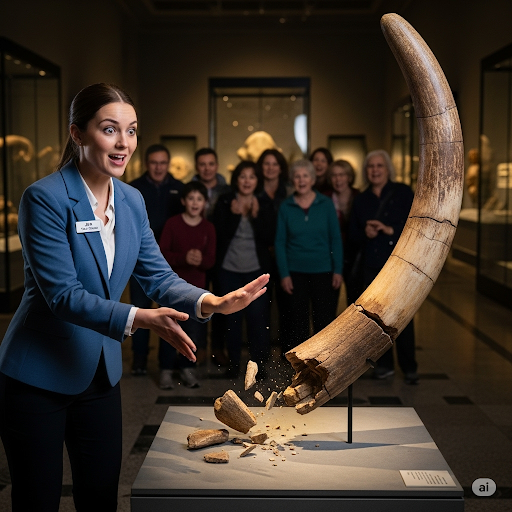
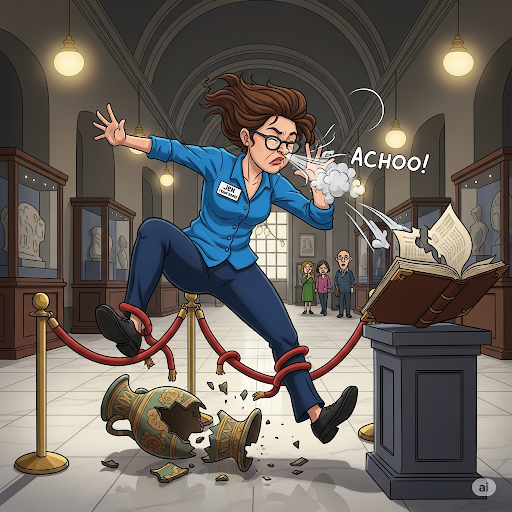
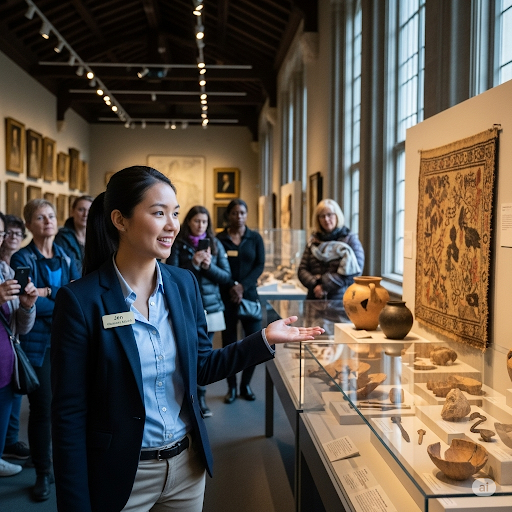
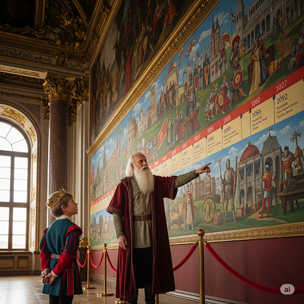
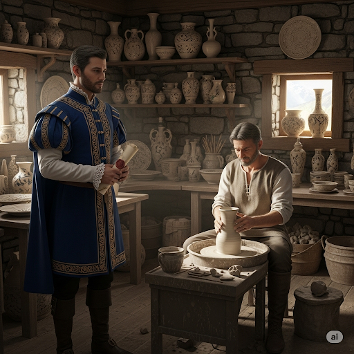

# Jen’s New Job

The history museum needed to recruit a new tour guide. The director interviewed dozens of applicants before he decided to hire Jen. She was chosen because she was friendly, punctual and had a great attitude.

On her first day, Jen got to work and prepared to give her first tour. She looked at the names on the register. She saw that the Queen of England and a diplomat were visiting the museum. She thought, “It’s my very first day, and I have to impress a monarch! I hope I don’t humiliate myself in front of a person of such renown!”

Jen was nervous. She took a deep breath and said, “Hello, everyone! I’m going to talk to you about the chronology of ancient Egypt.” As she turned around to show the group some artifacts, she bumped into a fossil of an authentic elephant tusk. It fell to the ground and broke into a million pieces! “Oh no!” said Jen in a subtle voice. “I sure hope the rest of the tour goes better than this!”

The rest of the tour did not go any better. She tripped over an antique vase and broke a piece off of it. As she was reading an excerpt from a lyric poem, she sneezed and tore a page of the epic.

After the tour, Jen approached the queen to apologize. She said, “I’m sorry, Your Majesty. I was a terrible tour guide. Let me give you a refund for the money you spent.”

The queen laughed. She said, “I don’t want my money back, Jen. I loved the tour. You just have to be a little more careful and work hard to become the best at your job. Hard work precedes success.”

Jen smiled and thanked the queen. She decided to be extra careful from then on. She was persistent and worked hard. In time, Jen became the best tour guide at the museum.

## Sentences of story

Jen’s New Job

The history museum needed to recruit a new tour guide.

The director interviewed dozens of applicants before he decided to hire Jen.

She was chosen because she was friendly, punctual and had a great attitude.

On her first day, Jen got to work and prepared to give her first tour.

She looked at the names on the register.

She saw that the Queen of England and a diplomat were visiting the museum.

She thought, “It’s my very first day, and I have to impress a monarch! I hope I don’t humiliate myself in front of a person of such renown!”

Jen was nervous.

She took a deep breath and said, “Hello, everyone! I’m going to talk to you about the chronology of ancient Egypt.”

As she turned around to show the group some artifacts, she bumped into a fossil of an authentic elephant tusk.

It fell to the ground and broke into a million pieces!

“Oh no!” said Jen in a subtle voice.

“I sure hope the rest of the tour goes better than this!”

The rest of the tour did not go any better.

She tripped over an antique vase and broke a piece off of it.

As she was reading an excerpt from a lyric poem, she sneezed and tore a page of the epic.

After the tour, Jen approached the queen to apologize.

She said, “I’m sorry, Your Majesty. I was a terrible tour guide. Let me give you a refund for the money you spent.”

The queen laughed.

She said, “I don’t want my money back, Jen. I loved the tour. You just have to be a little more careful and work hard to become the best at your job. Hard work precedes success.”

Jen smiled and thanked the queen.

She decided to be extra careful from then on.

She was persistent and worked hard.

In time, Jen became the best tour guide at the museum.

## List of word

antique, applicant, artifact, authentic, chronology, diplomat, epic, excerpt, fossil, humiliate, lyric, majesty, monarch, precede, punctual, recruit, refund, register, renown, tusk

## 1. antique

### IPA: /ænˈtiːk/
### Class: adj
### Câu truyện ẩn dụ:
Trong một ngôi làng nhỏ nằm sâu trong thung lũng, có một cửa hàng đặc biệt mang tên "Báu Vật Thời Gian". Chủ cửa hàng là một ông lão tên Antique (đọc là An-tíc). Ông không bán đồ mới, mà chỉ sưu tầm những món đồ cũ kỹ, mỗi món đều mang trong mình một câu chuyện.

Một cậu bé tò mò tên Tò te thường đến cửa hàng của ông Antique. Cậu bé thắc mắc tại sao những món đồ cũ, xỉn màu lại được ông trân trọng đến vậy. Ông Antique mỉm cười, chỉ vào một chiếc đồng hồ quả lắc đã ngả màu, kim chỉ giờ đã rỉ sét và nói: "Con có thấy không, chiếc đồng hồ này rất cổ xưa rồi, nhưng nó đã chứng kiến biết bao nhiêu khoảnh khắc quan trọng. Cái đẹp của nó không nằm ở sự bóng bẩy, mà ở giá trị của thời gian."

Cậu bé Tò te nhìn chiếc đồng hồ, rồi lại nhìn ông Antique. Bỗng cậu hiểu ra, "An-tíc" không chỉ là tên của ông, mà còn là một tính từ (adjective) dùng để miêu tả những món đồ cổ, có giá trị cao về mặt lịch sử hoặc nghệ thuật. Những món đồ này có thể đã cũ, nhưng chúng không bao giờ mất đi sự đặc biệt của mình.

Từ đó, mỗi khi nhìn thấy một chiếc ghế cũ, một chiếc đèn lồng cổ, hay bất cứ món đồ nào mang dáng dấp của quá khứ, cậu bé Tò te đều nghĩ đến ông Antique và thì thầm: "Antique - cổ xưa và quý giá." Cậu hiểu rằng, việc học từ mới cũng giống như tìm kiếm những món đồ "antique", mỗi từ đều có một câu chuyện và giá trị riêng, chờ đợi được khám phá.
### Định nghĩa : 
Cổ, cũ và thường có giá trị.

### English definition: 
Old and often valuable.

### Sentence of stroy:
She tripped over an **antique** vase and broke a piece off of it.

### Ví dụ thông dụng:

1. My mother collects antique furniture.
2. This antique clock is still working perfectly.

## 2. applicant

### IPA: /ˈæp.lɪ.kənt/
### Class: n
### Câu truyện ẩn dụ:

Trong một thành phố tri thức nhộn nhịp, có một tòa tháp cao tên là “Tháp Ước Mơ”. Để được bước vào tháp, mỗi người đều phải trải qua một quy trình đơn giản: điền vào một lá đơn.

Bất cứ ai đang điền đơn đều được gọi là applicant (đọc là áp li cần). Anh chàng Áp-li-cần nổi tiếng là người kiên nhẫn và cẩn thận nhất thành phố. Anh luôn trau chuốt từng câu chữ trong đơn của mình, bởi anh hiểu rằng, lá đơn này chính là lời giới thiệu tốt nhất về bản thân anh.

Một ngày nọ, một cậu bé hỏi anh: "Anh Áp-li-cần ơi, tại sao anh lại tỉ mỉ thế ạ?"

Anh mỉm cười và trả lời: "Mỗi applicant (đọc là áp li cần) đều là một người nộp đơn, và sự tỉ mỉ chính là chìa khóa để cánh cửa Tháp Ước Mơ mở ra. Việc học một từ mới cũng giống như nộp một lá đơn vậy. Chúng ta phải điền đủ kiến thức, hiểu rõ ý nghĩa và cách dùng của nó, thì từ vựng đó mới thực sự thuộc về chúng ta."

Từ đó, mỗi khi cậu bé muốn học một từ mới, cậu lại nhớ đến anh Áp-li-cần và câu chuyện về người nộp đơn chăm chỉ.

### Định nghĩa : 
Một người chính thức yêu cầu điều gì đó, đặc biệt là một công việc; ứng viên.

### English definition: 
A person who formally requests something, especially a job.

### Sentence of stroy:
The director interviewed dozens of **applicants** before he decided to hire Jen.

### Ví dụ thông dụng:
1. There were over 50 applicants for the job.
2. All applicants must fill out this form.

Chắc chắn rồi! Dưới đây là các câu chuyện ẩn dụ từ vựng thứ 3 trở đi được viết lại theo phong cách của hai câu chuyện đầu tiên, sử dụng một nhân vật có tên gần giống với từ vựng để tạo sự liên kết dễ nhớ.

---

## 3. artifact

### IPA: /ˈɑː.tə.fækt/
### Class: n
### Câu truyện ẩn dụ:
Trong giới khảo cổ học, có một nhà nghiên cứu nổi tiếng tên là Á-tì-phát. Ông dành cả đời mình để đi khắp thế giới, nhưng ông không tìm kiếm xương khủng long hay lá cây hóa thạch. Ông chỉ có một niềm đam mê duy nhất: tìm những đồ vật do con người cổ đại tạo ra.

Một ngày nọ, một sinh viên trẻ hỏi ông: "Thưa giáo sư Á-tì-phát, tại sao ông không quan tâm đến những hóa thạch tuyệt vời của tự nhiên?"

Giáo sư Á-tì-phát mỉm cười, giơ lên một mảnh gốm vỡ có hoa văn và nói: "Bởi vì những thứ này chứa đựng linh hồn và trí tuệ của con người. Chúng là những tạo tác, là bằng chứng cho thấy tổ tiên chúng ta đã sống, đã sáng tạo. Mỗi món đồ do con người làm ra đều là một câu chuyện."

Từ đó, các sinh viên đều truyền tai nhau rằng, những món đồ cổ do con người tạo ra, những tạo tác lịch sử, được gọi là "artifact" để vinh danh nhà khảo cổ vĩ đại Á-tì-phát, người đã dạy họ về giá trị của chúng.

### Định nghĩa : 
Một đồ vật do con người làm ra, chẳng hạn như công cụ hoặc đồ trang trí, đặc biệt là một đồ vật có giá trị lịch sử.

### English definition: 
An object that is made by a person, such as a tool or a decoration, especially one that is of historical interest.

### Sentence of stroy:
As she turned around to show the group some **artifacts**, she bumped into a fossil of an authentic elephant tusk.

### Ví dụ thông dụng:
1. The museum is full of ancient Egyptian artifacts.
2. Archaeologists uncovered a number of Roman artifacts at the site.

## 4. authentic

### IPA: /ɔːˈθen.tɪk/
### Class: adj
### Câu truyện ẩn dụ:
Tại khu chợ đồ cổ sầm uất, có một vị chuyên gia giám định tên là Ô-then-tích. Bất cứ món đồ nào, dù là tranh, gốm sứ hay trang sức, chỉ cần qua tay ông xem xét là biết ngay thật hay giả. Tiếng tăm của ông vang xa đến nỗi không một kẻ bán hàng gian dối nào dám qua mặt.

Một hôm, một nhà quý tộc mang đến một chiếc vương miện và hỏi: "Thưa ngài Ô-then-tích, ngài có thể xem giúp ta chiếc vương miện này có phải là hàng thật không?"

Ông Ô-then-tích cẩn thận xem xét từng chi tiết, rồi quả quyết: "Xin chúc mừng ngài. Đây là một món đồ thật, nguyên bản và có giá trị rất lớn."

Nhà quý tộc vui mừng khôn xiết. Từ đó, mỗi khi muốn khẳng định một thứ gì đó là thật 100%, là nguyên bản, người ta lại nói nó "chuẩn như lời ông Ô-then-tích". Và tính từ "authentic" đã ra đời để miêu tả sự thật, sự chính xác đó.

### Định nghĩa : 
Thật, chính xác, không phải là bản sao.

### English definition: 
Real, true, or not a copy.

### Sentence of stroy:
As she turned around to show the group some artifacts, she bumped into a fossil of an **authentic** elephant tusk.

### Ví dụ thông dụng:
1. I don't know if the painting is authentic.
2. He is an authentic hero.

## 5. chronology

### IPA: /krəˈnɒl.ə.dʒi/
### Class: n
### Câu truyện ẩn dụ:
Ở vương quốc nọ, có một vị sử gia hoàng gia tên là Cơ-rô-nô-lô-gi. Bà có một trí nhớ phi thường, nhưng bà nhận ra rằng hoàng tử trẻ tuổi rất ghét học lịch sử vì các sự kiện cứ lộn xộn trong đầu cậu.

Để giúp hoàng tử, bà Cơ-rô-nô-lô-gi đã vẽ một dòng thời gian khổng lồ trên tường, sắp xếp tất cả các trận chiến, các triều đại, các phát minh theo đúng thứ tự thời gian chúng xảy ra. Hoàng tử nhìn vào đó và reo lên: "Aha! Bây giờ thì con đã hiểu rồi! Mọi thứ thật rõ ràng!"

Cách sắp xếp các sự kiện theo trình tự thời gian của bà Cơ-rô-nô-lô-gi hiệu quả đến mức nhà vua đã ra lệnh áp dụng cho toàn bộ việc giảng dạy lịch sử trong vương quốc. Và phương pháp đó được đặt theo tên bà: "chronology".

### Định nghĩa : 
Sự sắp xếp các sự kiện theo thứ tự thời gian chúng xảy ra.

### English definition: 
The arrangement of events in the order in which they happened.

### Sentence of stroy:
I’m going to talk to you about the **chronology** of ancient Egypt.

### Ví dụ thông dụng:
1. The book provides a chronology of the events leading up to the war.
2. He is an expert in the chronology of ancient civilizations.

## 6. diplomat

### IPA: /ˈdɪp.lə.mæt/
### Class: n
### Câu truyện ẩn dụ:
Giữa hai quốc gia đang trên bờ vực chiến tranh, nhà vua đã quyết định cử đi vị quan tài ba nhất của mình, ngài Điệp-lô-mát. Ngài không mang theo quân đội, chỉ mang theo sự khôn khéo và tài ăn nói.

Khi đến nước láng giềng, ngài Điệp-lô-mát đã dùng những lý lẽ thuyết phục và sự chân thành để đàm phán. Ngài đại diện cho đất nước của mình một cách xuất sắc, giải quyết mọi hiểu lầm và cuối cùng đã mang về một hiệp ước hòa bình.

Khi trở về, người dân tung hô ngài. Một cậu bé hỏi cha: "Người làm công việc như ngài Điệp-lô-mát gọi là gì ạ?" Người cha trả lời: "Đó là một nhà ngoại giao, và người ta gọi chức danh đó là 'diplomat', theo tên của vị anh hùng đã cứu chúng ta khỏi chiến tranh."

### Định nghĩa : 
Một quan chức đại diện cho đất nước của mình ở nước ngoài.

### English definition: 
An official representing their country abroad.

### Sentence of stroy:
She saw that the Queen of England and a **diplomat** were visiting the museum.

### Ví dụ thông dụng:
1. He served as a diplomat in several countries.
2. The meeting of diplomats was held to discuss the peace treaty.

## 7. epic

### IPA: /ˈep.ɪk/
### Class: n
### Câu truyện ẩn dụ:
Trong một ngôi làng cổ, có một người kể chuyện mù tên là Ép-pích. Ông không kể những câu chuyện ngắn gọn. Thay vào đó, ông kể những câu chuyện rất dài, kéo dài hàng đêm, về những anh hùng vĩ đại, những cuộc phiêu lưu kỳ thú và những trận chiến hào hùng.

Mỗi khi ông Ép-pích cất giọng, cả làng đều im lặng lắng nghe. Những câu chuyện của ông không chỉ là giải trí, chúng còn là những bản trường ca, những thiên anh hùng ca ghi lại lịch sử và niềm tự hào của cả bộ tộc.

Người ta yêu quý những câu chuyện của ông đến nỗi, họ bắt đầu dùng tên ông, "Ép-pích", để chỉ thể loại truyện kể hoặc thơ rất dài về những hành động dũng cảm. Và từ "epic" đã ra đời từ đó.

### Định nghĩa : 
Một bài thơ hoặc cuốn sách dài kể về những hành động dũng cảm và những sự kiện thú vị.

### English definition: 
A long poem or book that tells a story of brave actions and exciting events.

### Sentence of stroy:
As she was reading an excerpt from a lyric poem, she sneezed and tore a page of the **epic**.

### Ví dụ thông dụng:
1. Homer's "Odyssey" is a famous epic.
2. The film was an epic about the Roman Empire.

## 8. excerpt

### IPA: /ˈek.sɜːpt/
### Class: n
### Câu truyện ẩn dụ:
Có một vị học giả uyên bác tên là Ích-sớp. Ông đã đọc hàng ngàn cuốn sách, từ những bộ tiểu thuyết đồ sộ đến những công trình nghiên cứu dày cộp. Các học trò của ông thường phàn nàn rằng họ không có thời gian để đọc hết tất cả.

Hiểu được điều đó, thầy Ích-sớp đã cẩn thận chọn ra những đoạn văn ngắn nhưng hay nhất, tinh túy nhất từ mỗi tác phẩm để học trò của mình đọc. Ông nói: "Các con không cần đọc cả cuốn sách, chỉ cần đọc những đoạn trích này là có thể hiểu được cái hay của nó."

Các học trò rất biết ơn phương pháp của thầy. Họ gọi những đoạn trích ngắn mà thầy chọn là "excerpt" (đọc gần giống Ích-sớp), để ghi nhớ công lao của người thầy đã giúp họ tiếp cận tri thức một cách dễ dàng hơn.

### Định nghĩa : 
Một đoạn trích ngắn lấy từ một cuốn sách, vở kịch, bản nhạc, v.v.

### English definition: 
A short part taken from a book, play, piece of music, etc.

### Sentence of stroy:
As she was reading an **excerpt** from a lyric poem, she sneezed and tore a page of the epic.

### Ví dụ thông dụng:
1. An excerpt from her new novel was published in the magazine.
2. He read a brief excerpt from his speech.

## 9. fossil

### IPA: /ˈfɒs.əl/
### Class: n
### Câu truyện ẩn dụ:
Tại một vùng đất xa xôi, có một nhà thám hiểm tên là Phó-sồ. Ông không tìm vàng bạc châu báu. Thứ ông tìm kiếm là dấu vết của sự sống từ hàng triệu năm trước, những thứ đã bị chôn vùi trong lòng đất và hóa thành đá.

Một ngày, ông tìm thấy bộ xương của một con khủng long đã hóa đá hoàn toàn. Ông vui mừng nói với người đồng hành: "Đây chính là thứ tôi tìm kiếm! Dấu tích của một sinh vật cổ đại được bảo quản trong đá."

Người đồng hành hỏi: "Chúng ta gọi nó là gì?" Ông Phó-sồ trả lời: "Hãy gọi nó theo tên tôi. Một 'fossil'!" Từ đó, "fossil" trở thành cái tên chung cho tất cả các di tích hóa đá của động thực vật thời tiền sử.

### Định nghĩa : 
Phần còn lại của một con vật hoặc thực vật đã chết từ hàng triệu năm trước và được bảo quản trong đá.

### English definition: 
The remains of an animal or a plant that died many thousands of years ago, which have become hard and turned into rock.

### Sentence of stroy:
As she turned around to show the group some artifacts, she bumped into a **fossil** of an authentic elephant tusk.

### Ví dụ thông dụng:
1. They discovered a dinosaur fossil in the desert.
2. The fossil record shows how life on Earth has changed over time.

## 10. humiliate

### IPA: /hjuːˈmɪl.i.eɪt/
### Class: v
### Câu truyện ẩn dụ:
Trong một vương quốc, có một tên lãnh chúa độc ác tên là Hiu-mi-li-ết. Hắn có một sở thích tàn nhẫn là bắt những người dân vô tội ra giữa quảng trường và bắt họ làm những trò hề ngốc nghếch để mua vui cho hắn.

Mỗi khi làm vậy, hắn khiến nạn nhân của mình cảm thấy vô cùng xấu hổ và nhục nhã trước mặt mọi người. Họ mất hết thể diện và lòng tự trọng. Người dân trong vùng run sợ mỗi khi nghe đến tên Hiu-mi-li-ết.

Hành động làm cho người khác bẽ mặt, mất thể diện một cách công khai được gọi theo tên của tên lãnh chúa tàn bạo đó: "humiliate".

### Định nghĩa : 
Làm cho ai đó cảm thấy xấu hổ hoặc ngu ngốc và mất đi sự tôn trọng của người khác.

### English definition: 
To make someone feel ashamed or stupid and lose the respect of other people.

### Sentence of stroy:
I hope I don’t **humiliate** myself in front of a person of such renown!

### Ví dụ thông dụng:
1. He felt humiliated by their laughter.
2. Why are you always trying to humiliate me in public?

## 11. lyric

### IPA: /ˈlɪr.ɪk/
### Class: adj
### Câu truyện ẩn dụ:
Có một chàng thi sĩ trẻ tên là Lý-rích. Thơ của anh không kể về những trận chiến hay các vị vua, mà chỉ là những dòng cảm xúc ngắn gọn, thể hiện tình yêu, nỗi buồn, hay niềm vui của riêng anh. Anh thường ngồi bên cây đàn lia và hát lên những vần thơ của mình.

Thơ của Lý-rích rất giàu cảm xúc và đầy chất nhạc, chạm đến trái tim của mọi người. Người ta nói rằng thơ của anh là tiếng lòng của chính anh.

Vì vậy, thể loại thơ ngắn, giàu cảm xúc, thể hiện tình cảm và suy nghĩ cá nhân của nhà thơ đã được gọi là thơ "lyric" để tôn vinh chàng thi sĩ tài hoa này.

### Định nghĩa : 
(của một bài thơ) thể hiện cảm xúc và suy nghĩ cá nhân của nhà thơ.

### English definition: 
(of a poem) expressing the personal feelings and thoughts of the poet.

### Sentence of stroy:
As she was reading an excerpt from a **lyric** poem, she sneezed and tore a page of the epic.

### Ví dụ thông dụng:
1. "Ode to a Nightingale" is a famous lyric poem by John Keats.
2. She is known for her lyric poetry.

## 12. majesty

### IPA: /ˈmædʒ.ə.sti/
### Class: n
### Câu truyện ẩn dụ:
Ngày xưa, có một vị nữ hoàng tên là Ma-giét-ti. Bà không chỉ xinh đẹp mà còn toát lên một vẻ uy nghi, quyền lực và trang trọng lạ thường. Mỗi khi bà xuất hiện, mọi người đều cúi đầu trong im lặng, không phải vì sợ hãi, mà vì sự ngưỡng mộ và tôn kính.

Vẻ đẹp, sự quyền lực và oai phong lẫm liệt của bà gây ấn tượng mạnh mẽ đến mức người ta bắt đầu dùng tên của bà, "Ma-giét-ti", để miêu tả phẩm chất đó. Dần dần, từ "majesty" được dùng để chỉ sự uy nghi, vẻ oai phong của các bậc vua chúa.

### Định nghĩa : 
Vẻ oai phong, vẻ đẹp hoặc quyền lực gây ấn tượng, tạo ra sự ngưỡng mộ và tôn trọng; sự uy nghi.

### English definition: 
The impressive quality of being beautiful, powerful, or important.

### Sentence of stroy:
She said, “I’m sorry, Your **Majesty**. I was a terrible tour guide."

### Ví dụ thông dụng:
1. The majesty of the mountains took my breath away.
2. The crowd was silent in the presence of Her Majesty the Queen.

## 13. monarch

### IPA: /ˈmɒn.ək/
### Class: n
### Câu truyện ẩn dụ:
Vương quốc nọ được trị vì bởi một vị vua vô cùng quyền lực tên là Mô-nác. Ông là người đứng đầu đất nước, là người duy nhất có quyền ban hành luật pháp và nắm giữ quyền lực tối cao. Không ai có thể ra lệnh cho ông.

Một nhà du hành đến thăm vương quốc và hỏi một người dân: "Người đứng đầu của các bạn là ai?"

Người dân tự hào trả lời: "Đó là đức vua Mô-nác vĩ đại của chúng tôi!"

Nhà du hành ghi chép lại, và từ đó, ông dùng từ "monarch", phỏng theo tên của vị vua, để chỉ người đứng đầu một quốc gia theo chế độ quân chủ, như vua hoặc nữ hoàng.

### Định nghĩa : 
Một vị vua hoặc nữ hoàng; người đứng đầu một quốc gia theo chế độ quân chủ.

### English definition: 
A king or queen.

### Sentence of stroy:
I have to impress a **monarch**!

### Ví dụ thông dụng:
1. Queen Victoria was a powerful monarch.
2. The country is ruled by a constitutional monarch.

## 14. precede

### IPA: /prɪˈsiːd/
### Class: v
### Câu truyện ẩn dụ:
Trong một tu viện cổ, có một vị sư phụ già tên là Prì-xít. Ông luôn dạy các đệ tử của mình một nguyên tắc quan trọng: "Trong mọi nghi lễ, tiếng chuông tĩnh tâm phải luôn vang lên trước khi buổi lễ bắt đầu. Sự tĩnh lặng phải đi trước lời cầu nguyện."

Một đệ tử trẻ hỏi: "Tại sao phải như vậy ạ?" Sư phụ Prì-xít trả lời: "Bởi vì sự chuẩn bị luôn phải xảy ra trước hành động. Đó là quy luật."

Hành động "xảy ra trước", "đi trước" một điều gì đó đã được các đệ tử ghi nhớ và gọi là "precede", theo tên của vị sư phụ đã dạy họ bài học quý giá đó.

### Định nghĩa : 
Xảy ra hoặc tồn tại trước một ai đó hoặc một cái gì đó.

### English definition: 
To be or go before someone or something in time or space.

### Sentence of stroy:
Hard work **precedes** success.

### Ví dụ thông dụng:
1. The formal ceremony was preceded by a parade.
2. In his speech, he said that a crisis was sure to precede the election.

## 15. punctual

### IPA: /ˈpʌŋk.tʃu.əl/
### Class: adj
### Câu truyện ẩn dụ:
Ở một thành phố nọ, có một người gác chuông đồng hồ tên là Pâng-chu-ồ. Công việc của ông là mỗi ngày đúng 12 giờ trưa phải kéo chuông. Và ông chưa bao giờ trễ một giây nào trong suốt 50 năm.

Người dân thành phố yêu quý và kính trọng ông đến mức họ dùng đồng hồ của ông để chỉnh lại đồng hồ của mình. Họ nói rằng: "Muốn biết thế nào là đúng giờ, hãy nhìn ông Pâng-chu-ồ."

Từ đó, tính từ để miêu tả một người luôn đúng giờ, không bao giờ trễ hẹn, đã được gọi là "punctual", theo tên của người gác chuông huyền thoại.

### Định nghĩa : 
Đến hoặc làm việc gì đó vào đúng thời điểm; đúng giờ.

### English definition: 
Arriving, doing something, or happening at the expected, correct time; not late.

### Sentence of stroy:
She was chosen because she was friendly, **punctual** and had a great attitude.

### Ví dụ thông dụng:
1. He's the sort of man who is always punctual.
2. Please be punctual for your appointment.

## 16. recruit

### IPA: /rɪˈkruːt/
### Class: v
### Câu truyện ẩn dụ:
Vương quốc cần những người lính tài giỏi nhất cho đội cận vệ hoàng gia. Nhà vua đã giao nhiệm vụ này cho vị tướng tài ba nhất của mình, ngài Ri-crút.

Tướng Ri-crút không ra lệnh ép buộc, mà ông đi khắp nơi, tìm kiếm những người có tài năng và thuyết phục họ gia nhập quân đội. Ông tổ chức các cuộc thi, phỏng vấn và tìm ra những người phù hợp nhất để phục vụ đất nước.

Công việc tìm kiếm và thuyết phục người khác tham gia vào một tổ chức, hay còn gọi là tuyển dụng, đã được gọi là "recruit", theo tên của vị tướng đã xây dựng nên đội quân tinh nhuệ nhất.

### Định nghĩa : 
Tuyển mộ ai đó vào một tổ chức; tuyển dụng.

### English definition: 
To persuade someone to work for a company or become a new member of an organization, especially the army.

### Sentence of stroy:
The history museum needed to **recruit** a new tour guide.

### Ví dụ thông dụng:
1. The company is trying to recruit new staff.
2. They recruited several new members to the team.

## 17. refund

### IPA: /ˈriː.fʌnd/
### Class: n
### Câu truyện ẩn dụ:
Trong thành phố có một người chủ cửa hàng rất công bằng tên là Ri-phân. Ông có một quy tắc nổi tiếng: "Nếu khách hàng không hài lòng với sản phẩm, hoặc sản phẩm bị lỗi, tôi sẽ trả lại toàn bộ số tiền."

Mọi người rất tin tưởng cửa hàng của ông Ri-phân vì họ biết rằng họ sẽ luôn được đối xử công bằng. Một hôm, một cậu bé hỏi ông: "Số tiền ông trả lại cho khách gọi là gì ạ?"

Ông Ri-phân mỉm cười và nói: "Cứ gọi nó là một 'refund', theo tên của ta nhé!" Từ đó, khoản tiền được hoàn lại cho khách hàng được gọi là "refund".

### Định nghĩa : 
Số tiền được trả lại cho bạn, đặc biệt là vì bạn không hài lòng với một sản phẩm hoặc dịch vụ.

### English definition: 
An amount of money that is given back to you, especially because you are not happy with a product or service.

### Sentence of stroy:
Let me give you a **refund** for the money you spent.

### Ví dụ thông dụng:
1. I took the faulty laptop back and they gave me a full refund.
2. You are entitled to a refund if the tour is cancelled.

## 18. register

### IPA: /ˈredʒ.ə.stər/
### Class: n
### Câu truyện ẩn dụ:
Tại thư viện hoàng gia, có một người quản thư tên là Rét-gi-stơ. Nhiệm vụ của ông là giữ một cuốn sổ cái khổng lồ. Bất cứ ai muốn vào thư viện đều phải đến gặp ông để ghi tên mình vào cuốn sổ đó. Cuốn sổ cũng ghi lại tất cả các đầu sách có trong thư viện.

Cuốn sổ của ông Rét-gi-stơ là một danh sách chính thức và vô cùng quan trọng. Một ngày, hoàng tử hỏi: "Thưa ngài, cuốn sổ ghi danh chính thức này có tên gọi là gì?"

Người quản thư đáp: "Tâu hoàng tử, mọi người gọi nó là cuốn 'register', theo tên của thần." Và từ đó, "register" được dùng để chỉ một cuốn sổ đăng ký hay một danh sách chính thức.

### Định nghĩa : 
Một cuốn sách hoặc hồ sơ chính thức; sổ đăng ký.

### English definition: 
An official list, book, or system for keeping records of information.

### Sentence of stroy:
She looked at the names on the **register**.

### Ví dụ thông dụng:
1. Have you signed the hotel register?
2. The teacher called out the names from the register.

## 19. renown

### IPA: /rɪˈnaʊn/
### Class: n
### Câu truyện ẩn dụ:
Ngày xưa có một nữ hiệp sĩ tên là Ri-nao. Bà nổi tiếng khắp vương quốc không chỉ vì sức mạnh mà còn vì lòng dũng cảm và sự chính trực. Bà đã lập vô số chiến công, giúp đỡ người nghèo và trừng trị kẻ ác.

Danh tiếng của bà vang xa đến nỗi ai cũng biết đến và kính trọng bà. Mọi người không chỉ biết tên bà, họ còn ngưỡng mộ những gì bà đã làm.

Một nhà thơ đã viết về bà: "Sự nổi tiếng đi kèm với lòng kính trọng của bà là vô song." Và ông đã dùng một từ mới, phỏng theo tên bà, để miêu tả trạng thái đó: "renown".

### Định nghĩa : 
Sự nổi tiếng và được nhiều người tôn trọng.

### English definition: 
The state of being famous and respected.

### Sentence of stroy:
I hope I don’t humiliate myself in front of a person of such **renown**!

### Ví dụ thông dụng:
1. He achieved great renown for his paintings.
2. She is a writer of international renown.

## 20. tusk

### IPA: /tʌsk/
### Class: n
### Câu truyện ẩn dụ:
Trong khu rừng rậm châu Phi, có một con voi đầu đàn huyền thoại tên là Tát-scơ. Nó nổi tiếng với cặp ngà dài, trắng muốt và vô cùng chắc khỏe. Cặp ngà không chỉ là vật trang sức mà còn là vũ khí lợi hại để bảo vệ cả đàn.

Những chiếc răng dài và cong vút của Tát-scơ đã trở thành biểu tượng của sức mạnh. Các loài vật khác trong rừng đều gọi những chiếc răng đặc biệt đó theo tên của con voi vĩ đại: "những chiếc tusk của Tát-scơ".

Dần dần, "tusk" đã trở thành tên gọi chung cho những chiếc răng (ngà) dài, cong, mọc bên ngoài miệng của loài voi và một số loài vật khác.

### Định nghĩa : 
Một trong hai chiếc răng dài, cong, nhọn ở bên ngoài miệng của một số loài động vật như voi hoặc lợn lòi; ngà.

### English definition: 
Either of the two long, curved teeth that stick out from the mouth of some animals, such as elephants.

### Sentence of stroy:
As she turned around to show the group some artifacts, she bumped into a fossil of an authentic elephant **tusk**.

### Ví dụ thông dụng:
1. The elephant's tusks were long and sharp.
2. Poachers hunt elephants for their ivory tusks.. 
...