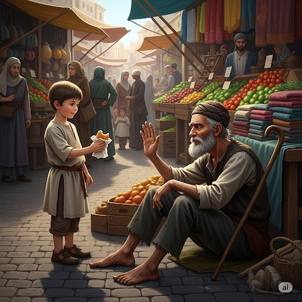

# The Demon’s Bridge

A young woman’s cow had crossed the river in the morning when the water level was moderate. But when the woman returned with her dog to get the cow, she was overwhelmed by how high the water had risen. Even if she crossed, she still couldn’t tow her cow back through the river.

“What am I going to do?” she wondered.

Suddenly, a man appeared across the river. “A fragile young lady like you shouldn’t have to struggle across a river,” he said. “I’ll build you a bridge.”

The man was an enigma. The young woman’s perception of him was that he was a sociable person. He was talkative, yet something was strange about him.

“I don’t want to be a burden to you, sir,” the woman replied.

“Don’t worry,” he told her as he began crafting a bridge. He merged the pieces of the bridge together with amazing speed. Soon, it was finished.

“Oh, but how can I pay you for your work? Let’s compromise. I am sure that we can find a fair solution. What do you think?” The woman asked.

“The only currency I need is the first living thing that crosses the bridge,” the man replied.

She thought, “This deal sounds weird. Maybe he’s actually a river demon.” She shivered because she realized that he had taken advantage of her innocence and rigged the deal somehow. But she had a plan of her own. She pulled a piece of bread from her pocket and threw it across the bridge. Her dog ran after it.

“The dog is the first living thing across the bridge,” she said to the man.

The man was angry. He suddenly changed into a hybrid of a human and a fish. “You crook!” he shouted. “You tricked me. I have no use for your dog!” He screamed and dove into the river.

The woman tramped across the bridge to the other side and had a happy reunion with her dog and cow.

## Sentences of story

The Demon’s Bridge

A young woman’s cow had crossed the river in the morning when the water level was moderate.

But when the woman returned with her dog to get the cow, she was overwhelmed by how high the water had risen.

Even if she crossed, she still couldn’t tow her cow back through the river.

“What am I going to do?” she wondered.

Suddenly, a man appeared across the river.

“A fragile young lady like you shouldn’t have to struggle across a river,” he said.

“I’ll build you a bridge.”

The man was an enigma.

The young woman’s perception of him was that he was a sociable person.

He was talkative, yet something was strange about him.

“I don’t want to be a burden to you, sir,” the woman replied.

“Don’t worry,” he told her as he began crafting a bridge.

He merged the pieces of the bridge together with amazing speed.

Soon, it was finished.

“Oh, but how can I pay you for your work? Let’s compromise. I am sure that we can find a fair solution. What do you think?” The woman asked.

“The only currency I need is the first living thing that crosses the bridge,” the man replied.

She thought, “This deal sounds weird. Maybe he’s actually a river demon.”

She shivered because she realized that he had taken advantage of her innocence and rigged the deal somehow.

But she had a plan of her own.

She pulled a piece of bread from her pocket and threw it across the bridge.

Her dog ran after it.

“The dog is the first living thing across the bridge,” she said to the man.

The man was angry.

He suddenly changed into a hybrid of a human and a fish.

“You crook!” he shouted.

“You tricked me. I have no use for your dog!”

He screamed and dove into the river.

The woman tramped across the bridge to the other side and had a happy reunion with her dog and cow.

## List of word

burden, compromise, craft, crook, currency, enigma, fragile, hybrid, innocence, merge, moderate, overwhelm, perception, reunion, rig, shiver, sociable, talkative, tow, tramp

## 1. burden

### IPA: /ˈbɜː.dən/
### Class: n
### Câu truyện ẩn dụ:
Ngày xưa, có một anh chàng nông dân tên là Bơ Đần. Anh ấy nổi tiếng là làm việc rất chăm chỉ nhưng lại cực kỳ lơ đễnh. Một lần, anh được giao nhiệm vụ mang một bao tải gạo khổng lồ từ trên núi xuống làng. Đáng lẽ anh phải dùng xe bò hoặc nhờ người giúp đỡ, nhưng vì quá Bơ Đần, anh đã tự mình vác cái bao tải đó trên lưng.

Dọc đường đi, anh kêu than: "Ôi cái bao tải này làm tôi *bơ phờ đờ đẫn* (bơ-đần) quá! Nó là một **gánh nặng** (burden) khủng khiếp!". Anh lảo đảo bước đi, mồ hôi nhễ nhại. Nhìn thấy cảnh đó, mọi người trong làng đều lắc đầu, gọi cái bao tải ấy là "cái burden của anh chàng Bơ Đần". Từ đó, mỗi khi nhắc đến một thứ gì đó nặng nề, khó khăn, người ta lại nhớ đến hình ảnh anh nông dân Bơ Đần đang oằn mình với cái gánh nặng (burden) của mình.

### Định nghĩa : 
Gánh nặng.

### English definition: 
Something heavy that is carried; a load.

### Sentence of stroy:
“I don’t want to be a **burden** to you, sir,” the woman replied.

### Ví dụ thông dụng:

1. The donkey struggled under its heavy burden.
2. The burden of responsibility was weighing him down.

## 2. compromise

### IPA: /ˈkɒm.prə.maɪz/
### Class: v
### Câu truyện ẩn dụ:
Có hai anh em tên là Cơm và Mãi, cả hai đều là game thủ *pro*. Họ cãi nhau suốt ngày vì chỉ có một máy chơi game. Mẹ họ bực mình, liền nói: "Hai đứa cứ *Cơm-pro-mãi* cãi nhau thế này thì mẹ tịch thu máy luôn! Muốn chơi tiếp thì phải **thỏa hiệp** (compromise) đi. Mỗi đứa nhường một chút, chơi theo giờ." Nghe vậy, hai anh em đành phải đồng ý dàn xếp, vì họ không muốn mất cái máy game *pro* của mình. Từ đó, hành động nhượng bộ để đạt được thỏa thuận được gọi là `compromise`.

### Định nghĩa : 
Thỏa hiệp, dàn xếp.

### English definition: 
To reach an agreement in which each person or group gives up something that they wanted.

### Sentence of stroy:
Let’s **compromise**. I am sure that we can find a fair solution.

### Ví dụ thông dụng:
1. They were unwilling to compromise on the price.
2. In any relationship, you have to compromise.

## 3. craft

### IPA: /krɑːft/
### Class: v
### Câu truyện ẩn dụ:
Trong một ngôi làng mộc, có một nghệ nhân lừng danh tên là Cờ Ráp. Sở dĩ ông có tên như vậy vì âm thanh quen thuộc trong xưởng của ông luôn là tiếng *cưa* và tiếng *ráp* các mảnh gỗ lại với nhau. Ông không dùng máy móc, mọi thứ ông làm đều là **chế tác thủ công** (craft) một cách tỉ mỉ. Người ta đến xem ông làm việc và trầm trồ: "Nhìn ông Cờ Ráp đang `craft` kìa, thật là điêu luyện!". Cái tên Cờ Ráp và hành động `craft` của ông đã trở thành biểu tượng cho sự khéo léo và tài hoa.

### Định nghĩa : 
Chế tác, làm thủ công.

### English definition: 
To make something in a skillful way, especially with your hands.

### Sentence of stroy:
He told her as he began **crafting** a bridge.

### Ví dụ thông dụng:
1. All the furniture is crafted from natural materials.
2. She crafted a beautiful necklace for her friend.

## 4. crook

### IPA: /krʊk/
### Class: n
### Câu truyện ẩn dụ:
Có một gã bán sâm tên là Crúc. Hắn luôn bán những củ sâm cong queo, xấu xí như những *khúc* củi khô, nhưng lại lừa người ta rằng đó là sâm ngàn năm. Hắn là một **kẻ lừa đảo** (crook) chính hiệu, chuyên lừa những người cả tin. Một hôm, hắn bị lật tẩy, quan phủ phán: "Tên Crúc này có tâm địa cong queo như chính mấy *khúc* sâm của hắn vậy!". Từ đó, người ta dùng từ `crook` để chỉ những kẻ gian xảo, không trung thực.

### Định nghĩa : 
Kẻ lừa đảo, kẻ gian.

### English definition: 
A dishonest person; a criminal.

### Sentence of stroy:
“You **crook**!” he shouted.

### Ví dụ thông dụng:
1. The police are determined to catch the crooks.
2. That car salesman is a real crook.

## 5. currency

### IPA: /ˈkʌr.ən.si/
### Class: n
### Câu truyện ẩn dụ:
Có một người hành khất già ngồi ở góc chợ. Một cậu bé tốt bụng thường cho ông đồ ăn, nhưng ông lại xua tay. Cậu bé thắc mắc, ông già giải thích: "*Cứ lần xin* (Cơ-ren-xi), ta chỉ mong người ta cho **tiền tệ** (currency) thôi, con ạ. Có tiền, ta mới tự mua được thứ mình cần nhất, như thuốc men chẳng hạn." Cậu bé hiểu ra và từ đó, mỗi khi nghe từ `currency`, cậu lại nhớ đến câu chuyện "cứ lần xin tiền" và hiểu ngay đó chính là tiền tệ.

### Định nghĩa : 
Tiền tệ.

### English definition: 
The money that a country uses.

### Sentence of stroy:
The only **currency** I need is the first living thing that crosses the bridge.

### Ví dụ thông dụng:
1. The local currency is the Japanese Yen.
2. You'll need to exchange your money for the local currency.

## 6. enigma

### IPA: /əˈnɪɡ.mə/
### Class: n
### Câu truyện ẩn dụ:
Trong thành phố xuất hiện một người đàn ông lạ mặt, luôn đeo mặt nạ và không bao giờ nói tên. Mỗi khi có người tò mò lại gần và hỏi ông là ai, ông chỉ đặt ngón tay lên môi và thì thầm một câu duy nhất: "*Ê, nín mà* (Ê-níc-ma)... đừng hỏi nữa". Sự im lặng và câu nói đó khiến ông trở thành một **điều bí ẩn** (enigma) lớn nhất thành phố. Không ai giải đáp được ông là ai, và cái tên "Enigma" được dùng để chỉ những người hay sự vật khó hiểu, bí ẩn như ông.

### Định nghĩa : 
Điều bí ẩn, người khó hiểu.

### English definition: 
A person, place, or thing that is mysterious and difficult to understand.

### Sentence of stroy:
The man was an **enigma**.

### Ví dụ thông dụng:
1. Even after years of study, the philosopher remains an enigma.
2. How the ancient pyramids were built is still an enigma.

## 7. fragile

### IPA: /ˈfrædʒ.aɪl/
### Class: adj
### Câu truyện ẩn dụ:
Có một người thợ gốm làm ra những chiếc bình pha lê tuyệt đẹp. Khi giao hàng cho khách, ông luôn dặn dò rất kỹ: "Những chiếc bình này rất **mỏng manh, dễ vỡ** (fragile), nên khi vận chuyển *phải rai rai* (phờ-ra-giai) từ từ và nhẹ nhàng thôi nhé." Lời dặn "phải rai rai" của ông đã trở thành câu cửa miệng của mọi người khi muốn nhắc nhở nhau về những đồ vật mỏng manh, dễ vỡ.

### Định nghĩa : 
Mỏng manh, dễ vỡ.

### English definition: 
Easily broken or damaged.

### Sentence of stroy:
“A **fragile** young lady like you shouldn’t have to struggle across a river,” he said.

### Ví dụ thông dụng:
1. Be careful with that vase - it's very fragile.
2. Their relationship is in a fragile state.

## 8. hybrid

### IPA: /ˈhaɪ.brɪd/
### Class: n
### Câu truyện ẩn dụ:
Một nhà khoa học điên rồ đã tạo ra một sinh vật kỳ lạ bằng cách kết hợp *hai* (hai) con vật: ngựa và chim. Sinh vật này có thân ngựa nhưng lại có cánh chim. Ông ta đặt tên cho nó là Hai-brít. Khi mọi người hỏi nó là con gì, ông tự hào tuyên bố: "Đây là một **loài lai** (hybrid)! Một sự kết hợp hoàn hảo của hai thế giới." Từ đó, `hybrid` được dùng để chỉ những thứ được tạo ra từ sự kết hợp của hai yếu tố khác nhau.

### Định nghĩa : 
Loài lai, vật lai.

### English definition: 
An animal or plant that has been produced from two different types of animal or plant.

### Sentence of stroy:
He suddenly changed into a **hybrid** of a human and a fish.

### Ví dụ thông dụng:
1. The mule is a hybrid of a donkey and a horse.
2. This new car is a hybrid that runs on both gas and electricity.

## 9. innocence

### IPA: /ˈɪn.ə.səns/
### Class: n
### Câu truyện ẩn dụ:
Một họa sĩ đang tìm kiếm ý tưởng để vẽ một bức tranh về **sự ngây thơ** (innocence). Ông đi lang thang và bắt gặp một cảnh tượng: một đứa bé đang say sưa vẽ những hình thù ngộ nghĩnh lên một tờ giấy trắng được *in nơi sân* (in-nơ-sân) nhà. Vẻ mặt trong sáng, không chút lo âu của đứa trẻ đã cho ông câu trả lời. Ông hiểu rằng `innocence` chính là khoảnh khắc con người chưa biết đến những điều xấu xa, giống như đứa bé đang hồn nhiên chơi đùa vậy.

### Định nghĩa : 
Sự ngây thơ, trong trắng.

### English definition: 
The quality of not having much experience of the bad things in life.

### Sentence of stroy:
She shivered because she realized that he had taken advantage of her **innocence** and rigged the deal somehow.

### Ví dụ thông dụng:
1. She has a sweet innocence about her.
2. They have taken away his childhood and his innocence.

## 10. merge

### IPA: /mɜːdʒ/
### Class: v
### Câu truyện ẩn dụ:
Có hai dòng suối nhỏ chảy song song qua một khu rừng. Một dòng tên là Mơ, một dòng tên là Giơ. Chúng chảy mãi rồi đến một thung lũng, chúng gặp nhau và hòa làm một, tạo thành một con sông lớn hơn. Người dân địa phương gọi điểm gặp nhau đó là nơi Mơ và Giơ **sáp nhập** (merge). Mỗi khi có ai hỏi đường đến con sông lớn, họ lại chỉ: "Cứ đi đến chỗ hai dòng suối `merge` lại là tới."

### Định nghĩa : 
Sáp nhập, hợp nhất.

### English definition: 
To combine or join together, or to cause things to do this.

### Sentence of stroy:
He **merged** the pieces of the bridge together with amazing speed.

### Ví dụ thông dụng:
1. The two companies decided to merge to form a larger one.
2. The small stream merges with the river here.

## 11. moderate

### IPA: /ˈmɒd.ər.ət/
### Class: adj
### Câu truyện ẩn dụ:
Một vị vua khôn ngoan tên là Mô Đơ Rết. Khi đất nước bị hạn hán, ông không tăng thuế quá cao để dân không oán thán, cũng không giảm quá thấp để ngân khố không cạn kiệt. Ông chỉ ban hành một mức thuế **vừa phải** (moderate). Dân chúng thấy mức thuế này hợp lý, họ nói với nhau: "Cứ *mó đồ rẻ* (mó-đơ-rệt) mà mua thôi, vì thuế của vua Mô Đơ Rết rất điều độ, không làm giá cả tăng cao."

### Định nghĩa : 
Vừa phải, điều độ.

### English definition: 
Neither small nor large in size, amount, degree, or strength.

### Sentence of stroy:
A young woman’s cow had crossed the river in the morning when the water level was **moderate**.

### Ví dụ thông dụng:
1. He is a man of moderate views.
2. The hotel offers comfortable rooms at moderate prices.

## 12. overwhelm

### IPA: /ˌəʊ.vəˈwelm/
### Class: v
### Câu truyện ẩn dụ:
Một cô học trò nhỏ lần đầu tiên bước vào thư viện hoàng gia. Nhìn thấy hàng ngàn cuốn sách cao đến tận trần nhà, cô bé choáng váng. Cô bé thốt lên với người thủ thư: "*Ôi, em* (ô-vơ-oem) không biết phải bắt đầu từ đâu nữa! Số sách này thật sự đã **làm choáng ngợp** (overwhelm) em rồi." Cảm giác bị một thứ gì đó quá lớn, quá nhiều áp đảo hoàn toàn chính là `overwhelm`.

### Định nghĩa : 
Làm choáng ngợp, áp đảo.

### English definition: 
To cause someone to feel sudden strong emotion.

### Sentence of stroy:
But when the woman returned with her dog to get the cow, she was **overwhelmed** by how high the water had risen.

### Ví dụ thông dụng:
1. They were overwhelmed with grief when their father died.
2. I was overwhelmed by all the beautiful flowers.

## 13. perception

### IPA: /pəˈsep.ʃən/
### Class: n
### Câu truyện ẩn dụ:
Một vị thiền sư dạy học trò: "Để hiểu một vấn đề, các con không thể nhìn lướt qua. Các con *phải xếp dần* (pơ-sép-sần) các sự kiện, các chi tiết lại với nhau trong đầu. Khi đó, **sự nhận thức** (perception) của các con về nó mới trở nên sâu sắc và đúng đắn." Quá trình sắp xếp thông tin để hình thành nên cách nhìn và ý kiến riêng chính là `perception`.

### Định nghĩa : 
Sự nhận thức, cách nhìn nhận.

### English definition: 
The way you think about something and your idea of what it is like.

### Sentence of stroy:
The young woman’s **perception** of him was that he was a sociable person.

### Ví dụ thông dụng:
1. My perception of the situation is quite different.
2. The public's perception of the government is changing.

## 14. reunion

### IPA: /ˌriːˈjuː.njən/
### Class: n
### Câu truyện ẩn dụ:
Sau nhiều năm xa cách vì chiến tranh, một gia đình cuối cùng cũng được đoàn tụ. Trong bữa tiệc, những đứa trẻ gặp lại nhau, chúng vui mừng chạy nhảy, nói cười *ríu rít như chim non* (ri-iu-ni-ần). Nhìn cảnh tượng đó, người ông mỉm cười nói: "Đây mới thực sự là một **cuộc sum họp** (reunion) trọn vẹn." Từ đó, những cuộc gặp gỡ đầm ấm sau thời gian xa cách đều được gọi là `reunion`.

### Định nghĩa : 
Sự sum họp, cuộc hội ngộ.

### English definition: 
A social event for a group of people who have not seen each other for a long time.

### Sentence of stroy:
The woman tramped across the bridge to the other side and had a happy **reunion** with her dog and cow.

### Ví dụ thông dụng:
1. We're having a family reunion next week.
2. She attended her high school reunion.

## 15. rig

### IPA: /rɪɡ/
### Class: v
### Câu truyện ẩn dụ:
Trong một cuộc đua ngựa, con ngựa của lão nhà giàu Rích luôn về nhất một cách đáng ngờ. Một người xem tinh ý đã nghe thấy tiếng *rích rắc* (rích) lạ phát ra từ yên ngựa của các đối thủ khác. Hóa ra lão Rích đã bí mật gắn thiết bị làm ngựa của họ chạy chậm lại. Lão đã **dàn xếp gian lận** (rig) kết quả cuộc đua. Hành động sắp đặt một cách không trung thực để có kết quả mong muốn được gọi là `rig`.

### Định nghĩa : 
Dàn xếp, gian lận (kết quả).

### English definition: 
To arrange or control something in a dishonest way to get the result you want.

### Sentence of stroy:
She shivered because she realized that he had taken advantage of her innocence and **rigged** the deal somehow.

### Ví dụ thông dụng:
1. He claimed the election had been rigged.
2. The competition was rigged from the start.

## 16. shiver

### IPA: /ˈʃɪv.ər/
### Class: n
### Câu truyện ẩn dụ:
Một nhà thám hiểm bị lạc trong cơn bão tuyết. Trời lạnh đến mức anh ta cảm thấy toàn thân **run rẩy** (shiver) không ngừng. Anh nhìn xuống chiếc áo len của mình và tưởng tượng rằng ngay cả từng *sợi vơ* (si-vơ) len cũng đang run lên vì lạnh. Cơn run bần bật vì lạnh hoặc sợ hãi đó chính là `shiver`.

### Định nghĩa : 
Sự run rẩy (vì lạnh, sợ).

### English definition: 
A slight shaking movement of your body, for example because you are cold or frightened.

### Sentence of stroy:
She **shivered** because she realized that he had taken advantage of her innocence and rigged the deal somehow.

### Ví dụ thông dụng:
1. A shiver of excitement ran down her spine.
2. He felt a shiver as he stepped out into the cold.

## 17. sociable

### IPA: /ˈsəʊ.ʃə.bəl/
### Class: adj
### Câu truyện ẩn dụ:
Hoàng tử Sô Sơ Bồ nổi tiếng là người không thích sự yên tĩnh của hoàng cung. Chàng thích đến những nơi lễ hội ồn ào, náo nhiệt, những nơi *xô bồ* (sô-sơ-bồ) và đông người. Chàng thích trò chuyện, kết bạn và luôn là trung tâm của mọi bữa tiệc. Vì tính cách đó, mọi người đều nói rằng hoàng tử là một người cực kỳ **hòa đồng, thích giao du** (sociable).

### Định nghĩa : 
Hòa đồng, thích giao du.

### English definition: 
Liking to be with people; friendly.

### Sentence of stroy:
The young woman’s perception of him was that he was a **sociable** person.

### Ví dụ thông dụng:
1. She's a sociable child who'll talk to anyone.
2. He is not a very sociable man.

## 18. talkative

### IPA: /ˈtɔː.kə.tɪv/
### Class: adj
### Câu truyện ẩn dụ:
Trong lớp có một cô bé tên Típ. Cô bé có thể nói chuyện không ngừng nghỉ, từ chuyện trên trời dưới đất. Thầy giáo trêu cô bé: "Những gì em nói trong một ngày có thể ghi ra thành *to cả tệp* (to-ka-típ) giấy đấy, Típ ạ!". Cả lớp cười ồ lên. Ai cũng công nhận Típ là người **nói nhiều** (talkative) nhất mà họ từng gặp.

### Định nghĩa : 
Nói nhiều, hay chuyện.

### English definition: 
Liking to talk a lot.

### Sentence of stroy:
He was **talkative**, yet something was strange about him.

### Ví dụ thông dụng:
1. My brother is very talkative, while I'm quiet.
2. She was in a talkative mood.

## 19. tow

### IPA: /təʊ/
### Class: v
### Câu truyện ẩn dụ:
Một chiếc thuyền của vị quan bị hỏng động cơ giữa sông. Ông lo lắng nhìn vào bờ. May thay, một chiếc thuyền kéo đi qua. Vị quan liền chắp tay, nói lớn: "Muôn *tâu* (tâu) người anh em, thuyền của ta bị hỏng rồi, phiền anh em dùng thuyền của mình để **kéo** (tow) thuyền của ta vào bờ được không?". Hành động dùng một phương tiện để kéo một phương tiện khác được gọi là `tow`.

### Định nghĩa : 
Kéo, dắt (xe, tàu).

### English definition: 
To pull another vehicle, using a rope or chain.

### Sentence of stroy:
Even if she crossed, she still couldn’t **tow** her cow back through the river.

### Ví dụ thông dụng:
1. The car had to be towed to the nearest garage.
2. Our boat was towed into the harbor.

## 20. tramp

### IPA: /træmp/
### Class: v
### Câu truyện ẩn dụ:
Có một người bộ hành nghèo đi lang thang khắp nơi. Ông không có tiền đi xe ngựa nên phải đi bộ từ *trạm* (trâm) nghỉ này đến trạm nghỉ khác. Vì đôi giày đã cũ và hành lý nặng nề, mỗi bước chân của ông đều rất nặng nhọc, tạo ra tiếng lết trên đường. Cách **đi bộ nặng nề**, lê bước như vậy được gọi là `tramp`.

### Định nghĩa : 
Đi bộ nặng nề, lê bước.

### English definition: 
To walk a long way, or to walk with heavy steps.

### Sentence of stroy:
The woman **tramped** across the bridge to the other side and had a happy reunion with her dog and cow.

### Ví dụ thông dụng:
1. We tramped through the woods for hours.
2. He tramped up the stairs in his muddy boots.