# Small World

Even though people can’t see me, I’m an important part of Earth’s **biosphere**. Scientists who study **ecology** know that I was the first life form on Earth. There is more of my kind than any other plant or animal in the world. Without me, other plants and animals would not even exist, lama protist, and my tiny body is made up of one single cell.

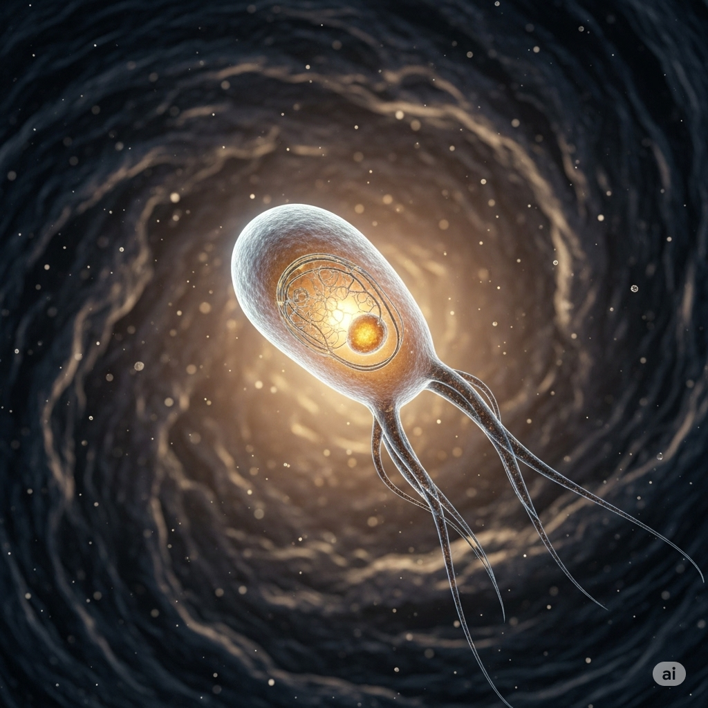

In my small world, things can be absolutely **bizarre**. Unlike most **aquatic** plants and 
animals, I don’t need a **temperate** climate. I have a very high **tolerance** for extreme conditions. Right now, I’m swimming around in a bucket of boiling water! The temperature is 150 degrees **Celsius**, but I feel comfortable. I have **coarse** hairs called cilia that help me swim around in here. I move my cilia in a **repetitive** motion for the **duration** of my swim. I cannot go very fast, though. It takes me about five minutes to swim a distance of just one millimeter!

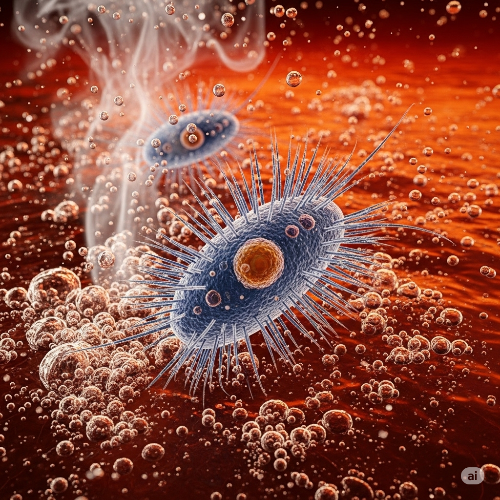

When I get hungry, I look for tiny, **vulnerable** **parasites**. I swim up to one and swallow it whole. I **digest** things much like people do. I have an organ that works just like a human stomach. After I eat, I release nitrogen gas. Nitrogen is a **prominent** gas in the earth’s atmosphere. Other plants and animals need my nitrogen to survive.

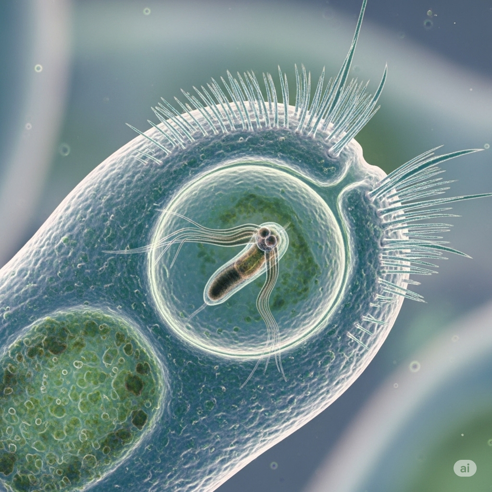

My **reproductive** ability is my most unique trait. I don’t need a **companion** to mate with. Instead, I **undergo** a process called fission, where my own **nucleus** splits in half. An exact copy of my **nucleus** is made, which forms into another protist. It really is an impressive **feat**. I can create an **infinite** number of new protists all by myself!

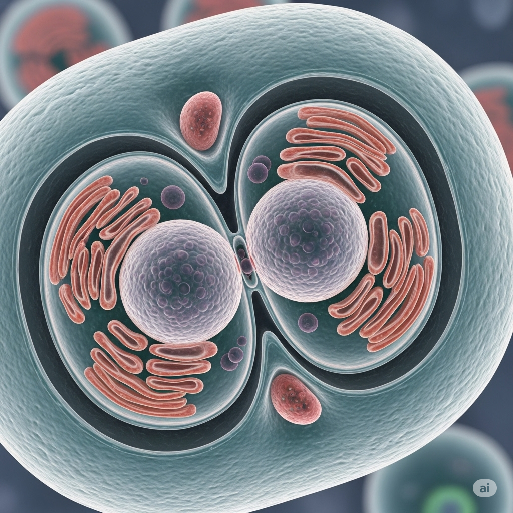

--------

## List of word
aquatic, biosphere, bizarre, Celsius, coarse, companion, digest, duration, ecology, feat, infinite, nucleus, parasite, prominent, repetitive, reproductive, temperate, tolerance, undergo, vulnerable.

## Sentences of story

Small World

Even though people can’t see me, I’m an important part of Earth’s **biosphere**.

Scientists who study **ecology** know that I was the first life form on Earth.

There is more of my kind than any other plant or animal in the world.

Without me, other plants and animals would not even exist, lama protist, and my tiny body is 
made up of one single cell.

In my small world, things can be absolutely **bizarre**.

Unlike most **aquatic** plants and animals, I don’t need a **temperate** climate.

I have a very high **tolerance** for extreme conditions.

Right now, I’m swimming around in a bucket of boiling water!

The temperature is 150 degrees **Celsius**, but I feel comfortable.

I have **coarse** hairs called cilia that help me swim around in here.

I move my cilia in a **repetitive** motion for the **duration** of my swim.

I cannot go very fast, though.

It takes me about five minutes to swim a distance of just one millimeter!

When I get hungry, I look for tiny, **vulnerable** **parasites**.

I swim up to one and swallow it whole.

I **digest** things much like people do.

I have an organ that works just like a human stomach.

After I eat, I release nitrogen gas.

Nitrogen is a **prominent** gas in the earth’s atmosphere.

Other plants and animals need my nitrogen to survive.

My **reproductive** ability is my most unique trait.

I don’t need a **companion** to mate with.

Instead, I **undergo** a process called fission, where my own **nucleus** splits in half.

An exact copy of my **nucleus** is made, which forms into another protist.

It really is an impressive **feat**.

I can create an **infinite** number of new protists all by myself!

## 1. aquatic
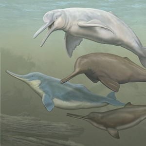
- ipa: /əˈkwæt.ɪk/
- class: adj
- định nghĩa: sống dưới nước, thuộc về nước.
- english definition: living or growing in, happening in, or connected with water.
- sentence of story: Unlike most **aquatic** plants and animals, I don’t need a temperate climate.
- ví dụ thông dụng:
  - We visited the **aquatic** center to see the fish.
  - Many **aquatic** plants grow in this lake.
  - Swimming is my favorite **aquatic** sport.
  - He is studying **aquatic** life.
  - The hotel has a large **aquatic** park.

## 2. biosphere
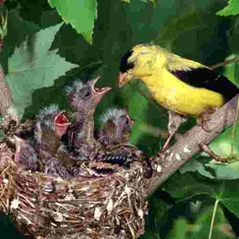
- ipa: /ˈbaɪ.əʊ.sfɪər/
- class: n
- định nghĩa: sinh quyển (phần của Trái Đất có sự sống).
- english definition: the part of the earth's surface and atmosphere where there are living things.
- sentence of story: Even though people can’t see me, I’m an important part of Earth’s **biosphere**.
- ví dụ thông dụng:
  - The **biosphere** includes all life on Earth.
  - Pollution is a danger to the **biosphere**.
  - Scientists study how the **biosphere** works.
  - Every living thing is part of the **biosphere**.
  - We must protect the Earth's **biosphere**.

## 3. bizarre

- ipa: /bɪˈzɑːr/
- class: adj
- định nghĩa: kỳ quái, kỳ lạ, khác thường.
- english definition: very strange and unusual.
- sentence of story: In my small world, things can be absolutely **bizarre**.
- ví dụ thông dụng:
  - He told a **bizarre** story about seeing a ghost.
  - She wears **bizarre** clothes.
  - What a **bizarre** situation!
  - The movie had a **bizarre** ending.
  - I had a **bizarre** dream last night.

## 4. Celsius
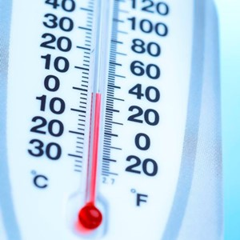
- ipa: /ˈsel.si.əs/
- class: n
- định nghĩa: độ C (đơn vị đo nhiệt độ).
- english definition: a scale of temperature on which water freezes at 0° and boils at 100°.
- sentence of story: The temperature is 150 degrees **Celsius**, but I feel comfortable.
- ví dụ thông dụng:
  - The temperature today is 30 degrees **Celsius**.
  - Water boils at 100 degrees **Celsius**.
  - It was a cold day, only 5 degrees **Celsius**.
  - My oven can go up to 250 degrees **Celsius**.
  - Please set the air conditioner to 24 **Celsius**.

## 5. coarse

- ipa: /kɔːs/
- class: adj
- định nghĩa: thô, ráp, không mịn.
- english definition: rough and not smooth or soft, or not in very small pieces.
- sentence of story: I have **coarse** hairs called cilia that help me swim around in here.
- ví dụ thông dụng:
  - This fabric feels very **coarse**.
  - He has **coarse** hands from working outside.
  - You should use **coarse** sand for this job.
  - The salt was very **coarse**.
  - His **coarse** sweater was uncomfortable.

## 6. companion

- ipa: /kəmˈpæn.jən/
- class: n
- định nghĩa: bạn đồng hành, người đi cùng.
- english definition: a person you spend a lot of time with often because you are friends or because you are travelling together.
- sentence of story: I don’t need a **companion** to mate with.
- ví dụ thông dụng:
  - My dog is a wonderful **companion**.
  - He traveled with a close **companion**.
  - She was a good **companion** on the trip.
  - An elderly person may need a **companion**.
  - He has been my trusted **companion** for years.

## 7. digest
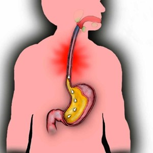
- ipa: /daɪˈdʒest/
- class: v
- định nghĩa: tiêu hóa.
- english definition: to change food in your stomach into substances that your body can use.
- sentence of story: I **digest** things much like people do.
- ví dụ thông dụng:
  - You should wait a little after eating before you swim to **digest** your food.
  - Some foods are easier to **digest** than others.
  - I find it hard to **digest** spicy food.
  - The snake needs time to **digest** its meal.
  - It took me a while to **digest** the bad news.

## 8. duration

- ipa: /dʒʊəˈreɪ.ʃən/
- class: n
- định nghĩa: khoảng thời gian, thời lượng.
- english definition: the length of time that something lasts.
- sentence of story: I move my cilia in a repetitive motion for the **duration** of my swim.
- ví dụ thông dụng:
  - What is the **duration** of the movie?
  - You can park here for a maximum **duration** of two hours.
  - He was in the hospital for the **duration** of the summer.
  - The contract has a **duration** of one year.
  - The storm lasted for the **duration** of the night.

## 9. ecology
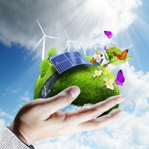
- ipa: /iˈkɒl.ə.dʒi/
- class: n
- định nghĩa: sinh thái học.
- english definition: the relationship of living things to their environment and to each other.
- sentence of story: Scientists who study **ecology** know that I was the first life form on Earth.
- ví dụ thông dụng:
  - She is studying **ecology** at university.
  - The pollution is damaging the local **ecology**.
  - We need to understand the **ecology** of the forest.
  - This book is about marine **ecology**.
  - **Ecology** teaches us how important nature is.

## 10. feat

- ipa: /fiːt/
- class: n
- định nghĩa: kỳ công, thành tích đáng nể.
- english definition: something difficult needing a lot of skill, strength, courage, etc. to achieve it.
- sentence of story: It really is an impressive **feat**.
- ví dụ thông dụng:
  - Building the pyramids was an incredible **feat** of engineering.
  - Winning the game was a remarkable **feat**.
  - It was a **feat** of strength to lift the heavy box.
  - Climbing Mount Everest is a great **feat**.
  - She performed the difficult dance move, an amazing **feat** of balance.

## 11. infinite
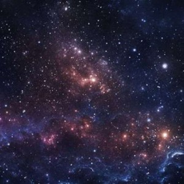
- ipa: /ˈɪn.fɪ.nət/
- class: adj
- định nghĩa: vô hạn, vô tận, không giới hạn.
- english definition: without limits; extremely large or great.
- sentence of story: I can create an **infinite** number of new protists all by myself!
- ví dụ thông dụng:
  - The universe is **infinite**.
  - There are an **infinite** number of possibilities.
  - She has **infinite** patience with her children.
  - The computer has an **infinite** supply of information.
  - He felt a sense of **infinite** space.

## 12. nucleus
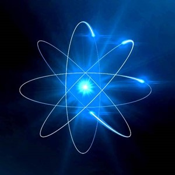
- ipa: /ˈnjuː.kli.əs/
- class: n
- định nghĩa: nhân (của tế bào).
- english definition: the central part of an atom or a cell.
- sentence of story: Instead, I undergo a process called fission, where my own **nucleus** splits in half.
- ví dụ thông dụng:
  - Every cell in your body has a **nucleus**.
  - The **nucleus** contains the cell's DNA.
  - The teacher explained how a cell **nucleus** works.
  - The family is the **nucleus** of society.
  - The protons and neutrons are in the **nucleus** of an atom.

## 13. parasite

- ipa: /ˈpær.ə.saɪt/
- class: n
- định nghĩa: ký sinh trùng.
- english definition: an animal or plant that lives on or in another animal or plant of a different type and feeds from it.
- sentence of story: When I get hungry, I look for tiny, vulnerable **parasites**.
- ví dụ thông dụng:
  - The dog had a **parasite** and was very sick.
  - It's important to cook meat well to kill any **parasites**.
  - A mosquito can carry a dangerous **parasite**.
  - Some fish have **parasites**.
  - The doctor gave me medicine for the **parasite**.

## 14. prominent

- ipa: /ˈprɒm.ɪ.nənt/
- class: adj
- định nghĩa: nổi bật, quan trọng, dễ thấy.
- english definition: very well known and important.
- sentence of story: Nitrogen is a **prominent** gas in the earth’s atmosphere.
- ví dụ thông dụng:
  - She is a **prominent** figure in the art world.
  - He played a **prominent** role in the campaign.
  - The hotel is in a **prominent** location by the sea.
  - He has a **prominent** nose.
  - The story was on the most **prominent** page of the newspaper.

## 15. repetitive
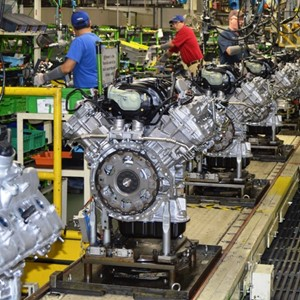
- ipa: /rɪˈpet.ə.tɪv/
- class: adj
- định nghĩa: lặp đi lặp lại.
- english definition: involving doing or saying the same thing several times, especially in a way that is boring.
- sentence of story: I move my cilia in a **repetitive** motion for the duration of my swim.
- ví dụ thông dụng:
  - Working in a factory can be a **repetitive** job.
  - I find this music very **repetitive**.
  - He has a habit of making **repetitive** movements.
  - The teacher told him to avoid **repetitive** sentences in his essay.
  - The training involves some **repetitive** tasks.

## 16. reproductive
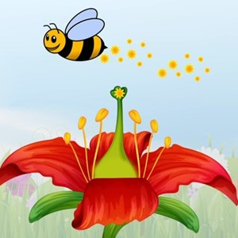
- ipa: /ˌriː.prəˈdʌk.tɪv/
- class: adj
- định nghĩa: (thuộc về) sinh sản.
- english definition: relating to the process of having babies, producing young, or producing new plants.
- sentence of story: My **reproductive** ability is my most unique trait.
- ví dụ thông dụng:
  - We studied the **reproductive** system in biology class.
  - The **reproductive** cycle of this animal is very short.
  - The doctor specializes in **reproductive** health.
  - Pollution can affect the **reproductive** organs of fish.
  - This plant has a high **reproductive** rate.

## 17. temperate
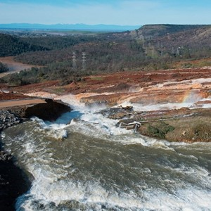
- ipa: /ˈtem.pər.ət/
- class: adj
- định nghĩa: ôn hòa, điều độ.
- english definition: (of a climate) neither very hot nor very cold.
- sentence of story: Unlike most aquatic plants and animals, I don’t need a **temperate** climate.
- ví dụ thông dụng:
  - Great Britain has a **temperate** climate.
  - These plants grow well in **temperate** regions.
  - He is a calm and **temperate** man.
  - Most people prefer to live in a **temperate** zone.
  - The weather is usually **temperate** here in the spring.

## 18. tolerance

- ipa: /ˈtɒl.ər.əns/
- class: n
- định nghĩa: sự chịu đựng, lòng khoan dung.
- english definition: willingness to accept behaviour and beliefs that are different from your own, although you might not agree with them.
- sentence of story: I have a very high **tolerance** for extreme conditions.
- ví dụ thông dụng:
  - We must have **tolerance** for different opinions.
  - She has a high **tolerance** for pain.
  - Religious **tolerance** is very important.
  - My **tolerance** for noise is very low.
  - He has no **tolerance** for people who are late.

## 19. undergo

- ipa: /ˌʌn.dəˈɡəʊ/
- class: v
- định nghĩa: trải qua, chịu đựng.
- english definition: to experience something that is unpleasant or something that involves a change.
- sentence of story: Instead, I **undergo** a process called fission, where my own nucleus splits in half.
- ví dụ thông dụng:
  - She had to **undergo** surgery on her knee.
  - The country is **undergoing** many changes.
  - He will **undergo** treatment for his illness.
  - All new employees must **undergo** a training program.
  - The old building will **undergo** renovation next year.

## 20. vulnerable
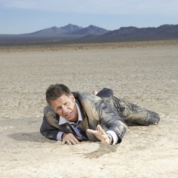
- ipa: /ˈvʌl.nər.ə.bəl/
- class: adj
- định nghĩa: dễ bị tổn thương, yếu đuối.
- english definition: able to be easily physically, emotionally, or mentally hurt, influenced, or attacked.
- sentence of story: When I get hungry, I look for tiny, **vulnerable** **parasites**.
- ví dụ thông dụng:
  - Young birds are very **vulnerable** to predators.
  - He felt very **vulnerable** and alone.
  - We should protect the most **vulnerable** people in our society.
  - The computer system is **vulnerable** to attack.
  - She was in a **vulnerable** position.