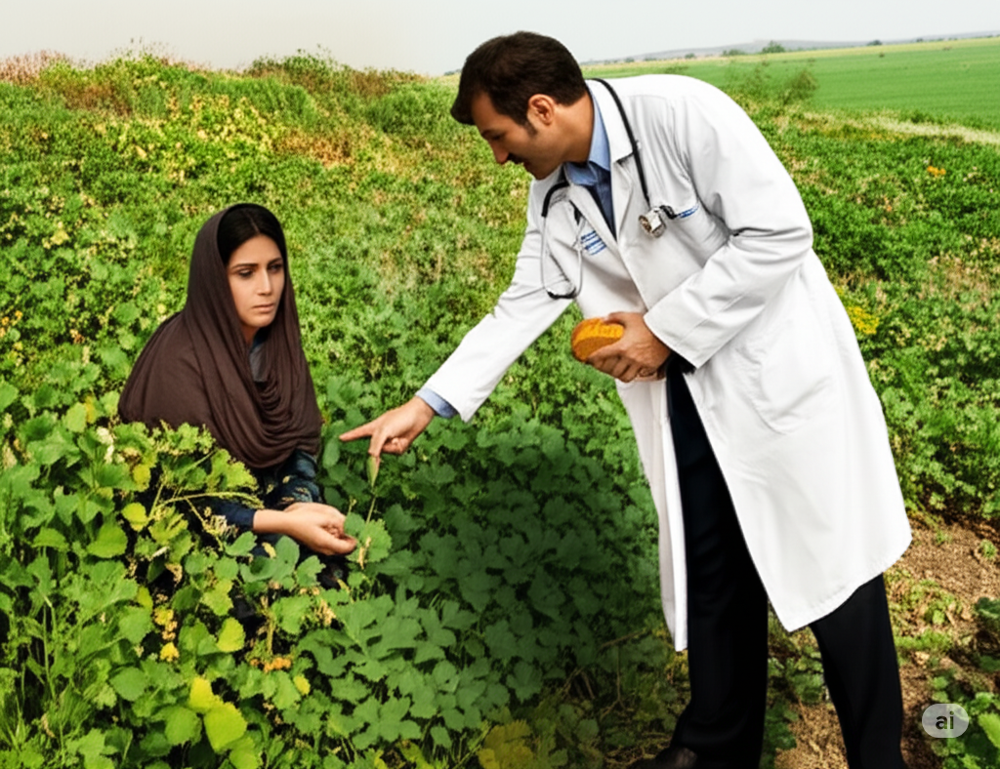

# Becoming a Healer

Years ago, I worked at a small health clinic in a remote country. I had gone there to treat an **obscure** syndrome. It attacked people’s lungs, causing them to need a **respirator** to breathe. I was trying out a new **medication** to treat these people instead of using a **respirator**. If I was successful, I would become famous.

Everything was going fine until war broke out in a nearby country. Many people from that country fled the **hostile** invading army. The army wanted to **dominate** the people, but the people didn’t want to be **oppressed**. So they walked hundreds of miles across **barren** land to get away.

Some of these people came to our clinic for treatment. I talked with them and learned of their difficulties. They did not beg or complain. I was impressed by their **dignity**.

There was one woman I will never forget. Her son suffered from **malnutrition** and stomach pain, and she didn’t know what to do. Neither did I.I was not **adept** at treating **malnutrition**. Nonetheless, when I saw her sadness, I knew I had to help her son.

The woman had been feeding her son bread and water. She had a **misconception** that it would be enough for him. However, I knew that he needed to eat vegetables, too. So I took her outside and showed her a **dense** patch of **edible** plants. I taught her howto dig up the roots, **peel** them, and cook them for her son. I explained that she should increase her son’s **intake** of these vegetables. **Likewise**, she should **strive** to get him some meat once a week to help him regain his strength.

I sent her off with a **prescription** for some pain medicine, but she also left my office with some new **culinary** skills. A few weeks later, she returned to tell me her son was healthy again. As thanks, she gave me a beautiful **ceramic** bowl.

I never become famous, but I kept that bowl to remind me what it truly means to heal someone.

## List of word

adept barren ceramic culinary dense dignity dominate edible hostile intake likewise malnutrition medication misconception obscure oppress peel prescription respirator strive.

## Sentences of story

Becoming a Healer

Years ago, I worked at a small health clinic in a remote country.

I had gone there to treat an **obscure** syndrome.

It attacked people’s lungs, causing them to need a **respirator** to breathe.

I was trying out a new **medication** to treat these people instead of using a **respirator**.

If I was successful, I would become famous.

Everything was going fine until war broke out in a nearby country.

Many people from that country fled the **hostile** invading army.

The army wanted to **dominate** the people, but the people didn’t want to be **oppressed**.

So they walked hundreds of miles across **barren** land to get away.

Some of these people came to our clinic for treatment.

I talked with them and learned of their difficulties.

They did not beg or complain.

I was impressed by their **dignity**.

There was one woman I will never forget.

Her son suffered from **malnutrition** and stomach pain, and she didn’t know what to do.

Neither did I.

I was not **adept** at treating **malnutrition**.

Nonetheless, when I saw her sadness, I knew I had to help her son.

The woman had been feeding her son bread and water.

She had a **misconception** that it would be enough for him.

However, I knew that he needed to eat vegetables, too.

So I took her outside and showed her a **dense** patch of **edible** plants.

I taught her howto dig up the roots, **peel** them, and cook them for her son.

I explained that she should increase her son’s **intake** of these vegetables.

**Likewise**, she should **strive** to get him some meat once a week to help him regain his 
strength.

I sent her off with a **prescription** for some pain medicine, but she also left my office with 
some new **culinary** skills.

A few weeks later, she returned to tell me her son was healthy again.

As thanks, she gave me a beautiful **ceramic** bowl.

I never become famous, but I kept that bowl to remind me what it truly means to heal someone.

## 1. adept

- ipa: /əˈdept/
- class: adj
- định nghĩa: thành thạo, giỏi, tinh thông.
- english definition: having a natural ability to do something that needs skill.
- sentence of story: I was not **adept** at treating malnutrition.
- ví dụ thông dụng:
  - She is very **adept** at painting.
  - He's an **adept** driver.
  - You need to be **adept** at using computers for this job.
  - After years of practice, he became **adept** at playing the piano.
  - My friend is **adept** at fixing things.

## 2. barren

- ipa: /ˈbær.ən/
- class: adj
- định nghĩa: cằn cỗi, không có cây cối.
- english definition: unable to produce plants or fruit.
- sentence of story: So they walked hundreds of miles across **barren** land to get away.
- ví dụ thông dụng:
  - The land was **barren** and dry.
  - Nothing can grow in this **barren** soil.
  - We drove through a **barren** landscape.
  - It was a **barren** desert with no water.
  - The garden looked **barren** in the winter.

## 3. ceramic

- ipa: /səˈræm.ɪk/
- class: adj
- định nghĩa: (làm bằng) gốm, sứ.
- english definition: made of clay and permanently hardened by heat.
- sentence of story: As thanks, she gave me a beautiful **ceramic** bowl.
- ví dụ thông dụng:
  - I bought a **ceramic** vase.
  - This **ceramic** tile is for the bathroom floor.
  - She collects **ceramic** dolls.
  - The museum has many ancient **ceramic** pots.
  - Be careful, that **ceramic** cup is fragile.

## 4. culinary

- ipa: /ˈkʌl.ɪ.nər.i/
- class: adj
- định nghĩa: (thuộc về) nấu nướng, ẩm thực.
- english definition: connected with cooking or kitchens.
- sentence of story: I sent her off with a prescription for some pain medicine, but she also left my office with some new **culinary** skills.
- ví dụ thông dụng:
  - He is a student at a **culinary** school.
  - She has excellent **culinary** skills.
  - The restaurant is known for its **culinary** delights.
  - I want to take a **culinary** tour of Italy.
  - The chef is a **culinary** expert.

## 5. dense

- ipa: /dens/
- class: adj
- định nghĩa: dày đặc, rậm rạp.
- english definition: having parts that are close together.
- sentence of story: So I took her outside and showed her a **dense** patch of edible plants.
- ví dụ thông dụng:
  - We walked through a **dense** forest.
  - The city is very **dense** with buildings.
  - The fog was so **dense** I couldn't see anything.
  - This book is quite **dense** and hard to read.
  - She has beautiful, **dense** hair.

## 6. dignity

- ipa: /ˈdɪɡ.nə.ti/
- class: n
- định nghĩa: phẩm giá, lòng tự trọng.
- english definition: the importance and value that a person has, that makes other people respect them or makes them respect themselves.
- sentence of story: I was impressed by their **dignity**.
- ví dụ thông dụng:
  - He is a man of great **dignity**.
  - She faced her illness with courage and **dignity**.
  - It's important to treat everyone with **dignity**.
  - Even though he was poor, he never lost his **dignity**.
  - The old king had an air of **dignity**.

## 7. dominate

- ipa: /ˈdɒm.ɪ.neɪt/
- class: v
- định nghĩa: thống trị, chi phối, áp đảo.
- english definition: to have control over a place or person.
- sentence of story: The army wanted to **dominate** the people, but the people didn’t want to be oppressed.
- ví dụ thông dụng:
  - He always wants to **dominate** the conversation.
  - The big company tries to **dominate** the market.
  - Their team **dominated** the game from the start.
  - She has a personality that tends to **dominate**.
  - The tall building **dominates** the skyline.

## 8. edible

- ipa: /ˈed.ə.bəl/
- class: adj
- định nghĩa: có thể ăn được (không độc).
- english definition: suitable or safe for eating.
- sentence of story: So I took her outside and showed her a dense patch of **edible** plants.
- ví dụ thông dụng:
  - Are these mushrooms **edible**?
  - Not all berries in the forest are **edible**.
  - The flowers on the cake are **edible**.
  - We need to find some **edible** plants.
  - The restaurant uses **edible** gold in some dishes.

## 9. hostile

- ipa: /ˈhɒs.taɪl/
- class: adj
- định nghĩa: thù địch, chống đối.
- english definition: unfriendly and not liking or agreeing with something.
- sentence of story: Many people from that country fled the **hostile** invading army.
- ví dụ thông dụng:
  - The crowd became **hostile** towards the police.
  - She gave me a **hostile** look.
  - He was not expecting such a **hostile** reaction.
  - The company faced a **hostile** takeover bid.
  - The desert is a **hostile** environment.

## 10. intake

- ipa: /ˈɪn.teɪk/
- class: n
- định nghĩa: lượng (thức ăn, nước uống) nạp vào.
- english definition: the amount of something such as food, drink, or air that is taken into the body.
- sentence of story: I explained that she should increase her son’s **intake** of these vegetables.
- ví dụ thông dụng:
  - You need to reduce your daily salt **intake**.
  - What is your recommended daily **intake** of calories?
  - His **intake** of water is too low.
  - The doctor asked about my food **intake**.
  - A high **intake** of sugar is bad for your health.

## 11. likewise

- ipa: /ˈlaɪk.waɪz/
- class: adv
- định nghĩa: cũng vậy, tương tự.
- english definition: in the same way.
- sentence of story: **Likewise**, she should strive to get him some meat once a week to help him regain his strength.
- ví dụ thông dụng:
  - He voted for the new law and I did **likewise**.
  - "It was nice to meet you." "**Likewise**."
  - You should wash your hands, and your children should do **likewise**.
  - She bought a new dress; **likewise**, her sister bought a new shirt.
  - He is a good student, and his brother is **likewise**.

## 12. malnutrition

- ipa: /ˌmæl.njuːˈtrɪʃ.ən/
- class: n
- định nghĩa: sự suy dinh dưỡng.
- english definition: physical weakness and bad health caused by having too little food, or too little of the types of food necessary for good health.
- sentence of story: Her son suffered from **malnutrition** and stomach pain, and she didn’t know what to do.
- ví dụ thông dụng:
  - Many children in poor countries suffer from **malnutrition**.
  - The doctor said the child's problem was **malnutrition**.
  - **Malnutrition** is a serious health issue.
  - A bad diet can lead to **malnutrition**.
  - They are working to prevent **malnutrition** in the community.

## 13. medication

- ipa: /ˌmed.ɪˈkeɪ.ʃən/
- class: n
- định nghĩa: thuốc men, dược phẩm.
- english definition: a medicine, or a set of medicines or drugs, used to improve a particular condition or illness.
- sentence of story: I was trying out a new **medication** to treat these people instead of using a respirator.
- ví dụ thông dụng:
  - Are you taking any **medication**?
  - The doctor gave me **medication** for my cold.
  - You should take this **medication** with food.
  - He is on heart **medication**.
  - Never share your **medication** with others.

## 14. misconception

- ipa: /ˌmɪs.kənˈsep.ʃən/
- class: n
- định nghĩa: sự hiểu lầm, quan niệm sai lầm.
- english definition: an idea that is wrong because it has been based on a failure to understand a situation.
- sentence of story: She had a **misconception** that it would be enough for him.
- ví dụ thông dụng:
  - It is a common **misconception** that all snakes are dangerous.
  - We need to correct this **misconception**.
  - I was under the **misconception** that the class was cancelled.
  - Many people have **misconceptions** about this topic.
  - Let me clear up a popular **misconception**.

## 15. obscure

- ipa: /əbˈskjʊər/
- class: adj
- định nghĩa: khó hiểu, mơ hồ, ít người biết đến.
- english definition: not known to many people.
- sentence of story: I had gone there to treat an **obscure** syndrome.
- ví dụ thông dụng:
  - He is an **obscure** actor.
  - The details of his past are **obscure**.
  - The meaning of the poem is very **obscure**.
  - She lives in an **obscure** little town.
  - The movie is full of **obscure** references.

## 16. oppress

- ipa: /əˈpres/
- class: v
- định nghĩa: đàn áp, áp bức.
- english definition: to govern people in an unfair and cruel way and prevent them from having opportunities and freedom.
- sentence of story: The army wanted to dominate the people, but the people didn’t want to be **oppressed**.
- ví dụ thông dụng:
  - The new ruler began to **oppress** the people.
  - They were **oppressed** by the government for many years.
  - It is wrong to **oppress** others.
  - The people fought against those who **oppressed** them.
  - He felt **oppressed** by the strict rules.

## 17. peel

- ipa: /piːl/
- class: v
- định nghĩa: gọt vỏ, bóc vỏ.
- english definition: to remove the skin of fruit and vegetables.
- sentence of story: I taught her howto dig up the roots, **peel** them, and cook them for her son.
- ví dụ thông dụng:
  - Could you **peel** the potatoes for me?
  - I need to **peel** an orange.
  - Be careful when you **peel** the apple with a knife.
  - The old paint is starting to **peel** off the wall.
  - He **peeled** the sticker off the box.

## 18. prescription

- ipa: /prɪˈskrɪp.ʃən/
- class: n
- định nghĩa: đơn thuốc.
- english definition: a piece of paper on which a doctor writes the details of the medicine or drugs that someone needs.
- sentence of story: I sent her off with a **prescription** for some pain medicine, but she also left my office with some new culinary skills.
- ví dụ thông dụng:
  - The doctor gave me a **prescription** for antibiotics.
  - You need a **prescription** to buy this medicine.
  - I need to go to the pharmacy to fill my **prescription**.
  - This medication is available only by **prescription**.
  - Can I get a repeat **prescription**?

## 19. respirator

- ipa: /ˈres.pɪ.reɪ.tər/
- class: n
- định nghĩa: máy thở, máy hô hấp.
- english definition: a device used to help people with breathing problems to breathe.
- sentence of story: It attacked people’s lungs, causing them to need a **respirator** to breathe.
- ví dụ thông dụng:
  - The patient was put on a **respirator**.
  - After the accident, he needed a **respirator** to breathe.
  - Firefighters wear a special **respirator** to protect them from smoke.
  - The hospital has a shortage of **respirators**.
  - The baby was so sick he had to be on a **respirator**.

## 20. strive

- ipa: /straɪv/
- class: v
- định nghĩa: cố gắng, phấn đấu.
- english definition: to try very hard to do something or to make something happen, especially for a long time or against difficulties.
- sentence of story: **Likewise**, she should **strive** to get him some meat once a week to help him regain his strength.
- ví dụ thông dụng:
  - We must **strive** to do our best.
  - She always **strives** for perfection.
  - They continue to **strive** for success.
  - You should **strive** to be a better person.
  - We **strive** to provide the best service to our customers.