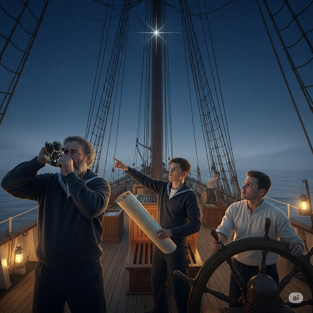
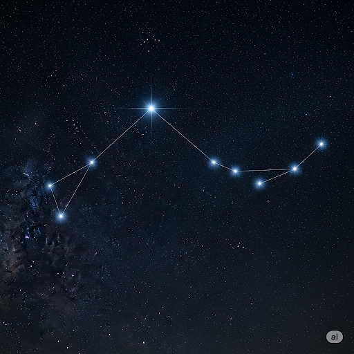
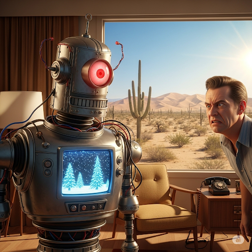
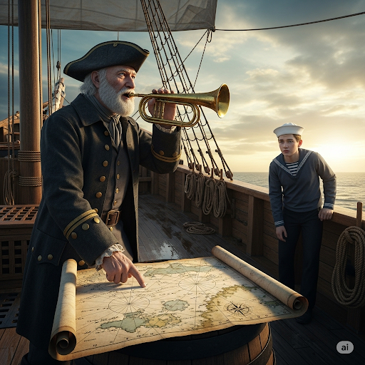

# The North Star

Among the multitude of stars in the universe, there are a couple that are of great importance to people on Earth. The sun, of course, is one of them. The other is known as Polaris, the North Star. Polaris is special because it is the only star that always appears to be in the same place in the sky. Therefore, Polaris is a great compass. When people in the northern hemisphere of Earth look toward Polaris, they can be certain that they are facing north. The permanence of Polaris in the north sky has helped countless people find their destinations.

Before the invention of modern navigation tools, mariners relied on Polaris. From the top of their hulls, sailors would look for Polaris to figure out their place at sea. They figured out the angle between the star and the horizon to determine their latitude. As long as the equations weren’t erroneous, the results were very reliable. Polaris also let sailors determine North, South, East, and West. By knowing directions and their location, mariners could easily navigate their ships.

To those who sail at night, volatile storms and dark clouds were more than nuisances. They could disrupt entire journeys by blocking the view of Polaris. A captain could err and make an inadvertent wrong turn. The ship could become stranded at sea, and the frantic captain would have no way to improvise to get the ship back on the right course. The mariner’s fears wouldn’t be soothed until the clouds cleared and Polaris came back into view. Even today, sailors sometimes opt to navigate by using Polaris on clear nights.

It’s not difficult to differentiate Polaris from other stars. The Big Dipper, a constellation that is well known in astrology, appears to revolve around Polaris. The handle of the Big Dipper always points to the North Star. When people get lost, it’s comforting to know that their problems can be alleviated by looking at the sky.

## Sentences of story

The North Star

Among the multitude of stars in the universe, there are a couple that are of great importance to people on Earth.

The sun, of course, is one of them.

The other is known as Polaris, the North Star.

Polaris is special because it is the only star that always appears to be in the same place in the sky.

Therefore, Polaris is a great compass.

When people in the northern hemisphere of Earth look toward Polaris, they can be certain that they are facing north.

The permanence of Polaris in the north sky has helped countless people find their destinations.

Before the invention of modern navigation tools, mariners relied on Polaris.

From the top of their hulls, sailors would look for Polaris to figure out their place at sea.

They figured out the angle between the star and the horizon to determine their latitude.

As long as the equations weren’t erroneous, the results were very reliable.

Polaris also let sailors determine North, South, East, and West.

By knowing directions and their location, mariners could easily navigate their ships.

To those who sail at night, volatile storms and dark clouds were more than nuisances.

They could disrupt entire journeys by blocking the view of Polaris.

A captain could err and make an inadvertent wrong turn.

The ship could become stranded at sea, and the frantic captain would have no way to improvise to get the ship back on the right course.

The mariner’s fears wouldn’t be soothed until the clouds cleared and Polaris came back into view.

Even today, sailors sometimes opt to navigate by using Polaris on clear nights.

It’s not difficult to differentiate Polaris from other stars.

The Big Dipper, a constellation that is well known in astrology, appears to revolve around Polaris.

The handle of the Big Dipper always points to the North Star.

When people get lost, it’s comforting to know that their problems can be alleviated by looking at the sky.

## List of word

alleviate, astrology, differentiate, disrupt, equation, err, erroneous, frantic, hull, inadvertent, improvise, latitude, mariner, multitude, nuisance, permanence, revolve, soothe, stranded, volatile

## 1. alleviate

### IPA: /əˈliː.vi.eɪt/
### Class: v
### Câu truyện ẩn dụ:
Ngày xưa, dân làng phải đóng thuế rất nặng. Một cô gái tên Ly Vi quyết định yết kiến nhà vua. Cô tâu: "*Ờ, Ly Vi yết* kiến bệ hạ để xin bệ hạ **làm giảm bớt** (alleviate) gánh nặng thuế khóa cho dân làng ạ." Nhà vua thấy cô gái can đảm và hợp lý nên đã đồng ý. Từ đó, `alleviate` mang ý nghĩa làm nhẹ bớt, làm dịu đi một nỗi đau hay khó khăn.

### Định nghĩa : 
Làm giảm bớt, làm dịu đi.

### English definition: 
To make something bad such as pain or problems less severe.

### Sentence of stroy:
When people get lost, it’s comforting to know that their problems can be **alleviated** by looking at the sky.

### Ví dụ thông dụng:
1. The drugs did nothing to alleviate her pain.
2. A good massage can alleviate stress.

## 2. astrology

### IPA: /əˈstrɒl.ə.dʒi/
### Class: n
### Câu truyện ẩn dụ:
Có một ông thầy bói kỳ lạ, khi xem bói ông không dùng bài hay nhìn tay. Ông chỉ lên trời và nói: "*Ơ, trời ló gì* (Ơ-stró-lơ-gi) thì số mệnh con như vậy." Thì ra, ông đang nhìn các vì sao để tiên đoán tương lai. Môn khoa học huyền bí nghiên cứu ảnh hưởng của các vì sao đến vận mệnh con người đó chính là **chiêm tinh học** (astrology).

### Định nghĩa : 
Chiêm tinh học.

### English definition: 
The study of the movements and positions of the sun, moon, planets, and stars in the belief that they affect the character and lives of people.

### Sentence of stroy:
The Big Dipper, a constellation that is well known in **astrology**, appears to revolve around Polaris.

### Ví dụ thông dụng:
1. He is a great believer in astrology.
2. My horoscope is an important part of my daily astrology reading.

## 3. differentiate

### IPA: /ˌdɪf.əˈren.ʃi.eɪt/
### Class: v
### Câu truyện ẩn dụ:
Một ông sếp yêu cầu nhân viên đi phơi ren. Ông dặn: "*Đi phơi ren sếp ấy*, nhớ phải **phân biệt** (differentiate) rõ ràng ren lụa và ren cotton, phơi ở hai giàn khác nhau." Cậu nhân viên phải nhìn rất kỹ để nhận ra sự khác biệt giữa hai loại. Từ đó, `differentiate` có nghĩa là nhận ra hoặc chỉ ra sự khác biệt.

### Định nghĩa : 
Phân biệt, nhận ra sự khác biệt.

### English definition: 
To show or find the difference between things that are compared.

### Sentence of stroy:
It’s not difficult to **differentiate** Polaris from other stars.

### Ví dụ thông dụng:
1. It's difficult to differentiate between the two varieties.
2. A child may not differentiate between his own needs and the needs of others.

## 4. disrupt

### IPA: /dɪsˈrʌpt/
### Class: v
### Câu truyện ẩn dụ:
Trong một buổi hòa nhạc trang trọng, một khán giả phía sau bỗng la lên: "Cái ghế này **đít rắp** rồi, ngồi không được!". Tiếng la hét của ông ta đã **làm gián đoạn** (disrupt) cả buổi biểu diễn, khiến mọi người mất tập trung. Hành động phá vỡ sự liên tục của một sự kiện chính là `disrupt`.

### Định nghĩa : 
Làm gián đoạn, phá vỡ.

### English definition: 
To prevent something, especially a system, process, or event, from continuing as usual or as expected.

### Sentence of stroy:
They could **disrupt** entire journeys by blocking the view of Polaris.

### Ví dụ thông dụng:
1. A heavy snowfall disrupted the city's transport system.
2. Please don't disrupt the class.

## 5. equation

### IPA: /ɪˈkweɪ.ʒən/
### Class: n
### Câu truyện ẩn dụ:
Một nhà toán học đang giảng bài, ông nói: "*Y quên dần* (i-quây-sần) các con số rồi à? Để nhớ được mối quan hệ bằng nhau giữa các đại lượng, ta phải dùng **phương trình** (equation)." Ông liền viết lên bảng công thức E=mc² để minh họa.

### Định nghĩa : 
Phương trình, công thức.

### English definition: 
A mathematical statement that shows that two amounts are equal.

### Sentence of stroy:
As long as the **equations** weren’t erroneous, the results were very reliable.

### Ví dụ thông dụng:
1. Can you solve this equation?
2. In chemistry, a chemical equation shows the reaction between substances.

## 6. err

### IPA: /ɜːr/
### Class: v
### Câu truyện ẩn dụ:
Một cậu bé đang tập viết chữ. Cậu viết sai một chữ, rồi tự nói với mình: "**Ơ**, mình lại **phạm sai lầm** (err) rồi!". Âm thanh "ơ" thể hiện sự ngạc nhiên khi nhận ra mình đã mắc lỗi.

### Định nghĩa : 
Phạm sai lầm, mắc lỗi.

### English definition: 
To make a mistake or to do something wrong.

### Sentence of stroy:
A captain could **err** and make an inadvertent wrong turn.

### Ví dụ thông dụng:
1. To err is human, to forgive is divine.
2. He erred in his judgment.

## 7. erroneous

### IPA: /ɪˈrəʊ.ni.əs/
### Class: adj
### Câu truyện ẩn dụ:
Một con rô-bốt bị hỏng, nó cứ đưa ra thông tin thời tiết sai bét. Chủ nhân của nó phàn nàn: "*Y rô ni* (i-rô-ni-ợt), nó lại bảo hôm nay có tuyết rơi ở sa mạc. Toàn là thông tin **sai lầm** (erroneous)."

### Định nghĩa : 
Sai lầm, không chính xác.

### English definition: 
Wrong; incorrect.

### Sentence of stroy:
As long as the equations weren’t **erroneous**, the results were very reliable.

### Ví dụ thông dụng:
1. He came to the erroneous conclusion that he was the smartest person in the room.
2. The report was based on erroneous data.

## 8. frantic

### IPA: /ˈfræn.tɪk/
### Class: adj
### Câu truyện ẩn dụ:
Một họa sĩ đánh đổ lọ mực lên bức tranh sắp hoàn thành. Ông trở nên **điên cuồng** (frantic), vội vàng dùng giẻ lau, miệng lẩm bẩm: "Phen này hỏng thật rồi, phải tích cực lau đi!". Ông lau một cách cuống cuồng, hoảng loạn.

### Định nghĩa : 
Điên cuồng, cuống cuồng.

### English definition: 
Almost out of control because of extreme emotion, such as worry.

### Sentence of stroy:
...the **frantic** captain would have no way to improvise to get the ship back on the right course.

### Ví dụ thông dụng:
1. She made a frantic dash for the train.
2. The frantic parents searched for their missing child.

## 9. hull

### IPA: /hʌl/
### Class: n
### Câu truyện ẩn dụ:
Một cậu bé lần đầu ra biển, chỉ vào phần dưới của con tàu và hỏi bố: "**Hở**? Cái gì to thế kia ạ?". Người bố trả lời: "Đó là **thân tàu** (hull) đó con, là bộ phận chính của con tàu."

### Định nghĩa : 
Thân tàu, thân thuyền.

### English definition: 
The main body of a ship or other vessel, including the bottom, sides, and deck.

### Sentence of stroy:
From the top of their **hulls**, sailors would look for Polaris to figure out their place at sea.

### Ví dụ thông dụng:
1. The hull of the ship was damaged in the storm.
2. They scraped the barnacles off the boat's hull.

## 10. inadvertent

### IPA: /ˌɪn.ədˈvɜː.tənt/
### Class: adj
### Câu truyện ẩn dụ:
Một cô bé đang vẽ tranh thì một con vẹt bay tới và làm đổ lọ màu. Mẹ cô bé hỏi: "Ai làm đổ màu vậy con?". Cô bé chỉ vào con vẹt và nói: "*Trong đó có con vẹt á tần*, nó làm đổ màu một cách **vô ý** (inadvertent) thôi mẹ ạ."

### Định nghĩa : 
Vô ý, không cố ý.

### English definition: 
Not intentional.

### Sentence of stroy:
A captain could err and make an **inadvertent** wrong turn.

### Ví dụ thông dụng:
1. It was an inadvertent mistake.
2. All authors are liable to make inadvertent errors.

## 11. improvise

### IPA: /ˈɪm.prə.vaɪz/
### Class: v
### Câu truyện ẩn dụ:
Trong một buổi biểu diễn, cây đàn guitar của nghệ sĩ bỗng đứt dây. Khán giả im phăng phắc. Người nghệ sĩ liền **ứng biến** (improvise), ông dùng chính thùng đàn và vỗ tay để tạo ra nhịp điệu. Mọi người trầm trồ: "Thật là một người *pro*! Dù **im** lặng một chút nhưng đã ứng biến bằng **vai** và tay rất tuyệt."

### Định nghĩa : 
Ứng biến, làm tuỳ cơ ứng biến.

### English definition: 
To invent or make something, such as a speech or a meal, at the time when it is needed without already having planned it.

### Sentence of stroy:
...the frantic captain would have no way to **improvise** to get the ship back on the right course.

### Ví dụ thông dụng:
1. I hadn't prepared a speech, so I had to improvise.
2. The chef had to improvise a meal with the few ingredients he had left.

## 12. latitude

### IPA: /ˈlæt.ɪ.tʃuːd/
### Class: n
### Câu truyện ẩn dụ:
Trên một con tàu, thuyền trưởng hét vào chiếc loa: "*La to tút*! *La to tút*!". Một thủy thủ trẻ thắc mắc. Thuyền trưởng giải thích: "Ta đang dùng sóng âm để xác định **vĩ độ** (latitude) của chúng ta đấy."

### Định nghĩa : 
Vĩ độ.

### English definition: 
The position north or south of the equator measured from 0° to 90°.

### Sentence of stroy:
They figured out the angle between the star and the horizon to determine their **latitude**.

### Ví dụ thông dụng:
1. The ship was sailing in the northern latitudes.
2. At this latitude, the sun is very strong.

## 13. mariner

### IPA: /ˈmær.ɪ.nər/
### Class: n
### Câu truyện ẩn dụ:
Mỗi lần con trai ra khơi, người mẹ lại đứng trên bến cảng. Bà nói: "**Mẹ rình** nó đi cho an toàn, vì nó là một **thủy thủ** (mariner) mà, nghề này nguy hiểm lắm."

### Định nghĩa : 
Thủy thủ, người đi biển.

### English definition: 
A sailor.

### Sentence of stroy:
Before the invention of modern navigation tools, **mariners** relied on Polaris.

### Ví dụ thông dụng:
1. The ancient mariner sailed the seven seas.
2. The story is about a mariner who was lost at sea.

## 14. multitude

### IPA: /ˈmʌl.tɪ.tʃuːd/
### Class: n
### Câu truyện ẩn dụ:
Trong một cuộc thi sắc đẹp, **vô số** (multitude) thí sinh tham gia. Một giám khảo nhận xét: "**Muôn** người đi **thi** mà ai cũng **tút** tát lại nhan sắc thì tạo ra một đám đông lộng lẫy."

### Định nghĩa : 
Vô số, đám đông.

### English definition: 
A large number of people or things.

### Sentence of stroy:
Among the **multitude** of stars in the universe, there are a couple that are of great importance to people on Earth.

### Ví dụ thông dụng:
1. A multitude of people gathered in the square.
2. The library has a multitude of books on the subject.

## 15. nuisance

### IPA: /ˈnjuː.səns/
### Class: n
### Câu truyện ẩn dụ:
Một con ruồi cứ bay vo ve quanh mặt một người đang đọc sách. Ông ta bực mình đập tay xuống bàn và nói: "Con ruồi này đúng là **mối phiền toái** (nuisance) thực sự, nó làm **nui** cái **sân** si trong lòng mình lên."

### Định nghĩa : 
Mối phiền toái, sự phiền phức.

### English definition: 
Something or someone that annoys you or causes trouble for you.

### Sentence of stroy:
To those who sail at night, volatile storms and dark clouds were more than **nuisances**.

### Ví dụ thông dụng:
1. The loud music from next door is a real nuisance.
2. I hope you're not making a nuisance of yourself.

## 16. permanence

### IPA: /ˈpɜː.mə.nəns/
### Class: n
### Câu truyện ẩn dụ:
Một ông thợ rèn đang nắn một thanh sắt. Ông nói với cậu học trò: "**Phải mài nắn** nó thật kỹ thì mới tạo ra được **sự lâu dài**, **sự vĩnh cửu** (permanence) cho sản phẩm."

### Định nghĩa : 
Sự lâu dài, sự vĩnh cửu.

### English definition: 
The state of lasting for a long time or for all time.

### Sentence of stroy:
The **permanence** of Polaris in the north sky has helped countless people find their destinations.

### Ví dụ thông dụng:
1. The permanence of his love for her was unquestionable.
2. Nothing in this world has permanence.

## 17. revolve

### IPA: /rɪˈvɒlv/
### Class: v
### Câu truyện ẩn dụ:
Một người cha dẫn con đi chơi công viên. Ông chỉ vào vòng quay ngựa gỗ và nói: "**Đi vô** đó chơi đi con, nó **xoay quanh** (revolve) một cái trục ở giữa vui lắm."

### Định nghĩa : 
Xoay quanh, quay tròn.

### English definition: 
To move or cause something to move around a central point or line.

### Sentence of stroy:
The Big Dipper, a constellation that is well known in astrology, appears to **revolve** around Polaris.

### Ví dụ thông dụng:
1. The Earth revolves around the Sun.
2. The conversation revolved around their favorite movies.

## 18. soothe

### IPA: /suːð/
### Class: v
### Câu truyện ẩn dụ:
Một em bé đang khóc. Mẹ bé bế em lên, hát ru và nói: "Nín đi con, mẹ **xoa dịu** (soothe) cho con nhé. Ngoan rồi mẹ cho **sữa**." Lời nói nhẹ nhàng và hành động vỗ về của người mẹ đã làm dịu cơn khóc của em bé.

### Định nghĩa : 
Xoa dịu, làm dịu.

### English definition: 
To make someone feel calm or less worried.

### Sentence of stroy:
The mariner’s fears wouldn’t be **soothed** until the clouds cleared and Polaris came back into view.

### Ví dụ thông dụng:
1. She played some music to soothe the crying baby.
2. A hot bath will soothe your aching muscles.

## 19. stranded

### IPA: /ˈstræn.dɪd/
### Class: adj
### Câu truyện ẩn dụ:
Một nhóm du khách bị hỏng xe giữa sa mạc. Một người trong số họ nói đùa: "Quả này thì **sờ trán** mà khóc thôi, chúng ta bị **mắc kẹt** (stranded) ở đây rồi."

### Định nghĩa : 
Bị mắc kẹt, bị bỏ lại.

### English definition: 
Unable to leave somewhere because of a problem such as not having any transport or money.

### Sentence of stroy:
The ship could become **stranded** at sea...

### Ví dụ thông dụng:
1. Hundreds of passengers were left stranded at the airport.
2. The whale was stranded on the beach.

## 20. volatile

### IPA: /ˈvɒl.ə.taɪl/
### Class: adj
### Câu truyện ẩn dụ:
Một nhà hóa học đang quan sát một chất lỏng trong ống nghiệm. Ông ghi chú: "Chất này rất **dễ bay hơi**, tính chất **dễ thay đổi** (volatile). Phải cẩn thận, không thì nó **vỡ ra tai** hại."

### Định nghĩa : 
Dễ thay đổi, không ổn định, dễ bay hơi.

### English definition: 
Likely to change suddenly and unexpectedly, especially by getting worse.

### Sentence of stroy:
To those who sail at night, **volatile** storms and dark clouds were more than nuisances.

### Ví dụ thông dụng:
1. The political situation in the region is highly volatile.
2. He has a volatile temper.