# The Avalanche

Randy was a forest ranger. Because of his job, he was secluded in a cabin in the wilderness.

One day, the radio reported, “Convection in the atmosphere is causing a lot of clouds to form. A serious storm ...” Suddenly, the radio went silent. The signal was lost.

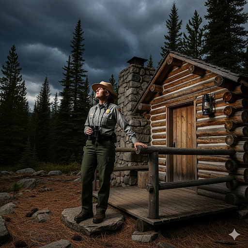

He went outside and looked at the overcast sky. Anybody else would have taken the dark sky as an omen of a very bad storm, but not Randy. His upbringing had taught him consistency. He had done this job for years, and nothing could stop him. Besides, he thought nothing could hurt him.

Today, he had a very important task to do. The snow was starting to pile up high on the mountain. If too much accumulated, it could cause an avalanche. But Randy had an apparatus to get rid of the snow. It used dynamite to shake the snow and make the top layer of snow come down.

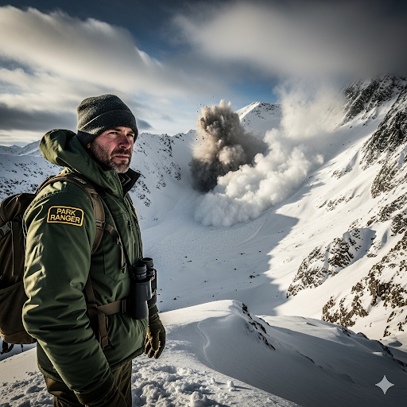

As the snow started falling, he thought about returning to the office until the storm stopped, but he decided not to. Suddenly, he heard a loud noise behind him. It was an avalanche! He started to run, but within seconds, he was knocked sideways and buried by the snow and rubble from an old cabin that had been destroyed. An aerial rescue team came quickly. Randy was just a speck amongst the great pile of snow, but the team found him thanks to his brightly colored jacket. They quickly took him to a hospital.

After a few hours, Randy woke up in the hospital. He looked at the sober faces of the doctors and saw his wife sobbing.

“What’s wrong?” he asked. He didn’t remember what had happened.

“You were almost killed!” his wife said.

“You broke several ribs. But the rest of you is still reasonably intact. You are really lucky to be alive,” the doctor said.

After five days, Randy was discharged from the hospital. The experience had taught him a poignant lesson: he was a mortal, and nature was much more powerful than him.

## Sentences of story

The Avalanche

Randy was a forest ranger.

Because of his job, he was secluded in a cabin in the wilderness.

One day, the radio reported, “Convection in the atmosphere is causing a lot of clouds to form.

A serious storm ...” Suddenly, the radio went silent.

The signal was lost.

He went outside and looked at the overcast sky.

Anybody else would have taken the dark sky as an omen of a very bad storm, but not Randy.

His upbringing had taught him consistency.

He had done this job for years, and nothing could stop him.

Besides, he thought nothing could hurt him.

Today, he had a very important task to do.

The snow was starting to pile up high on the mountain.

If too much accumulated, it could cause an avalanche.

But Randy had an apparatus to get rid of the snow.

It used dynamite to shake the snow and make the top layer of snow come down.

As the snow started falling, he thought about returning to the office until the storm stopped, but he decided not to.

Suddenly, he heard a loud noise behind him.

It was an avalanche!

He started to run, but within seconds, he was knocked sideways and buried by the snow and rubble from an old cabin that had been destroyed.

An aerial rescue team came quickly.

Randy was just a speck amongst the great pile of snow, but the team found him thanks to his brightly colored jacket.

They quickly took him to a hospital.

After a few hours, Randy woke up in the hospital.

He looked at the sober faces of the doctors and saw his wife sobbing.

“What’s wrong?” he asked.

He didn’t remember what had happened.

“You were almost killed!” his wife said.

“You broke several ribs.

But the rest of you is still reasonably intact.

You are really lucky to be alive,” the doctor said.

After five days, Randy was discharged from the hospital.

The experience had taught him a poignant lesson: he was a mortal, and nature was much more powerful than him.

## List of word

accumulate, aerial, apparatus, avalanche, consistency, convection, discharge, intact, mortal, omen, overcast, poignant, ranger, rubble, seclude, sideways, sob, sober, speck, upbringing

## 1. accumulate

### IPA: /əˈkjuː.mjə.leɪt/
### Class: v
### Câu truyện ẩn dụ:
"Ờ, kêu Miu lết lại đây!" - bà chủ gọi con mèo lười. Con mèo lết từng bước, kéo theo một đống bụi bẩn **tích tụ** lại trên sàn nhà. Cứ
 "ờ kêu Miu lết" là **chất đống** thêm rác.

### Định nghĩa : 
Tích tụ, chất đống.

### English definition: 
To collect a large number of things over a long period of time.

### Sentence of stroy:
If too much **accumulated**, it could cause an avalanche.

## 2. aerial
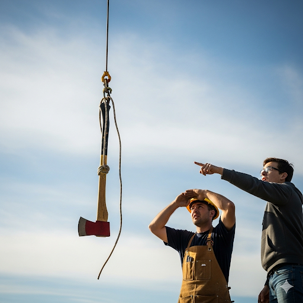

### IPA: /ˈeə.ri.əl/
### Class: adj
### Câu truyện ẩn dụ:
"E ơi, rìu ở đâu?" - người thợ mộc hỏi. Người kia chỉ lên trời: "E ơi rìu ở trên kia kìa!". Hóa ra là chiếc rìu được treo bởi một thiết bị cứu hộ **trên không**. Cứ "e ơi rìu ở" đâu là nhớ đến **trên không**.

### Định nghĩa : 
(Thuộc) trên không, trên trời.

### English definition: 
In or from the air.

### Sentence of stroy:
An **aerial** rescue team came quickly.

## 3. apparatus

### IPA: /ˌæp.əˈreɪ.təs/
### Class: n
### Câu truyện ẩn dụ:
"Áp ba ra Tết mới mua cho **thiết bị** này đó!" - cậu bé khoe với bạn bè. Đó là một **dụng cụ** thí nghiệm phức tạp mà cậu ao ước từ lâu.

### Định nghĩa : 
Thiết bị, dụng cụ.

### English definition: 
A set of equipment or tools or a machine that is used for a particular purpose.

### Sentence of stroy:
But Randy had an **apparatus** to get rid of the snow.

## 4. avalanche

### IPA: /ˈæv.əl.ɑːnʃ/
### Class: n
### Câu truyện ẩn dụ:
"A! Phải và lán ngay!" - người leo núi hét lên khi thấy một khối tuyết khổng lồ đang đổ xuống. Cả nhóm vội vàng chạy vào lán trú ẩn để tránh trận **tuyết lở**.

### Định nghĩa : 
Tuyết lở.

### English definition: 
A large amount of ice, snow, and rock falling quickly down the side of a mountain.

### Sentence of stroy:
If too much accumulated, it could cause an **avalanche**.

## 5. consistency

### IPA: /kənˈsɪs.tən.si/
### Class: n
### Câu truyện ẩn dụ:
Để nấu được nồi chè ngon, người đầu bếp nói: "Con cứ sờ tận tay, sờ đi sờ lại sẽ thấy **sự nhất quán**." Nghĩa là phải đảm bảo độ đặc của chè luôn giống nhau, thể hiện **sự kiên định** trong chất lượng.

### Định nghĩa : 
Sự nhất quán, sự kiên định.

### English definition: 
The quality of always behaving or performing in a similar way, or of always happening in a similar way.

### Sentence of stroy:
His upbringing had taught him **consistency**.

## 6. convection
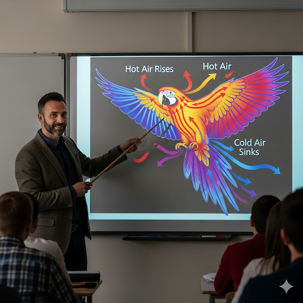

### IPA: /kənˈvek.ʃən/
### Class: n
### Câu truyện ẩn dụ:
Thầy giáo vật lý giải thích: "Không khí nóng đi lên, lạnh đi xuống, cứ như `con vẹt` bay `lượn` vậy đó. Quá trình đó gọi là **sự đối lưu**."

### Định nghĩa : 
Sự đối lưu.

### English definition: 
The movement of heat through a gas or liquid.

### Sentence of stroy:
**Convection** in the atmosphere is causing a lot of clouds to form.

## 7. discharge

### IPA: /dɪsˈtʃɑːdʒ/
### Class: v
### Câu truyện ẩn dụ:
Bệnh nhân vui mừng khoe: "Bác sĩ vừa `đít` vào tờ giấy `chạc` một cái là tôi được **xuất viện** ngay!" Cái dấu "đít chạc" đó chính là giấy phép cho ông được **ra viện**.

### Định nghĩa : 
Cho ra viện, cho xuất viện.

### English definition: 
To allow someone officially to leave somewhere, especially a hospital or a law court.

### Sentence of stroy:
After five days, Randy was **discharged** from the hospital.

## 8. intact
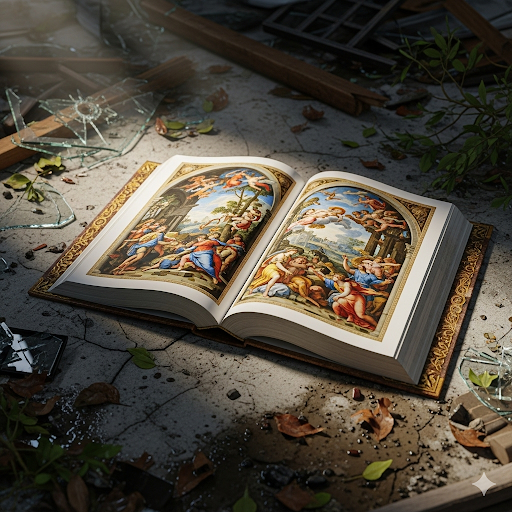

### IPA: /ɪnˈtækt/
### Class: adj
### Câu truyện ẩn dụ:
Sau trận bão, người ta tìm thấy một cuốn sách cổ được `in` hình các `tác` phẩm nghệ thuật. Dù mọi thứ xung quanh đều hư hỏng, cuốn sách vẫn **nguyên vẹn**, không bị hề hấn gì.

### Định nghĩa : 
Nguyên vẹn, không bị hư tổn.

### English definition: 
Not damaged or broken; complete.

### Sentence of stroy:
But the rest of you is still reasonably **intact**.

## 9. mortal

### IPA: /ˈmɔː.təl/
### Class: adj
### Câu truyện ẩn dụ:
Một vị thần nói với con người: "Các ngươi chỉ là những kẻ `mò` mẫm trong tăm tối và `tồ` tệch, vì các ngươi là **người trần mắt thịt**, không thể sống mãi được. Cuối cùng ai cũng **phải chết**."

### Định nghĩa : 
Phải chết, không thể sống mãi.

### English definition: 
(Of a person) subject to death.

### Sentence of stroy:
The experience had taught him a poignant lesson: he was a **mortal**, and nature was much more powerful than him.

## 10. omen
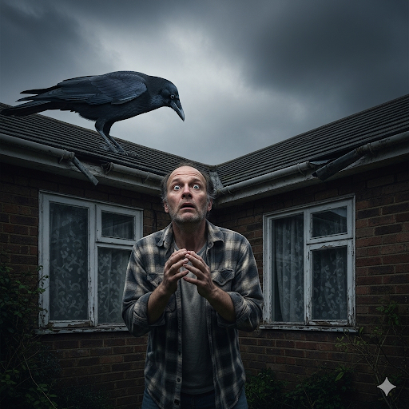

### IPA: /ˈəʊ.mən/
### Class: n
### Câu truyện ẩn dụ:
"Ô men!" - một người đàn ông la lên khi thấy một con quạ đen đậu trên mái nhà. Anh ta tin rằng đó là một **điềm báo** không lành.

### Định nghĩa : 
Điềm, điềm báo.

### English definition: 
Something that is considered to be a sign of how a future event will take place.

### Sentence of stroy:
Anybody else would have taken the dark sky as an **omen** of a very bad storm...

## 11. overcast
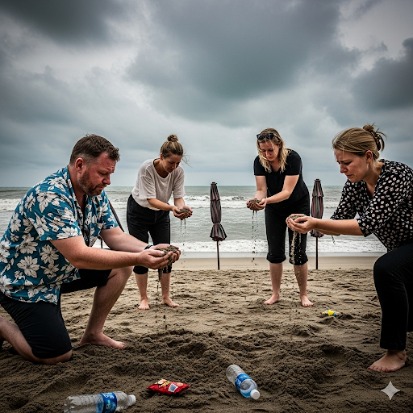

### IPA: /ˈəʊ.və.kɑːst/
### Class: adj
### Câu truyện ẩn dụ:
Du khách châu `Âu` đến Việt Nam, họ `vơ cát` lên chơi nhưng rồi lại thất vọng vì bầu trời **u ám**, mây đen che kín. Một ngày nghỉ trên bãi biển mà trời **đầy mây** thì thật là buồn.

### Định nghĩa : 
U ám, đầy mây.

### English definition: 
With clouds in the sky and therefore not bright and sunny.

### Sentence of stroy:
He went outside and looked at the **overcast** sky.

## 12. poignant
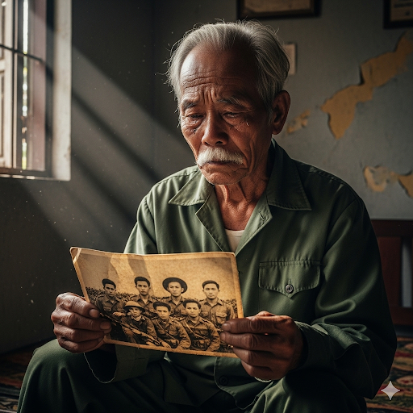

### IPA: /ˈpɔɪ.njənt/
### Class: adj
### Câu truyện ẩn dụ:
Người lính già nhìn tấm ảnh đồng đội đã hy sinh, ông chỉ nói một câu: "Thật `buốt nhói`!". Đó là một kỷ niệm **sâu sắc**, một nỗi đau **thấm thía** mà ông không bao giờ quên.

### Định nghĩa : 
Sâu sắc, thấm thía.

### English definition: 
Causing or having a very sharp feeling of sadness.

### Sentence of stroy:
The experience had taught him a **poignant** lesson...

## 13. ranger

### IPA: /ˈreɪn.dʒər/
### Class: n
### Câu truyện ẩn dụ:
Người **nhân viên kiểm lâm** bị lạc trong rừng. Anh ta chỉ biết ngồi xuống và `rên` rỉ `chờ` đợi đội cứu hộ đến.

### Định nghĩa : 
Nhân viên kiểm lâm.

### English definition: 
A person whose job is to protect a forest or natural park.

### Sentence of stroy:
Randy was a forest **ranger**.

## 14. rubble
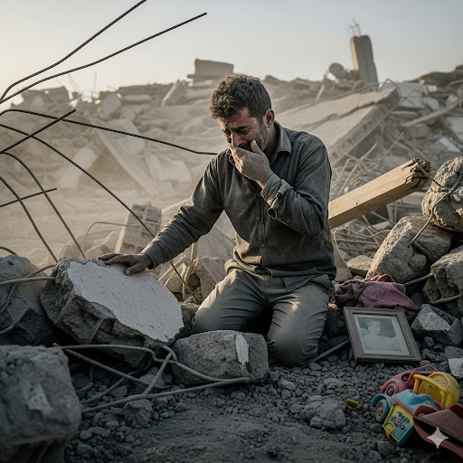

### IPA: /ˈrʌb.əl/
### Class: n
### Câu truyện ẩn dụ:
Sau trận động đất, ngôi nhà chỉ còn là một đống **đổ nát**. Một người sống sót `rờ` vào những `bồ` xi măng vỡ vụn và bật khóc. Khắp nơi chỉ toàn là **gạch vụn**.

### Định nghĩa : 
Gạch vụn, đống đổ nát.

### English definition: 
The piles of broken stone and bricks, etc. that are left when a building falls down or is destroyed.

### Sentence of stroy:
...he was knocked sideways and buried by the snow and **rubble** from an old cabin that had been destroyed.

## 15. seclude
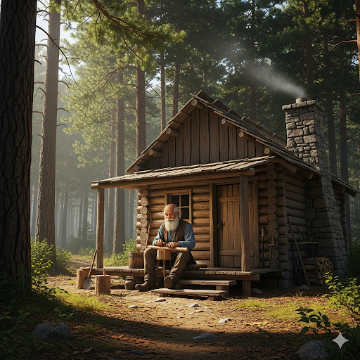

### IPA: /sɪˈkluːd/
### Class: v
### Câu truyện ẩn dụ:
Ông lão sống một mình trong rừng, ông `sợ` sự `khờ` dại và `lúc` nhúc của đám đông ngoài kia. Vì vậy, ông chọn cách **tách biệt** bản thân, sống một cuộc đời **ẩn dật**.

### Định nghĩa : 
Tách biệt, ẩn dật.

### English definition: 
To keep someone or something away from other people or things.

### Sentence of stroy:
Because of his job, he was **secluded** in a cabin in the wilderness.

## 16. sideways

### IPA: /ˈsaɪd.weɪz/
### Class: adv
### Câu truyện ẩn dụ:
Cậu bé làm điều `sai quấy` nên khi bị mẹ gọi, cậu không dám nhìn thẳng mà chỉ lén lút đi **sang ngang**, liếc nhìn về một phía.

### Định nghĩa : 
Theo chiều ngang, sang một bên.

### English definition: 
In a direction to the left or right, not forwards or backwards.

### Sentence of stroy:
...he was knocked **sideways** and buried by the snow and rubble...

## 17. sob
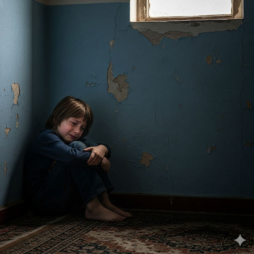

### IPA: /sɒb/
### Class: v
### Câu truyện ẩn dụ:
Đứa trẻ bị mẹ mắng, nó buồn quá liền ngồi thu lu một góc, hai vai rung lên từng chặp. Tiếng khóc `sụt sịt` của nó nghe như tiếng `xốp` bị bóp, đó là tiếng **khóc nức nở**.

### Định nghĩa : 
Khóc nức nở, thổn thức.

### English definition: 
To cry noisily, taking in deep, sudden breaths.

### Sentence of stroy:
...and saw his wife **sobbing**.

## 18. sober

### IPA: /ˈsəʊ.bər/
### Class: adj
### Câu truyện ẩn dụ:
Sau bữa tiệc, anh chàng say rượu chỉ muốn ăn một `tô bơ` để giã rượu. Anh ta nói: "Ăn xong `tô bơ` này tôi sẽ **tỉnh táo** ngay!". Gương mặt anh lúc đó cũng trở nên **nghiêm nghị** hơn hẳn.

### Định nghĩa : 
Tỉnh táo, không say; nghiêm nghị.

### English definition: 
Not drunk or affected by alcohol; serious and calm.

### Sentence of stroy:
He looked at the **sober** faces of the doctors...

## 19. speck

### IPA: /spek/
### Class: n
### Câu truyện ẩn dụ:
"Sao `sờ` vào `béc` thế này?" - người thợ sửa xe càu nhàu khi thấy một **hạt bụi** nhỏ xíu kẹt trong vòi phun xăng. Chỉ một **đốm nhỏ** như vậy cũng có thể gây ra hỏng hóc lớn.

### Định nghĩa : 
Đốm, vết, hạt (rất nhỏ).

### English definition: 
A very small mark, piece, or amount.

### Sentence of stroy:
Randy was just a **speck** amongst the great pile of snow...

## 20. upbringing

### IPA: /ˈʌpˌbrɪŋ.ɪŋ/
### Class: n
### Câu truyện ẩn dụ:
Cha mẹ luôn `ắp` đầy tình yêu thương và `rinh` về những điều tốt đẹp nhất cho con cái. Đó chính là **sự nuôi dưỡng** và **giáo dục** tuyệt vời nhất mà họ có thể dành cho con mình.

### Định nghĩa : 
Sự giáo dục, sự nuôi dưỡng (khi còn nhỏ).

### English definition: 
The way in which you are treated and educated when young, especially by your parents.

### Sentence of stroy:
His **upbringing** had taught him consistency.